`目录 {#index}

[TOC]


------

# 介绍
## DOS命令(掌握)

|             功能             |        DOS命令         |
| :--------------------------: | :--------------------: |
|           盘符切换           |        d: 回车         |
| 列出当前目录下的文件及文件夹 |     dir(directory)     |
|           创建目录           |           md           |
|           删除目录           |           rd           |
|           删除文件           |          del           |
|      进入指定的单级目录      |        cd 目录         |
|      进入指定的多级目录      | cd d:\\目录1\\目录2... |
|   回到当前所在盘符的根目录   |          cd\           |
|        退出DOS命令行         |          exit          |
|             清屏             |          cls           |


## java语言发展史(了解)
​	詹姆斯·高斯林（James Gosling）1977年获得了加拿大卡尔加里大学计算机科学学士学位，1983年获得了美国卡内基梅隆大学计算机科学博士学位，毕业后到IBM工作，设计IBM第一代工作站NeWS系统，但不受重视。后来转至Sun公司，1990年，与Patrick，Naughton和Mike Sheridan等人合作“绿色计划”，后来发展一套语言叫做“Oak”，后改名为Java。

​	SUN(Stanford University Network，斯坦福大学网络公司) 


## Java语言(理解)
- **特点**	
    开源 源代码开放
    跨平台 可以在任意操作系统中执行
- **跨平台原理**
    针对不同的平台提供对应的jvm,由 JVM来负责java程序在该系统中的运行。
```markdown
**注意**：
	java语言是跨平台的，但是jvm不是。
	write once ,run anywhere!(一处编译,到处运行)
```


### JDK,JRE,JVM的作用及关系

- **JDK(Java Development Kit	      Java开发工具包)** :
     用于开发java程序
     包含了Java开发工具,也包含了JRE

- **JRE ( java Runtime Environment     Java运行环境 ) ** : 
    用于保证java代码的执行
    包括JVM和Java程序所需的核心类库等

- **JVM(JAVA Virtual Machine              Java虚拟机)** : 
    保证java语言跨平台
    只要在需要运行java应用程序的操作系统上，先安装一个Java虚拟机(JVM Java Virtual Machine)即可。由JVM来负责Java程序在该系统中的运行。
```markdown
**
   JDK: JRE + tools
   JRE: JVM + class library(类库)
**
```


### JDK 安装路径下的目录  
|  目录   | 说明                                                         |
| :-----: | :----------------------------------------------------------- |
|   bin   | 该目录用于存放一些可执行程序,如 <br/>Javac.exe( java编译器 )、Jar.exe( 打包工具 )、 javadoc.exe( 文档生成工具 )等 |
|   db    | db目录是一个小型数据库。  <br/>从java 6.0 开始,Java中引用了一个新成员 javaDB, 支持 JDBC 4.0 的所有规范  <br/>在学习 JDBC 时,不需要再额外安装一个数据库软件,可以直接使用JavaDB即可 |
|   jre   | 包括 Java虚拟机,运行时的类包,Java 应用启动器以及一个 bin 目录,但不包含开发环境中的开发工具。 |
| include | 由于 JDK 是通过 C/C++ 实现的,因此在启动时需要引入一些 C 语言的头文件<br/>该目录是用来存放这些头文件的 |
|   lib   | Java 的类库或库文件,是开发工具使用的归档文件                 |
| src.zip | 为src文件夹的压缩文件, 放置的是 JDK 核心类的源代码,通过该文件可以查看java基础类的源代码。 |


## Java语言版本与平台
### Java语言版本

|    java语言版本    |                 别名                 |  发布日期  |
| :----------------: | :----------------------------------: | :--------: |
|     JDK 1.1.4      |           Sparkler	宝石           | 1997-09-12 |
|     JDK 1.1.5      |           Pumpkin	南瓜            | 1997-12-13 |
|     JDK 1.1.6      |     Abigail	阿比盖尔(女子名)      | 1998-04-24 |
|     JDK 1.1.7      | Brutus	布鲁图(古罗马政治家和将军) | 1998-09-28 |
|     JDK 1.1.8      |      Chelsea	切尔西(城市名)       | 1999-04-08 |
|      J2SE 1.2      |         Playground	运动场         | 1998-12-04 |
|     J2SE 1.2.1     |              none	无              | 1999-03-30 |
|     J2SE 1.2.2     |           Cricket	蟋蟀            | 1999-07-08 |
|      J2SE 1.3      |         Kestrel	美洲红隼          | 2000-05-08 |
|     J2SE 1.3.1     |           Ladybird	瓢虫           | 2001-05-17 |
|     J2SE 1.4.0     |           Merlin	灰背隼           | 2002-02-13 |
|     J2SE 1.4.1     |         grasshopper	蚱蜢          | 2002-09-16 |
|     J2SE 1.4.2     |            Mantis	螳螂            | 2003-06-26 |
| JAVASE 5.0 (1.5.0) |            Tiger	老虎             |            |
| JAVASE 5.1 (1.5.1) |          Dragonfly	蜻蜓           |            |
| JAVASE 6.0 (1.6.0) |           Mustang	野马            |            |
| JAVASE 7.0 (1.7.0) |           Dolphin	海豚            |            |


### Java 语言平台
#### J2SE(Java 2 Platform Standard Edition)标准版
> ​	是为开发普通桌面和商务应用程序提供的解决方案,该技术体系是其他两者的基础，可以完成一些桌面应用程序的开发

#### J2ME(Java 2 Platform Micro Edition)小型版
> ​	是为开发电子消费产品和嵌入式设备提供的解决方案

#### J2EE(Java 2 Platform Enterprise Edition)企业版
> ​	是为开发企业环境下的应用程序提供的一套解决方案,该技术体系中包含的技术如 Servlet、Jsp等，主要针对于Web应用程序开发 


# 一、JAVA SE基础
## 第一个 Java 程序

### 环境变量(掌握)

**为什么要配置环境变量:**
	为了保证 JDK 的 `bin` 目录的 `exe` 应用程序可以在任意目录下。  

**怎么配置**

- **静态配置方式:**
    直接把 JDK 的 bin 目录配置到 path 环境变量的最前边。

- **动态配置方式:**

    - 新建 **JAVA_HOME** 变量，值为 JDK 的安装目录, 如 `D:\Developer\IDE\java\jdk1.8.0_102`

    - 修改 **path** 环境变量，格式：
        	`%JAVA_HOME%\bin;` 以前的 path 内容。

    - 新建 **classpath** 变量,添加值为 :
        ```
 .;%Java_Home%\bin;%Java_Home%\lib\dt.jar;%Java_Home%\lib\tools.jar
        ```

    


**验证是否配置成功**

> 点击确认关闭刚才的配置页面，这一步一定要做，否则刚才的配置不能生效

- 点 `Win键`->运行（或者使用win+r)
- 输入 `cmd` 命令, 输入 `java -version`
- 如果出现版本信息，表明配置成功
- 如果失败了，调整前面的配置，然后要**重新启动cmd命令**,而不是在原有的cmd里面输入 `java -version`  

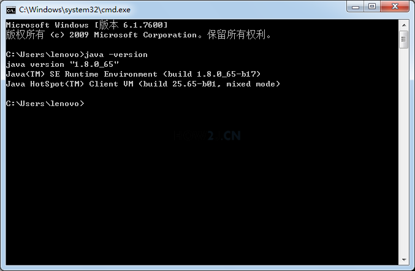

 


### HelloWorld案例(掌握)

类的定义格式：

```java
// java语言的最基本的单位是类。
class 类名 {
	类体;
}
```

代码如下：
```java
class HelloWorld {										// 定义了一个类，类名是HelloWorld。
	// 由于jvm会自动去调用main方法才能执行，所以一般我们写一个main方法。
    public static void main(String[] args) {
        // 为了让我们在控制台能够看到东西，使用输出语句。
		System.out.println("HelloWorld");		
	}	
}
```
**针对常见问题，我们对目前写的程序做一些简答的规范**
>  A:	类名和文件名最好一致。( 可以不一样 )
>  B:	java语言是区分大小写的。
>  C:	括号是成对出现的。
>  D:	遇到非法字符，肯定是中文的问题。
>  E:	一旦修改了源代码，必须通过javac命令重新编译。


#### main 方法的格式详细解释

```java
class Demo_Static {
	public static void main(String[] args) {
        // public 被jvm调用，访问权限足够大。
        // static 被jvm调用，不用创建对象，直接类名访问,不用先 new 一个 Demo_Static
        // void被jvm调用，不需要给jvm返回值
        // main 一个通用的名称，虽然不是关键字，但是被jvm识别
        // String[] args 以前用于接收键盘录入的
        
		for (int i = 0;i < args.length ;i++ ) {
			System.out.println(args[i]);		// 打印命令行参数
		}
        // java Demo_Static 参数1 参数2 参数3
    }
}
```


### java程序的开发流程

- A:编写 java 源代码。后缀名 `.java`

- B:通过 javac 命令编译 java 源文件(有后缀名) (  `javac.exe` 在 `bin` 目录下,在没有配置` java` 环境的情况下,以下命令是无法直接运行的 )

  ```
  javac 文件名.java
  ```

- C:通过 java 命令执行字节码文件(无后缀名)
  ```
  java 文件名
  ```


### 版本兼容性


## Java 基础语法

### 1.注释

对程序进行解释说明，提高程序的可阅读性。
```java
// 单行注释,单行注释可以嵌套

/*  多行注释 
	多行注释不能嵌套
*/

/**
文档注释
文档注释不能嵌套
*/
```


### 2.关键字与标识符
#### 关键字
> 被 Java 语言赋予特定含义的单词,组成关键字的字母, 全部都是小写
> **goto** 和 **const** 作为保留字存在,目前并不使用,但也是关键字
> 关键字不能作为类、接口、方法、变量等起名字时使用的字符序列


#### 标识符
> 给类、接口、方法、变量等起名字时使用的字符序列,由 **`英文大小写`、`数字字符` `$和_ `** 组成

**注意事项:**
```markdown
- 不能以数字开头
- 不能是 java 中的关键字
- 区分大小写
- 名字不要用空格隔开
```


### 3.常量、变量与数据类型
#### 1 常量与变量

##### 常量

>  在程序运行的过程中值不发生变化

**常量分类**

|  常量分类  |                            说明                            |
| :--------: | :--------------------------------------------------------: |
|  整数常量  |                       表示所有的整数                       |
|  小数常量  |                       表示所有的小数                       |
|  布尔常量  |                  只有两个值，true和false                   |
|  字符常量  | ''括起来的内容。在一般情况下，''里面括起来的只能是一个字符 |
| 字符串常量 |                     由""括起来的内容。                     |
|   空常量   |                            null                            |

```java
class ConstDemo {
	public static void main(String[] args) {
		//输出整数常量
		System.out.println(100);
		//输出小数常量
		System.out.println(3.1415926);
		//输出布尔常量
		System.out.println(true);
        
		//输出字符常量
		//错误做法：System.out.println('AB');
		System.out.println('中');
		System.out.println('1');
		//输出字符串常量
		System.out.println("Hello World!");

		//输出空常量,( 不能够直接输出空常量 )
		//System.out.println(null);
	}
}
```


##### 变量
> 变量的定义是： 用来命名一个数据的标识符
> 在程量序执行的过程中,在某个范围内其值可以发生改变的 
> 用于不断存放同一类型的常量,并且可以反复使用

**变量的定义和使用格式：**

```markdown
A:  数据类型 变量名(合法的标识符) = 初始化值;

B:	数据类型 变量名;
	变量名 = 初始化值; 

** 注意：变量在使用前，一定要有值。**
```

###### 命名规则
- 变量命名只能使用**字母 数字 $ _**  
- 变量第一个字符 只能使用 字母 $ _  
- 变量第一个字符 不能使用数字  

> **注意**：_ 是下划线，不是-减号或者—— 破折号
> 中文也是可以用来命名变量的, 但是在实际工作中。。。**别这么干。**


###### 变量的作用域

> 变量处于不同的位置，有不同的名称, 分别是 **字段，属性, 参数, 局部变量** 
> 不同名称的变量，其作用域是不一样的  

**字段，属性，Field**

> 当一个变量被声明在类下面,这个变量就叫做**字段** 或者**属性**、**成员变量**、**Field**
> 
> 

```java
public class HelloWorld {
    int i = 1;
    int j = i;  				//其他的属性可以访问i
    public void method1(){
        System.out.println(i); 	//方法1里可以访问i
    }
    public void method2(){
        System.out.println(i); 	//方法2里可以访问i
    }
}
// 比如变量i,就是一个属性。
// 那么从第2行这个变量声明的位置开始，整个类都可以访问得到
// 所以其作用域就是从其声明的位置开始的整个类
```


**参数**

> 如果一个变量，是声明在一个方法上的，就叫做**参数**
> 参数的作用域即为该方法内的所有代码
> 其他方法不能访问该参数
> 类里面也不能访问该参数

```java
public class HelloWorld {
	public void method1(int i){ 	//参数i的作用域即方法method1
		System.out.println(i);
	}
	public void method2(){ 
		System.out.println(i); 		//报错! method2 不能访问参数i
	}
	int j = i;  					//报错!类里面也不能访问参数i
}
```


**局部变量**

> 声明在方法内的变量，叫做局部变量 
> 其作用域在声明开始的位置，到其所处于的块结束位置
> 所有局部变量都存放在栈里面。

```java
public class HelloWorld {
    public void method1() {
        int i  = 5;  				//其作用范围是从声明的第4行，到其所处于的块结束12行位置
        System.out.println(i);
        {            					//子块
            System.out.println(i); 		//可以访问i
            int j = 6;
            System.out.println(j); 		//可以访问j
        }
        System.out.println(j); 			//报错!不能访问j,因为其作用域到第10行就结束了
    }
 
}
```


###### 变量 final

> final 修饰一个变量，有很多种说法，比如不能改变等等 
> 准确的描述是 当一个变量被final修饰的时候，该变量**只有一次赋值的机会**

**在声明的时候赋值**

```java
public class HelloWorld {
    public void method1() {
        final int i = 5;       
        i = 10; 					//i在第4行已经被赋值过了，所以这里会出现编译错误      
    }
}
```


**在声明的时候没有赋值**

> **如果在声明的时候未赋值，那么可以在后面代码进行唯一的一次赋值**

```java
public class HelloWorld {
    public void method1() {
        final int i;        
        i = 10; 			//i在第4行，只是被声明，但是没有被赋值，所以在这里可以进行第一次赋值   
        i = 11; 			//i在第6行已经被赋值过了，所以这里会出现编译错误       
    }
}
```

>  final 除了修饰变量，还可以修饰类，修饰方法，这些都在后续的章节展开


#### 2 数据类型

> java 语言是**强类型**语言,对于每一种数据斗定义了明确的具体数据类型,在内存中分配了不同大小的内存空间


**Java中数据类型的分类:**
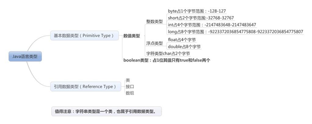

##### (1) 引用数据类型
> 详情请跳转至面对对象部分讲解,常见的字符类 String 都属于应用数据类型


**引用类型变量的创建**
> 引用类型变量的创建分为两步：**声明和初始化**

- 声明只在栈内分配内存（存储引用，或者说存储内存地址）
- 初始化在堆或者方法区分配内存（存储实际的数据）
    - new出来的东西放在堆里面
    - 程序运行常量放在方法区里面

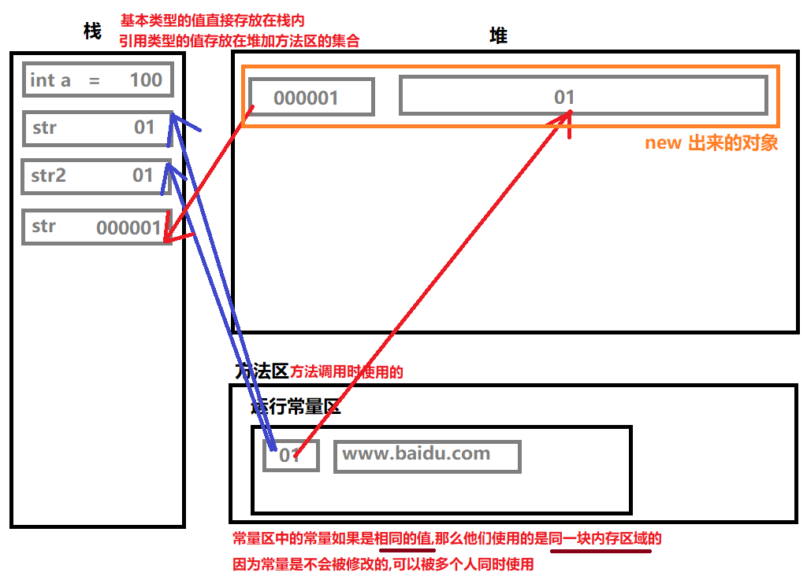

**注意:**

```markdown
	引用类型占据两个空间,一个是栈的值, 占一个内存地址的字节;另一个是初始化后,堆内的真正存放内容的空间
```


##### (2) 基本数据类型( 4类8种 )

> 基本类型变量声明出来不管是否赋值，都已经分配了内存。( **一旦声明,必分内存** )

###### 1) 整数类型
| 数据类型   | 数据类 | 占据字节 |        数据范围        |
| :------: | :------: | :------: | :--------------------: |
|   byte   |   class java.lang.Byte   |  1 字节  |        -128~127        |
|  short   | class java.lang.Short |  2 字节  | $-2^{15}$ ~ $2^{15}-1$ |
|   int    | class java.lang.Integer |  4 字节  | $-2^{31}$ ~ $2^{31}-1$ |
|   long   |   class java.lang.Long   |  8 字节  | $-2^{63}$ ~ $2^{63}-1$ |

```markdown
**注意**:
	整数默认是int类型。long类型加后缀L或者l。
```

###### 2) 浮点类型

|   数据类型      | 数据类 | 占据字节 |        数据范围        |
| :-----------: | :------: | :------: | :--------------------: |
| float(单精度) | class java.lang.Float |  4 字节  |  -3.403E38 ~ 3.403E38  |
|     double     | class java.lang.Double |  8 字节  | -1.798E308 ~ 1.798E308 |

```markdown
**注意**:
	浮点数默认是double类型。float类型后必须加后缀F或者f。

例如:
	float f = 12.3;								// 报错, 可能损失进度
	// 因为12.3 默认是double类型, 占八个字节。正确写法为 float f = 12.3f;
```

###### 3) 字符类型
| 数据类型 | 数据类 | 占据字节 | 数据范围 |
| :------: | :------: | :------: | :------: |
|   char   | class java.lang.Character |  2 字节  | 0~65535  |

```markdown
面试题：java中的char类型是否可以存储一个中文，为什么?
	可以。原因是 java 采用的unicode编码方法，这个编码用两个字节表示一个字符
```


###### 4) 布尔类型
| 数据类型 | 数据类 |                    说明                     |
| :------: | :------: | :------------------------------------: |
| boolean  | class java.lang.Boolean | 理论上占八分之一字节<br/>因为一个开关就可以决定 true 和 false   <br/>但是 **Java 中 boolean 类型并没有明确指定他的大小** |

###### 注意:
- boolean 类型是没办法跟其它类型进行运算的

    > 在 C/C++ 中是可以和其他类型进行运算的,因为 C/C++ 中, 0 就代表 false, 非零就代表 True

- float 表示的数据范围比 long 的范围要大
    ```markdown
    float 虽然只有占4个字节,但是它的类型等级比 long 要高,**原因是他们底层的存储结构不同**:
    float 是根据IEEE 754 规范进行计算:
    	float 共占4个字节,共32个二进制位
    	1位表示符号位,23位表示尾数位,8位表示指数位
    	指数为有 00000000 ~ 11111111 为 0~255,而0代表0,255代表无穷大,所以范围为 1 ~254
    	因为有正负所以要两边各减去126,所以 指数为代表的范围为 -126 ~ 127
    
    而 long 类型的指数范围只有 63
    ```

- 任何数据类型用 + 与字符串相连接都会产生新的字符串
    ```java
    class Demo {
    	public static void main( String[] args){
    		System.out.println( "hello" + 'a' + 1 );// helloa1   char/int --> 字符串
    		System.out.println( 'a' + 1 + "hello" );// 98hello   char --> int --> 字符串
            System.out.println( "5+5=" +  5 + 5 );				 // 5+5=55
            System.out.println( "5+5=" + (5 + 5) );				 // 5+5=10
    	}
    }
    ```

    


##### (3) 数据类型转换
###### 隐式转换：
> 小的数据类型转换大的数据类型
```java
// 面试题:
byte b1=3,b2=4,b;
b=b1+b2;
//出错因为在JAVA虚拟机中,整数默认是int类型转换，虚拟机不知道 b1,b2 中的数值到底是多少，所有会抛出可能损失精度的错误;
                   	
//虚拟机会把  b1,b2  转换成 int类型在进行运算，两个int类型的数值相加结果任然是int类型，int类型 不能赋值给 byte类型

```

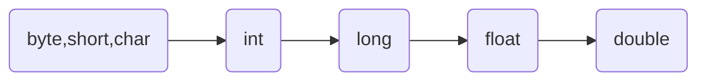


###### 强制转换：
```java
class Demo_byteToInt {
	public static void main( String[] args){
		byte a = 3, b = 4, c;
		c = a+b; 								// 报错,因为整数默认是int类型
        c = (byte)( a + b );					// 强制类型转换
		
		System.out.println("Hello World!");
	}
}
```

**注意事项:**
> 如果超出了被赋值的数据类型的取值范围, 得到的结果会与你期望的结果不同
```java
class Demo_byteToInt {
	public static void main( String[] args){
		byte b = (byte)(126 + 4 );
		System.out.println( b );						// -126,原来应该为 130的
	}
}
// 00000000 00000000 00000000 10000010	  130 的二进制数( 补码的形式 )
// 10000010								  转换成 byte 类型, 砍掉前三个高位,所以符号位变为1,为负
// 10000010								  补码形式,要转换成源码,现在要象转换成源码
// 10000001								  补码 -1 求反码
// 11111110								  反码符号位不变进行置换, 得到原码,数值为 -126
```


##### (4) java 获取变量的类型
> java对于简单类型变量，是无法直接获得变量类型的；要想获取，必须自定义函数进行返回
> 对于包装类型变量，是可以直接获得的，变量名称 **.getClass().getName();**

```java
class Test { 
    public static void main(String[] args) { 
        int i=1; 							// int类型变量,其他类型也可使用
        System.out.println(getType(i)); 	// 打印变量类型为 class java.lang.Integer
    } 
    
    public static String getType(Object o){ // 获取变量类型方法
        return o.getClass().getName(); 		//使用 getClass() 方法
    } 
}
```


### 4 进制转换:
#### 进制:
> 就是人们计数的一种方式, 8个1,0这样的数据就是计算机存储的组基本单位，叫字节，`byte`
> 1,0这样的数据我被我们称为比特位，`bit`
> java语言中对整数有4种表现形式，JDK7.0 以后多了二进制

```
1byte = 8bit
1k = 1024byte
```

**二进制** : 0,1 组成，用 0b 做前缀表示( JDK7.0 以后才有的表现形式 )
**八进制** : 0-7 组成，用 0 做前缀表示
**十六进制** : 0-9,a,b,c,d,e,f,(大小写均可以) ,用 0x 做前缀表示


```java
class Demo_sale {
	public static void main(String[] args) {
        // 二进制表现形式
        System.out.println(0b1011); 		// 11 
        // 八进制表现形式
        System.out.println(013);			// 11
        // 十进制表现形式
		System.out.println(11);				// 11
		// 十六进制表现形式
		System.out.println(0xb);			// 11
	}
    // 输出会自动换算成十进制。
}
```


#### 原码、反码与补码
> 数值在内存中是以补码的形式储存的,也是以补码的形式进行运算的

**有符号数据表示法:**
有三种形式，原码，反码，补码, 规则如下：
	**正数**：正数的原码，反码，补码都一致。
	**负数**：
		负数的原码和正数的区别是最高位是1。表示符号位。
		负数的反码和负数的原码的区别是：符号位不变，数值位1变0,0变1。
		负数的补码是负数的反码+1。

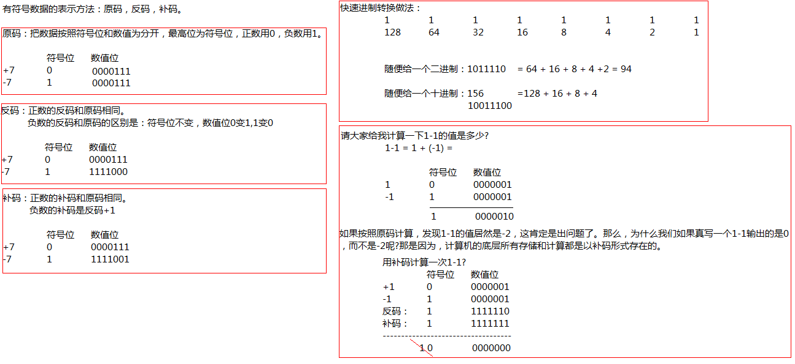


### 5 运算符:
#### 与运算符 & 与 &&:
> **& 的用法:** 有 0 则 0
```java
System.out.println( 6 & 3 )					// 结果为2
/**
    110
&   011
--------
    010										// 2
*/
```

**&& 和 & 的区别:**

> 最终的结果是一样的
> **&& 具有短路效果, 左边是 true, 右边就不执行**


#### 或运算符 | 与 ||:
> **| 的用法:** 有 1 则 1
```java
System.out.println( 6 | 3 )					// 结果为7
/**
    110
|   011
--------
    111										// 7
*/
```

**|| 和 | 的区别:**

> 最终的结果是一样的
> **&& 具有短路效果, 左边是 false, 右边就不执行**


#### 非运算符 ~:

> 按位取反
```java
System.out.println( ~6 )					// 结果为 -7
/**
00000000 00000000 00000000 00000110			// 6的原码反码补码都是本身,计算机底层计算是按补码计算
11111111 11111111 11111111 11111001			// 按位取反,这还是补码
11111111 11111111 11111111 11111000			// -1 推出反码
10000000 00000000 00000000 00000111			// 保留符号位取反得原码 -7
*/
```


#### 异或运算 ^:

> **^ 的用法:** 相同则 0 ,不同则 1
> 一个数对另一个数位异或两次,该数本身不变

```java
System.out.println( 6 ^ 3 );					// 结果为5
/**
    110
^   011
--------
    101											// 5
*/
System.out.println( 5 ^ 10 ^ 10 );				// 5
System.out.println( 5 ^ 10 ^ 5 );				// 10
```

```java
// 面试题: 实现两个整数变量的交换( 不需要定义第三方变量 )
int x = 10,y = 5;

//第一种方法:  弊端是两个数够大的话可能超出 int 的范围
x = x + y;						// x = 15, y = 5
y = x - y;						// x = 15, y = 10
x = x - y;						// x = 5,  y = 10

// 第二种方法:
x = x ^ y;						// x = 10 ^ 5
y = x ^ y;						// x = 10 ^ 5, y = 10 ^ 5 ^ 5 = 10
x = x ^ y;						// x = 10 ^ 5 ^ 10 = 5
```


#### 位移运算符 << 和 >> 和 >>>:
> **左移运算符 >> 的用法:** 最高位丢弃,右边补齐 0 
> 向左移动几位就是乘以 2 的几次幂
```java
System.out.println( 12 << 1 );				// 24
System.out.println( 12 << 2 );				// 48
/**
    00000000 00000000 00000000 00001100		// 12 的补码
 (0)0000000 00000000 00000000 000011000		// 左移一个位,右边补0, 为24的补码
(00)000000 00000000 00000000 0000110000		// 左移两个位,右边补0, 为48的补码
*/
```


> **右移运算符 >> 的用法:** 最高位是0,左边补齐0, 最高位是1, 左边补齐1
> 向右移动几位就是除以 2 的几次幂
```java
System.out.println( 12 << 1 );				// 6
System.out.println( 12 << 2 );				// 3
/**
    00000000 00000000 00000000 00001100			// 12 的补码
    000000000 00000000 00000000 0000110(0)		// 右移一个位,最高位为0,左边补0, 为6的补码
    0000000000 00000000 00000000 000011(00)		// 右移两个位,最高位为0,左边补0, 为3的补码
*/
```


> **无符号右移的用法:**  无论最高位是 0 还是 1, 左边补齐0
```
System.out.println( 12 << 1 );				// 6
System.out.println( 12 << 2 );				// 3
/**
    00000000 00000000 00000000 00001100			// 12 的补码
    000000000 00000000 00000000 0000110(0)		// 右移一个位,最高位为0,左边补0, 为6的补码
    0000000000 00000000 00000000 000011(00)		// 右移两个位,最高位为0,左边补0, 为3的补码
*/
```


#### 运算符++:

面试题:

```java
class Demo_1 {
	public static void main( String[] args){
		int x = 4;
		int y = (x++)+(++x)+(x*10);
		System.out.println("x = " + x + ",y = " + y );
	}
	// int y = (4) + (6) + (60)
	// int y = (先调用x加给y,再加加,此时x=5) + (先加加再调用给y,5++=6) + (60)
}
```

##### 运算符++的底层会进行强制类型转换

```java
class Demo_2 {
	public static void main( String[] args){
		byte b = 10;		// byte类型
		b++;				// b = (byte)(b + 1)
		// b = b + 1;		会报错,精度缺失,因为 b+1后类型提升为 int, 而 b 还为 byte类型
		System.out.println(b);
	}
}
```


### 6 控制语句
#### if选择语句
##### 语法格式
```java
if(比较表达式) {
	语句体1;
}else if{
	语句体2;
}else {
	语句体3;
}
```

#### switch语句的格式
##### 语法格式
```java
switch(表达式) {
    case 值1：
        语句体1;
        break;
    case 值2：
        语句体2;
        break;
    default：	
        语句体n+1;
        break;
}
// case后面只能是常量，不能是变量，而且，多个case后面的值不能出现相同的
```

> **注意: **
> ​	基本数据类型可以接收 byte, short, char, int ( **只要能自动提升为 int 的类型都可以** )
> ​	引用数据类型可以接收枚举(JDK1.5), String字符串(JDK1.7)


#### for/while/do...while 循环结构 
##### 语法格式:

```java
for( 初始化表达式; 条件表达式; 循环后的操作表达式 ) {
	循环体;
}
```
```java
while( 判断条件语句 ) {
    循环体语句;
    控制条件语句;
}
```
```java
do {
    循环体语句;
    控制条件语句;
}while( 判断条件语句 );
```

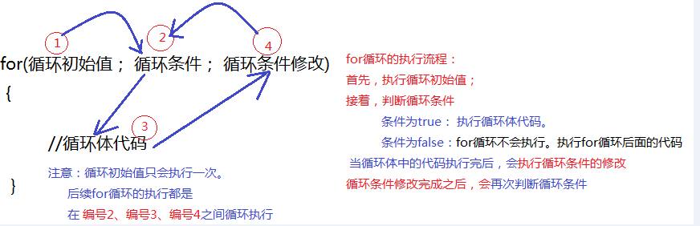


##### 三种循环语句的区别:

- **do...while 循环至少执行一次循环体。**

    > 而 for,while 循环必须先判断条件是否成立，然后决定是否执行循环体语句。

    

- **for 循环和 while 循环的区别：**

    > 如果你想在循环结束后，继续使用控制条件的那个变量，用while循环，否则用for循环。
    > 不知道用谁就用for循环。因为变量及早的从内存中消失，可以提高内存的使用效率。


#### return , break , continue 使用:
##### return 的作用
> 返回值
> 它的作用不是结束循环的，而是结束方法的。
##### break 的使用场景
> 只能在switch和循环中 


##### continue 的使用场景
> 只能在循环中 


##### return , break , continue 的区别?
> return 是结束方法
> break 是跳出循环
> continue 是终止本次循环继续下次循环


#### 增强型 For 循环

> 增强型for循环在遍历一个数组的时候会更加快捷

##### 语法格式

```java
public class Demo {
    public static void main(String[] args) {
        int values [] = new int[]{18,62,68,82,65,9};
        //常规遍历
        for (int i = 0; i < values.length; i++) {
            int each = values[i];
            System.out.println(each);
        }
         
        //增强型for循环遍历
        for (int each : values) {
            System.out.println(each);
        }
         
    }
}
```


### 7 键盘录入 Scanner 类

**语法格式:**

```java
import java.util.Scanner; 							// 在 class 上面导包
class Demo {
    public static void main( String[] args){
        Scanner sc = new Scanner(System.in);		// 创建键盘录入对象	
		int x = sc.nextInt();						// 通过对象获取数据
    }
}
```


### 8 字符串 String 类
#### 字符串分类
##### 字符串常量
> 需要使用””双引号引起来

```java
“234” “sdfsdf” “中国”
```


##### 字符串变量
> 是一种引用数据类型,有两种常用的创建方式, 都一样

```java
String str = ”character”;							// 双引号
String str = new String(”character”);				// 创建字符串对象
```

**注意: 两种创建方法是有差异的 ** 

```java
// 两种创建方法生成的值是不一样的
public class StringDemo{
	public static void main(String[] args){
		String str = "www.baidu.com";
		String str2 = "www.baidu.com";
		String str3 = new String("www.baidu.com");
		
		System.out.println( str==str2 );		// true
		System.out.println( str==str3 );		// false
	}
}
```


#### 字符串的特性

- **字符串无法被修改, 但是字符串对象可以引用别的字符串。**

- **通过+ 可以直接对字符串(或者其他数据类型)常量和变量做连接操作**

    ```java
    System.out.println(str1);
    System.out.println(str1+str2);
    System.out.println(str1+2134+true+'a'+2.3);
    // 任何数据类型用 + 与字符串相连接都会产生新的字符串
    ```

    


#### 字符串 API

|            作用            | 方法                                                         |                             备注                             |
| :------------------------: | :----------------------------------------------------------- | :----------------------------------------------------------: |
|       获取字符串长度       | s**.length()**;                                              |                                                              |
| 去除空格(前后, 不包括中间) | s**.trim()**;                                                |                                                              |
|     查找子字符串的位置     | s.**indexOf( **str, int **)**;<br />s**.lastIndexOf(**  str, index **)**; | indexOf() 从前向后查找<br />lastIndexOf();从后往前找<br />满足条件的返回首字母下标<br />不满足条件返回 -1 |
|     获取指定位置的字符     | s**.charAt(** int **)**;                                     |            索引超出范围会报错! <br />不能访问负数            |
|        获取子字符串        | s**.substring(** begin **)**;<br />s**.substring(** begin, end **)**; |                 包含开头索引, 不包含结束索引                 |
|         字符串分割         | s**.split(**  str **)**; <br />s**.split(**  str, int limit **)**; |                                                              |
|         字符串替换         | s.**replace(** old, new **)**;                               |                                                              |
|     判断字符串是否相等     | s.**equals(** str **)**;<br />s**.equalsIgnoreCase(**str **)**; | **==**比较的是变量存储的值,不是字符串<br />详情请看字符串分类<br />**equalsIgnoreCase:** 忽略大小写 |
|  判断是否包含某个子字符串  | s**.contains(** String str **)**;                            |                         返回 boolean                         |
|     判断字符串是否为空     | s.**isEmpty()**;<br />                                       | **空字符串的两种状态:** <br />空字符串`String s = “”;` <br />空对象 `String s = null;`<br />**空对象是没办法调用方法的** |
|      判断字符串的开始      | s**.startsWith(** Str  **)**;                                |                                                              |
|      判断字符串的结尾      | s**.endsWith(** Str **)**;                                   |                                                              |

**例子:**

```java
public class StringDemo02{
	public static void main(String[] args){
		String str = "www.baidu.com";
		
		// 获取字符串长度	
		System.out.println( '获取字符串长度' + str.length() );	// 13
		
        // 去除空格(前后, 不包括中间)
		String str2 = "        www.baidu.com      ";
        System.out.println( '|' + str2.trim() + '|' );		// |www.baidu.com|
        
        // 查找子字符串的位置
		System.out.println( str.indexOf("baidu") );			// 4
        System.out.println( str.indexOf(97) );				// 查找的是字符 a
        
        // 获取指定位置的字符
        System.out.println( str.charAt(0) );				// w
        
        // 获取子字符串
        System.out.println( str.substring(4) );				// baidu.com
        System.out.println( str.substring(4,9) );			// baidu
        
        // 判断字符串的开始和结尾
        System.out.println( str.startsWith("www") );		// true
        System.out.println( str.startsWith("") );			// true
        System.out.println( str.endsWith(".com") );			// true
        
        // 判断字符串是否相等
        String str3 = "www.baidu.com";
		String str4 = "www.baidu.com";
		String str5 = new String("www.baidu.com");
		System.out.println( str3==str4 );				// true
		System.out.println( str3==str5 );				// false  详情请见 '字符串分类'
        System.out.println( str3.equals(str4) );		// true
        System.out.println( str3.equals(str5) );		// true
        
        // 判断是否包含某个子字符串
        System.out.println( str.contains("baidu");		// true
        
        // 字符串分割
        String[] strs = s.split("\\.");
        for(String temp : strs){
			System.out.println(temp);
		}
	}
}
```


#### 字符串转数字

>调用 Integer 的静态方法 parseInt( str ) 

```java
public class TestNumber {
    public static void main(String[] args) {
        String str = "999";     
        int i= Integer.parseInt(str);    
        System.out.println(i);   
    }
}
```


### 9 数组 Array
> 数组可以存储多个类型一致的元素。（任意类型）
> 数组是一个**固定长度**的，包含了**相同类型**数据的 **容器**


#### 声明

**第一种声明方式:**

```java
// 一维数组
数组元素类型[] 数组名；

// 二维数组
数据类型[][] 数组名;
```

**第二种声明方式:**

```java
// 一维数组
数组元素类型 数组名[];

// 二维数组
数据类型 数组名[][];
```

**注意**：

> 没有初始化的数组是无法使用的。（可以初始化为null）

**例子:**

```java
int[] scoreArray;				//int scoreArray[];
boolean[] scoreArray;
char[] scoreArray;
String[] scoreArray;			
```


#### 初始化
##### 初始化的时间
> 可以在声明的时候直接初始化 , 也可以先声明后初始化
> 初始化的时候必须确定数组的长度
```JAVA
// 第一种方式：按照默认值初始化 0 
int[] shuzu = new int[3];
int[][] shuzu = new int[4][5];

// 第二种方式：长度根据元素个数确定
int[] shuzu = new int[]{3,32,34};
int[][] shuzu = new int[4][];					
// { null,null,null,null } 这里的每个一维数组的长度是可以不一样的。
shuzu[0] = new int[1];							
shuzu[1] = new int[2];

// 第三种方式：上面的简化版本，根据元素个数确定数组长度
int[] shuzu = {23,234,23,4}
int[][] shuzu = {{2,5},{1},{3,2,4},{1,7,5,9}};			
// 可以加 new int[][],但是中括号里面不能写数字
```

#####  初始化数据类型的默认值
> 基本类型是0（0     0.0     0所代表的字符      false  ）
> 引用类型是null

##### 数组的填充

>  在数组初始化时,自定义设置数组的默认值不为 `0` 或 `null`

```java
import java.util.Arrays;
public class ArrayDemo01{
	public static void main(String[] args){	
		int[] b = new int[100];
		Arrays.fill( b,100 );
		System.out.println(b[0]);				// 100
		System.out.println(b[1]);				// 100
		System.out.println(b[99]);				// 100
	}
}
```


#### 使用
> 通过索引访问数组里面元素，索引是从0开始。

##### 访问方式：
```java
// 一维数组
数组名[索引]         	  //可以访问值，也可以设置值
    
// 二维数组
数组名[索引][索引]			// 通过数组名[索引] 得到的是一维数组，完全可以当做一维数做来使用
```

##### length 获取数组长度:

``` java
数组名.length			 // 这里的length是属性，不是方法，不需要加括号
```


##### arraycopy 数组的复制与合并:

> **System.arraycopy(src, srcPos, dest, destPos, length)**
>
> src: 		源数组
> srcPoint: 	从源数组复制数据的起始位置
> dest: 	     目标数组
> destPoint:      复制到目标数组的启始位置
> length: 	   复制的长度  

###### 数组的复制

```java
public class HelloWorld {
    public static void main(String[] args) {
        int a [] = new int[]{18,62,68,82,65,9}; 
        int b[] = new int[3];				//分配了长度是3的空间，但是没有赋值
         
        //方法一： for循环       
        for (int i = 0; i < b.length; i++) {
            b[i] = a[i];
        }
        
        //方法二: System.arraycopy(src, srcPos, dest, destPos, length)      
        System.arraycopy(a, 0, b, 0, 3);
         
        //把内容打印出来
        for (int i = 0; i < b.length; i++) {
            System.out.print(b[i] + " ");
        }
 
    }
}
// 输出结果:
// 18 62 68
```


###### 数组的合并

```java
public class ArrayMerge {
    public static void main(String[] args) {
        int a [] = new int[]{18,62,68,82,65,9}; 
        int b[] = new int[3];
		int c[] = new int[9];
          
        System.arraycopy(a, 0, c, 0, 6);
		System.arraycopy(b, 0, c, 6, 3);
		print(c);
    }
	
	public static void print( int list[] ){
		for (int i = 0; i < list.length; i++) {
            System.out.print( list[i] + ",");
        }
	}		
}
// 输出结果:
// 18,62,68,82,65,9,0,0,0,
```


##### 数组的赋值:
> 详情请跳转至 `引用数据类型` 和 `字符串分类` 查看
```java
public class ArrayDemo01{
	public static void main(String[] args){
		int[] a = {1,2,3,4,5};
		int[] b = new int[5];
		System.out.println(a[0]+" "+b[0]);			// 1 0
		b[0]=a[0];									// 赋值      
		System.out.println(a[0]+" "+b[0]);			// 1 1
		b[0]=9;
		System.out.println(a[0]+" "+b[0]);			// 1 200
        // a[] = {1,2,3,4,5}
        // b[] = {9,0,0,0,0}
		
		int[] a1 = {1,2,3,4,5};
		int[] b1 = null;
		b1 = a1;									// 引用类型的赋值,赋值的是内存地址
		System.out.println(a1[0]+" "+b1[0]);		// 1 1
		b[0]=9;
		System.out.println(a1[0]+" "+b1[0]);		// 9 9
	}
}
```


##### 数组的存储

> 数组既可以存储基本数据类型,又可以存储引用数据类型,基本数据类型存储的是值,引用数据类型存储的是地址值 

```java
public static void main(String[] args) {
    //int[] arr = new int[5];					//创建基本数据类型数组
    Student[] arr = new Student[5];				//创建引用数据类型数组
    arr[0] = new Student("张三", 23);				//创建一个学生对象,存储在数组的第一个位置
    arr[1] = new Student("李四", 24);				//创建一个学生对象,存储在数组的第二个位置
    arr[2] = new Student("王五", 25);				//创建一个学生对象,存储在数组的第三个位置

    for(int i = 0; i < arr.length; i++) {
        System.out.println(arr[i]);			// 没有重写 toString 方法,打印的是类名和地址
    }
}
```

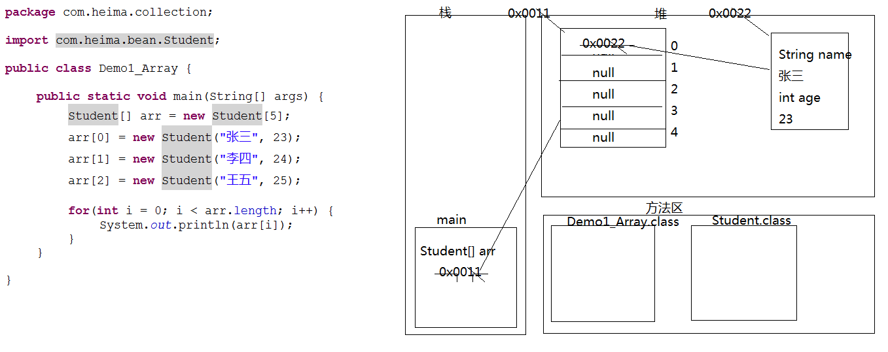


##### 增强型for循环

> 增强型for循环在遍历一个数组的时候会更加快捷

```java
public class HelloWorld {
    public static void main(String[] args) {
        int values [] = new int[]{18,62,68,82,65,9};
        //常规遍历
        for (int i = 0; i < values.length; i++) {
            int each = values[i];
            System.out.println(each);
        }
         
        //增强型for循环遍历
        for (int each : values) {
            System.out.println(each);
        }
         
    }
}
// 注意: 增强型for循环只能用来取值，却不能用来修改数组里的值
```


#### 数组 Arrays 工具类
> Arrays是针对数组的工具类，可以进行 排序，查找，复制填充等功能。 大大提高了开发人员的工作效率。

##### copyOfRange 数组复制 
&emsp;&emsp;与使用  `System.arraycopy` 进行数组复制类似的， Arrays 提供了一个 `copyOfRange` 方法进行数组复制。
不同的是 `System.arraycopy`，需要事先准备好目标数组，并分配长度。 `copyOfRange` 只需要源数组就就可以了，通过返回值，就能够得到目标数组了。

```java
copyOfRange(int[] original, int from, int to)			// 返回 copy 好的数组
```
- 第一个参数表示源数组
- 第二个参数表示开始位置(取得到)
- 第三个参数表示结束位置(取不到)

```java
import java.util.Arrays;
public class ArraysCopy{
    public static void main(String[] args) {
        int a[] = new int[] { 18, 62, 68, 82, 65, 9 };
        int[] b = Arrays.copyOfRange(a, 2, 6); 					// 在这
        for (int i = 0; i < b.length; i++) {
            System.out.print(b[i] + " ");
        }
    }
}
// 输出结果:
// 68 82 65 9 
```


##### ToString 数组转字符串
&emsp;&emsp;如果要打印一个数组的内容，就需要通过for循环来挨个遍历，逐一打印
但是Arrays提供了一个 `toString()` 方法，直接把一个数组，转换为字符串，这样方便观察数组的内容  

```java
import java.util.Arrays;
public class ArraysToString {
    public static void main(String[] args) {
        int a[] = new int[] { 18, 62, 68, 82, 65, 9 };
        String content = Arrays.toString(a);					// 在这
        System.out.println(content);  
    }
}
// 输出结果:
// [18, 62, 68, 82, 65, 9]
```


##### sort 排序 

> Arrays工具类提供了一个sort方法，只需要一行代码即可完成排序功能。

```java
import java.util.Arrays; 
public class ArraysSort {
    public static void main(String[] args) {
        int a[] = new int[] { 18, 62, 68, 82, 65, 9 };
        Arrays.sort(a);											// 在这
        System.out.println(Arrays.toString(a));  
    }
}
// 输出结果:
// [9, 18, 62, 65, 68, 82]
```


##### binarySearch 数组搜索 

> 查询元素出现的位置. 需要注意的是，**使用binarySearch进行查找之前，必须使用sort进行排序**
> 如果数组中有多个相同的元素，查找结果是不确定的

```java
import java.util.Arrays;
public class ArraysSearch {
    public static void main(String[] args) {
        int a[] = new int[] { 18, 62, 68, 82, 65, 9 };
        Arrays.sort(a);				//使用binarySearch之前，必须先使用sort进行排序
        System.out.println("数字 62出现的位置:"+Arrays.binarySearch(a, 62) );		// 在这
    }
}
// 输出结果:
// Where is 62: 2
```


##### equal 判断是否相同

> 比较两个数组的内容是否一样

```java
import java.util.Arrays;
public class ArraysEquals {
    public static void main(String[] args) {
        int a[] = new int[] { 18, 62, 68, 82, 65, 9 };
        int b[] = new int[] { 18, 62, 68, 82, 65, 8 };
        System.out.println(Arrays.equals(a, b));					// 在这
    }
}
// 输出结果:
// false
// 第二个数组的最后一个元素是8，和第一个数组不一样，所以比较结果是false
```


##### fill 填充 

> 使用同一个值，填充整个数组

```java
import java.util.Arrays;
public class ArraysFill {
    public static void main(String[] args) {
        int a[] = new int[10];
        Arrays.fill(a, 5);											// 在这
        System.out.println(Arrays.toString(a));
    }
}
// 输出结果:
// [5, 5, 5, 5, 5, 5, 5, 5, 5, 5]
```


#### 数组排序

```java
public static void main(String[] args) {
    int[] arr = {24, 69, 80, 57, 13};
    bubbleSort(arr);				// 冒泡排序
    // selectSort(arr);				// 选择排序
    print(arr);
}
	
public static void print(int[] arr) {
    for (int i = 0; i < arr.length; i++) {
        System.out.print(arr[i] + " ");
    }
}

public static void bubbleSort(int[] arr) {
    for (int i = 0; i < arr.length - 1; i++) {	//外循环只需要比较arr.length-1次就可以了
        for (int j = 0; j < arr.length - 1 - i; j++) {//-1为了防止索引越界,-i为了提高效率
            if(arr[j] > arr[j+1]) {
                swap(arr,j,j+1);
            }
        }
    }
}

public static void selectSort(int[] arr) {
    for (int i = 0; i < arr.length - 1; i++) {				//只需要比较arr.length-1次
        for (int j = i + 1; j < arr.length; j++) {
            if(arr[i] > arr[j]) {
                /*int temp = arr[i];
					arr[i] = arr[j];
					arr[j] = temp;*/
                swap(arr,i,j);
            }
        }
    }
}

/*
如果某个方法,只针对本类使用,不想让其他类使用就可以定义成私有的
*/
private static void swap(int[] arr,int i,int j) {
    int temp = arr[i];
    arr[i] = arr[j];
    arr[j] = temp;
}
```


#### 二分查找法

```java
public static int getIndex(int[] arr, int value) {
    int min = 0;
    int max = arr.length - 1;
    int mid = (min + max) / 2;

    while(arr[mid] != value) {					//当中间值不等于要找的值,就开始循环查找
        if(arr[mid] < value) {					//当中间值小于了要找的值
            min = mid + 1;						//最小的索引改变
        }else if (arr[mid] > value){			//当中间值大于了要找的值
            max = mid - 1;						//最大的索引改变
        }

        mid = (min + max) / 2;					//无论最大还是最小改变,中间索引都会随之改变

        if(min > max) {							//如果最小索引大于了最大索引,就没有查找的可能性了
            return -1;							//返回-1
        }
    }
    return mid;
}
```


### 10 方法 Method
**什么是方法:**

> 完成特定功能的代码块,提高代码的复用性 。


#### 方法的定义
```java
修饰符 返回值类型 方法名(参数类型 参数名1,参数类型 参数名2...) {
    方法体语句;
    return 返回值; 
} 
```

**方法的格式说明:**
* **修饰符**：目前就用 public static。后面我们再详细的讲解其他的修饰符。

* **返回值类型**：就是功能结果的数据类型。现在我们用的是 void

* **方法名**：符合命名规则即可。方便我们的调用。

* **参数**：

  > 参数可以有0或者多个; 传递参数的时候，要跟参数类型匹配

  * **实际参数**：就是实际参与运算的。
  * **形式参数**；就是方法定义上的，用于接收实际参数的。
  * **参数类型**：就是参数的数据类型
  * **参数名**：就是变量名

* **方法体语句**：就是完成功能的代码。

* **return**：结束方法的。

* **返回值**：就是功能的结果，由 return 带给调用者。**要明确返回值类型。**


#### 方法调用
* a:单独调用,一般来说没有意义，所以不推荐。
* b:输出调用,但是不够好。因为我们可能需要针对结果进行进一步的操作。
* c:赋值调用,推荐方案。


#### 注意事项
* 方法与方法之间是平级关系，**不能嵌套定义**
* 方法定义的时候参数之间用逗号隔开
* 方法调用的时候不用再传递数据类型
* 如果方法有明确的返回值，一定要有 return 带回一个值


## 面对对象
### 1.构造方法

> 给对象的数据(属性)进行初始化

#### 构造方法的格式:
- 方法名与类名相同(大小也要与类名一致)
- 没有返回值类型，连 `void` 都没有
- 没有具体的返回值 return;

```java
class Demo1_Constructor {						//Constructor 构造
	public static void main(String[] args) {
		Person p = new Person();		// 在一创建对象的时候,系统就帮我调用了构造方法
		//p.Person();					// 报错,构造方法不能用对象调用
		p.show();

		Person p2 = new Person();		//再次创建对象
		p2.show();
	}
}


class Person {
	private String name;				// 默认值为 null
	private int age;
	
    //构造方法
	public Person() {
		name = "张三";
		age = 23;
        //return;						//构造方法也是有return语句的,格式是return;
	}

	public void show() {
		System.out.println(name + "..." + age);
	}
}

```


#### 构造方法的重载

> **重载:** 方法名相同, 与返回值类型无关(构造方法没有返回值), 只看参数列表

```java
class Demo2_Person {
	public static void main(String[] args) {
		Person p1 = new Person();						  // 空参构造
		p1.show();

		System.out.println("---------------------");
		Person p2 = new Person("张三",23);				// 有参的构造
		p2.show();
	}
}

class Person {
	private String name;			
	private int age;				

	public Person() {						// 空参构造,
		System.out.println("空参的构造");
	}

	public Person(String name,int age) {	// 有参的构造;
        // 一旦自己构建构造方法,系统将不再给予默认的空参构造方法
		this.name = name;
		this.age = age;
		System.out.println("有参的构造");
	}
	
	public void show() {
		System.out.println(name + ":" + age);
	}
}

```

**注意事项**:

- 如果我们没有给出构造方法，系统将自动提供一个无参构造方法。

- 如果我们给出了构造方法，系统将不再提供默认的无参构造方法

    ```markdown
    	当我们定义了一个有参构造方法后，如果我们还想使用无参构造方法，这个时候就必须自己给出无参构造方法,否则就会报错。建议!永远!一定!要自己构造无参构造方法
    ```

    

#### 成员变量的赋值 setXxx()

**给成员变量赋值的两种方式的区别:**

```java
// 第一种方法:构造方法			
主要用于给对象中属性进行初始化 

// 第二种方法:setXxx()方法
修改属性值,在开发中用setXxx()更多一些,因为比较灵活
```

```java
class Demo3_Person {
	public static void main(String[] args) {
		Person p1 = new Person("张三",23);
        
        // 以下这种方式看运行结果貌似是改名了,其实是新建了一个对象,将原对象舍弃了
		// p1 = new Person("张天一",23);	
		// System.out.println(p1.getName() + "..." + p1.getAge());

		System.out.println("--------------------");
		Person p2 = new Person();		//空参构造创建对象
		p2.setName("李四");
		p2.setAge(24);

		p2.setName("李鬼");
		System.out.println(p2.getName() + ":" + p2.getAge());
	}
}

class Person {
	private String name;				
	private int age;					

	public Person() {}					//空参构造

	public Person(String name,int age) {//有参构造
		this.name = name;
		this.age = age;
	}
	
	public void setName(String name) {	//设置姓名
		this.name = name;
	}
	public String getName() {			//获取姓名
		return name;
	}

	public void setAge(int age) {		//设置年龄
		this.age = age;
	}
	public int getAge() {				//获取年龄
		return age;
	}
}

```


### static 静态关键字
> 如果某个成员变量是被所有对象共享的，那么它就应该定义为静态的。
> **共性用静态,特性用非静态**


#### static 关键字的特点

- **可以修饰成员变量和成员方法**
- **被类的所有对象共享**
- **随着类的加载而加载** ( 当类加载进内存,静态成员变量也加载完毕 )
- **可以通过对象和类来调用** ( 调用的都是同一个 )
- **优先于对象存在** ( 还没 `new` 一个对象的时候, 静态成员变量就已经可以调用了 )


#### 静态变量( 类变量 )
> 静态变量也叫类变量  成员变量也叫对象变量
> 静态变量是所有对象公用的，在内存中只占有一份内存

##### 静态变量和成员变量的区别

- **所属不同**
    - 静态变量属于类，所以也称为为类变量
    - 成员变量属于对象，所以也称为实例变量(对象变量)

- **! 内存中位置不同**
    - 静态变量存储于方法区的静态区	
    - 成员变量存储于堆内存

- **内存出现时间不同**
    - 静态变量随着类的加载而加载，随着类的消失而消失
    - 成员变量随着对象的创建而存在，随着对象的消失而消失

- **调用方式不同**
    - 静态变量可以通过类名调用，也可以通过对象调用
    - 成员变量只能通过对象名调用


##### 举例说明

```java
class Demo1_Static {
	public static void main(String[] args) {
		Person p1 = new Person();				 	// 创建对象
		Person p2 = new Person();	
		p1.name = "张三";								//调用姓名属性并赋值
		p1.speak();									// Person: 张三
		p2.speak();									// Person: null

		Static_Person p3 = new Static_Person();
		Static_Person p4 = new Static_Person();
		p3.name = "李四";			
		p3.speak();									// Static_Person: 李四
		p4.speak();									// Static_Person: 李四

		Static_Person.name = "赵五";				   //静态多了一种调用方式,可以通过类名.
		System.out.println( Static_Person.name );	// 赵五
	}
}

class Person {										// 不含有静态关键字
	String name;					

	public void speak() {			
		System.out.println( "Person: " + name );
	}
}

class Static_Person {								// 含有静态关键字
	static String name;					

	public void speak() {
		System.out.println( "Static_Person: " + name );
	}
}
```


**没有用static时候创建对象的过程:**
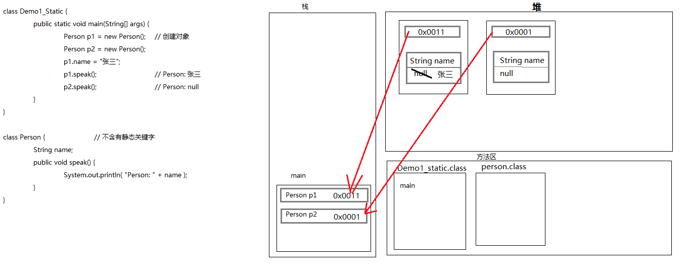

**使用 static 创建对象的过程:**
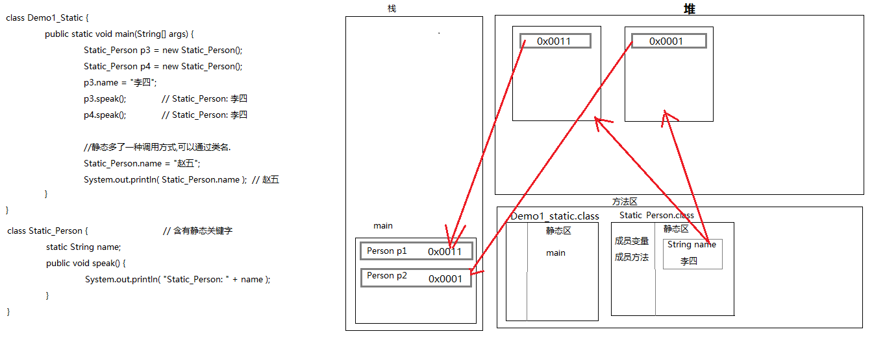


#### static 静态成员方法
> 静态方法只能访问静态的成员变量和静态的成员方法,**不能通过静态访问非静态**
> `main` 方法就是静态方法

**注意事项**

- **在静态方法中是没有 `this` 关键字的**
    >  静态是随着类的加载而加载，this是随着对象的创建而存在。
    > 静态比对象先存在。

- **静态方法只能访问静态的成员变量和静态的成员方法**
    > 静态方法的成员变量和成员方法,只能访问静态变量和静态成员方法
    > 非静态方法的成员变量和成员方法,可以是静态的，也可以是非静态的


#### 注意
- 如果一个类中所有的方法都是静态的,需要再多做一步, 创建`私有构造方法`,目的是不让其他类创建本类对象( 即 new 这个类会报错 )
    ```java
    private ArrayTool(){}
    ```


### this 和 super
- **this**:  代表当前对象的引用,谁来调用我,我就代表谁
- **super**:  代表当前对象父类的引用  


#### this和super的使用区别  
- **调用成员变量**
    > **this.成员变量** :    调用本类的成员变量, 也可以调用父类的成员变量( 本类没有的情况下 )
    > **super.成员变量** : 调用父类的成员变量

- **调用成员方法**
    > **this.成员方法**       调用本类的成员方法,也可以调用父类的方法
    > **super.成员方法**    调用父类的成员方法

- **调用构造方法**
    > **this()**	   	调用本类的构造方法
    > **super()**		调用父类的构造方法,*每个类的构造方法默认有这个方法*


**注意:**

```markdown
# 通过this或者super调用构造方法的时候必须在第一条语句
```


### final 关键字

> 最终的、最后的

#### final修饰特点

* **修饰类:	类不能被继承**

  ```java
  class Demo1_Final {
  	public static void main(String[] args) {
  		Son s = new Son();
  		s.print();
  	}
  }
  
  final class Father {
  	public final void print() {
  		System.out.println("final 修饰的类");
  	}
  }
  class Son extends Father {				// 会报错,无法从最终 Father进行继承
  	public void print() {				
  		System.out.println("子类");
  	}
  }
  ```

* **修饰变量:     变量就变成了常量，只能被赋值一次**

    ```java
    class Demo1_Final {
    	public static void main(String[] args) {
    		Son s = new Son();
    		s.print();
    	}
    }
    
    class Son  {
        //常量命名规范,如果是一个单词,所有字母大写,如果是多个单词,每个单词都大写,中间用下划线隔开
    	final int NUM = 10;	
        //final修饰变量叫做常量,一般会与public static共用
    	public static final double PI_VALUE = 3.14;	
    	public void print() {
    		//NUM = 20;				无法修改,会报错: 无法为最终变量 num 分配值
    		System.out.println(NUM);
    	}
    }
    ```

* **修饰方法:     方法不能被重写**

    ```java
    class Demo1_Final {
    	public static void main(String[] args) {
    		Son s = new Son();
    		s.print();
    	}
    }
    
    class Father {
    	public final void print() {
    		System.out.println("final 修饰的父类方法");
    	}
    }
    class Son extends Father {
    	public void print() {				// 会报错,无法覆盖,被覆盖的方法为final
    		System.out.println("子类重写方法");
    	}
    }
    ```

    

#### final关键字修饰局部变量

* 基本类型: 是**值不能被改变**
* 引用类型: 是**地址值不能被改变**, 对象中的属性可以改变

```java
class Demo2_Final {
	public static void main(String[] args) {
		final int num = 10;
		// num = 20;				报错, 基本类型，值不能被改变
		System.out.println(num);

		final Person p = new Person("张三",23);
		//p = new Person("李四",24);	报错, 地址值不能被改变,对象中的属性可以改变
		p.setName("李四");
		System.out.println(p.getName() + "..." + p.getAge());

	}
}


class Person {
	private String name;			//姓名

	public Person(){}				//空参构造

	public Person(String name) {
		this.name = name;
	}

	public void setName(String name) {	//设置姓名
		this.name = name;
	}

	public String getName() {		//获取姓名
		return name;
	}
}
```


### 说明书的制作过程 javadoc
#### 说明书的制作
```java
/**
	这是一个......工具类,里面封装了..........的方法
	@author fengjia
	@version v1.0
*/

/**
	这是获取数组中最大值的方法
	@param arr 接收一个int类型数组
	@return 返回数组中最大值
*/

```


#### 说明书的生成
```shell
javadoc -d 生成文件的存放路径 -author -version ArrayTool.java
```


### 代码块
> 在Java中，使用 `{ }` 括起来的代码被称为代码块。

#### 代码块分类
> 根据其位置和声明的不同，可以分为局部代码块，构造代码块，静态代码块，同步代码块(多线程讲解)。

##### 局部代码块 
>在方法中出现；限定变量生命周期，及早释放，提高内存利用率

```java
class Demo1_CodeBlock {
	public static void main(String[] args) {
		{
			int x = 10;						// 限定变量的声明周期
			System.out.println(x);
		}
		// System.out.println(x);			// 报错,找不到x
	}
```


##### 构造代码块 (初始化块)
> 在类中方法外出现；多个构造方法方法中相同的代码存放到一起，每次调用构造都执行，并且**在构造方法前执行**

```java
class Demo1_CodeBlock {
	public static void main(String[] args) {
		Student s1 = new Student();        	// 构造代码块\n空参构造
		Student s2 = new Student("张三");	   // 构造代码块\n有参构造
        
	}
}

class Student {
	private String name;

	public Student(){						//空参构造
		System.out.println("空参构造");
	}					

	public Student(String name) {			//有参构造
		this.name = name;
		System.out.println("有参构造");
	}

	public void setName(String name) {
		this.name = name;
	}

	public String getName() {
		return name;
	}

    // 构造代码块:每创建一次对象就会执行一次,优先于构造函数执行
	{		
		System.out.println("构造代码块");
	}
}
```


##### 静态代码块
> 在类中方法外出现，加上static修饰；用于给类进行初始化，**在加载类的时候就执行，并且只执行一次。** 一般用于加载驱动
> **优先于构造代码块, 优先于主方法执行的**

```java
class Demo1_CodeBlock {
	public static void main(String[] args) {
		Student s1 = new Student();        	
		Student s2 = new Student("张三");	   
        
        static {
            System.out.println("我是在主方法类中的静态代码块");
        }
        // 我是在主方法类中的静态代码块
        // 我是静态代码块\n构造代码块\n空参构造
        // 构造代码块\n有参构造
	}
}

class Student {
	private String name;

	public Student(){						//空参构造
		System.out.println("空参构造");
	}					

	public Student(String name) {			//有参构造
		this.name = name;
		System.out.println("有参构造");
	}

	public void setName(String name) {
		this.name = name;
	}

	public String getName() {
		return name;
	}
    
    // 构造代码块:每创建一次对象就会执行一次,优先于构造函数执行
	{		
		System.out.println("构造代码块");
	}

    static {								 //随着类加载而加载,且只执行一次
		System.out.println("我是静态代码块");  //作用:用来给类进行初始化,一般用来加载驱动
	}										 //静态代码块是优先于主方法执行
}
```


### 类的继承 extends
> 让类与类之间产生关系,子父类关系 
> **Java支持单继承不支持多继承** (一个儿子只能有一个爹)
> Java支持多层继承(继承体系) 

```java
class Demo1_Extends {
	public static void main(String[] args) {
		Cat c = new Cat();
		c.color = "花";
		c.leg = 4;
		c.eat();
		c.sleep();
		System.out.println(c.leg  + ":" + c.color);
	}
}

class Animal {
	String color;					//动物的颜色
	int leg;						//动物腿的个数

	public void eat() {				//吃饭的功能
		System.out.println("吃饭");
	}

	public void sleep() {			//睡觉的功能
		System.out.println("睡觉");
	}
}

class Cat extends Animal {
}

```


#### 继承的好处和弊端
##### 继承的好处
- 提高了代码的复用性
- 提高了代码的维护性
- 让类与类之间产生了关系，是多态的前提

##### B:继承的弊端
* 类的耦合性增强了。
* **开发的原则**：高内聚，低耦合。
  * 耦合：类与类的关系
  * 内聚：就是自己完成某件事情的能力


#### 继承的特点
- **子类对象调用方法, 先找子类本身，再找父类。**

- **Java只支持单继承，不支持多继承**。(一个儿子只能有一个爹)

    > 有些语言是支持多继承，格式：extends 类1,类2,... **多继承是有安全隐患的**

- **Java支持多层继承(继承体系)**

```markdown
# 如果想用这个体系的所有功能用最底层的类创建对象
# 如果想看这个体系的共性功能,看最顶层的类 
```


#### 继承中构造方法

- **子类中所有的构造方法默认都会访问父类中空参数的构造方法**

    > 因为子类会继承父类中的数据，可能还会使用父类的数据
    > 所以，子类初始化之前，一定要先完成父类数据的初始化
    > 每一个构造方法的第一条语句默认都是：super() **Object类是最顶层的父类。**

##### 面试题

```java
class Fu{
    public int num = 10;
    public Fu(){
        System.out.println("父类的无参构造");
    }
}
class Zi extends Fu{
    public int num = 20;
    public Zi(){
        // super();					不要忘记这个坑
        System.out.println("子类的无参构造");
    }
    public void show(){
        int num = 30;
        System.out.println(num);
        System.out.println(this.num);
        System.out.println(super.num);
    }
}
class Test1_Extends {
    public static void main(String[] args) {
        Zi z = new Zi();
        z.show();
    }
}
/**
父类的无参构造
子类的无参构造
30 20 10
*/
```

```java
/*
	1,jvm调用了main方法,main进栈
	2,遇到Zi z = new Zi();会先将Fu.class和Zi.class分别加载进内存,再创建对象
		当Fu.class加载进内存,父类的静态代码块会随着Fu.class一起加载,
		当Zi.class加载进内存,子类的静态代码块会随着Zi.class一起加载
		第一个输出,静态代码块Fu,第二个输出静态代码块Zi
	3,走Zi类的构造方法,
		因为java中是分层初始化的,先初始化父类,再初始化子类,所以先走的父类构造,
		但是在执行父类构造时,发现父类有构造代码块,构造代码块是优先于构造方法执行的所以
		第三个输出构造代码块Fu,第四个输出构造方法Fu
	4,Fu类初始化结束,子类初始化,
		第五个输出的是构造代码块Zi,构造方法Zi
	*/
class Fu {
    static {
    	System.out.println("静态代码块Fu");
    }
	{
		System.out.println("构造代码块Fu");
	}

    public Fu() {
    	System.out.println("构造方法Fu");
    }
}

class Zi extends Fu {
    static {
    	System.out.println("静态代码块Zi");
    }

    {
    	System.out.println("构造代码块Zi");
    }

    public Zi() {
    	System.out.println("构造方法Zi");
    }
}

class Test1_Extends {
    public static void main(String[] args) {
        Zi z = new Zi();
        z.show();
    }
}
/**
静态代码块Fu
静态代码块Zi
构造代码块Fu
构造方法Fu
构造代码块Zi
构造方法Zi
*/
```


#### 方法重写
> 子父类出现了一模一样的方法 (注意:返回值类型可以是子父类,这个我们学完面向对象讲)
> 当子类需要父类的功能，而功能主体子类有自己特有内容时，可以重写父类中的方法。这样，即沿袭了父类的功能，又定义了子类特有的内容。

- **父类中私有方法 `pravate` 不能被重写**

    > 因为父类私有方法子类根本就无法继承

- **子类重写父类方法时，访问权限不能更低**

    > 最好就一致

- **父类静态方法，子类也必须通过静态方法进行重写**

    > 其实这个算不上方法重写，但是现象确实如此，至于为什么算不上方法重写，多态中我会讲解(**静态只能覆盖静态**)

- **子类重写父类方法的时候，最好声明一模一样。**


##### 方法重写和方法重载的区别

**方法重写:** 

> 子类中出现了和父类中方法声明一模一样的方法。与返回值类型有关,返回值是一致(或者是子父类)的

**方法重载:**

> 本类中出现的方法名一样，参数列表不同的方法。与返回值类型无关。


#### 注意事项
- 子类只能继承父类所有非私有的成员(成员方法和成员变量)
- 子类不能继承父类的构造方法，但是可以通过super(马上讲)关键字去访问父类构造方法。


### 类的多态
> 事物存在的多种形态
#### 多态前提:
* 要有继承关系。
* 要有方法重写。
* 要有父类引用指向子类对象。

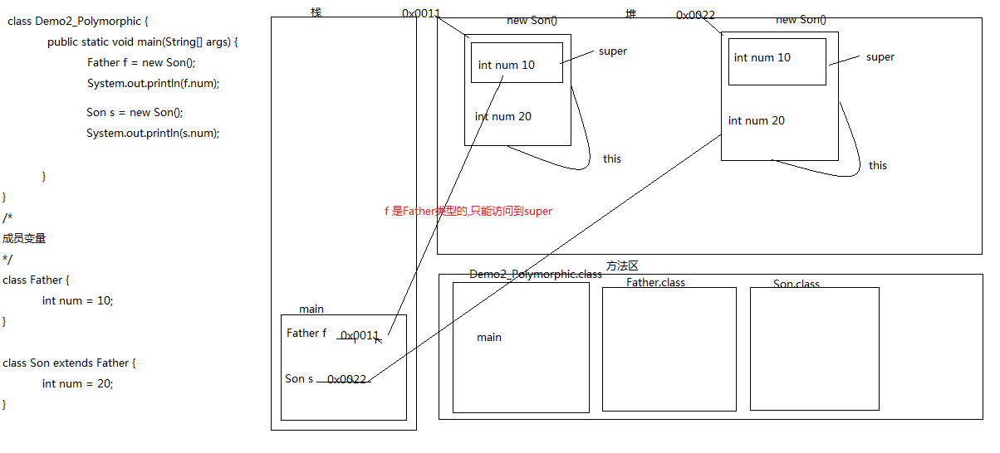

#### 多态中的成员访问特点
##### 成员变量
> 编译看左边(父类)，运行看左边(父类)。

```java
class Demo1_Polymorphic {
	public static void main(String[] args) {
		Animal a = new Cat();				//父类引用指向子类对象
		a.eat();							// 猫吃鱼		  // 子类中的方法
        System.out.println( a.num );		// 10			// 父类中的成员变量
	}
}

class Animal {
	public void eat() {
        int num = 10;
		System.out.println("动物吃饭");
	}
}
class Cat extends Animal {				// 有继承关系
    int num = 20;
	public void eat() {					// 有方法重写。
		System.out.println("猫吃鱼");
	}
}
```


##### 成员方法
> 编译看左边(父类)，运行看右边(子类)。**动态绑定**
```java
class Demo2_Polymorphic {
	public static void main(String[] args) {
		Father f = new Son();					// 父类引用指向子类对象
		f.print();
	}
}

class Father {
	public void print() {						// 编译时如果没有这个方法,会报错
		System.out.println("father");
	}
}
class Son extends Father {
	public void print() {
		System.out.println("son");
	}
}
```


##### 静态方法
> 编译看左边(父类)，运行看左边(父类)。
```java
/* *
(静态和类相关，算不上重写，所以，访问还是左边的)
只有非静态的成员方法,编译看左边,运行看右边 
*/
class Demo2_Polymorphic {
	public static void main(String[] args) {
		Father f = new Son();					// 父类引用指向子类对象
		f.method();								// 相当于是Father.method()
	}
}

class Father {
	public static void method() {
		System.out.println("father static method");
	}
}

class Son extends Father {
	public static void method() {
		System.out.println("son static method");
	}
}
```


#### 多态中向上转型和向下转型

```java
Person p = new SuperMan();		// 向上转型(子类用父类型声明 )
SuperMan sm = (SuperMan)p;		// 向下转型(用子类型声明,并用子类型强制转化 )

// 必须先有向上转型,才有向下转型
```

```java
class Demo3_SuperMan {
	public static void main(String[] args) {
		Person p = new SuperMan();			//父类引用指向子类对象,超人提升为了人
											//父类引用指向子类对象就是向上转型
		System.out.println(p.name);
		p.谈生意();
        // p.fly();							// 报错
		SuperMan sm = (SuperMan)p;			// 向下转型( 必须先有向上转型,才有向下转型 )
		sm.fly();							

	}
}

class Person {
	String name = "John";
	public void 谈生意() {
		System.out.println("谈生意");
	}
}

class SuperMan extends Person {
	String name = "superMan";

	public void 谈生意() {
		System.out.println("谈几个亿的大单子");
	}

	public void fly() {
		System.out.println("飞出去救人");
	}
}
```


#### 多态的好处和弊端
##### 好处
- 提高了代码的维护性(继承保证)
- **提高了代码的扩展性(由多态保证)**
    > 可以当作形式参数,可以接收任意子类对象
    ```java
    class Demo4_Animal {
    	public static void main(String[] args) {
    		method(new Cat());
    		method(new Dog());
    
    		// Animal a = new Cat();	// 开发的是很少在创建对象的时候用父类引用指向子类对象,
            // 直接创建子类对象更方便,可以使用子类中的特有属性和行为
    	}	
    	/*Cat c = new Dog();狗是一只猫,这是错误的
    	public static void method(Cat c) {			
    		c.eat();
    	}
    
    	public static void method(Dog d) {
    		d.eat();
    	}*/
    	
    	//如果把狗强转成猫就会出现类型转换异常,ClassCastException
    	public static void method(Animal a) {	//当作参数的时候用多态最好,因为扩展性强
    		//关键字 instanceof 判断前边的引用是否是后边的数据类型
    		if (a instanceof Cat) {
    			Cat c = (Cat)a;
    			c.eat();
    			c.catchMouse();
    		}else if (a instanceof Dog) {
    			Dog d = (Dog)a;
    			d.eat();
    			d.lookHome();
    		}else {
    			a.eat();
    		}
    	}
    }
    
    
    class Animal {
    	public void eat() {
    		System.out.println("动物吃饭");
    	}
    }
    
    class Cat extends Animal {
    	public void eat() {
    		System.out.println("猫吃鱼");
    	}
    
    	public void catchMouse() {
    		System.out.println("抓老鼠");
    	}
    }
    
    class Dog extends Animal {
    	public void eat() {
    		System.out.println("狗吃肉");
    	}
    
    	public void lookHome() {
    		System.out.println("看家");
    	}
    }
    ```
##### 弊端
- 不能使用子类的特有属性和行为。


### 抽象类
> 在类中声明一个方法，这个方法没有实现体，是一个“空”方法, 这样的方法就叫抽象方法，使用修饰符  `abstract`
> 当一个类有抽象方法的时候，该类必须被声明为抽象类  


#### 抽象类的特点
- **抽象类和抽象方法必须用 `abstract` 关键字修饰**

    ```java
    abstract class 类名 {						   		// 抽象类
        public abstract void method();				 // 抽象方法
    }
    ```

- **抽象类不一定有抽象方法，有抽象方法的类一定是抽象类或者是接口**

- **抽象类可以包含构造方法**  

    > 构造方法的作用是让子类对父类里面的数据进行初始化 

- **抽象类不能实例化**

    > 因为一旦抽象类可以实例化, 就意味着可以调用抽象类, 而抽象类是没有意义的
    > 抽象类如果要实例化,  要按照多态的方式，由具体的子类实例化。其实这也是多态的一种，抽象类多态。

- **抽象类的子类,  要么是抽象类, 要么重写抽象类中的所有抽象方法**

    > 父类有抽象方法, 如果子类不是抽象类, 那么子类必须重写父类的抽象方法, 否则会报错!!!


#### 抽象类的成员特点
##### 成员变量
> 既可以是变量，也可以是常量。`abstract` 是否可以修饰成员变量?不能修饰成员变量

##### 构造方法
> 有构造方法。用于子类访问父类数据的初始化。

##### 成员方法
> 既可以是抽象的，也可以是非抽象的。

- **抽象方法: **      
    > **强制**要求子类完成的方法
    > 抽象方法没有方法体
    > 一个抽象类如果没有抽象方法
- **非抽象方法: **   子类继承的事情，提高代码复用性。


#### 注意:
```markdown
#　一个抽象类可以没有抽象方法, 这么做目的只有一个,就是不让其他类创建本类对象,交给子类完成
```


### 接口类
> 从狭义的角度讲就是指 java 中的 `interface`
> 从广义的角度讲**对外提供规则的都是接口** 

#### 接口的特点
- **接口用关键字 `interface` 表示**

    > 接口里面只能包含抽象方法（接口是完全抽象化的类，里面没有完整的方法）
    ```java
    interface 接口名 {}
    ```

- **类实现接口用 `implements` 表示**
    ```java
    class 类名 implements 接口名 {}
    ```

- **接口不能实例化, 按照多态的方式来实例化**

    > 接口可以被实现，不能被继承
    > 接口里面只是定义了一些东西，并没有可以被实际继承的数据或者方法,属性和行为

- **接口的子类, 可以是抽象类, 也可以是具体类**
    >可以是抽象类。但是意义不大。
    >可以是具体类。要重写接口中的所有抽象方法。(推荐方案)
    >
    >接口可以被抽象类实现、也可以被具体类实现

```java
class Demo_Interface {
	public static void main(String[] args) {
		//Inter i = new Inter();		//报错!接口不能被实例化,因为调用抽象方法没有意义
		Inter i = new Demo();			//父类引用指向子类对象
		i.print();
	}
}


interface Inter {
	public abstract void print();					//接口中的方法都是抽象的
}

class Demo implements Inter {
	public void print() {
		System.out.println("print");
	}
}
```


#### 接口的成员特点
##### 成员变量
> 只能是常量，并且是静态的并公共的, 一旦给出就无法修改
```java
// 默认修饰符：
public static final				// 三个关键字可以互相交换位置,建议：自己手动给出。
```

##### 构造方法
>**接口没有构造方法。**

##### 成员方法
> 只能是抽象方法。
```java
// 默认修饰符：
public abstract						// 建议：自己手动给出。
```

```java
class Demo2_Interface {
	public static void main(String[] args) {
		Demo d = new Demo();
		d.print();
		System.out.println(Inter.num);
	}
}

interface Inter {
    int num = 10;
	// public static final int num = 10; 	// 默认加上public static final
	// public Inter(){}						// 报错!接口中没有构造方法
	// public void print() {}				// 报错!接口中不能定义非抽象方法	
	public abstract void print();			
    // void print();						// 也可以,系统会默认加上public abstract
}

class Demo /*extends Object*/ implements Inter {	//一个类不写继承任何类,默认继承Object类
	public void print() {
		//num = 20;
		System.out.println(num);
	}

	public Demo() {
		super();					// 因为接口没有构造方法,所以这里继承的是 Object的构造方法
	}

}
```


#### 类与接口,接口与接口的关系
- **类与类**

    > 继承关系,只能单继承,可以多层继承。

- **类与接口**
    > 实现关系,可以单实现,也可以多实现。
    > 并且还可以在继承一个类的同时实现多个接口。

- **接口与接口**

    > 继承关系,可以单继承,也可以多继承。 

``` java
class Demo_Interface {
	public static void main(String[] args) {
		System.out.println("Hello World!");
	}
}

interface InterA {
	public abstract void printA();
}
interface InterB {
	public abstract void printB();
}

//class Demo implements InterA,implements InterB {		//这么做不允许是非法的
class Demo extends Object implements InterA,InterB {	// 类与接口的关系
	public void printA() {
		System.out.println("printA");
	}
	public void printB() {
		System.out.println("printB");
	}
}

interface InterC extends InterB,InterA {				// 接口与接口的关系
}
```


#### 抽象类和接口的区别

##### 成员区别

- **抽象类**

    > **成员变量**：可以变量，也可以常量
    > **构造方法**：有
    > **成员方法**：可以抽象，也可以非抽象

- **接口**
    >**成员变量**：只可以常量
    >**构造方法**：没有
    >**成员方法**：只可以抽象


##### 设计理念区别
* **抽象类**  被继承体现的是："is a" 的关系。抽象类中定义的是该继承体系的**共性功能**。
* **接口**     被实现体现的是："like a" 的关系。接口中定义的是该继承体系的**扩展功能**。


#### 范例

```java
class Test_Animal {
	public static void main(String[] args) {
		People man = new People("普通人");
		man.eat();
        // 无法执行 fly 行为

		SuperMan man2 = new SuperMan("超人");
		man2.eat();
		man2.Flying();
	}
}

abstract class Animal {
	private String name;				
	public Animal() {}					//空参构造
	public Animal(String name) {		//有参构造
		this.name = name;
	}

	public void setName(String name) {	
		this.name = name;
	}
	public String getName() {			
		return name;
	}

	public abstract void eat();			//吃饭
}

interface Flying {						//飞行的接口
	public void Flying();
}

class People extends Animal {
	public People() {}					//空参构造
	public People(String name) {		//有参构造
		super(name);
	}

	public void eat() {
		System.out.println(this.getName() + "吃饭");
	}
}

class SuperMan extends People implements Flying {	// 通过多继承实现接口,实现特有方法
	public SuperMan() {}					//空参构造
	public SuperMan(String name ) {			//有参构造
		super(name);
	}

	public void Flying() {
		System.out.println("超人飞");
	}
}
```


### 包
> 其实就是文件夹,用以解决相同类名问题
> 将字节码(.class)进行分类存放

```java
package 包名;
多级包用.分开即可						// .相当于路径分隔符
```


#### 包的编译运行

- `javac` 编译的时候带上 `-d` 即可

    ```shell
    javac -d . HelloWorld.java
    ```

* 通过 `java` 命令执行。

    ```shell
    java 包名.HellWord
    ```

```java
package com.Demo1;
class Package_HelloWord {
	public static void main(String[] args) {
		System.out.println("Hello World!");
	}
}
// javac -d . Package_HelloWord.java
// java com.Demo1.Package_HelloWord
```


#### 定义包的注意事项

- `package` 语句必须是程序的第一条可执行的代码
- `package` 语句在一个java文件中只能有一个
- 如果没有 `package`，默认表示无包名
- 最好是域名倒过来,要求所有的字母小写 ,如:
    ```
    www.java.com
    com.java.包的作用
    ```

    

#### 不同包下类之间的访问
```java
// .同一目录
package com.Demo2_1;									// 不同包
class Package_Demo2 {
	public static void main(String[] args) {
		// Person1 p = new Person1();					// 报错! 找不到
		com.Demo2_2.Person1 p = new com.Demo2_2.Person1("John");			
		System.out.println( p.getName() );
	}
}
```

```java
// .同一目录
package com.Demo2_2;									// 不同包
public class Person1 {									// 不加 public 会报错		
	private String name;
	public Person1(){}									// 不加 public 会报错		
	public Person1(String name) {						// 不加 public 会报错
		this.name = name;
	}

	public void setName(String name) {
		this.name = name;
	}
	public String getName() {
		return name;
	}
}
```

```java
// 执行命令
javac -d . Person1.java
javac -d . Package_Demo2.java
java com.Demo2_1.Package_Demo2
```


#### import 关键字

> 其实就是让有包的类对调用者可见,不用写全类名了 

**导包格式**

```java
import 包名;

// 这种方式导入是到类的名称。
// 虽然可以最后写*，但是不建议。
```


##### 范例:

```java
// .同一目录
package com.Demo3_1;							// 不同包
import com.Demo3_2.Person2;
//import java.util.Scanner;						//在开发中我们用的都是导入具体的类
import java.util.*;								//*代表通配符,他会到该包下挨个匹配,匹配上就导入
class Package_Demo3 {
	public static void main(String[] args) {
		Person1 p = new Person2("John");			
		System.out.println( p.getName() );
	}
}
```

```java
// .同一目录
package com.Demo3_2;									// 不同包
public class Person2 {									// 不加 public 会报错		
	private String name;
	public Person2(){}									// 不加 public 会报错		
	public Person2(String name) {						// 不加 public 会报错
		this.name = name;
	}

	public void setName(String name) {
		this.name = name;
	}
	public String getName() {
		return name;
	}
}
```

```java
// 执行命令
javac -d . Person2.java
javac -d . Package_Demo3.java
java com.Demo2_1.Package_Demo3
```


### 修饰符
 * **权限修饰符**：`private`，`默认的`，`protected`，`public`
 * **状态修饰符**：`static`，`final`
 * **抽象修饰符**：`abstract`


#### 权限修饰符

|  权限修饰符   |   本类   | 同一个包下(子类与无关类) | 不同包下(子类) | 不同包下(无关类) |
| :-----------: | :------: | :----------------------: | :------------: | :--------------: |
|  **private**  | &#10003; |                          |                |                  |
|   **默认**    | &#10003; |         &#10003;         |                |                  |
| **protected** | &#10003; |         &#10003;         |    &#10003;    |                  |
|  **public**   | &#10003; |         &#10003;         |    &#10003;    |     &#10003;     |

> **私有仅仅是封装的一种体现形式,不能说封装就是私有**


#### 类及其组成使用的常见
##### 类
* **权限修饰符**：默认修饰符，public

    > 类的作用域只有两个: 包内和包外，public 在包外也可以访问，default只能在包内访问。
    > 类用 private 没有意义, 用的最多的就是：public

* **状态修饰符**：final
* **抽象修饰符**：abstract

##### 成员变量
- **权限修饰符**：private，默认的，protected，public

    > 用的最多的就是：private 
* **状态修饰符**：static，final

##### 构造方法
* **权限修饰符**：private，默认的，protected，public

##### 成员方法
* **权限修饰符**：private，默认的，protected，public
* **状态修饰符**：static，final
* **抽象修饰符**：abstract

##### 除此以外的组合规则
* **成员变量**：`public static final` 接口
* **成员方法**：
  * public static 
  * public abstract
  * public final


### 内部类

> 把一个类定义在另一个类的内部，这个被定义在内部的类称为内部类。包含内部类的叫    做外部类。

#### 内部类访问特点

- **外部类要访问内部类的成员，必须创建对象。**

    ```java
    外部类名.内部类名 对象名 = new 外部类对象.new 内部类对象;
    ```

- **内部类可以直接访问外部类的成员，包括私有。**

    ```java
    class Demo1_InnerClass {
    	public static void main(String[] args) {
    		//Inner i = new Inner();
    		//i.method();
            
            // 外部类名.内部类名 对象名 = new 外部类对象.new 内部类对象;
    		Outer.Inner oi = new Outer().new Inner();			//创建内部类对象
    		oi.method();
    	}
    }
    
    class Outer {
    	private int num = 10;
    	class Inner {
    		public void method() {
    			System.out.println("Hello World! " + num);
    		}
    	}
    }
    ```


#### 内部类的访问权限

> **内部类比外部类多了三个访问权限**：`private`  `protected`  `static`

##### private 成员内部类

> 通过父类建立 `public` 成员方法, 新建  `private` 内部类对象再调用

```java
class Demo2_InnerClass {
	public static void main(String[] args) {
		// Outer.Inner oi = new Outer().new Inner();
		// oi.method();					// 错误: Outer.Inner可以在Outer中访问private
		
        // 外部类名 对象名 = new 外部类对象;
		Outer o = new Outer();
		o.print();
	}
}

class Outer {
	private int num = 10;
	private class Inner {				// 内部类变为私有的
		public void method() {
			System.out.println(num);
		}
	}

	public void print() {
		Inner i = new Inner();
		i.method();
	}
}
```


##### staitc 静态内部类

> 外部类名.内部类名 对象名 = new 外部类名.内部类对象;
> 内部类里面静态方法的访问特点: **外部类.内部类.静态方法名();**

```java
class Demo1_InnerClass {
	public static void main(String[] args) {
		//外部类名.内部类名 对象名 = new 外部类名.内部类对象;
		Outer.Inner oi = new Outer.Inner();
		oi.method();
		//内部类里面静态方法的访问特点:外部类.内部类.静态方法名();
		Outer.Inner2.print();						// 静态成员方法,可被类直接调用
        System.out.println( Outer.Inner2.num );
	}
}

class Outer {
	static class Inner {
		public void method() {
			System.out.println("method");
		}
	}
	static class Inner2 {
        static int num = 10; 
		public static void print() {				// 静态成员方法,可被类直接调用
			System.out.println("print");
		}
	}
}
```


##### final 局部内部类

> 局部内部类访问局部变量必须用 `final` 修饰 
>
> 当调用这个方法时,局部变量如果没有用 `final` 修饰,他的生命周期和方法的生命周期是一样的,当方法弹栈,这个局部变量也会消失,那么如果局部内部类对象还没有马上消失想用这个局部变量,就没有了,如果用 `final` 修饰会在类加载的时候进入常量池,即使方法弹栈,常量池的常量还在,也可以继续使用
>
> 但是 **jdk1.8** 取消了这个事情, 所以我认为这是个bug,虽然取消,如果在书写代码时候,没有手动添加,系统底层也会默给你 `final`

```java
class Demo1_InnerClass {
	public static void main(String[] args) {
		Outer o = new Outer();
		o.method();
	}
}

class Outer {
	public void method() {
		// int num = 10; 				// 错误: 从内部类中访问本地变量num; 需要被声明为最终类型
		final int num = 10;
		
        // 局部内部类,在类方法内的类
        class Inner {
			public void print() {
				System.out.println(num);
			}
		}
		Inner i = new Inner();
		i.print();
	}
	/*public void run() {
		Inner i = new Inner();			//局部内部类,只能在其所在的方法中访问
		i.print();
	}*/
}
```


##### 匿名内部类
> 就是内部类的简化写法。
> 前提是存在一个类或者接口, 这里的类可以是具体类也可以是抽象类。
```markdown
# 本质是一个继承了该类或者实现了该接口的子类匿名对象。
```

**格式**:
```java
new 类名或者接口名(){
    重写方法;
}
```

###### 范例
- 不用匿名内部类:
```java
class Demo1_NoNameInnerClass {
	public static void main(String[] args) {
		Outer o = new Outer();
		o.method();
	}
}


interface Inter {							// 前提是存在一个类或者接口
	public void print();
}
class Outer {
	class Inner implements Inter {			// 内部类实现接口
		public void print() {
			System.out.println("Hello World!");
		}
	}
	public void method(){
		Inner i = new Inner();
		i.print();
	}
}
```

- 使用匿名内部类  
```java
class Demo1_NoNameInnerClass {
	public static void main(String[] args) {
		Outer o = new Outer();
		o.method();
	}
}

interface Inter {
	public void print();
}
class Outer {
	class Inner implements Inter {
		public void print() {
			System.out.println("print");
		}
	}
	public void method(){
		new Inter() {						//实现Inter接口
			public void print() {			//重写抽象方法
				System.out.println("Hello World!");
			}
		}.print();
	}
}
```


###### 匿名内部类重写多个方法调用

```java
class Demo2_NoNameInnerClass {
	public static void main(String[] args) {
		Outer o = new Outer();
		o.method();
	}
}

interface Inter {
	public void show1();
	public void show2();
}
//匿名内部类最好只针对重写一个方法时候使用
class Outer {
	public void method() {
		Inter i = new Inter(){
			public void show1() {
				System.out.println("show1");
			}

			public void show2() {
				System.out.println("show2");
			}

			/*public void show3() {
				System.out.println("show3");
			}*/
		};

		i.show1();
		i.show2();
		//i.show3();						//匿名内部类是不能向下转型的,因为没有子类类名
	}
}
```


###### 匿名内部类在开发中的应用

```java
// 题目
class PersonTest {
	public static void main(String[] args) {
		//如何调用PersonDemo中的method方法呢?
		PersonDemo pd = new PersonDemo ();
        // pd.method();							// 直接调用是不行的,因为抽象类不能实例化    
	}
}

abstract class Person {							// 这里写抽象类，接口都行
	public abstract void show();
}
class PersonDemo {
	public void method(Person p) {				// 相当于 new Person(); 这样是不对的	
		p.show();
	}
}
```

**第一种解决方法: **

```java
class PersonTest {
	public static void main(String[] args) {
		PersonDemo pd = new PersonDemo ();
        pd.method(new Student());  				// 向上转型,编译看父类,运行看子类
	}
}

abstract class Person {							
	public abstract void show();
}
class PersonDemo {
	public void method(Person p) {				// 相当于 Person p = new Student();	
		p.show();
	}
}
// 继承
class Student extends Person {
	public void show() {
		System.out.println("show");
	}
}
```

**第二种解决方法**:匿名内部类的用法:作为参数传递

```java
class PersonTest {
	public static void main(String[] args) {
		PersonDemo pd = new PersonDemo ();
        pd.method(new Person() {		// 匿名内部类作为参数传递, 本质是把匿名内部类看作一个对象
			public void show() {
				System.out.println("show");
			}
		});
	}
}

abstract class Person {							
	public abstract void show();
}
class PersonDemo {
    /* 相当于:
	Person p = new Person(){			// 父类引用指向子类对象
		public void show() {
			System.out.println("show");
		}
	};*/
	public void method(Person p) {	
		p.show();
	}
}
```


## Java开发工具
### 编译工具常用

* 操作系统自带的记事本软件

* 高级记事本软件

* 集成开发环境 IDE

  > (Integrated Development Environment)

### Eclipse和MyEclipse的区别

- **Eclipse** 是一种可扩展的开放源代码的IDE。

    >免费
    >纯Java语言编写
    >免安装
    >扩展性强

- **MyEclipse**

    > 在Eclipse基础上追加的功能性插件，对插件收费


### Eclipse 的下载安装

- **下载** http://eclipse.org/ ( org是非盈利团体 )

- **安装**

    > 绿色版	   解压就可以使用(Eclipse)
    > 安装版   	双击运行,一路next即可(JDK)

- **卸载**

    >绿色版	 直接删除文件夹即可
    >安装版 	专业卸载软件或者控制面板添加删除程序


#### Eclipse 的汉化

   * 从 Eclipse3.5 开始，安装目录下就多了一个 dropins 目录,只要将插件解压后放到到该目录即可。同理，这种方式卸载插件也是特别的方便，推荐这种方式
        > 解压 `eclipse_3.7_中文包_eclipse_汉化包_eclipse_最新最全汉化包.rar`
        > 将 `./eclipse_plugins/language` 下的 `eclipse` 文件夹拖到 安装路径下的 `dropins` 目录

* E:语法检查提示
  * 红色波浪线
    * 必须处理,否则编译通不过
  * 黄色波浪线	
    * 可以不搭理他 


### Eclipse 工作空间的基本配置
#### 程序的编译和运行的环境配置(一般不改)
> window -- Preferences -- Java  

- **编译环境**：Compiler	默认选中的就是最高版本。
- **运行环境**：Installed JREs	默认会找你安装的那个JDK。建议配置了Java的环境变量。
    >低编译，高运行。可以。
    >高编译，低运行。不可以。
    >建议，编译和运行的版本一致。


#### 单词自动提示
- 依次打开 eclipse 上面的windows -- preferences -- java -- editor --  content assist
- 在右边部分偏下的地方找到“Auto activation triggers for java:”
- 这一项，后面是一个文本框，在后面的文本框输入字母 `.abcdefghijklmnopqrstuvwxyz`
- 然后点击 applay-->OK 保存退出


#### 如何去掉默认注释?

> window -- Preferences -- Java -- Code Style -- Code Templates
> 选择你不想要的内容，通过右边Edit编辑。
> 注意：请只删除注释部分，不是注释部分的不要删除。

window -- Preferences -- Java -- Code Style -- Code Templates -- Code -- New Java File

```java
/**
 * @author Herolh
 * @CreateDate ${date} - ${time}
 */
${filecomment}
${package_declaration}

${typecomment}
${type_declaration}
```


#### 行号的显示和隐藏
- 显示：在代码区域的最左边的空白区域，右键 -- Show Line Numbers即可。
- 隐藏：把上面的动作再做一次。


#### 字体大小及颜色

##### Java代码区域的字体大小和颜色：
> window -- Preferences -- General -- Appearance -- Colors And Fonts --Java修改 -- Java Edit Text Font

##### 控制台
> window -- Preferences -- General -- Appearance -- Colors And Fonts -- Debug -- Console font

##### 其他文件
> window -- Preferences -- General -- Appearance -- Colors And Fonts -- Basic -- Text Font


#### 窗体给弄乱了，怎么办?

	* window -- Reset Perspective


#### 取消悬浮提示

 * window -- Preferences -- Java--Editor--Hovers。右边将Combined Hover勾去掉。

    > 这样代码的悬浮框就不会自动出现了。如果想看提示，将光标悬浮在代码上，按 `F2` 即可。


### Eclipse中快捷键的使用

|        快捷键        |                            快捷键                            |
| :------------------: | :----------------------------------------------------------: |
|         新建         |                           ctrl + n                           |
|        格式化        |                         ctrl+shift+f                         |
|        导入包        |                         ctrl+shift+o                         |
|         注释         | 单行注释  ctrl+/ <br/>多行注释 ctrl+shift+/ <br />文档注释  ctrl+shift+\ |
|     代码上下移动     |                  选中代码 `alt`+ 上/下箭头                   |
|       查看源码       |                选中类名(F3或者Ctrl+鼠标点击)                 |
|     查找具体的类     |                       ctrl + shift + t                       |
| 查找具体类的具体方法 |                           ctrl + o                           |
|        给建议        |          ctrl+1,根据右边生成左边的数据类型,生成方法          |
|       删除代码       |                           ctrl + d                           |
|       抽取方法       |                       alt + shift + m                        |
|         改名         |                       alt + shift + r                        |


#### 内容辅助键 `Alt+/`
- Alt+/ 起提示作用
- main+alt+/,syso+alt+/,给出其他提示
- 补充输出语句,选中需要输出的部分,alt+/选择最后一项即可
- 定义自己的alt + /

    >windows--perference-Java-Editor-Templates--New


#### 提高开发效率
* alt + shift + s
* A:自动生成构造方法
* B:自动生成get/set方法

```java
package com.herolh.eclipse;
public class Person extends Object{
	private String name;
	private int age;
	public Person() {   					//alt + shift + s 再 + c 生成空参构造
		super();
	}
    //alt + shift + s 再 + o 根据本地字段(成员变量)生成有参构造
	public Person(String name, int age) {  	 
		super();
		this.name = name;
		this.age = age;
	}
	public String getName() {				//alt + shift + s 再 + r 生成get和set方法
		return name;
	}
	public void setName(String name) {
		this.name = name;
	}
	public int getAge() {
		return age;
	}
	public void setAge(int age) {
		this.age = age;
	}
}

```


### Eclipse 中如何生成并导入 jar 包
> jar是多个class文件的压缩包。 我们可以方便使用别人写好的东西	

#### 打jar包
> 选中项目--右键--Export--Java--Jar--自己指定一个路径和一个名称--Finish 

#### 导入jar包
> 复制到项目路径下并添加至构建路径。右键 .jar 文件, 选择 Build Path -- Add to Build Path


### Eclipse 删除和导入项目
#### 删除项目
* 选中项目 – 右键 – 删除
  * 从项目区域中删除
  * 从硬盘上删除

#### 导入项目
* 在项目区域右键找到import
* 找到General，展开，并找到
* Existing Projects into Workspace
* 点击next, 然后选择你要导入的项目
* 注意：这里选择的是项目名称


## 常见对象(API概述)
### API
>API(Application Programming Interface) 
>应用程序编程接口

#### Java API

>就是Java提供给我们使用的类，这些类将底层的实现封装了起来，
>我们不需要关心这些类是如何实现的，只需要学习这些类如何使用。


### BigInteger类
> 可以让超过Integer范围内的数据进行运算 
```java
java.math 
public class BigInteger extends Number implements Comparable<BigInteger>
```

#### abs()
> 返回其值是此 BigInteger 的绝对值的 BigInteger。

#### negate()
> 返回其值是 (-this) 的 BigInteger 

#### add(BigInteger val)
> 返回其值为 `(this + val)` 的 BigInteger。

#### subtract(BigInteger val)
> 返回其值为 `(this - val)` 的 BigInteger

#### multiply(BigInteger val)
> 返回其值为 `(this * val)` 的 BigInteger。

#### divide(BigInteger val)
> 返回其值为 `(this / val)` 的 BigInteger。

#### divideAndRemainder( BigInteger val )
> 返回包含 `(this / val)` 后跟 `(this % val)` 的两个 BigInteger 的数组。

```java
public static void main(String[] args) {
    //	int num1 = 123456789098;			// 报错
    //	Long num1 = 12345678909876543210L;	// 报错
    String num = "12345678909876543210";

    BigInteger bi1 = new BigInteger( num );
    BigInteger bi2 = new BigInteger("6");

    System.out.println(bi1.add(bi2)); 				//+
    System.out.println(bi1.subtract(bi2));			//-
    System.out.println(bi1.multiply(bi2)); 			//*
    System.out.println(bi1.divide(bi2));    		///(除)

    BigInteger[] arr = bi1.divideAndRemainder(bi2);	//取除数和余数
    System.out.println( Arrays.toString(arr));
}
// 输出结果:
// 12345678909876543216
// 12345678909876543204
// 74074073459259259260
// 2057613151646090535
// [2057613151646090535, 0]
```


### BigDecimal类
> 由于在运算的时候，float类型和double很容易丢失精度。所以，为了能精确的表示、计算浮点数，Java提供了BigDecimal
> 不可变的、任意精度的有符号十进制数。

```java
java.math
public class BigDecimal extends Number implements Comparable<BigDecimal>
```

#### valueOf( num )
> 将 `num` 值转换为 `BigDecimal`。

#### add(BigDecimal augend)
> 返回一个 `BigDecimal`，其值为 `(this + augend)`，其标度为 `max(this.scale(),  augend.scale())`。

#### subtract(BigDecimal subtrahend)
> 返回一个 `BigDecimal`，其值为 `(this - subtrahend)`，其标度为  `max(this.scale(), subtrahend.scale())`。

#### multiply(BigDecimal multiplicand)
> 返回其值为 `(this × multiplicand)` 的 `BigDecimal`（根据上下文设置进行舍入）。

#### divide(BigDecimal divisor)
> 返回一个 `BigDecimal`，其值为 `(this / divisor)`，

```java
public static void main(String[] args) {
    System.out.println(2.0 - 1.1);				// 精度的损失
    Demo1();
    Demo2();

    BigDecimal bd1 = BigDecimal.valueOf(2.0);	//这种方式在开发中也是推荐的
    BigDecimal bd2 = BigDecimal.valueOf(1.1);
    System.out.println(bd1.subtract(bd2));
}

private static void Demo2() {
    BigDecimal bd1 = new BigDecimal("2.0");		//通过构造中传入字符串的方式,开发时推荐
    BigDecimal bd2 = new BigDecimal("1.1");	
    System.out.println(bd1.subtract(bd2));
}

private static void Demo1() {
    BigDecimal bd1 = new BigDecimal(2.0);		// 这种方式在开发中不推荐,因为不够精确
    BigDecimal bd2 = new BigDecimal(1.1);
    System.out.println(bd1.subtract(bd2));
}
// 输出结果:
// 0.8999999999999999
// 0.899999999999999911182158029987476766109466552734375
// 0.9
// 0.9
```


### Calendar 类

> Calendar 类是一个抽象类，它为特定瞬间与一组诸如 YEAR、MONTH、DAY_OF_MONTH、HOUR 等日历字段之间的转换提供了一些方法，并为操作日历字段（例如获得下星期的日期）提供了一些方法。

```java
java.util.Calendar;
// 直接已知子类： GregorianCalendar 
```

#### .getInstance()

> 使用默认时区和语言环境获得一个日历。返回的 Calendar 基于当前时间，使用了默认时区和默认语言环境。  

#### .get()

> 返回给定日历字段的值。 

```java
public static void demo1() {
    Calendar c = Calendar.getInstance();			// 父类引用指向子类对象
    // System.out.println(c);				// 证明重写了toString方法打印了对象中所有的属性
    System.out.println(c.get(Calendar.YEAR));		// 通过字段获取年
    // 这是一个特定于日历的值。在格里高利历和罗马儒略历中一年中的第一个月是 JANUARY，它为 0
    System.out.println(c.get(Calendar.MONTH));		// 通过字段后期月,但是月是从0开始编号的
    System.out.println(c.get(Calendar.DAY_OF_MONTH));	// 月中的第几天
    System.out.println(c.get(Calendar.DAY_OF_WEEK));	// 周日是第一天,周六是最后一天
}
```

```java
public static void demo1() {
		Calendar c = Calendar.getInstance();			//父类引用指向子类对象
		System.out.println(c.get(Calendar.YEAR) + "年" + getNum((c.get(Calendar.MONTH)+1)) 
				+ "月" + getNum(c.get(Calendar.DAY_OF_MONTH)) + "日" + getWeek(c.get(Calendar.DAY_OF_WEEK)));
	}
	
	/*
	 * 将星期存储表中进行查表
	 * 1,返回值类型String
	 * 2,参数列表int week
	 */
	public static String getWeek(int week) {
		String[] arr = {"","星期日","星期一","星期二","星期三","星期四","星期五","星期六"};	
		return arr[week];
	}
	
	/*
	 * 如果是个数数字前面补0
	 * 1,返回值类型String类型
	 * 2,参数列表,int num
	 */
	public static String getNum(int num) {
		return num > 9 ? "" + num : "0" + num;
	}
```

#### .add(int field,int amount)

> 对指定的字段进行向前减或向后加

#### .set(int year,int month,int date)

> 修改指定字段

```java
Calendar c = Calendar.getInstance();
c.add(Calendar.MONTH, -1);
c.set(Calendar.YEAR, 2000);
c.set(2000, 7, 8);
```


### Date类

>类 Date 表示特定的瞬间，精确到毫秒。

```java
java.util.Date
public class Date extends Object implements Serializable, Cloneable, Comparable<Date>
```

####  构造方法
* public Date()				如果没有传参数代表的是当前时间
* public Date(long date)		构造方法中参数传为0代表的是1970年1月1日, 其他数值则在此时间上加多少毫秒

#### getTime()
> 返回自 1970 年 1 月 1 日 00:00:00 GMT 以来此 `Date` 对象表示的毫秒数。
> 1970年1月1日 算 UNIX 和 C语言 生日。

#### setTime(long time)
> 设置此 `Date` 对象，以表示 1970 年 1 月 1 日 00:00:00 GMT 以后 `time`  毫秒的时间点。

#### compareTo( Date anotherDate )
> 比较两个日期的顺序。

####  equals(Object obj)
> 比较两个日期的相等性。

```java
public static void main(String[] args) {
    demo1();
    demo2();
    Date d1 = new Date();	
    d1.setTime(1000);								//设置毫秒值,改变时间对象
    System.out.println(d1);
}

public static void demo2() {
    Date d1 = new Date();	
    System.out.println(d1.getTime());				//通过时间对象获取毫秒值
    System.out.println(System.currentTimeMillis());	//通过系统类的方法获取当前时间毫秒
}

public static void demo1() {
    Date d1 = new Date();					//如果没有传参数代表的是当前时间
    System.out.println(d1);

    Date d2 = new Date(1000);				//如果构造方法中参数传为0代表的是1970年1月1日
    System.out.println(d2);					//通过毫秒值创建时间对象
}
// 输出结果:
// Sun Sep 15 22:34:17 CST 2019
// Thu Jan 01 08:00:01 CST 1970
// 1568558057865
// 1568558057866
// Thu Jan 01 08:00:01 CST 1970

// 打印出来的时间是8点而非0点，原因是存在系统时间和本地时间的问题，其实系统时间依然是0点，只不过我的电脑时区设置为东8区，故打印的结果是8点。
```


### SimpleDateFormat 类

> DateFormat 是日期/时间格式化子类的抽象类，它以与语言无关的方式格式化并解析日期或时间。是抽象类，所以使用其子类 SimpleDateFormat

```java
java.text.DateFormat
public abstract class DateFormat extends Format

public class SimpleDateFormat extends DateFormat
```

#### 构造方法
* public SimpleDateFormat()

    > 用默认的模式和默认语言环境的日期格式符号构造 `SimpleDateFormat`

* public SimpleDateFormat(String pattern)

    > 用给定的模式和默认语言环境的日期格式符号构造 `SimpleDateFormat`

#### .format(Date date)

```java
// 来自父类 DateFormat,并不是用自身的
public final String format(Date date)
```

```java
public static void demo3() {
    Date d = new Date();							//获取当前时间对象
    //创建日期格式化类对象
    SimpleDateFormat sdf = new SimpleDateFormat("yyyy/MM/dd HH:mm:ss");
    System.out.println(sdf.format(d));				//将日期对象转换为字符串
}

public static void demo2() {
    Date d = new Date();							//获取当前时间对象
    SimpleDateFormat sdf = new SimpleDateFormat();	//创建日期格式化类对象
    System.out.println(sdf.format(d));	 			//88-6-6 下午9:31
}
```


#### .parse(str)

> 将时间字符串转换成日期对象

```java
public static void main(String[] args) throws ParseException {	
    // 异常处理.因为字符串可能不和规矩
    String str = "2000年08月08日 08:08:08";
    SimpleDateFormat sdf = new SimpleDateFormat("yyyy年MM月dd日 HH:mm:ss");
    Date d = sdf.parse(str);						//将时间字符串转换成日期对象
    System.out.println(d);
}
// 输出结果:
// Tue Aug 08 08:08:08 CST 2000
```


#### 时间格式

| 字母 |      日期或时间元素      |                 表示                 |                    示例                     |
| :--: | :----------------------: | :----------------------------------: | :-----------------------------------------: |
| `G`  |        Era 标志符        |            [Text](#text)             |                    `AD`                     |
| `y`  |            年            |            [Year](#year)             |                `1996`; `96`                 |
| `M`  |        年中的月份        |           [Month](#month)            |             `July`; `Jul`; `07`             |
| `w`  |        年中的周数        |          [Number](#number)           |                    `27`                     |
| `W`  |       月份中的周数       |          [Number](#number)           |                     `2`                     |
| `D`  |        年中的天数        |          [Number](#number)           |                    `189`                    |
| `d`  |       月份中的天数       |          [Number](#number)           |                    `10`                     |
| `F`  |       月份中的星期       |          [Number](#number)           |                     `2`                     |
| `E`  |       星期中的天数       |            [Text](#text)             |              `Tuesday`; `Tue`               |
| `a`  |        Am/pm 标记        |            [Text](#text)             |                    `PM`                     |
| `H`  |  一天中的小时数（0-23）  |          [Number](#number)           |                     `0`                     |
| `k`  |  一天中的小时数（1-24）  |          [Number](#number)           |                    `24`                     |
| `K`  | am/pm 中的小时数（0-11） |          [Number](#number)           |                     `0`                     |
| `h`  | am/pm 中的小时数（1-12） |          [Number](#number)           |                    `12`                     |
| `m`  |      小时中的分钟数      |          [Number](#number)           |                    `30`                     |
| `s`  |       分钟中的秒数       |          [Number](#number)           |                    `55`                     |
| `S`  |          毫秒数          |          [Number](#number)           |                    `978`                    |
| `z`  |           时区           |    [General time zone](#timezone)    | `Pacific Standard Time`; `PST`; `GMT-08:00` |
| `Z`  |           时区           | [RFC 822 time zone](#rfc822timezone) |                   `-0800`                   |


### Math类
> Math 类包含用于执行基本数学运算的方法.如初等指数、对数、平方根和三角函数。
> 由于Math类在 `java.lang` 包下，所以不需要导包。因为它的成员全部是静态的,所以私有了构造方法


#### 获取随机数的方法:
```java
public static double random();		// 返回带正号的 double 值，该值大于等于 0.0 且小于 1.0。

System.out.println(Math.random());	// 得到一个0-1之间的随机浮点数（取不到1）
(int)(Math.random() * 100) + 1		// 生成1-100的随机数
```


#### Math.abs( num a )
> 取绝对值
```java
System.out.println(Math.abs(-10));  			//取绝对值
```


#### Math.ceil( double a )
> **向上取整**。返回最小的（最接近负无穷大）`double` 值，该值大于等于参数，并等于某个整数。
```java
System.out.println(Math.ceil(12.3));			//向上取整,但是结果是一个double
System.out.println(Math.ceil(12.99));
```


#### Math.floor( double a )
> **向下取整**。返回最大的（最接近正无穷大）`double` 值，该值小于等于参数，并等于某个整数。

```java
System.out.println(Math.floor(12.3));			//向下取整,但是结果是一个double
System.out.println(Math.floor(12.99));
```


#### Math.round( num a )
> 四舍五入
```java
float f1 = 5.4f;
float f2 = 5.5f;
System.out.println(Math.round(f1));				// 5.4四舍五入即5
System.out.println(Math.round(f2));				// 5.5四舍五入即6
```


#### Math.sqrt( num a )
> 开方
```java
System.out.println(Math.sqrt(9) );				// 开方 3.0
```


#### Math.pow( num a, num b )
> 次方
```java
System.out.println(Math.pow(2,4));				// 次方（2的4次方）16.0
```


#### π，自然常数
```java
System.out.println(Math.PI);					// π , 3.141592653589793
System.out.println(Math.E);						// 自然常数, 2.718281828459045
```


### Object类
>类层次结构的根类
>所有类都直接或者间接的继承自该类

#### hashCode()

```java
 public native int hashCode();
// native: 本地。借助本地系统资源帮我们去算这个哈希值
```

>返回该对象的哈希码值。默认情况下，该方法会根据对象的地址来计算。
>不同对象的，`hashCode()` 一般来说不会相同。但是，同一个对象的hashCode()值肯定相同。


#### getClass()
```java
public final Class getClass()
```
> 返回此对象的运行时类, 描述类的类
> 可以通过Class类中的一个方法 `public String getName()`，获取对象的真实类的全名称。

```java
package herolh.api.object类;
import com.herolh.Override.Cat;
public class Demo2_getClass {
	public static void main(String[] args) {
		Cat tom = new Cat();
		Class clazz = tom.getClass();				// 获取该对象的字节码文件
		
		System.out.println( clazz.getName() );		// 获取名称
		System.out.println( clazz.getSimpleName() );
		System.out.println( clazz.getTypeName() );
	}
}
// 输出结果:
// com.herolh.Override.Cat
// Cat
// com.herolh.Override.Cat
```


#### toString() 建议重写

```java
public String toString()
```

>返回该对象的字符串表示。
>由于默认情况下的数据对我们来说没有意义，一般建议重写该方法。

```java
package herolh.api.object类;
import com.herolh.Override.Cat;

public class Demo3_toString {
	public static void main(String[] args) {
		Cat tomCat =  new Cat();
		System.out.println( tomCat.toString() );
	}
}
// 输出结果:
// com.herolh.Override.Cat@6bc7c054

// 它的值等于： 
// getClass().getName() + "@" + Integer.toHexString(hashCode()) 
// 左边类名,右边是 hashCode 的十六进制形式
```


#### equals()

>指示其他某个对象是否与此对象“相等”。
>默认情况下比较的是对象的引用(地址值)是否相同。
>由于比较对象的引用没有意义，一般建议重写该方法,去比较对象中的属性值。

```java
public boolean equals(Object obj) {
    return (this == obj);
}
```

```java
import com.herolh.Override.Cat;
public class Demo4_equals {
	public static void main(String[] args) {
		Cat tom1 = new Cat();
		Cat tom2 = new Cat();
		boolean b = tom1.equals(tom2);
		System.out.println( b );
	}
}
// 输出结果:
// false
```

```java
@Override
//重写equals方法
public boolean equals(Object obj) {
    Student  s = (Student)obj;								// 鸡肋,不建议使用
    return this.name.equals(s.name) &&this.age == s.age;
}
```

##### ==和equals方法的区别

###### 共同点：

> 都可以做比较，返回值都是boolean

 **区别：**

- `==` 是比较运算符号,既可以比较基本数据类型,也可以比较引用数据类型,基本数据类型比较的是值,引用数据类型比较的是地址值
- `equals` 方法只能比较引用数据类型, `equals` 方法在没有重写之前,比较的是地址值，底层依赖的是==号，但是比较地址值是没有意义的，我们需要重写equals方法比较对象中的属性值。


### Random类
> 此类的实例用于生成伪随机数流。

#### 构造方法
- public Random()

- public Random( long seed )

    ```java
    // 源码
    public Random() {
        this(seedUniquifier() ^ System.nanoTime() );
    }
    ```

    


#### nextXxx( num a )
> 返回下一个伪随机数

```java
Random r = new Random();				// 源码中,种子采用的是纳秒值

Random r2 = new Random(1001);		
int a = r2.nextInt();
int b = r2.nextInt();
System.out.println(a);
System.out.println(b);
/* 指定种子后,运行两次,两次的结果都是一样的
-1245131070
-2078988849

-1245131070
-2078988849
*/
```

```java
for(int i = 0; i < 10; i++) {
    //System.out.println(r.nextInt());			// 生成在 Int 取值范围内的随机数
    System.out.println(r.nextInt(100));			//要求掌握,生成在0到n范围内的随机数,包含0不包含n
}
```


### Scanner 类

```java
public final class Scanner
```

> 一个可以使用正则表达式来解析基本类型和字符串的简单文本扫描器。 

**System类下有一个静态的字段：**

```java
public static final InputStream in; 			// 标准的输入流，对应着键盘录入。
// Scanner sc = new Scanner(System.in);		// 创建键盘录入对象
```


#### 常用方法:

##### public int nextInt():

>  获取一个int类型的值    

##### public String nextLine():         

>  获取一个String类型的值       


##### 注意范例

```java
import java.util.Scanner;
public class Demo2_Scanner {
	public static void main(String[] args) {
		Scanner sc = new Scanner(System.in);	
		/* 原因:
		 * nextInt()是键盘录入整数的方法,当我们录入10的时候
		 * 其实在键盘上录入的是10和 \r\n,nextInt() 方法只获取10就结束了
		 * nextLine()是键盘录入字符串的方法,可以接收任意类型,但是他凭什么能获取一行呢?
		 * 通过 \r\n,只要遇到 \r\n 就证明一行结束
		 */
		System.out.println("请输入第一个整数:");
		int i = sc.nextInt();
		System.out.println("请输入第二个字符串:");
		String line2 = sc.nextLine();
		System.out.println("i = " + i + ", line2 = " + line2);
// 输出结果:
// 请输入第一个整数:
// 10
// 请输入第二个字符串:
// i = 10, line2 = 
		
		/*
		 * 解决方案
		 * 1,创建两次对象,但是浪费空间,不推荐
		 * 2,键盘录入的都是字符串,都用nextLine方法,后面我们会学习讲整数字符串转换成整数的方法
		 */
		/* int i = sc.nextInt();
		Scanner sc2 = new Scanner(System.in);				// 创建两次对象,但是浪费空间
		String line = sc2.nextLine();
		System.out.println(i);
		System.out.println(line);*/
	}
}
```


### String 类

```java
public final class String
```

>`String` 类代表字符串。Java 程序中的所有字符串字面值（如 `"abc"`  ）都作为此类的实例实现。     
>字符串是常量；它们的值在创建之后不能更改。**字符串缓冲区支持可变的字符串**。因为 String 对象是不可变的，所以可以共享。

```java
public class Demo1_String {
	public static void main(String[] args) {
		//Person p = new Person();
		String str = "abc";					//"abc"可以看成一个字符串对象
		str = "def";						//当把"def"赋值给str,原来的"abc"就变成了垃圾
		System.out.println(str.toString());	//String类重写了toString方法返回的是该对象本身
	}
}
// 输出结果:
// def
```


#### String类的构造方法

|                      构造方法                      |             作用             |
| :------------------------------------------------: | :--------------------------: |
|                  public String()                   |            空构造            |
|            public String(byte[] bytes)             |     把字节数组转成字符串     |
| public String(byte[] bytes, int index, int length) | 把字节数组的一部分转成字符串 |
|            public String(char[] value)             |     把字符数组转成字符串     |
|  public String(char[] value,int index,int count)   | 把字符数组的一部分转成字符串 |
|           public String(String original)           |   把字符串常量值转成字符串   |

```java
public class Demo2_StringCon {
	public static void main(String[] args) {
		System.out.println("---- 把字节数组转成字符串 ----");	
		byte[] arr1 = {97,98,99};		
		String s2 = new String(arr1);			//解码,将计算机读的懂的转换成我们读的懂
		System.out.println("{97,98,99} ->: " + s2);
		
		System.out.println("---- 把字节数组的一部分转成字符串 ----");	
		byte[] arr2 = {97,98,99,100,101,102};
		String s3 = new String(arr2,2,3);		//将arr2字节数组从2索引开始转换3个
		System.out.println("{97,98,99,100,101,102} ->: " + s3);
		
		System.out.println("---- 把字符数组转成字符串 ----");	
		char[] arr3 = {'a','b','c','d','e'};	//将字符数组转换成字符串
		String s4 = new String(arr3);
		System.out.println("{'a','b','c','d','e'} ->: " + s4);
		
		System.out.println("---- 把字符数组的一部分转成字符串 ----");	
		String s5 = new String(arr3,1,3);		//将arr3字符数组,从1索引开始转换3个
		System.out.println("{'a','b','c','d','e'} ->: " + s5);
		
		System.out.println("---- 把字符串常量值转成字符串 ----");	
		String s6 = new String("Hero");
		System.out.println(s6);
	}
}
// 输出结果:
// ---- 把字节数组转成字符串 ----
// {97,98,99} ->: abc
// ---- 把字节数组的一部分转成字符串 ----
// {97,98,99,100,101,102} ->: cde
// ---- 把字符数组转成字符串 ----
// {'a','b','c','d','e'} ->: abcde
// ---- 把字符数组的一部分转成字符串 ----
// {'a','b','c','d','e'} ->: bcd
// ---- 把字符串常量值转成字符串 ----
// Hero
```


#### toString():

>String 类重写了 toString 方法返回的是该对象本身

```java
public String toString() {
	return this;
}
```


#### String 类的判断功能
|             方法             |                 作用                 |
| :--------------------------: | :----------------------------------: |
|      equals(Object obj)      | 比较字符串的内容是否相同,区分大小写  |
| equalsIgnoreCase(String str) | 比较字符串的内容是否相同,忽略大小写  |
|     contains(String str)     |    判断大字符串中是否包含小字符串    |
|    startsWith(String str)    | 判断字符串是否以某个指定的字符串开头 |
|     endsWith(String str)     | 判断字符串是否以某个指定的字符串结尾 |
|          isEmpty()           |         判断字符串是否为空。         |


#### String类的获取功能
##### length()
> 获取字符串的长度。

##### charAt( int index )
> 获取指定索引位置的字符, **索引超出范围会报错! 不能访问负数**

##### indexOf()
> 从前向后查找, 满足条件的返回首字母下标; **不满足条件返回 -1**

* int indexOf(int ch):			返回指定字符在此字符串中第一次出现处的索引。
* int indexOf(String str):                   返回指定字符串在此字符串中第一次出现处的索引。
* int indexOf(int ch,int fromIndex):        返回指定字符在此字符串中从指定位置后第一次出现处的索引。
* int indexOf(String str,int fromIndex):   返回指定字符串在此字符串中从指定位置后第一次出现处的索引。


##### lastIndexOf(  )
> 从右边往前找, 满足条件的返回首字母下标; 不满足条件返回 -1

- lastIndexOf( str ):			 从右边往前找, 满足条件的返回首字母下标
- lastIndexOf( str, index ):	      从右边下标为index的往前找, 满足条件的返回首字母下标

```java
int index = 'www.google.com'.lastIndexOf('g', 6);				// 从指定位置向前找
System.out.println(index);										// 4
```


##### substring()
> 获取子字符串,返回一个新的字符串

* String substring(int start):		从指定位置开始截取字符串,默认到末尾。
* String substring(int start,int end):    从指定位置开始到指定位置结束截取字符串。


#### String的转换功能
##### getBytes()
> 把字符串转换为字节数组

```java
public class Demo4 {
	private static void demo1() {
		String s1 = "abc";
		byte[] arr = s1.getBytes();					//通过gbk码表将字符串转换成字节数组
		System.out.print("\"abc\".getBytes() --> ");
		for (int i = 0; i < arr.length; i++) {
			System.out.print(arr[i] + " ");
		}
		System.out.println();
		
		String s2 = "你好你好";
		byte[] arr2 = s2.getBytes();				
		System.out.print("\"a你好你好\".getBytes() --> ");
		for (int i = 0; i < arr2.length; i++) {		//编码:把我们看的懂转换为计算机看的懂得
			System.out.print(arr2[i] + " ");		//gbk码表一个中文代表两个字节
		}											//gbk码表特点,中文的第一个字节肯定是负数
		System.out.println();
		
		String s3 = "琲";
		byte[] arr3 = s3.getBytes();
		for (int i = 0; i < arr3.length; i++) {
			System.out.print(arr3[i] + " ");
		}
	}
	
	public static void main(String[] args) {
		demo1();
	}
}
// 输出结果:
// "abc".getBytes() --> 97 98 99 
// "你好你好".getBytes() --> -60 -29 -70 -61 -60 -29 -70 -61 
// -84 105 
```


##### toCharArray()
>把字符串转换为字符数组    


##### valueOf()  String -->int

> 把 int 类型或 String 类型的数据转成字符串。 底层是由String类的构造方法完成的

```java
// 源码
public static String valueOf(char data[]) {
    return new String(data);
}
// 该源码与 copyValueOf()的源码一抹一样的...
```

* static String valueOf(char[] chs):	把字符数组转成字符串。
* static String valueOf(int i):		把int类型的数据转成字符串。

```markdown
## String类的valueOf方法可以把任意类型的数据转成字符串
```


##### toLowerCase()
> 把字符串转成小写 

##### toUpperCase()
> 把字符串转成大写 


#### String 的替换功能
##### replace( )
> 用新的字符或字符串代替原有字符串中的旧的字符或字符串, 如果原有字符串中没有 old, 那么保持原字符不变

* String replace(char old,char new)
* String replace(String old,String new)

##### replaceAll( regex, String ) 

```java
String s = "www.b321aidu123.com";
String regex = "\\d";			//\\d代表的是任意数字
System.out.println( s.replaceAll(regex1, "") );
// 输出结果:
// www.baidu.com
```


##### trim()
> 去除字符串两端的空格


#### 字符串的比较
* int compareTo(String str)	
* int compareToIgnoreCase(String str)  :		忽略大小写

```java
public class Demo {
	public static void main(String[] args) {
		String s1 = "abc";
		String s2 = "bcd";
		int num = s1.compareTo(s2);				
		System.out.println( "\"abc\".compareTo( \"bcd\" ) --> " + num);
		//按照码表值比较 , a的码表值为 97, b的码表值为98, 98-97=-1
		// 如果第一个一样就比较第二个
		
		String s3 = "a";
		String s4 = "aaaa";
		int num2 = s3.compareTo(s4);				
		System.out.println( "\"a\".compareTo( \"aaaa\" ) --> " + num2);
		// 前面的码表都一样,就比较字符串长度
		
		
		String s5 = "百";
		String s6 = "度";
		int num3 = s5.compareTo(s6);
		System.out.println('百' + 0);		// char字符查找的是unicode码表值
		System.out.println('度' + 0);
		System.out.println( "\"百\".compareTo( \"度\" ) --> " + num3);
		
		String s7 = "baidu";
		String s8 = "BAIDU";
		int num4 = s7.compareTo(s8);
		System.out.println( "\"baidu\".compareTo( \"BAIDU\" ) --> " + num4);
		
		int num5 = s7.compareToIgnoreCase(s8);
		System.out.println( "\"baidu\".compareToIgnoreCase( \"BAIDU\" ) --> " + num5);
	}
}
// 输出结果:
// "abc".compareTo( "bcd" ) --> -1
// "a".compareTo( "aaaa" ) --> -3
// 30334
// 24230
// "百".compareTo( "度" ) --> 6104
// "baidu".compareTo( "BAIDU" ) --> 32
// "baidu".compareToIgnoreCase( "BAIDU" ) --> 0
```


#### concat(String str)
> 把字符串进行拼接。


#### 首字母大写
```java
public static String capitalze(String str) {
    return str.substring(0, 1).toUpperCase().concat( str.substring(1).toLowerCase() );
}
```


#### 字符串反转
```java
public static String reverse(String str) {
    char[] arr = str.toCharArray();						//将字符串转换为字符数组
    String NewString = "";
    for(int i = arr.length-1; i >= 0; i--) {			//倒着遍历字符数组
        NewString = NewString + arr[i];					//拼接成字符串
    }
    return NewString;
}
```


#### 统计大串中小串出现的次数
```java
public static int count_smallString(String maxString, String minString) {
    int count = 0;			//定义计数器变量
    int index = 0;			//定义索引

    //定义循环,判断小串是否在大串中出现
    while((index = maxString.indexOf(minString)) != -1) {
        count++;									//计数器自增
        maxString = maxString.substring(index + minString.length() );
    }
    return count;
}
```


### StringBuffer 类
> StringBuffer 可以创建一个可以被修改的字符串 
> **线程安全的可变字符序列。**一个类似于 String 的字符串缓冲区，但不能修改。虽然在任意时间点上它都包含某种特定的字符序列，但通过某些方法调用可以改变该序列的长度和内容。

#### StringBuffer 和 String 的区别
> String 是一个不可变的字符序列
> StringBufer 是一个可变的字符序列


#### StringBuffer 的特性
>**每个字符串缓冲区都有一定的容量**。只要字符串缓冲区所包含的字符序列的长度没有超出此容量，就无需分配新的内部缓冲区数组。如果内部缓冲区溢出，则此容量自动增大。从 JDK 5 开始，为该类补充了一个单个线程使用的等价类，即 [`StringBuilder`](../../java/lang/StringBuilder.html)。与该类相比，通常应该优先使用 `StringBuilder` 类，因为它支持所有相同的操作，但由于它不执行同步，所以速度更快。 

#### StringBuffer 的构造方法
* public StringBuffer():	无参构造方法,构造一个其中不带字符的字符串缓冲区，初始容量为 16 个字符。
* public StringBuffer(int capacity):	指定容量的字符串缓冲区对象
* public StringBuffer(String str):	    指定字符串内容的字符串缓冲区对象,**不占初识容量空间**

```java
public static void main(String[] args) {
    StringBuffer sb = new StringBuffer();
    System.out.println("sb.length() -->" + sb.length());	//容器中的字符个数,实际值
    System.out.println("sb.capacity() -->" + sb.capacity());//容器的初始容量,理论值

    StringBuffer sb2 = new StringBuffer(10);
    System.out.println("sb2.length() -->" + sb2.length());
    System.out.println("sb2.capacity() -->" + sb2.capacity());

    StringBuffer sb3 = new StringBuffer("baidu");
    System.out.println( sb3.length());						//实际字符的个数
    System.out.println( sb3.capacity());					//字符串的length + 初始容量
}
// 输出结果:
// sb.length() -->0
// sb.capacity() -->16
// sb2.length() -->0
// sb2.capacity() -->10
// 5
// 21
```


#### StringBuffer 的容器大小
##### .length()
> 容器中的字符个数,实际值 

##### .capacity()
> 容器的初始容量,理论值 
> 不带字符的字符串缓冲区，初始容量为 16 个字符。

```java
StringBuffer sb = new StringBuffer();
System.out.println( sb.length());			// 容器中的字符个数,实际值 0
System.out.println( sb.capacity());			// 容器的初始容量,理论值   16
```


#### 添加功能
##### .append()
> 可以把任意类型数据添加到字符串缓冲区里面,并返回字符串缓冲区本身 
```java
private static void demo1() {
    StringBuffer sb = new StringBuffer();
    StringBuffer sb2 = sb.append(true);
    StringBuffer sb3 = sb.append("baidu");
    StringBuffer sb4 = sb.append(100);

	// StringBuffer类中重写了toString方法,显示的是对象中的属性值
    System.out.println(sb.toString());	
    System.out.println(sb2.toString());
    System.out.println(sb3.toString());
    System.out.println(sb4.toString());
}
// 输出结果:( 因为他们指向的是同一块地址 )
// truebaidu100
// truebaidu100
// truebaidu100
// truebaidu100
```


##### .insert( int index, String )
>在指定位置把任意类型的数据插入到字符串缓冲区里面,并返回字符串缓冲区本身
```java
StringBuffer sb = new StringBuffer("1234");
sb.insert(3, "baidu");			// 在指定位置添加元素,如果没有指定位置的索引就会报索引越界异常
System.out.println(sb);
```


```markdown
# 当调用添加的方法时,不会再重新创建对象,在不断向原缓冲区添加字符
```


#### 删除功能
##### .deleteCharAt(int index)
> 删除指定位置的字符，并返回本身

##### .delete(int start,int end)
> 删除从指定位置开始指定位置结束的内容，并返回本身

```java
public static void main(String[] args) {
    StringBuffer sb = new StringBuffer();
    // sb.deleteCharAt(5);					// 当缓冲区中这个索引上没有元素的时候就会报错
    
    sb.append("baidu");
    System.out.println( sb.deleteCharAt(4) );		// 根据索引删除掉索引位置上对应的字符
    System.out.println( sb.delete(0, 2) );			// 删除的时候是包含头,不包含尾
}
// 输出结果:
// baid
// id
```


##### 清楚字符缓冲区
```java
sb.delete(0, sb.length() );						// 清空字符缓冲区

// sb = new StringBuffer();			//不要用这种方式清空缓冲区,原来的会变成垃圾,浪费内存
```


#### replace( int start, int end, str )
> 从start 开始到 end 用 str 替换 
```java
StringBuffer sb = new StringBuffer("www.baidu.com");
sb.replace(4, 9, "google");	
// 输出结果:
// www.google.com
```


#### reverse()
> 字符串反转 
```java
StringBuffer sb = new StringBuffer("www.baidu.com");
sb.reverse();
// 输出结果:  
// moc.elgoog.www
```


#### substring()
> 截取从指定位置开始到结束位置，包括开始位置，不包括结束位置
> **返回值类型不再是 StringBuffer 本身**

- public String substring(int start)			从 start 截取到末尾
- public String substring(int start,int end)	  截取从 start 开始到 end 	

```java
public static void main(String[] args) {
    StringBuffer sb = new StringBuffer("www.baidu.com");
    String str = sb.substring(4);
    System.out.println( str);

    String str3 = sb.substring(4, 9);
    System.out.println(str3);
    
    System.out.println("原字符缓冲区: --> "+sb);					// 不改变原有字符缓冲区
}
// 输出结果:  
// baidu.com
// baidu
// 原字符缓冲区: --> www.baidu.com
```


#### StringBuffer 与 String 互相转换

##### String --> StringBuffer

###### 方法一: 构造方法

###### 方法二:  append() 

```java
String str = "baidu";
System.out.println( "getType( \"baidu\" ) --> " + getType(str) );

StringBuffer sb1 = new StringBuffer( str );	//通过构造方法将字符串转换为StringBuffer对象
StringBuffer sb2 = new StringBuffer();
sb2.append( str );							//通过append方法将字符串转换为StringBuffer对象

System.out.println( getType(sb1) );
System.out.println( getType(sb2) );
// 输出结果:
// getType( "baidu" ) --> java.lang.String
// java.lang.StringBuffer
// java.lang.StringBuffer
```


##### StringBuffer --> String

###### 方法一: 构造方法

###### 方法二:  toString() 

###### 方法三: subString(0,length);

```java
StringBuffer sb = new StringBuffer("baidu");	
System.out.println( "getType( \"baidu\" ) --> " + getType(sb) );

String s1 = new String(sb);					//通过构造将 StringBuffer 转换为String
String s2 = sb.toString();				//通过toString 方法将 StringBuffer 转换为String
String s3 = sb.substring(0, sb.length()); //通过截取子字符串将 StringBuffe r转换为 String

System.out.println( getType(s1) );
System.out.println( getType(s2) );
System.out.println( getType(s3) );

// 输出结果:
// getType( "baidu" ) --> java.lang.StringBuffer
// java.lang.String
// java.lang.String
// java.lang.String
```


#### 数组转换为字符串

```java
public static String arrayToString(int[] arr) {
    StringBuffer sb = new StringBuffer();				// 创建字符串缓冲区对象
    sb.append("[");										// 将 `[` 添加到缓冲区

    for (int i = 0; i < arr.length; i++) {				// 遍历数组
        //sb.append(arr[i] + ", ");						// 这样做没有]
        if(i == arr.length - 1) {
            sb.append(arr[i]).append("]");				// [1, 2, 3]
        }else {
            sb.append(arr[i]).append(",");				// [1, 2,
        }
    }
    return sb.toString();
}
```


### StringBuilder 类
>一个可变的字符序列。此类提供一个与 `StringBuffer` 兼容的 API，但**不保证同步**。该类被设计用作 
>`StringBuffer` 的一个简易替换，**用在字符串缓冲区被单个线程使用的时候**（这种情况很普遍）。
>如果可能，建议优先采用该类，因为在大多数实现中，它比 `StringBuffer` 要快。


### 基本数据封装类
>所有的**基本类型**，都有对应的**类类型** 比如int对应的类是Integer 
>将基本数据类型封装成对象的好处在于可以在对象中定义更多的功能方法操作该数据。

#### 基本类型和包装类的对应
| 基本类型 |    包装类     |
| :------: | :-----------: |
|   byte   |     Byte      |
|  short   |     Short     |
|   int    |  **Integer**  |
|   long   |     Long      |
|  float   |     Float     |
|  double  |    Double     |
|   char   | **Character** |
| boolean  |    Boolean    |


#### Integer 类 
>`Integer` 类在对象中包装了一个基本类型 `int` 的值。`Integer` 类型的对象包含一个 `int` 类型的字段。


##### 构造方法
* **public Integer(int value)** 

    > 构造一个新分配的 `Integer` 对象，它表示指定的 `int` 值。

* **public Integer(String s)**  

  > 构造一个新分配的 `Integer` 对象，它表示 `String` 参数所指示的 `int` 值。

```java
Integer i1 = new Integer(100);
Integer i2 = new Integer("100");			
System.out.println(i1);					// 100
System.out.println(i2);					// 100

// Integer i3 = new Integer("abc");		// java.lang.NumberFormatException数字格式异常
// 因为abc不是数字字符串,所以转换会报错
```


##### 常量
###### MAX_VALUE
> 值为  $ 2^{31}-1$ 的常量，它表示 `int` 类型能够表示的最大值。

###### MIN_VALUE
> 值为  $ -2^{31}$ 的常量，它表示 `int` 类型能够表示的最小值。

###### SIZE
> 用来以二进制补码形式表示 `int` 值的比特位数。

###### TYPE 
> 表示基本类型 int 的 Class 实例。

```java
System.out.println(Integer.MAX_VALUE);
System.out.println(Integer.MIN_VALUE);

Integer i1 = new Integer(100);
System.out.println(i1);
System.out.println(i1.SIZE);
System.out.println(i1.TYPE);

// 输出结果:
// 2147483647
// -2147483648
// 100
// 32
// int
```


##### Integer 的转换功能
###### .toBinaryString( int )
> 以二进制（基数 2）无符号整数形式返回一个整数参数的字符串表示形式。

###### .toOctalString( int )
> 以十六进制（基数 16）无符号整数形式返回一个整数参数的字符串表示形式。

###### .toHexString( int )
> 以八进制（基数 8）无符号整数形式返回一个整数参数的字符串表示形式。

###### int --> String

* 和""进行拼接
* public static String valueOf(int i)
* int --> Integer( 构造.toString ) ->- String ( **Integer类的toString方法()** )
* public static String toString(int i) ( **Integer类的静态方法** )

```java
int i = 100;
String s1 = i + "";						// (1) 推荐用
String s2 = String.valueOf(i);			// (2) 推荐用

Integer i2 = new Integer(i);			// (3)
String s3 = i2.toString();

String s4 = Integer.toString(i);		// (4)
```


###### String --> int
- String -- Integer -- int
- public static int parseInt( String s )

    > 基本数据类型包装类有八种,其中七种都有parseXxx的方法,可以将这七种的字符串表现形式转换成基本数据类型

```java
String s = "200";
Integer i3 = new Integer(s);
int i4 = i3.intValue();					// 将Integer转换成了int数

int i5 = Integer.parseInt(s);			// 将 String 转换为int,推荐用这种
```


##### .equals( )

>比较此对象与指定对象。当且仅当参数不为 `null`，并且是一个与该对象包含相同 `int` 值的 
>`Integer` 对象时，结果为 `true`。 

```java
// 源码
public boolean equals(Object obj) {
    if (obj instanceof Integer) {
        return value == ((Integer)obj).intValue();
    }
    return false;
}
```

###### 范例

```java
public static void main(String[] args) {
    Integer i1 = new Integer(97);
    Integer i2 = new Integer(97);
    System.out.println(i1 == i2);				//false
    System.out.println(i1.equals(i2));			//true
    System.out.println("-----------");


    Integer i4 = 127;
    Integer i5 = 127;
    System.out.println(i4 == i5);				//true
    System.out.println(i4.equals(i5));			//true
    System.out.println("-----------");

    Integer i6 = 128;
    Integer i7 = 128;
    System.out.println(i6 == i7);
    System.out.println(i6.equals(i7));			//true

    /*
	* -128到127是byte的取值范围,如果在这个取值范围内,自动装箱就不会新创建对象,而是从常量池中获取
	* 如果超过了byte取值范围就会再新创建对象
	* 
	* public static Integer valueOf(int i) {
		   assert IntegerCache.high >= 127;
		   if (i >= IntegerCache.low && i <= IntegerCache.high)	//i>= -128 && i <= 127
		       return IntegerCache.cache[i + (-IntegerCache.low)];
		    return new Integer(i);
	}
		 */
}
```


#### .pareseXxx()
> 基本数据类型包装类有八种,其中七种都有parseXxx的方法,可以将这七种的字符串表现形式转换成基本数据类型

- Integer.parseInt( String, int )    			不写参数int ,直接按十进制进行转制
- Boolean.parseBoolean( String )
- Float.parseFloat( String )
- Double.parseDouble( String )
- Long.parseLong(  String, int )				不写参数int ,直接按十进制进行转制
- Short.parseShort( String, int )				不写参数int ,直接按十进制进行转制
- Byte.parseByte( String, int )				不写参数int ,直接按十进制进行转制

```java
public static void main(String[] args) {
    System.out.println( Integer.parseInt("100") );			// 100
    System.out.println( Boolean.parseBoolean("true") );		// true
    System.out.println( Float.parseFloat("13.14f") );		// 13.14
    System.out.println( Double.parseDouble( "13.14" ) );	// 13.14
    System.out.println( Long.parseLong("10000000") ); 		// 10000000
    System.out.println( Short.parseShort( "1000" ) );		// 1000
    System.out.println( Byte.parseByte( "101" ) );			// 101

    // 不写参数int ,直接按十进制进行转制
    System.out.println( Integer.parseInt("111",2) );		// 7
    // System.out.println( Byte.parseByte( "1010" ) );		// Value out of range.
    // byte 类型的取值范围为 -128到127

    // String s2 = "abc";
    // char c = Character.p		//char的包装类Character中没有pareseXxx的方法
    // 字符串到字符的转换通过toCharArray()就可以把字符串转换为字符数组
}
```


#### 自动装箱拆箱

> JDK1.5以后，Java为我们提供了更为丰富的转换方法。其中最值得一提的就是自动装包/自动拆包(AutoBoxing/UnBoxing)。 

* **自动装箱**：把基本类型转换为包装类类型
* **自动拆箱**：把包装类类型转换为基本类型

```java
public static void main(String[] args) {
    //		int x = 100;
    //		Integer i1 = new Integer(x);			//将基本数据类型包装成对象,装箱
    //		int y = i1.intValue();					//将对象转换为基本数据类型,拆箱

    // 底层用的还是 .intValue();
    Integer i2 = 100;						//自动装箱,把基本数据类型转换成对象
    int z = i2 + 200;						//自动拆箱,把对象转换为基本数据类型
    System.out.println(z);

    Integer i3 = null;
    int a = i3 + 100;			//底层用i3调用intValue,但是i3是null,null调用方法就会出现
    System.out.println(a);		//空指针异常java.lang.NullPointerException
}
```


### System类
> System 类包含一些有用的类字段和方法。它不能被实例化。 
> 在 System 类提供的设施中，有标准输入、标准输出和错误输出流；对外部定义的属性和环境变量的访问；加载文件和库的方法；还有快速复制数组的一部分的实用方法。

#### gc()
> 运行垃圾回收器。

##### finalize()
> 属于 Object类,当垃圾回收器确定不存在对该对象的更多引用时，由对象的垃圾回收器调用此方法。

```java
public static void main(String[] args) {
    for(int i = 0; i < 100; i++) {
        new Demo();
        // 产生的垃圾不够多,并不会主动调用 finalize(),于是我们手动调用
        System.gc();						//运行垃圾回收器,相当于呼喊保洁阿姨
    }
}

class Demo {								//在一个源文件中不允许定义两个用public修饰的类
	@Override
	public void finalize() {
		System.out.println("垃圾被清扫了");
	}							
}
```


#### exit( int status )
> 终止当前正在运行的 Java 虚拟机。
> 参数用作状态码；根据惯例，非 0 的状态码表示异常终止。
> 该方法调用 Runtime 类中的 exit 方法。该方法永远不会正常返回。 

**调用 System.exit(n) 实际上等效于调用**： 

```java
 Runtime.getRuntime().exit(n)
```

```java
public static void main(String[] args) {
	System.exit(0);							//非0状态是异常终止,退出jvm
	System.out.println("11111111111");		// 执行不到
}
```


#### currentTimeMillis()
> 返回以毫秒为单位的当前时间。
> 当前时间与协调世界时 1970 年 1 月 1 日午夜之间的时间差（以毫秒为单位测量）。

```java
public static void demo3() {
    long start = System.currentTimeMillis();		//1秒等于1000毫秒
    for(int i = 0; i < 1000; i++) {
        System.out.println("*");
    }
    long end = System.currentTimeMillis();			//获取当前时间的毫秒值

    System.out.println(end - start);
}
```


#### arraycopy() 

>从指定源数组中复制一个数组，复制从指定的位置开始，到目标数组的指定位置结束。从 src 引用的源数组到 dest 引用的目标数组，数组组件的一个子序列被复制下来

```java
arraycopy( Object src, int srcPos, Object dest, int destPos, int length ) 
// src - 源数组。
// srcPos - 源数组中的起始位置。
// dest - 目标数组。
// destPos - 目标数据中的起始位置。
// length - 要复制的数组元素的数量。
```

```java
public static void main(String[] args) {
    int[] src = {11,22,33,44,55};
    int[] dest = new int[8];

    System.arraycopy(src, 0, dest, 0, src.length);		//将数组内容拷贝	
    for (int i = 0; i < dest.length; i++) {
        System.out.println(dest[i]);
    }
}
```


### 正则表达式

>是指一个用来描述或者匹配一系列符合某个语法规则的字符串的单个字符串。其实就是一种规则。有自己特殊的应用。

#### 正则表达式规则
##### 字符

|  构造  |                         匹配                          |
| :----: | :---------------------------------------------------: |
|   x    |                        字符 x                         |
|  `\\`  |                      反斜线字符                       |
|  \0n   |        带有八进制值 0 的字符 n ( 0 <= n <= 7 )        |
|  \0nn  |        带有八进制值 0 的字符 nn (0 <= n <= 7)         |
| \0mnn  | 带有八进制值 0 的字符 mnn（0 <= m <= 3、0 <= n <= 7） |
|  \xhh  |              带有十六进制值 0x 的字符 hh              |
| \uhhhh |             带有十六进制值 0x 的字符 hhhh             |


##### 字符类

|      构造       |                      匹配                       |
| :-------------: | :---------------------------------------------: |
|      [abc]      |                    a、b 或 c                    |
|     [^abc]      |        任何字符，除了 a、b 或 c（否定）         |
|    [a-zA-Z]     |  a 到 z 或 A 到 Z，两头的字母包括在内（范围）   |
|   [a-d[m-p]]    |       a 到 d 或 m 到 p：[a-dm-p]（并集）        |
|  [a-z&&[def]]   |             `d`、`e` 或 `f`（交集）             |
| `[a-z&&[^bc]]`  |  `a` 到 `z`，除了 `b` 和 `c`：`[ad-z]`（减去）  |
| `[a-z&&[^m-p]]` | `a` 到 `z`，而非 `m` 到 `p`：`[a-lq-z]`（减去） |

 

##### 预定义字符类

| 构造 |                     匹配                     |
| :--: | :------------------------------------------: |
| `.`  | 任何字符（与 行结束符 可能匹配也可能不匹配） |
| `\d` |                数字：`[0-9]`                 |
| `\D` |              非数字： `[^0-9]`               |
| `\s` |         空白字符：`[ \t\n\x0B\f\r]`          |
| `\S` |             非空白字符：`[^\s]`              |
| `\w` |           单词字符：`[a-zA-Z_0-9]`           |
| `W`  |             非单词字符：`[^\w]`              |


##### 边界匹配器

| 构造 |                     说明                      |
| :--: | :-------------------------------------------: |
| `^`  |                   行的开头                    |
| `$`  |                   行的结尾                    |
| `\b` |                   单词边界                    |
| `\B` |                  非单词边界                   |
| `\A` |                  输入的开头                   |
| `\G` |               上一个匹配的结尾                |
| `\Z` | 输入的结尾，仅用于最后的 结束符（如果有的话） |
| `\z` |                  输入的结尾                   |

 

##### Greedy 数量词

|        构造        |                匹配                 |
| :----------------: | :---------------------------------: |
|       X`?`       |        *X*，一次或一次也没有        |
|       X`*`       |           *X*，零次或多次           |
|       X`+`       |           *X*，一次或多次           |
|    X`{`*n*`}`    |          *X*，恰好 *n* 次           |
|   X`{`*n*`,}`    |          *X*，至少 *n* 次           |
| X`{`*n*`,`*m*`}` | *X*，至少 *n* 次，但是不超过 *m* 次 |


#### Pattern类 和 Matcher 类
> java.util.regex.Pattern
> java.util.regex.Matcher

##### 典型调用顺序

```java
Pattern p = Pattern.compile("a*b");			// 获取到正则表达式,将给定的正则表达式编译到模式中
Matcher m = p.matcher("aaaaab");			// 获取匹配器
boolean b = m.matches();					// 看是否能匹配,匹配就返回 true
```

```java
	public static void main(String[] args) {
		demo1();
		String s = "我的手机是18511866260,我曾用过18987654321,还用过18812345678";
		String regex = "1[3578]\\d{9}";

		Pattern p = Pattern.compile(regex);
		Matcher m = p.matcher(s);
		
		/*boolean b1 = m.find();		// 尝试查找与该模式匹配的输入序列的下一个子序列。
		System.out.println(b1);			// 找到返回 true, 找不到返回 false
		System.out.println(m.group());	// 返回由以前匹配操作所匹配的输入子序列。
		
		boolean b2 = m.find();
		System.out.println(b2);
		System.out.println(m.group());*/
		
		while(m.find())
			System.out.println(m.group());
	}

	public static void demo1() {
		Pattern p = Pattern.compile("a*b");					//获取到正则表达式
		Matcher m = p.matcher("aaaaab");					//获取匹配器
		boolean b = m.matches();							//看是否能匹配,匹配就返回true
		
		System.out.println(b);
		System.out.println("aaaaab".matches("a*b"));  		//与上面的结果一样
	}
```


## 集合框架
>  数组长度是固定,当添加的元素超过了数组的长度时需要对数组重新定义;
> java内部给我们提供了集合类,能存储任意对象,长度是可以改变的,随着元素的增加而增加,随着元素的减少而减少 

### 数组和集合的区别
#### 区别一
* **数组既可以存储基本数据类型,又可以存储引用数据类型**

   > 基本数据类型存储的是值,引用数据类型存储的是地址值

* **集合只能存储引用数据类型(对象)**

   > 集合中也可以存储基本数据类型,但是在存储的时候会**自动装箱变成对象**

#### 区别二
* 数组长度是固定的,不能自动增长
* 集合的长度的是可变的,可以根据元素的增加而增长

   > 底层也是数组, 增长1.5倍, 原集合抛弃


### 集合继承体系图
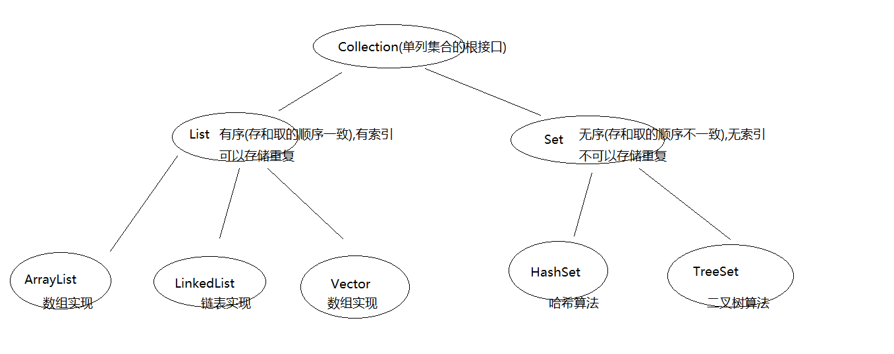

### Collection 集合

```java
java.util.Collection<E>							// 接口,泛型
```

#### 成员方法:

##### boolean add(E e)

###### 源码

```java
// add方法如果是List集合一直都返回true,因为List集合中是可以存储重复元素的
// 如果是Set集合当存储重复元素的时候,就会返回false
public boolean add(E e) {
    ensureCapacityInternal(size + 1);  			// Increments modCount!!
    elementData[size++] = e;
    return true;								
}
```

###### 范例:

```java
public static void demo1() {
    Collection c = new ArrayList();						//父类引用指向子类对象
    boolean b1 = c.add("abc");
    boolean b2 = c.add(true);							//自动装箱new Boolean(true);
    boolean b3 = c.add(100);
    boolean b4 = c.add(new Student("张三",23));			
    boolean b5 = c.add("abc");

    // List 无论添加什么都返回 true, List 可以添加重复值,而Set不行
    System.out.println( b1 );								
    System.out.println( c.toString() );	// toString 方法由 Collection 的父类 Iterable 重写
}
```


##### .remove(Object o)
> 移除此列表中首次出现的指定元素（如果存在）。

##### .clear()
> 移除此列表中的所有元素。此调用返回后，列表将为空。

##### .isEmpty()
> 如果此列表中没有元素，则返回 `true`

##### .size() 
> 返回此列表中的元素数。

##### .contains(Object o)

> 如果此列表中包含指定的元素，则返回 true。

```java
public static void main(String[] args) {
    Collection c = new ArrayList();		
    c.add("a");
    c.add("b");
    c.add("c");
    c.add("d");
    c.add("b");

    c.remove("b");										//移除此列表中首次出现的指定元素
    System.out.println(c);
    
    c.clear();											//清空集合
    System.out.println(c.contains("b"));					//判断是否包含
    System.out.println(c.isEmpty());
    System.out.println(c.size()); 							//获取元素的个数
    System.out.println(c);
}
// 输出结果:
// [a, c, d, b]
// false
// true
// 0
// []
```


##### .toArray()

> 把集合转成数组，可以实现集合的遍历

```java
public static void main(String[] args) {
    demo1();
    Collection c = new ArrayList();				// 存自定义对象
    c.add(new Student("张三", 23));			//Object obj = new Student("张三",23);
    c.add(new Student("李四", 24));

    Object[] arr = c.toArray();					//将集合转换成数组
    for (int i = 0; i < arr.length; i++) {
        //System.out.println(arr[i].getName() ); // 报错,多态的弊端,不能使用子类特有的属性和行为
        Student s = (Student)arr[i];			//向下转型
        System.out.println(s.getName() + "..." + s.getAge());
    }
}

private static void demo1() {
    Collection c = new ArrayList();		
    c.add("a");
    c.add("b");

    Object [] arr = c.toArray();
    for (Object each : arr) {
        System.out.println( each );
    }
}
// 输出结果:
// a
// b
// 张三...23
// 李四...24
```


##### 带All的功能演示
###### .addAll(Collection c)
> 将指定 collection 中的所有元素都添加到此 collection 中（可选操作）。
```java
Collection c1 = new ArrayList();
c1.add("a");
c1.add("b");
c1.add("c");
c1.add("d");

Collection c2 = new ArrayList();
c2.add("a");
c2.add("b");
c2.add("c");
c2.add("d");
c2.add("e");
c2.add("f");

c1.add(c2);									//将c2看成一个对象添加到c1中
// [a, b, c, d, [a, b, c, d, e, f]]
c1.addAll(c2);								//将c2中的每一个元素添加到c1中
// [a, b, c, d, a, b, c, d, e, f]
```


###### .removeAll(Collection c)
> 移除此 collection 中那些也包含在指定 collection 中的所有元素（可选操作）。

###### .containsAll(Collection c)
> 如果此 collection 包含指定 collection 中的所有元素，则返回 `true`。

###### .retainAll(Collection c)
> 仅保留此 collection 中那些也包含在指定 collection 的元素（可选操作）。


## Java 常见错误
### 错误: 找不到或无法加载主类 ...


### The type java.lang.CharSequence cannot be resolved. It is indirectly referenced from required .class files
> 造成这个问题的原因是 Eclipse 版本过低，不支持 JDK 1.8。


### Type mismatch: cannot convert from int to Integer
> 报这个错的原因是 在给 `Integer` 赋值的时候，与 `int` 类型不匹配造成的
> 出现该错误，原因是jdk版本不对。JDK1.5以后，Java为我们提供了更为丰富的转换方法。其中最值得一提的就是自动装包/自动拆包(AutoBoxing/UnBoxing)。 


```java
int i = 0;  
Integer wrapperi = i; 
```

- **首先查jdk** 如果JDK 大于 1.5, 说明问题不在jdk
- **接着看IDE**
    > 在这里用的是eclipse，window --> perferences-->java compiler-->修改jdk版本
    > 默认 1.4 ,调到自己安装的 JDK 版本即可( 1.5以后 )
- 问题解决


## 面试题
### 数据类型

#### String 类型

##### 判断定义为String类型的s1和s2是否相等

```java
public class Demo3_String {
	private static void demo1() {		// 常量池中没有这个字符串对象,就创建一个,如果有直接用即可
		String s1 = "abc";
		String s2 = "abc";
		System.out.println(s1 == s2); 			//true	
		System.out.println(s1.equals(s2)); 		//true, 相同值的常量是同一个地址
	}
	
	private static void demo2() {
		// 下面这句话在内存中创建了几个对象?
        String s1 = new String("abc");	
		// 创建两个对象,一个在常量池中,一个在堆内存中  	
		System.out.println(s1);
	}
	
	private static void demo3() {
		String s1 = new String("abc");			// 记录的是堆内存对象的地址值		
		String s2 = "abc";						// 记录的是常量池中的地址值
		System.out.println(s1 == s2); 			//false
		System.out.println(s1.equals(s2)); 		//true
	}
	
	private static void demo4() {
		//byte b = 3 + 4;						//在编译时就变成7,把7赋值给b,常量优化机制
		String s1 = "a" + "b" + "c";
		String s2 = "abc";
		System.out.println(s1 == s2); 			//true,java中有常量优化机制	
		System.out.println(s1.equals(s2)); 		//true
	}
	
	public static void main(String[] args) {
		//demo1();
		//demo2();
		//demo3();
		//demo4();
		String s1 = "ab";
		String s2 = "abc";
		String s3 = s1 + "c";
		System.out.println(s3 == s2);			// false
		System.out.println(s3.equals(s2)); 		// true
        // Java 语言提供对字符串串联符号（"+"）以及将其他对象转换为字符串的特殊支持。
        // 字符串串联是通过 StringBuilder（或 StringBuffer）类及其 append 方法实现的。
        // 字符串转换是通过 toString 方法实现的，该方法由 Object类定义，并可被Java中的所有类继承。
	}
}
```

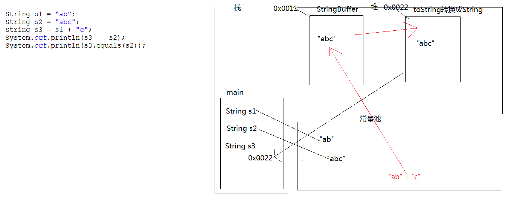


##### "" 和 null 的区别

"" 是字符串常量,同时也是一个 String 类的对象,既然是对象当然**可以调用String类中的方法**
nul l是空常量, **不能调用任何的方法,否则会出现空指针异常**,null常量可以给任意的引用数据类型赋值


### 面对对象

#### 抽象类
##### 一个抽象类如果没有抽象方法，可不可以定义为抽象类?如果可以，有什么意义?
>可以, 这么做目的只有一个,就是不让其他类创建本类对象,交给子类完成
```java
abstract class Demo {
    // 不报错!
}
```


##### abstract不能和哪些关键字共存?
###### static
> 被 `abstract` 修饰的方法没有方法体
> 被 `static` 修饰的可以用 `类名.调用`,但是 `类名.调用` 抽象方法是没有意义的

###### final
>被 `abstract` 修饰的方法强制子类重写
>被 `final` 修饰的不让子类重写,所以他俩是矛盾

###### private
>被 `abstract` 修饰的是为了让子类看到并强制重写
>被 `private` 修饰不让子类访问, 所以他俩是矛盾的

```java
abstract class Demo {
	//public static abstract void print();		//错误: 非法的修饰符组合: abstract和static
	//public final abstract void print();		//错误: 非法的修饰符组合: abstract和final
	private abstract void print();				//错误: 非法的修饰符组合: abstract和private
}
```


##### 类与类,类与接口,接口与接口的关系

- **类与类**

    > 继承关系,只能单继承,可以多层继承。

- **类与接口**

    >实现关系,可以单实现,也可以多实现。
    >并且还可以在继承一个类的同时实现多个接口。

- **接口与接口**

    > 继承关系,可以单继承,也可以多继承。 


#### 包

##### package, import, class 有没有顺序关系


#### 内部类

##### 编程题: 使用已知的变量，在控制台输出30，20，10。

```java
// 题目
class Outer {
    public int num = 10;
    class Inner {
        public int num = 20;
        public void show() {
            int num = 30;
            System.out.println(?);							// 填空
            System.out.println(??);							// 填空
            System.out.println(???);						// 填空
        }
    }
}
class InnerClassTest {
    public static void main(String[] args) {
        Outer.Inner oi = new Outer().new Inner();
        oi.show();
    }	
}
```
**答案**

```java
System.out.println(num);							
System.out.println(Outer.Inner.num);							
System.out.println(Outer.this.num);						
```


##### 按照要求，补齐代码

```java
// 要求在控制台输出”HelloWorld”
class OuterDemo {
	public static void main(String[] args) {
		  Outer.method().show();
	  }
}
interface Inter { void show(); }
class Outer { /* 补齐代码 */ }
```

**答案**

```java
class OuterDemo {
	public static void main(String[] args) {
		  Outer.method().show();						// 链式编程
          // 从以上可以看出,method方法是静态的 public static
          // show() 不能是静态的,因为它是接口中的抽象方法
	  }
}
interface Inter { void show(); }
class Outer { 
    return new Inter(){
        public void show(){
            System.out.println("Hello World!");
        }
    }
}
```


### 常用 API

#### SimpleDateFormat 类

##### 算一下你来到这个世界多少天?

```java
public static void main(String[] args) throws ParseException {
    //1,将生日字符串和今天字符串存在String类型的变量中
    String birthday = "1983年07月08日";
    String today = "2088年6月6日";
    
    //2,定义日期格式化对象
    SimpleDateFormat sdf = new SimpleDateFormat("yyyy年MM月dd日");
    
    //3,将日期字符串转换成日期对象
    Date d1 = sdf.parse(birthday);
    Date d2 = sdf.parse(today);
    
    //4,通过日期对象后期时间毫秒值
    long time = d2.getTime() - d1.getTime();
    
    //5,将两个时间毫秒值相减除以1000,再除以60,再除以60,再除以24得到天
    System.out.println(time / 1000 / 60 / 60 / 24 );
}
```


##### 判断该年是闰年还是平年

```java
private static boolean getYear(int year) {
    //2,创建Calendar c = Calendar.getInstance();
    Calendar c = Calendar.getInstance();
    //设置为那一年的3月1日
    c.set(year, 2, 1);
    //将日向前减去1
    c.add(Calendar.接你DAY_OF_MONTH, -1);
    //判断是否是29天
    return c.get(Calendar.DAY_OF_MONTH) == 29;
}
```


#### StringBuffer 类
##### StringBuffer 与StringBuilder 的区别
> `StringBuffer` 是 jdk1.0版本的,是线程安全的,效率低
> `StringBuilder` 是 jdk1.5 版本的,是线程不安全的, 效率高


##### String 与 StringBuffer, StringBuilder 的区别
>`String` 是一个不可变的字符序列
>`StringBuffer` 和 `StringBuilder` 是可变的字符序列


##### String 与 StringBuffer 形式参数问题

>基本数据类型的值传递,不改变其值
>引用数据类型的值传递,改变其值

```markdown
# String类虽然是引用数据类型,但是他当作参数传递时和基本数据类型是一样的
```

```java
public static void main(String[] args) {
    String s = "baidu";
    System.out.println(s);
    change(s);
    System.out.println(s);


    System.out.println("---------------------");
    StringBuffer sb = new StringBuffer();
    sb.append("baidu");
    System.out.println(sb);
    change(sb);
    System.out.println(sb);
}
public static void change(StringBuffer sb) {
    sb.append("+String");
}
public static void change(String s) {
    s += "+String";
}
// 输出结果:
// baidu
// baidu
// ---------------------
// baidu
// baidu+String
```


#### 基本数据封装类

##### Integer 类

###### equal()

```java
public static void main(String[] args) {
    Integer i1 = new Integer(97);
    Integer i2 = new Integer(97);
    System.out.println(i1 == i2);				//false
    System.out.println(i1.equals(i2));			//true
    System.out.println("-----------");


    Integer i4 = 127;
    Integer i5 = 127;
    System.out.println(i4 == i5);				//true
    System.out.println(i4.equals(i5));			//true
    System.out.println("-----------");

    Integer i6 = 128;
    Integer i7 = 128;
    System.out.println(i6 == i7);
    System.out.println(i6.equals(i7));			//true

    /*
	* -128到127是byte的取值范围,如果在这个取值范围内,自动装箱就不会新创建对象,而是从常量池中获取
	* 如果超过了byte取值范围就会再新创建对象
	* 
	* public static Integer valueOf(int i) {
		   assert IntegerCache.high >= 127;
		   if (i >= IntegerCache.low && i <= IntegerCache.high)	//i>= -128 && i <= 127
		       return IntegerCache.cache[i + (-IntegerCache.low)];
		    return new Integer(i);
	}
		 */
}
```


