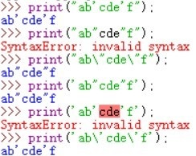
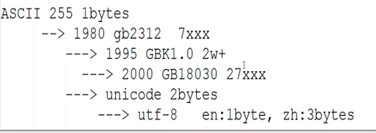

----------------------------------------------
> *Made By Herolh*
----------------------------------------------

# 目录 {#index}

[TOC]


--------------------------------------------

# Python 科普

> 该部分可直接跳过 skip去基础吧少年！

## python 简介

### 为什么学习python

<http://bbs.fishc.com/thread-35584-1-1.html> 

### Python 特点

**易于学习**：Python 有相对较少的关键字，结构简单，和一个明确定义的语法，学习起来更加简单。
**易于阅读**：Python 代码定义的更清晰。
**易于维护：**Python 的成功在于它的源代码是相当容易维护的。
**一个广泛的标准库**：Python 的最大的优势之一是丰富的库，跨平台的，在UNIX，Windows 和 Macintosh 兼容很好。
**互动模式：**互动模式的支持，您可以从终端输入执行代码并获得结果的语言，互动的测试和调试代码片断。
**可移植：**基于其开放源代码的特性，Python 已经被移植( 也就是使其工作 )到许多平台。
**可扩展**：如果你需要一段运行很快的关键代码，或者是想要编写一些不愿开放的算法，你可以使用 C 或 C++ 完成那部分程序，然后从你的 Python 程序中调用。
**数据库**：Python 提供所有主要的商业数据库的接口。
**GUI编程**：Python 支持 GUI 可以创建和移植到许多系统调用。
**可嵌入:** 你可以将Python 嵌入到C/C++ 程序，让你的程序的用户获得"脚本化"的能力。


### 目前Python主要应用领域
**云计算:** 云计算最火的语言， 典型应用 OpenStack
**WEB开发:** 众多优秀的WEB框架，众多大型网站均为 Python 开发，Youtube， Dropbox， 豆瓣，典型 WEB 框架有Django
**科学运算、人工智能:** 典型库NumPy， SciPy， Matplotlib， Enthought librarys，pandas
**系统运维:** 运维人员必备语言
**金融**：量化交易，金融分析，在金融工程领域，Python 不但在用，且用的最多，而且重要性逐年提高，尤其擅长策略回测
**图形GUI:** PyQT， WxPython，TkInter


### Python 发展历史
&emsp;&emsp;Python 是由**吉多·范罗苏姆**( Guido van Rossum )在八十年代末和九十年代初(1989 年圣诞节期间，为了打发无聊的圣诞节而编写的一个编程语言，1991 年初发表)，在荷兰国家数学和计算机科学研究所设计出来的。Python 本身也是由诸多其他语言发展而来的，这包括 ABC、Modula-3、C、C++、Algol-68、SmallTalk、Unix shell 和其他的脚本语言等等。
&emsp;&emsp;像 Perl 语言一样，Python 源代码同样遵循 GPL(GNU General Public License) 协议。现在 Python 是由一个核心开发团队在维护，Guido van Rossum 仍然占据着至关重要的作用，指导其进展。
&emsp;&emsp;最新的 TIOBE 排行榜，Python 赶超 PHP 占据第五， Python 崇尚优美、清晰、简单，是一个优秀并广泛使用的语言。

        

由上图可见，Python 整体呈上升趋势，反映出 Python 应用越来越广泛并且也逐渐得到业内的认可


### Python在一些公司的应用
**谷歌**：Google App Engine 、code.google.com 、Google earth 、谷歌爬虫、Google广告等项目都在大量使用Python开发
**CIA:** 美国中情局网站就是用 Python 开发的
**NASA**: 美国航天局(NASA)大量使用 Python 进行数据分析和运算
**YouTube:**世界上最大的视频网站 YouTube 就是 用Python 开发的
**Dropbox:**美国最大的在线云存储网站，全部用Python 实现，每天网站处理 10 亿个文件的上传和下载
**Instagram:**美国最大的图片分享社交网站，每天超过3千万张照片被分享，全部用 python 开发
**Facebook:**大量的基础库均通过 Python 实现的
**Redhat:** 世界上最流行的 Linux 发行版本中的 yum 包管理工具就是用 python 开发的
**豆瓣:** 公司几乎所有的业务均是通过 Python 开发的
**知乎**: 国内最大的问答社区，通过 Python 开发(国外Quora )
**春雨医生**：国内知名的在线医疗网站是用 Python 开发的
除上面之外，还有搜狐、金山、腾讯、盛大、网易、百度、阿里、淘宝 、土豆、新浪、果壳等公司都在使用 Python 完成各种各样的任务。


## python是一种什么语言？
### 1.低级语言与高级语言
&emsp;&emsp;最初的计算机程序都是用 0 和 1 的序列表示的，程序员直接使用的是机器指令，无需翻译，从纸带打孔输入即可执行得到结果。后来为了方便记忆，就将用0、1序列表示的机器指令都用符号助记，这些与机器指令一一对应的助记符就成了汇编指令，从而诞生了汇编语言。
**&emsp;&emsp;无论是机器指令还是汇编指令都是面向机器的，统称为低级语言**。因为是针对特定机器的机器指令的助记符，所以**汇编语言是无法独立于机器(特定的 CPU 体系结构)的**。但汇编语言也是要经过翻译成机器指令才能执行的，所以也有将运行在一种机器上的汇编语言翻译成运行在另一种机器上的机器指令的方法，那就是**交叉汇编技术**。

&emsp;&emsp;高级语言是从人类的逻辑思维角度出发的计算机语言，抽象程度大大提高，需要经过编译成特定机器上的目标代码才能执行，一条高级语言的语句往往需要若干条机器指令来完成。**高级语言独立于机器的特性是靠编译器为不同机器生成不同的目标代码(或机器指令)来实现的**。
&emsp;&emsp;那具体的说，要将高级语言编译到什么程度呢，这又跟编译的技术有关了，既可以编译成直接可执行的目标代码，也可以编译成一种中间表示，然后拿到不同的机器和系统上去执行，这种情况通常又需要支撑环境，比如解释器或虚拟机的支持，Java 程序编译成 bytecode，再由不同平台上的虚拟机执行就是很好的例子。所以，说**高级语言不依赖于机器，是指在不同的机器或平台上高级语言的程序本身不变，而通过编译器编译得到的目标代码去适应不同的机器**。从这个意义上来说，通过交叉汇编，一些汇编程序也可以获得不同机器之间的可移植性，但这种途径获得的移植性远远不如高级语言来的方便和实用性大。


### 2.编译与解释
- **编译**是将源程序翻译成可执行的目标代码，翻译与执行是分开的；
- **解释**是对源程序的翻译与执行一次性完成，不生成可存储的目标代码。
- **编译器**是把源程序的每一条语句都编译成机器语言，并保存成二进制文件，这样运行时计算机可以直接以机器语言来运行此程序，速度很快; 
- **解释器**则是只在执行程序时，才一条一条的解释成机器语言给计算机来执行，所以运行速度是不如编译后的程序运行的快的. 这是因为计算机不能直接认识并执行我们写的语句，它只能认识机器语言(是二进制的形式)

&emsp;&emsp;这只是表象，二者背后的最大区别是：**对解释执行而言，程序运行时的控制权在解释器而不在用户程序；对编译执行而言，运行时的控制权在用户程序。**

&emsp;&emsp;解释具有良好的动态特性和可移植性，比如在解释执行时可以动态改变变量的类型、对程序进行修改以及在程序中插入良好的调试诊断信息等，而将解释器移植到不同的系统上，则程序不用改动就可以在移植了解释器的系统上运行。同时解释器也有很大的缺点，比如执行效率低，占用空间大，因为不仅要给用户程序分配空间，解释器本身也占用了宝贵的系统资源。

&emsp;&emsp;编译器是把源程序的每一条语句都编译成机器语言，并保存成二进制文件，这样运行时计算机可以直接以机器语言来运行此程序，速度很快; 而解释器是只在执行程序时，才一条一条的解释成机器语言给计算机来执行，所以运行速度是不如编译后的程序运行的快的.


### 3.编译型和解释型
&emsp;&emsp;编译型其实它和汇编语言是一样的：也是有一个负责翻译的程序来对我们的源代码进行转换，生成相对应的可执行代码。这个过程说得专业一点，就称为编译( Compile )，而负责编译的程序自然就称为编译器( Compiler )。如果我们写的程序代码都包含在一个源文件中，那么通常编译之后就会直接生成一个**可执行文件**，我们就可以直接运行了。但对于一个比较复杂的项目，为了方便管理，我们通常把代码分散在各个源文件中，作为不同的模块来组织。这时编译各个文件时就会生成**目标文件( Object file )**而不是前面说的可执行文件。一般一个源文件的编译都会对应一个目标文件。这些目标文件里的内容基本上已经是可执行代码了，但由于只是整个项目的一部分，所以我们还不能直接运行。待所有的源文件的编译都大功告成，我们就可以最后把这些半成品的目标文件 “打包”成一个可执行文件了，这个工作由另一个程序负责完成，由于此过程好像是把包含可执行代码的目标文件连接装配起来，所以又称为链接( Link )，而负责链接的程序就叫……就叫**链接程序( Linker )**。链接程序除了链接目标文件外，可能还有各种资源，像图标文件啊、声音文件啊什么的，还要负责去除目标文件之间的冗余重复代码，等等。链接完成之后，一般就可以得到我们想要的可执行文件了。 

&emsp;&emsp;从字面上看， “编译”和 “解释”的确都有 “翻译”的意思，它们的**区别在于翻译的时机安排不大一样**。打个比方：
&emsp;&emsp;假如你打算阅读一本外文书，而你不知道这门外语，那么你可以找一名翻译，给他足够的时间让他从头到尾把整本书翻译好，然后把书的母语版交给你阅读；或者，你也立刻让这名翻译辅助你阅读，让他一句一句给你翻译，如果你想往回看某个章节，他也得重新给你翻译。 
&emsp;&emsp;两种方式，前者就相当于我们刚才所说的**编译型：一次把所有的代码转换成机器语言，然后写成可执行文件**；而后者就相当于我们要说的**解释型：在程序运行的前一刻，还只有源程序而没有可执行程序**；而程序每执行到源程序的某一条指令，则会有一个称之为解释程序的外壳程序将源代码转换成二进制代码以供执行。
&emsp;&emsp;总言之，解释型就是不断地解释、执行、解释、执行……所以，**解释型程序是离不开解释程序的**。像早期的BASIC 就是一门经典的解释型语言，要执行 BASIC 程序，就得进入 BASIC 环境，然后才能加载程序源文件、运行。解释型程序中，由于程序总是以源代码的形式出现，因此只要有相应的解释器，移植几乎不成问题。编译型程序虽然源代码也可以移植，但前提是必须针对不同的系统分别进行编译，对于复杂的工程来说，的确是一件不小的时间消耗，况且很可能一些细节的地方还是要修改源代码。而且，解释型程序省却了编译的步骤，修改调试也非常方便，编辑完毕之后即可立即运行，不必像编译型程序一样每次进行小小改动都要耐心等待漫长的 Compiling…Linking… 这样的编译链接过程。
&emsp;&emsp;不过凡事有利有弊，由于解释型程序是将编译的过程放到执行过程中，这就决定了解释型程序注定要比编译型慢上一大截，像几百倍的速度差距也是不足为奇的。 

#### 总结
&emsp;&emsp;编译型与解释型，两者各有利弊。前者由于程序执行速度快，同等条件下对系统要求较低，因此像开发操作系统、大型应用程序、数据库系统等时都采用它，像 C/C++、Pascal/Object、Pascal(Delphi)、VB 等基本都可视为编译语言，而一些网页脚本、服务器脚本及辅助开发接口这样的对速度要求不高、对不同系统平台间的兼容性有一定要求的程序则通常使用解释性语言，如 Java、JavaScript、VBScript、Perl、Python等等。 

#### 未来
&emsp;&emsp;既然编译型与解释型各有优缺点又相互对立，所以一批新兴的语言都有把两者折衷起来的趋势，例如 Java 语言虽然比较接近解释型语言的特征，但**在执行之前已经预先进行一次预编译，生成的代码是介于机器码和Java源代码之间的中介代码**，运行的时候则由JVM( Java 的虚拟机平台，可视为解释器 )解释执行。它既保留了源代码的高抽象、可移植的特点，又已经完成了对源代码的大部分预编译工作，所以执行起来比 “纯解释型”程序要快许多。
&emsp;&emsp;而像 VB6(或者以前版本)、C# 这样的语言，虽然表面上看生成的是 `.exe ` 可执行程序文件，但 VB6 编译之后实际生成的也是一种中介码，只不过编译器在前面安插了一段自动调用某个外部解释器的代码( 该解释程序独立于用户编写的程序，存放于系统的某个 DLL 文件中，所有以 VB6 编译生成的可执行程序都要用到它 )，以解释执行实际的程序体。C#( 以及其它 .net 的语言编译器 )则是生成 .net 目标代码，实际执行时则由 .net 解释系统( 就像 JVM 一样，也是一个虚拟机平台 )进行执行。当然.net目标代码已经相当 “低级”，比较接近机器语言了，所以仍将其视为编译语言，而且其可移植程度也没有Java号称的这么强大，Java号称是 “一次编译，到处执行”，而.net则是 “一次编码，到处编译”。总之，随着设计技术与硬件的不断发展，编译型与解释型两种方式的界限正在不断变得模糊。


### 4.动态语言和静态语言
> 通常我们所说的动态语言、静态语言是指动态类型语言和静态类型语言。

- **动态类型语言：**

    > &emsp;&emsp;**动态类型语言是指在运行期间才去做数据类型检查的语言**，也就是说，在用动态类型的语言编程时，永远也不用给任何变量指定数据类型，该语言会在你第一次赋值给变量时，在内部将数据类型记录下来。Python 和 Ruby 就是一种典型的动态类型语言，其他的各种脚本语言如 VBScript 也多少属于动态类型语言。

- **静态类型语言：**

    > &emsp;&emsp;**静态类型语言的数据类型是在编译其间检查的**，与动态类型语言刚好相反，也就是说在写程序时要声明所有变量的数据类型，C/C++ 是静态类型语言的典型代表，其他的静态类型语言还有 C#、JAVA 等。


### 5.强类型和弱类型定义语言
- **强类型定义语言：**
    > 一旦一个变量被指定了某个数据类型，如果不经过强制转换，那么它就永远是这个数据类型了
    > 举个例子：如果你定义了一个整型变量 a，那么程序根本不可能将 a 当作字符串类型处理。强类型定义语言是类型安全的语言。

- **弱类型定义语言：**
    > 数据类型可以被忽略的语言。它与强类型定义语言相反， 一个变量可以赋不同数据类型的值。
    > 强类型定义语言在速度上可能略逊色于弱类型定义语言，但是强类型定义语言带来的严谨性能够有效的避免许多错误。

#### !attention!
&emsp;&emsp;另外 “**这门语言是不是动态语言” 与 “这门语言是否类型安全” 之间是完全没有联系的！**例如：
Python 是动态语言，是强类型定义语言( 类型安全的语言 );
VBScript是动态语言，是弱类型定义语言( 类型不安全的语言 ); 
JAVA是静态语言，是强类型定义语言( 类型安全的语言 )。


### 6.python关键优缺点
#### 优点：
- **可移植性**:
    > 由于它的开源本质，Python 已经被移植在许多平台上( 经过改动使它能够工 作在不同平台上 )。
    > 如果你**小心地避免使用依赖于系统的特性**，那么你的所有 Python 程序无需修改就几乎可以在市场上所有的系统平台上运行

- **可扩展性**

    > 如果你需要你的一段关键代码运行得更快或者希望某些算法不公开，你可以把你的部分程序用 C 或 C++ 编写，然后在你的 Python 程序中使用它们。

- **可嵌入性**

    > 你可以把 Python 嵌入你的 C/C++ 程序，从而向你的程序用户提供脚本功能。


#### 缺点：
- **速度慢**

    > Python 的运行速度相比 C 语言确实慢很多，跟 JAVA 相比也要慢一些，因此这也是很多所谓的大牛不屑于使用 Python 的主要原因，但其实这里所指的运行速度慢在大多数情况下用户是无法直接感知到的，因为**一个正常人所能感知的时间最小单位是 0.15-0.4s 左右**。其实在大多数情况下 Python 已经完全可以满足你对程序速度的要求，除非你要写对速度要求极高的搜索引擎等，这种情况下，当然还是建议你用 C 去实现的。

- **代码不能加密**
    > &emsp;&emsp;因为 PYTHON 是解释性语言，它的源码都是以明文形式存放的，不过我不认为这算是一个缺点，如果你的项目要求源代码必须是加密的，那你一开始就不应该用 Python 来去实现。
    >
    > &emsp;&emsp;如果要发布你的 Python 程序，实际上就是发布源代码，这一点跟 C 语言不同，C 语言不用发布源代码，只需要把编译后的机器码( 也就是你在 Windows上常见的 xxx.exe 文件 )发布出去。要从机器码反推出 C 代码是不可能的，所以，凡是编译型的语言，都没有这个问题，而解释型的语言，则必须把源码发布出去。
    > &emsp;&emsp;这个缺点仅限于你要编写的软件需要卖给别人挣钱的时候。好消息是目前的互联网时代，靠卖软件授权的商业模式越来越少了，靠网站和移动应用卖服务的模式越来越多了，后一种模式不需要把源码给别人。
    > &emsp;&emsp;再说了，现在如火如荼的开源运动和互联网自由开放的精神是一致的，互联网上有无数非常优秀的像 Linux 一样的开源代码，我们千万不要高估自己写的代码真的有非常大的 “商业价值”。那些大公司的代码不愿意开放的更重要的原因是代码写得太烂了，一旦开源，就没人敢用他们的产品了。

- **线程不能利用多CPU问题**
    > &emsp;&emsp;这是 Python 被人诟病最多的一个缺点，GIL 即全局解释器锁( Global Interpreter Lock )，是计算机程序设计语言解释器用于同步线程的工具，使得任何时刻仅有一个线程在执行，
    > &emsp;&emsp;**Python的线程是操作系统的原生线程。在Linux上为 pthread，在 Windows 上为 Win thread，完全由操作系统调度线程的执行。**一个 python 解释器进程内有一条主线程，以及多条用户程序的执行线程。即使在多核 CPU 平台上，由于 GIL 的存在，所以禁止多线程的并行执行。关于这个问题的折衷解决方法，我们在以后线程和进程章节里再进行详细探讨。


### 7.总结

&emsp;&emsp;通过上面这些介绍，我们可以得出，**python是一门动态解释性的强类型定义语言**。那这些基因使成就了Python。

 


## Python 安装和解释器选择

### Python 安装

#### Windows下安装

> 访问<http://www.python.org/>，点击 download 链接，选择 pyhon3.x windows installer 下载，双击下载的文件一路 next 即可。                      

#### Linux下安装python

一般linux系统的桌面会自动安装python2.0，可以在提示符下输入 python 命令进行验证：

```shell
python                   			# 运行这个命令会启动交互式python解释器。
# 若没有安装python解释器会报错：       bash:python:command not found
```


#### 特殊:从源文件编译

&emsp;&emsp;如果没有包管理器，或者不愿意使用，也可以自己编译python。选择这个方法的另一个原因可能是没有正在使用的root权限。这个方法非常的灵活，你可以在任何位置安装python，甚至在用户的主目录下。
- 访问下载网页( 参照window下载的前两步 )，按照说明下载源码。

- 下载扩展名为 `.tgz` 或者 `.tar.xz` 的文件，将其保存在临时位置，假定读者想将 python 安装在自己的目录下，可以把它放在类似 `~/python` 的目录中。进入这个目录( 比如使用 `cd ~/python` 命令 )。

- 在终端命令模式使用 `tar –xzvf Python-3.4.2.tgz` 解压缩文件。( 3.4.2是版本号 )。

- 进入解压好的文件夹：
    ```shell
    cd python-3.4.2
    ```

- 如果提示安装错误或者缺少某个依赖库，请先行安装再执行下列命令：
    ```shell
    ./configure
    Make install
    Make
    ```

- 最后应该能在文件夹内找到一个名为python的可执行文件。将当前文件夹的路径加入到环境变量path里，安装完成。

- 若要查看其他配置命令，执行以下命令：

    ```shell
    ./configure --help
    ```

    

### Python解释器
&emsp;&emsp;当我们编写 Python 代码时，我们得到的是一个包含 Python 代码的以 `.py` 为扩展名的文本文件。要运行代码，就需要 Python 解释器去执行 `.py` 文件。由于整个 Python 语言从规范到解释器都是开源的，所以理论上，只要水平够高，任何人都可以编写 Python 解释器来执行 Python 代码( 当然难度很大 )。事实上，确实存在多种 Python 解释器。

- **CPython**

    > &emsp;&emsp;当我们从 Python 官方网站下载并安装好 Python 后，我们就直接获得了一个官方版本的解释器：CPython。这个解释器是用 C 语言开发的，所以叫 CPython。
    > &emsp;&emsp;在命令行下运行 python 就是启动 CPython 解释器。CPython 是使用最广的 Python 解释器。教程的所有代码也都在 CPython 下执行。

- **IPython**

  > &emsp;&emsp;IPython是基于CPython之上的一个交互式解释器，也就是说，IPython只是在交互方式上有所增强，但是执行Python代码的功能和CPython是完全一样的。好比很多国产浏览器虽然外观不同，但内核其实都是调用了IE。
  **CPython****用>>>作为提示符，而IPython用In [序号]:作为提示符**。

- **PyPy**( 很可能是python的未来 )

    > &emsp;&emsp;PyPy 是另一个 Python 解释器，**它的目标是执行速度。PyPy 采用 JIT 技术，对 Python 代码进行动态编译( 注意不是解释 )，所以可以显著提高 Python 代码的执行速度。**绝大部分 Python 代码都可以在PyPy 下运行，但是 PyPy 和 CPython 有一些是不同的，这就导致相同的 Python 代码在两种解释器下执行可能会有不同的结果。如果你的代码要放到 PyPy 下执行，就需要了解 PyPy 和 CPython 的不同点。

- **Jython**

    > Jython是运行在Java平台上的Python解释器，可以直接把Python代码编译成Java字节码执行。

- **IronPython**

    > &emsp;&emsp;IronPython和Jython类似，只不过IronPython是运行在微软.Net平台上的Python解释器，可以直接把Python代码编译成.Net的字节码。

#### 小结
&emsp;&emsp;Python的解释器很多，但使用最广泛的还是 CPython。如果要和 Java 或 .Net 平台交互，最好的办法不是用Jython或IronPython，而是通过网络调用来交互，确保各程序之间的独立性。


## Python文件类型
### .pyc是什么？

#### 1. Python是一门解释型语言？

&emsp;&emsp;我初学 Python 时，听到的关于 Python 的第一句话就是，Python 是一门解释性语言，我就这样一直相信下去，直到发现了 `*.pyc` 文件的存在。如果是解释型语言，那么生成的 `*.pyc` 文件是什么呢？c 应该是 compiled 的缩写才对啊！为了防止其他学习 Python 的人也被这句话误解，那么我们就在文中来澄清下这个问题，并且把一些基础概念给理清。

#### **2.** **解释型语言和编译型语言**

&emsp;&emsp;计算机是不能够识别高级语言的，所以当我们运行一个高级语言程序的时候，就需要一个 “翻译机”来从事把高级语言转变成计算机能读懂的机器语言的过程。这个过程分成两类，第一种是编译，第二种是解释。编译型语言在程序执行之前，先会通过编译器对程序执行一个编译的过程，把程序转变成机器语言。运行时就不需要翻译，而直接执行就可以了。最典型的例子就是 C 语言。
&emsp;&emsp;解释型语言就没有这个编译的过程，而是在程序运行的时候，通过解释器对程序逐行作出解释，然后直接运行，最典型的例子是 Ruby。
&emsp;&emsp;通过以上的例子，我们可以来总结一下解释型语言和编译型语言的优缺点，因为编译型语言在程序运行之前就已经对程序做出了 “翻译”，所以在运行时就少掉了 “翻译”的过程，所以效率比较高。但是我们也不能一概而论，一些解释型语言也可以通过解释器的优化来在对程序做出翻译时对整个程序做出优化，从而在效率上超过编译型语言。
&emsp;&emsp;此外，随着Java等基于虚拟机的语言的兴起，我们又不能把语言纯粹地分成解释型和编译型这两种。用Java来举例，Java首先是通过编译器编译成字节码文件，然后在运行时通过解释器给解释成机器文件。所以我们说Java是一种先编译后解释的语言。

#### 3. Python到底是什么

其实 Python 和 Java/C# 一样，也是一门基于虚拟机的语言，我们先来从表面上简单地了解一下 Python 程序的运行过程吧。当我们在命令行中输入 `python hello.py` 时，其实是激活了 Python 的  “解释器”，告诉  “解释器”：你要开始工作了。可是在 “解释” 之前，其实执行的第一项工作和 Java 一样，是编译。熟悉 Java 的同学可以想一下我们在命令行中如何执行一个Java的程序：

```shell
javac hello.java
java hello
```

只是我们在用 Eclipse 之类的 IDE 时，将这两部给融合成了一部而已。其实 Python 也一样，当我们执行 python hello.py时，他也一样执行了这么一个过程，所以我们应该这样来描述 Python，**Python 是一门先编译后解释的语言。**

#### 4. 简述Python的运行过程

&emsp;&emsp;在说这个问题之前，我们先来说两个概念，PyCodeObject 和 pyc 文件。我们在硬盘上看到的 pyc 自然不必多说，而其实 PyCodeObject 则是 Python 编译器真正编译成的结果。我们先简单知道就可以了。当 python 程序运行时，编译的结果则是保存在位于内存中的 PyCodeObjec t中，当 Python 程序运行结束时，Python 解释器则将PyCodeObject 写回到 pyc 文件中。当 pytho n程序第二次运行时，首先程序会在硬盘中寻找 pyc 文件，如果找到，则直接载入，否则就重复上面的过程。所以我们应该这样来定位 PyCodeObject 和 pyc 文件，我们说 **pyc 文件其实是 PyCodeObject 的一种持久化保存方式**。


### python的文件类型

&emsp;&emsp;**Python 文件类型主要 分三种，源代码，字节代码，优化代码。**这些代码可以直接运行，不需要进行编译或者链接。这正是Pyuhon 这门语言的特性，python 的文件通过 python 解释器解释运行。Windows 中有`python.exe` 与 `pythonw.exe`， 一般安装在路径 `C:\python33` 中当然也可以改变它的路径，只要保证环境变量设置正确即可。在 linux 系统中，Python 解释器被安装在目标机器的 `/usr/local/bin/python` 目录下，将 `/usr/local/bin` 路径放进 shell 的搜索路径中，即可通过 python 命令在终端调用。

#### 1.源代码

&emsp;&emsp;Python 源代码的扩展名以 py 结尾，可在控制台下运行。Python 语言不需要编译成二进制代码，可直接运行源代码。Pyw 是 Windows下开发图片用户接口(Graphical user interface)的源文件，作为桌面应用程序的后缀名。这种文件是专门用于开发图形界面的，`pythonx.exe` 解释运行。以 py 和 pyw 为后级名的文件可以用文本工具打开，并修改文件的内容。

#### 2.字节代码

&emsp;&emsp;Python 源文件编译后生成 `.pyc` 后缀的文件，pyc 是编译过的字节文件，这种文件不能使用文本编辑工具打开或修改。`.pyc` 文件是与平台无关的，因此 Python 的程序可以运行在 Windows、UNIX、Linux 等操作系统上。py 文件直接运行后即可得到 pyc 类型的文件，或通过脚本生成该类型的文件。下面这段脚本可以把 `hello.py` 编译为 `hello.pyc`。保存此脚本，运行后可得到 `hello.pyc` 文件。

```python
import py_compile
py_compile.compilel('hello.py')
```


#### 3.优化代码

&emsp;&emsp;扩展名为 pyo 的文件是优化过的源文件，pyo 类型的文件需要用命令行工其生成。pyo不能使用文本编辑工具打开或修改。下面把 `hello.py ` 编译成 `hello.pyo`。

- 启动命令行窗口，进入 `hello.py` 文件所在的目录。例如:

    ```shell
    cd /D D:\developer\python\example\02\2.1
    ```

    > 以上路径是笔者设置的的 `hello.py` 文件所在的目录，读者可根据自己的环境进行修改。

- 在命令行中输入 `python -O -m py_compile hello py`，并按回车键。

    ```shell
    python -O -m  py_compile  hello.py
    ```

    **参数"-O" :** 表示生成优化代码。

    **参数"-m" :** 表示把导入的 `y_compile` 模块作为脚本运行。编译 `hello.pyo` 需要调用py_compile模块的compileO 方法。

    **参数 “hello.py" :** 是待编译的文件名。

    最后，查看hello.y 文件所在的目录，此时目录中生成了一个名为 `hello.pyo` 的文件。


# python 基础
## 第一个 python 程序

- **windows 平台下**

    ```python
    Print “hello world!”				  	# python3 之前可运行，在3会报错
    Print(“hello, world!”)            		# python3 版本的语法
    ```

    1.打开文本编译器，输入上述代码，然后将其保存为  `~.py`
    2.在 windows 下可以通过双击 `~.py` 文件运行，可以看到一个命令行窗口出现，又很快地关闭。
    3.为了能看到程序的输出内容，在命令行窗口直接输入 `~.py` 文件的绝对路径及文件名或：`python d:file/~.py,` 再按enter键运行

    

- **linux 平台下**
    在 linux 下创建一个文件叫 `hello.py` ,并输入代码，然后执行
    ```shell
    localhost $ vim hello.py
    	print("Hello World!")
    localhost $ python hello.py
    ```

    - 指定解释器
        上一步中执行 `python hello.py` 时，明确的指出`hello.py` 脚本由 python 解释器来执行。如果想要类似于执行 shell 脚本一样执行 python 脚本，例： `./hello.py`，那么就需要在 `hello.py` 文件的头部指定解释器，如下：

        ```python
        #!/usr/bin/env python
        print("hello world!")
        ```

        如此一来，执行： `./hello.py` 即可。

        **ps：**执行前需给予 `hello.py` 执行权限，`chmod 755 hello.py`


## 缩进分层 
&emsp;&emsp;有些语言中，缩进只是一个风格问题，不论你喜欢还是不喜欢，都可以缩进。不过，在 Python 中，编写代码时缩进是必不可少的一部分。缩进会告诉 Python 代码块从哪里开始，到哪里结束。Python 程序要求的代码最后都全部用缩进来分层(块)。
&emsp;&emsp;一般来说，**行尾的 `:` 表示下一行代码缩进的开始。**将代码块缩进多远并不重要，只要保证整个代码块缩进的程度是一样的。Python的编程规范指出：缩进最好采用空格的形式，每一层向右缩进4个空格。一般不建议使用tab 键进行缩进。(不同环境下tab的格式不一样)
&emsp;&emsp;要注意的是，处于同一级的代码缩进量要保持一致，并且缩进符号 (Tab键，空格等) 也应该保持一致，这样才能保证嵌套正确。如以下就会出错:

```python
If a > b:
    Print(a)
  Print(‘>’)		#此处代码少缩进两个空格
    Print(b)
```


## 代码注释与断行
### 代码注释
- **单行注释 `#`**

    > 以 `#` 字符开始，同一行中其后的所有内容都视为注释，不论什么都不会执行

- **多行注释`'''`和 `""" `
    > 用三个单引号或者三个双引号将注释内容包围起来

    ```python
    '''
    该程序的功能是：
    根据变量x的值输出+/-
    '''
    if a >= 0:
        print('+')    				# 大于0输出+
    else：
        print('-')
    """
    最后一行#print(x)不会被执行
    """
    # print(x)
    ```


### 代码断行
- **分号断行**

    >  Python 不需要用分号 `;` 来分隔语句，直接将一条语句写在一行之内。但是！！！
    > **python中其实也可以将两条语句写在同一行而中间用分号隔开。**

- **冒号断行**

    >  还有就是**，**如果缩进语句块中只有一条语句，也可以直接写在 `:` 的后面。

    ```python
    Print(‘+’);print(‘-‘)       	# 用 ；分隔的写在同一行的两个语句
    if a >= a:print(‘+’)         	# 缩进的语句只有一行而写在同一行
    ```

- **反斜线断行**

    > 若 python 一条语句过长或为了结构清晰而不能或不方便写入同一行内，这时也可以使用 `\` 将该行以后的内容写入下一行，而 **“\”后则不允许有任何内容 (包括单行注释) 。**

    ```python
    Print(“I am a teacher”,\
    First_name,\
    Last_name)
    ```

    以上代码去掉 `\` 也是正确的，因为 python 语言规定了圆括号包围的部分是可以写在不同行的。

    

## Python输入/输出 

### 接收键盘/输入

- **基本形式**

    Python 程序如果要进行输入，就必须调用 `input()` 函数，基本信息如下：

    ```python
    input ([提示]) 
    # 在 python2.X 中为 raw_input = input
    # 在python3中也有raw_input，不过很恶心，不用  
    ```

    这个函数是 python 内建函数直接调用即可。其中参数 [提示] 是可选的，既可以使用，也可以不使用。参数是用来提供用户输入的提示信息的字符串。
    当用户输入程序所需要的数据时，就会以字符串的形式返回。`input()` 函数接收键盘输入，无论输入的是整数，浮点数还是小数，python 得到的都是字符串，那么需要整数或浮点数时都需要进行类型转换。

    > **!attention:**
    > Python 3 中去除了python2 中` input()`函数(可以直接获取数字而不需要进行转换)，只有 `raw_input()`
    > 更令人感到混乱的是，Python 2 中的 `raw_input()` 在 Python 3 中改名为 `input()`，但它的功能仍然和python2 中的 `raw_input()` 一样，只会得到字符串。因为我们很清楚怎样从一个字符串创建一个数，所以建议使用 `raw_input()`，而不要用 Python 2 中的 `input()`。


- **密码不回显**

    输入密码时，如果想要不可见，需要利用 `getpass` 模块中的` getpass()`方法，即(**仅适用于命令行情况下，pycharm编译器并不支持**)：

    ```python
    import getpass
    pwd = getpass.getpass("请输入密码：")
    print(pwd)                    
    ```

   

### 输出 print () 

```python
print (value，~，sep=" ", end="\n") 			# 此处只说明部分参数
```
**value** 是用户要输出的信息，后面的~表示可以有多个要输出信息；
**Sep** 是多个要输出的信息之间的分隔符，其**默认值是一个空格` `。**
**end** 是一个 `print()` 函数所有要输出信息之后添加的字符，**默认值为换行符 `\n`。**

```python
print(“well water” + “river”)              	# 可以用 + 连接一个字符串，但不能连接数字
# well water river                          
print("hahaha!" * 8)                      	# 输出 hahaha！8次
```


### 控制台输出带颜色的文字
&emsp;&emsp;在python开发的过程中，经常会遇到需要打印各种信息。海量的信息堆砌在控制台中，就会导致信息都混在一起，降低了重要信息的可读性。这时候，如果能给重要的信息加上字体颜色，那么就会更加方便用户阅读了。
&emsp;&emsp;当然了，控制台的展示效果有限，并不能像前段一样炫酷，只能做一些简单的设置。不过站在可读性的角度来看，已经好很多了。

```shell
#格式：
\033[显示方式;前景色;背景色m文本\033[0m
```


#### 颜色控制

| 前景色 | 背景色 |  颜色  |
| :----: | :----: | :----: |
|   30   |   40   |  黑色  |
|   31   |   41   |  红色  |
|   32   |   42   |  绿色  |
|   33   |   43   |  黃色  |
|   34   |   44   |  蓝色  |
|   35   |   45   | 紫红色 |
|   36   |   46   | 青蓝色 |
|   37   |   47   |  白色  |

```shell
print("\033[0;30m" + "前景黑色" + "\033[0m")
print("\033[0;31m" + "前景红色" + "\033[0m")
print("\033[0;32m" + "前景绿色" + "\033[0m")
print("\033[0;33m" + "前景黃色" + "\033[0m")
print("\033[0;34m" + "前景蓝色" + "\033[0m")
print("\033[0;35m" + "前景紫红色" + "\033[0m")
print("\033[0;36m" + "前景青蓝色" + "\033[0m")
print("\033[0;37m" + "前景白色" + "\033[0m")

print("\033[0;37;40m" + "背景黑色" + "\033[0m")
print("\033[0;30;41m" + "背景红色" + "\033[0m")
print("\033[0;30;42m" + "背景绿色" + "\033[0m")
print("\033[0;30;43m" + "背景黃色" + "\033[0m")
print("\033[0;30;44m" + "背景蓝色" + "\033[0m")
print("\033[0;30;45m" + "背景紫红色" + "\033[0m")
print("\033[0;30;46m" + "背景青蓝色" + "\033[0m")
print("\033[0;30;47m" + "背景白色" + "\033[0m")
```


#### 显示方式

| 显示方式 | 说明         |
| -------- | ------------ |
| 0        | 终端默认设置 |
| 1        | 高亮显示     |
| 4        | 使用下划线   |
| 5        | 闪烁         |
| 7        | 反白显示     |
| 8        | 不可见       |

```shell
print("\033[0;31m" + "终端默认设置" + "\033[0m")
print("\033[1;31m" + "高亮显示" + "\033[0m")
print("\033[4;31m" + "使用下划线" + "\033[0m")
print("\033[5;31m" + "闪烁" + "\033[0m")
print("\033[7;31m" + "反白显示" + "\033[0m")
print("\033[8;31;42m" + "不可见" + "\033[0m")
```


## 数据类型
### str 类型( 字符串 )
&emsp;&emsp;Python 中的字符串主要由单引号`' '`，双引号`" "`，三个单引号`''' '''` 或三个双引号`""" """`包围的一串字符组成。字符串是不可修改的，如以下操作会报错：

```python
str = "lin",str[1] = "H"
```

&emsp;&emsp;字符串的字符可以包含数字，字母，中文字符，特殊符号以及一些不可见的控制字符，如换行符，制表符等。字符串还可以通过序号 (序号从0开始) 来取出其中某个字符，例如 `“abcdefg"[1]` 取得的值为 `'b'` 。

​    普通字符串也可以跨行：**如果一行之间最后一个字符是反斜线，那么换行符本身就被转义了，也就是被忽略了**，如：


#### 三种表示符号的区别
- **单引号和双引号本质上是相同的**

    > <u>在直接输出字符的时候，无论字符是用单引号还是双引号括起来的最后输出的时候都是单引号括起来</u>，但当用单引号包围的字符串内含有单引号时，会导致无法区分字符内的字符内的单引号和字符串标志的单引号，此时就需要使用转义字符。



- **三引号字符串可以由多行组成**
    > 单引号或者字符串则不行，当需要大段多行文字的时候就使用它。
    > **在三引号里虽然打了回车，但直接输出时会自动变成 `\n`,用 `print` 则不会出现该问题**
    > 


#### 字符串运算
在 python 中字符串是可以使用`+`，`*` 运算符进行运算的。


#### 常用的字符串函数

|               **字符串操作**                |                           **描述**                           |
| :-----------------------------------------: | :----------------------------------------------------------: |
|               str.casefold()                |                   将str中的大写转化为小写                    |
|              str.capitailze()               |                          首字母大写                          |
|             str.count( "str" )              |                   统计选定字符串出现的次数                   |
|             str.center(50, "-")             |    打印 50 个字符，不够用选定字符串补上，把 str 放在中间     |
|            str.ljust(50,"asdf")             |  保证宽度，当str宽度不够时，在左侧填充 str，右侧填充字符串   |
|            str.rjust(50,"asdf")             |  保证宽度，当str宽度不够时，在右侧填充 str，左侧填充字符串   |
|              str.endswith("!")              | 判断是否以选定字符串结尾，是返回 True，否则返回 false <br />**switch**：快速地 |
|                str.encode()                 |                  将字符串转化为 bytes 格式                   |
|        str.decode(encoding=,error=)         | 按什么方式解码，若 error = strict 则出错报 ValueError，<br />除非 error = ignore 或 replace |
|         str.expandtabs(tabsize= 4)          |  将字符串中的tab宽度转换成指定宽度 <br />**expend：**扩展地  |
|              str.find("world")              | 查找字符串并返回首字母序列，<br />若有多个则返回第一个字符串首字母的序列值 |
|               str.rfind("l")                |                从右往左找到字符串并打印序列值                |
|      str.format(name="lin", age="18")       | %操作符通过format函数格式化字符串  <br />**format**：格式化  |
| str.format_map({"name": "lin", "age":12 } ) |                          可以用字典                          |
|                str.isalnum()                | 当字符串包含特殊字符时返回False,<br />只有当字符串只包含26个字母和阿拉伯数字时返回True |
|                str.isalpha()                |                  当字符串只有字母时返回True                  |
|               str.isdecimal()               | 检查是否由十进制字符组成，是返回True   <br />**decimal** 小数的；十进位的 |
|                str.isdigit()                |        检查是否是一个整数,    **digit** : 数字，手指         |
|             str.isidentifier()              |    判断是否是一个合法的变量名    <br />dentifier ：标识符    |
|               str.isnumeric()               | 检测变量是否为数字或数字字符串,是返回True<br />小数或其他进制数也会返回False |
|                str.isspace()                |    判断是否为可打印字符串(不包含转义字符)，是则返回True，    |
|                str.istitle()                |            检测每个单词首字母是否大写，是返回True            |
|              str.isprintable()              | 判断是否为可打印字符串(不包含转义字符)，是则返回True，<br />只有在tty文件(设备终端，驱动文件等)这类的文件不能打印的<br />字符串根本不需要考虑这个问题 |
|               str. .isupper()               |    判断所有字符 (不包含转义字符) 是否全为大写，是返回True    |
|        "+".join( ["1","2","3","4"])         |  将join中的项目转化为字符串，并用str里的字符将将其连接起来   |
|                 str.lower()                 |              将所有字母变成小写,有其他字符不变               |
|                 str.upper()                 |                      将所有字母变成大写                      |
|                 str.strip()                 |              去掉字符串两头的 `\n`, `\t`, 空格               |
|                str.lstrip()                 |                去掉左侧的换行符, `tab` 和空格                |
|                str.rstrip()                 |                去掉右侧的换行符, `tab` 和空格                |
|  P=str.maketrans( "abcdefg" , "1234567" )   | `str.maketrans(intab,   outtab)` 用于创建字符映射的转换表<br />对于接受两个参数的最简单的调用方式<br />第一个参数 intab 是字符串，表示需要转换的字符<br />第二个参数 outtab 也是字符串表示转换的目标<br />注意两个字符串的长度必须相同，为一一对应的关系。 |
|              str.translate(P)               | `translate()` 方法根据参数table给出的表(包含 256 个字符)转换字符串的字符,要过滤掉的字符放到 deletechars 参数中。 |
|         str.replace( "l" , "L" ,2)          |              用L替换l，替换两次，不写默认是全部              |
|            str.partition(string)            | 以string出现的第一个位置，将str分成一个三个元素的元组： (string_pre,string,strng_post) |
|           str.rpartition(string)            |                        从右边开始查找                        |
|              str.rindex(str1)               | 返回回子字符串   str1 在字符串中最后出现的位置。<br />如果没有匹配的字符串会报异常，<br />你可以指定可选参数[beg:end]设置查找的区间 |
|               str.index(str1)               | 如果指定 beg(开始)和 end(结束) ，则检查是否包含在指定范围内<br />该方法与 `python.find()`方法一样，只不过如果str不在 string 中会报一个异常。 |
|              str.split( "+" )               |       将字符串以 `+` 为分隔组成列表，默认以空格为分隔        |
|              str.splitlines()               | 将字符串以换行为分隔组成列表，linux(\r) 和 win(\n) 的换行是不一样的，自动识别 |
|               str.swapcase()                |                        大小写互相切换                        |
|                str.zfill(15)                | 返回指定长度的字符串，原字符串右对齐，前面填充0   当指定长度小于原字符串时，直接打印原字符串 |

```python
name = "\thello world!"
print(name.capitalize())        #首字母大写
print(name.count("l"))          #统计选定字符串出现的次数
print(name.center(50,"-"))      #打印50个字符，不够用选定字符串补上，把name放在中间
print(name.ljust(50,"*"))       #保证宽度，当宽度不够数时，在左侧填充name，右侧填充字符串
print(name.rjust(50,"*"))       #保证宽度，当宽度不够数时，在右侧填充name
print(name.endswith("!"))       #判断是否以选定字符串结尾，是返回TRue (可打印) ，否则返回false，switch：快速地
print(name.expandtabs(tabsize = 30))    #将字符串中的tab宽度转换成指定宽度 expend：扩展地
print(name.find("l"))
print(name.find("world"))       #查找字符串并返回首字母序列，若有多个则返回第一个字符串首字母的序列值
print(name[name.find("world"):12])      #字符串也可以用来切片
print("hello world".rfind("l"))           #从右往左找到字符串并打印序列值
names = "my name is {name} and I am {age} years old"
print(names.format(name = "lin",age = "18"))          #format：格式
print(names.format_map( {"name" : "lin","age": 12 } ))
print("ab123\t".isalnum())      #当字符串包含特殊字符时返回False,只有当字符串只包含26个字母和阿拉伯数字时返回True
print("abA".isalpha())          #但字符串只有字母时返回True
print("1A".isdecimal())         #检查是否由十进制字符组成，是返回True       #decimal 小数的；十进位的
print("1.23".isdigit())         #检查是否是一个整数,digit : 数字，手指
print("a中文1A".isidentifier())      #判断是否是一个合法的变量名     #identifier ：标识符
print("33".isnumeric())         #检测变量是否为数字或数字字符串,是返回True，小数或其他进制数也会返回False
print("     A".isspace())       #检测是否全为空格，是则返回True
print("This Is A Title".istitle())      #检测每个单词首字母是否大写，是返回True
print(name.isprintable())        #判断是否为可打印字符串(不包含转义字符)，是则返回True，
                                 # 只有在tty文件 (设备终端，驱动文件等) 这类的文件不能打印的
                                 # 字符串根本不需要考虑这个问题
print("Th\t".isupper())         #判断所有字符 (不包含转义字符) 是否全为大写，是返回True
print(" ".join( ["1","2","3","4"]),
      "+".join( ["1","2","3","4"]))
                                #将join项目中的项目转化为字符串，并用str里的字符将将其连接起来
print("我\tLOWER".lower())     #将所有字母变成小写,有其他字符不变
print("upper".upper())         #将所有字母变成大写
print("\n\t\n  \\my name is\\ \n\t\n".strip())      #去掉字符串两头的\n,\t,空格
print("\n\n  \t\\name\n".lstrip())     #去掉左侧的换行符,tab和空格
print("name\\\n\t    \n".rstrip())     #去掉右侧的换行符,tab和空格
p = name.maketrans("abcdefg","1234567")
print(name.translate(p))        #str.maketrans(intab, outtab)用于创建字符映射的转换表
    # 对于接受两个参数的最简单的调用方式，第一个参数intab是字符串，表示需要转换的字符
    # 第二个参数outtab也是字符串表示转换的目标。
    #注意两个字符串的长度必须相同，为一一对应的关系。
print("hello world!".replace("l","L",2))         #用L替换l，替换两次
str1 = "this is string example....wow!!!"
str2 = "is"
print(str1.rindex(str2))           #返回子字符串 str 2在字符串中最后出现的位置
            # 如果没有匹配的字符串会报异常，你可以指定可选参数[beg:end]设置查找的区间。
print(str1.index(str2))             #检测字符串中是否包含子字符串 str
            # 如果指定 beg (开始)  和 end (结束)  范围，则检查是否包含在指定范围内
            #该方法与 python find()方法一样，只不过如果str不在 string中会报一个异常。
print("1+2+3+4".split("+"))         #将字符串以“+”为分隔组成列表，默认以空格为分隔
print("1+2+3+\n+4".splitlines())    #将字符串以换行为分隔组成列表，linux和win的换行是不一样的，自动识别
print("Hello World".swapcase())     # 大小写互相切换
print("hello world".zfill(15))      # 返回指定长度的字符串，原字符串右对齐，前面填充0
                                    # 当指定长度小于原字符串时，直接打印原字符串
```


#### 原始字符串
- 原始字符串就是在字符串前以 **r** 或 **R** 作为标志
- **原始字符串对于<单个>反斜线不会特殊对待，**

    > 即不把 `\` 当成转义字符。当直接输出字符串是偶数个反斜线会变成奇数个。
- **原始字符串不能以奇数个 `\` 结尾**
    > 如果希望原始字符串只以一个反斜线作为结尾的话，就需要单独将反斜线作为一个字符来处理 (偶数个反斜线) 
    > 


#### 格式化字符串

| **格式化串** | **意义**                     |
| --------- | --------------------------- |
| %c       | 单个字符                     |
| %d       | 十进制整数                   |
| %o       | 八进制整数                   |
| %s       | 字符串                   |
| %x       | 十六进制整数，其中的字母小写 |
| %X       | 十六进制整数，其中的字母大写 |

```python
name = input("name:");
print(type(name))		#type() 检测变量类型，结果显示如果不进行强制类型转换，四个变量全为字符型

age = int(input("age:")) ;print(type(age))			# 强制类型转换
job = input("job:");print(type(job))
salary = input("salary:");print(type(salary))

information = """
-- Personal information --
name:%s  
age:%s
job:%s
salary:%s
""" % (name,age,job,salary)							# 也可以在调用的时候进行类型转换
print(information) 

information2 = """
-- Personal information --
name:{_name}
age:{_age}
job:{_job}
salary:{_salary}
""".format(_name = name,
           _age = age,
           _job = job,
           _salary = salary)
          
information3 = """
-- Personal information --
name:{0}
age:{1}
job:{2}
salary:{3}
""".format(name,age,job,salary)
```


#### 中文字符串处理
&emsp;&emsp;Python3.X 全面支持中文，在最新的 Python 3 版本中，字符串是以 Unicode 编码的，而且默认采用的都是 utf-8 编码字符串。对于单个字符的编码，**Python提供了 ord() 函数获取字符的整数表示，chr() 函数把编码转换为对应的字符**：

```python
ord('A')			 # 65
ord('中')			# 20013
chr(66)				 # 'B'
chr(25991)			 # '文'
```

&emsp;&emsp;由于 Python 的字符串类型是 str，在内存中以 Unicode 表示，一个字符对应若干个字节。如果要在网络上传输，或者保存到磁盘上，就需要把 str 变为以字节为单位的 bytes。**Python对bytes类型的数据用带b前缀的单引号或双引号表示：**

```python
x = b'ABC'
```

> 要注意区分 `'ABC'` 和 `b'ABC'`，前者是 str，**后者虽然内容显示得和前者一样，但 bytes 的每个字符都只占用一个字节。**

- 以 Unicode 表示的 str 通过 `encode(‘编码方式’)` 方法可以编码为指定的 bytes:

    ```python
    'ABC'.encode('ascii')			  # b'ABC'
    '中文'.encode('utf-8')			# b'\xe4\xb8\xad\xe6\x96\x87'
    ```

    > **纯英文的str可以用ASCII编码为bytes，内容是一样的**

- 含有中文的 str 可以用 UTF-8 编码为 bytes。含有中文的 str 无法用 ASCII 编码，因为中文编码的范围超过了 ASCII 编码的范围，Python 会报错:

    ```python
    '中文'.encode('ascii')
    # Traceback (most recent call last):
    #   File "<stdin>", line 1, in <module>
    # UnicodeEncodeError: 'ascii' codec can't encode characters in position 0-1: ordinal not in range(128)
    ```

- 如果我们从网络或磁盘上读取了字节流，那么读到的数据就是bytes。

    > 要把 bytes 变为 str，就需要用 `decode()` 方法：

    ```python
    b'ABC'.decode('ascii')							# 'ABC'
    b'\xe4\xb8\xad\xe6\x96\x87'.decode('utf-8')		# '中文'
    ```

    

##### 字符集扫盲

> skip！ 可跳过跳过

&emsp;&emsp;为了处理汉字，程序员设计了**用于简体中文的 GB2312 **和**用于繁体中文的 big5 **。GB2312 (1980年)一共收录了 7445 个字符，包括 6763 个汉字和 682 个其它符号。汉字区的内码范围高字节从 B0-F7，低字节从 A1-FE，占用的码位是 72*94=6768。其中有 5 个空位是 D7FA-D7FE。
&emsp;&emsp;GB2312 支持的汉字太少。1995 年的汉字扩展规范 GBK1.0 收录了 21886 个符号，它分为汉字区和图形符号区。汉字区包括 21003 个字符。**2000 年的 GB18030 是取代 GBK1.0 的正式国家标准。**该标准收录了 27484 个汉字，同时还收录了藏文、蒙文、维吾尔文等主要的少数民族文字。现在的 PC 平台必须支持 GB18030，对嵌入式产品暂不作要求。所以**手机、MP3 一般只支持 GB2312。**

&emsp;&emsp;从 ASCII、GB2312、GBK 到 GB18030，这些编码方法是向下兼容的，即同一个字符在这些方案中总是有相同的编码，后面的标准支持更多的字符。在这些编码中，英文和中文可以统一地处理。区分中文编码的方法是高字节的最高位不为 0。按照程序员的称呼，GB2312、GBK到GB18030 都属于双字节字符集 (DBCS)。有的中文Windows 的缺省内码还是 GBK，可以通过 GB18030 升级包升级到 GB18030。不过 GB18030 相对 GBK 增加的字符，普通人是很难用到的，通常我们还是用 GBK 指代中文 Windows 内码。

&emsp;&emsp;**显然 ASCII 码无法将世界上的各种文字和符号全部表示，所以，就需要新出一种可以代表所有字符和符号的编码，即：Unicode** (统一码、万国码、单一码) 是一种在计算机上使用的字符编码。Unicode 是为了解决传统的字符编码方案的局限而产生的，它为每种语言中的每个字符设定了统一并且唯一的二进制编码，规定虽有的字符和符号最少由 16 位来表示 (2个字节) ，即：`2 **16 = 65536`，

&emsp;&emsp;**UTF-8，是对 Unicode 编码的压缩和优化，他不再使用最少使用 2 个字节，而是将所有的字符和符号进行分类：ascii 码中的内容用 1 个字节保存、欧洲的字符用 2 个字节保存，中国的字符用 3 个字节保存...**




### bytes 类型

> <http://eli.thegreenplace.net/2012/01/30/the-bytesstr-dichotomy-in-python-3/>

&emsp;&emsp;Python 3 最重要的新特性大概要算是对文本和二进制数据作了更为清晰的区分 (python2.X 基本不分 bytes 和str)。
&emsp;&emsp;**文本总是 Unicode，由 str 类型表示，二进制数据则由 bytes 类型表示**。Python 3 不会以任意隐式的方式混用 str 和 bytes，正是这使得两者的区分特别清晰。你不能拼接字符串和字节包，也无法在字节包里搜索字符串 (反之亦然)，也不能将字符串传入参数为字节包的函数(反之亦然)。这是件好事。不管怎样，字符串和字节包之间的界线是必然的，下面的图解非常重要，务请牢记于心：


字符串可以编码成字节包，而字节包可以解码成字符串:

```python
'€20'.encode('utf-8')
# b'\xe2\x82\xac20'
b'\xe2\x82\xac20'.decode('utf-8')
# '€20'
```

&emsp;&emsp;这个问题要这么来看：字符串是文本的抽象表示。字符串由字符组成，字符则是与任何特定二进制表示无关的抽象实体。我们可以对字符串进行分割和分片，可以拼接和搜索字符串。我们并不关心它们内部是怎么表示的，字符串里的每个字符要用几个字节保存。只有在将字符串编码成字节包 (例如，为了在信道上发送它们) 或从字节包解码字符串 (反向操作) 时，我们才会开始关注这点。

&emsp;&emsp;传入 encode 和 decode 的参数是编码或(codec)。编码是一种用二进制数据表示抽象字符的方式。目前有很多种编码。上面给出的 UTF-8 是其中一种，下面是另一种：

```python
'€20'.encode('iso-8859-15')
# b'\xa420'
b'\xa420'.decode('iso-8859-15')
# '€20'
```

&emsp;&emsp;编码是这个转换过程中至关重要的一部分。离了编码，bytes 对象 `b'\xa420'` 只是一堆比特位而已。编码赋予其含义。采用不同的编码，这堆比特位的含义就会大不同：

```python
b'\xa420'.decode('windows-1255')
# '₪20'
```


### 整数、浮点数、虚数

Python 提供三种类型的可用数值：整型，浮点型和虚数
要确认数值的分类，可以使用 Python 中内置的一个特殊函数 type，当使用 `type()` 时，Python 会告诉我们正在使用的数据的类型。

#### 整数 int

在python中整型的范围是很大的，还可以以几种不同的进制进行书写。

> 0 + “进制标志” + 数字所代表不同进制的数

|  进制标志  |             进制表示              |
| :--------: | :-------------------------------: |
| 0O/0o 数字 |  代表八进制数字 (例如0O24，0o24)  |
| 0X/0x 数字 | 代表十六进制数字 (例如0X3F，0x3F) |
| 0B/0b 数字 | 代表二进制数字 (例如0b101,0B101)  |

**不同机器上的整数：**

- 在 32 位机器上，整数的位数为 32 位，取值范围为 `-2**31 ～ 2**31-1`，即 `-2147483648～2147483647` (-21亿 ~ 21亿) 

- 在 64 位系统上，整数的位数为 64 位，取值范围为`-2**63 ～ 2**63-1`，即 `-9223372036854775808～9223372036854775807`


##### 长整型 long

跟C语言不同，Python的长整数没有指定位宽，即：**Python没有限制长整数数值的大小，但实际上由于机器内存有限，我们使用的长整数数值不可能无限大**。

　　注意：自从 Python2.2 起，如果整数发生溢出，Python 会自动将整数数据转换为长整数，所以如今 (python3.X 之后没有长整型) 在长整数数据后面不加字母L也不会导致严重后果了。


#### 浮点数 float

浮点数不能进行位运算有关的运算符。

```python
19.     
# 小数部分为0可以不写
.098    
# 整数部分为0可以不写
-2e3    
# 科学计数法，表示-2 * 10^3
(-5+4j)
(2.3-4.6j)
# 复数的例子，其中-5,4为实数，j 为虚数
```


#### 虚数

&emsp;&emsp;Python 提供的最后一种数值类型是面向工程师和数学家的。它就是**虚数(虚数定义为 -1 的平方根)**。尽管叫虚数，它对现实工程情形进行建模以及其他领域(例如物理和纯数学领域)都有许多实际的应用。

 &emsp;&emsp;虚数除了不能和浮点数混合外，虚数和浮点数很类似。虚数尾部都有一个 `j`, 当在数值之后使用字母j，并且数值和字母都不是字符串(即不在引号中)时，Python 知道要将输入的值看做虚数。可以将虚数和非虚数结合起来，创建一个复数:

```python
12j+1
12j+1.01
type(12j+1)
```

&emsp;&emsp;可以看到，当试图混合虚数以及其他数值时，它们没有相加，而是以创建复数的方式保持独立，复数有实部有虚部，如果要使用它们，请使用复数模块 cmath，代表 complex math。


#### 运算符

| **运算符** |  **描述**  |
| :--------: | :--------: |
|  ***\***   | 乘方运算符 |
|   *****    | 乘法运算符 |
|   **/**    | 除法运算符 |
|   **//**   | 整除运算符 |
|   **%**    | 取余运算符 |
|   **+**    | 加法运算符 |
|   **-**    | 减法运算符 |
|   **\|**   |    位或    |
|   **^**    |   位异或   |
|   **&**    |    位与    |
|   **<<**   |  左移运算  |
|   **>>**   |  右移运算  |
|     !=     |   不等于   |

**运算符优先级**

在同一个式子里，可以使用括号来改变运算符的优先级，即括号具有高优先级。在没有把握的时候可以使用括号。

```python
**   >   *, /, %   >   +, -   >   |, ^, &, <<, >>
```


> `/`运算符的运算结果为浮点数，即使两个数相除。


#### 用 python 计算

&emsp;&emsp;Python 的交互式环境下，可以将其作为一个表达式计算机使用。更为高级的是还可以预定义变量的值，并计算代数式的值。


**!attention!:**

- 在 `python3.0` 之前有一个陷阱就是整数除法，如：`1/2 = 0;`

    > 在 `python3` 之后,单斜线不再用作前面提到的整除了，如 `1/2 = 0.5`；
    > 但是**python提供了另外一个用于实现整除的操作符——双斜线**
    >
    > ```python
    > 1//2				 #　０
    > 1.0//2.0			# 就算是浮点数，双斜杠也会执行整除
    > ```

- 注意幂 (乘方) 运算符比取反 (一元减运算符) 的优先级要高

    > 所以 `-3**2 等于 -(3**2)`，如果想计算 `(-3) ** 2`，就需要显式说明。


##### math模块

|      **函数**      | **功能**               |
| :----------------: | :--------------------: |
|     sin(x)     | 求x的正弦              |
|     cos(x)     | 求x的余弦              |
|    asin(x)     | 求x的反正弦            |
|    acos(x)     | 求x的反余弦            |
|     tan(x)     | 求x的正切              |
|    atan(x)     | 求x的余切 (反正切)  |
|   hypot(x,y   | 求直角三角形的斜边长度 |
|   fmod(x,y)    | 求x/y的余数            |
|    ceil(x)     | 取不小于x的最小整数    |
|    floor(x)    | 取不大于x的最大整数    |
|    fabs(x)     | 求绝对值               |
|     exp(x)     | 求e的x次幂             |
| pow(x,y) 或 `x**y` | 求x的y次幂             |
|    log10(x)    | 求x的10底对数          |
|    sqrt(x)     | 求x的平方根            |
|       pi       | 圆周率                 |

> math 不是 python 的内建函数，故在使用时要用下列语句导入，并且在使用 math 模块中的函数时，其前面要加上 `math.`，表示调用 math 模块中的函数：
> ```python
> import math
> ```


##### Python处理大数据

&emsp;&emsp;在 python 中，直接提供了对大整数的支持，我们能直接使用。如下图对 199 的 99 次幂的运算：

   

   

&emsp;&emsp;上图所示，**小数是没办法精确地转换为二进制的，所以就产生了误差**，无论哪个编程程序都存在这个问题，只不过有些编译或运行的时候在内部进行了处理，令你看不到错误结果。因为上述原因不能直接对浮点数进行 `==` 判断，**要比较两个数是否相等，则应该看它们的差值是否小于一个极小的数即可。**

   

 

#### !attention!:
- **Python 在遇到无法处理的大数时会返回 `inf`，这是 infinity(无穷大) 的缩写。**

    > 尽管 Python 可以处理非常大的数，但是一些操作的结果仍会超过 Python 的容纳能力。

- **在 Python3.X 之前，除法更值得注意**
    > 在没有帮助的情况下，Python2 不能将一种数转化为另一种数，只有当至少一个操作数是浮点数时才显示浮点数结果。如果两个普通的整型或者长整型相除，余数将被舍弃。
    >
    > 这个问题已经解决了，目前的 Python 将显示小数，除非告诉它不要这么做。
    >
    > 在 Python3.X 之后，如果将两个整数相除，将显示一个浮点数，即使没有余数的情况下也是如此。然而要注意的是，即使整型被显示为浮点数，但它实际上仍旧是整数。
    >
    > ```python
    > type(44/11)
    > type(44/10)
    > ```

- 比较两个包含多个字符的字符串，Python将观察每个字母，直到找到一个不同的字母为止。

    > 比较的结果将取决于不同的字母。如果两个字符串完全不同，第一个字母就将决定结果


### 类型转换
在python中数据类型是可以转换的。他们之间转换所使用的函数如下：

|       code        |                             说明                             |
| :---------------: | :----------------------------------------------------------: |
| str(object = ““)  |       可以将整数和浮点数转化为字符串，默认建立空字符串       |
| int(x, oase = 10) | 可以将数字字符串 (**数字字符串不能是小数**) 或者数值转化为整数 (base代表数制) |
|     float(x)      |      将数值或字符串 (**只能是数字字符串**) 转化为浮点数      |

!attention!:
-  **Str() 还可以创建一个空字符串，int() 也可以创建一个默认值为0的整数。Float() 可以创建一个默认值为0.0的浮点数。**
- int() 将字符串形式的数字转化为整数，其中只能包含整数
- input() 函数接收键盘输入，无论输入的是整数，浮点数还是小数，python 得到的都是字符串，那么需要整数或浮点数时都需要进行类型转换

    > 


### 常量
&emsp;&emsp;在 Python 中，通常用全部大写的变量名表示常量，所谓常量就是不能变的变量，比如常用的数学常数 `π` 就是一个常量。

```python
PI = 3.14159265359
```

&emsp;&emsp;但事实上 PI 仍然是一个变量，**Python 根本没有任何机制保证 PI 不会被改变，所以，用全部大写的变量名表示常量只是一个习惯上的用法**，如果你一定要改变变量 PI 的值，也没人能拦住你。

**常用内置常量**
**None** 的意义正如其字面意义，即“无”，常用来表示沒有值的对象。
**True** (正) 与**False** (假) 是python的逻辑型数据。
Python 中逻辑假包括 `False`，`None`，`0`，`“”`(空字符串)，`()` (空元组) ，`[]` (空列表) ，和`{}` (空字典) 等，而其余任何值都将视为真。


### 布尔值
&emsp;&emsp;布尔值和布尔代数的表示完全一致，一个布尔值只有 `True`、`False` 两种值，要么是 True，要么是 False，在 Python 中，可以直接用 True、False 表示布尔值（请注意大小写），也可以通过布尔运算计算出来：

```python
>>> True
True
>>> False
False
>>> 3 > 2
True
>>> 3 > 5
False
```

**布尔值可以用逻辑运算符运算。**
and 运算是与运算，只有所有都为 True，and 运算结果才是 True：
or 运算是或运算，只要其中有一个为 True，or 运算结果就是 True：
not 运算是非运算，它是一个单目运算符，把 True 变成 False，False 变成 True：

```python
>>> True and True
True
>>> True and False
False
>>> 5 > 3 and 3 > 1
True
>>> True or False
True
>>> 5 > 3 or 1 > 3
True
>>> not True
False
>>> not 1 > 2
True
```


#### 空值

空值是 Pytho n里一个特殊的值，用 `None` 表示。**None 不能理解为 0，因为 0 是有意义的，而 None 是一个特殊的空值。**


### 逻辑运算符

Python中逻辑运算符包括与(and), 或(or), 非(not).

- **not**

    > not的运算对象只有一个，一般也称为一元运算符，其规则是非假即真；非真即假
    >
    > ```python
    > >>> not False
    > True
    > >>> not()
    > True
    > >>> not 3
    > False
    > ```

- **or**

    > or 即 “或” 运算符，两个参与运算的操作数有一个为真则结果为真，结果为假。他是一种短路运算符，并且总是返回决定运算符结果的参与运算的操作数：
    >
    > ```python
    > >>> [1,2] or 0			#第一个操作数为真，直接返回第一个操作数
    > [1, 2]
    > >>> 0 or [1,]			#第一个操作数0为假，直接返回第二个操作数
    > [1]
    > >>> [] or ()			#第一个操作数[]为假，直接返回第二个操作数
    > ()
    > ```

- **and**

    > 即 “与” 运算符，两个操作数为真才为真，否则为假。短路运算符，并且总是返回决定运算结果的参与运算的操作数：
    >
    > ```python
    > >>> [1,2] and 3			#第一个操作数为真，返回第二个操作数，结果为真
    > 3
    > >>> [] and [1,2]			#第一个操作数为假，直接返回第一个操作数，结果为假
    > []
    > >>> {} and ()				#第一个操作数为假，直接返回第一个操作数，结果为假
    > {}
    > >>> 1 and 0				#第一个操作数为真，直接返回第二个操作数，结果为假
    > 0
    > >>> 0 and True			#第一个操作数为假，直接返回第一个操作数，结果为假
    > 0
    > ```


#### 其他逻辑操作符

- **is 和 is not**

    > 身份操作符，is 和 is no t都为二元操作符，用于判断左右端对象引用是否指向同一个对象。is 操作符，相同返回 True，不同返回 False。Is not 操作符则相反。
    >
    > ```python
    > >>> x = 3,14
    > >>> y = x
    > >>> x is y					#y和x引用同一个对象，结果为True
    > True
    > >>> x is not y
    > False
    > >>> x is None				#x指向3.14,不指向None，结果为False
    > False
    > >>> x = None
    > >>> x is None
    > True
    > ```

- **in 和in not**

    > 成员运算符，用于检测某个数据是否存在于某包含多个成员的数据类型（字符串，列表，元组，字典等）之中，如过是成员关系，则 `in` 返回真，否则返回假；而 `not in` 则相反。


### len()

> `len()` 函数计算的是str的字符数，如果换成bytes，`len()` 函数就计算字节数：

```python
len('ABC')			 # 3
len('中文')			# 2
```


## 控制语句执行流程

### if 选择语句

```python
if <条件>:
		<语句>
# 或

if<条件>:
    <语句>
else:
    <语句2>
```

其基本语句为真时执行缩进语句，否则跳过。（条件后必须有“：”）或其基本语句为真时执行语句1，否则执行语句2。多条件下的选择语句：

```python
if  <条件1>:
	<语句1>
elif <条件2>:
	<语句2>
······
else:
	<语句3>
```

```python
x = input('please input a integer:')
x = int(x)						#字符串转化为整数
if x < 0:
	print(‘负数’)
elif x == 0:
	print(‘0’)
else :
	print(‘正数’)
```


#### if语句的嵌套

&emsp;&emsp;在程序设计中，各种结构的语句嵌套是难免的，在 python 中对于嵌套的if语句写法上和不嵌套的语句在形式上的区别就是缩进不同：

```python
if <条件1>:
	if <条件1.1>:
		<语句1>
	elif<条件1.2>:
		<语句2>
else:
	<语句3>
```


#### 三元运算

```python
result = 值1 if 条件 else 值2

# 如果条件为真：result = 值1
# 如果条件为假：result = 值2
```

&emsp;&emsp;在 Python 3 中，不再支持 <> 形式的不等于，只能使用 != 来表示不等于。还可以把两个大于和小于操作符“串”在一起完成一个范围测试，比如：

```python
if 8 < age < 12:
    pass
```

&emsp;&emsp;这会检查变量 age 的值是否介于（但不包含）8 和 12 之间。如果 age 等于 9、10 或 11（或者 8.1 或 11.6 等），这就会是 true。如果希望包含年龄为 8 和 12 的情况，可以这样做：

```python
if 8 <= age <= 12:
    pass
```


### for 循环语句

&emsp;&emsp;Python 的 for 循环语句和其他高级语句有很大的不同，其他的高级语言要用到循环控制变量来控制循环, python 中的 for 语句是通过**循环遍历**某一序列对象（元组，列表，字典等）来构建循环。**循环结束的条件就是对象被遍历完。**

```python
for <循环变量> in <遍历对象>:
	<语句1>						# 循环体，它的执行次数就是遍历对象中的值的数量。
else：
	<语句2>						# 只有在循环正常退出（即遍历完所有遍历对象中的值）时执行
```

&emsp;&emsp;for 语句的语义是遍历 for 语句中的遍历对象，每次循环，循环变量会得到便利对象的一个值，你可以在循环体中处理它。一般情况下，当遍历对象中的值全部用完时，就会自动退出循环。

```python
>>> for i in [1,2,3,4,5]:
	print(i,"的平方是：",i*i)
	print("=======================")
else:
	print("循环结束！")

# 1 的平方是： 1
# =======================
# 2 的平方是： 4
# =======================
# 3 的平方是： 9
# =======================
# 4 的平方是： 16
# =======================
# 5 的平方是： 25
# =======================
# 循环结束！
```


#### for语句的嵌套

```python
>>> x = (int(input("请输入开始值（整数）:")),int(input("请输入一个结束值（整数）:")))
请输入开始值（整数）:0
请输入一个结束值（整数）:20
>>> x1 = min(x)
>>> x2 = max(x)
>>> for n in range(x1,x2 + 1):
	for i in range(2,n-1):
		if n %i == 0:
			break
	else:
		print(n,"是素数。")
```


#### break语句、contine语句

&emsp;&emsp;break 语句的作用是中断循环的执行，如果在 for 语句中执行了 break 语句，for 语句的遍历会立即终止，即使还有未遍历完的数据，还是会立即终止 for 循环语句。

&emsp;&emsp;continue 语句是提前停止循环体的执行，开始下一轮的循环。在 for 语句中执行了 continue 语句，则continue 语句后的循环体不会被执行，即提前结束了本次循环，然后进入下一个遍历。

```python
>>> for i in [1,2,3,4,5]:
	print(i)
	if i ==2:
		continue
	print(i,"的平方为：",i*i)
	print("======================")
	if i == 4:
		break
else:
	print("循环结束")

# 1
# 1 的平方为： 1
# ======================
# 2
# 3
# 3 的平方为： 9
# ======================
# 4
# 4 的平方为： 16
# ======================
```


#### 遍历字典

```python
dict = {'apple':15,'banana':20,'pear':35}
for key,value in dict.items():					#同时遍历键和值
	print(key,":",value)
	
apple : 15
banana : 20
pear : 35

for key in dict.keys():						#只遍历键
	print(key)

for value in dict.values():					#只遍历值
	print(value)
```


#### range() 函数

&emsp;&emsp;for 语句中的对象集合可以是列表，字典以及元组等，也可以通过 `range()` 函数产生一个整数列表，以完成计数循环。`range()` 函数的原型如下：

```python
range([start,]  stop [,step])

# Start 可选参数，起始数，默认值为0；
# Stop 终止数，如果range只有一个参数X，那么range生产一个从0到X-1的整数列表；
# Step 可选参数，步长，即每次循环序列增长值。
```

```python
for  i in range(4):
	print(i)

for i in range(0,7,2):
    print(i)
```

for 语句使用 `range()` 函数可以构建已知循环次数的循环程序，也可以以 `range()` 生成的数字作为索引来访问列表，元组，字符串中的值，还可以对便利中的序列实行处理，以得到相关数据。


##### !attention!

> 在 python2.x 里 **print range(1, 5)** 得到的结果为 **[1, 2,3, 4]**，而在 python3.x 中，**print(range(1, 5))**则会得到**range(1,5)**

&emsp;&emsp;因为在 Python 3 中 range() 函数不会提供一个数字列表，而是会提供一个“可迭代”（iterable）的东西，你可以使用循环来遍历它。如果在 for 循环中使用 range()，则其工作方式是完全一样的，只是内部机制略有不同而已。range()函数并不是在调用时一次生成整个序列，而是**遍历一次才产生一个值**，以减少内存的占用，其**本质是一个迭代器**。


#### 内置迭代函数

|      迭代函数      |   说明   |
| :----------------: | :------: |
|   enumerate(seq)   | 编号迭代 |
|    sorted(seq)     | 排序迭代 |
|   reversed(seq)    | 翻转迭代 |
| zip(seq1，seq2,..) | 并行迭代 |

- **编号迭代**

    >  在迭代时即返回序列中的元素，又返回该元素在序号中的编号（编号从0开始）。for 语句进行编号迭代时，应使用两个循环变量分别接收编号和元素的值。
    >
    > ```python
    > for i,item in enumerate('abcd'):
    > 	print('第%d个字符是%s' % (i+1,item))
    > # 第1个字符是a
    > # 第2个字符是b
    > # 第3个字符是c
    > # 第4个字符是d
    > ```

- **排序迭代**

    > 使for的遍历时先遍历序列中最小的值，后遍历序列中较大的值，注意这要求从序列中的元素可以排序。
    >
    > ```python
    > for i in sorted([3,1,6,0,2.2]):
    > 	print(i)
    > # 0, 1, 2.2, 3, 6
    > ```

- **翻转遍历**

    > 将迭代序列中的元素从尾至头进行遍历。
    >
    > ```python
    > for i in reversed ([0,1,2,3,4,5,6]):
    > 	print(i)
    > # 6 5 4 3 2 1 0
    > ```

- **并行迭代**

    > 在遍历时是同时遍历函数给出的seq1，seq2等序列中的同一序号的元素。
    >
    > ```python
    > list1 = (1,2)
    > list2 = (3,4)
    > list3 = (5,6,7)
    > for i,j,k in zip(list1,list2,list3):
    > 	print(i,j,k)						#=print(‘%d%d%d’ % (i，j，k))
    > # 1 3 5
    > # 2 4 6
    > ```
    >
    > 并行迭代函数中的序列值的长度不一致时，只遍历到最短的序列的长度。

&emsp;&emsp;每一个程序员都曾经遭遇过失控的循环（也叫做无限循环）。任何时刻（甚至在失控循环中）要停止一个 Python 程序，只需要按下 `CTRL-C`，即按下 `CTRL`  键的同时再按下 `C` 键。以后你会发现这非常方便！游戏和图形程序通常都在一个循环中运行。这些程序需要不断从鼠标、键盘或游戏控制器得到输入，然后处理这个输入，并更新屏幕。开始写这种程序时，我们会大量使用循环。所以你的某个程序很有可能会在某一点陷入循环，所以你要知道如何让它脱身！


### while 循环语句

> While 语句主要用于构建 python 中的特别循环。

```python
while<条件>:
	<语句1>
else:
	<语句2>						#如果循环未被break终止，则执行
```

&emsp;&emsp;与 for 循环不同的是，while 语句只有在测试条件为假时才会停止。在 while 语句的循环体中一定要包含改变测试条件的语句，以保证循环能够结束。**While 语句不像 for 循环可以遍历某一对象的集合。**

&emsp;&emsp;While 也有一个 else 语句块，它的作用与 for 循环中的 else 语句一样，当 while 语句不是由 break 语句结束时，就会执行 else 下的语句块。

```python
>> list = [1,2,3,4,5]
>>> total = len(list)
>>> i = 0
>>> while i < total:
	print(i,"的平方是：",list[i]*list[i])
	i = i + 1
else:
	print("循环结束！")

# 0 的平方是： 1
# 1 的平方是： 4
# 2 的平方是： 9
# 3 的平方是： 16
# 4 的平方是： 25
# 循环结束！
```


### 推导式

&emsp;&emsp;Comprehension 英文本意是为理解或内涵（逻辑学用语），在 python 中是指以紧凑的方式对列表，元组，字典等序列或一系列的元素进行处理，处理结果仍然被放到一个列表，字典，序列中。


#### 列表推导基本形式

```python
[<i的相关表达式> for i in aiterator]
```

aitreator 是指一个可遍历的对象，比如列表，元组，也可以是 range() 函数。语义为：用循环变量去遍历aiterator，并且将i相关表达式的值放入一个列表中。每当对列表，元组，字典序列中的元素进行处理时，都应该尝试使用列表推导来完成，这样有助于降低程序的复杂性。

```python
# 列表推导代码：
square = [i*i for i in range(1,11)]

# 不推荐使用以下写法：
square = []
for i in range(1,11):
    square.append(i*i)

# [1, 4, 9, 16, 25, 36, 49, 64, 81, 100]
```


#### 字典推导基本形式

```python
{key_exp:value_exp for key_exp,value_exp in aiterator}
```

```python
key = ['name','age','weight']
values = ['Bob','23','68']
{k:v for k,v in zip(key,values)}
# {'name': 'Bob', 'age': '23', 'weight': '68'}
```


#### 推导进阶

&emsp;&emsp;列表推导式和字典推导式不仅可以对遍历的元素进行全部处理，还可以使用if语句实现选择性地处理遍历序列中的元素(条件为真时执行)，其基本形式如下：

```python
[<i的相关表达式> for I in aiterator if <条件>]
{｛key_exp:value_exp for key_exp,value_exp in aiterator if<条件>｝
```


## 结构数据类型

### 列表 list

&emsp;&emsp;列表是最常见的一种可变的数据形式（可进行增删改查）是一种有顺序（ordered）的集合，可以把大量的数据放在一起，可以对其进行集中处理。不仅可以方便的进行数据处理，还可以减少声明很多变量。列表可以嵌套任何东西。

&emsp;&emsp;列表是以方括号 `[]` 包围的数据集合，不同的成员以 `,`分隔，**列表中可以包含任何数据类型。也可以包含另一个表。**列表可以通过序号来访问其中成员。


#### 创建和基本使用

```python
>>> list()							#创建一个空列表
[]
>>> []								#创建一个空列表
[]
>>> [1,]							#创建一个只有一个元素的列表
[1]
>>> [1,2,3,0]						#创建一个有四个元素的列表
[1, 2, 3, 0]
>>> alist = ['a',1,'b',2,2.0]		#创建一个包含不同数据元素的列表
>>> alist[2]						#访问列表中第三个元素（序号为2）
'b'
>>> [1,2]+[3,4]						#列表支持加法运算
[1, 2, 3, 4]
>>> [None] * 5						#列表支持乘法运算
[None, None, None, None, None
>>>L = list('hello')     			#得到 ['h', 'e', 'l', 'l', 'o']  
```


#### 列表的操作函数

|         **列表操作**          |                           **描述**                           |
| :---------------------------: | :----------------------------------------------------------: |
|      list.append(x)       |                      列表尾部追加成员x                       |
|       list.count(x)       |                  返回列表中参数x出现的次数                   |
|      list.extend(L)       |                   向列表中追加另一个列表L                    |
|       list.index(x)       |           返回参数x在列表中的序号（x不存在则报错）           |
| list.insert(index,object) |             向列表中的指定位置插入数据（object）             |
|        list.pop()         |              删除列表尾部的成员并返回删除的成员              |
|       list.remove()       | 删除列表中的指定成员（有多个则删除第一个），指定成员不存在则报错 |
|      list.reverse()       |                       将列表中成员颠倒                       |
|        list.sort()        | 将列表中的成员排序（要求成员可排序，否则报错）<br />sort() 会在原地修改列表。这说明它会改变你提供的原始列表，而不是创建一个新的有序列表。返回值会None |
|    list.sorted()    | 可以得到一个列表的有序副本而不会影响原列表的顺序。返回值为列表 |

```python
>> alist= [1,2,3,4,5]					#建立一个新的列表
>>> alist.append(6)						#列表尾部追加元素6
>>> alist
[1, 2, 3, 4, 5, 6]
>>> alist.count(6)						#统计6在列表中出现的次数
1
>>> alist.extend([2,"extend"])			#列表后追加另一个列表的所有元素
>>> alist								#或者直接list1+list2
[1, 2, 3, 4, 5, 6, 2, 'extend']
>>> alist.index(1)						#元素1在列表中首次出现的序号
0
>>> alist.insert(6,7)					#在序号6处插入元素7
>>> alist
[1, 2, 3, 4, 5, 6, 7, 2, 'extend']
>>> alist.pop()							#返回并删除列表的最后一个元素
'extend'
>>> alist
[1, 2, 3, 4, 5, 6, 7, 2]
>>> alist.remove(2)						#删除列表中的元素2(仅删除第一个)
>>> alist
[1, 3, 4, 5, 6, 7, 2]
>>> alist.reverse()						#列表内的元素顺序颠倒
>>> alist
[2, 7, 6, 5, 4, 3, 1]
>>> alist.sort()						#对列表元素排序
>>> alist
[1, 2, 3, 4, 5, 6, 7]
>>> L = '1,2,3,4,5'.split(',')  		#['1', '2', '3', '4', '5'
>>> L = list(range(4))   				#[0, 1, 2, 3]
```

```python
names = ["lin","zao","qian","sun","li"]
"""切片：取多个元素
print(names[1:3])
print(names[-0])
print(names[-3:-1])       #不包含-1
print(names[:3])          #如果是从头开始取，0可以忽略，跟上句效果一样
print(names[3:])          #如果想取到最后一个，就不能写-1，只能这么写
print(names[-2:])
print(names[::2])        #后面的2是代表每隔一个元素，就取一个
"""
names.append("jian")        #列表后追加一个值
names.insert(1,"he")        #列表中插入一个值
names[6] = "ren"            #修改列表中一个值
#删除delete(有以下三种方法)
names.remove("ren")         #直接写值
del names[0]			#也可以直接删除列表：del names
names.pop()                 #没有参数默认删除列表最后一个值，names.pop(0) = del names[0]
#查找：（获取下标）
print(names.index("he"))    #查找值在哪个位置
print(names[names.index("he")])
names.reverse()              #列表翻转
#names.clear()               #清空整个列表
names.sort()                 #列表排序(此处按首字母ASCII码排序）
print(names)
names2 = [1,2,3,4]
#列表间操作：
names.extend(names2)
print(names2,names)
```

在列表操作中并不返回列表，而只是修改列表，要找出某个元素是否在列表中，可以使用`in` 关键字，例如：

```python
if 'a' in "letters":
```


#### 列表的拷贝

```python
names = ["zao","qian","sun",[1,2],"li","hahaha"]
names2 = names.copy()   #只能进行浅层复制

names[3][0] = 0         #第二层的相当于只是一个引用在第一层的列表内，
                        # 所以当names改了之后，copy后的names2也能随之改变
                        #这时候当你再去改names2的第二层列表时，names的第二层也随之改
names[2] = "Sun"
print(names,"\n",names2)
names2[3][0] = 1
print(names,"\n",names2)
```

**若想进行深层次的copy必须使用模块copy**

```python
import copy
names = ["zao","qian","sun",[1,2],"li","hahaha"]
names2 = copy.copy(names)               #这样还是浅层copy
names2 = copy.deepcopy(names)           #这样才是深层copy
names[3][0] = 0
print(names,"\n",names2)
```


#### !attention!:

- 用索引来访问list中每一个位置的元素

    > 列表的序号从 0 开始计数，即第一个元素的序号为 0. 当索引超出了范围时，Python会报一个 `IndexError` 错误，所以，要确保索引不要越界，记得最后一个元素的索引是 `len(classmates) - 1`。

- 如果要取最后一个元素，除了计算索引位置外，还可以用 `-1` 做索引，直接获取最后一个元素:

    ```python
    list[-1]
    ```

    以此类推，可以获取倒数第2个、倒数第3个：

    ```python
    >>> classmates[-2]
    >>> classmates[-3]
    >>> classmates[-4]
    ```

- 对指定索引进行赋值操作

    > ```python
    > # 某个元素
    > >>>L1 = [1, 2, 3, 4]
    > >>>L1[0] = 0 
    > # [0,2,3,4]
    > 
    > # 某一段元素
    > >>>L1= [1,2,3,4]
    > >>>L1[0:2] = [7,8,9]
    > # [7,8,9,3,4]
    > 
    > L1[:] = []  				#清空了
    > ```

- `newlist = alist` 和 `newlist = alist[:]` 是不一样的

    > `newlist = alist` 是同一个列表的两个不同名字。这里并没有两个不同的列表。
    >
    > `newlist = alist[:]` 这表示“复制列表中的所有内容，从第一个元素到最后一个元素”。**是两个内容一致的不同列表**


### 元组 tuple

&emsp;&emsp;元组可以看作是一种特殊的列表，与列表不同的是**元组一旦建立就不能被改变**。既不能改变其中的数据项，也不能添加和删除数据项。因此想让一组数据不能被修改就把它们放到一个元组中即可，任何企图修改原著的操作都会发生错误。

&emsp;&emsp;元组的基本形式是以圆括号 `()` 括起来的数据元素，他也可以通过序号来引用其中的元素

#### 创建和基本使用

&emsp;&emsp;元组其实跟列表差不多，也是存一组数，只不是它一旦创建，便不能再修改，所以又叫只读列表，**它只有 2 个方法，一个是 count,一个是 index**，完毕。

```python
>>> ()							# 创建空元组
()
>>> tuple()						# 创建空元组
()
>>> (1,)						# 创建只有一个元素的元组
(1,)
>>> 2,3							# 直接用逗号隔开两个值，可以创建一个元组
(2, 3)
>>> x,y = 2,3					# 右边为一元组，自动将元组第一个数值与x绑定，第二个与y绑定
>>> x
2
>>> y
3
>>> x,y=y,x						# 交换x与y的值（本质上右边是一个元组）
>>> x
3
>>> y
2
>>> atuple = (1,2,3)				
>>> atuple[1]					# 引用元=元组序号为1的元素
2
>>> atuple[1] = 3				# 试图修改元组数据，报错
```

**!attention!**

​    元组从创建之初就存在一个奇怪的地方，若要建立一个只有一个元素的元组时，元素后要有一个`,` 如 `(1,)`。否则将创建一个字符串，在之后试图访问它时容易搞混。


### 字典 dict

&emsp;&emsp;字典是 python 中比较特别的一类数据类型，字典中没个成员都以 `键：值`  对的形式存在。字典一种 `key：value` 的数据类型，使用就像我们上学用的字典，通过笔划、字母来查对应页的详细内容。

&emsp;&emsp;字典以大括号`{}`包围的以 `键：值` 对方式声明和存在的数据集合。key 必须是唯一的，所以天生去重。与列表的最大不同在于**字典是无序的**，其成员位置只是象征性的，**在字典中通过键来访问成员，而不能通过位置来访问成员。**可以通过 `print()` 函数直接打印字典，但是但是打印出来的字典不一定有序

**&emsp;&emsp;Python3.6 里字典的 key 终于有序了，先设置的 key 先输出**


#### 创建和基本的使用

```python
>>> {}									#创建空字典
{}
>>> dict()								#创建空字典
{}
>>> adict = {'a':1,'b':2,'c':3.4}
>>> adict
{'a': 1, 'b': 2, 'c': 3.4}
>>> adict['a']							#通过键名来引用成员
1
```


#### 字典的操作函数

|       **字典操作**        |                           **描述**                           |
| :-----------------------: | :----------------------------------------------------------: |
|        dic.clean()        |                           清空字典                           |
|        dic.copy()         |                           复制字典                           |
|   dic.get(k,[default])    |             获得键k对应的值，不存在就返回default             |
|        dic.items()        |                   获得由键和值组成的迭代器                   |
|        dic.keys()         |                       获得由键的迭代器                       |
|        dic.pop(k)         |                        删除k:v成员对                         |
|     dic.update(adict)     |     从另一个字典更新成员（不存在的就创建，存在的就覆盖）     |
|       dic.values()        |                        获得值的迭代器                        |
| dic.fromkeys(iter,value)  |        以列表或元组中给定的键建立字典，默认值为value         |
|       dic.popitem()       |                从字典中删除任一k：v项并返回它                |
| dic.setdefault(k,default) | 若字典中存在key值为k的，则返回其对应的值，否则，在字典中创建一个k：default字典成员 |

```python
dict = {
    "stu1":"zao",
    "stu2":"qian",
    "stu3":"sun",
    "stu4":"li",
    1:2
}
print(dict)    #在python3.6以前，字典的输出是无序的，Python3.6里字典的key终于有序了，先设置的key先输出
               #{'stu1': 'zao', 'stu2': 'qian', 'stu3': 'sun', 'stu4': 'li', 1: 2}
#删除
#del dict        #删除整个字典
del dict["stu1"]        #通过键名删除
dict.popitem()           #任意删一个
dict.pop("stu2")        #通过键删除，不给键报错
dict["stu1"] = "赵"      #通过键名添加键值
#查找
print(dict.get("stu2"))     #通过键名查找，有返回值，没有返回"None"   None
#判断一个键是否存在与字典
print("stu2" in dict)       #=pyrhon 2.X 中的 dict.has_key("stu5"),存在返回True，不存在返回False
print(dict)         #{'stu3': 'sun', 'stu4': 'li', 'stu1': '赵'}

#多级字典嵌套及操作

menu_catalog = {
    "chinese":{
        "shicuan":["麻婆豆腐","以麻辣为主的菜肴"],
        "dongbei":["dacong","rice","精干豪放"],
        "guandong":["......","eat ervertthing..."]
    },
    "Europe":{
        "English":["chips","hamburger","cookies"]
    }
}
menu_catalog.setdefault("japan",{"food":[1,2,3]})       #添加内容key,value
menu_catalog.setdefault("japan",{"food":[3,2,1]})       #如果字典内已有键，则不做修改，没有则添加进字典
print(menu_catalog)
print(menu_catalog["chinese"]["guandong"][1])       #通过多级键名索引 eat ervertthing...

dict2 = {
    1:1,2:2,3:3
}
dict2.update(dict)      #从另一个字典更新成员（不存在的就创建，存在的就覆盖）
print(dict2)        #{1: 1, 2: 2, 3: 3, 'stu3': 'sun', 'stu4': 'li', 'stu1': '赵'}
d = dict.fromkeys([6,7,8],"text")       #以所给的键创建一个字典，默认值是None
d[7] = "hehe"       #一层情况下，修改一个键，其余键变
print(d)        #{6: 'text', 7: 'hehe', 8: 'text'}
d = dict.fromkeys([6,7,8],[1,{"name":"haha"}])      #三个键共享一个后面的默认值地址，
                            # 所以在多层情况下修改任一键后的的值，其他键的值跟着变
print(d)        
#{6: [1, {'name': 'haha'}], 7: [1, {'name': 'haha'}], 8: [1, {'name': 'haha'}]}
d[7][1]["name"] = "hehe"
print(d)        
#{6: [1, {'name': 'hehe'}], 7: [1, {'name': 'hehe'}], 8: [1, {'name': 'hehe'}]}
print(dict2.items())        #将字典转化为列表

for i in dict:              #效率更高
    print(i,dict[i])        #stu3 sunstu3 sun\nstu4 li\nstu1 赵
for k,v in dict.items():    #x先变成列表再取值
    print(k,v)              #stu3 sunstu3 sun\nstu4 li\nstu1 赵
```


### 序列

序列表示索引为非负整数的有序对象合集，包括前面介绍的字符串、列表和元组。
字符串是字符的序列，列表和元组是任意python数据类型或对象的序列。
元组是不可变的，字符串也是不可变的。（修改字符串相当于重新创建一个字符串）

#### 序列切片(顾头不顾尾)

&emsp;&emsp;对于任一序列，它们的元素都是有序的，都可以使用序号来获取每一项成员的值。另一方面 python 中序列的序号既可以从左到右开始计数，又可以从右到左从-1开始计数。（-0不报错，-0 = 0）


因此，以序列来取其成员的话，同一成员有两种序列取法。

```python
>>> alist = [0,1,2,3,4,5,6,7]
>>> alist[2]
2
>>> alist[-6]
2
```

序列的切片是指用形如 `[start:end:step]` 来取序列中的部分成员数据项。意思是从序列中 start 序列开始到end 前一个结束（不包括序号为 end 的元素），每隔 step 个取一个成员。

**切片的常用方式:**

| **使用形式**  |               **意义**               |
| :-----------: | :----------------------------------: |
|   alist[:]    |           取全部成员数据项           |
|   alist[0:]   |           取全部成员数据项           |
|  alist[:-1]   | 取除最后一个成员之外的所有成员数据项 |
|  alist[2:5]   |        得到列表内2,3,4数据项         |
|  alist[::2]   |        每隔一个成员取一数据项        |
| alist[0:5:2]  |     从0-4每隔一个成员取一数据项      |
|  alist[::-1]  |          从右到左取全部成员          |
| alist[5:0:-2] |   从5至0从右到左每隔一个取一数据项   |

```python
>>> alist = [0,1,2,3,4,5,6,7]
>>> alist[:]
[0, 1, 2, 3, 4, 5, 6, 7]
>>> alist[0:]
[0, 1, 2, 3, 4, 5, 6, 7]
>>> alist[:-1]
[0, 1, 2, 3, 4, 5, 6]
>>> alist[2:5]
[2, 3, 4]
>>> alist[::2]
[0, 2, 4, 6]
>>> alist[0:5:2]
[0, 2, 4]
>>> alist[::-1]
[7, 6, 5, 4, 3, 2, 1, 0]
>>> alist[5:0:-2]
[5, 3, 1]
```


#### 序列内置操作

|       方法       |                 操作方法                 |
| :--------------: | :--------------------------------------: |
|     len(str)     |         返回str中的元素数(长度)          |
|     min(str)     |             返回str中最小值              |
|     max(str)     |            返回str中的最大值             |
| sun(str[,start]) |            返回str中各项的和             |
|     all(str)     |  S中的所有项为真，则返回True，否则False  |
|     any(str)     | S中的有一项项为真，则返回True，否则False |

```python
>>> alist = [0,1,2,3,4]
>>> len(alist)
5
>>> min(alist)
0
>>> max(alist)
4
>>> sum(alist)
10
>>> sum(alist,15)					#求所有元素的总和，连同15一起加起来，只能叠加加一个数值
25
>>> all(alist)
False
>>> any(alist)
True
```

**min() 和 max() 函数要求序列中的元素能比较大小；sum() 函数要求序列中元素只能是 int 或float 类型。**


### 集合

集合是一个无序的，不重复的数据组合，它的主要作用如下：

**去重：**把一个列表变成集合，就自动去重了

**关系测试：**测试两组数据之前的交集、差集、并集等关系

```python
s = set([3,5,9,10])      	# 创建一个数值集合  
t = set("Hello")         	# 创建一个唯一字符的集合  
a = t | s          			# t 和 s的并集  
b = t & s          			# t 和 s的交集  
c = t – s          			# 求差集（项在t中，但不在s中）  
d = t ^ s          			# 对称差集（项在t或s中，但不会同时出现在二者中） 
```

|         集合操作          |                         操作说明                         |
| :-----------------------: | :------------------------------------------------------: |
|        t.add('x')         |                         添加一项                         |
|   s.update([10,37,42])    |                      在s中添加多项                       |
|       t.remove('H')       |                 使用remove()可以删除一项                 |
|          len(s)           |                        set 的长度                        |
|          x in s           |                  测试 x 是否是 s 的成员                  |
|        x not in s         |                 测试 x 是否不是 s 的成员                 |
|       s.issubset(t)       |        s <= t，测试是否 s 中的每一个元素都在 t 中        |
|      s.issuperset(t)      |       s >= t   测试是否 t 中的每一个元素都在 s 中        |
|        s.union(t)         |   `s | t`  返回一个新的 set 包含 s 和 t 中的每一个元素   |
|     s.intersection(t)     |              s & t  返回一个新的 set 包含 s              |
|      s.difference(t)      | `s - t`, 返回一个新的 set 包含 s 中有但是 t 中没有的元素 |
| s.symmetric_difference(t) |  `s ^ t` , 返回一个新的 set 包含 s 和 t 中不重复的元素   |
|         s.copy()          |                返回 set “s” 的一个浅复制                 |

```python
list_1 = [1,2,3,9,9,7,7,4,5]            #创建列表
list_2 = [122,3432,342,2,4,31,6,7]
list_1 = set(list_1)                    #将列表转化为集合
list_2 = set(list_2)
print(list_1,type(list_1))                  #集合是无序的，不支持索引，list_1[1]会报错
print("两个集合的交集:",list_1.intersection(list_2))          #求两个集合的交集   法一

a = list_2 & list_1                         #法二
print("两个集合的交集:",a)
print("两个集合的并集:",list_1.union(list_2))                 #求两个集合的并集   法一

b = list_1 | list_2                         #法二
print("两个集合的并集:",b)


print("两个集合的差集:",list_1.difference(list_2))            #求差集，list_1有list_2没有的

c = list_1 - list_2
print("两个集合的差集:",c)


list_3 = set([1,3,5])
print("判断list_3是不是list_1的子集:",list_3.issubset(list_1))              #判断list_3是不是list_1的子集


print("对称差集：",list_1.symmetric_difference(list_2))  #对称差集，不包含list_1和list_2交集的所有项

d = list_1 ^ list_2
print("对称差集：",d)


list_4 = set([2,4,6])
print(list_3.isdisjoint(list_4))        #若两个集合没有交集，返回True


#集合的增删改查（集合中没有插入，insert，只有添加add）
list_3.add(666)             #添加一项
list_4.update([666,777,888])  #添加多项
print(list_3,list_4)


list_4.remove(666)          #删除一项，若没有该项，则报错
list_4.discard(999)                 #删除一项，若不项存在，不做任何操作
print(list_4,"现长度为：",len(list_4))


print(list_4.pop())                #随机删除，并返回删除的项
print(list_4)
```


### 枚举类型

引用： [python 枚举类型](https://www.cnblogs.com/huwt/p/11183768.html)

> &emsp;&emsp;在 python 中枚举是一种类（Enum,IntEnum），存放在 enum 模块中。枚举类型可以给一组标签赋予一组特定的值。
> &emsp;&emsp;python 在 3.4 版本中已经自带了 enum 枚举类型,如果你是 3.4 之前的 python 版本,那么可以 `pip install enum34` 


#### 枚举的特点：

- 枚举类中不能存在相同的标签名
- 枚举是可迭代的
- 不同的枚举标签可以对应相同的值，但它们都会被视为该值对应第一个标签的别名
- 如果要限制定义枚举时，不能定义相同值的成员。可以使用装饰器 @unique，要导入unique模块。
- 枚举成员之间不能进行大小比较，可进行等值和同一性比较
- 枚举成员为单例，不可实例化，不可更改


#### 运用

- **在开始前，我们先定义一个枚举类：**

    ```python
    from enum import Enum
    
    
    class Vip(Enum):
        MONDAY = 0
        TUESDAY = 1
        WEDNESDAY = 2
        THURSDAY = 3
        FRIDAY = 4
        SATURDAY = 5
        SUNDAY = 6
    ```

- **获取在枚举类中定义的枚举成员**

    ```python
    if __name__ == "__main__":
        # 方法一：
        print(Week.MONDAY)  				# Week.MONDAY
        print(type(Week.MONDAY))			# <enum 'Week'>
        # 方法二
        print(Week["TUESDAY"])				# Week.TUESDAY
        print(type(Week.TUESDAY))			# <enum 'Week'>
        # 方法三
        print(Week(2))						# Week.WEDNESDAY
        print(type(Week(2)))				# <enum 'Week'>
    ```

- **枚举成员中包含标签名和该标签对应的值:**

    ```python
    if __name__ == "__main__":
    	today = Week.FRIDAY
        print(today.name, today.value)		# FRIDAY 4
    ```

- 包含相同值的枚举类的迭代，默认情况下不会输出别名，但可通过迭代 `__members__` 来显示所有成员标签

    ```python
    from enum import Enum
    
    
    class Week(Enum):
        MONDAY = 0
        TUESDAY = 1
        FRIDAY = 4
        TODAY = 4  						# 以FRIDAY别名的形式存在
    
    
    for day in Week:
        print(day, type(day))
    
    print("-" * 10)
    
    for day in Week.__members__:
        print(day, type(day))
    
    
    # Week.MONDAY <enum 'Week'>
    # Week.TUESDAY <enum 'Week'>
    # Week.FRIDAY <enum 'Week'>
    # ----------
    # MONDAY <class 'str'>
    # TUESDAY <class 'str'>
    # FRIDAY <class 'str'>
    # TODAY <class 'str'>
    ```

- **限定不含相同值的枚举类 `@unique`**

    ```python
    from enum import Enum, unique
    
    
    @unique
    class Week(Enum):
        MONDAY = 0
        TUESDAY = 1
        FRIDAY = 4
        TODAY = 4
    
    # ValueError: duplicate values found in <enum 'Week'>: TODAY -> FRIDAY
    ```

    

#### 实现

以前想实现类似枚举的功能是用一个类表示的：

```python
class Enum(set):
    def __getattr__(self, name):
        if name in self:
            return name
        raise AttributeError

Animals = Enum(["DOG", "CAT", "HORSE"])
print(Animals.DOG)
```


## 文件操作


# python 进阶

## 装饰器


### 类的装饰器及应用

> 参考 [类的装饰器及应用](https://www.cnblogs.com/Meanwey/p/9901998.html)

**回顾什么是装饰器，装饰器定义：**

> 本质就是函数(高阶函数)，功能是为其他函数( 对象 )添加新功能


#### 类的装饰器基本实现原理如下：

```python
def deco(cls):
    print("类装饰器")
    cls.var = 123
    return cls

@deco      				#====> Foo = deco(Foo)
class Foo:
    def __init__(self):
        print("实例化类")
    pass

obj = Foo()
print(obj.var)
```


#### 有参数的类装饰器

> 通过这样就可以动态的给不同的类在他实例化前增加属性

```python
def cls_decorator(**kwargs):
    #支持传入参数(属性和对应的值)，字典形式
    def deco(cls):
        for key，val in kwargs.items():
            setattr(cls，key，val)     #给类设置对应的属性和值
        return cls
    return deco

# 1 运行cls_decorator(...)，返回deco;
# 2 @deco===> Peolple = deco(People)
#相当于给People类设置了name、age、gender属性
@cls_decorator(name='Menawey'，age=24，gender='male')
class People:
    pass

print(People.__dict__)         	  #查看被装饰过的类的属性字典
obj = People()
print(obj.name)
```


#### 结合描述符

> 通过描述符和类的装饰器组合使用，可以完成很多功能，比如为类添加属性，并且可以限定属性的类型。

```python
#描述符
class Desc:
    def __init__(self，key，value_type):
        self.key = key
        self.value_type = value_type
    def __get__(self， instance， owner):
        return instance.__dict__[self.key]
    def __set__(self， instance， value):
        if not isinstance(value，self.value_type):
            raise TypeError('%s 传入的类型不是 %s'%(self.key，self.value_type))
        instance.__dict__[self.key] = value
    def __delete__(self， instance):
        instance.__dict__.pop(self.key)

#装饰器
def cls_decorator(**kwargs):            #支持传入参数(属性和对应的值)，字典形式
    def deco(cls):
        for key，val in kwargs.items():    #这里需要用到描述符对属性进行代理，但是val是指定的类型，所以要用Desc(key，val)来描述为对应的值
            setattr(cls，key，Desc(key，val))        #给类设置对应的属性和值
        return cls
    return deco

@cls_decorator(name=str，age=int，gender=str，salary=float)    #使用装饰器

#被装饰和描述的类
class People:
    def __init__(self，name，age，gender，salary):
        self.name = name
        self.age = age
        self.gender = gender
        self.salary = salary

p1 = People('Menawey'，24，'male'，11.1)  #因为gender属性指定的是sstr，但是TypeError: age 传入的类型不是 <class 'int'>
print(People.__dict__)
```


## 进程、线程 and 协程

```python
# python获取进程id号：
os.getpid()					# 获取当前进程id
os.getppid()				# 获取父进程id
```

[Python多线程与多线程中join()的用法](https://www.cnblogs.com/cnkai/p/7504980.html)


### 协程 Coroutine

> &emsp;&emsp;协程，又称微线程，纤程。一句话说明什么是线程：**协程是一种用户态的轻量级线程。**
> &emsp;&emsp;CPU根本就不知道协程的存在，CPU自认线程 
> &emsp;&emsp;协程的概念指的是在一个线程内，一个程序中断去执行另一个程序，有点类似于CPU中断。这样减少了切换线程带来的负担，同时不需要多线程中的锁机制，因为不存在同时写的问题。

- **协程拥有自己的寄存器上下文和栈。**

    > 协程调度切换时，将寄存器上下文和栈保存到其他地方，在切回来的时候，恢复先前保存的寄存器上下文和栈。因此：协程能保留上一次调用时的状态（即所有局部状态的一个特定组合），每次过程重入时，就相当于进入上一次调用的状态，换种说法：进入上一次离开时所处逻辑流的位置。 ( 在单线程实现并发的效果就是通过协程来实现的，实际上还是串行的 )
    >    

- **协程的好处：**

    - 无需线程上下文切换的开销(多并发通过不同函数进行切换)

    - 无需原子操作锁定及同步的开销（因为协程在单线程里实现的，单线程就是串行，串行的情况下改数据什么的根本不需要锁）

        > "原子操作(atomic operation)是不需要synchronized"，所谓原子操作是指不会被线程调度机制打断的操作(比如改一个变量这种一步到位的操作 )；
        > 这种操作一旦开始，就一直运行到结束，中间不会有任何 context switch （切换到另一个线程）。
        > 原子操作可以是一个步骤，也可以是多个操作步骤，但是其顺序是不可以被打乱，或者切割掉只执行部分。视作整体是原子性的核心。

    - 方便切换控制流，简化编程模型

    - 高并发+高扩展性+低成本：一个CPU支持上万的协程都不是问题。所以很适合用于高并发处理。

- **缺点：**
    - 无法利用多核资源：协程的本质是个单线程,它不能同时将 单个CPU 的多个核用上,协程需要和进程配合才能运行在多CPU上.当然我们日常所编写的绝大部分应用都没有这个必要，除非是cpu密集型应用。
        - 进行阻塞（Blocking）操作（如IO时）会阻塞掉整个程序


在Python中有多种方式可以实现协程，例如：

- greenlet，是一个第三方模块，用于实现协程代码（Gevent协程就是基于greenlet实现）
- yield，生成器，借助生成器的特点也可以实现协程代码。
- asyncio，在Python3.4中引入的模块用于编写协程代码。
- async & awiat，在Python3.5中引入的两个关键字，结合asyncio模块可以更方便的编写协程代码。


### 文件锁

> python 的文件锁目前使用的是 fcntl 这个库，它实际上为 Unix 上的 ioctl，flock 和 fcntl 函数提供了一个接口。

```python
def sche_run():								# 多进程多线程执行的任务
    try:
        import atexit, fcntl    			# fcntl 模块 Windows 上会报错，需要手动导包
        f = open("scheduler.lock", "wb")  	# 打开（或创建）一个scheduler.lock文件
        fcntl.flock(f, fcntl.LOCK_EX | fcntl.LOCK_NB)	# 并加上非阻塞互斥锁。
        job_init()
    except ImportError:						# windows 导包错误依旧执行
        job_init()
    except:
        # 如果加文件锁失败，说明scheduler已经创建，就略过。
        pass

    def unlock():
        fcntl.flock(f, fcntl.LOCK_UN)
        f.close()
    atexit.register(unlock)

def job_init():
    # 定时任务初始化
    print('sche start')
```


#### fcntl库的简单使用

```python
import fcntl
import os, time

FILE = "counter.txt"

if not os.path.exists(FILE):
    # create the counter file if it doesn't exist
    file = open(FILE, "w")
    file.write("0")
    file.close()

for i in range(20):
    file = open(FILE, "r+")     #由于flock生成的是劝告锁，不能阻止进程对文件的操作，所以这里可以正常打开文件
    fcntl.flock(file.fileno(), fcntl.LOCK_EX)   #为了避免同时操作文件，需要程序自己来检查该文件是否已经被加锁。这里如果检查到加锁了，进程会被阻塞    
    print 'acquire lock'
    counter = int(file.readline()) + 1
    file.seek(0)
    file.write(str(counter))
    print os.getpid(), "=>", counter
    time.sleep(10)
    file.close() # unlocks the file
    print 'release lock'
    time.sleep(3)
```

分别启动 2 个进程来同时运行这个脚本，我们可以很明显的看到 2 者互相之间交替阻塞。同一时刻只有一个进程能够对 counter.txt 文件进行操作。


##### fcntl.flock() ：

> int flock(int fd, int operation);

- 参数 **fd** 表示文件描述符，必须是一个已经打开的文件指针；

- 参数 **operation** 指定要进行的锁操作，该参数的取值有如下几种：

    > ```shell
    > LOCK_SH：共享锁；表示要创建一个共享锁，在任意时间内，一个文件的共享锁可以被多个进程拥有；所有进程没有写访问权限，即使是加锁进程也没有。所有进程有读访问权限。
    > LOCK_EX：排他锁；表示创建一个排他锁，在任意时间内，一个文件的排他锁只能被一个进程拥有；除加锁进程外其他进程没有对已加锁文件读写访问权限。
    > LOCK_UN：解锁；表示删除该进程创建的锁；
    > LOCK_NB： 非阻塞锁；如果指定此参数，函数不能获得文件锁就立即返回，否则，函数会等待获得文件锁。LOCK_NB可以同LOCK_SH或LOCK_NB进行按位或（|）运算操作。 fcnt.flock(f,fcntl.LOCK_EX|fcntl.LOCK_NB)
    > LOCK_MAND：它主要是用于共享模式强制锁，它可以与 LOCK_READ 或者 LOCK_WRITE联合起来使用，从而表示是否允许并发的读操作或者并发的写操作；
    > LOCK_WRITE 联合起来使用，从而表示是否允许并发的读操作或者并发的写操作（尽管在 flock() 的手册页中没有介绍LOCK_MAND，但是阅读内核源代码就会发现，这在内核中已经实现了）
    > ```

&emsp;&emsp;通常情况下，如果加锁请求不能被立即满足，那么系统调用 flock() 会阻塞当前进程。比如，进程想要请求一个排他锁，但此时，已经由其他进程获取了这个锁，那么该进程将会被阻塞。如果想要在没有获得这个排他锁的情况下不阻塞该进程，可以将 LOCK_NB 和 LOCK_SH 或者 LOCK_EX 联合使用，那么系统就不会阻塞该进程。flock() 所加的锁会对整个文件起作用。

**:attention!:**
- 对于文件的 close() 操作会使文件锁失效；同理，进程结束后文件锁失效；
- flock() 的 LOCK_EX 是劝告锁，系统内核不会强制检查锁的状态，需要在代码中进行文件操作的地方显式检查才能生效。


##### 相关资料

[Linux中的文件锁的概念及其实现](http://blog.csdn.net/jianhong1990/article/details/26369465)

[fcntl模块的官方文档](https://docs.python.org/2/library/fcntl.html#fcntl.flock)


# python 面向对象

## 类中双下线的个数方法

```python
__init__
__str__
__repr__

__new__			# 执行init之前执行	单例/rest framework序列化
__call__		# flask源码请求入口，django请求入口( WSGIHandler.__call__ )
__getattr__
__setattr__
__delattr__		# flask Local对象

__setitem__
__getitem__
__delitem__


dict，			# api封装返回数据时：BaseResponse
mro， 			# 继承顺序
slots			 # Local对象
```


### `__repr__`

参考： [博客园 - chenyibai - `__repr__`浅析](https://www.cnblogs.com/chenyibai/p/9403920.html)

> &emsp;&emsp;用来描述对象信息的，`__repr__` 存在的目的在于调试，便于开发者使用。将 `__repr__` 返回的方式直接复制到命令行上，是可以直接执行的。
> &emsp;&emsp;如果你没有添加 `__str__` 方法，Python 在需要该方法但找不到的时候，它会去调用 `__repr__` 方法。因此，我推荐在写自己的类的时候至少添加一个 `__repr__` 方法，这能保证类到字符串始终有一个有效的自定义转换方式。


#### !attention!

> 参考： [stackoverflow - `__str__`和`__repr__`之间的区别？](https://stackoverflow.com/questions/1436703/difference-between-str-and-repr)

- `__repr__` 对应的是 `repr(obj)` 和 `%r` 的用法

    ```python
    class A:
        def __init__(self, name):
            self.name = name
    
        def __str__(self):
            return "**%s**" % self.name
    
        def __repr__(self):
            return self.name
    
    a=A("asdf")
    print(a)						# 结果:**asdf**
    print(str(a), repr(a))			# 结果:**asdf** asdf
    print("%s|%r" % (a, a))			# 结果:**asdf**|asdf
    ```

- `__repr__` 的目标是准确性，或者说，`__repr__` 的结果是让解释器用的。`__str__`的目标是可读性。

    ```python
    # 正常情况下打印a是经过了pycharm优化处理过的,看不到两端的 " ",使用 repr() 可以看到
    num = "123"
    print(num)                          # 结果:123
    print(repr(num))                    # 结果:'123'
    
    import datetime
    today = datetime.datetime.now()
    print(str(today))                   # 2020-06-23 17:04:09.112469
    print(repr(today))                  # datetime.datetime(2020, 6, 23, 17, 4, 9, 112469)
    ```

- 如果 `__repr__` 已定义，但未定义`__str__`，则该对象将表现为`__str__=__repr__`：

    > &emsp;&emsp;简单来说，这意味着：您实现的几乎每个对象都应具有`__repr__`可用于理解该对象的功能。实施`__str__`是可选的：如果您需要“漂亮的打印”功能（例如，由报告生成器使用），请执行此操作。
    >
    > &emsp;&emsp;`__repr__` 对于 `__str__` 来说相当于是个备胎,如果有 `__str__` 方法,那么, `print %s str` 这些方法都先去执行 `__str__` 的方法,并且都先返回 `__str__` 的值.如果没有 `__str__` 方法,那么,所有的`print %s str,repr(obj)和%r` 这些方法都会执行`__repr__`.

    ```python
    class A:
        def __init__(self, name):
            self.name = name
    a = A("asdf")
    print(a, str(a), repr(a))                            
    # 结果: <__main__.A object at 0x000001C3B9C5CF28>, <__main__.A object at 0x000001C3B9C5CF28>, <__main__.A object at 0x000001C3B9C5CF28>
    
    
    class A:
        def __init__(self, name):
            self.name = name
    
        def __str__(self):
            return self.name
    a=A("asdf")
    print(a, str(a), repr(a))                            
    # 结果: asdf asdf <__main__.A object at 0x00000198B37ECEB8>
    
    
    class A:
        def __init__(self,name):
            self.name=name
    
        def __repr__(self):
            return self.name
    a=A("asdf")
    print(a, str(a), repr(a))                            
    # 结果: asdf asdf asdf
    ```

- `__str__` _和_ `__repr__` 执行顺序:

    > 在子类中使用`__str__`_,先找子类的_ `__str__`，没有的话要向上找,只要父类不是 object,就执行父类的`__str__`但是如果出了 object 之外的父类都没有`__str__`_方法,就执行子类的_`__str__`_方法,如果子类也没有,
    > 还要向上继续找父类中的_`__str__`_方法.一直找不到 再执行object类中的_ _str_ _方法

    ```python
    # 子类都不实现 __str__ 和 __repr__
    class A:
        def __init__(self, name):
            self.name = name
    
        def __str__(self):
            return "**%s**" % self.name
    
        def __repr__(self):
            return self.name
    
    
    class B(A):
        def __init__(self, name):
            self.name = name
    
    a=B("asdf")
    print(a)
    # 结果:**asdf**
    print(str(a), repr(a))
    # 结果:**asdf** asdf
    print("%s|%r" % (a,a))
    # 结果:**asdf**| asdf
    
    
    # 子类实现了 __str__，则 用自己的str方法,用父类的repr方法
    class A:
        def __init__(self, name):
            self.name = name
    
        def __str__(self):
            return "**%s**" % self.name
    
        def __repr__(self):
            return self.name
    
    class B(A):
        def __init__(self,name):
            self.name=name
    
        def __str__(self):
            return "******"
    a=B("asdf")
    print(a)
    # 结果:******
    print(str(a),repr(a))
    # 结果:****** asdf
    print("%s|%r" % (a,a))
    # 结果:******|asdf
    
    
    # 子类实现了 __repr__ ,则用父类的 str, 用自己的 repr
    class A:
        def __init__(self, name):
            self.name = name
    
        def __str__(self):
            return "**%s**" % self.name
    
        def __repr__(self):
            return self.name
    
    
    class B(A):
        def __init__(self, name):
            self.name = name
    
        def __repr__(self):
            return "******"
    
    
    a=B("asdf")
    print(a)
    # 结果:**asdf**
    print(str(a), repr(a))
    # 结果:**asdf** ******
    print("%s|%r" % (a,a))
    # 结果:**asdf**|******
    ```

    


###  `__dict__`

参考：[博客园 - //偏执 - Python`__dict__`属性详解](https://www.cnblogs.com/alvin2010/p/9102344.html)

> &emsp;&emsp;在 Python 类的内部，无论是类属性还是实例属性，都是以字典的形式进行存储的，其中属性名作为键，而值作为该键对应的值。为了方便用户查看类中包含哪些属性，Python 类提供了 `__dict__` 属性。需要注意的一点是：**该属性可以用类名或者类的实例对象来调用**:
> 用类名直接调用 `__dict__`，会输出该由类中所有类属性组成的字典；
> 而使用类的实例对象调用 `__dict__`，会输出由类中所有实例属性组成的字典。

```python
class A(object):
    A = 0
    B = 1

    def __init__(self):
        self.a = 2
        self.b = 3

    def test(self):
        print('a normal func.')

    @staticmethod
    def static_test(self):
        print('a static func.')

    @classmethod
    def class_test(self):
        print('a calss func.')


obj = A()
print(A.__dict__)
print(obj.__dict__)
```

> 输出结果为：
>
> ```shell
> {'__module__': '__main__', 'A': 0, 'B': 1, '__init__': <function A.__init__ at 0x000001E350F6D2F0>, 'test': <function A.test at 0x000001E350F6D268>, 'static_test': <staticmethod object at 0x000001E350F6C400>, 'class_test': <classmethod object at 0x000001E350F6CA20>, '__dict__': <attribute '__dict__' of 'A' objects>, '__weakref__': <attribute '__weakref__' of 'A' objects>, '__doc__': None}
> {'a': 2, 'b': 3}
> ```


#### 特殊

##### 没有__dict__属性

> 虽然说一切皆对象，但对象也有不同，一些内置的数据类型是没有 `__dict__` 属性

```python
num = 3
alist = []
adict = {}
print(num.__dict__)
print(alist.__dict__)
print(adict.__dict__)
```

> 输出结果：
>
> ```shell
> Traceback (most recent call last):
>   File "E:/project/My-test/T20200623/clazz/dict/T1.py", line 38, in <module>
>     print num.__dict__
> AttributeError: 'int' object has no attribute '__dict__'
> 
> Traceback (most recent call last):
>   File "E:/project/My-test/T20200623/clazz/dict/T1.py", line 39, in <module>
>     print alist.__dict__
> AttributeError: 'list' object has no attribute '__dict__'
> 
> Traceback (most recent call last):
>   File "E:/project/My-test/T20200623/clazz/dict/T1.py", line 40, in <module>
>     print adict.__dict__
> AttributeError: 'dict' object has no attribute '__dict__'
> ```

&emsp;&emsp;int, list, dict等这些常用的数据类型是没有 `__dict__` 属性的，其实这是可预料的，就算给了它们 dict 属性也没啥用，毕竟它们只是用来做数据容器的。


##### 继承

> 子类有自己的 `__dict__`, 父类也有自己的 `__dict__`,子类的全局变量和函数放在子类的 dict 中，父类的放在父类 dict 中。

```python
class Parent(object):
    A = 0
    B = 1

    def __init__(self):
        self.a = 2
        self.b = 3

    def p_test(self):
        pass


class Child(Parent):

    def __init__(self):
        super(Child, self).__init__()
        self.a = 4

    def c_test(self):
        pass

    def p_test(self):
        pass


p = Parent()
c = Child()
print(Parent.__dict__)
print(Child.__dict__)
print(p.__dict__)
print(c.__dict__)
```

> 输出结果：
> ```shell
> {'__module__': '__main__', 'A': 0, 'B': 1, '__init__': <function Parent.__init__ at 0x000001C23035D2F0>, 'p_test': <function Parent.p_test at 0x000001C23035D268>, '__dict__': <attribute '__dict__' of 'Parent' objects>, '__weakref__': <attribute '__weakref__' of 'Parent' objects>, '__doc__': None}
> {'__module__': '__main__', '__init__': <function Child.__init__ at 0x000001C23035D1E0>, 'c_test': <function Child.c_test at 0x000001C23035D378>, 'p_test': <function Child.p_test at 0x000001C23035D400>, '__doc__': None}
> {'a': 2, 'b': 3}
> {'a': 4, 'b': 3}
> ```


#### !attention!:

- 内置的数据类型没有 `__dict__` 属性

- 每个类有自己的 `__dict__` 属性，就算存着继承关系，父类的 `__dict__` 并不会影响子类的 `__dict__`

- 实例化对象也有自己的 `__dict__` 属性， 存储 `self.xxx` 信息，父子类对象公用 `__dict__`


### `__get/set/delitem__`

> 如果一个对象可以通过 `[key]` 去取值，那它一定有`__setitem__`， `__getitem__`， `__delitem__` 方法

```python
class Foo(object):
    def __getitem__(self， key):
        # key 就是 get 时传进来的 key
        return key

    def __setitem__(self， key， value):
        # key， value 就是 set 时传进来的 key， value
        print(key， value)
    
    def __delitem__(self， key):
        # key 就是 del 时传进来的 key
        print( key )


obj = Foo()
print( obj['k1'] )
obj['k1'] = 123
del obj['k1']
```


### `__enter/exit__`

```python
class Foo(object):
    def __enter__(self):
        print("enter")

    def __exit__(self， exc_type， exc_val， exc_tb):
        print("exit!")

obj = Foo()
with obj:
    print("中间")

# enter
# 中间
# exit!
```


## 成员修饰符

```python
class Foo(object):
				def __init__(self，name，age):
					self.name = name
					self.__age = age			# 私有字段子类中也不能访问

				def func(self):
					print(self.__age)
	
			obj = Foo('oldboy'，50)
			print(obj.name)
			print(obj._Foo__age)		# 硬拿
```


```
view --> blog
|
|--> 处理接受到的 request
|
service --> 业务逻辑：query_by_id
|
|--> 必要的参数
|
DAO
|
|--> modelHelper
|
model
```


```python
{
    "name": "张三",
    "userid": "zhangsan",
    "department": [1,2],
    "orderInDepts": "{1:71738366882504}",
    "active": false,
    "avatar": "xxx",
    "isAdmin": false,
    "isHide": false,
    "jobnumber": "001",
    "position": "manager",
    "roles": [
        {
            "id": 149507744,
            "name": "总监",
            "groupName": "职务"
        }
    ]
}
```


```python
flow_version = self.apply_impl.get_form_field(flow_id, version)

        flow = self.flow_factory.build_flow_from_version_json_data(flow_version.data_json)
        from_dict = {}
        for i in field_data:
            from_dict.update({i.get('field'): i.get('value')})
        branch_nodes = flow.get_branch(form_data=from_dict)
        branch_name = [x.name for x in branch_nodes]
        data_index = 0
        emp_duty_level = self.get_emp_duty_level(g.user.get('user_id'))
        for index, data in enumerate(branch_nodes):
            if data_index == 0:
                if data.node_type == "start":
                    flow_node = {"task_id": bus_task_id, "node_name": data.name,
                                 "next_node_name": branch_name[index + 1], "order": index, "status": "pass",
                                 "need_pass_fill_form": 0,
                                 "need_reject_fill_form": 0}
                    data_index += 1
                    self.apply_impl.save_flow_node(flow_node)
            else:
                if not data.node_type == "end":
                    if emp_duty_level and not data.audit.user_ids:
                        if self.compare_duty_level(emp_duty_level, data):
                            # 插入待执行动作
                            # self.create_audit_action(bus_task_id, data)
                            continue

                    need_pass_fill_form = data.audit.need_pass_fill_form if data.audit else 0
                    need_reject_fill_form = data.audit.need_reject_fill_form if data.audit else 0
                    flow_node = {"task_id": bus_task_id, "node_name": data.name,
                                 "next_node_name": branch_name[index + 1], "order": index, "status": "wait",
                                 "need_pass_fill_form": need_pass_fill_form,
                                 "need_reject_fill_form": need_reject_fill_form}
                    data_index += 1
                    self.apply_impl.save_flow_node(flow_node)
                    if index == 1:
                        # 第一个审批节点
                        # 插入待执行动作
                        self.create_audit_action(bus_task_id, data)
                        if data.audit:
                            # 创建审批节点
                            self.create_audit_node(bus_task_id, data, flow)
```


