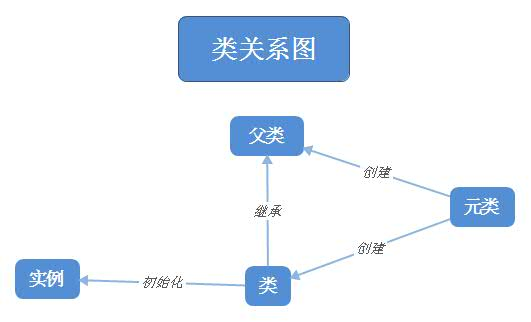

----------------------------------------------
> *Made By Herolh*
----------------------------------------------

# 目录{#index}

[TOC]

 


--------------------------------------------

# Python 设计模式
> 引用：
> [python 23种常用模式设计总结](https://zhuanlan.zhihu.com/p/57869247)
> [知乎 - 王炳明 - Python与设计模式：单例模式](https://zhuanlan.zhihu.com/p/67937493)
> &emsp;&emsp;模式设计是程序发展过程的解决问题的思路结晶，是无数前辈的心血挖总结，也是衡量一个程序员功底的标准之一，因此模式设计的思想应该好好的消化学习。

- &emsp;&emsp;大家在解释单例模式时，经常要提到的一个例子是 Windows 的任务管理器。如果我们打开多个任务管理器窗口。显示的内容完全一致，如果在内部是两个一模一样的对象，那就是重复对象，就造成了内存的浪费；相反，如果两个窗口的内容不一致，那就会至少有一个窗口展示的内容是错误的，会给用户造成误解，到底哪个才是当前真实的状态呢？
- &emsp;&emsp;一个项目中多个地方需要读取同一份配置文件，如果每次使用都是导入重新创建实例，读取文件，用完后再销毁，这样做的话，就造成不必要的 IO 浪费，可以使用单例模式只生成一份配置在内存中。
- &emsp;&emsp;还有一个常见的例子是，一个网站的访问量、在线人数，在项目中是全局唯一（不考虑分布式），在这种情况下，使用单例模式是一种很好的方式。


## 创建型模式 5 种

&emsp;&emsp;对类的实例化过程进行了抽象，能够使软件模块做到与对象创建和组织的无关性。为了使体系结构更加清晰，一些软件在设计上要求当创建类的具体实例时，能够根据具体的语境来动态地决定怎样创建对象，创建哪些对象，以及怎样组织和表示这些对象，而创建型模式所要描述的就是该如何来解决这些问题。


### 工厂模式

> 引用：
>
> [简书 - shaqsnake - 用Python实现设计模式——工厂模式](https://www.jianshu.com/p/a81f3e6ec1dc)
> [博客园 - 风行影者 - python实践设计模式（一）概述和工厂模式](https://www.cnblogs.com/wly923/archive/2013/05/10/3068313.html)


**工厂模式的定义如下：**

> &emsp;&emsp;工厂模式，顾名思义就是我们可以通过一个指定的“工厂”获得需要的“产品”，在设计模式中主要用于抽象对象的创建过程，让用户可以指定自己想要的对象而不必关心对象的实例化过程。这样做的好处是用户只需通过固定的接口而不是直接去调用类的实例化方法来获得一个对象的实例，隐藏了实例创建过程的复杂度，解耦了生产实例和使用实例的代码，降低了维护的复杂性。
>
> &emsp;&emsp;定义一个用于创建对象的接口，让子类决定实例化哪个类。工厂方法使一个类的实例化延迟到其子类。其通用类图如下。其产品类定义产品的公共属性和接口，工厂类定义产品实例化的“方式”。


#### 优缺点和应用
##### 优点：
- 工厂模式巨有非常好的封装性，代码结构清晰

    > 在抽象工厂模式中，其结构还可以随着需要进行更深或者更浅的抽象层级调整，非常灵活；

- 屏蔽产品类，使产品的被使用业务场景和产品的功能细节可以分而开发进行，是比较典型的解耦框架。

##### 应用：
- 当系统实例要求比较灵活和可扩展时，可以考虑工厂模式或者抽象工厂模式实现。

  > 比如，在通信系统中，高层通信协议会很多样化，同时，上层协议依赖于下层协议，那么就可以对应建立对应层级的抽象工厂，根据不同的“产品需求”去生产定制的实例。

##### 缺点
- 工厂模式相对于直接生成实例过程要复杂一些，所以，在小项目中，可以不使用工厂模式；

- 抽象工厂模式中，产品类的扩展比较麻烦。

    > 毕竟，每一个工厂对应每一类产品，产品扩展，就意味着相应的抽象工厂也要扩展。


#### 实现

##### 简单工厂模式( Simple Factory )

&emsp;&emsp;专门定义一个类来负责创建其它类的实例，被创建的实例通常都具有共同的父类。


> &emsp;&emsp;简单工厂模式适用于需创建的对象较少，不会造成工厂方法中的业务逻辑太过复杂的情况下，而且用户只关心那种类型的实例被创建，并不关心其初始化过程时，比如多种数据库(MySQL/MongoDB)的实例，多种格式文件的解析器(XML/JSON)等。
> &emsp;<u>&emsp;Simple Factory 模式不是独立的设计模式，他是 Factory Method 模式的一种简单的、特殊的实现。</u>他也被称为静态工厂模式，通常创建者的创建方法被设计为 static 方便调用，但是 python 没有 static 一说。所以可以把创建者也就是工厂设计为一个普通 class 或全局函数即可。如果是 class 还需要实例化才能调用工厂方法，而全局函数比较简单，比较接近静态工厂的简便特性。

```python
class car:
    '''interface as Product'''
    def drive(self):
        pass

class Mercedes(car):
    """梅赛德斯"""
    def __repr__(self):
        return "Mercedes-Benz"

class BMW(car):
    """宝马"""
    def __repr__(self):
        return "BMW"


# 如果没有“工厂”来生产它们，我们就要在代码中自己进行实例化:
# mercedes = Mercedes()
# bmw = BMW()
# 现实中，你可能会面对很多汽车产品，而且每个产品的构造参数还不一样，这样在创建实例时会遇到麻烦。这时就可以构造一个“简单工厂”把所有汽车实例化的过程封装在里面。
class driver:
    """简单工厂"""
    @staticmethod
    def product_car(name):
        if name == 'mb':
            return Mercedes()
        elif name == 'bmw':
            return BMW()

c1 = driver.product_car('mb')
c2 = driver.product_car('bmw')
print(c1)
print(c2)
```

```python
class driver:
    """简单工厂"""
    @staticmethod
    def product_car(name):
        run = dict(mb=Mercedes, bmw=BMW)
        return run[name]()
```


##### 工厂模式( Factory Method )

> 和简单工厂有区别，简单工厂模式只有一个工厂，工厂方法模式对每一个产品都有相应的工厂

&emsp;&emsp;将对象的创建交由父类中定义的一个标准方法来完成，而不是其构造函数，究竟应该创建何种对象由具体的子类负责决定。


> &emsp;&emsp;工厂方法模式继承了简单工厂模式的优点又有所改进，其不再通过一个工厂类来负责所有产品的创建，而是将具体创建工作交给相应的子类去做，这使得工厂方法模式可以允许系统能够更高效的扩展。实际应用中可以用来实现系统的日志系统等，比如具体的程序运行日志，网络日志，数据库日志等都可以用具体的工厂类来创建。
> &emsp;&emsp;工厂方法模式去掉了简单工厂模式中工厂方法的静态属性，使得它可以被子类继承。对于 python 来说，就是工厂类被具体工厂继承。这样在简单工厂模式里集中在工厂方法上的压力可以由工厂方法模式里不同的工厂子类来分担。也就是工厂外面再封装一层。

- **抽象工厂角色**： 这是工厂方法模式的核心，它与应用程序无关。是具体工厂角色必须实现的接口或者必须继承的父类。
- **具体工厂角色**：它含有和具体业务逻辑有关的代码。由应用程序调用以创建对应的具体产品的对象。
- **抽象产品角色**：它是具体产品继承的父类或者是实现的接口。在python中抽象产品一般为父类。
- **具体产品角色**：具体工厂角色所创建的对象就是此角色的实例。由一个具体类实现。

```python
import abc

class car:
    '''interface as Product'''
    def drive(self):
        pass

class Mercedes(car):
    """梅赛德斯"""
    def __repr__(self):
        return "Mercedes-Benz"

class BMW(car):
    """宝马"""
    def __repr__(self):
        return "BMW"

class driverFactory(object):
    """抽象工厂"""
    __metaclass__ = abc.ABCMeta

    @abc.abstractmethod
    def product_car(self):
        pass

class MercedesFactory(driverFactory):
    """梅赛德斯工厂"""
    def product_car(self):
        return Mercedes()

class BMWFactory(driverFactory):
    """宝马工厂"""
    def product_car(self):
        return BMW()


c1 = MercedesFactory().product_car()
c2 = BMWFactory().product_car()
print(c1)
print(c2)
```

工厂方法虽然解决了我们“修改代码”的问题，但如果我们要生产很多产品，就会发现我们同样需要写很多对应的工厂类。比如如果 MercedesFactory 和 BMWFactory 不仅生产小汽车，还要生产SUV，那我们用工厂方法就要再多构造两个生产SUV的工厂类。所以为了解决这个问题，我们就要再更进一步的抽象工厂类，让一个工厂可以生产同一类的多个产品，这就是下面的抽象工厂。


##### 抽象工厂模型( Abstract Factory )
提供一个共同的接口来创建相互关联的多个对象。
> &emsp;&emsp;抽象工厂模式在工厂方法基础上扩展了工厂对多个产品创建的支持，更适合一些大型系统，比如系统中有多于一个的产品族，且这些产品族类的产品需实现同样的接口，像很多软件系统界面中不同主题下不同的按钮、文本框、字体等等。
> &emsp;&emsp;抽象工厂是工厂模式的进一步延伸，产品的类变的更加复杂，也就说产品不只是一个接口或父类而是有多个接口和父类了，形成了一个产品族的概念。模式的角色与Factory Method基本一样，UML图如下：


&emsp;&emsp;抽象工厂模式与工厂方法模式最大的区别在于，抽象工厂中的一个工厂对象可以负责多个不同产品对象的创建 ，这样比工厂方法模式更为简单、有效率。抽象工厂模式的用意为：给客户端提供一个接口，可以创建多个产品族中的产品对象。 不过使用抽象工厂是有条件的：

- 系统中有多个产品族，而系统一次只可能消费其中一族产品
- 同属于同一个产品族的产品在一起使用，这一约束必须在系统的设计中体现出来。 

```python
import abc

# 两种小汽车
class Mercedes_C63(object):
    """梅赛德斯 C63
    """
    def __repr__(self):
        return "Mercedes-Benz: C63"

class BMW_M3(object):
    """宝马 M3
    """
    def __repr__(self):
        return "BMW: M3"

#　两种SUV
class Mercedes_G63(object):
    """梅赛德斯 G63
    """
    def __repr__(self):
        return "Mercedes-Benz: G63"

class BMW_X5(object):
    """宝马 X5
    """
    def __repr__(self):
        return "BMW: X5"


class AbstractFactory(object):
    """抽象工厂
    可以生产小汽车外，还可以生产SUV
    """
    __metaclass__ = abc.ABCMeta

    @abc.abstractmethod
    def product_car(self):
        pass

    @abc.abstractmethod
    def product_suv(self):
        pass

class MercedesFactory(AbstractFactory):
    """梅赛德斯工厂
    """
    def product_car(self):
        return Mercedes_C63()

    def product_suv(self):
        return Mercedes_G63()

class BMWFactory(AbstractFactory):
    """宝马工厂
    """
    def product_car(self):
        return BMW_M3()

    def product_suv(self):
        return BMW_X5()


c1 = MercedesFactory().product_car()
s1 = MercedesFactory().product_suv()
print(c1, s1)
s2 = BMWFactory().product_suv()
c2 = BMWFactory().product_car()
print(c2, s2)
```


#### !attention!:

初学设计模式时会对三种工厂模式的实际应用比较困惑，其实三种模式各有优缺点，应用的场景也不尽相同：

- 简单工厂模式适用于需创建的对象较少，不会造成工厂方法中的业务逻辑太过复杂的情况下，而且用户只关心那种类型的实例被创建，并不关心其初始化过程时，比如多种数据库(MySQL/MongoDB) 的实例，多种格式文件的解析器(XML/JSON)等。
- 工厂方法模式继承了简单工厂模式的优点又有所改进，其不再通过一个工厂类来负责所有产品的创建，而是将具体创建工作交给相应的子类去做，这使得工厂方法模式可以允许系统能够更高效的扩展。实际应用中可以用来实现系统的日志系统等，比如具体的程序运行日志，网络日志，数据库日志等都可以用具体的工厂类来创建。。
- 抽象工厂模式在工厂方法基础上扩展了工厂对多个产品创建的支持，更适合一些大型系统，比如系统中有多于一个的产品族，且这些产品族类的产品需实现同样的接口，像很多软件系统界面中不同主题下不同的按钮、文本框、字体等等。


### 单例模式

> 参考:
> [云栖社区 - Python与设计模式--单例模式](https://link.zhihu.com/?target=http%3A//click.aliyun.com/m/14908/)
> [博客园 - 白又白了个白- python3 单例模式](https://www.cnblogs.com/Oliver-yzx/p/10715993.html)
> [知乎 - 王炳明 - Python与设计模式：单例模式](https://zhuanlan.zhihu.com/p/67937493)

保证系统只会产生该类的一个实例，同时还负责向外界提供访问该实例的标准方法。

> 单例模式是某个类在整个系统中只存在一个实例的一种设计模式。定义如下：
> Ensure a class has only one instance, and provide a global point of access to it.（保证某一个类只有一个实例，而且在全局只有一个访问点）  
> 
> 

&emsp;&emsp;总线是计算机各种功能部件或者设备之间传送数据、控制信号等信息的公共通信解决方案之一。现假设有如下场景：  
>  某中央处理器（CPU）通过某种协议总线与一个信号灯相连，信号灯有 64 种颜色可以设置，中央处理器上运行着三个线程，都可以对这个信号灯进行控制，并且可以独立设置该信号灯的颜色。抽象掉协议细节（用打印表示），如何实现线程对信号等的控制逻辑。  

&emsp;&emsp;加线程锁进行控制，无疑是最先想到的方法，但各个线程对锁的控制，无疑加大了模块之间的耦合。下面，我们就用设计模式中的单例模式，来解决这个问题。
&emsp;&emsp;什么是单例模式？单例模式是指：保证一个类仅有一个实例，并提供一个访问它的全局访问点。具体到此例中，总线对象，就是一个单例，它仅有一个实例，各个线程对总线的访问只有一个全局访问点，即惟一的实例。


#### 单例模式的优缺点和应用

##### 单例模式的优点：

- 由于单例模式要求在全局内只有一个实例，因而可以节省比较多的内存空间；
- 全局只有一个接入点，可以更好地进行数据同步控制，避免多重占用；
- 单例可长驻内存，减少系统开销。

##### 单例模式的缺点

- 单例模式的扩展是比较困难的；
- 赋于了单例以太多的职责，某种程度上违反单一职责原则（六大原则后面会讲到）;
- 单例模式是并发协作软件模块中需要最先完成的，因而其不利于测试；
- 单例模式在某种情况下会导致“资源瓶颈”。


##### 单例模式的应用举例：

- 生成全局惟一的序列号；
- 访问全局复用的惟一资源，如磁盘、总线等；
- 单个对象占用的资源过多，如数据库等；
- 系统全局统一管理，如Windows 下的 Task Manager；
- 网站计数器。


#### Python实现单例模式有4种方式：

##### 通过模块调用

&emsp;&emsp;在 python3 中，首次导入模块文件时，会在程序目录下的 `__pycache__` 目录中生成 pyc 文件，再导入时，将直接加载 pyc 文件。因此，只需把相关的函数和数据定义在一个模块中，就可以获得一个单例对象了。

- **定义 `singleton_demo.py` 模块**

    ```python
    class singleton_cal:
        
        def foo(self, data):
            print(data)
     
    export_singleton = singleton_cal()
    ```

- **使用模块**

    ```python
    from singleton_demo import export_singleton
    
    a = export_singleton
    b = export_singleton
    a.foo(1)
    b.foo(2)
    
    print(id(a) == id(b))
    ```

    > 1
    > 2
    > True


##### 使用` __new__` 方法

> `__new__`：创建实例对象时调用的构造方法
> `__init__` ：实例初始化方法，用于设置实例的相关属性

###### 原理：
&emsp;&emsp;当实例化一个对象时，先调用 `__new__` 方法（未定义时调用 `object.__new__`）实例化对象，然后调用 `__init__` 方法进行对象初始化。
&emsp;&emsp;所以，可以声明一个私有类变量 `__instance`。当 `__instance` 不为 None 时，表示系统中已有实例，直接返回该实例；若 `__instance` 为 None 时，表示系统中还没有该类的实例，则创建新实例并返回。

```python
class Singleton(object):
    __instance = None

    def __new__(cls, *args, **kwargs):
        if not cls.__instance:
            cls.__instance = super().__new__(cls, *args, **kwargs)
        return cls.__instance


class Singleton(object):  # 抽象单例
    def __new__(cls, *args, **kw):
        if not hasattr(cls, "_instance"):
            orig = super(Singleton, cls)
            cls._instance = orig.__new__(cls, *args, **kw)
        return cls._instance
# 复写内部方法__new__()
# 通过hasattr函数判断该类实例化时有没有_instance属性
# 如果不存在，那么继承并返回原始的__new__方法给_instance属性
# 如果存在则直接返回_instance属性所指的对象
```

&emsp;&emsp;要实现单例模式，即为了让一个类只能实例化一个实例，那么我们可以去想：既然限制创建实例，那么我们可以修改其创建实例的根源即可，那就是父类 `__new__` 方法。

**注意：**

> &emsp;&emsp;不能使用自身的 `__new__()` 方法，应为自身这个类去进行实例化，是调用父类的 `__new__` 方法，若调用自身的` __new__` 方法，那不就死循环了么，可以参考：[python类的__new__()](https://www.cnblogs.com/littlefivebolg/p/9688740.html)。


```python
# 总线
class Bus(Singleton):
    lock = threading.RLock()

    def sendData(self, data):
        self.lock.acquire()
        time.sleep(2)
        print("Sending Signal Data...", data)
        self.lock.release()


# 线程对象，为更加说明单例的含义，这里将Bus对象实例化写在了run里
class VisitEntity(threading.Thread):
    my_bus = ""
    name = ""

    def getName(self):
        return self.name

    def setName(self, name):
        self.name = name

    def run(self):
        self.my_bus = Bus()
        print(self.name, "中的 Bus 类所在的内存地址是：", id(self.my_bus))
        self.my_bus.sendData(self.name)


if __name__ == "__main__":
    for i in range(3):
        my_entity = VisitEntity()
        print("Entity %s 对象所在的内存地址：" % i, id(my_entity))
        my_entity.setName("Entity_" + str(i))
        my_entity.start()
```

运行结果如下：

> Entity 0 对象所在的内存地址： 2412750950184
> Entity_0 中的 Bus 类所在的内存地址是： 2412751038784
> Entity 1 对象所在的内存地址： 2412751017296
> Entity_1 中的 Bus 类所在的内存地址是： 2412751038784
> Entity 2 对象所在的内存地址： 2412752685488
> Entity_2 中的 Bus 类所在的内存地址是： 2412751038784
> Sending Signal Data... Entity_0
> Sending Signal Data... Entity_1
> Sending Signal Data... Entity_2

&emsp;&emsp;在程序运行过程中，三个线程同时运行（运行结果的前三行先很快打印出来），而后分别占用总线资源（后三行每隔 2 秒打印一行）。虽然看上去总线 Bus 被实例化了三次，但实际上在内存里只有一个实例。


###### 线程安全

以上的代码，一般情况下没有问题，但在并发场景中，就会出现线程安全的问题。

```python
import threading, time


class User:
    _instance = None

    def __new__(cls, *args, **kwargs):
        if not cls._instance:
            time.sleep(1)
            cls._instance = super().__new__(cls)
        return cls._instance

    def sendData(self, data):
        pass


def task(args):
    u = User()
    print(u)

for i in range(10):
    t = threading.Thread(target=task, args=[i, ])
    t.start()
```

```python
# 如果在线程外则依旧是单例模式
for i in range(10):
    u = User()
    print(u)
    t = threading.Thread(target=u.sendData, args=[i, ])
    t.start()
```

从结果来观察，很容易就发现，单例模式失效了，在10个线程下，并发创建实例，并不能保证一个类只有一个实例。

```python
# 首先实现一个给函数加锁的装饰器
def synchronized(func):

    func.__lock__ = threading.Lock()

    def lock_func(*args, **kwargs):
        with func.__lock__:
            return func(*args, **kwargs)
    return lock_func


# 然后在实例化对象的函数上，使用这个装饰函数。
class User:
    _instance = None

    @synchronized
    def __new__(cls, *args, **kwargs):
        if not cls._instance:
            time.sleep(1)
            cls._instance = super().__new__(cls)
        return cls._instance

    def __init__(self, name):
        self.name = name
```


##### 使用装饰器

只有第一次调用 Singleton 类时，装饰器才会从instances={}开始执行，以后再调用该类时，都只执行get_instance函数，这是装饰器的特性。

利用装饰器的这个特性，可以实现单例模式。复用装饰器，可以使多个类实现单例模式。

```python
from functools import wraps


def singleton(cls):
    instances = {}

    @wraps(cls)
    def get_instance(*args, **kwargs):
        if cls not in instances:
            instances[cls] = cls(*args, **kwargs)
        return instances[cls]

    return get_instance


@singleton
class Bus(object):
    lock = threading.RLock()

    def send_data(self, data):
        self.lock.acquire()
        time.sleep(2)
        print("Sending Signal Data...", data)
        self.lock.release()


def task(arg):
    obj = Bus()
    print("Task %s 对象所在的内存地址：%s" % (arg, id(obj)))
    print("Task {}".format(arg), "中实例化的 Bus 类所在的内存地址是：", id(obj))
    obj.send_data(arg)


for i in range(3):
    t = threading.Thread(target=task, args=[i,])
    t.start()

```


##### 使用元类（metaclass）

> 元类创建了所有的类型对象（包括object对象），系统默认的元类是 type。
> 执行顺序：先定义 metaclass，然后在类定义时，通过 metaclass 创建类，最后通过定义好的类创建实例。
> 所以，metaclass 允许你创建类或者修改类。换句话说，可以把类看成是 metaclass 创建出来的“实例”。

**元类中定义的 `__new__` 方法**，在以该类为元类的类定义时自动调用。例如：类 A 以类 B 为元类，当定义类A时，类B的 `__new__` 方法将会被自动调用。

**元类中定义的 `__call__` 方法**，在以该类为元类的类创建实例时自动调用。例如：类A以类B为元类，当类A创建实例时，类B的 `__call__` 方法将会被自动调用。



###### 元类的使用

自定义元类时，通常继承自type。

```python
class MetaClass(type):
    
    def __init__(cls, *args, **kwargs):
        # cls 代指以该类为元类的类 Foo
        super(MetaClass, cls).__init__(*args, **kwargs)

    def __new__(mcs, *args, **kwargs):
        # mcs 代指元类自身
        print("MetaClass.__new__: ", mcs)
        return super().__new__(mcs, *args, **kwargs)

    def __call__(cls, *args, **kwargs):  
        # cls 代指以该类为元类的类 Foo
        print("CLS: ", cls)
        obj = cls.__new__(cls, *args, **kwargs)
        cls.__init__(obj, *args, **kwargs)
        return obj


class Foo(metaclass=MetaClass):  
    # 定义类Foo时，将调用元类的__new__方法和__init__方法。
    # 就跟一般普通类实例化时调用__new__方法和__init__方法一样。
    def __init__(self, name):
        self.name = name


# Foo 实例化时会调用元类的__call__方法。
a = Foo("ABC")
```


###### 元类实现单例模式

声明一个私有变量 `__instance` 保存类实例。`__instance` 为 None 时，调用 type 的` __call__` 方法为类创建实例。

```python
class SingletonMeta(type):
    __instance = None

    def __call__(cls, *args, **kwargs):
        if not cls.__instance:
            cls.__instance = type.__call__(cls, *args, **kwargs)
        return cls.__instance


class MyClass(metaclass=SingletonMeta):
    def foo(self, data):
        print(data)


a = MyClass()
b = MyClass()
a.foo(1)
b.foo(2)
print(id(a), id(b))
print(id(a) == id(b))

```


##### 使用类

```python
class Singleton(object):
    def __init__(self):
        pass

    @classmethod
    def instance(cls, *args, **kwargs):
        if not hasattr(Singleton, "_instance"):
            Singleton._instance = Singleton(*args, **kwargs)
        return Singleton._instance
```

###### 线程安全

以上的代码，一般情况下没有问题，但在并发场景中，就会出现线程安全的问题。

```python
import time, threading

class User:
    _instance = None

    def __new__(cls, *args, **kwargs):
        if not cls._instance:
            time.sleep(1)
            cls._instance = super().__new__(cls)
        return cls._instance

    def __init__(self, name):
        self.name = name

def task():
    u = User("wangbm")
    print(u)

for i in range(10):
    t = threading.Thread(target=task)
    t.start()
```

通过以上方法定义的单例模式，无法支持多线程。在 Java 中，是可以使用饿汉模式来避免这个问题，在 Python 中解决这个问题的办法是：加锁！未加锁部分并发执行，加锁部分串行执行。

```python
import threading, time


class Singleton(object):
    _instance_lock = threading.Lock()

    @classmethod
    def instance(cls, *args, **kwargs):
        if not hasattr(Singleton, "_instance"):
            with Singleton._instance_lock:
                Singleton._instance = Singleton(*args, **kwargs)
        return Singleton._instance

    def sen_data(self, data):
        time.sleep(1)
        print(data)


def task(arg):
    obj = Singleton.instance()
    obj.sen_data(arg)
    print("Task {}".format(arg), id(obj))


for i in range(10):
    t = threading.Thread(target=task, args=[i,])
    t.start()
```

**!attention!:**

&emsp;&emsp;使用类实现的单例模式，在使用时必须通过 `Singleton.instance()` 进行实例化。如果使用`Singleton()` 进行实例化得到的不是单例。


### 建造者模式

[博客园 - Little_five - 浅谈Python设计模式 - 建造者模式](https://www.cnblogs.com/littlefivebolg/p/9929016.html)

> 当我们想要创建一个由多个部分构成的对象，而且他们的构建需要一步接一步的地完成，只有当各个部分都创建好，这个对象才算完整。这正是 建造者设计模式的用武之地。建造者模式通常用于补充工厂模式的不足，尤其是在如下场景中：
> 1. 要求一个对象有不同的表现，并且希望将对象的构造与表现解耦。
> 2. 要求在某个时间点创建对象，但在稍后的时间点再访问。


## 结构型模式 7 种

&emsp;&emsp;其主要用来处理一个系统中不同实体( 比如类和对象 )之间关系，关注的是提供一种简单的对象组合方式来创造新的功能。


### 外观模式

[博客园 - Little_five - 浅谈Python设计模式 - 外观模式](https://www.cnblogs.com/littlefivebolg/p/9929877.html)

&emsp;&emsp;外观设计模式有助于隐藏系统的内部复杂性，并且通过一个简化的接口向客户端暴露必要的部分。本质上，外观是在已有复杂系统之上实现的一个抽象层。外观模式的核心在于**将复杂的内部实现包装起来，只向外界提供简单的调用接口**。类似现实世界中的电脑，开机按钮可以说就是一个简单的调用接口，帮用户屏蔽了复杂的内部电路。


外观模式也叫门面模式，定义如下：

> &emsp;&emsp;要求一个子系统的外部与其内部的通信必须通过一个统一的对象进行。门面模式提供一个高层次的接口，使得子系统更易于使用。门面模式注重 “统一的对象”，也就是提供一个访问子系统的接口。门面模式与之前说过的模板模式有类似的地方，都是对一些需要重复方法的封装。但从本质上来说，是不同的。**模板模式是对类本身的方法的封装，其被封装的方法也可以单独使用；而门面模式，是对子系统的封装，其被封装的接口理论上是不会被单独提出来用的。**


#### 优缺点与应用
##### 优点：

1. 客户端屏蔽了子系统组件，减少了客户端所需处理的对象数目，并使得子系统使用起来更加容易。
2. 实现了子系统与客户端之间的松耦合关系，减少了系统之间的相互依赖，提高了系统的灵活；
3. 提高了整体系统的安全性：封装起的系统对外的接口才可以用，隐藏了很多内部接口细节，若方法不允许使用，则在门面中可以进行灵活控制。

##### 缺点：

1. 门面模式的缺点在于，不符合开闭原则，一旦系统成形后需要修改，几乎只能重写门面代码，这比继承或者覆写等方式，或者其它一些符合开闭原则的模式风险都会大一些。

##### 使用场景：
1. 设计初期阶段，应该有意识的将不同层分离，层与层之间建立外观模式。开发阶段，子系统越来越复杂，增加外观模式提供一个简单的调用接口。

2. 为一个复杂的子系统提供一个外界访问的接口。这类例子是生活还是蛮常见的，例如电视遥控器的抽象模型，电信运营商的用户交互设备等；

    > 维护一个大型遗留系统的时候，可能这个系统已经非常难以维护和扩展，但又包含非常重要的功能，为其开发一个外观类，以便新系统与其交互。

3. 需要简化操作界面时。例如常见的扁平化系统操作界面等，在生活中和工业中都很常见。


#### 理解实例

##### 原始代码

- 假设有一组火警报警系统，由三个子元件构成：一个警报器，一个喷水器，一个自动拨打电话的装置。其抽象如下：

    ```python
    class AlarmSensor:
        def run(self):
            print("Alarm Ring...")
    
    
    class WaterSprinker:
        def run(self):
            print("Spray Water...")
    
    
    class EmergencyDialer:
        def run(self):
            print("Dial 119...")
    ```

- 在业务中如果需要将三个部件启动，例如，如果有一个烟雾传感器，检测到了烟雾。在业务环境中需要做如下操作：

    ```python
    if __name__=="__main__":
        alarm_sensor=AlarmSensor()
        water_sprinker=WaterSprinker()
        emergency_dialer=EmergencyDialer()
        alarm_sensor.run()
        water_sprinker.run()
        emergency_dialer.run()
    ```


##### 模式实现

- 但如果在多个业务场景中需要启动三个部件，怎么办？`Ctrl+C` 加上 `Ctrl+V` 么？当然可以这样，但作为码农的基本修养之一，减少重复代码是应该会被很轻易想到的方法。这样，需要将其进行封装，在设计模式中，被封装成的新对象，叫做门面。门面构建如下：

    ```python
    class AlarmSensor:
        def run(self):
            print("Alarm Ring...")
    
    
    class WaterSprinker:
        def run(self):
            print("Spray Water...")
    
    
    class EmergencyDialer:
        def run(self):
            print("Dial 119...")
    
    
    class EmergencyFacade:
        def __init__(self):
            self.alarm_sensor = AlarmSensor()
            self.water_sprinker = WaterSprinker()
            self.emergency_dialer = EmergencyDialer()
    
        def runAll(self):
            self.alarm_sensor.run()
            self.water_sprinker.run()
            self.emergency_dialer.run()
    ```

- 这样，业务场景中这样写就可以了：

    ```python
    if __name__ == "__main__":
        emergency_facade = EmergencyFacade()
        emergency_facade.runAll()
    
    # 打印如下：
    # Alarm Ring...
    # Spray Water...
    # Dial 119...
    ```


### 享元模式

> 引用：
> [博客园 - Little_five - 浅谈Python设计模式 - 享元模式](https://www.cnblogs.com/littlefivebolg/p/9930388.html)
> [云栖社区 - 途索 - Python与设计模式--享元模式](https://developer.aliyun.com/article/70529)

&emsp;&emsp;享元模式是一种用于解决资源和性能压力时会使用到的设计模式，它的核心思想是**通过引入数据共享来提升性能**。


#### 享元模式定义如下：
> &emsp;&emsp;使用共享对象支持大量细粒度对象。大量细粒度的对象的支持共享，可能会涉及这些对象的两类信息：内部状态信息和外部状态信息。内部状态信息就是可共享出来的信息，它们存储在享元对象内部，不会随着特定环境的改变而改变；外部状态信息就不可共享的信息了。
>
> **内蕴状态**：存储在享元内部，不会随环境的改变而有所不同，是可以共享的。
> **外蕴状态**：是不可以共享的，它随环境的改变而改变的，因此外蕴状态是由客户端来保持（因为环境的变化是由客户端引起的）。

&emsp;&emsp;**享元模式中只包含内部状态信息，而不应该包含外部状态信息。这点在设计业务架构时，应该有所考虑。**


#### 优缺点和使用场景

##### 优点

- 减少重复对象，大大节约了系统资源。

##### 缺点

- 享元模式虽然节约了系统资源，但同时也提高了系统的复杂性，尤其当遇到外部状态和内部状态混在一起时，需要先将其进行分离，才可以使用享元模式。否则，会引起逻辑混乱或业务风险；
- 享元模式中需要额外注意线程安全问题

##### 应用场景

- **系统中存在大量的相似对象时，可以选择享元模式提高资源利用率**。

    > 假设一个电商平台，每个买家和卖家建立起买卖关系后，买家对象和卖家对象都是占用资源的。如果一个卖家同时与多个买家建立起买卖关系呢？此时享元模式的优势就体现出来了；

- **需要缓冲池的场景中，可以使用享元模式**。

    > 如进程池，线程池等技术，就可以使用享元模式；事实上，很多的池技术中已经使得了享元模式。


#### 理解实例

> &emsp;&emsp;在开发 3D 游戏时，例如有成千上万的士兵或者有成千上万棵树，如果一个 3D 地带的每个对象都单独创建，不使用数据共享，那么性能是无法接受的。

&emsp;&emsp;故享元设计模式就是通过为相似对象映入数据共享来最小化内存的使用，提升性能。
&emsp;&emsp;既然要创建成千上万个士兵，那么若他们的数据属性行为都是一样的，那岂不是黏一块去了。这时候就会有：**可变数据和不可变数据的概念**。即**重点在于将不可变（可共享）的属性与可变的属性区分开。**相同类型的对象共享不可变（可共享）的数据，而每个对象又有其独立的数据，这部分数据即为：可变的属性（不可共享数据）。


##### 实现

&emsp;&emsp;其实享元模式的实现与单例模式的实现方式十分相似，比如：单例模式实现的是一个类对象只允许有一个实例对象，而享元模式则是一个类对象只允许创建不同类型的对象，这样保证同一类型的对象共享不可变数据。

```python
from enum import Enum

TreeType = Enum('TreeType','apple_tree cherry_tree peach_tree')

class Tree:
    pool = dict()

    def __new__(cls, tree_type, *args,**kwargs):
        # 即通过其中的__new__魔法方法来限制类的实例化，只允许实例化不同类型的对象。
        obj = cls.pool.get(tree_type,None)
        if not obj:
            obj = super().__new__(cls,*args, **kwargs)
            cls.pool[tree_type] = obj
            obj.tree_type = tree_type
        return obj

    def __init(self,size ):
        # 在__init__方法中实现了可变数据的独立，即不共享。
        self.size = size
    
    def render(self,age,x,y):
        print('render a tree of type {} and age {} at ({},{})'.format(self.tree_type,age,x,y))
```

&emsp;&emsp;通过一个类型池，若需要实例化的类型在该类型池中，则直接返回该类型池中的对象，由于返回的是同一对象，故其共享不可变的属性（tree_type），而在执行完成 `__new__()` 方法之后，变化执行 `__init__` 魔法方法，则这时候该对象的属性便会发生改变，故不共享可变的属性（size）。


##### 使用

&emsp;&emsp;在 `main()` 中去创建 10 棵 apple_tree，并且 为每个对象随机给不同的年龄、位置等，这样就可以在游戏中的不同的位置中渲染。

```python
import random
from enum import Enum

def main():
    rnd = random.Random()
    age_min, age_max = 1, 30
    min_piont, max_point = 0, 100
    tree_counter = 0

    for _ in range(10):
        t1 = Tree(TreeType.apple_tree)
        t1.render(rnd.randint(age_min, age_max),
                rnd.randint(min_piont, max_point),
                rnd.randint(min_piont, max_point)
        )
        tree_counter += 1
    
    for _ in range(3):
        t1 = Tree(TreeType.cherry_tree)
        t1.render(rnd.randint(age_min, age_max),
                rnd.randint(min_piont, max_point),
                rnd.randint(min_piont, max_point)
        )
        tree_counter += 1
    
    for _ in range(5):
        t1 = Tree(TreeType.peach_tree)
        t1.render(rnd.randint(age_min, age_max),
                rnd.randint(min_piont, max_point),
                rnd.randint(min_piont, max_point)
        )
        tree_counter += 1
    
    print(Tree.pool)

if __name__ == '__main__':
    main()
```

&emsp;&emsp;可以发现同一类型的树对象，其 ID 均一样，而其 size 属性却不一样，这是由于在执行` __init__` 方法时，返回类型池中的对象后，在进行初始化会 size 属性会覆盖前面返回的对象的 size 属性值。


#### 真实业务环境遇见

- **select_manage**

    ```python
    from abc import ABCMeta, abstractmethod
    from typing import Union
    
    
    class SelectDataSource(metaclass=ABCMeta):
        @abstractmethod
        def get_data(self, code: str, params: dict = None) -> list:
            # 用以获取数据源数据
            pass
    
        @abstractmethod
        def get_code(self) -> Union[str, list]:
            # 唯一标识数据源
            pass
    
        @abstractmethod
        def get_name(self) -> Union[str, list]:
            # 唯一标识数据源姓名
            pass
    
    
    # 以类方法的形式， 无法拥有内蕴数据源
    class SelectDataSourceManager:
        # 将数据源类通过 reg 实例化后注册在 data_sources_dict 中， 再次调用数据 get_data 的时候直接从 data_sources_dict 中取，不用再实例化
        data_sources_dict = {}				#关键！核心
    
        default_data_source: SelectDataSource = None
    
        @classmethod
        def get_data(cls, code: str, params: dict = None):
            data_source = cls.data_sources_dict.get(code)
            if not data_source:
                data_source = cls.default_data_source
            else:
                data_source = data_source.get("data_source")
            if data_source:
                if not params:
                    params = {}
                return data_source.get_data(code, params)
            return []
    
        @classmethod
        def reg(cls, data_source: type(SelectDataSource)):
            if data_source:
                data_source_instance = data_source()
                names = data_source_instance.get_name()
                codes = data_source_instance.get_code()
                if isinstance(names, list) and isinstance(codes, list):
                    if len(codes) != len(names):
                        raise Exception(
                            "select data source {}: name and code is not match".format(
                                data_source.__name__
                            )
                        )
                    for name, code in zip(names, codes):
                        if code in cls.data_sources_dict:
                            raise Exception("select data source {} existed!".format(code))
                        cls.data_sources_dict[code] = {
                            "code": code,
                            "name": name,
                            "data_source": data_source_instance,
                        }
                else:
                    if codes in cls.data_sources_dict:
                        raise Exception("select data source {} existed!".format(codes))
                    cls.data_sources_dict[codes] = {
                        "code": codes,
                        "name": names,
                        "data_source": data_source_instance,
                    }
    
    ```

- **DataSource**

    ```python
    from typing import Union
    
    from select_manager import SelectDataSource, SelectDataSourceManager
    
    
    class DBSelect:
        # 模拟数据库数据
        def get_all_dict(self):
            return [
                {"code": "default1", "name": "默认数据源1"},
                {"code": "default2", "name": "默认数据源2"},
                {"code": "default3", "name": "默认数据源3"},
                {"code": "default4", "name": "默认数据源4"},
            ]
    
        def get_dict_item_by_code(self, code: str):
            data = {
                "default1": "1111111",
                "default2": "2222222",
                "default3": "3333333",
                "default4": "4444444",
            }
            return data.get(code)
    
    
    class TestDataSource(SelectDataSource):
        def get_data(self, code: str, params: dict = None) -> []:
            data = [1, 2, 3, 4, 5, 6, 7, 8, 9]
            return data
    
        def get_code(self) -> Union[str, list]:
            return "test1"
    
        def get_name(self) -> Union[str, list]:
            return "测试用例1"
    
    
    class DefaultDataSource(SelectDataSource):
        def __init__(self):
            self.dict_repo = DBSelect()
    
        def get_all_dict(self):
            return self.dict_repo.get_all_dict()
    
        def get_data(self, code: str, params: dict = None):
            items = self.dict_repo.get_dict_item_by_code(code)
            if items:
                return items
            return []
    
        def get_code(self) -> Union[str, list]:
            return [data.get("code") for data in self.get_all_dict()]
    
        def get_name(self) -> Union[str, list]:
            return [data.get("name") for data in self.get_all_dict()]
    
    
    if __name__ == "__main__":
        SelectDataSourceManager.reg(DefaultDataSource)
        SelectDataSourceManager.reg(TestDataSource)
        data = SelectDataSourceManager.get_data("test1")
        print(data)
        print(SelectDataSourceManager.get_data("default1"))
        print(SelectDataSourceManager.get_data("default2"))
        print(SelectDataSourceManager.get_data("default3"))
        print(SelectDataSourceManager.get_data("default4"))
    
    ```


### 适配器模式
参考： [云栖社区 - 途索 - Python与设计模式--适配器模式](https://yq.aliyun.com/articles/70536?utm_content=m_36112)

适配器模式定义如下：
&emsp;&emsp;将一个类的接口变换成客户端期待的另一种接口，从而使原本因接口不匹配而无法在一起工作的两个类能够在一起工作。
&emsp;&emsp;适配器模式和装饰模式有一定的相似性，都起包装的作用，但二者本质上又是不同的，装饰模式的结果，是给一个对象增加了一些额外的职责，而适配器模式，则是将另一个对象进行了“伪装”。


> &emsp;&emsp;当我们希望把一个老组件用于一个新组系统或者把一个新组件应用于老系统中，同时在代码无法修改的，或者说无法访问这些代码时（在实际开发中，旧系统的代码修改后牵一而动全身，很容易引起系统的崩溃。）。这时候，我们可以编写一个额外的代码层，该代码层包含让这两个接口之间能够通信需要进行的所有修改。
>
> 通俗的说就是设计 “接口/API”，以保证程序符合 “开放/封闭” 原则，同时保证不修改其他地方接口的调用方式，保持新老代码间的兼容性。

&emsp;&emsp;适配器可以理解为万能接口，各种类可以通过这个接口然后被调用，达到万能转换的效果。
&emsp;&emsp;他的实现是以我们定义的适配器函数来分类，将各种类的不同方法注册到对应的分类函数中，调用的时候只需要使用分类名，这样就达到了适配所有类不同方法的效果。


#### 优缺点与应用

##### 优点：
- 适配器模式可以让两个接口不同，甚至关系不大的两个类一起运行；
- 提高了类的复用度，经过“伪装”的类，可以充当新的角色；
- 适配器可以灵活“拆卸”。

##### 应用场景：
- 不修改现有接口，同时也要使该接口适用或兼容新场景业务中，适合使用适配器模式。
  
    > 例如，在一个嵌入式系统中，原本要将数据从 Flash 读入，现在需要将数据从磁盘读入，这种情况可以使用适配器模式，将从磁盘读入数据的接口进行“伪装”，以从 Flash 中读数据的接口形式，从磁盘读入数据。

##### 缺点

- 适配器模式与原配接口相比，毕竟增加了一层调用关系，所以，在设计系统时，不要使用适配器模式。


#### 使用 `__dict_` 实现

参考： [博客园 - Little_five - 浅谈Python设计模式 - 适配器模式](https://www.cnblogs.com/littlefivebolg/p/9929597.html)

- 假设有这样一个场景：存在一套旧系统，里面包含 Computer类，如下：

    ```python
    class Computer:
        def __init__(self, name):
            self.name = name
    
        def __str__(self):
            return 'the {} computer'.format(self.name)
    
        def execute(self):
            return 'executes a program'
    ```

- 下面有需求，需要为该应用丰富更多的功能，而有了接下来的两个类：Synthesizer、Human 如下：

    ```python
    class Synthesizer:
        def __init__(self, name):
            self.name = name
    
        def __str__(self):
            return 'the {} synthesizer'.format(self.name)
    
        def play(self):
            return 'is playing an electronic song'
    
        
    class Human:
        def __init__(self, name):
            self.name = name
    
        def __str__(self):
            return '{} the human'.format(self.name)
    
        def speak(self):
            return 'says hello'
    ```

    &emsp;&emsp;从上面代码可以看出： Synthesizer 类，主要动作由 `play()` 方法执行。Human 类主要动作由 `speak()` 方法执行。而原来的类 Computer 其动作由 `execute()` 方法执行。
    &emsp;&emsp;并且对于原来的老系统来说，所有动作函数均使用 Obj.execute() 来执行。即对于调用者来说，新系统的组件 `Synthesizer.play()` 和 `Human.speak()` 是不存在的，必须像调用 `Computer.execute()` 一样使用 `Synthesizer.execute()` 和 `Human.execute()` 来调用原系统中对象的执行函数。
    &emsp;&emsp;而这就是我们所说的常见，在无法修改 旧系统的调用方式和修改其源代码的请求下，为了让新组件去适应（兼容）旧系统的情况。所以这边我们可以使用适配器模式来解决。

- 于是我们可以创建一个 通用的 Adapter 类，将一些带不同接口的对象适配到一个统一接口中。

    ```python
    class Adapter:
        def __init__(self, obj, adapted_methods):
            self.obj = obj
            self.__dict__.update(adapted_methods)
            tmp = self.__dict__
            print(tmp)
    
        def __str__(self):
            return str(self.obj)
    ```

    &emsp;&emsp;这里使用一个 `__init__` 魔法方法，将新组件的对象添加 obj 属性中。而其中在 `__dict__` 魔法方法，将新组件对象的方法添加到适配器对象的属性字典中。这样就可以使用适配器对象即可调用新组件的方法。

- 接下来，只需要在调用时，对原有系统的类进行封装，即可实现统一使用 execute() 方法执行动作了。

    ```python
    if __name__ == '__main__':
        objects = [Computer('Asus')]
        synth = Synthesizer('moog')
        objects.append(Adapter(synth, dict(execute=synth.play)))
        human = Human('Bob')
        objects.append(Adapter(human, dict(execute=human.speak)))
    
        for i in objects:
            print('{} {}'.format(str(i), i.execute()))
            print('type is {}'.format(type(i)))
    
    ```

- 输出结果如下

    ```shell
    {'obj': <__main__.Synthesizer object at 0x0000017E2FDA8240>, 'execute': <bound method Synthesizer.play of <__main__.Synthesizer object at 0x0000017E2FDA8240>>}
    {'obj': <__main__.Human object at 0x0000017E2FDA8320>, 'execute': <bound method Human.speak of <__main__.Human object at 0x0000017E2FDA8320>>}
    the Asus computer executes a program
    type is <class '__main__.Computer'>
    the moog synthesizer is playing an electronic song
    type is <class '__main__.Adapter'>
    Bob the human says hello
    type is <class '__main__.Adapter'>
    ```

- 报错处理

    当我们执行以下代码会报错：

    ```python
    for i in objects:
        print(i.name)
    ```

    这是由于 i 对象为适配器对象，只是它的属性字典中，execute 其指向的为 Human.speak 的引用地址。故可以直接使用 i.execute() 进行调用。而其属性字典中没有 Human 的 name 属性，当然我们之前 将 human 对象传进来了，而其在适配器对象的 obj 属性指向的是 human对象，故 i.obj.name 即可调用。可以改为：

    ```python
    for i in objects:
        print(i.obj.name)
    ```

    


### 代理模式

> 参考： [云栖社区 - 途索 - Python与设计模式--代理模式](https://yq.aliyun.com/articles/70738?utm_content=m_15329)

**代理模式的定义：**
&emsp;&emsp;为其他对象提供一种代理以控制对这个对象的访问。在某些情况下，一个对象不适合或者不能直接引用另一个对象，而代理对象可以在客户端和目标对象之间起到中介的作用。


&emsp;&emsp;在 JAVA 中，讲到代理模式，不得不会提到动态代理。动态代理是实现 AOP（面向切面编程）的重要实现手段。而在 Python 中，很少会提到动态代理，而 AOP 则会以另一种模式实现：装饰模式。有关 AOP 的相关内容，我们会在装饰模式这一节中进行说明。

**组成：**

- **抽象角色**：通过接口或抽象类声明真实角色实现的业务方法。
- **代理角色**：实现抽象角色，是真实角色的代理，通过真实角色的业务逻辑方法来实现抽象方法，并可以附加自己的操作。
- **真实角色**：实现抽象角色，定义真实角色所要实现的业务逻辑，供代理角色调用。


#### 优缺点与应用

##### 优点:

- 职责清晰：非常符合**单一职责原则**，主题对象实现真实业务逻辑，而非本职责的事务，交由代理完成；
- 扩展性强：面对主题对象可能会有的改变，代理模式在不改变对外接口的情况下，可以实现最大程度的扩展；
- 保证主题对象的处理逻辑：代理可以通过检查参数的方式，保证主题对象的处理逻辑输入在理想范围内。

##### 应用场景：
- 针对某特定对象进行功能和增强性扩展。如IP防火墙、远程访问代理等技术的应用；
- 对主题对象进行保护。如大流量代理，安全代理等；
- 减轻主题对象负载。如权限代理等。

##### 缺点
- 可能会降低整体业务的处理效率和速度。


#### 实现

- 首先，构造一个网络服务器：

    ```python
    # 该服务器接受如下格式数据，addr 代表地址，content代表接收的信息内容
    info_struct=dict()
    info_struct["addr"]=10000
    info_struct["content"]=""
    
    class Server:
        content = ""
    
        def recv(self, info):
            pass
    
        def send(self, info):
            pass
    
        def show(self):
            pass
    
    
    class infoServer(Server):
    
        def recv(self, info):
            self.content = info
            return "recv OK!"
    
        def send(self, info):
            pass
    
        def show(self):
            print("SHOW: %s" % self.content)
    ```

    infoServer 有接收和发送的功能，发送功能由于暂时用不到，保留。另外新加一个接口 show，用来展示服务器接收的内容。接收的数据格式必须如 info_struct 所示，服务器仅接受 info_struct 的 content 字段。那么，如何给这个服务器设置一个白名单，使得只有白名单里的地址可以访问服务器呢？

- 修改Server结构是个方法，但这显然不符合软件设计原则中的单一职责原则。在此基础之上，使用代理，是个不错的方法。代理配置如下：

    ```python
    class serverProxy:
        pass
    
    
    class infoServerProxy(serverProxy):
        server = ""
    
        def __init__(self, server):
            self.server = server
    
        def recv(self, info):
            return self.server.recv(info)
    
        def show(self):
            self.server.show()
    
    
    class whiteInfoServerProxy(infoServerProxy):
        white_list = []
    
        def recv(self, info):
            try:
                assert type(info) == dict
            except:
                return "info structure is not correct"
            addr = info.get("addr", 0)
            if not addr in self.white_list:
                return "Your address is not in the white list."
            else:
                content=info.get("content","")
                return self.server.recv(content)
    
        def addWhite(self, addr):
            self.white_list.append(addr)
    
        def rmvWhite(self, addr):
            self.white_list.remove(addr)
    
        def clearWhite(self):
            self.white_list=[]
    ```

    代理中有一个 server 字段，控制代理的服务器对象，infoServerProxy 充当 Server 的直接接口代理，而whiteInfoServerProxy 直接继承了 infoServerProxy 对象，同时加入了 white_list 和对白名单的操作。

- 这样，在场景中通过对白名单代理的访问，就可以实现服务器的白名单访问了。

    ```python
    if __name__ == "__main__":
        info_struct = dict()
        info_struct["addr"] = 10010
        info_struct["content"] = "Hello World!"
        info_server = infoServer()
        info_server_proxy = whiteInfoServerProxy(info_server)
        print(info_server_proxy.recv(info_struct))
        info_server_proxy.show()
    
        info_server_proxy.addWhite(10010)
        print(info_server_proxy.recv(info_struct))
        info_server_proxy.show()
    ```

    > 打印如下：
    >
    > ```shell
    > Your address is not in the white list.
    > SHOW: 
    > recv OK!
    > SHOW: Hello World!
    > ```


### 桥接模式

&emsp;&emsp;桥接模式又叫桥梁模式，定义如下：将抽象与实现解耦（注意此处的抽象和实现，并非抽象类和实现类的那种关系，而是一种角色的关系，这里需要好好区分一下），可以使其独立变化。在形如上例中，Pen只负责画，但没有形状，它终究是不知道要画什么的，所以我们把它叫做抽象化角色；而Shape是具体的形状，我们把它叫做实现化角色。抽象化角色和实现化角色是解耦的，这也就意味着，**所谓的桥，就是抽象化角色的抽象类和实现化角色的抽象类之间的引用关系**。


```python
class Shape:
    """
    实现化角色抽象类: Shape是具体的形状
    """

    name = ""  	# 形状名称
    param = ""  # 形状参数

    def getName(self):
        return self.name

    def getParam(self):
        return self.name, self.param


class Rectangle(Shape):
    def __init__(self, long, width):
        self.name = "Rectangle"
        self.param = "Long:%s Width:%s" % (long, width)
        print("Create a rectangle:%s" % self.param)


class Circle(Shape):
    def __init__(self, radius):
        self.name = "Circle"
        self.param = "Radius:%s" % radius
        print("Create a circle:%s" % self.param)


class Pen:
    """
    抽象化角色抽象类: Pen只负责画，没有形状
    """

    shape = ""  # 图画形状
    type = ""  	# 画笔类型

    def __init__(self, shape):
        self.shape = shape

    def draw(self):
        pass


class NormalPen(Pen):
    def __init__(self, shape):
        Pen.__init__(self, shape)
        self.type = "Normal Line"

    def draw(self):
        print(
            "DRAWING %s:%s----PARAMS:%s"
            % (self.type, self.shape.getName(), self.shape.getParam())
        )


class BrushPen(Pen):
    """
    桥梁: 抽象化角色的抽象类和实现化角色的抽象类之间的引用关系。
    """

    def __init__(self, shape):
        Pen.__init__(self, shape)
        self.type = "Brush Line"

    def draw(self):
        print(
            "DRAWING %s:%s----PARAMS:%s"
            % (self.type, self.shape.getName(), self.shape.getParam())
        )


if __name__ == "__main__":
    normal_pen = NormalPen(Rectangle("20cm", "10cm"))
    brush_pen = BrushPen(Circle("15cm"))
    normal_pen.draw()
    brush_pen.draw()
```


## 行为型模式11种


# 思考

## 享元模式与单例模式的区别

[享元模式与单例模式的区别](https://www.cnblogs.com/ProDoctor/p/7102799.html)

[java享元模式与单例模式感觉怎么好像啊，请前辈指点](http://bbs.itheima.com/thread-25745-1-1.html)

> 享元模式，可以看做是 单例模式+工厂模式+合成模式
>
> 单例模式就是全世界只能有一个人, 享元模式可以理解为全世界有那么几种人

&emsp;&emsp;单例模式和享元模式的初衷是一样的。他们都是一个基于空间和性能的模式。他们都是要控制对象的数量，而且实现方式本质上有着一些类似，就是首先查询这个对象是否存在，然后返回这个对象。应该说享元模式是单例模式的一个延伸。享元模式通过享元工厂来控制多个对象的单例化。而单例化解决的只是本身的单例问题！  

&emsp;&emsp;我一直觉得，模式不要乱用，乱用模式是学习的阶段，但是一旦在工作中，我们去乱用 模式，那么可能会造成很惨的后果:

1. 系统中要有大量的对象，这才值得用享元模式。否则你去维护一张对象表 ，就不值得了。
2.  对象的创建是会消耗大量时间的过程，并且对象占用较大内存。如果不是 ，那就让系统去创建吧。
3. 在 B/S 的系统中，个人感觉享元的应用相对较少，Web的无状态，加之我们完全在客户端进行一系列的复 杂逻辑，然后将之统一传递给 Web 服务器端，而不需要享元。享元主要应用还是在 C/S 及 Winform 的本地程序上较多

&emsp;&emsp;其余的，比如，关于外蕴状态和内蕴状态究竟何种应该使用享元的问题，如果不满足情 况，您也根本没有办法去使用享元。


单例模式是类级别的，一个类只能有一个对象实例；
享元模式是对象级别的，可以有多个对象实例，多个变量引用同一个对象实例；

享元模式可以再次创建对象 也可以取缓存对象
单例模式则是严格控制单个进程中只有一个实例对象

享元模式可以通过自己实现对外部的单例 也可以在需要的使用创建更多的对象
单例模式是自身控制 需要增加不属于该对象本身的逻辑


享元模式主要是为了节约内存空间，提高系统性能，而单例模式主要为了可以共享数据；
享元模式是多个变量公用一个对象实例 大大节约了内存空间 提高了系统性能
两者都可以实现节省对象创建的时间 ThreadPool 线程池 与数据库连接池 都有使用享元模式


