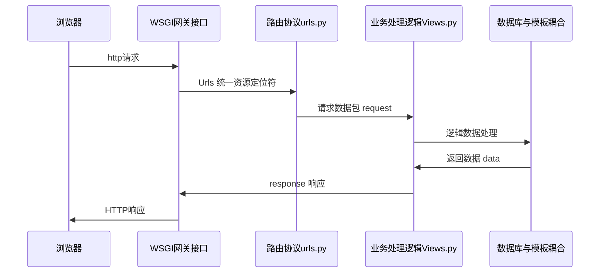
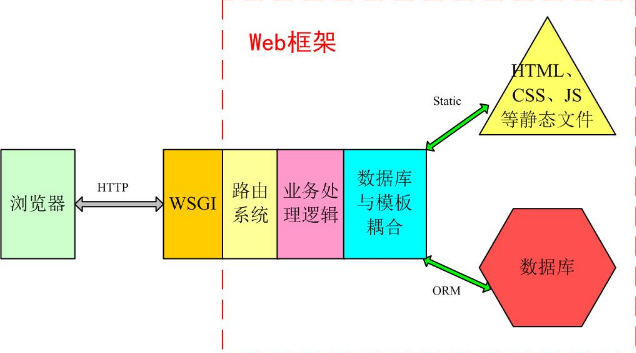
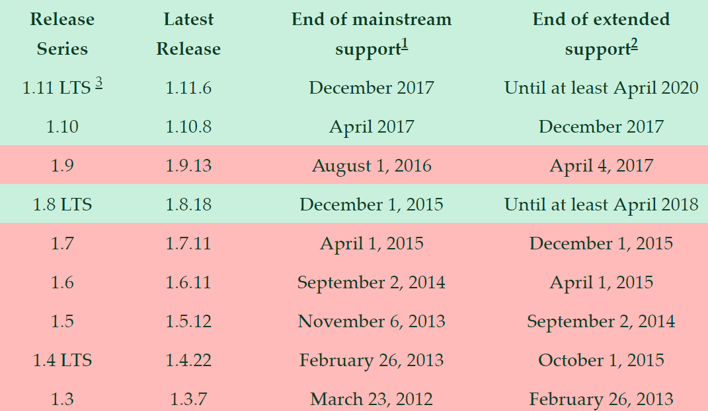
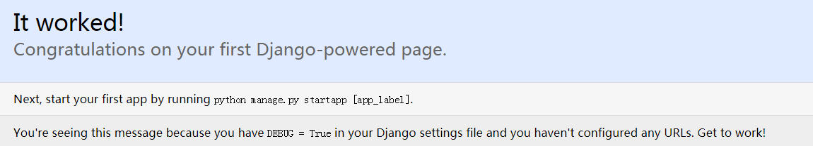
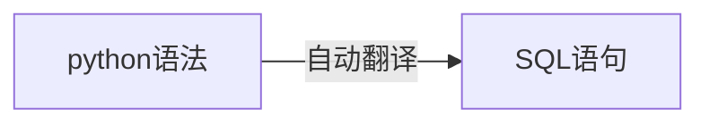
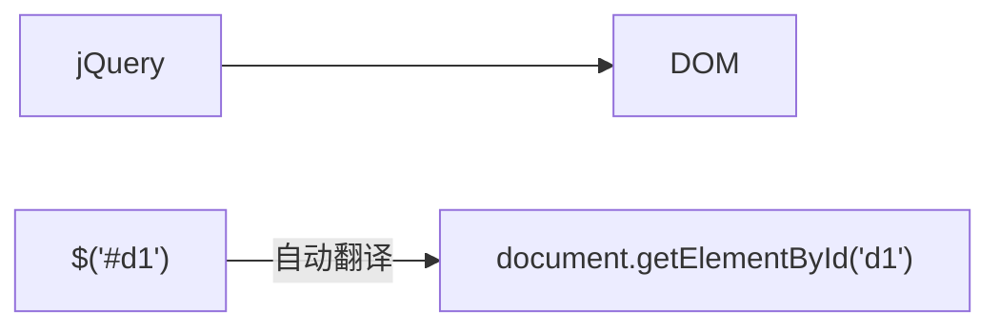
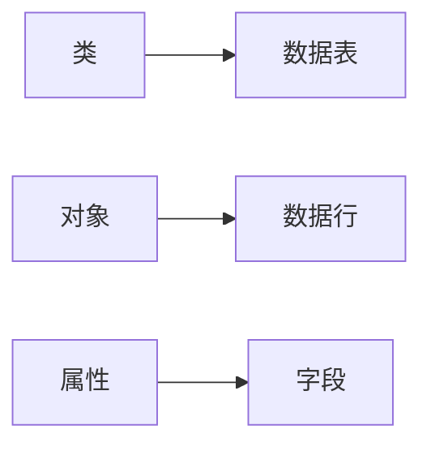
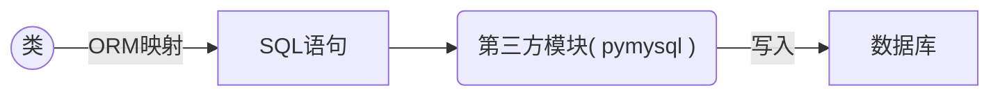
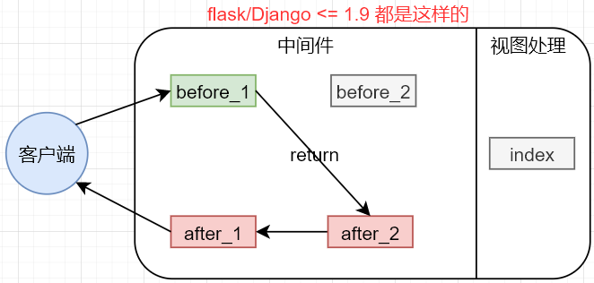
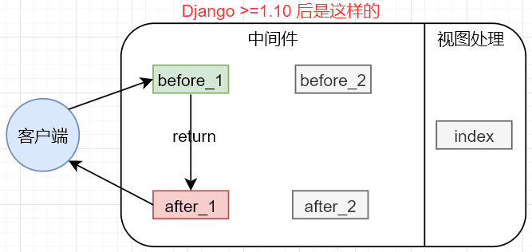

目录 {#index}

[TOC]


--------------------------------------------
# 一、Python的WEB开发介绍  
## 1. python的Web开发技术栈  
- **前端技术**：  	&emsp;&emsp;HTML、CSS、JS、Jquery、Bootstrap、Ajax...  
- **Web服务器**：  	&emsp;&emsp;Apache、Nginx、Lighttpd、ssl...  
- **Web框架**： 	&emsp;&emsp;Django、Tornado、Flask、Twisted...  
- **公共组件**： 	&emsp;&emsp;Virtualnv、vWSGI、Gunisorn、RabbitMQ、Celery...  
- **访问数据库**： 	&emsp;&emsp;pymysql、SQLAlchemy、Django model...  
- **数据库**： 		&emsp;&emsp;Oracel、Mysql、SQLite、Postgres...  


## 2. 最早的web标准  
> 最简单、原始和直接的办法是使用CGI标准(在二十年前这种方式很流行), 前端页面直接操作数据库,开销大且不安全。

&emsp;&emsp;服务过程是这样的：首先，用户请求CGI，脚本代码打印 `Content-Type` 行等一些HTML的起始标签，然后连接数据库并执行一些查询操作，获取最新的十件商品的相关数据。在遍历这些商品的同时，生成一个商品的HTML列表项，然后输出HTML的结束标签并且关闭数据库连接。将生成的HTML代码保存到一个`.cgi`文件中，然后上传到网络服务器上，用户通过浏览器即可访问。

### 示例

```python
import cgi
import pymysql
print("Content-Type: text/html\n")
print("<html><head><title>products</title></head>")
print("<body>")
print("<h1>products</h1>")
print("<ul>")

connection = pymysql.connect(user='user', passwd='pwd', db='product_db')
cursor = connection.cursor()
cursor.execute("SELECT name FROM products ORDER BY create_date DESC LIMIT 10")

for row in cursor.fetchall():
	print("<li>%s</li>" % row[0])

print("</ul>")
print("</body></html>")

connection.close()
```

这个流程看起来不错，简单易懂，实际有很多问题和不方便的地方，比如：

- 如果应用中有多处需要连接数据库会怎样呢？每个独立的CGI脚本，不应该重复编写数据库连接相关的代码。
- 前端、后端工程师以及数据库管理员集于一身，无法分工配合。设想一个前端设计师，完全没有Python开发经验，但是又需要编写SQL语句的话，会发生什么呢？
- 如果代码被重用到一个复合的环境中会发生什么？
- 直接将数据库的密码写在代码里吗？
- 今天是取十个商品，明天我要删除十个商品怎么办？


## 3、Web框架：
> Web框架致力于解决一些共同的问题，为Web应用提供通用的架构，让用户专注于网站应用业务逻辑的开发，而无须处理网络应用底层的协议、线程、进程等方面的问题。这样能大大提高开发者的效率和Web应用程序的质量。

### 什么是web框架：
> 建立 web 应用的一种方式

### 一般Web框架的架构：





<hr>

### python常用web框架:

#### Django  

- 发布于 2003 年，是当前 Python 世界里最负盛名且最成熟的 Web 框架，最初被用来制作在线新闻的 Web 站点。
- Django 的各模块之间结合得比较紧密，所以在功能强大的同时又是一个相对封闭的系统（依然是可以自定义的），但是其健全的在线文档及开发社区，使开发者在遇到问题时能找到解决办法。
- Django 直接使用了现成的 WSGI，并实现了大部分功能，提供了大量的应用工具。

#### Tornado

- 一个强大的、支持协程、高效并发且可扩展的Web服务器，
- 发布于 2009 年 9 月，应用于 FriendFeed、Facebook 等社交网站。
- 它的强项在于可以利用异步协程机制实现高并发的服务。Tornado 用的是自己的**异步非阻塞 WSGI 网关接口**

#### Flask

- Python Web 框架家族里比较年轻的一个
- 发布于 2010 年，它吸收了其他框架的优点并且把自己的主要领域定义在了微小项目上，以短小精干，简洁明了著称。
- Flask 则只提供了最精简和基本的框架,没有 WSG I网关接口

#### Twisted

- 一个有着十多年历史的开源事件驱动框架。
- 它不像前三种着眼于 Web 应用开发，而是适用从传输层到自定义应用协议的所有类型的网络程序的开发，
- 并能在不同的操作系统上提供很高的运行效率。但是，目前对 Python3 的支持有限，建议使用Python2.7。


------------------------------
# 二、Django初入门
## 0、django基本介绍：
### !注意：
> Django是一个同步 web 框架，不支持异步( websocket 等 )，只接受 http/https 开头的; ws/wss 开头的无法识别，连路由系统都无法到达.
> 若要用 Django 实现异步，则需要依赖 Gevent ( Gevent又基于greenlet )


### Django历史来历：
&emsp;&emsp;Django 诞生于 2003 年，2006 年加入了 `BSD许可证`，成为开源的 Web 框架。  &emsp;&emsp;Django 这一词语是根据比利时的爵士音乐家 Django Reinhardt 命名的，有希望 Django 能够优雅地演奏（开发）各种乐曲（Web应用）的美好含义。  
&emsp;&emsp;Django 是由美国堪萨斯（Kansas）州 Lawrence 城中的一个新闻开发小组开发出来的。当时 Lawrence Journal-World 报纸的程序员 Adrian Holovaty 和 Simon Willison 用 Python 编写 Web 新闻应用，他们的 World Online 小组制作并维护了当地的几个新闻站点。  
&emsp;&emsp;新闻界独有的特点是快速迭代，从开发到上线，通常只有几天或几个小时的时间。为了能在截止时间前完成工作，Adrian 和 Simon 打算开发一种**通用的高效的网络应用开发框架**，也就是 Django。2005年的夏天，当这个框架开发完成时，它已经用来制作了很多个 World Online 的站点。不久，小组中的 Jacob Kaplan-Moss 决定把这个框架发布为一个开源软件，于是短短数年，Django 项目就有着数以万计的用户和贡献者，在世界范围内广泛传播。   

&emsp;&emsp;原来的 World Online 的两个开发者（Adrian and Jacob）仍然掌握着Django，但是其发展方向受社区团队的影响更大。


### Django特点：
#### 功能完善、要素齐全  
- 该有的、可以没有的都有，常用的、不常用的工具都用。
- Django提供了大量的特性和工具，无须你自己定义、组合、增删及修改。
- 但是，在有些人眼里这被认为是‘臃肿’不够灵活，发挥不了程序员的主动能力。(一体机和DIY你更喜欢哪个？)

#### 完善的文档  
- 经过十多年的发展和完善，Django有广泛的实践经验和完善的在线文档。开发者遇到问题时可以搜索在线文档寻求解决方案。  
- 强大的数据库访问组件  
  - Django 的 Model 层自带数据库 ORM 组件，使得开发者无须学习其他数据库访问技术( SQL、pymysql、SQLALchemy 等)。
  - 当然你也可以不用Django自带的 ORM ，而是使用其它访问技术，比如 SQLALchemy。

#### 灵活的 URL 映射  		
> Django 使用正则表达式管理 URL 映射，灵活性高。
> 2.0 版本后默认可以不使用正则表达式,降低了开发难度

#### 丰富的 Template 模板语言  
> 类似 jinjia 模板语言，不但原生功能丰富，还可以自定义模板标签。

####　自带免费的后台管理系统  
- 只需要通过简单的几行配置和代码就可以实现一个完整的后台数据管理控制平台。
- 完整的错误信息提示：

  > 在开发调试过程中如果出现运行错误或者异常，Django可以提供非常完整的错误信息帮助定位问题。


### MVC及MTV设计模式：
&emsp;&emsp;在目前基于Python语言的几十个Web开发框架中，几乎所有的 **全栈框架**[^全栈框架]都强制或引导开发者使用 MVC 设计模式。  Djang o本身基于 MVC 模型，即 `Model(模型)`+`View(视图)`+ `Controller(控制器)`设计模式，因此天然具有 MVC 的出色基因：开发快捷、部署方便、可重用性高、维护成本低等。

[^全栈框架]:全栈框架：是指除了封装网络和线程操作，还提供 HTTP、数据库读写管理、HTML模板引擎等一系列功能的Web框架，比如Django、Tornado和Flask。


#### MVC设计模式：
&emsp;&emsp;最早由 Trygve Teenskaug 在 1978 年提出，上世纪 80 年代是程序语言 Smalltalk 的一种内部架构。 后来MVC被其他领域借鉴，成为了软件工程中的一种软件架构模式


##### **模型(Model)**：
> 用于封装与应用程序的业务逻辑相关的数据及对数据的处理方法,是 Web 应用程序中用于处理应用程序的数据逻辑的部分，
> Model 只提供功能性的接口，通过这些接口可以获取Model的所有功能。

简单地说：这个模块就是Web框架和数据库的交互层。

##### **视图(View)：**

> 负责数据的显示和呈现，是对用户的直接输出。

##### **控制器(Controller)：**

> 负责从用户端收集用户的输入，可以看成提供View的反向功能。

&emsp;&emsp;这三个部分互相独立，但又相互联系，使得改进和升级界面及用户交互流程，在 Web 开发过程任务分配时，不需要重写业务逻辑及数据访问代码。  
&emsp;&emsp;MVC 在 Python 之外的语言中也有广泛应用，例如 VC++ 的 MFC，Java 的 Structs 及 Spring、C# 的 .NET 开发框架等等。  


#### MTV设计模式：

Django对传统的 MVC 设计模式进行了修改： 

> 将视图分成 View 模块和 Template 模块两部分，将动态的逻辑处理与静态的页面展现分离开。
> 控制器(Controller) 由 Django 帮你实现好了。
> 而 Model 采用了 ORM 技术，将关系型数据库表抽象成面向对象的 Python 类，将表操作转换成类操作，避免了复杂的 SQL 语句编写。


###### 模型(Model)：

> 和MVC中的定义一样

###### 模板(Template)：

> 将数据与HTML语言结合起来的引擎

###### 视图(View)：

> 负责实际的业务逻辑实现

```markdown
# MTV和MVC本质上是一样的
```


## 1、Django安装：
### 1.1 版本支持
| Django 版本 |                   Python 版本                   |
| :---------: | :---------------------------------------------: |
|     1.8     | 2.7, 3.2 (until the end of 2016), 3.3, 3.4, 3.5 |
|  1.9, 1.10  |                  2.7, 3.4, 3.5                  |
|    1.11     |               2.7, 3.4, 3.5, 3.6                |
|     2.0     |                  3.4, 3.5, 3.6                  |
|     2.1     |    3.5, 3.6, 3.7( 不支持MYSQL5.5以下的版本)     |

#### 版本支持时间


#### 版本的未来计划节点
.png)	


### 1.2 pip安装
> `win+r`，调出 cmd 命令行，运行命令：`pip install django`，自动安装PyPi提供的最新版本。
> 如果要指定版本，可使用 `pip install django==1.11.7` 这种形式。


#### 验证安装
> 进入Python交互式环境（注意一定要进入刚才安装了Django的Python解释器），按下面所示查看安装版本：

```python
import django
print(django.get_version())			# 或者 django.VERSION
2.0.7
```

或者进入 cmd 命令行形式，按下面所示查看安装版本：
```shell
python -m django --version
```


#### 配置系统环境
- 其实不配置也没关系，安装完就默认配置了
- 成功安装 Django 后，以 windows 为例，在 Python 根目录下的 Scripts 目录中可找到一个 `django-admin.exe` 文件，这是Django的核心管理程序，最好将它加入操作系统的环境变量中，这样在以后的调用会比较方便。		

#### !attention:
> 安装的时候也会安装Django的唯一依赖：`pytz`( 时区管理 )


## 2、创建项目：
### 两种创建项目方案：
- 在 windows 的 cmd 环境中(Linux中类同)，新建或者进入你想创建 Django 项目的目录，然后输入下面的命令：

    ```shell
    django-admin startproject mysite
    ```

- 在 windows 下使用 Pycharm 创建 Django 项目:( pycharm必须为专业版才可以，社区版本不支持 )

  > 其实，在大多数情况下，我们都是在 Windows 操作系统下，使用 Pycharm 进行 Django 开发。

  - 启动 Pycharm 后，点击 `file-->new project`，出现对话框, 在左边选择 Django 项目

  - 可以看到 Django 自动帮我们创建了一个 mysite 文件夹，这是项目的根目录。

      ```python
      目录结构：
      |mysite					-- 项目的根目录，与Django无关，只是你项目的容器，可以任意命名
      						-- 一些关键字还是不能随便用的， 如Django，django，test 等
      ---|manage.py			-- 整个项目的管理脚本，一个命令行工具
      						-- 用于与Django进行不同方式的交互脚本，非常重要！
      ---|mysite				-- 整个项目的配置文件目录
      -------|__init__.py		-- 一个定义包的空文件
      -------|settings.py		-- 项目的主配置文件，非常重要！
      -------|urls.py			-- 路由文件，所有的任务都是从这里开始分配，
      						-- 起分发任务的作用,相当于Django驱动站点的内容表格，非常重要！
      -------|wsgi.py			-- 一个基于WSGI的web服务器进入点，提供底层的网络通信功能	
      ```

      

### !attention：
- Linux 下最好别放在 `/var/www/` 目录下，因为这是黑客的首要攻击目标，存在暴露数据危险


## 3、启动开发服务器：
- Django提供了一个用于开发的 web 服务器，使你无需配置一个类似 Ngnix 的线上服务器，就能让站点运行起来。这是一个由 Python 编写的轻量级服务器，**简易并且不安全，因此不要将它用于生产环境。**
- 在项目根目录下，运行 `Python manage.py runserver`，Django会以 `127.0.0.1:8000` 这个默认配置启动开发服务器。或者在 Pycharm 中，点击Tools 中的 `Run manage.py Task...` 然后·直接输入 `runserver` 即可.


### 运行信息：
```python
Performing system checks...  						# 运行系统检查
System check identified no issues (0 silenced).		# 系统检查没有问题
You have 13 unapplied migration(s). Your project may not work properly until you
apply the migrations for app(s): admin, auth, contenttypes, sessions.
Run 'python manage.py migrate' to apply them.
October 20, 2017 - 11:28:59
Django version 1.11.6, using settings 'mysite.settings'
Starting development server at http://127.0.0.1:8000/
Quit the server with CTRL-BREAK.
```


### 访问站点:
- 打开你的浏览器，在地址栏输入`127.0.0.1:8000`，看到**“It worked!”**,说明 Django 一切正常，你可以放心大胆的开始Django之旅了！
    

    访问后，运行信息下面会添加一些信息：

    ```python
    [11/Jul/2018 00:24:22] "GET /favicon.ico HTTP/1.1" 404 1972`
    ```

    `favicon.ico` 是页面标签图标，这里的404是因为页面标签图标未定义


### 修改访问ip或端口：
#### 修改访问端口：

Django的开发服务器默认运行在内部的 8000 端口，如果你想指定端口，请在命令中显示给出：

```shell
python manage.py runserver 8080
```


#### 修改访问IP：

如果想修改服务器的 ip 地址，请按下面的方式运行命令：

```shell
python manage.py runserver 0.0.0.0:8000
```

这时候如果没去 `setting.py` 里面修改一个配置，访问 `ip:8000` 会报以下错误:

> *Invalid HTTP_HOST header: '192.168.233.130:8000'. You may need to add '192.168.233.130' to ALLOWED_HOSTS.*  

**解决方法:**
将本机的IP地址添加到 setting.py 里的  `ALLOWED_HOSTS = []` 如： 

```python
ALLOWED_HOSTS = [“192.168.233.130”]			# 或 	ALLOWED_HOSTS = [“*”]
```
这时，Django将运行在 8000 端口，整个局域网内都将可以访问站点，而不只是本机访问。


#### !attention： 
&emsp;&emsp;Django的开发服务器具有自动重载功能，当你的代码有修改，每隔一段时间服务器将自动更新。但是，有一些例如 **增加文件** 的动作，不会触发服务器重载，这时就需要你自己手动重启。


## 4、创建应用
### 4.1 app应用与project项目的区别：
- 一个app实现某个功能，方便我们在一个大的 Django 项目中,管理实现不同的业务功能；
- 一个 project 是配置文件和多个 app 的集合，这些 app 组合成整个站点；
- 一个 project 可以包含多个 app；一个app可以属于多个project！( 复用 )


### 4.2 创建应用步骤：
- 进入mysite项目根目录，确保与 `manage.py` 文件处于同一级，输入下述命令：

    ```python
    python manage.py startapp 应用名
    ```

- 然后将“应用名”添加到 `settings,py` 中的 `INSALLED_APP` 中
    > **要将应用添加到项目中，需要在 `INSTALLED_APPS` 设置中增加指向该应用的配置文件的链接。**
    > 对于应用blog，它的配置类文件是 `bolg/apps.py`，路径格式为 `blog.apps.BlogConfig`。
    > 我们需要在 `mysite/settings.py` 文件的`INSTALLED_APPS` 中，将该路径添加进去：

    ```python
    INSTALLED_APPS = [
        'django.contrib.admin',
        'django.contrib.auth',
        'django.contrib.contenttypes',
        'django.contrib.sessions',
        'django.contrib.messages',
        'django.contrib.staticfiles',
       
        'blog.apps.BlogConfig',			# 路径格式
    ]
    ```

    实际上，在多数情况下，我们简写成‘blog’就可以了：

    ```python
    INSTALLED_APPS = [
        'django.contrib.admin',
        'django.contrib.auth',
        'django.contrib.contenttypes',
        'django.contrib.sessions',
        'django.contrib.messages',
        'django.contrib.staticfiles',
        
        'blog',
    ]
    ```

    

#### app目录结构
```python
blog
---|__init__.py			
---|admin.py				-- 管理后台
---|apps.py					-- 应用的一些设置
---|models.py				-- 模型层
---|tests.py				-- 撰写测试脚本
---|views.py				-- 视图处理文件,专门用来定义处理请求的函数
---|migrations				-- 数据库的迁移记录
-------|__init__.py
```


### !attention:
app 的存放位置可以是任何地点，但是通常都将它们放在与 manage.py 脚本同级的目录下，这样方便导入文件。


## 5、urls.py 初探：
### 编写视图
在blog/views.py文件中，添加代码：

```python
from django.http import HttpResponse
def index(request):
    # request :每个视图都应该有的第一个参数，保存了所有和用户浏览器请求相关的数据
    return HttpResponse("Hello, world！")
```

为了调用该视图，我们还需要编写urlconfig，也就是路由路径。


### 分发路由urls( 路由分发 )
- 在应用目录下新建一个文件，名字为 `urls.py`

- 修改应用目录下的 `urls.py`：

    - 使用正则表达式：

        ```python
        from django.conf.urls import url
        from . import views
        
        # 保存了路径和函数的对应关系:
         urlpatterns = [
         	url(r'^$', views.index, name='index'),
         ]
        ```

    - 不用正则表达式：

        ```python
        from django.urls import path
        from . import views
        
        # 保存了路径和函数的对应关系
        urlpatterns = [
            path(r'', views.index, name='index'),
        ]
        ```

- 修改项目的主urls文件:

    > 在项目的主urls文件中添加`urlpattern`条目，指向我们刚才建立的这个 app 独有的 urls 文件，这里需要导入 `include` 模块。
    - 使用正则表达式:
        ```python
        from django.conf.urls import url
        from . import views
        
        # 保存了路径和函数的对应关系:
         urlpatterns = [
         	url(r'^$', views.index, name='index'),
         ]
        ```

    - 不用正则表达式：
        ```python
        from django.urls import path
        from . import views
         
        # 保存了路径和函数的对应关系
        urlpatterns = [
        	path(r'', views.index, name='index'),
        ]
        ```

- 启动服务器

    > 然后在浏览器中访问地址 http://localhost:8000/blog/。一切正常的话，你将看到“Hello, world”


### url.py 详解:
#### include：
> include 的背后是一种即插即用的思想。
> 项目根路由不关心具体app的路由策略，只管往指定的二级路由转发，实现了应用解耦。

- include 语法相当于多级路由，它把接收到的 url 地址去除前面的正则表达式，将剩下的字符串传递给下一级路由进行判断。

- app 所属的二级路由可以根据自己的需要随意编写，不会和其它的app路由发生冲突。app目录可以放置在任何位置，而不用修改路由。
    这是软件设计里很常见的一种模式。

**建议：**  
    除了admin路由外，尽量给每个app设计自己独立的二级路由


#### url()方法：
> `url()` 方法可以接收4个参数，其中2个是必须的：regex和view，以及2个可选的参数：kwargs和name。

##### regex：
> regex 是正则表达式的通用缩写，它是一种匹配字符串或 url 地址的语法。 

&emsp;&emsp;Django拿着用户请求的 `url` 地址，在 `urls.py` 文件中对 `urlpatterns` 列表中的每一项条目从头开始进行逐一对比，一旦遇到匹配项，立即执行该条目映射的视图函数或下级路由，其后的条目将不再继续匹配。因此，url路由的编写顺序非常重要！

###### !attention:
- regex不会去匹配GET或POST参数或域名例如:

    > 对于https://www.example.com/myapp/，regex只尝试匹配 `myapp/`
    > 对于https://www.example.com/myapp/?page=3 regex也只尝试匹配`myapp/`

- 当 `URLconf` 模块加载的时候会预先编译正则表达式，因此它的匹配搜索速度非常快，你通常感觉不到。


##### view：
> view指的是处理当前url请求的视图函数。

当正则表达式匹配到某个条目时，自动将封装的 `HttpRequest` 对象作为第一个参数，正则表达式“捕获”到的值作为第二个参数，传递给该条目指定的视图view。
如果是简单捕获，那么捕获值将作为一个位置参数进行传递，如果是命名捕获，那么将作为关键字参数进行传递。


##### kwargs：

> 任意数量的关键字参数可以作为一个字典传递给目标视图。


##### name：

>对你的URL进行命名，让你能够在 Django 的任意处，尤其是模板内显式地引用它。
>这是一个非常强大的功能，相当于给 URL 取了个全局变量名，不会将 url 匹配地址写死。


## 6、setting.py 配置文件详解：

```python
"""
# Django为mysite项目设置。
Django settings for mysite project.					

# 使用Django 2.0.7由'django-admin startproject'生成。
Generated by 'django-admin startproject' using Django 2.0.7.	

# 有关此文件的更多信息，请参阅
For more information on this file, see								
https://docs.djangoproject.com/en/2.0/topics/settings/

# 有关设置及其值的完整列表，请参阅
For the full list of settings and their values, see					
https://docs.djangoproject.com/en/2.0/ref/settings/
"""

import os
# 在项目中构建路径，如下所示：os.path.join（BASE_DIR，...）
# Build paths inside the project like this: os.path.join(BASE_DIR, ...)

BASE_DIR = os.path.dirname(os.path.dirname(os.path.abspath(__file__)))
# 项目根目录

# 快速启动开发设置 - 不适合生产
# Quick-start development settings - unsuitable for production
# See https://docs.djangoproject.com/en/1.11/howto/deployment/checklist/

# 安全警告：保密密钥中使用的密钥！
# SECURITY WARNING: keep the secret key used in production secret!
SECRET_KEY = 'n8)&lgg5xn(iwzik9^2=)fhgjwbws%e+9xj5kw*rz6)e@zy591'
# 安全码


# SECURITY WARNING: don't run with debug turned on in production!
"""！调试
安全警告：不要在实际生产中打开它！
如果打开debug那么这个网页异常就会直接抛给网页前端
"""
DEBUG = True

ALLOWED_HOSTS = []
"""
只允许外界通过[]里的地址访问服务器,其他的所有地址都被屏蔽了
例如['localhost']
那么此时用127.0.0.1是不能访问的
‘ip’	: 通过ip访问
‘*’		：所有人都能访问
"""

# Application definition
"""已安装的应用
以下默认生成的是django自带的应用，额外提供的
如果今后我们创建了自己的应用，也需要将自己的应用写在这里面，这样django才能识别
"""
INSTALLED_APPS = [
    'django.contrib.admin',				# admin管理后台站点
    'django.contrib.auth',				# 身份认证系统
    'django.contrib.contenttypes',		# 内容类型框架
    'django.contrib.sessions',			# 会话框架
    'django.contrib.messages',			# 消息框架
    'django.contrib.staticfiles',		# 静态文件管理框架
    'blog'								# 应用
]

"""中间件，django自带的一些工具集
应用名是不能和模块名相同的
"""
MIDDLEWARE = [
    'django.middleware.security.SecurityMiddleware',
    'django.contrib.sessions.middleware.SessionMiddleware',
    'django.middleware.common.CommonMiddleware',
    'django.middleware.csrf.CsrfViewMiddleware',
    'django.contrib.auth.middleware.AuthenticationMiddleware',
    'django.contrib.messages.middleware.MessageMiddleware',
    'django.middleware.clickjacking.XFrameOptionsMiddleware',
]

ROOT_URLCONF = 'myblog.urls'
"""url根文件的配置文件
指向urls.py文件
"""

"""模版
在django·中模版其实就是一个一个的html文件
这里的是关于模板的配置
"""
TEMPLATES = [
    {
        #模版引擎，可修改为其他第三方模板引擎
        'BACKEND': 'django.template.backends.django.DjangoTemplates',
        'DIRS': [],
        'APP_DIRS': True,
        'OPTIONS': {
            'context_processors': [
                'django.template.context_processors.debug',
                'django.template.context_processors.request',
                'django.contrib.auth.context_processors.auth',
                'django.contrib.messages.context_processors.messages',
            ],
        },
    },
]

WSGI_APPLICATION = 'myblog.wsgi.application'

# Database
# https://docs.djangoproject.com/en/1.11/ref/settings/#databases

"""数据库配置
默认是使用sqlite3
如果要使用其他数据库就打开上面那个链接，到django的官方文档里去找
"""
DATABASES = {
'default': {
'ENGINE': 'django.db.backends.sqlite3',
'NAME': os.path.join(BASE_DIR, 'db.sqlite3'),
}
}

# 密码认证
# Password validation
# https://docs.djangoproject.com/en/1.11/ref/settings/#auth-password-validators
AUTH_PASSWORD_VALIDATORS = [
    {
        'NAME': 'django.contrib.auth.password_validation.UserAttributeSimilarityValidator',
    },
    {
        'NAME': 'django.contrib.auth.password_validation.MinimumLengthValidator',
    },
    {
        'NAME': 'django.contrib.auth.password_validation.CommonPasswordValidator',
    },
    {
        'NAME': 'django.contrib.auth.password_validation.NumericPasswordValidator',
    },
]

#国际化
# Internationalization
# https://docs.djangoproject.com/en/1.11/topics/i18n/

#语言，默认是美式英语							“zh-Hans” 可变为中文 
LANGUAGE_CODE = 'en-us'
#时区			设为中国时区：Asia/Shanghai
TIME_ZONE = 'UTC'
USE_I18N = True
USE_L10N = True
USE_TZ = True

#静态文件的地址
# Static files (CSS, JavaScript, Images)
# https://docs.djangoproject.com/en/1.11/howto/static-files/
# 静态文件保存的别名，即在HTML 文件中要引用的地址
STATIC_URL = '/static/'
```


## 7、模型 models.py 初探：
### a、ORM框架：
&emsp;&emsp;ORM 框架将 SQL 封装起来，程序员不再需要关心数据库的具体操作，只需要专注于自己本身代码和业务逻辑的实现。最典型的 ORM 就是 SQLAlchemy 了，如果你的 Web 框架自身不带 ORM 系统，那么你可以安装使用它。
ORM将一个Python的对象映射为数据库中的一张关系表。


就像是：  



#### ORM的对应关系




#### ORM 原理



```python
class User:
def __init__(self):
    self.id =..
    self.name =.
    self.email

def order_by():
	sss
#########################################
obj = User()
obj.__dict__ = {
    id:'',
    name:,
    email:
}
```


#### ORM能做的事:
##### 操作数据表  
> 操作 `models.py` 里面的类 --> 创建表/删除表/修改表/查询表

##### 操作数据行
>  数据的增删改查


#### ORM的优缺点
##### 优点
1. 简单,不用自己写 SQL 语句
2. 开发效率高
3. 兼容性高

##### 缺点:
1. 记忆你这个特殊的语法
2. 相对于大神写的SQL语句,肯定执行效率有差距


### b、自己动手创建数据库
> ORM 框架只能自己创建表，不能自己创建数据库
> 不能创建数据库,自己动手创建数据库

```mysql
create database 数据库名 character set utf8;
-- 例如:
create database mysite character set utf8;
```


### c、默认数据库配置：
> Django默认使用 SQLite 数据库，因为 Python 源生支持 SQLite 数据库，所以你无须安装任何程序，就可以直接使用它。
> 当然，如果你是在创建一个实际的项目，可以使用类似 PostgreSQL 的数据库，避免以后数据库迁移的相关问题。

打开`mysite/settings.py` 配置文件，找到 DATABASES：

```python
# Database
# https://docs.djangoproject.com/en/1.11/ref/settings/#databases
DATABASES = {
    'default': {
    	'ENGINE': 'django.db.backends.sqlite3',
    	'NAME': os.path.join(BASE_DIR, 'db.sqlite3'),
    }
}
```

#### ENGINE(引擎)：

可以是以下数据引擎,当然也可以是其他:
`django.db.backends.sqlite3`
`django.db.backends.postgresql`
`django.db.backends.mysql`
`django.db.backends.oracle`

##### NAME(名称)：
> 类似 Mysql 数据库管理系统中用于保存项目内容的数据库的名字。  

&emsp;&emsp;如果你使用的是默认的 SQLite，那么数据库将作为一个文件将存放在你的本地机器内，此时的 NAME 应该是这个文件的完整绝对路径包括文件名，默认值`os.path.join(BASE_DIR, ’db.sqlite3’)`，将把该文件储存在你的项目目录下。


### d、使用其他数据库：
&emsp;&emsp;如果你想使用其他的数据库，请先安装相应的数据库操作模块，并将 `settings.py` 文件中 DATABASES 位置的 `default` 的键值进行相应的修改，用于连接你的数据库。

- 基于pymysql操作Mysql数据库：

    ```python
    import pymysql         			# 一定要添加这两行！通过pip install pymysql！
    pymysql.install_as_MySQLdb()	# 或者，可以将这两句放在在 项目/__init__.py文件中( 初始化 )
    
    # 告诉Django用pymysql来代替默认的MySQLdb( MySQLdb 不支持 Python3 )
    DATABASES = {
        'default': {
            'ENGINE': 'django.db.backends.mysql',
            'NAME': 'mysite',
            'HOST': '127.0.0.1',
            'USER': 'root',
            'PASSWORD': 'pwd',
            'PORT': '3306',
        }
    }
    ```

    

### e、简单模型创建
> 模型本质上就是数据库表的布局，再附加一些元数据。
> Django通过模型，将Python代码和数据库操作结合起来，实现对SQL查询语言的封装。Django

&emsp;&emsp;通过自定义 Python 类的形式来定义具体的模型，每个模型的物理存在方式就是一个 Python 的类 Class，每个模型代表数据库中的一张表，每个类的实例代表数据表中的一行数据，类中的每个变量代表数据表中的一列字段。
&emsp;&emsp;也就是说，你可以不会管理数据库，可以不会 SQL 语言，你同样能通过 Python 的代码进行数据库的操作。Django 通过 ORM 对数据库进行操作，奉行代码优先的理念，将Python 程序员和数据库管理员进行分工解耦。

#### 编辑blog/models.py文件：

```python
from django.utils import timezone   # 时区时间
import datetime

class Question(models.Model):		
    # 每一个类都是django.db.models.Model的子类
    # 每一个字段都是Field类的一个实例，
    	# 例如用于保存字符数据的 CharField，它们告诉Django 每一个字段保存的数据类型。
    # 一些Field类必须提供某些特定的参数。
    	# 例如CharField需要你指定max_length。这不仅是数据库结构的需要，同样也用于数据验证功能。

    # 每一个Field实例的名字就是字段的名字（如: question_text ）。
        # 在你的Python代码中会使用这个值，你的数据库也会将这个值作为表的列名
        # 你也可以在每个Field中使用一个可选的第一位置参数用于提供一个人类可读的字段名，并且将被作为文档的一部分来增强代码的可读性。
    question_text = models.CharField(max_length=200)				
    pub_date = models.DateTimeField('发布日期')

    # 类方法
    def __str__(self):			
        # 在python2版本中使用的是__unique__
        # 建议养成好的习惯，给自己每一个模型类都添加这个方法
        return self.question_text

    def was_published_recently(self):
    	return self.pub_date >= timezone.now() - datetime.timedelta(days=1)

    
class Choice(models.Model):
    # 我们使用 ForeignKey 定义了一个外键关系。
    # 它告诉Django，每一个Choice关联到一个对应的Question（注意要将外键写在‘多’的一方）。
    # Django支持通用的数据关系：一对一，多对一和多对多。
    #！ 在2.0之后，外键一定要写 on_delete=models.CASCADE	：级联删除
    question = models.ForeignKey(Question, on_delete=models.CASCADE)
    choice_text = models.CharField(max_length=200)
    votes = models.IntegerField(default=0)			# 可选参数，设其默认值为0.

    # 类方法
    def __str__(self):
        # 只要你返回的是一个字符串，访问什么都没问题，以下举四个例子
        # return 'hahahahah'
        # return self.choice_text + str( self.votes )
        # return self.question.question_text + self.choice_text
        return self.choice_text
```


### f、模型迁移和数据库同步：

>migreate:		    从数据库缓冲区提取表数据创建数据表
makemigrations:	将 `models.py` 中的变化推送到数据库缓冲区


#### 数据库同步(migrate)：
> migrate 命令将遍历 `INSTALLED_APPS` 设置中的所有项目，在数据库中创建对应的表，并打印出每一条动作信息。使用下面的命令在数据库中创建数据表:

```shell
python manage.py migrate
```

##### 运行信息
```python
Operations to perform:								# 执行的操作：
Apply all migrations: admin, auth, contenttypes, sessions# 应用所有迁移：
Running migrations:									# 正在运行迁移：
Applying contenttypes.0001_initial... OK
Applying auth.0001_initial... OK
Applying admin.0001_initial... OK
Applying admin.0002_logentry_remove_auto_add... OK
Applying contenttypes.0002_remove_content_type_name... OK
Applying auth.0002_alter_permission_name_max_length... OK
Applying auth.0003_alter_user_email_max_length... OK
Applying auth.0004_alter_user_username_opts... OK
Applying auth.0005_alter_user_last_login_null... OK
Applying auth.0006_require_contenttypes_0002... OK
Applying auth.0007_alter_validators_add_error_messages... OK
Applying auth.0008_alter_user_username_max_length... OK
Applying auth.0009_alter_user_last_name_max_length... OK
Applying sessions.0001_initial... OK
```

##### 默认生成数据库文件：
```python
+----------------------------+
| auth_group                 |
| auth_group_permissions     |
| auth_permission            |
| auth_user                  |
| auth_user_groups           |
| auth_user_user_permissions |
| blog_choice                |	# 这是用户自己创建的表
| blog_question              |	# 这是用户自己创建的表
| django_admin_log           |
| django_content_type        |
| django_migrations          |	# 所有数据库修改创建的记录
| django_session             |
+----------------------------+
```

&emsp;&emsp;对于极简主义者，你完全可以在 `INSTALLED_APPS` 内注释掉任何或者全部的 `Django`提供的通用应用。这样，`migrate` 也不会再创建对应的数据表。


#### 模型迁移(makemigrations)：
> 通过运行 makemigrations 命令，相当于告诉 Django 你对模型有改动，并且你想把这些改动保存为一个“迁移(migration)”。

- 是Django保存模型修改记录的文件，这些文件保存在磁盘上。
- 在例子中，它就是blog/migrations/0001_initial。
- 你可以打开它看看，里面保存的都是人类可读并且可编辑的内容，方便你随时手动修改

##### 运行信息：

```python
Migrations for 'blog':
blog\migrations\0001_initial.py
	- Create model Choice
	- Create model Question
	- Add field question to choice
```

##### 生成模型类文件：

```python
# blog/migrations/0001_initial.py

# Generated by Django 2.0.7 on 2018-07-11 14:13
from django.db import migrations, models
import django.db.models.deletion

class Migration(migrations.Migration):
    initial = True					# 初始
    dependencies = [ ]				# 依赖
    operations = [					# 操作
        migrations.CreateModel(		# 创建模型
            name='Choice',
            fields=[
                ('id', models.AutoField(auto_created=True, primary_key=True, serialize=False, verbose_name='ID')),
                ('choice_text', models.CharField(max_length=200)),
                ('votes', models.IntegerField(default=0)),
            ],
        ),
        migrations.CreateModel(		# 创建模型
            name='Question',
            fields=[
                ('id', models.AutoField(auto_created=True, primary_key=True, serialize=False, verbose_name='ID')),
                ('question_text', models.CharField(max_length=200)),
                ('pub_date', models.DateTimeField(verbose_name='date published')),
            ],
        ),
        migrations.AddField(
            model_name='choice',
            name='question',
            field=models.ForeignKey(on_delete=django.db.models.deletion.CASCADE, to='blog.Question'),
        ),
	]
```

##### 查看转化成的SQL语句：

```shell
python manage.py sqlmigrate blog 0001
```

```python
#运行结果
# 这些SQL命令并没有在你的数据库中实际运行，它只是在屏幕上显示出来，以便让你了解 Django 真正执行的是什么。
BEGIN;
-- 
-- Create model Choice
-- 
CREATE TABLE `blog_choice` (`id` integer AUTO_INCREMENT NOT NULL PRIMARY KEY, `choice_text` varchar(200) NOT NULL, `votes` integer NOT NULL);
-- 
-- 
-- Create model Question
-- 
-- CREATE TABLE `blog_question` (`id` integer AUTO_INCREMENT NOT NULL PRIMARY KEY, `question_text` varchar(200) NOT NULL, `pub_date` datetime NOT NULL);
-- 
-- Add field question to choice
--
ALTER TABLE `blog_choice` ADD COLUMN `question_id` integer NOT NULL;
ALTER TABLE `blog_choice` ADD CONSTRAINT `blog_choice_question_id_a5be0596_fk_blog_question_id` FOREIGN KEY (`question_id`) REFERENCES `blog_question` (`id`);
COMMIT;
```


##### !attention:
- 实际的输出内容将取决于您使用的数据库会有所不同。上面的是 MySQL 的输出。
- 表名是自动生成的，通过组合应用名_ (blog) + 小写的模型名question和choice 。 	( 你可以重写此行为。)
- 主键 (IDs) 是自动添加的。( 你也可以重写此行为。)
- 按照惯例，Django 会在外键字段名上附加 "_id" 。(你仍然可以重写此行为。)
- 生成SQL语句时针对你所使用的数据库，会为你自动处理特定于数据库的字段，

    > 例如 auto_increment (MySQL), serial (PostgreSQL), 或integer primary key (SQLite)。在引用字段名时也是如此 – 比如使用双引号或单引号。

- 如果你感兴趣，也可以运行 python manage.py check 命令，它将检查项目中的错误，并不实际进行迁移或者链接数据库的操作。


#### 创建和实施迁移的动作分离的原因：
&emsp;&emsp;之所以要将创建和实施迁移的动作分成两个命令两步走是因为你也许要通过版本控制系统(github，svn)提交你的项目代码，如果没有一个中间过程的保存文件(migrations)，那么github 如何知道以及记录、同步、实施你所进行过的模型修改动作呢？
&emsp;&emsp;毕竟，github不和数据库直接打交道，也没法和你本地的数据库通信。但是分开之后，你只需要将你的migration文件（例如上面的0001）上传到github，它就会知道一切。


#### !attention:
&emsp;&emsp;修改模型类方法不会造成数据库的迁移与同步，只有在修改上面的字段及定义才会进行数据库迁移与同步


# Django 中间件执行流程






