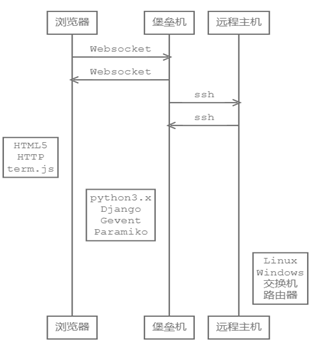

目录 {#index}

[TOC]

------

## 一、堡垒机概述

&emsp;&emsp;形象地说，堡垒机扮演着看门者的工作，所有对网络设备和服务器的请求都要从这扇大门经过,终端计算机对目标的访问，均需要经过堡垒机的翻译。因此堡垒机能够拦截非法访问和恶意攻击，对不合法命令进行命令阻断，过滤掉所有对目标设备的非法访问行为。
&emsp;&emsp;堡垒机的核心思路是逻辑上将人与目标设备分离，建立 `人 --> 主账号堡垒机用户账号) --> 授权 --> 从账号（目标设备账号）`的模式;在这种模式下，基于唯一身份标识，通过集中管控安全策略的账号管理、授权管理和审计，建立针对维护人员的`主账号 --> 登录 --> 访问操作 --> 退出` 的全过程完整审计管理，实现对各种运维加密/非加密、图形操作协议的命令级审计。

- 实现运维操作 7*24 小时监控，运维操作实时可查， 现任定位到人

- 权限管理混乱

表结构

## 二、堡垒机体系架构

一个完整的通信过程如下图系统组件间通信的设计所示：

​                     

用户通过运维审计堡垒机系统获取到主机终端并执行操作的各组件间通信步骤主要有:

- 用户通过使用支持HTML5技术和WebSocket通信技术的浏览器，在HTTP的基础上，向堡垒机发送websocket请求;

- 堡垒机上使用 gevent 异步服务器接收 websocket 请求并转发给 Django；

- Django接收请求后，对用户的操作行为进行分析并记录系统日志,审核通过后,调用paramiko建立与远程主机的ssh通道；反之,则拦截操作行为,并将报警信息反馈与系统管理员与运维人员；

- 远程主机执行用户的操作命令后，通过ssh通道返回数据给Django服务器；

- Django通过gevent异步服务器以websocket的形式返回给用户浏览器展示数据；

- 用户浏览器使用term.js插件模拟Linux终端，显示远程主机返回的结果。

本节关于运维审计堡垒机系统的Web服务器设计需要与实际生产环境相结合，根据实际生产环境的具体用户量和实际多样性的部门进行差异化的系统设计。项目中设计的运维审计堡垒机系统最大的亮点和创新点在于运维审计堡垒机系统设计可以与现有网络设备环境独立同时进行，采用“物理旁路，逻辑串联”的设计部署思路,在平台的设计中定制化采用B/S架构方式，摆脱传统硬件实验方式,不需要改变现有网络拓扑结构;与基础建设设备集群之间的耦合采用SSH网络通讯，在保证通讯安全的前提下,也实现了便捷通信的功能,松耦合的设计实现了“搭积木”式的平台架构特点。

## 运维审计

系统运行情况审计

IT资产审计

运维成本审计

运维操作审计