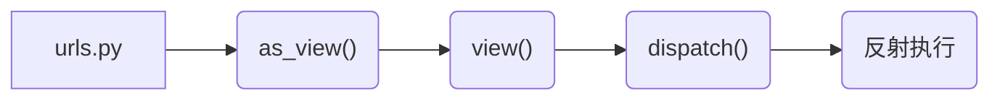

----------------------------------------------
> *Made By Herolh*
----------------------------------------------

# 目录 {#index}
[TOC]


--------------------------------------------

# CBV

> 基于反射实现,根据请求方式不同, 执行不同的方法

## 基本流程**

### url.py

```python
from django.conf.urls import url, include
from web.views.s1_api import TestView
 
urlpatterns = [
    url(r'^test/', TestView.as_view()),
]
```

### views.py

```python
from django.views import View
from django.shortcuts import render,HttpResponse
 
 
class TestView(View):
    def dispatch(self, request, *args, **kwargs):
        """
        请求到来之后，都要执行 dispatch 方法，dispatch方法根据请求方式不同触发 get/post/put等方法
         
        注意：APIView中的dispatch方法有好多好多的功能
        """
        return super().dispatch(request, *args, **kwargs)
 
    def get(self, request, *args, **kwargs):
        return Response('GET请求，响应内容')
 
    def post(self, request, *args, **kwargs):
        return Response('POST请求，响应内容')
 
    def put(self, request, *args, **kwargs):
        return Response('PUT请求，响应内容')
```

### 图示

```sequence
客户端浏览器->> ClassView: 请求 dispatch()                
ClassView->> View: 请求 dispatch() 反射找到 get/post...
View->> ClassView: 通过反射拿取方法 def get/post...
ClassView->> View: 将 def get/post... 方法返回给 dispatch() 
View->> ClassView: 将 def get/post... 方法返回给 dispatch() 
ClassView->> 客户端浏览器:  返回结果給用户
```


## 继承 View 类:




### as_view() 方法

```python
http_method_names = ['get', 'post', 'put', 'patch', 'delete', 'head', 'options', 'trace']

def as_view(cls, **initkwargs):
    """
    Main entry point for a request-response process.
    """
    # cls 就是原来的 self, 即传进来的类对象
    for key in initkwargs:
        if key in cls.http_method_names:
            raise TypeError("You tried to pass in the %s method name as a "
                            "keyword argument to %s(). Don't do that."
                            % (key, cls.__name__) )
            if not hasattr(cls, key):
                raise TypeError("%s() received an invalid keyword %r. as_view "
                                "only accepts arguments that are already "
                                "attributes of the class." % (cls.__name__, key))

    def view(request, *args, **kwargs):
        self = cls(**initkwargs)
        if hasattr(self, 'get') and not hasattr(self, 'head'):
        	self.head = self.get
        self.request = request
        self.args = args
        self.kwargs = kwargs
        return self.dispatch(request, *args, **kwargs)
    
    view.view_class = cls
    view.view_initkwargs = initkwargs
    # take name and docstring from class
    update_wrapper(view, cls, updated=())
    # and possible attributes set by decorators
    # like csrf_exempt from dispatch
    update_wrapper(view, cls.dispatch, assigned=())
    return view
```


###  dispatch() 方法

> 本质上是基于反射实现的

```python
def dispatch(self, request, *args, **kwargs):
    # Try to dispatch to the right method; if a method doesn't exist,
    # defer to the error handler. Also defer to the error handler if the
    # request method isn't on the approved list.
    if request.method.lower() in self.http_method_names:
        handler = getattr(self, request.method.lower(), self.http_method_not_allowed)
        else:
            handler = self.http_method_not_allowed
            return handler(request, *args, **kwargs)
```

#### 自己实现

```python
def dispatch(self, request, *args, **kwargs):
    func = getattr( self, request.method.lower() )   # 获取请求方法
    return func(self,request, *args, **kwargs)
```


#### 继承父类

```python
def dispatch(self, request, *args, **kwargs):
    print("before")
    ret = super( StudentView, self).dispatch( request, *args, **kwargs)
    print("after")
    return ret
```

##### 重复继承情况

```python
from django.views import View
class MyBaseView(object):
    def dispatch(self, request, *args, **kwargs):
        print("before")
        # 不只是简简单单的继承父类
        ret = super( MyBaseView, self).dispatch( request, *args, **kwargs)
        print("after")
        return ret

class StudentView( MyBaseView,View ):              # 多继承时先找左边的
    def get(self,request, *args, **kwargs):
        return HttpResponse( "GET" )
    def post(self,request,*args, **kwargs):
        # 先把 CSRF 关掉,要不然会报错
        return HttpResponse( "POST" )

class TeacherView( View ):
    def get(self,request, *args, **kwargs):
        return HttpResponse( "GET" )
    def post(self,request,*args, **kwargs):
        # 先把 CSRF 关掉,要不然会报错
        return HttpResponse( "POST" )
```


## 填坑

### 免除 CRSF 认证

#### FBV 处理方法

```python
from django.views.decorators.csrf import csrf_exempt,csrf_protect
@csrf_exempt					# 该函数免除认证
def users(request):
    user_list = [ 'user1','user2' ]
    return HttpResponse( json.dumps( (user_list) ) )
```


#### CBV 处理方法

##### 错误解决方式

```python
from django.views.decorators.csrf import csrf_exempt,csrf_protect
class StudentView( MyBaseView,View ):
	@csrf_exempt								# 直接加在类方法上是无效的
    def post(self,request,*args, **kwargs):
        # 先把 CSRF 关掉,要不然会报错
        return HttpResponse( "POST" )
```

##### 正确解决方式

```python
from django.views.decorators.csrf import csrf_exempt,csrf_protect
from django.utils.decorators import method_decorator
class StudentView( MyBaseView,View ):
    @method_decorator(csrf_exempt)					# 必需加在dispatch 上
    def dispatch(self, request, *args, **kwargs):
        func = getattr( self, request.method.lower() )   
        return func(self,request, *args, **kwargs)
    def post(self,request,*args, **kwargs):
        # 先把 CSRF 关掉,要不然会报错
        return HttpResponse( "POST" )
```

或者

```python
from django.views.decorators.csrf import csrf_exempt,csrf_protect
from django.utils.decorators import method_decorator

@method_decorator(csrf_exempt, name="dispatch")
class StudentView( MyBaseView,View ):
    def dispatch(self, request, *args, **kwargs):
        func = getattr( self, request.method.lower() )   
        return func(self,request, *args, **kwargs)
    def post(self,request,*args, **kwargs):
        # 先把 CSRF 关掉,要不然会报错
        return HttpResponse( "POST" )
```


