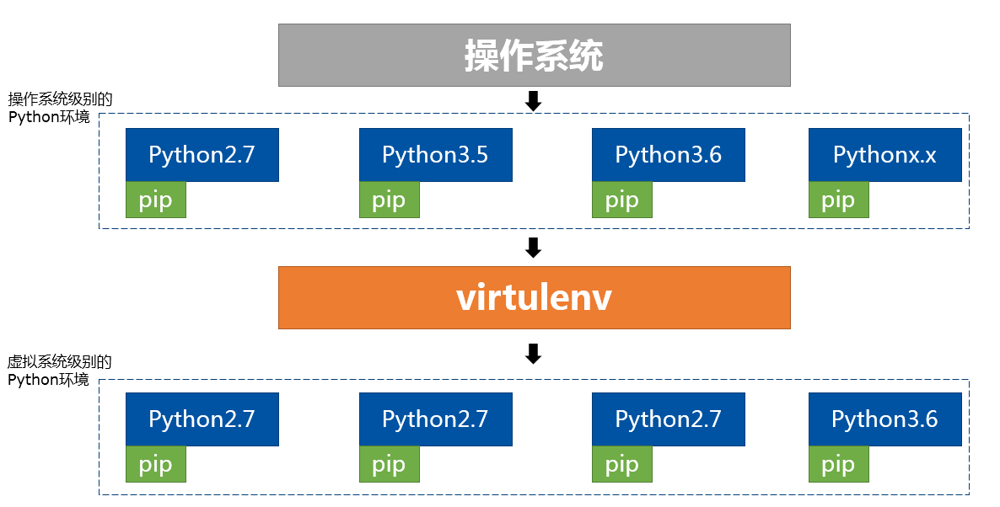
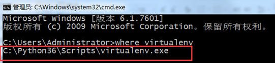
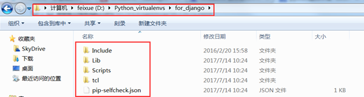
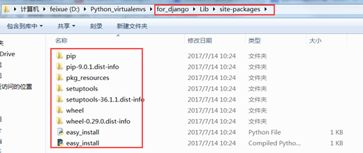
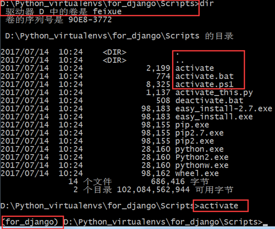
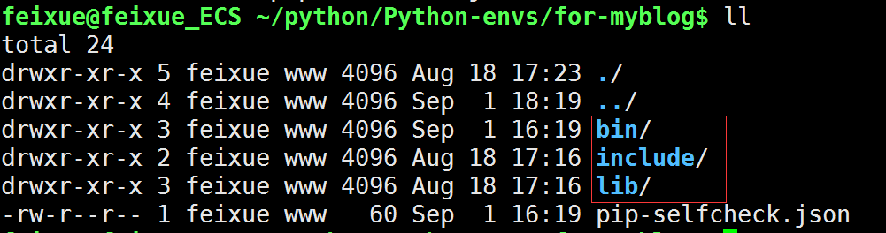
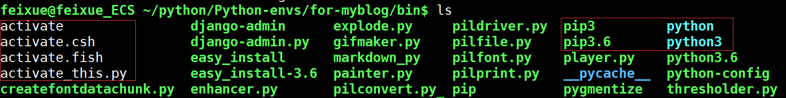
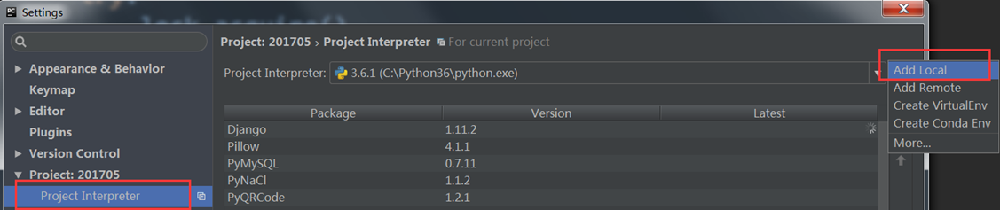
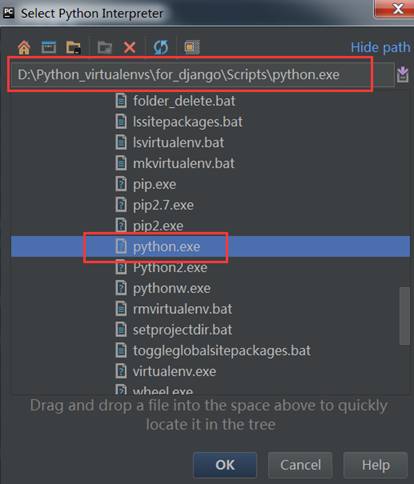

----------------------------------------------
> *Made By Herolh*
----------------------------------------------

# 目录 {#index}
[TOC]


--------------------------------------------

# 搭建开发环境
&emsp;&emsp;建议尽可能地与教程的开发环境保持一致（尤其是 Python 与 Django 版本），避免不必要的麻烦。推荐的 Python 版本为 Python 3.4 或以上，Django 版本号必须为 Django 1.8~2.0,  2.0 版本以上的数据库Mysql请安装5.7以上, 否则会报错。本教程写作时开发环境的系统平台为:  
- Windows 10(64位)  
- Python 版本为 3.6.3(64位)  
- Django 版本为 2.0  
- 数据库为Mysql 5.5。  


## 安装 Python

&emsp;&emsp;Windows 下安装 Python 非常简单，去 Python 官方网站找到 Python 3 的下载地址，根据你的系统选择 32 位或者 64 位的安装包，下载好后双击安装即可。安装完后检测 Python 是否可以正常运行。在命令行输入 `python -v` ，如果输出了 Python 的版本号，说明 Python 已安装成功。

```shell
C:\WINDOWS\system32>python -V
Python 3.5.2
```

&emsp;&emsp;如果提示命令未找到，而你又确定已经安装了 Python，多半是因为没有把 Python 添加到环境变量。可搜索如何把 Python 添加到环境变量的相关教程，将安装的Python 添加到环境变量即可。


## 使用虚拟环境 Virtualenv

&emsp;&emsp;**强烈推荐在 Virtualenv 下进行 Django 的开发。**Virtualenv 是一个 Python 工具，使用它可以创建一个独立的 Python 环境。  

&emsp;&emsp;为什么要使用 Virtualenv 呢？举个例子，有的时候因为各种原因，我们会安装很多版本的Python解释器。同样，我们也有可能因为各种原因，需要不同版本的模块，比如Django1.8，Django1.11。再加上 pip 工具管理器的版本混乱问题。这就使得很多人在Python的环境管理上产生极大的混乱。  
&emsp;&emsp;Virtualenv 帮我们从系统的 Python 环境中克隆一个全新的 Python 环境出来，这个环境独立于原来的 Python 环境。我们可以在这个新克隆的环境下安装 Django 1.10.6，并且在这个新环境下运行我们的新项目。  

&emsp;&emsp;**virtualenv 就是用来为每一个项目创建一套“独立隔离”的Python运行环境的工具。**

&emsp;&emsp; 在 Python3.4 之前，virtualenv 需要独立手动安装后，方可执行。之后的版本中，Python 自带了一个venv 库，执行 `Python –m venv ./新环境文件夹` 就可以达到与 virtalenv 同样的效果。更多的用户习惯上还是使用virtualenv 的方式。  

&emsp;&emsp;Python多解释器环境加上virtualenv创建的多虚拟环境共存在同一操作系统下的情形一般如下图所示：  

  

核心要点是：  
- 一个操作系统下，可以有多个“操作系统级别的”Python 解释器；  
- 每个 Python 解释器有一个指向自己的pip工具，两者一一对应；  
- 通过 virtualenv 可以虚拟任何一个“操作系统级别的”Python 解释器成为一个“虚拟级别”的解释器；  
- 每个“虚拟级别”的解释器又拥有自己独立的 pip 工具和 site-packages。  

如果你理解了上面几点，就能明白virtualenv和pip在使用上的区别。  


### 安装virtualenv
&emsp;&emsp;以windows操作系统为例，要安装virtualenv，建议直接使用当前环境变量下指定的pip，也就是你操作系统默认的那个python版本所绑定的pip，这样方便命令调用。通常如下：  
```shell
pip install virtualenv
```

&emsp;&emsp;可以在命令行界面中验证安装：`where virtualenv`  



&emsp;&emsp;可以看出，这里的 virtualenv 是作为一个可执行程序，安装在我系统默认的 Python3.6 版本下。而我当前操作系统下其实有3个版本的 Python; 你或许有疑问？那我要虚拟 Python2.7 的版本怎么办？在 Python2.7 下也装一个 virtualenv ？不需要的！virtualenv 可以指定虚拟的Python解释器版本，只要你本地操作系统下安装了这个版本！具体步骤会在下文讲解!


### 建立虚拟环境

如果自己手动管理所有的虚拟环境，通常会建立一个目录，用来放置所有的虚拟环境。这里：
```shell
mkdir d:\Python_virtualenvs
```
然后运行：  
```shell
virtualenv –p c:\Python27\Python2.exe –-no-site-packages d:\Python_virtualenvs\for_django
```

**参数说明:**  
> **-p**： 指定你要虚拟的Python版本，这里选择了本地的python2.7  
> **–-no-site-packages**：表示在建立虚拟环境时不将原版本中的第三方库拷贝过来，这样就能获得一个纯净的Python环境。  
> **d:\Python_virtualenvs\for_django**：表明在该目录下，建立一个叫做for_django的虚拟环境，这样的命名方式，让你一眼就能看出这个虚拟环境是为谁建立的。 





&emsp;&emsp;以上是我们Python虚拟环境文件系统中的情况，从截图中可以看出，环境非常干净！


### 使用虚拟环境
&emsp;&emsp;命令行下，进入你要使用的虚拟环境的目录下的 script 文件夹，运行 `activate` 命令。或者使用绝对路径的方式调用该命令。



&emsp;&emsp;注意命令提示符 (for_django)，它表示你当前在 for_django 这个虚拟环境内。现在，你可以当做一个正常的 Python 环境使用。例如运行 python 命令，又或者使用 pip 安装第三方库 `pip install requests`。这些都被限制和绑定在 for_django 这个虚拟环境内，不会对操作系统下本地的 Python 版本和其它的虚拟环境产生任何的影响！


### 退出虚拟环境
&emsp;&emsp;要退出虚拟环境，只要运行 scrip t目录下的 `deactivate` 命令就可以了。
&emsp;&emsp;要删除虚拟环境，直接删除虚拟环境所在的目录就可以了，注意不要将其它的环境给删了。但是，删除虚拟环境后，所有以前使用该环境的工程都将受到影响。这点很好理解，所以请确保环境不再有需要再删除！


### linux操作系统下的使用
&emsp;&emsp;对于 linux 操作系统，使用方法基本类似。只是虚拟环境中的文件路径和脚本调用的方式和 windows 系统下不太一样，**Linux 下没有 Scripts\ 这个目录，取而代之的是 bin/ 目录。**仔细看下图中的 bin 目录，提供了一个 activate 脚本，以及一个写入环境变量的 deactivate 命令。





**创建虚拟环境**： 
```shell
$ virtualenv -p /usr/bin/python2.7 –-no-site-packages my_venv
```

**启动虚拟环境**： 
```shell
$ source my_venv/bin/activate　
```

**退出虚拟环境：**   
```shell
$ deactivate　
```

**删除虚拟环境：**   
```shell
$ rm –r my_venv
```


### virtualenv配合pip快速建立开发环境
&emsp;&emsp;virtualenv 虚拟环境配合 pip 的 freeze 功能，可以一次性快捷的将整个环境下的第三方模块全部记录下来：   
```shell
pip freeze > d:\requirements.txt
```

&emsp;&emsp;对应的，也可以用它一次性通过在别的机器上或虚拟环境里，将文件里列出的第三方库安装起来。只需要使用命令：
```shell
pip install -r requirements.txt
```


### Pycharm结合virtualenv的使用
&emsp;&emsp;windows 下的开发，很多时候使用命令行并不是那么方便，尤其是在 Pycharm 开发环境下，频繁切换界面也是种负担。实际上 Pycharm 可以指定解释器，直接将项目的 Python 解释器设置为你要使用的虚拟环境就行，如下所示：

在settings中：



选择Python:




## 安装 Django
&emsp;&emsp;Django 的官方文档对 [如何安装 Django](https://docs.djangoproject.com/en/1.10/intro/install/#install-django) 给出了详细且明确的指导，不过我们目前用不上这些，只需在虚拟环境下使用 pip 命令就可以解决问题。

```shell
(blog_env) C:\WINDOWS\system32> pip install django==2.0
```

&emsp;&emsp;我们用 `django==2.0` 来安装指定的 Django 版本以保证和教程中的一致。如果直接 `pip install django` 的话有可能安装最新的 Django 发行版本，而不是 Django 2.0。

&emsp;&emsp;**注意命名提示符前的 (blog_env) 以确保你始终处在虚拟环境中，如果不小心退出了虚拟环境，先按上面的步骤重新进入再安装 Django。**

&emsp;&emsp;测试一下安装是否成功，先在命令行输入 `python` 以打开 Python 自带的命令栏，然后输入 `import django`，如果没有报错就说明 Django 安装成功。通过运行 `print(django.get_version())` 打印出 Django 的版本号，确保安装了正确版本的 Django。


## 建立 Django 工程
&emsp;&emsp;Django 工程（Project）是我们项目代码的容器，例如我们博客项目中所有的代码（包括 Django 为我们自动生成的以及我们自己写的）都包含在这个工程里。其实说通俗一点就是用一个文件夹把一系列 Python 代码文件和 Django 配置文件包裹起来，这个文件夹就可以看做一个 Django 工程。我们不必亲自动手新建这个文件夹和代码文件，Django 的内置命令已经帮我们做了这些事情。例如我把博客工程的代码放在 `C:\Users\yangxg\Workspace\` ，工程名我把它叫做 blogproject 。

&emsp;&emsp;首先在命令行进入到 `C:\Users\yangxg\Workspace` 这个目录（如果你还停留在 Python 的命令栏里，先多按几次 Ctrl + c 键跳出来）：

```visual basic
(blogproject_env) C:\WINDOWS\system32>cd C:\Users\yangxg\Workspace
```

然后运行如下命令创建工程：

```visual basic
(blogproject_env) C:\Users\yangxg\Workspace> django-admin startproject blogproject
```

&emsp;&emsp;**再次申明一定要在虚拟环境下运行这些命令，虚拟环境的标志就是命令提示符前有 (blogproject_env) 这样的标记。以后几乎所有和 Django 有关的命令都是在虚拟环境下运行，因此在运行前一定确保先开启了虚拟环境。**

&emsp;&emsp;进入工程所在目录 `C:\Users\yangxg\Workspace\`（你可能设置在其它路径），会发现多了一个 blogproject\ 的目录，其内部的文件结构如下：
```
blogproject\
    manage.py
    blogproject\
        __init__.py
        settings.py
        urls.py
        wsgi.py
```


## Hello Django


