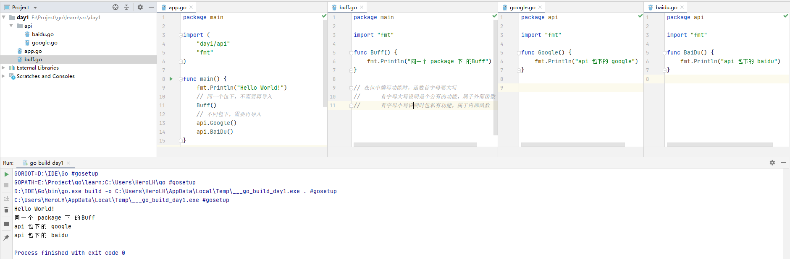
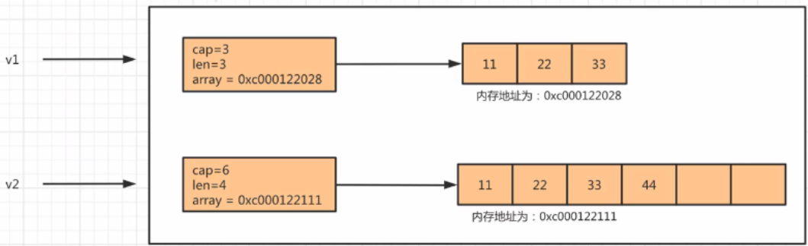

----------------------------------------------
> *Made By Herolh， 忠告：语言只是工具*
----------------------------------------------

# go 语言  {#index}

[TOC]


# 初识Go语言
> [Go语言圣经( 中文版)](https://docs.hacknode.org/gopl-zh/)
> https://github.com/gopl-zh/gopl-zh.github.com
> http://shouce.jb51.net/gopl-zh/ch1/ch1-01.html


## 什么是Go语言？

&emsp;&emsp;Go 是一个开源的编程语言，它能让构造简单、可靠且高效的软件变得容易。
&emsp;&emsp;Go 是从 2007 年末由 Robert Griesemer, Rob Pike, Ken Thompson 主持开发，后来还加入了 Ian Lance Taylor, Russ Cox 等人，并最终于 2009 年 11 月开源，在 2012 年早些时候发布了 Go 1 稳定版本。现在 Go 的开发已经是完全开放的，并且拥有一个活跃的社区。

[GO 可在线运行教程](https://tour.go-zh.org/welcome/1)


### 版本更新：
- Go 1.14 (February 2020)
- Go 1.13 (September 2019)
- Go 1.12 (February 2019)
- Go 1.11 (August 2018)
- Go 1.10 (February 2018)
- Go 1.9 (August 2017)
- Go 1.8 (February 2017)
- Go 1.7 (August 2016)
- Go 1.6 (February 2016)
- Go 1.5 (August 2015)
- Go 1.4 (December 2014)
- Go 1.3 (June 2014)
- Go 1.2 (December 2013)
- Go 1.1 (May 2013)
- Go 1 (March 2012)


## Go 语言环境安装
>  Go 语言支持以下系统：Linux、FreeBSD、Mac OS X、Windows

Go官网安装包下载地址为：https://golang.org/dl/。
Go官方镜像站( 推荐 )：https://golang.google.cn/dl/。
各个系统对应的包名：

| 操作系统 |              包名              |
| :------: | :----------------------------: |
| Windows  |    go1.4.windows-amd64.msi     |
|  Linux   |    go1.4.linux-amd64.tar.gz    |
|   Mac    | go1.4.darwin-amd64-osx10.8.pkg |
| FreeBSD  |   go1.4.freebsd-amd64.tar.gz   |


### Windows 系统下安装
&emsp;&emsp;Windows 下可以使用 `.msi` 后缀的安装包来安装。默认情况下 `.msi` 文件会安装在 `c:\Go` 目录下。你可以将 `c:\Go\bin` 目录添加到 `Path` 环境变量中。添加后你需要重启命令窗口才能生效。

### 安装测试
- **方法一：**

    ```shell
    go version
    ```

    

- **方法二：**

    创建工作目录 `C:\>Go_WorkSpace`

    ```shell
    package main
    
    import "fmt"
    
    func main() {
       fmt.Println("Hello, World!")
    }
    ```

    使用 go 命令执行以上代码输出结果如下：

    ```shell
    C:\Go_WorkSpace>go run test.go
    
    Hello, World!
    ```

    


### 编译程序
&emsp;&emsp;使用 `go run` 这个命令，会将编译、链接和运行3个步骤合并为一步，运行完后在当前目录下也看不到任何中间文件和最终的可执行文件。如果要只生成编译结果而不自动运行，我们也可以使用 Go 命令行工具的 `build` 命令：

```shell
go build hello.go
./hello 
 # Hello, World!
```

&emsp;&emsp;从根本上说，Go 命令行工具只是一个源代码管理工具，或者说是一个前端。真正的 Go 编译器和链接器被 Go 命令行工具隐藏在后面，我们可以直接使用它们：

```shell
6g helloworld.go 
6l helloworld.6 
./6.out 
 # Hello, World!
```

&emsp;&emsp;6g 和 6l 是 64 位版本的 Go 编译器和链接器，对应的 32 位版本工具为 8g 和 8l。Go 还有另外一个 GCC 版本的编译器，名为 gccgo。


### 环境配置
#### 创建一个任意目录

以后的 go 项目都要按照要求放在这个目录里：

```shell
E:\Project\go
----|bin	# 用于存放编译后的可执行文件
----|pkg	# 用于存放编译后的包文件
----|src	# 我们以后写的go项目代码都写到这里去，在内部为每个项目创建一个文件夹。
----|----|project_1
----|----|----|app.go
----|----|project_2
----|----|----|app.go
```

> Go 1.11 版本引入了 Module 包管理机制， 可以实现让项目放在任意目录，同时也解决了包依赖管理等问题，后续专门在 Module 专题中再进行讲解，目前先按照上图的方式进行创建项目。


#### 配置环境变量
```shell
 # GOROOT，Go解释器安装路径，用于之后去调用go相关源码。
 # GOPATH，Go项目代码相关目录，将你以后写的go代码及其编译生成的文件存放的目录。
 # GOBIN，Go编译代码后自动生成可执行文件的路径，Go是个编译型语言，当使用go install命令对代码进行编译时，可执行文件会生成到这个目录。
```


#### GOPATH
&emsp;&emsp;`GOROOT` 和 `GOPATH` 都是环境变量，其中`GOROOT`是我们安装 go 开发包的路径，而从 Go 1.8 版本开始，Go 开发包在安装完成后会为`GOPATH`设置一个默认目录，参见下表。

##### GOPATH在不同操作系统平台上的默认值
|  平台   |   GOPATH默认值   |        举例        |
| :-----: | :--------------: | :----------------: |
| Windows | %USERPROFILE%/go | C:\Users\用户名\go |
|  Unix   |     $HOME/go     |  /home/用户名/go   |


## 第一个Go程序 Hello World!
### 目录结构
&emsp;&emsp;在 `GOPATH` 下的 `src` 目录中创建一个 `文件夹( 项目 )`，进入文件夹并创建一个以 `.go` 为后缀名的文件( 如 `first.go` )，并在 `first.go` 文件中写入 go 代码。

```shell
E:\Project\go
----|bin
----|pkg
----|src
----|----|learn
----|----|----|day1
----|----|----|----|helloWorld.go
```


### 代码示例
```go
package main

import "fmt"

func main() {		// 程序开始执行的函数。
   fmt.Println("Hello, World!")
}
```

- **package main**
  
    > 每个 Go 源代码文件的开头都是一个 package 声明，表示该 Go 代码所属的包。
> 必须在源文件中非注释的第一行指明这个文件属于哪个包，包是Go 语言里最基本的分发单位，也是工程管理中依赖关系的体现。

- **import "fmt"**
    >  在包声明之后，是一系列的import语句，用于导入该程序所依赖的包。由于本示例程序用到了 `Println()` 函数，所以需要导入该函数所属的 fmt 包。 
    >  有一点需要注意，**不得包含在源代码文件中没有用到的包，否则Go编译器会报编译错误。**
    >  这与下面提到的强制左花括号 `{` 的放置位置以及之后会提到的函数名的大小写规则，均体现了Go 语言在语言层面解决软件工程问题的设计哲学。


- **func **

    > 所有 Go 函数( 包括在对象编程中会提到的类型成员函数 )以关键字 func 开头。一个常规的 函数定义包含以下部分：
    >
    > ```go
    > func 函数名(参数列表)(返回值列表) {
    >     // 函数体
    > }
    > 对应的一个实例如下：
    > func Compute(value1 int, value2 float64)(result float64, err error) {
    >     // 函数体
    > } 
    > ```
    >
    > Go支持多个返回值。以上的示例函数 `Compute()` 返回了两个值，一个叫 result，另一个是 err。并不是所有返回值都必须赋值。在函数返回时没有被明确赋值的返回值都会被设置为默认值，比如result会被设为0.0，err会被设为 nil。

- **main(){}**
  
    > main 函数是每一个可执行程序所必须包含的，一般来说都是在启动后第一个执行的函数( 如果有 init() 函数则会先执行该函数 )。main 函数是 Go 可执行程序的执行起点 )。
    > **Go语言的main()函数不能带参数，也不能定义返回值。**命令行传入的参数在` os.Args` 变量中保存。如果需要支持命令行开关，可使用 flag 包。


### 运行代码

本质上是将 go 代码交给 go 编译器去执行


#### 方式一：`go run`

> compile and run Go program ，其内部会【先编译】代码文件【再运行】( 二合一 )。

注意：`go run` 内部创建可执行文件默认保存在系统的临时目录，可以使用 `go run -work main.go`查看。

```shell
go run learn\day1
 # or
go run helloWorld.go
```


#### 方式二：`go build`

> compile packages and dependencies，其内部就是将 go 代码进行编译，然后手动执行。
>
> ```shell
> go build -n 
> # 进行编译时，会将底层编译不步骤展示出来。
> 
> go build -o 任意名称 
> # 进行编译，这样可自定义编译生成的可执行文件的名称。
> ```
>
> 注意：在win系统中 build 命令会生成的可执行文件默认以 .exe 为后缀。

&emsp;&emsp;执行完命令之后，就会在当前项目目录下自动生成一个可执行文件( 默认文件名为项目 )，然后在执行此可执行文件即可。

```shell
go build
day1.exe
 # or
go build -o helloWorld.exe
helloWorld.exe
```


#### 方式三：`go install`

> compile and install packages and dependencies，其内部就是编译 go 代码，并将可执行文件/包文件分别放到 bin 和 pkg 目录。包文件的生成必须用 `go install`


&emsp;&emsp;如果项目没有main包( 只是一个类库 )，则 install 生成的包文件会放在 `$GOPATH/pkg` 目录；有 main 包则生成的可执行文件放在 `$GOPATH/src` 目录。
&emsp;&emsp;对于生成的 可执行文件 直接运行即可，而对于 包文件 可以当做是一个类库来供其他程序使用，

```shell
go install learn\day1
..\..\bin\day1.exe
```


## 集成开发环境

&emsp;&emsp;常用的有 vscode 和 Goland，此处用 Goland

### Goland

去[官方网站](https://www.jetbrains.com/go/)去下载 Goland 并 安装到自己的电脑中。


#### 常见配置

##### 关闭参数建议

&emsp;&emsp;你的 Goland 在编写代码时，可能会在代码发现一些 `a...:` 等标记，这其实是Goland为你提供的参数的注解，如果不想展示，则可以修改Goland的配置实现。


##### 字体调节

&emsp;&emsp;你的 Goland 字体大小不合适时，可以通过修改 Goland 的配置之后，通过 `Ctrl + 鼠标滚轮` 实现字体大小调节。


# Go 语言基础语法

## 注释与分隔符

### 注释

Go 程序的代码注释与 C++ 保持一致，即同时支持以下两种用法：

```go
/*
块注释
*/

// 行注释 
```

&emsp;&emsp;Go程序并不要求开发者在每个语句后面加上分号表示语句结束，这是与C和C++的一个明显不同之处。**需要注意的是 `{` 不能单独放在一行**，所以以下代码在运行时会产生错误，这样做的结果是 Go 编译器报告编译错误，这点需要特别注意：

```go
package main

import "fmt"

func main()  
{  // 错误，{ 不能在单独的行上
    fmt.Println("Hello, World!")
}
```

> syntax error: unexpected semicolon or newline before { 


### 分隔符

&emsp;&emsp;在 Go 程序中，一行代表一个语句结束。每个语句不需要像 C 家族中的其它语言一样以分号 `;` 结尾，因为这些工作都将由 Go 编译器自动完成。如果你打算将多个语句写在同一行，它们则必须使用 `;` 人为区分，但在实际开发中我们并不鼓励这种做法。

```go
// 以下为两个语句：
fmt.Println("Hello, World!")
fmt.Println("Hello, World!")
```


## 初识包管理

> &emsp;&emsp;`包( package )`是多个 Go 源码的集合，是一种高级的代码复用方案，Go 语言为我们提供了很多内置包，如`fmt`、`os`、`io`等。

一般来说，一个文件夹可以作为 package，同一个 package 内部变量、类型、方法等定义可以相互看到。
- 一个文件夹就可以成为一个包
- 在文件夹( 包 )中可以创建对讴歌文件
- 在同一个包下的每个文件必须指定包名且相同


### 包的分类

-  **`main` 包**

    > 如果是 main 包，则必须写一个 main 函数，此函数位项目的入口( main 主函数 )
    >
    > 编译生成的是一个可执行文件

- **非 `main` 包**

    > 用来将


### 示例

- **api 包**

    - **baidu.go**

        ```go
        package api
        
        import "fmt"
        
        func BaiDu() {
        	fmt.Println("api 包下的 baidu")
        }
        ```

    - **google.go**

        ```go
        package api
        
        import "fmt"
        
        func Google() {
        	fmt.Println("api 包下的 google")
        }
        ```

- **buff.go**

    ```go
    package main
    
    import "fmt"
    
    // 在包中编写功能时，函数首字母要大写
    // 		首字母大写说明是个公有的功能，属于外部函数
    // 		首字母小写说明时包私有功能，属于内部函数
    func Buff() {
    	fmt.Println("同一个 package 下 的Buff")
    }
    ```

- **app.go**

    ```go
    package main
    
    import (
    	"fmt"
    	"learn/api"
    )
    
    func main() {
    	fmt.Println("Hello World!")
        // 同一个包下，不需要再导入
    	Buff()
        // 不同包下，需要再导入
    	api.Google()
    	api.BaiDu()
    }
    ```




## 输入与输出

### 输出

在终端将数据显示出来

#### 扩展：

进程里有 `stdin/stdout/stderr` ==> `标准输入/标准输出/标准错误`


#### 法一：内置函数

> 官方不保证以后一直有这个功能
>
> 这两个函数取的值不是标准输出，而是标准错误

- **print**

    ```go
    print("hello world!")
    print("hello world!")
    ```

- **println**

    ```go
    println("hello world!")			// ==> 相当于 print("hello world!\n")
    println("hello world!")
    ```


#### 法二：fmt 包( 推荐 )

- **fmt.Print**

    ```go
    fmt.Print("hello world!")
    fmt.Print("hello world!")
    ```

- **fmt.Println**

    ```go
    fmt.Println("hello world!")
    fmt.Println("hello world!")
    
    fmt.Println("hello", "world", "!")
    ```

- **fmt.Printf**

    > 格式化输出
    > %s 			占位符，文本
    > %d			占位符，整数
    > %f		 	占位符，小数( 浮点数 )
    > 百分比		%
    
    ```go
    fmt.Printf("你好， 我是%s, 今年%d, %.2f, 百分比100%%", "lin", 18, 3.1415926)
    ```


### 输入

#### `fmt` 包获取

&emsp;&emsp;Go 语言`fmt`包下有`fmt.Scan`、`fmt.Scanf`、`fmt.Scanln`三个函数，可以在程序运行过程中从标准输入获取用户的输入。

- **fmt.Scan**

    ```go
    func Scan(a ...interface{}) (n int, err error)
    ```

```
    
    `fmt.Scan` <u>要求输入两个值， 就必须输入两个值，否则会一直等待。</u>用户输入成功后，会得到两个值：
    
    > **count**: 用户输入了几个值
    > **err**： 用户输入错误时的错误信息，没有错误返回 <nil>
    
    ```go
    var name string
    var age int
    
    count, err := fmt.Scan(&name, &age)
    fmt.Println(count, err)
    if err == nil{
        fmt.Println(name, age)
    }
    fmt.Println("用户输入错误：", err)
```


​    

- **fmt.Scanln**

    ```go
    func Scanln(a ...interface{}) (n int, err error)
    ```

    `fmt.Scanln` <u>等待回车，输入回车，输入结束</u>。用户输入成功后，会得到两个值：

    >**count**: 用户输入了几个值
    >**err**： 用户输入错误时的错误信息，没有错误返回 <nil>

    ```GO
    var name string
    var age int
    
    count, err := fmt.Scanln(&name, &age)
    fmt.Println(count, err)
    if err == nil{
        fmt.Println(name, age)
    }
    fmt.Println("用户输入错误：", err)
    ```


- **fmt.Scanf**

    ```go
    func Scanf(format string, a ...interface{}) (n int, err error)
    ```

    > 占位符后面要有空格，否则切分不准确

    ```go
    var name string
    var age int
    
    count, err := fmt.Scanf("我叫%s 今年%d 岁", &name, &age)
    fmt.Println(count, err)
    if err == nil{
        fmt.Println(name, age)
    }
    fmt.Println("用户输入错误：", err)
    ```


#### `bufio`包获取

&emsp;&emsp;有时候我们想完整获取输入的内容，而输入的内容可能包含空格，这种情况下可以使用 `bufio` 包来实现。示例代码如下：

```go
reader := bufio.NewReader(os.Stdin) // 从标准输入生成读对象
fmt.Println("请输入内容：")
// line：	 从 stdin 中读取一行的数据( 字节集合 -> 转化为字符串)
// isPrefix：默认一次能读 4096 个字节：
//		一次读完，isPrefix = false
//		一次读不完，isPrefix = true
// err:
line, isPrefix, err := reader.ReadLine()
data := string(line)
fmt.Println(data, isPrefix, err)

//text, _ := reader.ReadString('\n') 			// 读到换行
//text = strings.TrimSpace(text)
//fmt.Printf("%#v\n", text)
```


## 基本数据类型

&emsp;&emsp;在 Go 编程语言中，数据类型用于声明函数和变量。
数据类型的出现是为了把数据分成所需内存大小不同的数据，编程的时候需要用大数据的时候才需要申请大内存，就可以充分利用内存。

### 数值类型

&emsp;&emsp;Go语言的数值类型包含不同大小的整数型、浮点数和负数，每种数值类型都有大小范围以及正负符号。并且支持复数，其中位的运算采用补码。

```go
fmt.Println(666)
fmt.Println(6 + 6)
fmt.Println(6 - 6)
fmt.Println(6 * 6)
fmt.Println(6 / 6)		// 商
fmt.Println(6 % 6)		// 余数
```


#### 整数类型

Go语言的整数类型分为有符号和无符号两大类，有符号的包括负数，无符号的不包含负数。

- **无符号整型**

    | 序号 | 类型和描述                                                   |
    | :--- | :----------------------------------------------------------- |
    | 1    | **uint8** 无符号 8 位整型 (0 到 255)                         |
    | 2    | **uint16** 无符号 16 位整型 (0 到 65535)                     |
    | 3    | **uint32** 无符号 32 位整型 (0 到 4294967295)                |
    | 4    | **uint64** 无符号 64 位整型 (0 到 18446744073709551615)      |
    | 5    | **uint** 在 32 位系统上使用32位( 同 uint32 ), 在64位操作系统上使用 64 位( 同 uint64 ) |


- **有符号整型**

    | 序号 | 类型和描述                                                   |
    | ---- | ------------------------------------------------------------ |
    | 1    | **int8** 有符号 8 位整型 (-128 到 127)                       |
    | 2    | **int16** 有符号 16 位整型 (-32768 到 32767)                 |
    | 3    | **int32** 有符号 32 位整型 (-2147483648 到 2147483647)       |
    | 4    | **int64** 有符号 64 位整型 (-9223372036854775808 到 9223372036854775807) |
    | 5    | **int** 在 32 位系统上使用32位( 同int32 ), 在64位操作系统上使用 64 位( 同int64 ) |

```go
func main() {
	int1 := 9223372036854775807
	int2 := -9223372036854775808
	fmt.Println(int1, int2)

	//int3 := 9223372036854775809				// 超出范围，会报错
	//fmt.Println(int3)
}
```


##### 超大整型

```go
import "math/big"
```

创建超大整型的对象：

```go
var v1 big.Int				// {false []}
var v2 *big.Int				// nil
v3 := new(big.Int)			// 0
fmt.Println(v1, v2, v3)
//v4 := big.NewInt(111)	// 声明加赋值

// 在超大整型对象中写入值
v1.SetInt64(2000)		// 不常用，写入的值超过int64 仍然报错
v1.SetString("1234123123123123123123123", 10)		// 以十进制的形式写
fmt.Println(v1)
fmt.Println(v1.String())

// 以二进制的格式读，存的时候按十进制存,
v1.SetString("9234123123123123123123123", 2)
// 如果格式不对会根据第一位来变成0或1
fmt.Println(v1)				// {false [1]}
fmt.Println(v1.String())	// 1
v1.SetString("1234123123123123123123123", 2)
fmt.Println(v1)				// {false [0]}
fmt.Println(v1.String())	// 
```

基本的加减乘除

```go
result := new(big.Int)
v1.SetString("111", 10)
v3.SetString("222", 10)
// 加
result.Add(&v1, v3)
fmt.Println(result)				// 333
// 减
result.Sub(只能得到商)(v3, &v1)
fmt.Println(result)				// 111
// 乘
result.Mul(v3, &v1)
fmt.Println(result)				// 24642
// 除(只能得到商)
result.Div(v3, &v1)
fmt.Println(result)				// 2
// 除，得到商和余数
mid := new(big.Int)
result.DivMod(v3, &v1, mid)
fmt.Println(result, mid)		// 2 0
```


#### 浮点型

##### float

> Go 语言提供了两种精度的浮点数(非精确)，float32 和 float64，编译器默认声明为 float64

|      类型      | 占用存储空间 |        表数范围        |
| :------------: | :----------: | :--------------------: |
| 单精度 float32 |    4 字节    |  -3.403E38 ~ 3.403E38  |
| 双精度 float64 |    8 字节    | -1.798E308 ~ 1.798E308 |
|   complex64    |              |    32 位实数和虚数     |
|   complex64    |              |    64 位实数和虚数     |

> 浮点数=符号位+指数位+位数位

```go
func main() {
	var price float32 = 11.22 					//正数符号
	fmt.Println("price =", price)
	var num1 float32 = -3.4 					//负数符号
	var num2 float64 = -8.23
	fmt.Println("num1 =", num1, "num2 =", num2)
	//尾数可能丢失，精度缺损
	var num3 float32 = -123.11111111105			//精度丢失了
	var num4 float64 = -123.11111111105			//float64 的精度高于 float32
	fmt.Println("num3 =", num3, "num4 =", num4)
	//输出结果
	//num3= -123.111115 num4= -123.11111111105
}
```

注意，float 的数值都是非精确的

```go
v2 := 0.1
v3 := 0.2
fmt.Println(v3 + v1)		// 0.30000000000000004
```


###### float 底层存储原理

```go
var price float32 = 39.29
```

- **浮点数转化为二进制**

    - 整数部分，直接转化为二进制, 即：`100111`

    - 小数部分让小数部分乘以2，结果小于1则继续乘以2，结果大于1则-1继续乘2，结果等1则结束

        ```shell
        0.29 * 2 = 0.58 		// 小于1，继续乘以2
        0.58 * 2 = 1.16 		// 大于1，减1继续乘以2
        0.16 * 2 = 0.32 		// 小于1，继续乘以2
        0.32 * 2 = 0.64 		// 小于1，继续乘以2
        0.64 * 2 = 1.28 		// 大于1，减1继续乘以2
        0.28 * 2 = 0.56 		// 小于1，继续乘以2
        0.56 * 2 = 1.12 		// 大于1，减1继续乘以2
        0.12 * 2 = 0.24 		// 小于1，继续乘以2
        0.24 * 2 = 0.48 		// 小于1，继续乘以2
        0.48 * 2 = 0.96 		// 小于1，继续乘以2
        0.96 * 2 = 1.92 		// 大于1，减1继续乘以2
        0.92 * 2 = 1.84 		// 大于1，减1继续乘以2
        0.84 * 2 = 1.68 		// 大于1，减1继续乘以2
        0.68 * 2 = 1.36 		// 大于1，减1继续乘以2
        0.36 * 2 = 0.72 		// 小于1，继续乘以2
        0.72 * 2 = 1.44 		// 大于1，减1继续乘以2
        0.44 * 2 = 0.88 		// 小于1，继续乘以2
        0.88 * 2 = 1.76 		// 大于1，减1继续乘以2
        0.76 * 2 = 1.52 		// 大于1，减1继续乘以2
        0.52 * 2 = 1.04 		// 大于1，减1继续乘以2
        0.04 * 2 = 0.08 		// 小于1，继续乘以2
        0.08 * 2 = 0.16 		// 小于1，继续乘以2
        0.16 * 2 = 0.32 		// 小于1，继续乘以2
        (与第三行相同，这样会一直循环执行下去)
        
        将现成后的结果的整数部分拼接起来就是 0.29 的二进制:
        0100101000111101011000...
        ```

    - 所以 `39.29` 的二进制表示为：

        ```shell
        100111.0100101000111101011000...
        ```

- **用科学计数法表示**

    100111.0100101000111101011000...
    $$
    1.001110100101000111101011000... * 2^5
    $$

- **存储**

    以 float32 为例来进行存储，用32位来存储浮点数

    

    - **sign**： 用 1 位来表示浮点数正负数， 0表示正数，1表示负数

    - **exponent**: 指数，用8位来表示的话有256种(0~255), 含有正负值(-127~128)

        > 例如 5 想要存储到 exponent 的话，就需要让 5 + 127 = 132，再将 132 转换成二进制存储到 exponent，（123的二进制是 `01000010`）
        >
        > 加 127 的原因是要支持正负值(127+127=0)

    - **fraction**：存储小数点后的所有数据，超过 23 位自动丢弃


##### decimal

> Go 语言内部没有 decimal

第三方库： https://github.com/shopspring/decimal

- 安装

    ```shell
    go get github.com/shopspring/decimal
    ```

- 使用

    ```go
    v1 := decimal.NewFromFloat(0.1)
    v2 := decimal.NewFromFloat(0.2)
    
    // v1 + v2
    fmt.Println(v1.Add(v2))			// 0.3
    // v1 - v2
    fmt.Println(v1.Sub(v2))			// -0.1
    // v1 * v2
    fmt.Println(v1.Mul(v2))			// 0.02
    // v1 / v2
    fmt.Println(v1.Div(v2))			// 0.5
    
    v3 := decimal.NewFromFloat(3.1415926)
    fmt.Println(v3.Round(3))			// 保留小数点后3位(四舍五入)
    fmt.Println(v3.Truncate(3))		// 保留小数点后3位
    ```


#### 其他数值类型

|  类型   |             描述             |
| :-----: | :--------------------------: |
|  byte   |          类似 uint8          |
|  rune   |          类似 int32          |
| uintptr | 无符号整型，用于存放一个指针 |


#### 注意

- go 1.9版本对于数字类型，无需定义 int 及 float32、float64，系统会自动识别。

    ```go
    func main() {
       var a = 1.5
       var b =2
       fmt.Println(a,b)
    }
    // 1.5 2
    ```


### 布尔类型

布尔型的值只可以是常量 true 或者 false。在 Go 中，布尔值的类型为 bool，值是 true 或 false，默认为 false。

```go
fmt.Println(1 > 2)		// false	假
fmt.Println(1 < 2)		// ture		真
```


### 字符串

字符串就是一串固定长度的字符连接起来的字符序列。Go 的字符串是由单个字节连接起来的。
Go 语言的字符串的字节使用 UTF-8 编码标识 Unicode 文本。**Go 字符串的本质是utf8编码的序列。**

> 字符串默认值为 ""

```go
fmt.Println("字符串")
// fmt.Println("字符串" + 666)			// 不同数据类型不能混搭
fmt.Println("字符串" + "666")
```


#### 字符串格式化

```go
name := "lin"
age := 18
addr := "---"
result := fmt.Sprintf("我叫%s, 今年%d, 家在%s", name, age, addr)
fmt.Println(result)
```


#### 字符串常用方法

|                    方法                     | 说明                                                         |
| :-----------------------------------------: | ------------------------------------------------------------ |
|                 len()(int)                  | 获取字节长度                                                 |
|      utf8.RuneCountInString(str)(int)       | 获取字符长度                                                 |
|   strings.HasPrefix(str, begin_str)(bool)   | 判断是不是以某个字符串开头，返回布尔值                       |
|    strings.HasSuffix(str, end_str)(bool)    | 判断是不是以某个字符串结尾，返回布尔值                       |
|      strings.Index(str, find_str)(int)      | 判断字符在字符串中首次出现的索引位置，没有返回-1             |
|    strings.LastIndex(str, find_str)(int)    | 返回字符最后一次出现的索引位置，没有返回-1                   |
|       strings.Contains(str, find_str)       | 返回字符串是否包含字符，返回 bool                            |
|          strings.Count(str, a_str)          | 求字符在字符串中出现的次数，不存在返回0次                    |
|          strings.Repeat(str, num)           | 字符串的重复叠加("原字符串", 重复次数)                       |
|            strings.ToUpper(str)             | 字符串改大写                                                 |
|            strings.ToLower(str)             | 字符串改小写                                                 |
|           strings.TrimSpace(str)            | 去除首尾的空格                                               |
|       strings.TrimLeft(str, find_str)       | 去除开头指定的字符                                           |
|      strings.TrimRight(str, find_str)       | 去除结尾指定的字符                                           |
|         strings.Trim(str,find_str)          | 去除首尾指定的字符,遍历然后去除                              |
|          strings.Join(str1, a_str)          | 用指定的字符串将string类型的切片元素结合                     |
|        strings.Split(str, find_str)         | 根据字符2进行切割，返回一个切片                              |
| strings.Replace(str, old_str, new_str, num) | 字符串替换("原字符串", "被替换", "替换的", 替换次数)<br />替换次数为-1，则替换所有 |

```go
func main() {
    str := "hello world"
    str2 := "你好世界"
	str3 := "hello世界"

	fmt.Println(len(str), len(str2), len(str3))		// 11 12 11
	fmt.Println(utf8.RuneCountInString(str))		// 11
	fmt.Println(utf8.RuneCountInString(str2))		// 4
	fmt.Println(utf8.RuneCountInString(str3))		// 7
    
    //判断是不是以某个字符串开头，返回布尔值
    res0 := strings.HasPrefix(str, "http://")
    res1 := strings.HasPrefix(str, "hello")
    fmt.Printf("res0 is %v\n", res0)
    fmt.Printf("res1 is %v\n", res1)
    //判断是不是以某个字符串结尾
    res3 := strings.HasSuffix(str, "http://")
    res4 := strings.HasSuffix(str, "world")
    fmt.Printf("res3 is %v\n", res3)
    fmt.Printf("res4 is %v\n", res4)
    //判断字符在字符串中首次出现的索引位置，没有返回-1
    res5 := strings.Index(str, "o")
    res6 := strings.Index(str, "x")
    fmt.Printf("res5 is %v\n", res5)
    fmt.Printf("res6 is %v\n", res6)
    //返回字符最后一次出现的索引位置，没有返回-1
    res7 := strings.LastIndex(str, "o")
    res8 := strings.LastIndex(str, "x")
    fmt.Printf("res7 is %v\n", res7)
    fmt.Printf("res8 is %v\n", res8)
    //字符串替换
    res9 := strings.Replace(str, "world", "golang", 2)
    res10 := strings.Replace(str, "world", "golang", 1)
    //trings.Replace("原字符串", "被替换的内容", "替换的内容", 替换次数)
    //原字符串中有2个world，才能替换2次
    fmt.Printf("res9 is %v\n", res9)
    fmt.Printf("res10 is %v\n", res10)
    //求字符在字符串中出现的次数，不存在返回0次
    countTime0 := strings.Count(str, "h")
    countTime1 := strings.Count(str, "x")
    fmt.Printf("countTime0 is %v\n", countTime0)
    fmt.Printf("countTime1 is %v\n", countTime1)
    //重复几次字符串
    res11 := strings.Repeat(str, 0)
    res12 := strings.Repeat(str, 1)
    res13 := strings.Repeat(str, 2)
    // strings.Repeat("原字符串", 重复次数)
    fmt.Printf("res11 is %v\n", res11)
    fmt.Printf("res12 is %v\n", res12)
    fmt.Printf("res13 is %v\n", res13)
    //字符串改大写
    res14 := strings.ToUpper(str)
    fmt.Printf("res14 is %v\n", res14)
    //字符串改小写
    res15 := strings.ToLower(str)
    fmt.Printf("res15 is %v\n", res15)
    //去除首尾的空格
    res16 := strings.TrimSpace(str)
    fmt.Printf("res16 is %v\n", res16)
    //去除首尾指定的字符,遍历l、d、e然后去除
    res17 := strings.Trim(str, "ld")
    fmt.Printf("res17 is %v\n", res17)
    //去除开头指定的字符
    res18 := strings.TrimLeft(str, "he")
    fmt.Printf("res18 is %v\n", res18)
    //去除结尾指定的字符,遍历d、l、r
    res19 := strings.TrimRight(str, "dlr")
    fmt.Printf("res19 is %v\n", res19)
    //用指定的字符串将string类型的切片元素结合
    str1 := []string{"hello", "world", "hello", "golang"}
    res20 := strings.Join(str1, "+")
    fmt.Printf("res20 is %v\n", res20)
}
```


#### 字符串的存储形式

英文字符占一位，中文字符占三位

```go
// 字符串以什么形式存在存在于 Go 编译器中
name := "abc"
fmt.Println(name[0], name[1], name[2])
// 结果： 97 98 99

fmt.Println(strconv.FormatInt(int64(name[0]), 2))		// 获取二进制
// 1100001

name2 := "一二三"
// 表示 一
fmt.Println(name2[0], name2[1], name2[2])
// 表示 二
fmt.Println(name2[3], name2[4], name2[5])
// 表示 三
fmt.Println(name2[6], name2[7], name2[8])
//fmt.Println(name2[9])								// 会报错

// 获取字符串的长度(字节长度)
fmt.Println(len(name2))								// 9

// 字符串转换成一个字节集合
byteSet := []byte(name2)
fmt.Println(byteSet)

// 字节集合转化成字符串
name2 = string(byteSet)
fmt.Println(name2)

// 转化成 unicode 字符集码点的集合
unicode10Set := []rune(name2)
strconv.FormatInt(int64(unicode10Set[0]), 16)	// 转化为16进制，就是 unicode 的码点了
fmt.Println(unicode10Set)						// 10 进制

// rune 集合转化为字符串
name2 = string(unicode10Set)

// 长度处理
//长度处理
runeLength := utf8.RuneCountInString(name2)
fmt.Println(runeLength)							// 3
```


#### 字符串常见运用

- Go 语言的字符串可以通过 **+** 实现：

    ```go
    package main
    import "fmt"
    func main() {
        // 不建议
        fmt.Println("Google" + "Runoob")
        
        // 建议, 效率高一些
        stringList := []string["hello", "world"]
        result := strings.Join(stringList， " ")
        fmt.Println(result)
        
        // 效率更高一些(go 1.10 之前)
        var buffer bytes.Buffer
        buffer.writeString("hello")
        buffer.writeString(" world")
        data := buffer.String()
        fmt.Println(data)
        
        // 建议,效率更更更高一些(go 1.10 之后)
        var builder string.Builder
        builder.WriteString("str1")
        builder.WriteString("str2")
        value := builder,String()
    	fmt.Println(value)
    }
    // GoogleRunoob
    
    
    ```

- 字符串去除空格和换行符

    ```go
    package main  
      
    import (  
        "fmt"  
        "strings"  
    )  
      
    func main() {  
        str := "这里是 www\n.runoob\n.com"  
        fmt.Println("-------- 原字符串 ----------")  
        fmt.Println(str)  
        // 去除空格  
        str = strings.Replace(str, " ", "", -1)  
        // 去除换行符  
        str = strings.Replace(str, "\n", "", -1)  
        fmt.Println("-------- 去除空格与换行后 ----------")  
        fmt.Println(str)  
    }
    
    // -------- 原字符串 ----------
    // 这里是 www
    // .runoob
    // .com
    // -------- 去除空格与换行后 ----------
    // 这里是www.runoob.com
    ```


#### 索引切片和循环

```go
str := "你好世界"
//索引获取字节
fmt.Println(str[0])					// 228

//切片获取字节区间
fmt.Println(str[0:3])				// 你

//循环获取所有字节
for i:=0; i < len(str); i++ {
	fmt.Println(str[i])				// 228
}

// 循环获取所有字符
for index, item := range str {
	fmt.Println(index, item)		// 0 20320
	fmt.Println(string(item))		// 你
}

//转化成 rune 集合, 遇到 "A你"这种类型会这么存放 [65, 20320]
dataList := []rune(str)
fmt.Println(dataList[0], string(dataList[0]))		// 20320 你
```


### 数据类型转换

#### 整型之间的数据转换

```go
data := intxxx()
```

```go
func main() {
	var v1 int8 = 8
	var v2 int16 = 16
	//v3 := v1 + v2								// 报错
	v3 := int16(v1) + v2
	fmt.Println(v3)
}
```

> **注意：**
> 低位向高位转没问题，高位向低位转会有进度损失( 轮回 )
>
> ```go
> func main() {
> 	var v1 int16 = 128
> 	var v2 int16 = 129
> 	fmt.Println(int8(v1), int8(v2))
> 	// -128 -127
> }
> ```


#### 整型与字符串转换

```go
strconv.Itoa(int)(string)
```

```go
func main() {
	v1 := 18
	result := strconv.Itoa(v1)					// 必须是 int 类型的才能转换
	fmt.Println(result, reflect.TypeOf(result))			
    // reflect.TypeOf(data) 查看 data 类型
    
    var v2 int8 = 18
	//result := strconv.Itoa(v2)							// 不是 int 类型会报错
	result = strconv.Itoa(int(v2))
	fmt.Println(result, reflect.TypeOf(result))
}
```

```shell
v1 := string(65)
fmt.Println(v1)					// A
```


#### 字符串转化成整型

```go
strconv.Atoi(s string) (int, error)
```

```go
func main() {
	// 字符串转化为整型
	v1 := "18"
	result1, err := strconv.Atoi(v1)
	fmt.Println(result1, reflect.TypeOf(result1), err)

	v2 := "十八"
	result2, err := strconv.Atoi(v2)					// 抛出错误，默认返回 0
	if err == nil{
		fmt.Println(result2, reflect.TypeOf(result1))
	}else {
        fmt.Println("转换失败: ", err)
		fmt.Println(result2, reflect.TypeOf(result1))
	}
}
```

> `strconv.ParseInt` 和 `strconv.FormatInt` 可用处理进制转换

```go
v1, size := utf8.DecodeRuneInstring("A")		// 65 1
```


#### 字符串与布尔转换

```go
// string ==> bool
result1, err := strconv.ParseBool("true")
fmt.Println(result1, err)					// true nil

// bool ==> string
result2 := strconv.FormatBool(false) 		// false
fmt.Println(result2)
```


##### 原理

```go
func ParseBool(str string) (bool, error) {
	switch str {
	case "1", "t", "T", "true", "TRUE", "True":
		return true, nil
	case "0", "f", "F", "false", "FALSE", "False":
		return false, nil
	}
	return false, syntaxError("ParseBool", str)
}

func FormatBool(b bool) string {
	if b {
		return "true"
	}
	return "false"
}
```


## 常量与变量

### 变量

> Go 语言变量名由字母、数字、下划线组成，其中首个字符不能为数字。声明变量的一般形式是使用 var 关键字：

#### 变量声明

> Go 语言中的变量需要声明后才能使用，同一作用域内不支持重复声明。
>  **Go语言的变量声明后必须使用**。

变量是一种方便的占位符，用于引用计算机内存地址。基本数据类型中，如 `name="yugo"` ，变量 `name` 存的值是 `yugo`基本数据类型，变量存的是值，称为值类型; 通过`&`符号获取变量的地址，例如 `&name`


##### 标准声明

&emsp;&emsp;Go语言的变量声明格式为 `var 变量名 变量类型`。变量声明以关键字`var`开头，变量类型放在变量的后面，行尾无需分号：

```go
// 声明加赋值
var str string = "字符串"
fmt.Println(str)

var age int = 18
fmt.Println(age)

var  flag bool = true
fmt.Println(flag)

// 先声明后赋值
var str2 string
str2 = "字符串2"		// 赋值不算使用
fmt.Println(str2)
```


##### 批量声明

&emsp;&emsp;每声明一个变量就需要写`var`关键字会比较繁琐，go语言中还支持批量变量声明：

- **先声明再赋值**

    ```go
    var (
        a string		// 只声明不赋值，有一个默认值 ""
        b int			// 只声明不赋值，有一个默认值 0
        c bool			// 只声明不赋值，有一个默认值 false
        d float32
    )
    a = "string"
    ```

    

- **声明并赋值**

    ```go
    // 法一：
    var string1, string2, string3 string = "1", "2", "3"
    fmt.Println(string1, string2,string3)
    
    // 法二：
    var (
        a string = "1"
        b int = 2
        c bool = true
        d float32 = 3.1415926
    )
    fmt.Println(a, b, c, d)
    ```

    


#### 变量简写

- **先声明再赋值**

    ```go
    var string1 string
    var string2 string
    var string3 string
    
    // 相当于下面一行
    
    var string1, string2,string3 string
    ```

- **声明并赋值**

    ```go
    var name1 string = "字符串1"			// 最全写法
    var name2 = "字符串2"					// 自动推断出是什么类型
    name3 := "字符串3"						// 海象运算符连 var 都能省略
    
    fmt.Println(name1, name2, name3)
    ```


#### 变量作用域

> 如果我们定义了一个大括号，大括号内定义的变量：
> - 不能被括号外的使用。
> - 可以在同级和子级中使用。

```go
name := "global"
if true{
    fmt.Println(name)
    age := 18
    name := "local"
    fmt.Println(age, name)
}
fmt.Println(name)
//fmt.Println(age)			// 报错
```


#### 全局变量与局部变量

```go
//全局变量( 不能以省略的方式 )
var name1 string = "字符串1"				// 支持
var name2 = "字符串2"					// 支持
name3 := "字符串3"						// 不支持

// 批量声明方式
var (
	var1 = "str"
	var2 = 123
	var3 string
)

func main() {
    // 局部变量
}
```


#### 赋值与内存相关

使用值类型 int、string、bool，数组 这些数据类型时，如果遇到变量的赋值会拷贝一份数据，重新开辟一块空间

- **赋值给另一个变量的时候，会重新开辟一块内存用来存放数据，而不是建立指针引用**

    ```GO
    name1 := "str1"
    name2 := name1
    
    // 生成两块地址，而不是引用
    fmt.Println(name1, &name1)
    fmt.Println(name2, &name2)
    ```

    

- **修改变量的值不会重新开辟内存，而是直接覆盖原数据**

    ```go
    name1 := "str1"
    fmt.Println(name1, &name1)
    name1 = "str2"
    fmt.Println(name1, &name1)
    ```

    

 切片的赋值，两个变量地址不同，但存的值的地址相同：


```go
func main() {
	v1 := []int{1,2}
	v2 := v1
	fmt.Printf("%p %v\n", &v1, v1)		// 0xc0000044c0 [1 2]
	fmt.Printf("%p %v\n", &v2, v2)		// 0xc0000044e0 [1 2]

	v1[0] = 2
	fmt.Printf("%p %v\n", &v1, v1)		// 0xc0000044c0 [2 2]
	fmt.Printf("%p %v\n", &v2, v2)		// 0xc0000044e0 [2 2]

	v1 = append(v1, 3)
	fmt.Printf("%p %v\n", &v1, v1)		// 0xc0000044c0 [2 2 3]
	fmt.Printf("%p %v\n", &v2, v2)		// 0xc0000044e0 [2 2]
}
```


### 常量

####  const 常量声明

&emsp;&emsp;相对于变量，常量是恒定不变的值，多用于定义程序运行期间不会改变的那些值，一般情况下，常量都会定义在全局。 常量的声明和变量声明非常类似，只是把`var`换成了`const`，**常量在定义的时候必须赋值, 常量可以不被使用**。

```go
// 声明了 pi 和 e 这两个常量之后，在整个程序运行期间它们的值都不能再发生变化了。
const pi = 3.1415926
const e float64 = 2.7182		// 常量可以不被使用
// age := 18					// 这是定义一个变量

// pi = 3.14					// 试图修改会报错
fmt.Println(pi)
```

多个常量也可以一起声明：

```go
const (
    pi = 3.1415
    e = 2.7182
)
```

const 同时声明多个常量时，如果省略了值则表示和上面一行的值相同:

```go
const (
    n1 = 100
    n2
    n3
)
// 常量 n1、n2、n3 的值都是 100。
```


#### iota ( 常量计数器 )

&emsp;&emsp;`iota`是go语言的常量计数器，只能在常量的表达式中使用。
&emsp;&emsp;`iota`在const关键字出现时将被重置为0。const中每新增一行常量声明将使`iota`计数一次(iota可理解为const语句块中的行索引)。 使用iota能简化定义，在定义枚举时很有用。

```go
const (
    n1 = iota //0
    n2        //1
    n3        //2
    n4        //3
)
```


##### 几个常见的`iota`示例:

###### 使用`_`跳过某些值

```go
const (
    n1 = iota //0
    n2        //1
    _
    n4        //3
)
```

###### `iota`声明中间插队

```go
const (
    n1 = iota //0
    n2 = 100  //100
    n3 = iota //2
    n4        //3
)
const n5 = iota //0
```

###### 多个`iota`定义在一行

```go
const (
    a, b = iota + 1, iota + 2 //1,2
    c, d                      //2,3
    e, f                      //3,4
)
```

###### 定义数量级

> &emsp;&emsp;这里的 `<<` 表示左移操作，`1<<10` 表示将 1 的二进制表示向左移 10 位，也就是由 `1` 变成了`10000000000`，也就是十进制的 1024。同理 `2<<2` 表示将 2 的二进制表示向左移 2 位，也就是由 `10` 变成了 `1000`，也就是十进制的 8。

```go
const (
    _  = iota
    KB = 1 << (10 * iota)	// 1024 
    MB = 1 << (10 * iota)	// 1048576
    GB = 1 << (10 * iota)	// 1073741824
    TB = 1 << (10 * iota)	// 1099511627776
    PB = 1 << (10 * iota)	// 1125899906842624
)
```


### 标识符、关键字

#### 标识符

> 标识符用来命名变量、类型等程序实体。

&emsp;&emsp;一个标识符实际上就是一个或是多个字母( A-Z 和 a-z )数字(0-9)、下划线 `_` 组成的序列，但是第一个字符必须是字母或下划线而不能是数字。以下是有效的标识符：

```go
mahesh   kumar   abc   move_name   a_123
myname50   _temp   j   a23b9   retVal
```

以下是无效的标识符：

```go
1ab				// 以数字开头
case			// Go 语言的关键字
a+b				// 运算符是不允许的
```


当标识符( 包括常量、变量、类型、函数名、结构字段等等 )以一个大写字母开头，如：Group1，那么使用这种形式的标识符的对象就可以被外部包的代码所使用( 客户端程序需要先导入这个包 )，这被称为导出( 像面向对象语言中的 public )；标识符如果以小写字母开头，则对包外是不可见的，但是他们在整个包的内部是可见并且可用的( 像面向对象语言中的 protected  )


#### 关键字

- 下面列举了 Go 代码中会使用到的 25 个关键字或保留字：

    > ```go
    > break  default  func  interface  select  
    > case  defer  go  map  struct  
    > chan  else  goto  package  switch  
    > const  fallthrough  if  range  type  
    > continue  for  import  return  var
    > ```

- 除了以上介绍的这些关键字，Go 语言还有 36 个预定义标识符：

    > ```go
    > int  int8  int16 int32  int64 float32 float64
    > uint uint8  uint16  uint32  uint64  uintptr
    > string  byte  complex64  complex128 bool  true  false
    > make  new  close  append  copy  len  print  println
    > cap  imag iota  complex  nil  panic  real  recover
    > ```

- 程序一般由关键字、常量、变量、运算符、类型和函数组成。

- 程序中可能会使用到这些分隔符：括号 `()`，中括号 `[]` 和大括号 `{}`。

- 程序中可能会使用到这些标点符号：`.`、`,`、`;`、`:` 和 `…`。


## 运算符与进制

### 运算符

> 运算符用于在程序运行时执行数学或逻辑运算。

#### 算数运算符

| 运算符 | 描述 |
| :----: | :--: |
|   +    | 相加 |
|   -    | 相减 |
|   *    | 相乘 |
|   /    | 相除 |
|   %    | 求余 |

**注意：** `++`( 自增 )和`--`( 自减 )在Go语言中是单独的语句，并不是运算符。


#### 关系运算符

| 运算符 |                             描述                             |
| :----: | :----------------------------------------------------------: |
|   ==   |    检查两个值是否相等，如果相等返回 True 否则返回 False。    |
|   !=   |  检查两个值是否不相等，如果不相等返回 True 否则返回 False。  |
|   >    |  检查左边值是否大于右边值，如果是返回 True 否则返回 False。  |
|   >=   | 检查左边值是否大于等于右边值，如果是返回 True 否则返回 False。 |
|   <    |  检查左边值是否小于右边值，如果是返回 True 否则返回 False。  |
|   <=   | 检查左边值是否小于等于右边值，如果是返回 True 否则返回 False。 |


#### 逻辑运算符

| 运算符 |                             描述                             |
| :----: | :----------------------------------------------------------: |
|   &&   | 逻辑 AND 运算符。 如果两边的操作数都是 True，则为 True，否则为 False。 |
|  \|\|  | 逻辑 OR 运算符。 如果两边的操作数有一个 True，则为 True，否则为 False。 |
|   !    | 逻辑 NOT 运算符。 如果条件为 True，则为 False，否则为 True。 |


#### 位运算符

位运算符对整数在内存中的二进制位进行操作。

| 运算符 |                             描述                             |
| :----: | :----------------------------------------------------------: |
|   &    |    参与运算的两数各对应的二进位相与。 ( 两位均为1才为1 )     |
|   \|   |  参与运算的两数各对应的二进位相或。 ( 两位有一个为1就为1 )   |
|   ^    | 参与运算的两数各对应的二进位相异或，当两对应的二进位相异时，结果为1。 ( 两位不一样则为1 ) |
|   <<   | 左移n位就是乘以2的n次方。 “a<<b”是把a的各二进位全部左移b位，高位丢弃，低位补0。 |
|   >>   | 右移n位就是除以2的n次方。 “a>>b”是把a的各二进位全部右移b位。 |


#### 赋值运算符

| 运算符 |                      描述                      |
| :----: | :--------------------------------------------: |
|   =    | 简单的赋值运算符，将一个表达式的值赋给一个左值 |
|   +=   |                  相加后再赋值                  |
|   -=   |                  相减后再赋值                  |
|   *=   |                  相乘后再赋值                  |
|   /=   |                  相除后再赋值                  |
|   %=   |                  求余后再赋值                  |
|  <<=   |                   左移后赋值                   |
|  >>=   |                   右移后赋值                   |
|   &=   |                  按位与后赋值                  |
|  \|=   |                  按位或后赋值                  |
|   ^=   |                 按位异或后赋值                 |


### 进制转化

#### 十进制转为其他进制

```go
strconv.FormatInt(i int64, base int) string
```

```go
func main() {
	v1 := 97
	result1 := strconv.FormatInt(int64(v1), 2)		// 转化为为二进制
	result2 := strconv.FormatInt(int64(v1), 8)		// 转化为为八进制
	result3 := strconv.FormatInt(int64(v1), 16)		// 转化为为十六进制
	fmt.Println(result1, result2, result3)
	// 1100001 141 61
}
```


#### 其他进制转为十进制

```go
ParseInt(s string, base int, bitSize int) (i int64, err error)
// s 			为要转化的字符串
// base 		为 s 的进制数，如进制则为2
// bitSize		转化过程中对结果进行约束，超出则会报错

// i			返回值永远以 int64 的形式返回
// err			转换成功返回 nil
```

```go
func main() {
	v1 := "1100001"
	result1, err := strconv.ParseInt(v1, 2, 10)				// 结果以 int16 进行约束
	fmt.Println(result1, err, reflect.TypeOf(result1))
	result2, err := strconv.ParseInt(v1, 2, 16)				// 结果以 int16 进行约束
	fmt.Println(result2, err, reflect.TypeOf(result2))
	result3, err := strconv.ParseInt(v1, 2, 0)				// 结果以 int 进行约束
	fmt.Println(result3, err, reflect.TypeOf(result3))

	v2 := "10000001"
	result4, err := strconv.ParseInt(v2, 2, 8)
	fmt.Println(result4, err, reflect.TypeOf(result4))
	result5, err := strconv.ParseInt(v2, 2, 16)
	fmt.Println(result5, err, reflect.TypeOf(result5))
}
```


### 单位

&emsp;&emsp;由于计算机中本质上所有的东西以为二进制存储和操作的，为了方便对于二进制值大小的表示，所以就搞了一些单位，例如：流量还有多少M、硬盘容量有1T、计算机8G内存等、宽带是200M、千兆网络等。计算机中表示对于二进制大小的常见单位有：

- **b( bit )，位**

    > 表示二进制有多少位，例如：

    ```shell
    01101     		# 就是 5位 = 5b      
    011011010 		# 就是 9位 = 9b
    ```

- **B( byte )，字节**

    > 8 位就是 1 个字节，例如:

    ```shell
    10100101                # 就是 8位 = 8b = 1B= 1个字节  
    1010010110100101        # 就是 16位 = 16b = 2B= 2个字节
    ```

- **KB( Kilobyte )，千字节**

    > 1024个字节就是1千字节( 1KB )，即： 

    ```shell
    1 KB = 1024 B = 1024*8 b
    ```

- **M( Megabyte )，兆**

    > 1024个千字节就是1兆( 1M)，即：

    ```shell
    1M = 1024 KB = 1024 * 1024 B = 1024 * 1024 * 8 b
    ```

- **G( Gigabyte )，千兆**

    > 1024个兆就是1千兆( 1G)  ,即：

    ```shell
    1G = 1024 M = 1024 * 1024 KB = 1024 * 1024 * 1024 B = 1024 * 1024 * 1024 * 8 b
    ```

- **T( Terabyte )，万亿字节**

    ```shell
    1024个G就是1T
    ```

…其他更大单位 PB/EB/ZB/YB/BB/NB/DB 不再赘述。


### 常见数值运算

```go
func main() {
	fmt.Println(math.Abs(-19))						// 取绝对值
	fmt.Println(math.Floor(3.14))					// 向下取整
	fmt.Println(math.Ceil(3.14))					// 向上取整
	fmt.Println(math.Round(3.35))					// 就近取整
	fmt.Println(math.Round(3.3478 * 100 / 100))		// 保留小数点后两位
	fmt.Println(math.Mod(11, 3))					// 取余数
	fmt.Println(math.Pow(2, 5))						// 计算次方， 如 2 的 5 次方
	fmt.Println(math.Pow10(2))						// 计算10次方， 如 2 的 10 次方
	fmt.Println(math.Max(1, 2))						// 两个数取较大值
	fmt.Println(math.Min(1, 2))						// 两个数取较小值
}
```


## 控制语句

### 条件语句

####  if else 语句

&emsp;&emsp;Go语言中`if`条件判断的格式如下：

```go
if 表达式1 {
    分支1
} else if 表达式2 {
    分支2
} else{
    分支3
}
```

> **注意：**
> &emsp;&emsp;Go 语言规定与 `if` 匹配的左括号 `{` 必须与 `if和表达式` 放在同一行，`{` 放在其他位置会触发编译错误。 同理，与 `else` 匹配的 `{` 也必须与 `else` 写在同一行，`else` 也必须与上一个 `if` 或 `else if` 右边的大括号在同一行。


##### 特殊写法

```go
func ifDemo2() {
	if score := 65; score >= 90 {
		fmt.Println("A")
	} else if score > 75 {
		fmt.Println("B")
	} else {
		fmt.Println("C")
	}
}
```


#### switch case

&emsp;&emsp;使用`switch`语句可方便地对大量的值进行条件判断。注意数据类型要一致。

```go
finger := 3
switch finger {
    case 1:
    fmt.Println("大拇指")
    case 2:
    fmt.Println("食指")
    case 3:
    fmt.Println("中指")
    case 4:
    fmt.Println("无名指")
    case 5:
    fmt.Println("小拇指")
    default:
    fmt.Println("无效的输入！")
}
```

Go语言规定每个`switch`只能有一个`default`分支。

一个分支可以有多个值，多个case值中间使用英文逗号 `:` 分隔。

```go
switch n := 7; n {
    case 1, 3, 5, 7, 9:
    fmt.Println("奇数")
    case 2, 4, 6, 8:
    fmt.Println("偶数")
    default:
    fmt.Println(n)
}
```


### 循环语句

#### for 循环

Go 语言中的所有循环类型均可以使用`for`关键字来完成。for循环的基本格式如下：

```go
for 初始语句;条件表达式;结束语句{
    循环体语句
}
```

- for 循环的初始语句或结束语句可以被忽略，但是语句的分号必须要写

    ```go
    // 忽略循环的初始语句
    i := 0
    for ; i < 10; i++ {
        fmt.Println(i)
    }
    
    // 忽略循环的结束语句
    for i := 0; i < 10;{
        fmt.Println(i)
        i++
    }
    ```

- for循环的初始语句和结束语句可以一起省略

    ```go
    i := 0
    for i < 10 {
        fmt.Println(i)
        i++
    }
    ```


##### 无限循环

```go
for {
    循环体语句
}
```


#### continue and break

> 可以对 break 和 continue 进行打标签，就可以实现多层循环的跳出和终止


##### continue

> `continue`语句可以结束当前循环，开始下一次的循环迭代过程，仅限在`for`循环内使用。

- 在循环语句中，当循环遇到 `continue` 关键字的时候，会停止当前的循环，开始下一次的循环。

    ```go
    for i := 0; i < 10;i++{
        if i == 2{
            continue
        }
        fmt.Println(i)
    }
    ```

- 在 `continue`语句后添加标签时，表示开始标签对应的循环。例如：

    ```go
    forloop1:
    	for i := 0; i < 5; i++ {
    		// forloop2:
    		for j := 0; j < 5; j++ {
    			if i == 2 && j == 2 {
    				continue forloop1
    			}
    			fmt.Printf("%v-%v\n", i, j)
    		}
    	}
    ```


##### break

> `break`语句可以结束`for`、`switch`和`select`的代码块。

```go
for i := 0; i < 10;i++{
    if i == 2{
        break
    }
    fmt.Println(i)
}
```

&emsp;&emsp;`break`语句还可以在语句后面添加标签，表示退出某个标签对应的代码块，标签要求必须定义在对应的`for`、`switch`和 `select`的代码块上。 举个例子：

```go
BREAKDEMO1:
	for i := 0; i < 10; i++ {
		for j := 0; j < 10; j++ {
			if j == 2 {
				break BREAKDEMO1
			}
			fmt.Printf("%v-%v\n", i, j)
		}
	}
	fmt.Println("...")
```


### goto 语句

> Go 语言的 goto 语句可以无条件的跳转到指定的代码行执行。goto 语句一般与条件语句结合，实现条件转义，跳出循环体等。

跳跃到指定的行，然后向下执行代码：

```go
	var name string
	fmt.Println(&name)
	if name == "svip"{
		goto SVIP
	}else if name == "vip"{
		goto VIP
	}
	fmt.Println("预约...")
VIP:
	fmt.Println("等号...")
SVIP:
	fmt.Println("进入...")
```


## 结构数据类型

### 数组 array

数组是固定长度的特定类型元素组成的序列。一个数组由零或多个元素组成。

数组的长度是固定，因此Go更常用Slice（切片，动态增长或收缩序列）。

数组是值类型，用`索引`下标访问每个元素，范围是`0~len(数组)-1`，访问越界会panic异常。


#### 声明与赋值

````go
func main() {
	//方式一：先声明，再赋值，（声明时内存已开辟空间，int的默认值为0
	var v1 [3]int
	fmt.Println(v1[0])			// 0

	//声明指针类型的数组，不会开辟内存初始化数据中的值， v2 = nil
	var v2 *[3]int
	fmt.Println(v2)				// nil

	//声明指针类型的数组并初始化，返回的是指针类型的数组(指针类型)
	v3 := new([3]int)
	fmt.Println(v3)				// &[0,0,0]

	//方式二: 声明+赋值
	var v4 = [2]string{"hello", "world"}
	fmt.Println(v4)				// [hello world]

	// 方式三: 声明 + 赋值 + 指定位置
	var v5 = [3]int{0:3, 2:1}
	fmt.Println(v5)				// [3 0 1]

	//方式四: 省略声明个数
	var v6 = [...]int{1, 2, 3}
	var v7 = [...]int{0:3, 2:1}
	fmt.Println(v6)				// [1 2 3]
	fmt.Print(v7)				// [3 0 1]

}
````


#### 可变和拷贝

- 可变，数组的元素可以被改变(长度和类型都不可以修改)

    ```go
    v1 := [2]string{"hello", "world"}
    v1[1] := " world"
    ```

    注意：字符串可以被修改

- 拷贝：变量赋值的时候是重新拷贝一份

    ```go
    v1 := [2]string{"hello", "world"}
    v2 := v1
    
    v2[1] := " world"
    fmt.Println(v1)				// "helloworld"
    fmt.Println(v2) 			// "hello world"
    ```


#### 长度索引切片与循环

```go
func main() {
	//长度
	v1 := [2]string{"hello", "world"}
	fmt.Println(len(v1))					// 2

	//索引
	fmt.Println(v1[0])						// hello
	v1[0] = "你好"
	fmt.Println(v1)							// [你好 world]

	//切片
	v2 := [4]string{"hello", "world", "!"}
	fmt.Println(v2[0:2])					// [hello world]

	//循环
	for i:=0; i<len(v1); i++{
		fmt.Println(v1[i])					// 你好
	}

	//for range 循环
	for index, value := range v1 {
		fmt.Println(index, value)			// 0 你好
	}
}
```


#### 数组的内存管理

- 数组的内存是连续的。
- 数组的内存地址实际上是数组的第一个元素的内存地址。

- 每个字符串的内部存储是 `str` + `len`

    ```go
    type stringStruct struct {
        str unsafe.Pointer
        len int
    }
    ```

```shell
func main() {
	v1 := []int{1,2,4}

	fmt.Printf("数组的内存地址%p\n", v1)			// 0xc00000c380
	fmt.Printf("数组的内存地址%p \n", &v1[0])		// 0xc00000c380
	fmt.Printf("数组的内存地址%p \n", &v1[1])		// 差8个字节, 如果是 int64 又会不一样

	v2 := []string{"hello", "world"}
	fmt.Printf("数组的内存地址%p\n", v2)			// 0xc000004500
	fmt.Printf("数组的内存地址%p \n", &v2[0])		// 0xc000004500
	fmt.Printf("数组的内存地址%p \n", &v2[1])		// 0xc000004510
	// 两个索引之间相差16字节
}
```


### 切片 slice

> &emsp;&emsp;切片是可动态变化的序列，是对数组的引用，引用类型，遵循引用传递的机制。slice类型写作 `[]T`，T是slice元素类型，`var s1 []int`，s1就是切片变量

```go
type slice struct {
    array unsafe.Pointer		// 指针
    len int						// 长度
    cap int						// 容量
}
```

在向切片中追加的数据个数大于容量时，内部会自动扩容，并且每次扩容的容量都相当于当前容量的两倍。当容量超过 1024 的时候，每次扩容只增加 1/4 的容量。


#### 初始化与声明

```go
func main() {
	var v1 []int					// 容量等于0，长度等于0，指针指向的数据也为0, 返回切片
	var v2 = []int{1, 2, 3}
	var v3 = make([]int, 1, 3)		// 容量等于3，长度等于1，相当于第一个位置有数据
	var v4 = make([]int, 3)			// 容量等于3，长度等于3, 全部初始化
	var v5 = new([]int) 			// 容量等于0，长度等于0，指针指向的数据也为0，返回指针
	var v6 *[]int

	fmt.Println(v1) // []
	fmt.Println(v2) // [1, 2, 3]
	fmt.Println(v3) // [0]
	fmt.Println(v4)	// [0 0 0]
	fmt.Println(v5) // &[]
	fmt.Println(v6) // nil
}
```


#### 自动扩容

没有扩容的情况下：


```go
func main() {
	v1 := make([]int, 1, 3)
	fmt.Println(len(v1), cap(v1))			// 1 3

	v2 := append(v1, 1)
	fmt.Printf("%p %p \n", v1, v2)			// 0xc00000c380 0xc00000c380
	fmt.Println(v1)							// [0]
	fmt.Println(v2)							// [0, 1]
}
```


存在扩容的情况：



```go
func main() {
	v1 := []int{1,2,3}
	// 0xc000104100 3 3
	fmt.Printf("%p %d %d\n", v1, len(v1), cap(v1))

	v2 := append(v1, 4)
	// 0xc000104100 3 3
	fmt.Printf("%p %d %d\n", v1, len(v1), cap(v1))
	// 0xc000130060 4 6
	fmt.Printf("%p %d %d\n", v2, len(v2), cap(v2))
}
```

注意：

通过切片切出来的数据与原切片内部存储的数据地址相同，但是可能因为第一个元素不同，切片的地址会不一样。


#### 常见操作方法

|                    方法                    | 说明                 |
| :----------------------------------------: | :------------------- |
|              len(v Type)(int)              | 切片的长度           |
|              cap(v Type)(int)              | 切片的容量           |
| append(slice []Type, elems ...Type) []Type | 原切片，要追加的内容 |

默认是没有删除、插入方法

```go
func main() {
	//添加
	v1 := []int{1}
	v1 = append(v1, 2)
	v1 = append(v1, 3,4,5)
	v1 = append(v1, []int{6,7,8,9}...)
	fmt.Println(v1)

	//删除，(使用切片的时候不太会使用删除，更多的会去用链表)
	v2 := []int{1,2,3,4,4,5}
	deleteIndex := 3
	result := append(v2[:deleteIndex], v2[deleteIndex+1:]...)
	fmt.Println(result)					// [1 2 3 4 5]
	fmt.Println(v2)						// [1 2 3 4 5 5]
	// 原理
	// 切片获取: {1,2,3}
	// 又获取到 {4, 5}
	// 将 {4, 5} 追加到 {1,2,3} 后面， 相当于 {1,2,3,4,5,5}
	// result 的容量让他只获取到 [1 2 3 4 5]


	//插入， (效率低下，建议用链表)
	v3 := []int{1,2,4,5}
	insertIndex := 2
	// 不能在原有的切片的基础上插入，否则值会变成 [1,2,3,3,5]
	result3 := make([]int, 0, len(v3)+1)
	result3 = append(result3, v3[:insertIndex]...)
	result3 = append(result3,3)
	result3 = append(result3, v3[insertIndex:]...)
	fmt.Println(result3)				// [1 2 3 4 5]
}
```


### 字典 map

>  map 是 key-value 类型数据结构，读作（哈希表、字典），是一堆未排序的键值对集合。

map的key必须是支持相等运算符`==`、`!=`的类型，如int、bool、channel、string、pointer、array、sruct、interface。通常map的key是int、string

map的value可以是任意类型，没有限制，通常是int、float、string、struct


#### 声明与初始化

```go
// map声明语法, nil
var 变量名  map[keytype]valuetype
var m1 map[string]string
var m2 map[int]string
var m3 map[int]map[string]string			//map的value又是map
// 注意map声明不会分配内存，即无法往里面写值，必须make初始化才可以使用

// 初始化
v1 := map[string]string{}
v2 := make(map[int]int, 10)
```


#### 变量的赋值
无论是否存在扩容都指向同一地址，一个变量改编值，其余值也会改变

```go
func main() {
	var v1 = map[int]int{1:1, 2:2}
	v2 := v1
	v1[1] = 0
	fmt.Println(v1)					// map[1:0 2:2]
	fmt.Println(v2)					// map[1:0 2:2]
}
```


#### 常用操作方法

|                    方法                    | 说明                 |
| :----------------------------------------: | :------------------- |
|              len(v Type)(int)              | 字典的长度           |
| append(slice []Type, elems ...Type) []Type | 原切片，要追加的内容 |

```go
func main() {
	v1 := map[int]int{1:1, 2:2}
	fmt.Println(v1)					// map[1:1 2:2]

	// 添加
	v1[3] = 4
	fmt.Println(v1)					// map[1:1 2:2 3:4]

	// 修改
	v1[3] = 3
	fmt.Println(v1)					// map[1:1 2:2 3:3]

	// 删除
	delete(v1, 3)
	fmt.Println(v1)					// map[1:1 2:2]

	//查看
	fmt.Println(v1[0])				// 0
	for key, value := range v1 {
		fmt.Println(key, value)		// 1 1
	}
}
```


#### 底层存储原理


##### 初始化

```go
//初始化一个可容纳10个元素的 map
v1 = make(map[int]int, 10)
```

- 创建一个 hmap 结构体对象
- 生成一个哈希因子 hash0 并赋值到 hmap 对象中( 用于后续为 key 创建哈希值 )
- 根据 hint=10， 并根据算法规则来创建B， 当前 B 应该为 1.
    ```shell
    hint 			B
    0~8				0
    9~13 			1
    14~26			2
    ...
    ```

- 根据B去创建桶(bmap对象) 并存放在 buckets 数组中， 当前的 bmap 的数量应该为2
    - 但 B<4时，根据B创建的桶个数的规则为：$2^B$(标准桶)
    - 当B>=4时， 根据 B 创建桶的个数的规则为 $2^B + 2^{B-4}$(标准桶+溢出桶)

    每个 bmap 中可以存储 8 个键值对，当不够存储时需要使用溢出桶，并将当前 bmap 中的 overflow 字段指向溢出桶的位置


##### 源码

> runtime/map.go


## 指针
> &emsp;&emsp;指针：是一种数据类型，用于表示数据的内存地址。
> &emsp;&emsp;任何程序数据载入内存后，在内存都有他们的地址，这就是指针。而为了保存一个数据在内存中的地址，我们就需要指针变量。

- 指针默认值 nil
- 通过 `&` (取地值符)取变量地址
- 通过 `*` (取值符)透过指针访问目标值

&emsp;&emsp;**区别于 C/C++ 中的指针，Go语言中的指针不能进行偏移和运算，是安全指针。**我们只需要记住两个符号：`&`( 取地址 )和`*`( 根据地址取值 )。


### 指针地址和指针类型

&emsp;&emsp;每个变量在运行时都拥有一个地址，这个地址代表变量在内存中的位置。Go 语言中使用 `&` 字符放在变量前面对变量进行“取地址”操作。 Go语言中的值类型( int、float、bool、string、array、struct )都有对应的指针类型，如：`*int`、`*int64`、`*string`等。取变量指针的语法如下：

```go
ptr := &v    // v的类型为T
// v:		代表被取地址的变量，类型为T
// ptr:		用于接收地址的变量，ptr的类型就为*T，称做T的指针类型。*代表指针。
```


#### nil

> 指向 go 语言中的空值， 地址固定为 `0x0`


### 指针的声明与实例化

```shell
var v1 *int
var v2 := new(int)
```


### 指针的取值和取址

```go
func main() {
	a := 18
	b := &a
	fmt.Println(a, &a)				// 18 0xc0000180a0
	fmt.Println(*b, b, &b)			// 18 0xc0000180a0 0xc000006028
	fmt.Println(reflect.TypeOf(a) == reflect.TypeOf(b))		// false
	fmt.Println(reflect.TypeOf(a), reflect.TypeOf(b))		// int 
    8int
}
```


go 语言中的函数传参都是值拷贝，当我们想要修改某个变量时，可以创建一个指向该变量地址的指针变量，传递数据使用指针，无需拷贝数据。

```go
func modify1(num1 int){
	num1 = 100
}

func modify2(num2 *int){
	*num2 = 100
}

func main() {
	num := 18
	modify1(num)
	fmt.Println(num)				// 18
	modify2(&num)
	fmt.Println(num)				// 100
}
```


### new 和 make

&emsp;&emsp;在Go语言中对于引用类型的变量，我们在使用的时候不仅要声明它，还要为它分配内存空间，否则我们的值就没办法存储。而对于值类型的声明不需要分配内存空间，是因为它们在声明的时候已经默认分配好了内存空间。 Go语言中new和make是内建的两个函数，主要用来分配内存。

#### new 关键字

&emsp;&emsp;用于创建内存并进行内部数据的初始化，并返回一个指针类型。使用new函数得到的是一个类型的指针，并且该指针对应的值为该类型的零值。

```go
func new(Type) *Type

// Type  表示类型，new 函数只接受一个参数，这个参数是一个类型
// *Type 表示类型指针，new 函数返回一个指向该类型内存地址的指针。
```

示例：

```go
func main() {
	var a *int						// nil
	//*a = 100						// nil = 100, 会报错
	a = new(int)					// 开辟地址
	*a = 100
	fmt.Println(*a)
}
```


#### make 关键字

&emsp;&emsp;make 也是用于内存分配的，区别于 new，它只用于 slice、map 以及 chan 的内存创建，而且它返回的类型就是这三个类型本身，而不是他们的指针类型，因为这三种类型就是引用类型，所以就没有必要返回他们的指针了。

```go
func make(t Type, size ...IntegerType) Type
```

> make函数是无可替代的，我们在使用 slice、map 以及 channel 的时候，都需要使用 make 进行初始化，然后才可以对它们进行操作。

示例：

```go
func main() {
    var map1 map[string]int			// nil
	//map1["key"] = 100				// 报错
	map1 = make(map[string]int, 10)
	map1["key"] = 100
	fmt.Println(map1)				// map[key:100]
}
```


#### new 与 make 的区别
- 二者都是用来做内存分配的。
- make 只用于 slice、map 以及 channel 的初始化，返回的还是这三个引用类型本身；
- 而 new 用于类型的内存分配，并且内存对应的值为类型零值，返回的是指向类型的指针。


### 详解
#### 指针的声明
```go
var v1 *int				// 默认值为 nil，此时取值赋值会报错，如 *v1 = 100
v2 := new(int)			//开辟空间，默认值为 0
```


## 函数
> 引用并参考：
> [李文周的博客 - Go语言基础之函数](https://www.liwenzhou.com/posts/Go/09_function/)

&emsp;&emsp;函数是组织好的、可重复使用的、用于执行指定任务的代码块。Go语言中支持函数、匿名函数和闭包，


### 函数定义
Go语言中定义函数使用`func`关键字，具体格式如下：
```go
func 函数名(参数)(返回值){
    函数体
}

// 函数名：由字母、数字、下划线组成。但函数名的第一个字母不能是数字。在同一个包内，函数名也称不能重名
// 参数：	参数由参数变量和参数变量的类型组成，多个参数之间使用,分隔。
// 返回值：返回值由返回值变量和其变量类型组成，也能只写返回值类型，多个返回值必须用()包裹，并用,分隔。
// 函数体：实现指定功能的代码块。
```

示例：
```go
// 定义一个接收 string 类型的函数
func SayHello(str string)  {
	fmt.Println("Hello ", str)
}

func main() {
	SayHello("World!")
}
```


### 参数
#### 类型简写
函数的参数中如果相邻变量的类型相同，则可以省略类型，例如：
```go
func intSum(num1, num2 int) int {
	return num2 + num1
}
```


#### 可变参数
&emsp;&emsp;可变参数是指函数的参数数量不固定。Go语言中的可变参数通过在参数名后加`...`来标识。注意：**可变参数通常要作为函数的最后一个参数。**
```go
// 接收可变参数
func GetManyInt(int_list ...int) (ret int) {
    // int_list 是个切片
	for _, num := range int_list{
		ret += num
	}
	return
}

// 接收固定参数和可变参数 ，可变参数要放最后
func GetManyInt2(str string, int_list ...int) (ret int) {
	fmt.Println(str)
	// int_list 是个 slice 切片
	for _, num := range int_list{
		ret += num
	}
	return
}

func main() {
	num3 := GetManyInt(1, 2, 3, 4, 5, 6, 7, 8, 9, 10)
	fmt.Println(num3)
    
    num4 := GetManyInt2("five", 1, 2, 3, 4, 5, 6, 7, 8, 9, 10)
	fmt.Println(num4)
}
```
> 本质上，函数的可变参数是通过切片来实现的。


### 返回值
Go语言中通过 `return` 关键字向外输出返回值。


#### 多返回值
Go语言中函数支持多返回值，函数如果有多个返回值时必须用`()`将所有返回值包裹起来。

```go
func Sum1(num1 int, num2 int) (ret int) {
	ret = num1 + num2				// 函数已经声明了返回值
	return 							// 会自动找到并返回 ret
}

//接收2个参数 num1 和 num1 都是 int 类型
func Sum2(num1 int, num2 int) int {
	ret := num1 + num2				// 函数未声明返回值
	return ret						// 必须手动返回 ret
}

func calc(num1, num2 int) (int, int) {
	sum := num1 + num2
	sub := num1 - num2
	return sum, sub
}

func main() {
	num1 := Sum1(1, 2)
	num2 := Sum2(1, 2)
	fmt.Println(num1, num2)

	// 多返回值
	fmt.Println(calc(1, 2))
}
```


#### 返回值补充
&emsp;&emsp;当我们的一个函数返回值类型为 slice 时，nil 可以看做是一个有效的 slice，没必要显示返回一个长度为 0 的切片。

```go
// nil可以看做是一个有效的slice
func returnNil(x string) []int {
	if x == "" {
		return nil // 没必要返回[]int{}
	}
	return []int{}
}

func main() {
    // nil可以看做是一个有效的slice
	ret1 := returnNil("")
	ret2 := returnNil("123")
	fmt.Println(ret1, reflect.TypeOf(ret1))		// [] []int
	fmt.Println(ret2, reflect.TypeOf(ret2))		// [] []int
}
```


### defer 语句
&emsp;&emsp;Go 语言中的 `defer` 语句会将其后面跟随的语句进行延迟处理。在 `defer` 归属的函数即将返回时，将延迟处理的语句按 `defer` 定义的逆序进行执行，也就是说，先被 `defer` 的语句最后被执行，最后被 `defer` 的语句，最先被执行。

```go
func main() {
	fmt.Println("start")
	defer fmt.Println(1)
	defer fmt.Println(2)
	defer fmt.Println(3)
	fmt.Println("end")
}

// 输出结果：
// start
// end
// 3
// 2
// 1
```

> 由于 `defer` 语句延迟调用的特性，所以 `defer` 语句能非常方便的处理资源释放问题。比如：资源清理、文件关闭、解锁及记录时间等。


##### defer执行时机
&emsp;&emsp;在Go语言的函数中 `return` 语句在底层并不是原子操作，它分为给返回值赋值和 RET 指令两步。而 `defer` 语句执行的时机就在返回值赋值操作后，RET 指令执行前。具体如下图所示：


##### defer经典案例
```go
func f1() int {
	x := 5
	defer func() {
		x++
	}()
	return x
}

func f2() (x int) {
	defer func() {
		x++
	}()
	return 5
}

func f3() (y int) {
	x := 5
	defer func() {
		x++
	}()
	return x
}

func f4() (x int) {
	defer func(x int) {
		x++
	}(x)
	return 5
}

func main() {
	fmt.Println(f1())
	fmt.Println(f2())
	fmt.Println(f3())
	fmt.Println(f4())
}
```


### 高阶函数
#### 函数作为变量
```go
func func1()  {
	fmt.Println("Hello world!")
}

func main() {
	func1 := func1
	fmt.Println(reflect.TypeOf(func1))
	func1()
}
```


#### 函数作为参数
```go
func sum(x, y int) int {
	return x + y
}

func Sum(x, y int, function func(int, int) int) int {
	return function(x, y)
}

func main() {
	num := Sum(1, 2, sum)
	fmt.Println(num)				// 3
}
```


#### 函数作为返回值
```go
func sum(x, y int) int {
	return x + y
}

func subt(x, y int) int {
	return x - y
}

func Calc(sign string) (func(int, int) int, error) {
	switch sign {
	case "+":
		return sum, nil
	case "-":
		return subt, nil
	default:
		err := errors.New("无法识别的操作符")
		return nil, err
	}
}

func main() {
	function, err := Calc("-")
	if err != nil {
		fmt.Println(err)
	}else {
		num := function(1, 2)
		fmt.Println(num)
	}
}
```


### 匿名函数和闭包
#### 匿名函数
&emsp;&emsp;在 Go 语言中函数内部不能再像之前那样定义函数了，只能定义匿名函数。匿名函数就是没有函数名的函数，匿名函数的定义格式如下：

```go
func(参数)(返回值){
    函数体
}
```

&emsp;&emsp;匿名函数因为没有函数名，所以没办法像普通函数那样调用，所以匿名函数需要保存到某个变量或者作为立即执行函数:

```go
func main() {
    // 立即执行匿名函数
	func() {
		fmt.Println("Hello World!")
	}()

	// 将匿名函数赋值给变量，延后执行
	function := func(str string) {
		fmt.Println(str)
	}
	function("Say Hi!")
}
```

匿名函数多用于实现回调函数和闭包。


#### 闭包
闭包指的是一个函数和与其相关的引用环境组合而成的实体。简单来说，`闭包=函数+引用环境`。 

```go
func function1() func() {
	return func() {
		fmt.Println("Hello World!")
	}
}

func adder(num1 int) func(int) int {
	return func(y int) int {
		num1 += y
		return num1
	}
}

func main() {
	function1 := function1()
	function1()

	function2 := adder(1)
	num1 := function2(2)
	fmt.Println(num1)				// 3
	num2 := function2(2)
	fmt.Println(num2)				// 5
}
```

> 变量 `function2` 是一个函数并且它引用了其外部作用域中的 `num` 变量，此时 `function2` 就是一个闭包。 在 `function2` 的生命周期内，变量 `function2` 也一直有效。

```go
func main() {
	// 存储函数
	var funcList1 []func()
	var funcList2 []func()

	for i := 0; i < 3; i++ {
		function1 := func() {
			fmt.Println(i)
		}
		funcList1 = append(funcList1, function1)

		function2 := func(args int) func() {
			return func() {
				fmt.Println(args)
			}
		}(i)
		funcList2 = append(funcList2, function2)
	}

	// 运行函数
	funcList1[0]() // 3
	funcList1[1]() // 3
	funcList1[2]() // 3

	funcList2[0]() // 0
	funcList2[1]() // 1
	funcList2[2]() // 2
}
```


##### 其他示例：
```go
func Calc1(base int) (func(int) int, func(int) int) {
	add := func(i int) int {
		base += i
		return base
	}

	sub := func(i int) int {
		base -= i
		return base
	}
	return add, sub
}

func main() {
	f1, f2 := Calc1(10)
	fmt.Println(f1(1), f2(2)) //11 9
	fmt.Println(f1(3), f2(4)) //12 8
	fmt.Println(f1(5), f2(6)) //13 7
}
```

```go
func makeSuffixFunc(suffix string) func(string) string {
	return func(name string) string {
		if !strings.HasSuffix(name, suffix) {
			return name + suffix
		}
		return name
	}
}

func main() {
	jpgFunc := makeSuffixFunc(".jpg")
	txtFunc := makeSuffixFunc(".txt")
	fmt.Println(jpgFunc("test")) //test.jpg
	fmt.Println(txtFunc("test")) //test.txt
}
```


### 内置函数

|    内置函数    |                             介绍                             |
| :------------: | :----------------------------------------------------------: |
|     close      |                     主要用来关闭channel                      |
|      len       |      用来求长度，比如string、array、slice、map、channel      |
|      new       | 用来分配内存，主要用来分配值类型，比如int、struct。返回的是指针 |
|      make      |   用来分配内存，主要用来分配引用类型，比如chan、map、slice   |
|     append     |                 用来追加元素到数组、slice中                  |
| panic和recover |                        用来做错误处理                        |


#### panic/recover

&emsp;&emsp;Go语言中在 1.12 前是没有异常机制，但是使用 `panic/recover` 模式来处理错误。 `panic`可以在任何地方引发，但`recover`只有在`defer`调用的函数中有效。

```go
func funcA() {
	fmt.Println("func A")
}

func funcB() {
	panic("panic in B")
}

func funcC() {
	fmt.Println("func C")
}

func main() {
	funcA()			// 执行
	funcB()			// 抛出错误
	funcC()			// 不执行
}
```

程序运行期间`funcB`中引发了`panic`导致程序崩溃，异常退出了。这个时候我们就可以通过`recover`将程序恢复回来，继续往后执行。

```go
func funcD() {
	defer func() {
		err := recover()
		if err != nil {
			fmt.Println(err)
		}
	}()
	panic("panic in B")
}

func main() {
	funcA()
	funcD()
	funcC()
}

// 输出结果：
// func A
// panic in B
// func C
```


##### 注意：
- `recover()`必须搭配`defer`使用。
- `defer`一定要在可能引发`panic`的语句之前定义。


## 结构体
&emsp;&emsp;Go 语言中没有直接的“类”的概念，也不直接支持“类”的继承等面向对象的概念。Go语言中通过结构体的内嵌再配合接口比面向对象具有更高的扩展性和灵活性。


### 类型别名和自定义类型
#### 自定义类型
&emsp; &emsp; Go语言中可以使用`type`关键字来定义自定义类型。自定义类型是定义了一个全新的类型。我们可以基于内置的基本类型定义，也可以通过struct定义。例如：

```go
//将MyInt定义为int类型
type MyInt int
```

通过`type`关键字的定义，`MyInt`就是一种新的类型，它具有`int`的特性。


#### 类型别名
类型别名是`Go1.9`版本添加的新功能。
类型别名规定：TypeAlias 只是 Type 的别名，本质上TypeAlias 与 Typ e是同一个类型。就像一个孩子小时候有小名、乳名，上学后用学名，英语老师又会给他起英文名，但这些名字都指的是他本人。
```go
type TypeAlias = Type
```
我们之前见过的`rune`和`byte`就是类型别名，他们的定义如下：
```go
type byte = uint8
type rune = int32
```


#### 类型定义和类型别名的区别
类型别名与类型定义表面上看只有一个等号的差异，我们通过下面的这段代码来理解它们之间的区别。

```go
//类型定义
type NewInt int
//类型别名
type MyInt = int

func main() {
	var a NewInt
	var b MyInt

	fmt.Printf("type of a:%T\n", a) 		//type of a:main.NewInt
	fmt.Printf("type of b:%T\n", b) 		//type of b:int
}
```

&emsp;&emsp;结果显示 a 的类型是 `main.NewInt`，表示 main 包下定义的 `NewInt` 类型。b的类型是 `int`。`MyInt` 类型只会在代码中存在，编译完成时并不会有 `MyInt` 类型。


#### 类型方法
&emsp;&emsp;项目开发中可以为 type 声明的类型编写一些方法， 从而实现 `对象.方法` 的操作。
```go
type Myint int

// 不使用 i 可以使用 _ 代替
func (i *Myint) Add(num int) Myint {
	return Myint(int(*i) + num)
}

func main() {
	v1 := Myint(1)
	v2 := v1.Add(1)
	print(v2, v1)
}
```


### 初识结构体
&emsp;&emsp;Go 语言中不直接支持面向对象，但可以通过 `struct` 来实现面向对象。
&emsp;&emsp;Go 语言中的基础数据类型可以表示一些事物的基本属性，而结构体是用来描述一组值的。比如一个人有名字、年龄和居住城市等，本质上是一种聚合型的数据类型，Go 语言提供了一种自定义数据类型，可以封装多个基本数据类型，这种数据类型叫结构体，英文名称 `struct`。 


#### 结构的声明与使用

```go
type 类型名 struct {
    字段名 字段类型
    字段名 字段类型
    …
}
// 类型名：标识自定义结构体的名称，在同一个包内不能重复。
// 字段名：表示结构体字段名。结构体中的字段名必须唯一。
// 字段类型：表示结构体字段的具体类型。
```

举个例子，我们定义一个`Person` 结构体，代码如下：

```go
type person1 struct {
	name string
	city string
	age  int8
}

// 同样类型的字段也可以写在一行，
type person2 struct {
	name, city string
	age        int8
}
```

【进阶知识点】关于Go语言中的内存对齐推荐阅读:[在 Go 中恰到好处的内存对齐](https://segmentfault.com/a/1190000017527311?utm_campaign=studygolang.com&utm_medium=studygolang.com&utm_source=studygolang.com)

```go
func main() {
	var person person1
	person.name = "lin"
	person.city = "addr"
	person.age = 18
	fmt.Println(person)
	fmt.Println(person.name, person.city, person.age)
}
```


##### 结构体字段的可见性

结构体中字段大写开头表示可公开访问，小写表示私有( 仅在定义当前结构体的包中可访问)。

```go
// 对外无法访问
type student struct {
	Id int
	Name string
}

对外支持访问
type Class struct {
	title string			// 对外不支持访问
	Student []student		// 对外支持访问
}
```


#### 结构体的初始化

没有初始化的结构体，其成员变量都是对应其类型的零值。

```go
type person struct {
	name string
	city string
	age  int8
}

func main() {
	var p4 person
	fmt.Printf("p4=%#v\n", p4) //p4=main.person{name:"", city:"", age:0}
}
```


##### 使用键值对初始化

使用键值对对结构体进行初始化时，键对应结构体的字段，值对应该字段的初始值。

当某些字段没有初始值的时候，该字段可以不写。此时，没有指定初始值的字段的值就是该字段类型的零值。

```go
type person1 struct {
	name string
	city string
	age  int8
}

func main() {
	var p1 = person1{
		name: "lin",
		city: "addr",
		age: 18,						// 要记得加 ,
	}
	fmt.Println(p1)						// {lin addr 18}
	
    // 对结构体指针进行键值对初始化，
	var p2 = &person1{
		name: "lin",
		city: "addr",
        // 当某些字段没有初始值的时候，该字段可以不写。
	}
	fmt.Println(p2)						// &{lin addr 0}
}
```


##### 使用值的列表初始化

初始化结构体的时候可以简写，也就是初始化的时候不写键，直接写值，会根据先后顺序进行赋值：

```go
func main() {
    var p1 = person1{
        "lin",
        "addr",
        18,						// 要记得加 ,
    }
	fmt.Println(p1)
	//var p2 = person1{
	//	"lin",
	//	"addr",
	//	// 必须初始化结构体的所有字段。否则会报错
	//}
	//fmt.Println(p2)
}
```

使用这种格式初始化时，需要注意：

- 必须初始化结构体的所有字段。

- 初始值的填充顺序必须与字段在结构体中的声明顺序一致。

- 该方式不能和键值初始化方式混用。


#### 特殊结构体

##### 空结构体

空结构体是不占用空间的。

```go
var v struct{}
fmt.Println(unsafe.Sizeof(v))  // 0
```


##### 匿名结构体

在定义一些临时数据结构等场景下,如只使用一次的，还可以使用匿名结构体。

```go
func main() {
	var tmp_person struct{name string; age int}
	tmp_person.name = "小王子"
	tmp_person.age = 18
	fmt.Println(tmp_person)
}
```


##### 指针类型结构体

我们还可以通过使用`new`关键字对结构体进行实例化，得到的是结构体的地址。 需要注意的是在Go语言中支持对结构体指针直接使用`.`来访问结构体的成员。

```go
type person1 struct {
	name string
	city string
	age  int8
}

func main() {
	var person = new(person1)		// &{  0}
    fmt.Printf("%T\n", person)     		// *main.person
	fmt.Printf("%#v\n", person)			// &main.person1{name:"", city:"", age:0}
    
	//(*person).name = "lin"
	//(*person).city = "addr"
	//(*person).age = 18
	// 指针类型的结构体也能通过 . 调用
	person.name = "lin"
	person.city = "addr"
	person.age = 18
	fmt.Println(person)				// &{lin addr 18}

}
```

注意：**使用`&`对结构体进行取地址操作相当于对该结构体类型进行了一次`new`实例化操作。**

```go
    // 使用 `&` 对结构体进行取地址操作相当于对该结构体类型进行了一次 `new` 实例化操作。
    var p = &person1{}					// &{  0}
    fmt.Printf("%T\n", p)     			// *main.person
    fmt.Printf("%#v\n", p)				// &main.person1{name:"", city:"", age:0}
```


### 结构体的匿名字段

结构体允许其成员字段在声明时没有字段名而只有类型，这种没有名字的字段就称为匿名字段。

```go
//Person 结构体Person类型
type Person struct {
	string			// String string
	int				// Int int
}

func main() {
	p1 := Person{
		"小王子",
		18,
	}
	fmt.Printf("%#v\n", p1)        //main.Person{string:"北京", int:18}
	fmt.Println(p1.string, p1.int) //北京 18
}
```

**注意：**这里匿名字段的说法并不代表没有字段名，而是默认会采用类型名作为字段名，结构体要求字段名称必须唯一，因此**一个结构体中同种类型的匿名字段只能有一个。**


### 嵌套结构体

一个结构体中可以嵌套包含另一个结构体或结构体指针

```go
//Address 地址结构体
type Address struct {
	Province string
	City     string
}

//User 用户结构体
type User struct {
	Name    string
	Gender  string
	Address Address
}

func main() {
	user1 := User{
		Name:   "lin",
		Gender: "man",
		Address: Address{
			Province: "北京",
			City:     "朝阳",
		},
	}
	fmt.Println(user1)
	fmt.Println(user1.Name)
	fmt.Println(user1.Address)
	fmt.Println(user1.Address.City)
}
```


#### 嵌套匿名字段

上面user结构体中嵌套的 `Address` 结构体也可以采用匿名字段的方式

```go
//Address 地址结构体
type address struct {
	Province 	string
	City     	string
	UpdateTime 	string
}

type email struct {
	Addr 		string
	UpdateTime 	string
}

//User 用户结构体
type User1 struct {
	Name    string
	Gender  string
	address 				//匿名字段
	email
}

func main() {
	var user1 User1
	user1.Name = "lin"
	user1.Gender = "男"
	user1.address.Province = "北京"    	// 匿名字段默认使用类型名作为字段名
	user1.City = "朝阳"                	// 匿名字段可以省略
    user1.address.UpdateTime = "2020-11-11"
	user1.email.UpdateTime = "2021-11-11"
    
	fmt.Println(user1)				     // {lin 男 {北京 朝阳}} 
	fmt.Println(user1.address)			// {北京 朝阳}
	fmt.Println(user1.address.City)		// 朝阳
	fmt.Println(user1.City)				// 朝阳
    //fmt.Println(user1.UpdateTime)		// 嵌套结构体中包含多个同名字段，不能这样调用，会报错
    fmt.Println(user1.email.UpdateTime)
	fmt.Println(user1.address.UpdateTime)
}
```

嵌套结构体内部可能存在相同的字段名。在这种情况下为了避免歧义需要通过指定具体的内嵌结构体字段名。


### 结构体的赋值
#### 结构体赋值拷贝
```go
type Person struct {
	name string
	age	int
}

p1 := Person{name:"lin", age: 18}
p2 := p1                              // 内部将 p1 重新拷贝了一份

p1.age = 19
fmt.Println(p1)                       // {lin 19}  
fmt.Println(p2)                       // {lin 18} 

```


#### 结构体指针赋值拷贝
```go
type Person struct {
	name string
	age int
}

p1 := &Person{name:"lin", age: 18}     // 创建结构体指针
p2 := p1

p1.age = 19
fmt.Println(p1)                       // &{lin 19}  
fmt.Println(p2)                       // &{lin 19} 

```


#### 结构体嵌套赋值拷贝
```go
type Address struct {
    city string
}

type Person struct {
    name string
    age int
    Address
}

p1 := &Person{"lin", 18, Address{"world"}}     // 创建结构体指针
p2 := p1

p1.city = "hello"
fmt.Println(p1)                       // &{lin 18 {hello}}
fmt.Println(p2)                       // &{lin 18 {hello}}
```


#### 谁不拷贝？
其实本质上都是拷贝了，只不过由于数据存储方式的不同，导致拷贝的有些是数据，有些是内存地址(指针)：
- 感觉拷贝：		字符串、数组、整型等。
- 感觉不拷贝：    map，切片。

```go
func main() {
    type Person struct {
        Name   string
        Age    int
        Hobby  []string
        Num    []int
        Parent map[string]string
    }

    p1 := Person{
        Name:   "1",							// p1 不变
        Age:    1,								// p1 不变
        Hobby:  []string{"1","1"},				// p1 改变
        Num:    []int{1,1},						// p1 改变
        Parent: map[string]string{"value":"1"},	// p1 改变
    }
    
    p2 := p1
    p2.Name = "2"
    p2.Age = 2
    p2.Hobby[0] = "2"
    p2.Num[0] = 2
    p2.Parent["value"] = "2"

    fmt.Println(p1)				// {1 1 [2 1] [2 1] map[value:2]}
    fmt.Println(p2)				// {2 2 [2 1] [2 1] map[value:2]}
}
```

对于那些默认拷贝的情况，可以改变为指针类型，让数据实现同步修改。


#### 注意

- 结构体做参数和返回值时，在执行的时候都会被重新拷贝一份，如果不想被拷贝，则可以通过指针的形式进行处理。


### 结构体与 JSON 序列化

&emsp;&emsp;JSON(JavaScript Object Notation) 是一种轻量级的数据交换格式。易于人阅读和编写。同时也易于机器解析和生成。JSON键值对是用来保存 JS 对象的一种方式，键/值对组合中的键名写在前面并用双引号 `""` 包裹，使用冒号 `:` 分隔，然后紧接着值 ；多个键值之间使用英文`,`分隔。

```go
// 序列化
func Marshal(v interface{}) ([]byte, error)

// 反序列化
func Unmarshal(data []byte, v interface{}) error
```

```GO
type student struct {
	Id int
	Name string
}

type Class struct {
	Title string
	Student []student
}

// student 的构造函数
func newStudent(id int, name string) student {
	return student{
		Id: id,
		Name: name,
	}
}

func main() {
	c1 := Class{
		Title: "class1",
		Student: make([]student, 0, 20),
	}
	for i := 0; i < 10; i++ {
		tmpStu := newStudent(i, fmt.Sprintf("stu%02d", i))
		c1.Student = append(c1.Student, tmpStu)
	}
	fmt.Println(c1)

	//JSON序列化：结构体-->JSON格式的字符串
	data, err := json.Marshal(c1)
	if err != nil {
		fmt.Println("json marshal failed")
		return
	}
	fmt.Printf("json:%s\n", data)

	//JSON反序列化：JSON格式的字符串-->结构体
	str := `{"Title":"class1","Student":[{"Id":0,"Name":"stu00"},{"Id":1,"Name":"stu01"
},{"Id":2,"Name":"stu02"},{"Id":3,"Name":"stu03"},{"Id":4,"Name":"stu04"},{"Id":
5,"Name":"stu05"},{"Id":6,"Name":"stu06"},{"Id":7,"Name":"stu07"},{"Id":8,"Name"
:"stu08"},{"Id":9,"Name":"stu09"}]}
`
	c2 := &Class{}
	err = json.Unmarshal([]byte(str), c2)
	if err != nil {
		fmt.Println("json unmarshal failed!")
		return
	}
	fmt.Println(c2)
}
```

特殊：

```go
type student struct {
	Id int
	Name string
}

type Class2 struct {
	title string
	Student []student
}

// student 的构造函数
func newStudent(id int, name string) student {
	return student{
		Id: id,
		Name: name,
	}
}

func main() {
	c1 := Class2{
		title: "class1",
		Student: make([]student, 0, 20),
	}
	for i := 0; i < 10; i++ {
		tmpStu := newStudent(i, fmt.Sprintf("stu%02d", i))
		c1.Student = append(c1.Student, tmpStu)
	}
	fmt.Println(c1)

	//JSON序列化：结构体-->JSON格式的字符串
	data, err := json.Marshal(c1)
	if err != nil {
		fmt.Println("json marshal failed")
		return
	}
	fmt.Printf("json:%s\n", data)		// 访问不到 title

	// JSON反序列化：JSON格式的字符串-->结构体
	str := `{"title":"class1","Student":[{"Id":0,"Name":"stu00"},{"Id":1,"Name":"stu01"
	},{"Id":2,"Name":"stu02"},{"Id":3,"Name":"stu03"},{"Id":4,"Name":"stu04"},{"Id":
	5,"Name":"stu05"},{"Id":6,"Name":"stu06"},{"Id":7,"Name":"stu07"},{"Id":8,"Name"
	:"stu08"},{"Id":9,"Name":"stu09"}]}
	`
	c2 := &Class2{}
	err = json.Unmarshal([]byte(str), c2)
	if err != nil {
		fmt.Println("json unmarshal failed!")
		return
	}
	fmt.Printf("%#v\n", c2)
}
```

```go
// 输出结果：

// title 为私有字段，所以序列化时不存在 json 中
json:{"Student":[{"Id":0,"Name":"stu00"},{"Id":1,"Name":"stu01"},{"Id":2,"Name":
"stu02"},{"Id":3,"Name":"stu03"},{"Id":4,"Name":"stu04"},{"Id":5,"Name":"stu05"}
,{"Id":6,"Name":"stu06"},{"Id":7,"Name":"stu07"},{"Id":8,"Name":"stu08"},{"Id":9
,"Name":"stu09"}]}

// title 为私有字段所以反序列化为空
&main.Class2{title:"", Student:[]main.student{main.student{Id:0, Name:"stu00"},
main.student{Id:1, Name:"stu01"}, main.student{Id:2, Name:"stu02"}, main.student
{Id:3, Name:"stu03"}, main.student{Id:4, Name:"stu04"}, main.student{Id:5, Name:
"stu05"}, main.student{Id:6, Name:"stu06"}, main.student{Id:7, Name:"stu07"}, ma
in.student{Id:8, Name:"stu08"}, main.student{Id:9, Name:"stu09"}}}
```


### 结构体标签( Tag )
&emsp;&emsp;`Tag` 是结构体的元信息，可以在运行的时候通过反射的机制读取出来。 `Tag` 在结构体字段的后方定义，由一对**反引号** 包裹起来，具体的格式如下：

```go
`key1:"value1" key2:"value2"`
```

&emsp;&emsp;结构体 tag 由一个或多个键值对组成。键与值使用冒号分隔，值用双引号括起来。同一个结构体字段可以设置多个键值对 tag，不同的键值对之间使用空格分隔。

```go
//Student 学生
type Student struct {
	ID     int    `json:"id"` 	//通过指定tag实现json序列化该字段时的key
	Gender string 				//json序列化是默认使用字段名作为key
	name   string 				//私有不能被json包访问
    Status int 	  `json:"status" db:"stu_status" xml:"ss"`
}
```

**注意事项：** 为结构体编写 `Tag` 时，必须严格遵守键值对的规则。结构体标签的解析代码的容错能力很差，一旦格式写错，编译和运行时都不会提示任何错误，通过反射也无法正确取值。例如不要在 key 和 value 之间添加空格。


#### 取出 tag
```go
func main() {
	type Student1 struct {
		ID     int    `json:"id"` 	//通过指定tag实现json序列化该字段时的key
		Gender string 				//json序列化是默认使用字段名作为key
		name   string 				//私有不能被json包访问
		Status int 	  `json:"status" db:"stu_status" xml:"ss"`
	}

	p1 := Student1{1, "1", "1", 1}
	p1Type := reflect.TypeOf(p1)
	fmt.Println(p1Type)									// main.Student1

	// 方式1:
	filed1 := p1Type.Field(0)
	fmt.Println(filed1.Tag)								// json:"id"

	// 方式二
	filed2, err := p1Type.FieldByName("Gender")
	fmt.Println(filed2.Tag)								// None
	fmt.Println(err)									// true

	// 循环获取
	filedNum := p1Type.NumField()
	for index := 0; index < filedNum; index++ {
		filed := p1Type.Field(index)
		fmt.Println(filed.Name, filed.Tag)				// ID json:"id"
	}
}
```


### 注意
#### 结构体赋值拷贝
```go
type Person srtuct {
	name string
	age	int
}

p1 := Person{name:"lin", age: 18}
p2 := p1                              // 内部将 p1 重新拷贝了一份

p1.age = 19
fmt.Println(p1)                       // {lin 19}  
fmt.Println(p2)                       // {lin 18} 

```


#### 结构体指针赋值拷贝
```go
type Person srtuct {
	name string
	age int
}

p1 := &Person{name:"lin", age: 18}     // 创建结构体指针
p2 := p1

p1.age = 19
fmt.Println(p1)                       // &{lin 19}  
fmt.Println(p2)                       // &{lin 19} 

```


## 接口
[李文周的博客 - Go语言基础之接口](https://www.liwenzhou.com/posts/Go/12_interface/)

> 接口( interface)定义了一个对象的行为规范，只定义规范不实现，由具体的对象来实现规范的细节。

在Go语言中接口( interface)是一种类型，一种抽象的类型。

`interface` 是一组 `method` 的集合，是 `duck-type programming` 的一种体现。接口做的事情就像是定义一个协议( 规则)，只要一台机器有洗衣服和甩干的功能，我就称它为洗衣机。不关心属性( 数据)，只关心行为( 方法)。


### 接口的定义

Go语言提倡面向接口编程。每个接口由数个方法组成，接口的定义格式如下：

```go
type 接口类型名 interface{
    方法名1( 参数列表1 ) 返回值列表1
    方法名2( 参数列表2 ) 返回值列表2
    …
}	
```

- **接口名:**

    > 使用 type 将接口定义为自定义的类型名。Go 语言的接口在命名时，一般会在单词后面添加 er
    > 如有写操作的接口叫 Writer，有字符串功能的叫 Stringer 等。接口名最好要能突出该接口的类型含义。

- **方法名:**

    > 当方法名首字母是大写且这个接口类型名首字母也是大写时，这个方法可以被接口所在的包( package)之外的代码访问。

- **参数列表、返回值列表：**

    参数列表和返回值列表中的参数变量名可以省略。


### 为什么要使用接口

```go
type Cat struct{}

func (c Cat) Say() string { return "喵喵喵" }

type Dog struct{}

func (d Dog) Say() string { return "汪汪汪" }

func main() {
	c := Cat{}
	fmt.Println("猫:", c.Say())
	d := Dog{}
	fmt.Println("狗:", d.Say())
}
```

&emsp;&emsp;上面的代码中定义了猫和狗，然后它们都会叫，你会发现main函数中明显有重复的代码，如果我们后续再加上猪、青蛙等动物的话，我们的代码还会一直重复下去。那我们能不能把它们当成“能叫的动物”来处理呢？像类似的例子在我们编程过程中会经常遇到：

比如一个网上商城可能使用支付宝、微信、银联等方式去在线支付，我们能不能把它们当成“支付方式”来处理呢？
比如三角形，四边形，圆形都能计算周长和面积，我们能不能把它们当成“图形”来处理呢？
比如销售、行政、程序员都能计算月薪，我们能不能把他们当成“员工”来处理呢？

&emsp;&emsp;Go语言中为了解决类似上面的问题，就设计了接口这个概念。接口区别于我们之前所有的具体类型，接口是一种抽象的类型。当你看到一个接口类型的值时，你不知道它是什么，唯一知道的是通过它的方法能做什么。

```go
type cat struct {}
type dog struct {}
type person struct {}

func (c cat) say() {
	fmt.Println("喵喵喵...")
}

func (d dog) say() {
	fmt.Println("汪汪汪...")
}

// 接口不管你是什么类型，只管你实现了什么方法
type sayer interface {
	say()
	// 只要你实现了 say() 方法的类型都可以称为 sayer 类型
}

func say(arg sayer){
	arg.say()
}

func main() {
	cat1 := cat{}
	dog1 := dog{}
	say(cat1)
	say(dog1)

	//person1 := person{}
	//say(person1)				// 会报错，因为 person 并没有实现 say() 方法
}

```


### 接口类型变量

接口类型变量能够存储所有实现了该接口的实例：

```go
type cat struct {}
type dog struct {}
type person struct {}

func (c cat) say() {
	fmt.Println("喵喵喵...")
}

func (d dog) say() {
	fmt.Println("汪汪汪...")
}

// 接口不管你是什么类型，只管你实现了什么方法
type sayer interface {
	say()
	// 只要你实现了 say() 方法的类型都可以称为 sayer 类型
}

func say(arg sayer){
	arg.say()
}

func main() {
	var x sayer 			// 声明一个Sayer类型的变量x
	a := cat{}  			// 实例化一个cat
	b := dog{}  			// 实例化一个dog
	x = a       // 可以把cat实例直接赋值给x
	x.say()     // 喵喵喵
	x = b       // 可以把dog实例直接赋值给x
	x.say()     // 汪汪汪
}
```


### 值接收者和指针接收者

使用值接收者实现接口和使用指针接收者实现接口有什么区别呢？接下来我们通过一个例子看一下其中的区别。我们有一个`Mover`接口和一个`dog`结构体。

```go
type Mover interface {
	move()
}

type dog struct {}
```


#### 值接收者实现接口

> &emsp;&emsp;**使用值接收者实现接口，不管是结构体值类型还是结构体指针类型的变量都可以赋值给该接口变量。**因为 Go 语言中有对指针类型变量求值的语法糖，dog 指针 `fugui` 内部会自动求值 `*fugui`。

```go
func (d dog) move() {
	fmt.Println("狗会动")
}
```

此时实现接口的是`dog`类型：

```go
func main() {
	var x Mover
	var wangcai = dog{} 		// 旺财是dog类型
	x = wangcai         		// x可以接收dog类型
	var fugui = &dog{}  		// 富贵是*dog类型
	x = fugui           		// x可以接收*dog类型
	x.move()
}
```


#### 指针接收者实现接口

> 只有类型指针能够赋值给该接口变量

```go
func (d *dog) move() {
	fmt.Println("狗会动")
}
func main() {
	//var x Mover
	//var wangcai = Dog{} 		
	//x = wangcai         		// 无法赋值，应该该值类型没有实现 mover 接口

	var fugui = &dog{}  		// 富贵是 *dog 类型
	x = fugui           		// x 可以接收 *dog 类型
}

// 报错信息：
// cannot use wangcai (type Dog) as type Mover in assignment:
//	Dog does not implement Mover (move method has pointer receiver)
```

此时实现 `Mover` 接口的是 `*dog` 类型，所以不能给 `x` 传入 `dog` 类型的 wangcai，此时 x 只能存储 `*dog` 类型的值。


### 类型与接口的关系

#### 一个类型实现多个接口

一个类型可以同时实现多个接口，而接口间彼此独立，不知道对方的实现。 例如，狗( dog类型 )可以叫( Sayer接口 )，也可以动( Mover接口 )。 


#### 多个类型实现同一接口


### 总结

- 接口就是一个**需要实现的方法列表**。

    > 接口不管你是什么类型，只管你实现了什么方法， 一个对象只要全部实现了接口中的方法，那么就实现了这个接口。


## 面向对象

### 构造函数(结构体工厂)

&emsp;&emsp;Go 语言的结构体没有构造函数，我们可以自己实现。 例如，下方的代码就实现了一个 `person` 的构造函数。 因为 `struct` 是值类型，如果结构体比较复杂的话，值拷贝性能开销会比较大，所以该构造函数返回的是结构体指针类型。

```go
func newPerson(name, city string, age int8) *person {
    // 节省开销，返回指针
	return &person{
		name: name,
		city: city,
		age:  age,
	}
}
```

调用构造函数:

```go
p9 := newPerson("张三", "沙河", 90)
fmt.Printf("%#v\n", p9) //&main.person{name:"张三", city:"沙河", age:90}
```


#### 强制使用工厂方法
&emsp;&emsp;让结构体变为私有，工厂方法变为公有，这样强制所有代码在实例化结构体的时候都是用的工厂方法。
```go
// 私有
type testStruct struct {
    ...
} 

// 公有
func NewTestStruct(params) *testStruct {
    m := new(testStruct)
    return m
}
  
```


### 方法和接收者

> 引用并参考：
> [李文周的博客 - Go语言基础之结构体](https://www.liwenzhou.com/posts/Go/10_struct/#autoid-2-6-0)

&emsp;&emsp;Go语言中的 `方法( Method )` 是一种作用于特定类型变量的函数。这种特定类型变量叫做 `接收者( Receiver )`。接收者的概念就类似于其他语言中的 `this` 或者  `self`。方法的定义格式如下：

```go
func (接收者变量 接收者类型) 方法名(参数列表) (返回参数) {
    函数体
}
// 接收者变量：
//		接收者中的参数变量名在命名时，官方建议使用接收者类型名称首字母的小写，而不是 self、this 之类的命名。例如，Person 类型的接收者变量应该命名为 p，Connector 类型的接收者变量应该命名为 c 等。
// 接收者类型：
//		接收者类型和参数类似，可以是指针类型和非指针类型。
// 方法名、参数列表、返回参数：
//		具体格式与函数定义相同。
```

> 方法与函数的区别是，函数不属于任何类型，方法属于特定的类型。

```go
//Person 结构体
type Person struct {
	name string
	age  int8
}

//NewPerson 构造函数
func NewPerson(name string, age int8) *Person {
	return &Person{
		name: name,
		age:  age,
	}
}

//Dream Person做梦的方法
func (p Person) Dream() {
	fmt.Printf("%s的梦想是学好Go语言！\n", p.name)
}


func main() {
	p1 := NewPerson("小王子", 25)
	// (*p1).Dream()
	p1.Dream()
}
```


#### 值类型的接收者

&emsp;&emsp;当方法作用于值类型接收者时，Go 语言会在代码运行时将接收者的值复制一份。在值类型接收者的方法中可以获取接收者的成员值，但修改操作只是针对副本，无法修改接收者变量本身。

```go
// SetAge2 设置p的年龄
// 使用值接收者
func (p Person) SetAge2(newAge int8) {
	p.age = newAge
}

func main() {
	p1 := NewPerson("小王子", 25)
	p1.Dream()
	fmt.Println(p1.age) 		// 25
	p1.SetAge2(30) 				// (*p1).SetAge2(30)
	fmt.Println(p1.age) 		// 25
}
```


#### 指针类型的接收者

&emsp;&emsp;指针类型的接收者由一个结构体的指针组成，由于指针的特性，调用方法时修改接收者指针的任意成员变量，**在方法结束后，修改都是有效的**。这种方式就十分接近于其他语言中面向对象中的 `this` 或者 `self`。 例如我们为 `Person` 添加一个 `SetAge` 方法，来修改实例变量的年龄。

```go
// SetAge 设置p的年龄
// 使用指针接收者
func (p *Person) SetAge(newAge int8) {
	p.age = newAge
}

func main() {
	p1 := NewPerson("小王子", 25)
	fmt.Println(p1.age) 		// 25
	p1.SetAge(30)
	fmt.Println(p1.age) 		// 30
}
```


 **什么时候应该使用指针类型接收者**:
- 需要修改接收者中的值
- 接收者是拷贝代价比较大的大对象
- 保证一致性，如果有某个方法使用了指针接收者，那么其他的方法也应该使用指针接收者。


#### 任意类型添加方法

> **注意事项：** 非本地类型不能定义方法，也就是说我们不能给别的包的类型定义方法。

&emsp;&emsp;在 Go 语言中，接收者的类型可以是任何类型，不仅仅是结构体，任何类型都可以拥有方法。 举个例子，我们基于内置的 `int` 类型使用 type 关键字可以定义新的自定义类型，然后为我们的自定义类型添加方法。

```go
//MyInt 将int定义为自定义MyInt类型
type MyInt int

//SayHello 为MyInt添加一个SayHello的方法
func (m MyInt) SayHello() {
	fmt.Println("Hello, 我是一个int。")
}
func main() {
	var m1 MyInt
	m1.SayHello() //Hello, 我是一个int。
	m1 = 100
	fmt.Printf("%#v  %T\n", m1, m1) //100  main.MyInt
}
```


### 结构体的“继承”

Go语言中使用结构体也可以实现其他编程语言中面向对象的继承。

```go
//Animal 动物
type Animal struct {
	name string
}

func (a *Animal) move() {
	fmt.Printf("%s会动！\n", a.name)
}

//Dog 狗
type Dog struct {
	Feet    int8
	*Animal //通过嵌套匿名结构体实现继承
}

func (d *Dog) wang() {
	fmt.Printf("%s会汪汪汪~\n", d.name)
}

func main() {
	d1 := &Dog{
		Feet: 4,
		Animal: &Animal{ //注意嵌套的是结构体指针
			name: "乐乐",
		},
	}
	d1.wang() //乐乐会汪汪汪~
	d1.move() //乐乐会动！
}
```


## 异常捕捉

Go语言处理异常不同于其他语言处理异常的方式：

```go
// 传统语言处理异常：
try 
catch
finally

// go 语言处理异常：
引入了defer、panic、recover
1.Go程序抛出一个panic异常，在defer中通过recover捕获异常，然后处理
```


### defer与recover捕获异常

```go
package main
import "fmt"
func test() {
    //在函数退出前，执行defer
    //捕捉异常后，程序不会异常退出
    defer func() {
        err := recover() //内置函数，可以捕捉到函数异常
        if err != nil {
            //这里是打印错误，还可以进行报警处理，例如微信，邮箱通知
            fmt.Println("err错误信息：", err)
        }
    }()
    //如果没有异常捕获，直接报错panic，运行时出错
    num1 := 10
    num2 := 0
    res := num1 / num2
    fmt.Println("res结果：", res)
}
func main() {
    test()
    fmt.Println("如果程序没退出，就走我这里")
}
```


## 并发编程

&emsp;&emsp;Go语言在语言层面天生支持并发，这也是Go语言流行的一个很重要的原因。

&emsp;&emsp;Go语言的并发通过 `goroutine` 实现。`goroutine` 类似于线程，属于用户态的线程，我们可以根据需要创建成千上万个 `goroutine` 并发工作。`goroutine`     是由Go语言的运行时( runtime)调度完成，而线程是由操作系统调度完成。
&emsp;&emsp;Go语言还提供 `channel`   在多个 `goroutine` 间进行通信。`goroutine` 和 `channel` 是 Go 语言秉承的 CSP ( Communicating Sequential Process) 并发模式的重要实现基础。


### 并发与并行
并发：同一时间段内执行多个任务(你在用微信和两个女朋友聊天)。

并行：同一时刻执行多个任务( 你和你朋友都在用微信和女朋友聊天)。


### goroutine

&emsp;&emsp;`goroutine` 的概念类似于线程，但  `goroutine` 是由 Go 的运行时( runtime) 调度和管理的。Go 程序会智能地将 goroutine 中的任务合理地分配给每个 CPU。Go 语言之所以被称为现代化的编程语言，就是因为它在语言层面已经内置了调度和上下文切换的机制。

&emsp;&emsp;在 Go 语言编程中你不需要去自己写进程、线程、协程，你的技能包里只有一个技能 `goroutine`，当你需要让某个任务并发执行的时候，你只需要把这个任务包装成一个函数，开启一个 `goroutine` 去执行这个函数就可以了，就是这么简单粗暴。


#### goroutine 的使用

&emsp;&emsp;Go 语言中使用 `goroutine` 非常简单，只需要在调用函数的时候在前面加上 `go` 关键字，就可以为一个函数创建一个 `goroutine`。

&emsp;&emsp;一个 `goroutine` 必定对应一个函数，可以创建多个 `goroutine` 去执行相同的函数。

**示例一：主进程不等待goroutine**

```go
func hello() {
	fmt.Println("Hello Goroutine!")
}

func main() {
	go hello() 							// 启动另外一个goroutine去执行hello函数
	fmt.Println("main goroutine done!")
}
// 输出结果:
// main goroutine done!
```

&emsp;&emsp;因为我们在创建新的 goroutine 的时候需要花费一些时间，而此时 main 函数所在的 `goroutine` 是继续执行的。所以这一次的执行结果只打印了 `main goroutine done!`，并没有打印 `Hello Goroutine!`。


**示例二：主进程等待goroutine**

```go
var wg sync.WaitGroup			// 使用全局 sync.WaitGroup 来实现 goroutine 的同步

func hello2(i int) {
	defer wg.Done() 			// goroutine 结束就登记-1
	fmt.Println("Hello Goroutine!", i)
}
func main() {

	for i := 0; i < 10; i++ {
		wg.Add(1) 				// 启动一个 goroutine 就登记+1
		go hello2(i)
	}
	fmt.Println("go run!")
	wg.Wait() 					// 阻塞，等待所有登记的 goroutine 都结束
	fmt.Println("main goroutine done!")
}
```

&emsp;&emsp;多次执行上面的代码，会发现每次打印的数字的顺序都不一致。这是因为10个 `goroutine` 是并发执行的，而 `goroutine` 的调度是随机的。


**示例三：运行匿名函数**

```GO
var wg sync.WaitGroup			

func main() {

	for i := 0; i < 10; i++ {
		wg.Add(1) 		
		go func() {							// 闭包函数，取得是外面的 i
			defer wg.Done()
			fmt.Println("hello", i)
		}()
	}
	fmt.Println("go run!")
	wg.Wait() 					
	fmt.Println("main goroutine done!")
}

// 输出结果:
//hello 7
//hello 10
//hello 10
//hello 10
//hello 10
//hello 10
//hello 10
//hello 10
//go run!
//hello 9
//hello 10
//main goroutine done!
```

正确意图：

```go
var wg sync.WaitGroup

func main() {

	for i := 0; i < 10; i++ {
		wg.Add(1)
		go func(i int) {
			defer wg.Done()
			fmt.Println("hello", i)
		}(i)
	}
	fmt.Println("go run!")
	wg.Wait()
	fmt.Println("main goroutine done!")
}

// 输出结果:
//hello 3
//hello 7
//hello 6
//hello 8
//hello 4
//hello 5
//hello 2
//hello 0
//go run!
//hello 1
//hello 9
//main goroutine done!
```


#### goroutine 与线程

##### 可增长的栈

&emsp;&emsp;OS 线程（操作系统线程）一般都有固定的栈内存（通常为2MB）, **一个`goroutine`的栈在其生命周期开始时只有很小的栈（典型情况下2KB）**，`goroutine`的栈不是固定的，他可以按需增大和缩小，`goroutine`的栈大小限制可以达到1GB，虽然极少会用到这么大。所以在Go语言中一次创建十万左右的`goroutine`也是可以的。


##### goroutine调度

​	`GPM`是Go语言运行时（runtime）层面的实现，是go语言自己实现的一套调度系统。区别于操作系统调度OS线程。

- `G` 很好理解，就是 个goroutine 的，里面除了存放本 goroutine 信息外 还有与所在 P 的绑定等信息。
- `P` 管理着一组 goroutine 队列，P里面会存储当前 goroutine 运行的上下文环境（函数指针，堆栈地址及地址边界），P会对自己管理的 goroutine 队列做一些调度（比如把占用 CPU 时间较长的 goroutine 暂停、运行后续的 goroutine 等等）当自己的队列消费完了就去全局队列里取，如果全局队列里也消费完了会去其他 P 的队列里抢任务。
- `M（machine）` 是 Go 运行时（runtime）对操作系统内核线程的虚拟， M 与内核线程一般是一一映射的关系， 一个 groutine 最终是要放到 M 上执行的；

P 与 M 一般也是一一对应的。他们关系是： P管理着一组G挂载在M上运行。当一个G长久阻塞在一个M上时，runtime会新建一个M，阻塞G所在的P会把其他的G 挂载在新建的M上。当旧的G阻塞完成或者认为其已经死掉时 回收旧的M。

P的个数是通过`runtime.GOMAXPROCS`设定（最大256），Go1.5版本之后默认为物理线程数。 在并发量大的时候会增加一些P和M，但不会太多，切换太频繁的话得不偿失。

单从线程调度讲，Go 语言相比起其他语言的优势在于 OS 线程是由 OS 内核来调度的，`goroutine` 则是由 Go 运行时（runtime）自己的调度器调度的，这个调度器使用一个称为 m:n 调度的技术（复用/调度 m 个 goroutine 到 n 个 OS 线程）。 其一大特点是 goroutine 的调度是在用户态下完成的， 不涉及内核态与用户态之间的频繁切换，包括内存的分配与释放，都是在用户态维护着一块大的内存池， 不直接调用系统的 malloc 函数（除非内存池需要改变），成本比调度 OS 线程低很多。 另一方面充分利用了多核的硬件资源，近似的把若干 goroutine 均分在物理线程上， 再加上本身 goroutine 的超轻量，以上种种保证了 go 调度方面的性能。

[了解更多 - 深入Golang调度器之GMP模型](https://www.cnblogs.com/sunsky303/p/9705727.html)


##### GOMAXPROCS

&emsp;&emsp;Go 运行时的调度器使用 `GOMAXPROCS` 参数来确定需要使用多少个 OS 线程来同时执行 Go 代码。默认值是机器上的 CPU 核心数。例如在一个 8 核心的机器上，调度器会把 Go 代码同时调度到 8 个 OS 线程上（GOMAXPROCS 是 m:n 调度中的 n ）。

Go 语言中可以通过`runtime.GOMAXPROCS()`函数设置当前程序并发时占用的CPU逻辑核心数。

Go1.5版本之前，默认使用的是单核心执行。Go1.5版本之后，默认使用全部的CPU逻辑核心数。

我们可以通过将任务分配到不同的CPU逻辑核心上实现并行的效果，这里举个例子：单核心：

```go
// 两个任务只有一个逻辑核心，此时是做完一个任务再做另一个任务。
func a() {
	for i := 1; i < 10; i++ {
		fmt.Println("A:", i)
	}
}

func b() {
	for i := 1; i < 10; i++ {
		fmt.Println("B:", i)
	}
}

func main() {
	runtime.GOMAXPROCS(1)
	go a()
	go b()
	time.Sleep(time.Second)
}
```

将逻辑核心数设为2，此时两个任务并行执行，代码如下:

```go
func a() {
	for i := 1; i < 10; i++ {
		fmt.Println("A:", i)
	}
}

func b() {
	for i := 1; i < 10; i++ {
		fmt.Println("B:", i)
	}
}

func main() {
	runtime.GOMAXPROCS(2)
	go a()
	go b()
	time.Sleep(time.Second)
}
```

Go 语言中的操作系统线程和 goroutine 的关系：

1. 一个操作系统线程对应用户态多个 goroutine。
2. go程序可以同时使用多个操作系统线程。
3. goroutine和OS线程是多对多的关系，即m:n。


### channel

&emsp;&emsp;单纯地将函数并发执行是没有意义的。函数与函数间需要交换数据才能体现并发执行函数的意义。虽然可以使用共享内存进行数据交换，但是<u>共享内存在不同的 `goroutine` 中容易发生竞态问题</u><u>。为了保证数据交换的正确性，必须使用互斥量对内存进行加锁，这种做法势必造成性能问题。</u>

Go语言的并发模型是`CSP（Communicating Sequential Processes）`，提倡**通过通信共享内存**而不是**通过共享内存而实现通信**。

如果说`goroutine`是Go程序并发的执行体，`channel`就是它们之间的连接。`channel`是可以让一个`goroutine`发送特定值到另一个`goroutine`的通信机制。

Go 语言中的通道（channel）是一种特殊的类型。通道像一个传送带或者队列，总是遵循先入先出（First In First Out）的规则，保证收发数据的顺序。每一个通道都是一个具体类型的导管，也就是声明channel的时候需要为其指定元素类型。


#### channel类型

`channel`是一种类型，一种引用类型。声明通道类型的格式如下：

```go
var 变量 chan 元素类型
```

示例：

```go
var ch1 chan int   				// 声明一个传递整型的通道
var ch2 chan bool  				// 声明一个传递布尔型的通道
var ch3 chan []int 				// 声明一个传递int切片的通道
```


##### 创建channel

通道是引用类型，通道类型的空值是 `nil`。声明的通道后需要使用 `make` 函数初始化之后才能使用。创建channel的格式如下：

```go
make(chan 元素类型, [缓冲大小])
// channel的缓冲大小是可选的。
```

**示例：**

```go
var ch chan int
fmt.Println(ch) // <nil>

ch4 := make(chan int)
ch5 := make(chan bool)
ch6 := make(chan []int)
```


#### channel 操作
&emsp;&emsp;通道有发送（send）、接收(receive）和关闭（close）三种操作。发送和接收都使用`<-`符号。现在我们先使用以下语句定义一个通道：
```go
ch := make(chan int)
```


##### 发送
将一个值发送到通道中。
```go
ch <- 10 // 把10发送到ch中
```


##### 接收
从一个通道中接收值。
```go
x := <- ch // 从ch中接收值并赋值给变量x
<-ch       // 从ch中接收值，忽略结果
```


##### 关闭
我们通过调用内置的`close`函数来关闭通道。
```go
close(ch)
```

​	关于关闭通道需要注意的事情是，只有在通知接收方 goroutine 所有的数据都发送完毕的时候才需要关闭通道。通道是可以被垃圾回收机制回收的，它和关闭文件是不一样的，**在结束操作之后关闭文件是必须要做的，但关闭通道不是必须的。**

关闭后的通道有以下特点：
1. 对一个关闭的通道再发送值就会导致panic。
2. 对一个关闭的通道进行接收会一直获取值直到通道为空。
3. 对一个关闭的并且没有值的通道执行接收操作会得到对应类型的零值。
4. 关闭一个已经关闭的通道会导致panic。


#### channel 的缓存

##### 无缓冲的通道

无缓冲的通道又称为阻塞的通道。我们来看一下下面的代码：

```go
func main() {
	ch := make(chan int)
	ch <- 10
	fmt.Println("发送成功")
}
```

上面这段代码能够通过编译，但是执行的时候会出现以下错误：

```bash
fatal error: all goroutines are asleep - deadlock!

goroutine 1 [chan send]:
main.main()
        .../src/github.com/Q1mi/studygo/day06/channel02/main.go:8 +0x54
```

为什么会出现`deadlock`错误呢？

因为我们使用`ch := make(chan int)`创建的是无缓冲的通道，无缓冲的通道只有在有人接收值的时候才能发送值。就像你住的小区没有快递柜和代收点，快递员给你打电话必须要把这个物品送到你的手中，简单来说就是无缓冲的通道必须有接收才能发送。

上面的代码会阻塞在`ch <- 10`这一行代码形成死锁，那如何解决这个问题呢？

一种方法是启用一个`goroutine`去接收值，例如：

```go
func recv(c chan int) {
	ret := <-c
	fmt.Println("接收成功", ret)
}
func main() {
	ch := make(chan int)
	go recv(ch) // 启用goroutine从通道接收值
	ch <- 10
	fmt.Println("发送成功")
}
```

无缓冲通道上的发送操作会阻塞，直到另一个`goroutine`在该通道上执行接收操作，这时值才能发送成功，两个`goroutine`将继续执行。相反，如果接收操作先执行，接收方的goroutine将阻塞，直到另一个`goroutine`在该通道上发送一个值。

使用无缓冲通道进行通信将导致发送和接收的`goroutine`同步化。因此，无缓冲通道也被称为同步通道。


##### 有缓冲的通道

&emsp;&emsp;解决上面问题的方法还有一种就是使用有缓冲区的通道。我们可以在使用make函数初始化通道的时候为其指定通道的容量，例如：2

```go
func main() {
	ch := make(chan int, 1) // 创建一个容量为1的有缓冲区通道
	ch <- 10
    len(ch1)						// 取通道中元素的数量
    cap(ch1)						// 通道的容量
	fmt.Println("发送成功")
}
```

只要通道的容量大于零，那么该通道就是有缓冲的通道，通道的容量表示通道中能存放元素的数量。就像你小区的快递柜只有那么个多格子，格子满了就装不下了，就阻塞了，等到别人取走一个快递员就能往里面放一个。

我们可以使用内置的`len`函数获取通道内元素的数量，使用 `cap` 函数获取通道的容量，虽然我们很少会这么做。


#### 从通道循环取值

当向通道中发送完数据时，我们可以通过 `close ` 函数来关闭通道。

当通道被关闭时，再往该通道发送值会引发 `panic`，从该通道取值的操作会先取完通道中的值，再然后取到的值一直都是对应类型的零值。那如何判断一个通道是否被关闭了呢？

```go
// channel 练习
func main() {
	ch1 := make(chan int)
	ch2 := make(chan int)
	// 开启goroutine将0~100的数发送到ch1中
	go func() {
		for i := 0; i < 100; i++ {
			ch1 <- i
		}
		close(ch1)
	}()
	// 开启goroutine从ch1中接收值，并将该值的平方发送到ch2中
	go func() {
		for {
			i, ok := <-ch1 // 通道关闭后再取值ok=false
			if !ok {
				break
			}
			ch2 <- i * i
		}
		close(ch2)
	}()
	// 在主goroutine中从ch2中接收值打印
	for i := range ch2 { // 通道关闭后会退出for range循环
		fmt.Println(i)
	}
}
```

从上面的例子中我们看到有两种方式在接收值的时候判断该通道是否被关闭，不过我们通常使用的是`for range`的方式。使用`for range`遍历通道，当通道被关闭的时候就会退出`for range`。


#### 单向通道
&emsp;&emsp;有的时候我们会将通道作为参数在多个任务函数间传递，很多时候我们在不同的任务函数中使用通道都会对其进行限制，比如限制通道在函数中只能发送或只能接收。Go语言中提供了**单向通道**来处理这种情况。例如，我们把上面的例子改造如下：

```go
func counter(out chan<- int) {
	for i := 0; i < 100; i++ {
		out <- i
	}
	close(out)
}

func squarer(out chan<- int, in <-chan int) {
	for i := range in {
		out <- i * i
	}
	close(out)
}
func printer(in <-chan int) {
	for i := range in {
		fmt.Println(i)
	}
}

func main() {
	ch1 := make(chan int)
	ch2 := make(chan int)
	go counter(ch1)
	go squarer(ch2, ch1)
	printer(ch2)
}
```

- `chan<- int`是一个只写单向通道（只能对其写入int类型值），可以对其执行发送操作但是不能执行接收操作；
- `<-chan int`是一个只读单向通道（只能从其读取int类型值），可以对其执行接收操作但是不能执行发送操作。

在函数传参及任何赋值操作中可以将双向通道转换为单向通道，但反过来是不可以的。


#### 通道总结


关闭已经关闭的`channel`也会引发`panic`。


### worker pool（goroutine池）

&emsp;&emsp;在工作中我们通常会使用可以指定启动的goroutine数量——`worker pool`模式，控制 `goroutine` 的数量，防止 `goroutine` 泄漏和暴涨。一个简易的`work pool`示例代码如下：

```go
func worker(id int, jobs <-chan int, results chan<- int) {
	for j := range jobs {
		fmt.Printf("worker:%d start job:%d\n", id, j)
		time.Sleep(time.Second)
		fmt.Printf("worker:%d end job:%d\n", id, j)
		results <- j * 2
	}
}


func main() {
	jobs := make(chan int, 100)
	results := make(chan int, 100)
	// 开启3个goroutine
	for w := 1; w <= 3; w++ {
		go worker(w, jobs, results)
	}
	// 5个任务
	for j := 1; j <= 5; j++ {
		jobs <- j
	}
	close(jobs)
	// 输出结果
	for a := 1; a <= 5; a++ {
		<-results
	}
}
```


### select多路复用

在某些场景下我们需要同时从多个通道接收数据。通道在接收数据时，如果没有数据可以接收将会发生阻塞。你也许会写出如下代码使用遍历的方式来实现：

```go
for{
    // 尝试从ch1接收值
    data, ok := <-ch1
    // 尝试从ch2接收值
    data, ok := <-ch2
    …
}
```

这种方式虽然可以实现从多个通道接收值的需求，但是运行性能会差很多。为了应对这种场景，Go内置了`select`关键字，可以同时响应多个通道的操作。


`&emsp;&emsp;select`的使用类似于 switch 语句，它有一系列 case 分支和一个默认的分支。每个 case 会对应一个通道的通信（接收或发送）过程。`select` 会一直等待，直到某个 `case` 的通信操作完成时，就会执行`case`分支对应的语句。具体格式如下：

```go
select{
    case <-ch1:
        ...
    case data := <-ch2:
        ...
    case ch3<-data:
        ...
    default:
        默认操作
}
```

示例：

```go
func main() {
	ch := make(chan int, 1)
	for i := 0; i < 10; i++ {
		select {
		case x := <-ch:
			fmt.Println(x)
		case ch <- i:
		}
	}
}
```

使用`select`语句能提高代码的可读性。

- 可处理一个或多个channel的发送/接收操作。
- 如果多个`case`同时满足，`select`会随机选择一个。
- 对于没有`case`的`select{}`会一直等待，可用于阻塞main函数。


