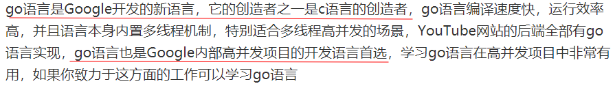

> *Made By Herolh*

------

# 目录 {#index}

[TOC]


------

## GO 语言初步了解

### 什么是Go

> Go is an open source programming language that makes it easy to build simple, reliable, and efficient software.

这是[Go官网](https://link.jianshu.com?t=https://golang.org/)对Go的定义，翻译过来就是：Go是一门开源的编程语言，Go让编写简洁、可依赖和高效的软件变得简单。

Go是2007年在Google被发明的，2012年3月28日发布了1.0版本，现在已更新到1.8版本了。发明人中就有程序员的男神[Ken Thompson](https://link.jianshu.com?t=http://www.computerhistory.org/fellowawards/hall/ken-thompson/)，他在1969年和[Dennis Ritchie ](https://link.jianshu.com?t=https://en.wikipedia.org/wiki/Dennis_Ritchie)一起设计和实现了Unix操作系统。


### Go适合做什么？为何这么多人偏爱Go语言？

<https://studygolang.com/articles/18151?fr=sidebar>


&emsp;&emsp;从 TIOBE 给出的2017年5月编程语言排名来看，Go是增长最快的语言，一年内+1.83%并且从42名提升至16名。
&emsp;&emsp;2012年，七牛就已经在用了，核心系统也是用Go实现，七牛的创始人许世伟是Go在国内的布道者。现在国内用Go的不少，看到BAT某部门的后台开发岗位，要求应聘者有Go开发经验。
&emsp;&emsp;现在很火的微服务的两大基础组件：**Docker 和 Kubernetes都是用Go实现的。**


## 语言特性

Go语言是一门全新的**静态类型开发语言**，这里先给读者罗列一下Go语言最主要的特性：

### 自动垃圾回收

我们可以先看下不支持垃圾回收的语言的资源管理方式，以下为一小段 C++ 语言代码：

```c++
void foo()
{
    char* p = new char[128];
    ... 						// 对p指向的内存块进行赋值
    func1(p); 					// 使用内存指针
    delete[] p;
} 
```

&emsp;&emsp;各种非预期的原因，比如由于开发者的疏忽导致最后的 delete 语句没有被调用，都会引发经典而恼人的内存泄露问题。假如该函数被调用得非常频繁，那么我们观察该进程执行时，会发现该进程所占用的内存会一直疯长，直至占用所有系统内存并导致程序崩溃，而如果泄露的是系统资源的话，那么后果还会更加严重，最终很有可能导致系统崩溃。 
&emsp;&emsp;手动管理内存的另外一个问题就是由于指针的到处传递而无法确定何时可以释放该指针所指向的内存块。假如代码中某个位置释放了内存，而另一些地方还在使用指向这块内存的指针，那么这些指针就变成了所谓的""野指针"(wild pointer)或者“悬空指针”(dangling pointer)，对这些指针进行的任何读写操作都会导致不可预料的后果。
&emsp;&emsp;到目前为止，内存泄露的最佳解决方案是在语言级别引入自动垃圾回收算法(Garbage Collection，简称GC)。所谓垃圾回收，即所有的内存分配动作都会被在运行时记录，同时任何对 该内存的使用也都会被记录，然后垃圾回收器会对所有已经分配的内存进行跟踪监测，一旦发现 有些内存已经不再被任何人使用，就阶段性地回收这些没人用的内存。当然，因为需要尽量最小 化垃圾回收的性能损耗，以及降低对正常程序执行过程的影响，现实中的垃圾回收算法要比这个 复杂得多，比如为对象增加年龄属性等，但基本原理都是如此。
&emsp;&emsp;自动垃圾回收在 C/C++ 社区一直作为一柄双刃剑看待，虽然到 C++11 正式发布时，这个呼声颇高的特性总算是有人发起提案，但按 C++ 之父的说法，由于 C++ 本身过于强大，导致在 C++ 中支持垃圾收集变成了一个困难的工作，这也使得垃圾回收最终与 C++11 无缘。 假如 C++ 支持垃圾收集，以下的代码片段在运行时就会是一个严峻的考验：

```c++
int* p = new int;
p += 10; 				// 对指针进行了偏移，因此那块内存不再被引用
						// …… 这里可能会发生针对这块int内存的垃圾收集 ……
p -= 10; 				// 咦，居然又偏移到原来的位置
*p = 10; 				// 如果有垃圾收集，这里就无法保证可以正常运行了
```

&emsp;&emsp;微软的 C++/CLI 算是用一种偏门的方式让 C++ 程序员们有机会品尝一下垃圾回收功能的鲜美 味道。在 C/C++ 之后出现的新语言，比如 Java 和 C# 等，基本上都已经自带自动垃圾回收功能。 Go语言作为一门新生的开发语言，当然不能忽略内存管理这个问题。又因为Go语言没有C++ 这么“强大”的指针计算功能，因此可以很自然地包含垃圾回收功能。因为垃圾回收功能的支持， 开发者无需担心所指向的对象失效的问题，因此Go语言中不需要 delete 关键字，也不需要 `free()` 方法来明确释放内存。例如，对于以上的这个C语言例子，如果使用Go语言实现，我们就完全不 用考虑何时需要释放之前分配的内存的问题，系统会自动帮我们判断，并在合适的时候( 比如CPU 相对空闲的时候 )进行自动垃圾收集工作。


### 更丰富的内置类型

&emsp;&emsp;除了几乎所有语言都支持的简单内置类型( 比如整型和浮点型等 )外，Go语言也内置了一些比较新的语言中内置的高级类型，比如 C# 和 Java 中的数组和字符串。除此之外，Go语言还内置 了一个对于其他静态类型语言通常用库方式支持的字典类型( map )。Go语言设计者对为什么内 置map这个问题的回答也颇为简单：既然绝大多数开发者都需要用到这个类型，为什么还非要每个人都写一行import语句来包含一个库？这也是一个典型的实战派观点，与很多其他语言的学院派气息迥然不同。
&emsp;&emsp;另外有一个新增的数据类型：数组切片( Slice )。我们可以认为数组切片是一种可动态增长的数组。这几种数据结构基本上覆盖了绝大部分的应用场景。数组切片的功能与C++标准库中的vector非常类似。Go语言在语言层面对数组切片的支持，相比 C++ 开发者有效地消除了反复写以下几行代码的工作量：

```C++
#include <vector>
#include <map>
#include <algorithm>
using namespace std; 
```

&emsp;&emsp;因为是语言内置特性，开发者根本不用费事去添加依赖的包，既可以少一些输入工作量，也 可以让代码看起来尽量简洁。


### 函数多返回值

&emsp;&emsp;目前的主流语言中除 Python 外基本都不支持函数的多返回值功能，不是没有这类需求，可能 是语言设计者没有想好该如何提供这个功能，或者认为这个功能会影响语言的美感。 比如我们如果要定义一个函数用于返回个人名字信息，而名字信息因为包含多个部分——姓氏、名字、中间名和别名，在不支持多返回值的语言中我们有以下两种做法：要么专门定义一个结构体用于返回回，比如：

```C++
struct name
{
 char first_name[20];
 char middle_name[20];
 char last_name[20];
 char nick_name[48];
};
// 函数原型
extern name get_name();
// 函数调用
name n = get_name();
```

或者以传出参数的方式返回多个结果：

```c++
// 函数原型
extern void get_name(
 /*out*/char* first_name,
 /*out*/char* middle_name,
 /*out*/char* last_name,
 /*out*/char* nick_name
);
// 先分配内存
char first_name[20];
char middle_name[20];
char last_name[20];
char nick_name[48];
// 函数调用
get_name(first_name, middle_name, last_name, nick_name); 
```

&emsp;&emsp;Go 语言革命性地在静态开发语言阵营中率先提供了多返回值功能。这个特性让开发者可以 从原来用各种比较别扭的方式返回多个值的痛苦中解脱出来，既不用再区分参数列表中哪几个用于输入，哪几个用于输出，也不用再只为了返回多个值而专门定义一个数据结构。在Go语言中，上述的例子可以修改为以下的样子：

```go
func getName()(firstName, middleName, lastName, nickName string){ 
    return "May", "M", "Chen", "Babe" 
} 
```

&emsp;&emsp;因为返回值都已经有名字，因此各个返回值也可以用如下方式来在不同的位置进行赋值，从 而提供了极大的灵活性： 

```go
func getName()(firstName, middleName, lastName, nickName string){ 
    firstName = "May" 
    middleName = "M" 
    lastName = "Chen" 
    nickName = "Babe" 
    return 
}
```

并不是每一个返回值都必须赋值，没有被明确赋值的返回值将保持默认的空值。而函数的调用相比C/C++语言要简化很多：

```go
fn, mn, ln, nn := getName() 
```

如果开发者只对该函数其中的某几个返回值感兴趣的话，也可以直接用下划线作为占位符来忽略其他不关心的返回值。下面的调用表示调用者只希望接收 lastName 的值，这样可以避免声明完全没用的变量：

```go
_, _, lastName, _ := getName() 
```


### 错误处理

&emsp;&emsp;Go 语言引入了 `defer` 关键字用于标准的错误处理流程，并提供了内置函线 `panic`、`recover` 完成异常的抛出与捕获。整体上而言与C++和Java等语言中的异常捕 获机制相比，Go语言的错误处理机制可以大量减少代码量，让开发者也无需仅仅为了程序安全 性而添加大量一层套一层的try-catch语句。这对于代码的阅读者和维护者来说也是一件很好的。


### 匿名函数和闭包

&emsp;&emsp;在 Go 语言中，所有的函数也是值类型，可以作为参数传递。Go 语言支持常规的匿名函数和 闭包，比如下列代码就定义了一个名为f的匿名函数，开发者可以随意对该匿名函数变量进行传递和调用：

```go
 f := func(x, y int) int { 
     return x + y 
 } 
```


### 类型和接口

&emsp;&emsp;Go语言的类型定义非常接近于C语言中的结构( struct )，甚至直接沿用了 struct 关键字。相比而言，Go语言并没有直接沿袭 C++ 和 Java 的传统去设计一个超级复杂的类型系统，不支持继承和重载，而只是支持了最基本的类型组合功能。 巧妙的是，虽然看起来支持的功能过于简洁，细用起来你却会发现，C++ 和 Java 使用那些复杂的类型系统实现的功能在 Go 语言中并不会出现无法表现的情况，这反而让人反思其他语言中引入这些复杂概念的必要性。我们在第3章中将详细描述Go语言的类型系统。 Go语言也不是简单的对面向对象开发语言做减法，它还引入了一个无比强大的“非侵入式” 接口的概念，让开发者从以往对 C++ 和 Java 开发中的接口管理问题中解脱出来。在 C++ 中，我们 通常会这样来确定接口和类型的关系：

```C++
// 抽象接口
interface IFly
{
 	virtual void Fly()=0;
};
// 实现类
class Bird : public IFly
{
public:
 	Bird(){}
 	virtual ~Bird(){}
public:
 	void Fly()
 	{
 		// 以鸟的方式飞行
 	}
};

void main()
{
 	IFly* pFly = new Bird();
 	pFly->Fly();
 	delete pFly;
}
```

&emsp;&emsp;显然，在实现一个接口之前必须先定义该接口，并且将类型和接口紧密绑定，即接口的修改 会影响到所有实现了该接口的类型，而Go语言的接口体系则避免了这类问题：

```go
type Bird struct {
 	...
}
func (b *Bird) Fly() {
 	// 以鸟的方式飞行
} 
```

&emsp;&emsp;我们在实现 Bird 类型时完全没有任何 IFly 的信息。我们可以在另外一个地方定义这个 IFly 接口： 

```go
type IFly interface { 
    Fly() 
} 
```

这两者目前看起来完全没有关系，现在看看我们如何使用它们： 

```go
func main() { 
    var fly IFly = new(Bird) 
    fly.Fly() 
} 
```

可以看出，虽然Bird类型实现的时候，没有声明与接口 IFly 的关系，但接口和类型可以直 接转换，甚至接口的定义都不用在类型定义之前，这种比较松散的对应关系可以大幅降低因为接 口调整而导致的大量代码调整工作。


### 并发编程

&emsp;&emsp;Go语言引入了 goroutine 概念，它使得并发编程变得非常简单。通过使用 goroutine 而不是裸用操作系统的并发机制，以及使用消息传递来共享内存而不是使用共享内存来通信，Go语言让并 发编程变得更加轻盈和安全。通过在函数调用前使用关键字go，我们即可让该函数以goroutine 方式执行。goroutine 是一种比线程更加轻盈、更省资源的协程。Go 语言通过系统的线程来多路派遣这些函数的执行，使得每个用go关键字执行的函数可以运行成为一个单位协程。当一个协程阻塞的时候，调度器就会自 动把其他协程安排到另外的线程中去执行，从而实现了程序无等待并行化运行。而且调度的开销非常小，一颗CPU调度的规模不下于每秒百万次，这使得我们能够创建大量的 goroutine，从而可以很轻松地编写高并发程序，达到我们想要的目的。 Go语言实现了 CSP( 通信顺序进程，Communicating Sequential Process )模型来作为 goroutine 间的推荐通信方式。在CSP模型中，一个并发系统由若干并行运行的顺序进程组成，每个进程不 能对其他进程的变量赋值。进程之间只能通过一对通信原语实现协作。Go语言用channel( 通道 ) 这个概念来轻巧地实现了CSP模型。channel的使用方式比较接近Unix系统中的管道( pipe )概念， 可以方便地进行跨goroutine的通信。 另外，由于一个进程内创建的所有goroutine运行在同一个内存地址空间中，因此如果不同的 goroutine不得不去访问共享的内存变量，访问前应该先获取相应的读写锁。Go语言标准库中的 sync包提供了完备的读写锁功能。 下面我们用一个简单的例子来演示goroutine和channel的使用方式。这是一个并行计算的例 子，由两个goroutine进行并行的累加计算，待这两个计算过程都完成后打印计算结果：

```go
package main
import "fmt"
func sum(values [] int, resultChan chan int) {
 	sum := 0
 	for _, value := range values {
 		sum += value
 	}
 	resultChan <- sum 						// 将计算结果发送到channel中
}
func main() {
 	values := [] int{1, 2, 3, 4, 5, 6, 7, 8, 9, 10}
 	resultChan := make(chan int, 2)
 	go sum(values[:len(values)/2], resultChan)
 	go sum(values[len(values)/2:], resultChan)
 	sum1, sum2 := <-resultChan, <-resultChan 				// 接收结果
 	fmt.Println("Result:", sum1, sum2, sum1 + sum2)
} 
```


### 反射

反射( reflection )是在Java语言出现后迅速流行起来的一种概念。通过反射，你可以获取对象类型的详细信息，并可动态操作对象。反射是把双刃剑，功能强大但代码可读性并不理想。若非必要，我们并不推荐使用反射。 Go 语言的反射实现了反射的大部分功能，但没有像Java语言那样内置类型工厂，故而无法做到像 Java 那样通过类型字符串创建对象实例。在 Java 中，你可以读取配置并根据类型名称创建对应的类型，这是一种常见的编程手法，但在 Go 语言中这并不被推荐。 反射最常见的使用场景是做对象的序列化( serialization，有时候也叫Marshal & Unmarshal )。 例如，Go语言标准库的 encoding/json、encoding/xml、encoding/gob、encoding/binary 等包就大量依赖于反射功能来实现。 这里先举一个小例子，可以利用反射功能列出某个类型中所有成员变量的值，如代码清单1-2 所示。

```go
package main
import (
 	"fmt"
 	"reflect"
)
type Bird struct { 
	Name string
 	LifeExpectance int
}
func (b *Bird) Fly() {
 	fmt.Println("I am flying...")
}
func main() {
 	sparrow := &Bird{"Sparrow", 3}
 	s := reflect.ValueOf(sparrow).Elem()
 	typeOfT := s.Type()
 	for i := 0; i < s.NumField(); i++ {
 		f := s.Field(i)
 		fmt.Printf("%d: %s %s = %v\n", i, typeOfT.Field(i).Name, f.Type(),
 		f.Interface())
 	}
} 
```

该程序的输出结果为：

```shell
0: Name string = Sparrow 
1: LifeExpectance int = 3 
```


### 语言交互性

&emsp;&emsp;由于 Go 语言与 C 语言之间的天生联系，Go 语言的设计者们自然不会忽略如何重用现有 C 模块的这个问题，这个功能直接被命名为 Cgo。Cgo 既是语言特性，同时也是一个工具的名称。在 Go 代码中，可以按 Cgo 的特定语法混合编写 C 语言代码，然后 Cgo 工具可以将这些混合的 C 代码提取并生成对于 C 功能的调用包装代码。开发者基本上可以完全忽略这个 Go 语言和 C 语言的边界是如何跨越的。 与Java中的 JNI 不同，Cgo 的用法非常简单，比如以下代码就可以实现在Go中调用C语言标准库的puts函数。

```go
package main
/*
#include <stdio.h>
#include <stdlib.h>
*/
import "C"
import "unsafe"
func main() {
 cstr := C.CString("Hello, world")
 C.puts(cstr)
 C.free(unsafe.Pointer(cstr))
}
```


### 为什么一定要学 GO 语言


- <https://zhidao.baidu.com/question/182053969281767444.html>




### Python、Ruby、Go语言哪个更值得学习？

https://www.zhihu.com/question/21480874?sort=created


### GO 语言语法基础

<https://www.runoob.com/go/go-program-structure.html>


## 自己对 GO语言的看法

&emsp;&emsp;Go 语言算是一门新生语言,但是依托google背景和自身高效简洁的优势发展迅速, 目前国内大部分的公司可能没有 python 工程师,但是基本都会招收 go工程师,市场份额占据和与安卓开发差不多，并且会持续增长。因为 GO 语言的高性能，现在只要是个游戏公司或是云提供商就会招收GO工程师。 

&emsp;&emsp;如果说未来的 IT 前景是云计算微服务，那么 Java 的资源占用会是它在云开发上的一只拦路虎，而和 python 的GIL短板使得无法发挥服务器的全部性能，如果在未来很没有优雅解决这两个问题，势必会在未来的工作中造成极大的困扰。而go语言，现在很火的微服务的两大基础组件：Docker 和 Kubernetes都是用Go实现的。基本可以说go 就是为云生态而生的语言。

&emsp;&emsp;如果知道一项技术在未来会成为主流， 那么我们应该从一开始就掌握它，可能现在他的开发生态(各种框架)还比较少，但是随着go语言越来越火,开源社区的参与人数越来越多,人员的交融也会把技术带过来。如果不从知识最少的时候掌握它，还要等到什么时候？