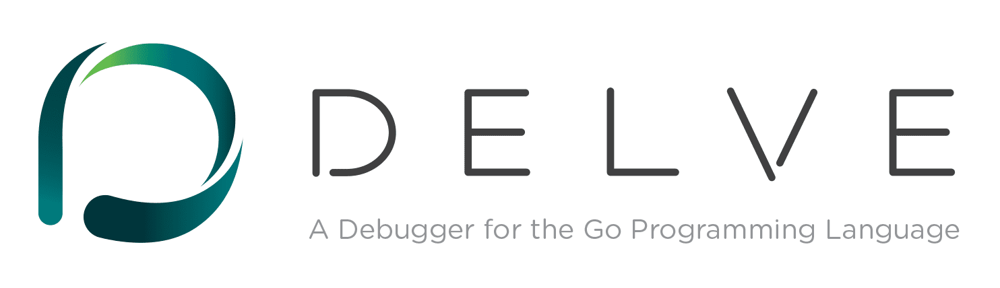

----------------------------------------------
> *Made By Herolh*
----------------------------------------------

# delve 基本使用 {#index}

[TOC]

 

--------------------------------------------

## 文档版本

|    时间    | 修改人 | 内容     |
| :--------: | :----: | :------- |
| 2021-12-08 | Herolh | 文档创建 |
|            |        |          |

## 简介

&emsp;&emsp;一款 Go 语言的调试工具。如果你还在像我一样用 `fmt.Println` 调试 go 的代码，就试试这个工具吧。万星的开源项目可不是开玩笑的，它上手简单并且支持多种方式调用，助你快速找到 Bug。

[Github 地址](https://github.com/go-delve/delve)