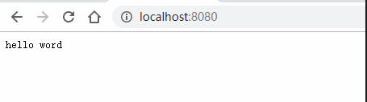
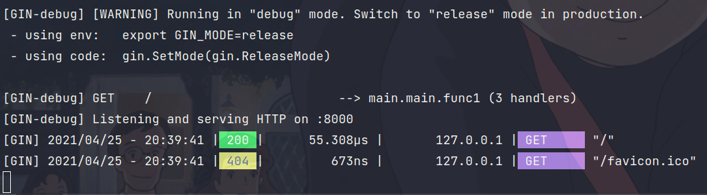
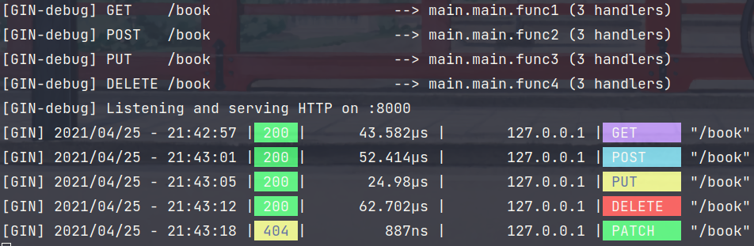

----------------------------------------------
> *Made By Herolh*
----------------------------------------------

# gin 框架基本使用 {#index}

[TOC]


--------------------------------------------

## 简介

- Gin 是一个 golang 的微框架，封装比较优雅，API 友好，源码注释比较明确，具有快速灵活，容错方便等特点。
- 对于 golang 而言，web 框架的依赖要远比 Python，Java 之类的要小。自身的 `net/http` 足够简单，性能也非常不错。
- 借助框架开发，不仅可以省去很多常用的封装带来的时间，也有助于团队的编码风格和形成规范。


### 教程

- [ Gin Web Framework](https://gin-gonic.com/zh-cn/)
- [gin 框架中文文档](http://topgoer.com/gin%E6%A1%86%E6%9E%B6/)
- [李文周的博客 - Gin 框架介绍及使用](https://liwenzhou.com/posts/Go/Gin_framework/)


### 安装

&emsp;&emsp;要安装 Gin 软件包，您需要安装 Go 并首先设置 Go 工作区。首先需要安装 Go（需要 1.10 + 版本），然后可以使用下面的 Go 命令安装 Gin。

```shell
go get -u github.com/gin-gonic/gin
```

将其导入您的代码中：

```shell
import "github.com/gin-gonic/gin"
```

（可选）导入 net/http。例如，如果使用常量，则需要这样做 `http.StatusOK`。

```go
import "net/http"
```


### hello word

```go
package main

import (
    "net/http"

    "github.com/gin-gonic/gin"f
)

func main() {
    // 1.创建路由
   r := gin.Default()
   // 2.绑定路由规则，执行的函数
   // gin.Context，封装了request和response
   r.GET("/", func(c *gin.Context) {
      c.String(http.StatusOK, "hello World!")
   })
   // 3.监听端口，默认在8080
   // Run("里面不指定端口号默认为8080") 
   r.Run(":8000")
}
```






## 路由管理

- gin 框架中采用的路由库是基于 httprouter 做的，地址为：https://github.com/julienschmidt/httprouter


### RESTful API

&emsp;&emsp;REST 与技术无关，代表的是一种软件架构风格，REST 是 Representational State Transfer 的简称，中文翻译为 “表征状态转移” 或 “表现层状态转化”。推荐阅读[阮一峰 理解 RESTful 架构](http://www.ruanyifeng.com/blog/2011/09/restful.html)

&emsp;&emsp;简单来说，REST 的含义就是客户端与 Web 服务器之间进行交互的时候，使用 HTTP 协议中的 8 个请求方法代表不同的动作。只要 API 程序遵循了 REST 风格，那就可以称其为 RESTful API。目前在前后端分离的架构中，前后端基本都是通过 RESTful API 来进行交互。例如，我们现在要编写一个管理书籍的系统，我们可以查询对一本书进行查询、创建、更新和删除等操作，我们在编写程序的时候就要设计客户端浏览器与我们 Web 服务端交互的方式和路径。按照经验我们通常会设计成如下模式：

| 请求方法 |     URL      |     含义     |
| :------: | :----------: | :----------: |
|   GET    |    /book     | 查询书籍信息 |
|   POST   | /create_book | 创建书籍记录 |
|   POST   | /update_book | 更新书籍信息 |
|   POST   | /delete_book | 删除书籍信息 |

同样的需求我们按照 RESTful API 设计如下：

| 请求方法 |  URL  |     含义     |
| :------: | :---: | :----------: |
|   GET    | /book | 查询书籍信息 |
|   POST   | /book | 创建书籍记录 |
|   PUT    | /book | 更新书籍信息 |
|  DELETE  | /book | 删除书籍信息 |

Gin 框架支持开发 RESTful API 的开发:

```go
func main() {
	r := gin.Default()
	r.GET("/book", func(c *gin.Context) {
		c.JSON(200, gin.H{
			"message": "GET",
		})
	})

	r.POST("/book", func(c *gin.Context) {
		c.JSON(200, gin.H{
			"message": "POST",
		})
	})

	r.PUT("/book", func(c *gin.Context) {
		c.JSON(200, gin.H{
			"message": "PUT",
		})
	})

	r.DELETE("/book", func(c *gin.Context) {
		c.JSON(200, gin.H{
			"message": "DELETE",
		})
	})
}
```




## Gin 渲染

### HTML 渲染

&emsp;&emsp;我们首先定义一个存放模板文件的 `templates` 文件夹，然后在其内部按照业务分别定义一个 `posts` 文件夹和一个 `users` 文件夹。 `posts/index.html` 文件的内容如下：


