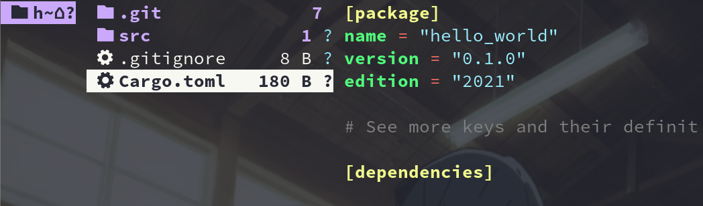

----------------------------------------------
> *Made By Herolh*
----------------------------------------------

# Rust 基础知识 {#index}

[TOC]


 


--------------------------------------------

## 文档版本

|    时间    | 修改人 | 内容     |
| :--------: | :----: | :------- |
| 2022-02-15 | Herolh | 文档创建 |
|            |        |          |


## 你可能想知道的

- [Discord：为什么我们从 Go 切换到 Rust](https://markdowner.net/article/170278545065926656)


## 简介


## 教程

- [官方中文文档](https://kaisery.github.io/trpl-zh-cn/)
- [官方学习教程](https://www.rust-lang.org/zh-CN/learn)


## Hello World

&emsp;&emsp;当学习一门新语言的时候，使用该语言在屏幕上打印 `Hello, world!` 是一项传统，我们将沿用这一传统！


### 创建项目目录

&emsp;&emsp;Rust 并不关心代码的存放位置，不过对于本书的练习和项目来说，我们建议你在 home 目录中创建 *projects* 目录，并将你的所有项目存放在这里。


### 编写并运行 Rust 程序

&emsp;&emsp;新建一个源文件，命名为 `main.rs`。Rust 源文件总是以 `.rs` 扩展名结尾。如果文件名包含多个单词，使用下划线分隔它们。例如命名为 `hello_world.rs`，而不是 `helloworld.rs`。

```rust
fn main() {
    println!("Hello, world!");
}
```

- `main` 函数是一个特殊的函数：

    > 在可执行的 Rust 程序中，它总是最先运行的代码。
    > 第一行代码声明了一个叫做 `main` 的函数，它没有参数也没有返回值。如果有参数的话，它们的名称应该出现在小括号中，`()`。

- `println!` 调用了一个 Rust 宏（macro）。

    > 如果是调用函数，则应输入 `println`（没有`!`）。我们将在后续详细讨论宏。现在你只需记住，当看到符号 `!` 的时候，就意味着调用的是宏而不是普通函数，并且**宏并不总是遵循与函数相同的规则。**


保存文件，并回到终端窗口，输入如下命令，编译并运行文件：

```shell
rustc main.rs
./main
# 在 Windows 上，输入命令 .\main.exe，而不是 ./main
```


### 编译和运行

Rust 是一种 **预编译静态类型**（*ahead-of-time compiled*）语言，在运行 Rust 程序之前，必须先使用 Rust 编译器编译它，即输入 `rustc` 命令并传入源文件名称，如下：

```shell
rustc main.rs
```

在 Linux、macOS 或 Windows 的 PowerShell 上，在 shell 中输入 `ls` 命令可以看见这个可执行文件。在 Linux 和 macOS，你会看到两个文件。在 Windows PowerShell 中，你会看到同使用 CMD 相同的三个文件。

```shell
ls
main  main.rs
```

在 Windows 的 CMD 上，则输入如下内容：

```shell
dir /B
main.exe
main.pdb 			# 包含调试信息、扩展名为 .pdb 的文件
main.rs  			# .rs 的源文件
```

仅仅使用 `rustc` 编译简单程序是没问题的，不过随着项目的增长，你可能需要管理你项目的方方面面，并让代码易于分享。接下来，我们要介绍一个叫做 Cargo 的工具，它会帮助你编写真实世界中的 Rust 程序。


## Cargo

&emsp;&emsp;Cargo 是 Rust 的构建系统和包管理器。它可以为你处理很多任务，比如构建代码、下载依赖库并编译这些库。

```shell
cargo --version
```

如果你看到了版本号，说明已安装！如果看到类似 `command not found` 的错误，你应该查看相应安装文档以确定如何单独安装 Cargo。


### 使用 Cargo 创建项目

使用 Cargo 创建一个新项目：

```shell
cargo new hello_world
cd hello_cargo
```

新建了一个项目名为 hello_world，同时 Cargo 在一个同名目录中创建项目文件。进入 hello_world 目录并列出文件。将会看到 Cargo 生成了两个文件和一个目录：一个 `Cargo.toml` 文件，一个 src 目录，以及位于 src 目录中的 `main.rs` 文件。

这也会在 hello_world 目录初始化了一个 git 仓库，以及一个 `.gitignore` 文件。如果在一个已经存在的 git 仓库中运行 `cargo new`，则这些 git 相关文件则不会生成；可以通过运行 `cargo new --vcs=git` 来覆盖这些行为。



Cargo 期望源文件存放在 *src* 目录中。项目根目录只存放 README、license 信息、配置文件和其他跟代码无关的文件。使用 Cargo 帮助你保持项目干净整洁，一切井井有条。


#### 注意

- 项目名不能以数字开头


### 初始 Cargo.toml

文件使用 [*TOML*](https://toml.io/) (*Tom's Obvious, Minimal Language*) 格式，这是 Cargo 配置文件的格式。

```toml
# 片段标题，表明下面的语句用来配置一个包。随着我们在这个文件增加更多的信息，还将增加其他片段。
[package] 
# 接下来的三行设置了 Cargo 编译程序所需的配置：项目的名称、项目的版本以及要使用的 Rust 版本
name = "hello_world"
version = "0.1.0"
edition = "2021"

# See more keys and their definitions at https://doc.rust-lang.org/cargo/reference/manifest.html

# 项目依赖
[dependencies]

```


### 构建并运行 Cargo 项目

```shell
cargo build
```

>    Compiling hello_cargo v0.1.0 (file:///projects/hello_cargo)    Finished dev [unoptimized + debuginfo] target(s) in 2.85 secs

这个命令会创建一个可执行文件 `target/debug/hello_cargo`，而不是放在目前目录下。可以通过这个命令运行可执行文件：

```shell
./target/debug/hello_cargo
```

首次运行 `cargo build` 时，也会使 Cargo 在项目根目录创建一个新文件：`Cargo.lock`。这个文件记录项目依赖的实际版本。这个项目并没有依赖，所以其内容比较少。你自己永远也不需要碰这个文件，让 Cargo 处理它就行了。

我们刚刚使用 `cargo build` 构建了项目，并使用 `./target/debug/hello_cargo` 运行了程序，也可以使用 `cargo run` 在一个命令中同时编译并运行生成的可执行文件：

```shell
cargo run
```

Cargo 还提供了一个叫 `cargo check` 的命令。该命令快速检查代码确保其可以编译，但并不产生可执行文件：

```shell
cargo check
```

为什么你会不需要可执行文件呢？通常 `cargo check` 要比 `cargo build` 快得多，因为它省略了生成可执行文件的步骤。如果你在编写代码时持续的进行检查，`cargo check` 会加速开发！为此很多 Rustaceans 编写代码时定期运行 `cargo check` 确保它们可以编译。当准备好使用可执行文件时才运行 `cargo build`。


### 发布构建

当项目最终准备好发布时，可以使用 `cargo build --release` 来优化编译项目。这会在 `target/release` 而不是 `target/debug` 下生成可执行文件。这些优化可以让 Rust 代码运行的更快，不过启用这些优化也需要消耗更长的编译时间。这也就是为什么会有两种不同的配置：一种是为了开发，你需要经常快速重新构建；另一种是为用户构建最终程序，它们不会经常重新构建，并且希望程序运行得越快越好。如果你在测试代码的运行时间，请确保运行 `cargo build --release` 并使用 `target/release` 下的可执行文件进行测试。


## 变量与可变性

### 不可变的变量

==变量默认是不可改变的。==

> 这是 Rust 提供给你的众多优势之一，让你得以充分利用 Rust 提供的安全性和简单并发性来编写代码。不过，你仍然可以使用可变变量。

```shell
fn main() {
    let x = 5;
    println!("The value of x is: {}", x);
    x = 6;
    println!("The value of x is: {}", x);
}
```

保存并使用 `cargo run` 运行程序。应该会看到一条错误信息，如下输出所示：

> cargo run
>    Compiling variables v0.1.0 (file:///projects/variables)
> error[E0384]: cannot assign twice to immutable variable `x`
>  --> src/main.rs:4:5
>   |
> 2 |     let x = 5;
>   |         -
>   |         |
>   |         first assignment to `x`
>   |         help: consider making this binding mutable: `mut x`
> 3 |     println!("The value of x is: {}", x);
> 4 |     x = 6;
>   |     ^^^^^ cannot assign twice to immutable variable
>
> For more information about this error, try `rustc --explain E0384`.
> error: could not compile `variables` due to previous error

错误信息指出错误的原因是 **不能对不可变变量 x 二次赋值**（`cannot assign twice to immutable variable `x` `），因为你尝试对不可变变量 `x` 赋第二个值。

为什么要这么处理？

> 在尝试改变预设为不可变的值时，产生编译时错误是很重要的，因为这种情况可能导致 bug。如果一部分代码假设一个值永远也不会改变，而另一部分代码改变了这个值，第一部分代码就有可能以不可预料的方式运行。不得不承认这种 bug 的起因难以跟踪，尤其是第二部分代码只是 **有时** 会改变值。
> Rust 编译器保证，如果声明一个值不会变，它就真的不会变，所以你不必自己跟踪它。这意味着你的代码更易于推导。


### 可变变量

你可以在变量名之前加 `mut` 来使其可变。`mut` 也向读者表明了其他代码将会改变这个变量值的意图。

```shell
fn main () {
    let mut x = 5;
    println!("The value of x is {}", x);
    x = 6;
    println!("The value of x is {}", x);
}
```

> $ cargo run
>    Compiling variables v0.1.0 (file:///projects/variables)
>     Finished dev [unoptimized + debuginfo] target(s) in 0.30s
>      Running `target/debug/variables`
> The value of x is: 5
> The value of x is: 6

通过 `mut`，允许把绑定到 `x` 的值从 `5` 改成 `6`。
除了防止出现 bug 外，还有很多地方需要权衡取舍。例如，使用大型数据结构时，适当地使用可变变量，可能比复制和返回新分配的实例更快。对于较小的数据结构，总是创建新实例，采用更偏向函数式的编程风格，可能会使代码更易理解，为可读性而牺牲性能或许是值得的。


## 提出问题

rust 为什么更加安全?

rust 性能如何?为什么性能好?

rust 得变量为什么不可变?


