----------------------------------------------
> *Made By Herolh*
----------------------------------------------

# Elastic Search 基础使用 {#index}

[TOC]


--------------------------------------------

## 预备知识
### 教程

[bilibili - 狂神说 - ElasticSearch7.6.x 最新完整教程通俗易懂](https://www.bilibili.com/video/BV17a4y1x7zq)
[知乎 - 狂神说 ElasticSearch 学习笔记 + 补充](https://zhuanlan.zhihu.com/p/268065286)
[CSDN - 狂神说 ElasticSearch 入门（最全笔记）](https://blog.csdn.net/qq_21197507/article/details/115076913)

- CSDN - [小 Wang_start](https://blog.csdn.net/qq_22155255) - 狂神说 ElasitcSearch 笔记

    > [狂神说 ElasitcSearch 笔记（一）](https://blog.csdn.net/qq_22155255/article/details/110572762#t9)
    > [ElasticSearch 学习笔记（二）](https://blog.csdn.net/qq_22155255/article/details/110673236?)
    > [ElasticSearch 完结篇 ------ 京东搜索实战](https://blog.csdn.net/qq_22155255/article/details/110917773)


### 基石 Lucene

&emsp;&emsp;Doug Cutting 是一位美国工程师，他做了一个用于文本搜索的函数库，命名为 Lucene。**Lucene** 是用 java 写的，目标是为各种中小型应用软件加入全文搜索功能。
&emsp;&emsp;==Lucene 是一套信息检索工具包，并不包含搜索引擎系统==，它包含了索引结构、读写索引工具、相关性工具、排序等功能。因此在使用 Lucenen 时仍需关注搜索引擎系统，例如数据获取、解析、分词等方面的东西。
&emsp;&emsp;该项目早期被发布在 Doug Cutting 的个人网站，后来成为了 Apache 软件基金会 jakarta 项目的一个子项目。后来在 Lucene 的基础上开发了一款可以代替当时的主流搜索的开源搜索引擎，命名为 Nutch.


&emsp;&emsp;**Nutch** 是一个建立在 Lucene 核心之上的网页搜索应用程序，它在 Lucene 的基础上加了爬虫和一些网页相关的功能，目的就是从一个简单的站内检索推广到全球网络上的搜索上。随着时间的推移，作为互联网搜索引擎，都面临对象 "体积" 不断增大的问题。需要存储大量的网页，并不断优化自己的搜索算法，提升搜索效率。<u>大数据的两个问题: 存储 + 计算!</u>

&emsp;&emsp;在 2003 年， google 发表了一篇技术学术论文，公开介绍了自己的 google 文件系统 **GFS( Google File System )**。这是 google 公司为了==存储==海量搜索数据而设计出来的专用文件系统。


&emsp;&emsp;在 2004 年，Doug Cutting 基于 Google 的 GFS 论文实现了分布式文件存储系统，并将它命名为 **NDFS(Nutch Distributed File System)**。同年 google 又发表了一篇技术学术论文， 介绍自己的 **MapReduce 编程模型**，这个编程模型，用于大规模数据集( 1TB )的并行分析==运算==。


&emsp;&emsp;在 2005 年 Doug Cutting 基于 Google 的 MapReduce 在 Nutch 上实现了该功能。


&emsp;&emsp;在 2006 年 Doug Cutting  加入了雅虎，将 NDFS 和 MapReduce 进行了改造，并重新命名为 **Hadoop** (NDFS 也改名为 HDFS,Hadoop Distributed File System)* 这就是大名鼎鼎的大数据框架系统 Hadoop 的由来，而 Doug Cutting 则被人称为 Hadoop 之父。
&emsp;&emsp;在 2006 同年, Google 发表论文介绍自己的 **BigTable**, 一种分布式素据存储系统，用来处理海量数据的非关系型数据库。Doug Cutting 在自己的 hadoop 系统中，引入了 BigTable ，并命名为 **HBase**。


&emsp;&emsp;在 2008 年1月，Hadoop 正式成为 Apache 基金会的顶级项目。同年 2 月，Yahoo 宣布建成一个拥有 1 万个内核的 Hadoop 集群，并将自己的搜索引擎部署在上面。同年 7 月，Hadoop 打破世界记录，成为最快排序 1 TB数据的系统， 用时 209 秒。


### ElasticSearch 概述

&emsp;&emsp;ElasticSearch, 简称 es，es 是一个==开源的高拓展的分布式全文检索引擎==，它可以近乎实施的存储、检索数据；本身扩展性很好，可以扩展到上百台服务器，处理 PB 级别的数据。es 也==使用 java 开发并使用 Lucene 作为其核心==来实现所有索引和搜索的功能，但是它的目的是<u>通过简单的 RESTful API 来隐藏 Lucene 的复杂性</u>，从而让全文搜索变得简单。


#### 历史

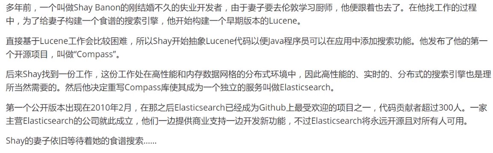


#### 谁在使用

- 维基百科，类似百度百科，全文检索，高亮，搜索推荐
- 国外新闻网站，类似搜狐新闻，用户行为日志（点击，浏览，收藏，评论）+ 社交网络数据，数据分析。。。
- Stack Overflow 国外的程序异常讨论论坛
- GitHub（开源代码管理），搜索上千亿行代码
- 电商网站，检索商品
- 日志数据分析，logstash 采集日志，ES 进行复杂的数据分析，ELK 技术（elasticsearch+logstash+kibana）
- 商品价格监控网站
- 商业智能系统
- 站内搜索


### ES 和 solr 的差别
#### ElasticSearch 简介
&emsp;&emsp;ElasticSearch 是一个实施**分布式搜索**和**分析引擎**。它让你以前所未有的速度**处理大数据**成为可能。它用于**全文搜索、结构化搜索、分析**以及将这三者混合使用：
&emsp;&emsp;es 是一个基于 Apache Lucene (TM) 的开源搜索引擎。无论在开源还是专有领域，Lucene 可以被认为是迄今为止最先进、性能最好、功能最全的搜索引擎库。想要使用它，必须使用 java 来作为开发语言并将其直接继承到你的应用中。
&emsp;&emsp;维基百科使用 es 提供全文搜索并高亮关键字，以及输入实施搜索和搜索纠错等搜索建议功能；英国公报使用 es 结合用户日志和社交网络数据提供给他们的编辑以实施的反馈，以便了解龚总对新发表的文章的回应。。。


#### solr 简介
&emsp;&emsp;Solr 是 Apache 下的一个顶级开源项目，采用 java 开发，是基于 Lucene 的全文搜索服务器。Solr 提供了比 Lucene 更为丰富的查询语言，同时**实现了可配置、可扩展、并对索引、搜索性能进行了优化**, Solr 不提供构建 UI 的功能， 提供了一个管理界面，可以查询配置与运行状况。它**可以独立运行**，是一个独立的企业及搜索应用服务器，它对外提供类似于 web-service 的 API 接口。用户可以通过 http 请求，像搜索引擎服务器提交一定格式的文件，生成索引；也可以通过提出查找请求，并得到返回结果。


#### 两者比较

- **当==单纯==的对==已有数据==进行搜索时，Solr 更快**

    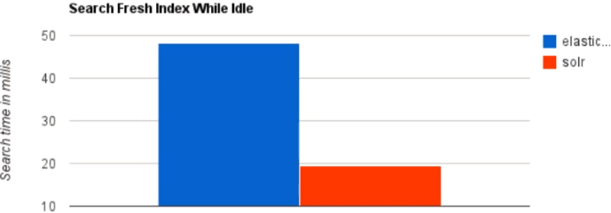

- **当==实时建立索引==时，Solr 会产生 io 阻塞，查询性能较差，ElasticSearch 具有明显的优势**

    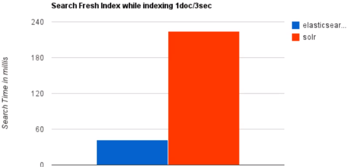

- **随着==数据量的增加==，Solr 的搜索效率会变得更低，而 Elasticsearch 却没有明显的变化**

    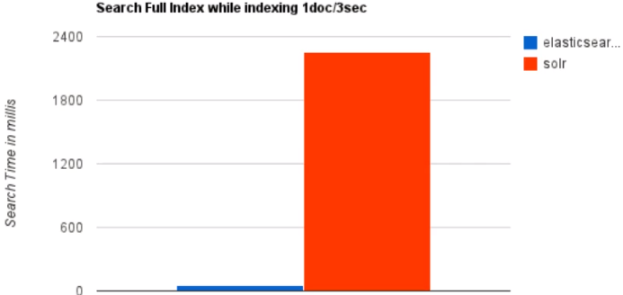


#### 总结

1. ==es 基本是开箱即用==，非常简单。而 solr 会有点复杂。
2. Solr 利用 Zookeeper 进行分布式管理，而 ==elasticsearch 自身带有分布式协调管理功能==
3. **solr 支持更多格式的数据**，比如 json xml csv。而 es 只支持 json 文件格式
4. **solr 官方提供的功能更多**，而 elasticsearch 更注重核心功能，高级功能由第三方插件提供
5. **solr 查询快**，但更新索引时慢( 插入删除慢 )，用于电商等查询多的应用
6. ==es 建立索引快，即实时性查询快==，用于 facebook 新浪等搜索
7. **solr 较成熟**，有一个更大，更成熟的用户、开发和贡献者社区，而 elasticsearch 相对开发维护者较少，更新太快，学习使用成本较高


### 了解 ELK
>  ELK 是 ElasticSearch 、 Logstash、Kibana 三大开源框架首字母大写简称。市面上也称为 Elastic Stack。 

- Elastic search 是一个基于Lucene、分布式、通过 Restful 方式进行交互的近实时搜索平台框架。
- Lostash 是 ELK 的中央数据流，用于从不同目标( 文件/数据存储/MQ ) 收集的不同格式数据，经过过滤后支持输出到不同目的地。 
- Kibana 可以将 elastic 的数据通过友好的页面展示出来，提供实时分析的功能。

&emsp;&emsp;市面上很多开发只要提到 ELK 能够一直说出它是一个日志分析架构技术栈总称，但实际上 **ELK 不仅仅适用于日志分析，它还可以支持其他任何数据分析和收集的场景，日志分析和收集知识更具有代表性**。并非唯一性。

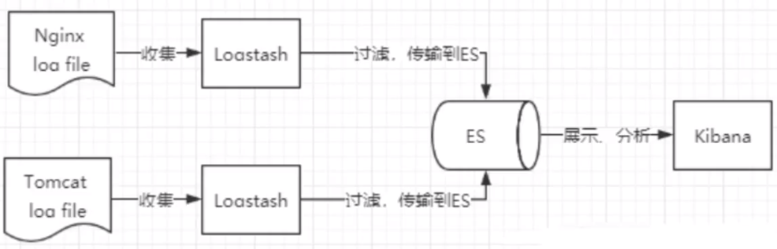


   


## ES 核心概念

ElasticSearch 是==面向文档型==的数据库，一条数据在这里就是一个文档，一切都是 json ，比如：

```shell
{
    "name" :     "John",
    "sex" :      "Male",
    "age" :      25,
    "birthDate": "1990/05/01",
    "about" :    "I love to go rock climbing",
    "interests": [ "sports", "music" ]
}
```

在 MySql 中这样的数据存储容易想到建立一张 User 表，其中有一些字段，而在 es 中就是一个文档，文档会属于一个 User 类型，各种各样的类型存储于一个索引中。下表是关系型数据库和 es 的疏于对照表：

| 关系型数据库 | ElasticSearch | 说明              |
| ------------ | ------------- | ----------------- |
| 数据库       | 索引          | 就和数据库一样    |
| 表           | type          | type 慢慢会被弃用 |
| 行           | document      | 文档              |
| 列           | field         |                   |

es 中可以包含多个索引（数据库），每个索引中可以包含多个类型（表），每个类型下又包含多个文档（行），每个文档又包含多个字段（列）。


### 物理设计：

>  es 在后台把每个索引划分成多个分片，每个分片可以在集群中的不同服务器中转移。

&emsp;&emsp;一个集群至少有一个节点，而一个节点就是一个 es 进程，节点可以有多个索引默认的，如果创建索引，索引将会有 5 个分片( primary shard, 又叫主分片 )构成，每个主分片又会有一个副本( replica shard, 又称复制分片 )

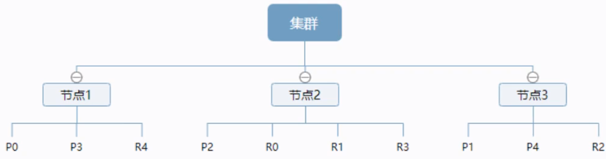

上图是一个有着 3 个节点的集群，可以看到珠峰去和对应的复制分片都不会在同一个节点上( 分库分表 )，这样有利于某个节点挂了，数据也不至于丢失。实际上，==一个分片就是 一个 Lucene 索引==，一个包含倒排索引的文件目录，倒排索引的结构使得 ES 在不扫描全部文档的情况下，就能告诉你那些文档含有特定的关键字。


### 逻辑设计：

一个索引类型，包含多个文档，当我们索引一篇文档时，可以通过这样的顺序找到他： 

```shell
索引  -->  类型  -->  文档id(该 id 实际是个字符串)
```

通过这个组合我们就能索引到某个具体的文档。


#### 索引

> 对应数据库

&emsp;&emsp;索引是映射类型的容器，es 的索引是一个非常大的集合。索引寻出了映射类型的字段和其他设置。然后他们被存储到了各个分片上。

##### elasticsearch 的索引和 Lucene 的索引对比
&emsp;&emsp;在 elasticsearch 中，索引（库）这个词被频繁使用，这就是术语的使用。elasticsearch 中，索引被分为多个分片，每份分片是一个 Lucene 的索引。
&emsp;&emsp;所以==一个 elasticsearch 索引是由多个 Lucene 索引组成的==。别问为什么，谁让 elasticsearch 使用 Lucene 作为底层呢！
如无特指，说起索引都是指 elasticsearch 的索引。


#### 类型

&emsp;&emsp;类型是文档的逻辑容器，就像关系型数据库一样，表格是行的容器。类型中对于字段的定义称为映射，比如 name 映射为 string 类型。我们说文档是无模式的，他们不需要拥有映射中所定义的所有字段，当新增加一个字段时，es 会自动的将新字段加入映射，但是这个字段不确定他是什么类型，所以最安全的方式是提前定义好所需要的映射。


#### 文档

> 就是我们的一条条数据，对应数据库表中的行

&emsp;&emsp;es 是面向文档的，意味着索引和搜索数据的最小单位是文档，es 中，文档有几个重要的属性：

- 自我包含，一篇文档同时包含字段和对应的值，也就是同时包含 `key:value`
- 可以是层次性的，一个文档中包含自文档，复杂的逻辑实体就是这么来的。(就是一个 json 对象， fastjson 进行自动转换)
- 灵活的结构，文档不依赖预先定义的模式，我们知道关系型数据库中，要提前定义字段才能使用，在 es 中，对于字段是非常灵活的。有时候，我们可以忽略字段，或者动态的添加一个新的字段

尽管我们可以随意的添加或忽略某个字段，但是，每个字段的类型非常重要。因为 es 会保存字段和类型之间的映射以及其他的设置。这种映射具体到每个映射的每种类型，这也是为什么在 es 中，类型有时候也称为映射类型。


## 倒排索引

> [elasticsearch 狂神说笔记_好文推荐：终于有人把 Elasticsearch 原理讲透](https://blog.csdn.net/weixin_30746795/article/details/112107544)

&emsp;&emsp;elasticsearch 使用的是一种称为倒排索引的结构，采用 ==Lucene 倒排索作为底层==。这种结构适用于快速的全文搜索，==一个索引由文档中所有不重复的列表构成== , 对于每一个词，都有一个包含它的文档列表。例如，现在有两个文档，每个文档包含如下内容:

```shell
Study every day, good good up to forever	# 文档1包含的内容
To forever,study every day,good good up 	# 文档2包含的内容
```

&emsp;&emsp;为了创建倒排索引，我们**首先要将每个文档拆分成独立的词 (或称为词条或者 tokens)** , 然后创建 一个包含所有不重复的词条的排序列表 , 然后列出每个词条出现在哪个文档:

| term    | doc_1 | doc_2 |
| ------- | ----- | ----- |
| Study   | √     | ×     |
| To      | ×     | ×     |
| every   | √     | √     |
| forever | √     | √     |
| day     | √     | √     |
| study   | x     | √     |
| good    | √     | √     |
| every   | √     | √     |
| to      | √     | x     |
| up      | √     | √     |

现在，我们试图搜索 to forever , 只需要查看包含每个词条的文档

| term    | doc_1 | doc_2 |
| ------- | ----- | ----- |
| to      | √     | x     |
| forever | √     | √     |
| total   | 2     | 1     |

两个文档都匹配，但是第一个文档比第 二个匹配程度更高。如果没有别的条件，现在，这两个包含关键字的文档都将返回。(**分数 or 权重**)
再来看一个示例，比如我们通过博客标签来搜索博客文章。那么倒排索引列表就是这样的一个结构:

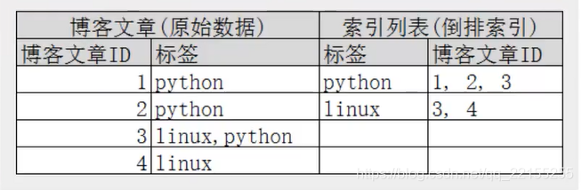

如果要搜索含有 python 标签的文章，那相对于查找所有原始数据而言，查找倒排索引后的数据将会快的多。只需要查看标签这一栏，然后获取相关的文章 ID 即可。


## 插件

### IK 分词器

分词是什么：

&emsp;&emsp;即把一段文字划分成一个个的关键字，我们在搜索时候会把自己的信息进行分词会把数据库中或者索引库中的数据进行分词，然后进行一个匹配操作，默认的中文分词是将每个字看成一个词，比如“你好”,会被分为“你”、“好”， 这显然是不符合要求的，所以我们需要安装中文分词器 ik 来解决这个问题。
&emsp;&emsp;IK 提供了两个分词算法: `ik_smart` 和 `ik_max_word` , ==其中 `ik_smart` 为最少切分 , `ik_max_word` 为最细粒度划分== !


#### 使用 kibana 测试分词算法

##### `ik smart` 最少切分

```shell
GET _analyze
{
  "analyzer": "ik_smart",
  "text": "中国共产党"
}
```

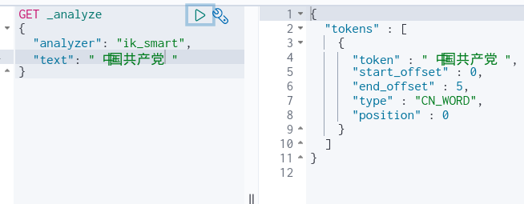


##### `ik_max_word` 最细粒度划分

> 穷尽词库的可能

```shell
GET _analyze
{
  "analyzer": "ik_max_word",
  "text": "中国共产党"
}
```

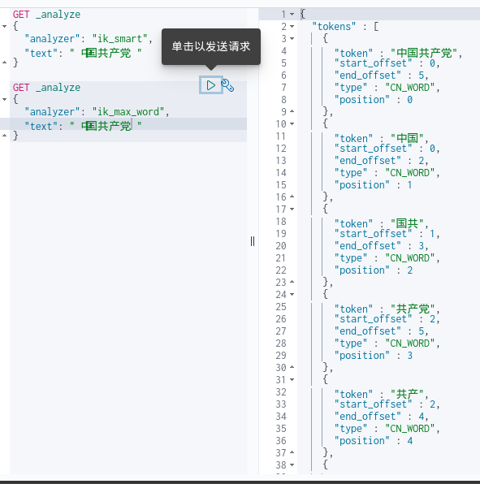


#### ik 分词器增加自己的配置

- 在我们的 ik 分词器的目录下有 `IKAnalyzer.cfg.xml`, 里面可以配置我们自己的字典， 如果是通过插件管理器下载的会在 es 的config 目录下

    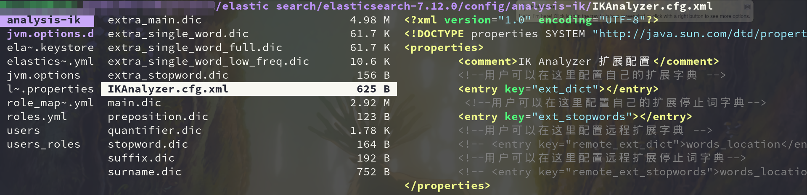

- 先编写一个自己的字典，我这里就写了一个 `myself.dic`，将 `狂神说` 当成一个词

    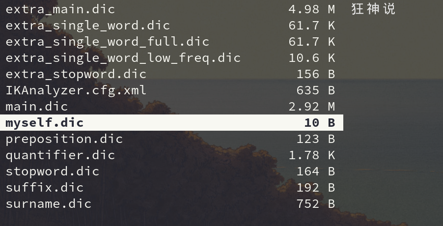

- 然后在我们的 `IKAnalyzer.cfg.xml` 中导入我们自己的字典：

    ```xml
    <!--用户可以在这里配置自己的扩展字典 -->
    <entry key="ext_dict">kuang.dic</entry>
    ```

    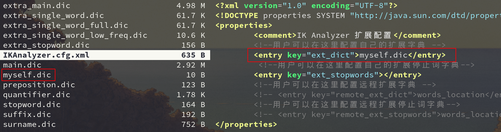

- 重启 es 即可

    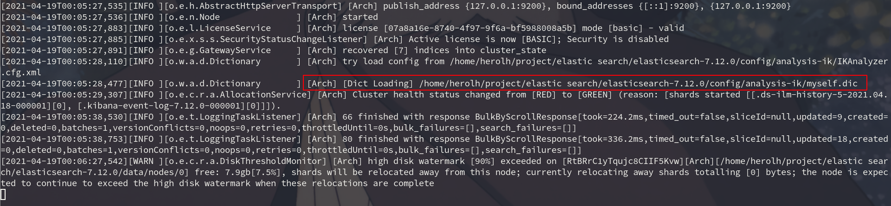


## Rest 风格说明

> 一种软件架构风格，并不是标准，只是提供一组设计原则和约束条件。主要用于客户端和服务端交互类的软件。基于这个风格设计的软件可以更简洁，更有层次，更易于实现缓存等机制。

基本 Rest 命令说明：


| method | url 地址                                        | 描述                    |
| ------ | ----------------------------------------------- | ----------------------- |
| PUT    | localhost:9200/索引名称/类型名称/文档id         | 创建文档(  指定文档id ) |
| POST   | localhost:9200/索引名称/雷池年名称              | 创建文档(  指定文档id ) |
| POST   | localhost:9200/索引名称/类型名称/文档id/_update | 修改文档                |
| DELETE | localhost:9200/索引名称/类型名称/文档id         | 删除文档                |
| GET    | localhost:9200/索引名称/类型名称/文档id         | 查询文档通过文档id      |
| POST   | localhost:9200/索引名称/类型名称/_search        | 查询所有数据            |


### 索引的基本操作

#### 创建索引

```shell
put /索引名(数据库名)/类型名(以后会弃用)/文档id
{
	请求体
}
```

```shell
put /test1/type1/1
{
  "name":"小狂神",
  "age":20
}

# 返回结果：
#! Deprecation: [types removal] Specifying types in document index requests is deprecated, use the typeless endpoints instead (/{index}/_doc/{id}, /{index}/_doc, or /{index}/_create/{id}).
{
  "_index" : "test1",		# 数据库名字
  "_type" : "type1",		# 类型
  "_id" : "1",				# 文档id
  "_version" : 1,			# 版本没有被修改过
  "result" : "created",		# 创建好了
  "_shards" : {
    "total" : 2,
    "successful" : 1,
    "failed" : 0
  },
  "_seq_no" : 0,
  "_primary_term" : 1
}
```

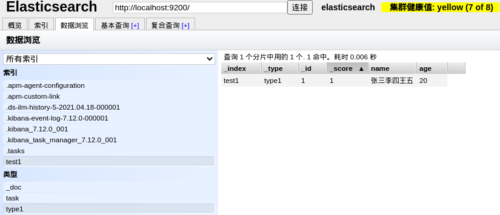


#### 数据类型

- 字符串类型

    text，keyword

- 数值类型	

    long、integer、short、byte、double、float、half_float、scaled_float

- 日期类型

    date

- 布尔值类型

    boolean

- 二进制类型

    binary

- ……


##### 指定字段的类型( 创建规则 )

> 如果我们的字段没有指定，那么 es 就会给我们默认配置字段类型

```shell
PUT /test2
{
  "mappings": {
    "properties": {
      "name":{
        "type": "text"
      },
      "age":{
        "type": "long"
      },
      "birthday":{
        "type": "date"
      }
    }
  }
}

# 返回结果
{
  "acknowledged" : true,
  "shards_acknowledged" : true,
  "index" : "test2"
}
```

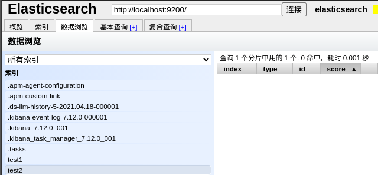


#### 获得索引信息

##### 查看指定类型的索引信息

```shell
GET /test2

# 返回结果：
{
  "test2" : {
    "aliases" : { },
    "mappings" : {
      "properties" : {
        "age" : {
          "type" : "long"
        },
        "birthday" : {
          "type" : "date"
        },
        "name" : {
          "type" : "text"
        }
      }
    },
    "settings" : {
      "index" : {
        "routing" : {
          "allocation" : {
            "include" : {
              "_tier_preference" : "data_content"
            }
          }
        },
        "number_of_shards" : "1",
        "provided_name" : "test2",
        "creation_date" : "1618764411567",
        "number_of_replicas" : "1",
        "uuid" : "2cY9b_8aRNmqnSoqOA0D4w",
        "version" : {
          "created" : "7120099"
        }
      }
    }
  }
}

```


##### 查看默认类型的索引信息

```shell
# 创建一个索引， _doc 是默认类型，可以省略
PUT /test3/_doc/1
{
  "name":"test",
  "age":3,
  "birth":"2000-04-01"
}

# 获取索引信息
GET test3

# 返回结果
{
  "tes3" : {
    "aliases" : { },
    "mappings" : {
      "properties" : {
        "age" : {
          "type" : "long"
        },
        "birth" : {
          "type" : "date"
        },
        "name" : {
          "type" : "text",
          "fields" : {
            "keyword" : {
              "type" : "keyword",
              "ignore_above" : 256
            }
          }
        }
      }
    },
    "settings" : {
      "index" : {
        "routing" : {
          "allocation" : {
            "include" : {
              "_tier_preference" : "data_content"
            }
          }
        },
        "number_of_shards" : "1",
        "provided_name" : "test3",
        "creation_date" : "1618764858776",
        "number_of_replicas" : "1",
        "uuid" : "uWk2Ba9sTBOU2ajnc6gW3Q",
        "version" : {
          "created" : "7120099"
        }
      }
    }
  }
}
```


##### 查看其他信息

- 查看我们的健康值，yellow状态

    ```shell
    GET _cat/health
    
    # 返回结果
    1618839079 13:31:19 elasticsearch yellow 1 1 10 10 0 0 3 0 - 76.9%
    ```

- 查看具体信息(数据库等等)

    ```shell
    GET _cat/indices?v
    
    # 返回结果
    health status index                           uuid                   pri rep docs.count docs.deleted store.size pri.store.size
    yellow open   test2                           2cY9b_8aRNmqnSoqOA0D4w   1   1          0            0       208b           208b
    green  open   .kibana_task_manager_7.12.0_001 JuBO9qzqTZu_9jUX4K99mg   1   0          9          257    213.3kb        213.3kb
    green  open   .apm-custom-link                x3X9jL6bT5azSTGhTRgznw   1   0          0            0       208b           208b
    green  open   .apm-agent-configuration        KBhfIgVAS_2QR5LBHX-FKA   1   0          0            0       208b           208b
    yellow open   tes3                            uWk2Ba9sTBOU2ajnc6gW3Q   1   1          1            0      4.3kb          4.3kb
    yellow open   test1                           kVMkxCeOQn6yCNzDNGgDYA   1   1          1            0      4.1kb          4.1kb
    green  open   .kibana_7.12.0_001              B06vhxnvSV2IuDFnS-GovA   1   0         32           20      4.2mb          4.2mb
    green  open   .kibana-event-log-7.12.0-000001 ZHghL9YnQrG2zI2BMW6fiw   1   0          8            0     43.4kb         43.4kb
    green  open   .tasks                          ql2wFdsSRYud6u-gM11loA   1   0         10            0     67.8kb         67.8kb
    ```

    

#### 修改索引信息

##### 覆盖修改 PUT

> 如果漏了一行数据，那行数据原来的值会被空覆盖( 数据没了 )

```shell
PUT /tes3/_doc/1
{
  "name":"test_update",
  "age":3,
  "birth":"2000-04-01"
}

# 结果
{
  "_index" : "tes3",
  "_type" : "_doc",
  "_id" : "1",
  "_version" : 2,							# 修改的话版本会增加
  "result" : "updated",						# 状态
  "_shards" : {
    "total" : 2,
    "successful" : 1,
    "failed" : 0
  },
  "_seq_no" : 1,
  "_primary_term" : 2
}

```


##### 更新修改

```shell
POST /tes3/_doc/1/_update
{
  "doc":{									# #doc表示你要修改的文档
    "name":"法外狂徒张三"
  }
}


# 返回结果
{
  "_index" : "tes3",
  "_type" : "_doc",
  "_id" : "1",
  "_version" : 3,							# 再次加一
  "result" : "updated",				
  "_shards" : {
    "total" : 2,
    "successful" : 1,
    "failed" : 0
  },
  "_seq_no" : 2,
  "_primary_term" : 2
}
```


#### 删除索引

- 删除 test1 索引

    ```shell
    DELETE tes1
    
    # 返回结果
    {
      "acknowledged" : true
    }
    ```

- 删除 test2 索引下的文档编号为 1 的数据

    ```shell
    DELETE tes2/_doc/1
    
    # 返回结果
    {
      "_index" : "test2",
      "_type" : "_doc",
      "_id" : "1",
      "_version" : 2,
      "result" : "deleted",
      "_shards" : {
        "total" : 2,
        "successful" : 1,
        "failed" : 0
      },
      "_seq_no" : 1,
      "_primary_term" : 2
    }
    
    ```

    


### 文档的基本操作

#### 添加数据

```json
PUT /wang/user/1
{
  "name":"小王",
  "age":23,
  "desc":"一顿操作猛如虎，一看工资2500",
  "tags":["技术宅","帅气","宅男"]
}
```


#### 更新数据

##### 覆盖修改 PUT

> 如果漏了一行数据，那行数据原来的值会被空覆盖( 数据没了 )

```shell
PUT /wang/user/3
{
  "name":"上海名媛婉儿",
  "age":20,
  "desc":"上海名媛",
  "tags":["靓女","名媛","渣女"]
}
```


##### 更新修改

> put 不传值的地方被空值覆盖，使用 _update 可以避免

```shell
POST wang/user/1/_update
{
  "doc":{
    "name":"小王同学"
  }
}
```


#### 查询数据

##### 简单搜索

```shell
GET wang/user/1

# 返回结果
{
  "_index" : "wang",
  "_type" : "user",
  "_id" : "1",
  "_version" : 1,
  "_seq_no" : 0,
  "_primary_term" : 1,
  "found" : true,
  "_source" : {
    "name" : "小王",
    "age" : 23,
    "desc" : "一顿操作猛如虎，一看工资2500",
    "tags" : [
      "技术宅",
      "帅气",
      "宅男"
    ]
  }
}
```


##### 简单的条件搜索

```shell
GET wang/user/_search?q=name:小王同学

# 返回结果
# 小王和王公子都能被搜索出来
{
  "took" : 28,
  "timed_out" : false,
  "_shards" : {
    "total" : 1,
    "successful" : 1,
    "skipped" : 0,
    "failed" : 0
  },
  "hits" : {
    "total" : {
      "value" : 3,
      "relation" : "eq"
    },
    "max_score" : 2.8007593,
    "hits" : [
      {
        "_index" : "wang",
        "_type" : "user",
        "_id" : "4",
        "_score" : 2.8007593,						# 该值为匹配度，多条结果下，匹配度越高分值越大
        "_source" : {
          "name" : "小王学长",
          "age" : 23,
          "desc" : "一顿操作猛如虎，一看工资2500",
          "tags" : [
            "技术宅",
            "帅气",
            "宅男"
          ]
        }
      },
      {
        "_index" : "wang",
        "_type" : "user",
        "_id" : "1",
        "_score" : 1.7781849,
        "_source" : {
          "name" : "小王",
          "age" : 23,
          "desc" : "一顿操作猛如虎，一看工资2500",
          "tags" : [
            "技术宅",
            "帅气",
            "宅男"
          ]
        }
      },
      {
        "_index" : "wang",
        "_type" : "user",
        "_id" : "5",
        "_score" : 0.60040116,
        "_source" : {
          "name" : "王公子",
          "age" : 23,
          "desc" : "一顿操作猛如虎，一看工资2500",
          "tags" : [
            "技术宅",
            "帅气",
            "宅男"
          ]
        }
      }
    ]
  }
}

```


#### 复杂查询

##### match 模糊匹配查询

==match 会使用分词器去解析 (先分析文档，然后在通过分析的文档进行查询)==

```shell
GET wang/user/_search
{
  "query": {
    "match": {	
      "name": "小王"
    }
  }
}

# 搜索结果
# 不带小的也能查询出来， 但是对应的匹配度会较低
{
  "took" : 12,
  "timed_out" : false,
  "_shards" : {
    "total" : 1,
    "successful" : 1,
    "skipped" : 0,
    "failed" : 0
  },
  "hits" : {									# 对象
    "total" : {									# 总量
      "value" : 3,
      "relation" : "eq"							# 匹配相等
    },
    "max_score" : 1.7781849,					# 最高匹配度
    "hits" : [
      {
        "_index" : "wang",
        "_type" : "user",
        "_id" : "1",
        "_score" : 1.7781849,
        "_source" : {
          "name" : "小王",
          "age" : 23,
          "desc" : "一顿操作猛如虎，一看工资2500",
          "tags" : [
            "技术宅",
            "帅气",
            "宅男"
          ]
        }
      },
      {
        "_index" : "wang",
        "_type" : "user",
        "_id" : "4",
        "_score" : 1.4144652,
        "_source" : {
          "name" : "小王学长",
          "age" : 23,
          "desc" : "一顿操作猛如虎，一看工资2500",
          "tags" : [
            "技术宅",
            "帅气",
            "宅男"
          ]
        }
      },
      {
        "_index" : "wang",
        "_type" : "user",
        "_id" : "5",
        "_score" : 0.60040116,
        "_source" : {
          "name" : "王公子",
          "age" : 23,
          "desc" : "一顿操作猛如虎，一看工资2500",
          "tags" : [
            "技术宅",
            "帅气",
            "宅男"
          ]
        }
      }
    ]
  }
}
```


##### _source 查询结果字段过滤 

```json
GET wang/user/_search
{
  "query": {
    "match": {
      "name": "小王"
    }
  },
  "_source": ["name","desc"]		# 结果过滤，只显示我们规定的
}	

# 返回结果
#! [types removal] Specifying types in search requests is deprecated.
{
  "took" : 7,
  "timed_out" : false,
  "_shards" : {
    "total" : 1,
    "successful" : 1,
    "skipped" : 0,
    "failed" : 0
  },
  "hits" : {
    "total" : {
      "value" : 3,
      "relation" : "eq"
    },
    "max_score" : 1.7781849,
    "hits" : [
      {
        "_index" : "wang",
        "_type" : "user",
        "_id" : "1",
        "_score" : 1.7781849,
        "_source" : {
          "name" : "小王",
          "desc" : "一顿操作猛如虎，一看工资2500"
        }
      },
      {
        "_index" : "wang",
        "_type" : "user",
        "_id" : "4",
        "_score" : 1.4144652,
        "_source" : {
          "name" : "小王学长",
          "desc" : "一顿操作猛如虎，一看工资2500"
        }
      },
      {
        "_index" : "wang",
        "_type" : "user",
        "_id" : "5",
        "_score" : 0.60040116,
        "_source" : {
          "name" : "王公子",
          "desc" : "一顿操作猛如虎，一看工资2500"
        }
      }
    ]
  }
}
```


##### sort 查询排序 

```json
GET wang/user/_search
{
  "query": {
    "match": {
      "name": "小王"
    }
  },
  "sort": [					# 根据我们的age年龄排序
    {				
      "age": {
        "order": "asc"		# asc 升序排序, desc 降序排序
      }
    }
  ]
}

# 返回结果
#! [types removal] Specifying types in search requests is deprecated.
{
  "took" : 3,
  "timed_out" : false,
  "_shards" : {
    "total" : 1,
    "successful" : 1,
    "skipped" : 0,
    "failed" : 0
  },
  "hits" : {
    "total" : {
      "value" : 3,
      "relation" : "eq"
    },
    "max_score" : null,
    "hits" : [
      {
        "_index" : "wang",
        "_type" : "user",
        "_id" : "1",
        "_score" : null,
        "_source" : {
          "name" : "小王",
          "age" : 23,
          "desc" : "一顿操作猛如虎，一看工资2500",
          "tags" : [
            "技术宅",
            "帅气",
            "宅男"
          ]
        },
        "sort" : [
          23
        ]
      },
      {
        "_index" : "wang",
        "_type" : "user",
        "_id" : "4",
        "_score" : null,
        "_source" : {
          "name" : "小王学长",
          "age" : 23,
          "desc" : "一顿操作猛如虎，一看工资2500",
          "tags" : [
            "技术宅",
            "帅气",
            "宅男"
          ]
        },
        "sort" : [
          23
        ]
      },
      {
        "_index" : "wang",
        "_type" : "user",
        "_id" : "5",
        "_score" : null,
        "_source" : {
          "name" : "王公子",
          "age" : 23,
          "desc" : "一顿操作猛如虎，一看工资2500",
          "tags" : [
            "技术宅",
            "帅气",
            "宅男"
          ]
        },
        "sort" : [
          23
        ]
      }
    ]
  }
}

```


##### 分页查询

```json
GET wang/user/_search
{
  "query": {
    "match": {
      "name": "小王"
    }
  },
  "from": 0,			# 从第几个数据开始，数据下标还是从0开始的
  "size": 2				# 返回多少个数据(单页面的数据)
}

# 返回结果
#! [types removal] Specifying types in search requests is deprecated.
{
  "took" : 4,
  "timed_out" : false,
  "_shards" : {
    "total" : 1,
    "successful" : 1,
    "skipped" : 0,
    "failed" : 0
  },
  "hits" : {
    "total" : {
      "value" : 3,
      "relation" : "eq"
    },
    "max_score" : 1.7781849,
    "hits" : [
      {
        "_index" : "wang",
        "_type" : "user",
        "_id" : "1",
        "_score" : 1.7781849,
        "_source" : {
          "name" : "小王",
          "age" : 23,
          "desc" : "一顿操作猛如虎，一看工资2500",
          "tags" : [
            "技术宅",
            "帅气",
            "宅男"
          ]
        }
      },
      {
        "_index" : "wang",
        "_type" : "user",
        "_id" : "4",
        "_score" : 1.4144652,
        "_source" : {
          "name" : "小王学长",
          "age" : 23,
          "desc" : "一顿操作猛如虎，一看工资2500",
          "tags" : [
            "技术宅",
            "帅气",
            "宅男"
          ]
        }
      }
    ]
  }
}

```


##### highlight 高亮查询 

> 高亮的会被 em 标签包裹起来

```json
GET wang/user/_search
{
  "query": {
    "match": {
      "name": "小王"
    }
  },
  "highlight": {
    "fields": {
      "name":{
      }
    }
  }
}
```

```json
# 返回结果
#! [types removal] Specifying types in search requests is deprecated.
{
  "took" : 74,
  "timed_out" : false,
  "_shards" : {
    "total" : 1,
    "successful" : 1,
    "skipped" : 0,
    "failed" : 0
  },
  "hits" : {
    "total" : {
      "value" : 3,
      "relation" : "eq"
    },
    "max_score" : 1.7781849,
    "hits" : [
      {
        "_index" : "wang",
        "_type" : "user",
        "_id" : "1",
        "_score" : 1.7781849,
        "_source" : {
          "name" : "小王",
          "age" : 23,
          "desc" : "一顿操作猛如虎，一看工资2500",
          "tags" : [
            "技术宅",
            "帅气",
            "宅男"
          ]
        },
        "highlight" : {
          "name" : [
            "<em>小</em><em>王</em>"
          ]
        }
      },
      {
        "_index" : "wang",
        "_type" : "user",
        "_id" : "4",
        "_score" : 1.4144652,
        "_source" : {
          "name" : "小王学长",
          "age" : 23,
          "desc" : "一顿操作猛如虎，一看工资2500",
          "tags" : [
            "技术宅",
            "帅气",
            "宅男"
          ]
        },
        "highlight" : {
          "name" : [
            "<em>小</em><em>王</em>学长"
          ]
        }
      },
      {
        "_index" : "wang",
        "_type" : "user",
        "_id" : "5",
        "_score" : 0.60040116,
        "_source" : {
          "name" : "王公子",
          "age" : 23,
          "desc" : "一顿操作猛如虎，一看工资2500",
          "tags" : [
            "技术宅",
            "帅气",
            "宅男"
          ]
        },
        "highlight" : {
          "name" : [
            "<em>王</em>公子"
          ]
        }
      }
    ]
  }
}

```


###### 自定义高亮
> 前缀标签： pre_tags
> 后缀标签：post_tags

```json
# 自定义高亮条件
GET wang/user/_search
{
  "query": {
    "match": {
      "name": "小王"
    }
  },
  "highlight": {
    "pre_tags": "<p class='key' style='color:red'>", 
    "post_tags": "</p>", 
    "fields": {
      "name":{
      }
    }
  }
}
```

```json
# 返回结果
#! [types removal] Specifying types in search requests is deprecated.
{
  "took" : 2,
  "timed_out" : false,
  "_shards" : {
    "total" : 1,
    "successful" : 1,
    "skipped" : 0,
    "failed" : 0
  },
  "hits" : {
    "total" : {
      "value" : 3,
      "relation" : "eq"
    },
    "max_score" : 1.7781849,
    "hits" : [
      {
        "_index" : "wang",
        "_type" : "user",
        "_id" : "1",
        "_score" : 1.7781849,
        "_source" : {
          "name" : "小王",
          "age" : 23,
          "desc" : "一顿操作猛如虎，一看工资2500",
          "tags" : [
            "技术宅",
            "帅气",
            "宅男"
          ]
        },
        "highlight" : {
          "name" : [
            "<p class='key' style='color:red'>小</p><p class='key' style='color:red'>王</p>"
          ]
        }
      },
      {
        "_index" : "wang",
        "_type" : "user",
        "_id" : "4",
        "_score" : 1.4144652,
        "_source" : {
          "name" : "小王学长",
          "age" : 23,
          "desc" : "一顿操作猛如虎，一看工资2500",
          "tags" : [
            "技术宅",
            "帅气",
            "宅男"
          ]
        },
        "highlight" : {
          "name" : [
            "<p class='key' style='color:red'>小</p><p class='key' style='color:red'>王</p>学长"
          ]
        }
      },
      {
        "_index" : "wang",
        "_type" : "user",
        "_id" : "5",
        "_score" : 0.60040116,
        "_source" : {
          "name" : "王公子",
          "age" : 23,
          "desc" : "一顿操作猛如虎，一看工资2500",
          "tags" : [
            "技术宅",
            "帅气",
            "宅男"
          ]
        },
        "highlight" : {
          "name" : [
            "<p class='key' style='color:red'>王</p>公子"
          ]
        }
      }
    ]
  }
}

```


##### bool 值查询

###### 多条件查询精确查询 must

> must(and) 必须都满足，所有条件都要符合

```shell
GET /wang/user/_search
{
  "query": {
    "bool": {
      "must": [
        {
          "match": {
            "name": "小王"
          }
        },{
          "match": {
            "age": 23
          }
        }
      ]
    }
  }
}

# 返回结果
#! [types removal] Specifying types in search requests is deprecated.
{
  "took" : 11,
  "timed_out" : false,
  "_shards" : {
    "total" : 1,
    "successful" : 1,
    "skipped" : 0,
    "failed" : 0
  },
  "hits" : {
    "total" : {
      "value" : 3,
      "relation" : "eq"
    },
    "max_score" : 2.778185,
    "hits" : [
      {
        "_index" : "wang",
        "_type" : "user",
        "_id" : "1",
        "_score" : 2.778185,
        "_source" : {
          "name" : "小王",
          "age" : 23,
          "desc" : "一顿操作猛如虎，一看工资2500",
          "tags" : [
            "技术宅",
            "帅气",
            "宅男"
          ]
        }
      },
      {
        "_index" : "wang",
        "_type" : "user",
        "_id" : "4",
        "_score" : 2.4144652,
        "_source" : {
          "name" : "小王学长",
          "age" : 23,
          "desc" : "一顿操作猛如虎，一看工资2500",
          "tags" : [
            "技术宅",
            "帅气",
            "宅男"
          ]
        }
      },
      {
        "_index" : "wang",
        "_type" : "user",
        "_id" : "5",
        "_score" : 1.6004012,
        "_source" : {
          "name" : "王公子",
          "age" : 23,
          "desc" : "一顿操作猛如虎，一看工资2500",
          "tags" : [
            "技术宅",
            "帅气",
            "宅男"
          ]
        }
      }
    ]
  }
}

```


###### 多条件模糊查询 should

> should 相当于or, 满足其一即可

```shell
GET /wang/user/_search
{
  "query": {
    "bool": {
      "must": [
        {
          "match": {
            "name": "小王"
          }
        },{
          "match": {
            "age": 23
          }
        }
      ]
    }
  }
}

# 返回结果
{
  "took" : 4,
  "timed_out" : false,
  "_shards" : {
    "total" : 1,
    "successful" : 1,
    "skipped" : 0,
    "failed" : 0
  },
  "hits" : {
    "total" : {
      "value" : 3,
      "relation" : "eq"
    },
    "max_score" : 2.778185,
    "hits" : [
      {
        "_index" : "wang",
        "_type" : "user",
        "_id" : "1",
        "_score" : 2.778185,
        "_source" : {
          "name" : "小王",
          "age" : 23,
          "desc" : "一顿操作猛如虎，一看工资2500",
          "tags" : [
            "技术宅",
            "帅气",
            "宅男"
          ]
        }
      },
      {
        "_index" : "wang",
        "_type" : "user",
        "_id" : "4",
        "_score" : 2.4144652,
        "_source" : {
          "name" : "小王学长",
          "age" : 23,
          "desc" : "一顿操作猛如虎，一看工资2500",
          "tags" : [
            "技术宅",
            "帅气",
            "宅男"
          ]
        }
      },
      {
        "_index" : "wang",
        "_type" : "user",
        "_id" : "5",
        "_score" : 1.6004012,
        "_source" : {
          "name" : "王公子",
          "age" : 23,
          "desc" : "一顿操作猛如虎，一看工资2500",
          "tags" : [
            "技术宅",
            "帅气",
            "宅男"
          ]
        }
      }
    ]
  }
}

```


###### not 查询

> 多条件查询 must_not 相当于 not

```shell
GET wang/user/_search
{
  "query": {
    "bool": {
      "must_not": [
        {
          "match": {
            "age": 23
          }
        }
      ]
    }
  }
}

# 返回结果
#! [types removal] Specifying types in search requests is deprecated.
{
  "took" : 2,
  "timed_out" : false,
  "_shards" : {
    "total" : 1,
    "successful" : 1,
    "skipped" : 0,
    "failed" : 0
  },
  "hits" : {
    "total" : {
      "value" : 2,
      "relation" : "eq"
    },
    "max_score" : 0.0,
    "hits" : [
      {
        "_index" : "wang",
        "_type" : "user",
        "_id" : "2",
        "_score" : 0.0,
        "_source" : {
          "name" : "法外狂徒涛涛",
          "age" : 13,
          "desc" : "法外狂徒",
          "tags" : [
            "技术宅",
            "打游戏",
            "渣男"
          ]
        }
      },
      {
        "_index" : "wang",
        "_type" : "user",
        "_id" : "3",
        "_score" : 0.0,
        "_source" : {
          "name" : "上海名媛fww",
          "age" : 20,
          "desc" : "上海名媛",
          "tags" : [
            "靓女",
            "名媛",
            "渣女"
          ]
        }
      }
    ]
  }
}

```


###### 查询过滤 filter

> 查询名字中有王  且   过滤  筛选中 age>10 岁的

```shell
GET wang/user/_search
{
  "query": {
    "bool": {
      "must": [
        {
          "match": {
            "name": "王"
          }
        }
      ],
      "filter": {
        "range": {
          "age": {
            "gt": 10
          }
        }
      }
    }
  }
}
```

| 标识 | 说明         |
| ---- | ------------ |
| gt   | (>)大于      |
| gte  | (>=)大于等于 |
| lt   | (<)小于      |
| lte  | (<=)小于等于 |


###### 多条件查询

> 多个条件 空格隔开

```json
GET wang/user/_search
{
  "query": {
    "match": {
      "tags": "渣 技术"
    }
  }
}

# 返回结果
# 渣男渣女都能查出来		
# 只要满足一个结果就可以查出来，通过分值进行判断，两个都符合  分数比较高，权重高
#! [types removal] Specifying types in search requests is deprecated.
{
  "took" : 1,
  "timed_out" : false,
  "_shards" : {
    "total" : 1,
    "successful" : 1,
    "skipped" : 0,
    "failed" : 0
  },
  "hits" : {
    "total" : {
      "value" : 2,
      "relation" : "eq"
    },
    "max_score" : 0.92980814,
    "hits" : [
      {
        "_index" : "wang",
        "_type" : "user",
        "_id" : "3",
        "_score" : 0.92980814,
        "_source" : {
          "name" : "上海名媛fww",
          "age" : 20,
          "desc" : "上海名媛",
          "tags" : [
            "靓女",
            "名媛",
            "渣女"
          ]
        }
      },
      {
        "_index" : "wang",
        "_type" : "user",
        "_id" : "2",
        "_score" : 0.82712996,
        "_source" : {
          "name" : "法外狂徒涛涛",
          "age" : 13,
          "desc" : "法外狂徒",
          "tags" : [
            "技术宅",
            "打游戏",
            "渣男"
          ]
        }
      }
    ]
  }
}

```


##### term 精确查询

> term 查询是直接通过倒排索引指定的词条进程精确查找的

==term 会直接查询精确的分词！==

- term 比 match 的效率更高

    > term 会直接查询精确的分词，而 match 会使用分词器去解析 (先分析文档，然后在通过分析的文档进行查询)

- text 类型会被分词器解析，而 keyword 不会被分词器解析

    ```json
    # 创建索引数据库
    PUT testdb
    {
        "mappings":{
            "properties": {
                "name":{
                    "type": "text"
                },
                "desc":{
                    "type":"keyword"
                }
            }
        }
    }
    
    # 存放数据
    PUT testdb/_doc/1
    {
      "name":"狂神说Java name",
      "desc":"狂神说Java desc"
    }
    PUT testdb/_doc/2
    {
      "name":"狂神说Java name",
      "desc":"狂神说Java desc2"
    }
    
    # 查找
    ## 如果是 keyword，就不会拆分
    GET _analyze
    {
      "analyzer": "keyword",
      "text": "狂神说Java name"	
    }
    
    ## 普通类型则会拆分，被拆分成了一个个字
    GET _analyze
    {
      "analyzer":"standard",	
      "text": "狂神说Java name"
    }
    
    # 复杂查询测试
    GET testdb/_search
    {
      "query": {
        "term": {
          "name": "狂"
        }
      }
    }			
    # 结果会被查询出来，因为上面的name是text类型，会被分词器解析，只要包含这个字，就能查出来
    
    # desc 是 keyword 那我搜他的子句能搜到么
    GET testdb/_search
    {
      "query": {
        "term": {
          "desc": "狂神说Java desc"
        }
      }
    }		
    
    ##只有1条数据出来了 狂神说Java desc2 没有被查出来
    ```

    

###### 多值匹配的精确查询

```shell
GET testdb/_search
{
  "query": {
    "bool": {
      "should": [		#有
        {
          "term": {
            "t1":"22"			
          }
        },
        {
          "term": {
            "t1":"33"
          }
        }
      ]
    }
  }
}
# 22,33都能被查出来, 精确查询t1=22 或 33的文档
```


## 客户端集成

[官方文档指引](https://www.elastic.co/guide/en/elasticsearch/client/index.html)

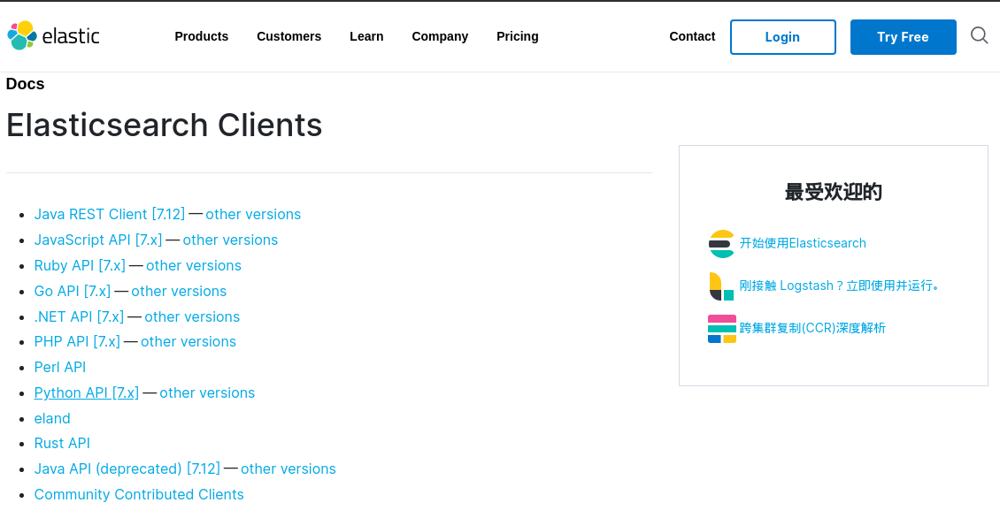


### python 集成


### go 集成