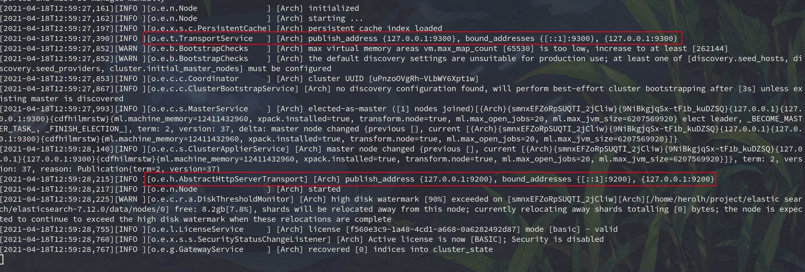

----------------------------------------------
> *Made By Herolh*
----------------------------------------------

# ELK 安装 {#index}

[TOC]


--------------------------------------------

## 了解 ELK
&emsp;&emsp;ELK 是 ElasticSearch 、 Logstash、Kibana 三大开源框架首字母大写简称。市面上也称为 Elastic Stack。 

- Lostash 是 ELK 的中央数据流，用于从不同目标（文件 / 数据存储 / MQ） 收集的不同格式数据，经过过滤后支持输出到不同目的地。 
- Kibana 可以将 elastic 的数据通过友好的页面展示出来，提供实时分析的功能。

&emsp;&emsp;市面上很多开发只要提到 ELK 能够一直说出它是一个日志分析架构技术栈总称，但实际上 **ELK 不仅仅适用于日志分析，它还可以支持其他任何数据分析和收集的场景，日志分析和收集知识**更具有代表性。并非唯一性。


## Elastic Search 安装

### 下载链接

[官网](https://www.elastic.co/cn/)  
[ElasticSearch](https://mirrors.huaweicloud.com/elasticsearch/?C=N&O=D)
[logstash](https://mirrors.huaweicloud.com/logstash/?C=N&O=D)


### 教程

[bilibili - 【狂神说 Java】ElasticSearch7.6.x 最新完整教程通俗易懂](https://www.bilibili.com/video/BV17a4y1x7zq?p=5&spm_id_from=pageDriver)


安装 ElasticSearch 之前必须保证 JDK1.8 + 安装完毕，并正确的配置好 JDK 环境变量，否则启动 ElasticSearch 失败。


### windows 下安装

#### 下载安装包

进入[Elasticsearch 下载页面](https://www.elastic.co/cn/elasticsearch/) 点击下载，选择 Windows 版本


#### 安装包目录

- 下载 windows 版本，解压压缩包，打开，看到如下目录：

    

##### 启动文件


##### 配置文件

打开 config 文件夹：


- `jvm.options`

    默认会以 4G 内存启动，如果电脑性能不够，记得修改：

    

- `elasticsearch.yml`

    默认 9200 端口


#### 启动服务

双击 bin 目录下的 elasticsearch.bat 启动


- 点击后：

- 在浏览器访问 127.0.0.1:9200, 若得到以下信息则安装成功：

    插件

#### 安装 es 的图形化界面插件

- 下载 [nodejs](https://nodejs.org/en/), LTS: 长期支持版本:
- 下载 `elasticsearch-head-master.zip`, 解压后安装依赖，一定要跳转到该解压文件夹下输入该命令：
- 访问测试：
- 由于 ES 进程和客户端进程端口号不同，存在跨域问题，所以需要在 ES 的配置文件中配置下解决跨域问题：
- 启动 es，使用 head 工具进行连接测试：


### Linux 下安装

#### 下载安装包

进入[Elasticsearch 下载页面](https://www.elastic.co/cn/elasticsearch/) 点击下载，选择 LInux_X86_64 版本:


#### 安装包目录

下载完成后，解压压缩包，打开，看到如下目录，除了可执行文件不同，其余与 windows 的安装目录基本相同：


#### 启动服务

```shell
./elasticsearch
```



在浏览器访问 127.0.0.1:9200, 若得到以下信息则安装成功：


#### 安装 es 的图形化界面插件
##### 前期准备：

- 下载 [nodejs](https://nodejs.org/en/), LTS: 长期支持版本
- 下载 `elasticsearch-head-master.zip`，下载地址  [github - es-head](https://github.com/mobz/elasticsearch-head)


##### 安装

- 解压后安装依赖，一定要跳转到该解压文件夹下输入该命令：

    ```shell
    npm install
    npm run start
    ```

- 访问测试：

    


##### 解决跨域

> 由于 ES 进程和客户端进程端口号不同，存在跨域问题，所以需要在 ES 的配置文件中配置下解决跨域问题：


##### 解决方法：

打开 `elastic  search` 的配置文件 `config/elasticsearch.yml`, 在文件尾部追加：

```shell
http.cors.enabled: true
http.cors.allow-origin: "*"
```

重启es服务，再次连接正常：


### 插件

#### IK 分词器

##### 源码安装

[下载链接](https://github.com/medcl/elasticsearch-analysis-ik/releases?after=v7.8.0)

- 安装我们的 IK 分词器，注意版本对应

    | IK 版本 | ES 版           |
    | ------- | --------------- |
    | 主      | 7.x-> 主        |
    | 6.x     | 6.x             |
    | 5.x     | 5.x             |
    | 1.10.6  | 2.4.6           |
    | 1.9.5   | 2.3.5           |
    | 1.8.1   | 2.2.1           |
    | 1.7.0   | 2.1.1           |
    | 1.5.0   | 2.0.0           |
    | 1.2.6   | 1.0.0           |
    | 1.2.5   | 0.90.x          |
    | 1.1.3   | 0.20.x          |
    | 1.0.0   | 0.16.2-> 0.19.0 |


- 解压放入到 es 对应的 plugins 下即可

    


##### 插件管理器下载

> 进入 es 的安装目录，使用 elasticsearch-plugin 进行安装

```shell
./bin/elasticsearch-plugin install https://github.com/medcl/elasticsearch-analysis-ik/releases/download/v7.12.0/elasticsearch-analysis-ik-7.12.0.zip
```

注意：替换`7.12.0`为您自己的 elasticsearch 版本


##### 重启加载

重启观察 ES，发现 ik 插件被加载了：


或是采用插件管理检查：

```shell
./elasticsearch-plugin list
```


## Kibana 安装
&emsp;&emsp;Kibana 是一个针对 ElasticSearch 的开源 **分析及可视化平台，用来搜索、查看交互存储在 ElasticSearch 索引中的数据**。使用 Kibana，可以通过各种如表进行高级数据分析及展示。Kibana 让海量数据更容易理解。它操作简单，基于浏览器的用户界面可以快速创建仪表板实时显示 Elasticsearch 查询动态。设置 Kibana 非常简单。无需编码或者额外的基础构架，几分钟内就可以完成 Kibana 安装并启动 Elasricsearch 索引检测。


### 下载地址

[kibana](https://mirrors.huaweicloud.com/kibana/?C=N&O=D)


### Linux 下安装

#### 下载安装包

进入[Kibana 下载页面](https://www.elastic.co/cn/downloads/kibana) 点击下载，选择 LInux_X86_64 版本:


#### 安装包目录

下载完成后，解压压缩包，打开，看到如下目录，除了可执行文件不同，其余与 windows 的安装目录基本相同：


#### 启动服务

```shell
./kibana
```


在浏览器访问 127.0.0.1:5601, 若得到以下信息则安装成功：


### 配置中文

中文包在：`x-pack\plugins\translations\translations`, 修改 config 下 的 `kibana.yml`, 重启即可:

