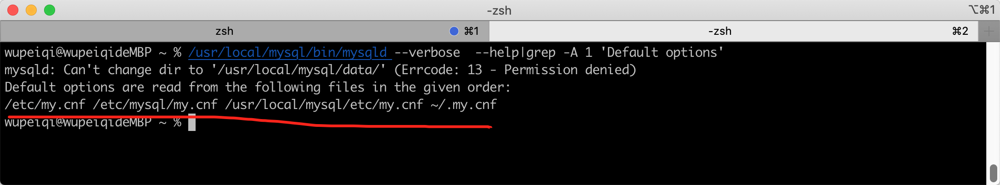
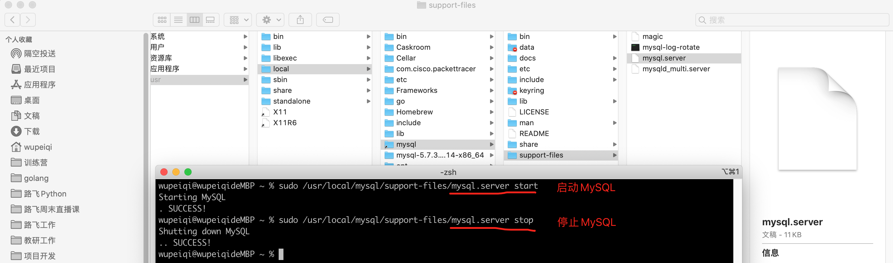

----------------------------------------------
> *Made By Herolh*
----------------------------------------------

# Mysql 的安装 {#index}

[TOC]


 


--------------------------------------------

## 文档版本

|    时间    | 修改人 | 内容     |
| :--------: | :----: | :------- |
| 2021-09-15 | Herolh | 文档创建 |
|            |        |          |


## 简介

MySQL现在的版本主要分为：

- 5.x 版本，现在互联网企业中的主流版本，包括：头条、美图、百度、腾讯等互联网公司主流的版本。
- 8.x 版本，新增了一些了窗口函数、持久化配置、隐藏索引等其他功能。

所以，我们课程会以常用大版本中最新的版本为例来讲解，即：5.7.31 （依然有很多企业在用5.6.x，但新项目基本上都是5.7.x了）。


## 安装

### windows 下

#### 下载安装

> https://downloads.mysql.com/archives/community/


解压至任意文件夹：


#### 配置

- 创建配置文件

    > 在MySQL的安装目录下创建 `my.ini` 的文件，作为MySQL的配置文件。

    

    其实，MySQL的配置文件可以放在很多的目录，下图是配置文件的优先级：

    

    强烈，建议大家还是把配置文件放在 MySQL安装目录下，这样以后电脑上想要安装多个版本的 MySQL 时，配置文件可以相互独立不影响。注意：如果你电脑的上述其他目录存在 MySQL 配置文件，建议删除，否则可能会影响 MySQL 的启动。

    

#### 服务初始化

```shell
"C:\Program Files\mysql-5.7.31-winx64\bin\mysqld.exe"  --initialize-insecure
```

初始化命令在执行时，会自动读取配置文件并执行初始化，此过程主要会做两件事：

- 自动创建 data 目录，以后我们的数据都会存放在这个目录。
- 同时创建建必备一些的数据，例如默认账户 root （无密码），用于登录 MySQL 并通过指令操作 MySQL。


#### 启动服务

##### 临时启动

> 这种启动方式每次开机或想要开启都需要手动执行一遍命令比较麻烦。

```shell
C:\Program Files\mysql-5.7.31-winx64\bin\mysqld.exe
```


注意：此时程序会挂起，内部就是可以接收客户端发来的MySQL指令，关闭窗口或Ctrl+c 就可以停止运行。


##### 制作 windows 服务

> 基于 windows 服务管理

```shell
"C:\Program Files\mysql-5.7.31-winx64\bin\mysqld.exe" --install mysql57
```


创建好服务之后，可以通过命令 启动和关闭服务，例如：

```shell
net start mysql57
net stop mysql57
```

也可以在 window 的服务管理中点击按钮启动和关闭服务。例如：


以后不再想要使用window服务了，也可以将制作的这个MySQL服务删除。

```shell
"C:\Program Files\mysql-5.7.31-winx64\bin\mysqld.exe" --remove mysql57
```


#### 测试连接

安装并启动 MySQL 之后，就可以连接 MySQL 来测试是否已正确安装并启动成功。


在安装MySQL时，其实也自动安装了一个工具（客户端），让我们快速实现连接 MySQL 并发送指令。


注意：如果把 bin 目录加入环境变量，每次在运行命令时，就不用再重新输入绝对路径了。


上述过程如果操作完成之后，证明你的安装和启动过程就搞定了。


#### 常见问题

#####  msvcr120.dll不存在

在windowns安装过程中如果有报错 （ msvcr120.dll不存在 ），请下载并安装下面的两个补丁：

- [vcredist](https://www.microsoft.com/zh-cn/download/confirmation.aspx?id=40784]) （主要）

- [dirctx](https://www.microsoft.com/zh-CN/download/details.aspx?id=35)


### Mac 下

&emsp;&emsp;mac 系统和 win 不同，MySQL 为他提供了非常方便的一站式安装程序，只要点击、next 就可以安装、初始化完成。


#### 安装和初始化

https://downloads.mysql.com/archives/community/


这个基于dmg文件的安装过程，其实包含了：

- 安装，默认安装在了 `/usr/local/mysql-5.7.31-macos10.14-x86_64/`目录。
- 初始化，在安装目录下创建data目录用于存放数据； 初始化模块数据库以及账户相关等，例如： 账cd


#### 创建配置文件

建议在MySQL安装目录下创建 `etc/my.cnf` 作为MySQL的配置文件。


MySQL的配置文件按照优先级，会在以下目录中寻找：



为了避免多个版本共存时，配置文件混乱的问题，建议大家还是把配置文件放在当前MySQL的安装目录下。


#### 启动

在Mac系统中启动MySQL常见的有2种方式：

- 安装目录中自带 `mysql.server` 脚本（建议）

    ```python
    sudo /usr/local/mysql/support-files/mysql.server start
    # 输入电脑密码
    
    sudo mysql.server start
    # 输入电脑密码
    ```

    ```
    sudo /usr/local/mysql/support-files/mysql.server stop
    ```

    


  为了避免每次执行命令都需要些路径，可以将路径 `/usr/local/mysql/support-files`加入到环境变量中。


操作完成之后，再在终端执行下命令：`source ~/.zprofile` 让设置的环境变量立即生效。

注意：mac系统的版本如果比较老，会显示空白的 `zprofile` 文件，此就要去打开   `bash_profile` 文件。这样设置好之后，以后就可以使用下面的命令去启动和关闭MySQL了。

  ```
sudo mysql.server start
sudo mysql.server stop
  ```

  

- 系统偏好设置（不推荐）


第一种`mysql.server`脚本的形式，内部是使用 `mysqld_safe`运行，可以守护我们的MySQL进程，如意外挂掉可自动重启。


#### 测试连接MySQL

安装并启动MySQL之后，就可以连接MySQL来测试是否已正确安装并启动成功。


以后在开发时，肯定是要用Python代码来连接MySQL并且进行数据操作（后面讲）。

在安装MySQL时，其实也自动安装了一个工具（客户端），让我们快速实现连接MySQL并发送指令。


注意：`/usr/local/mysql/bin `也可以加入到环境变量。至此，在 Mac 系统中关于 MySQL 的安装和配置就完成了。


### Docker 下

> [参考教程原文地址](https://www.cnblogs.com/sablier/p/11605606.html)

#### 建立镜像

[DockerHub MySQL 文档地址](https://hub.docker.com/_/mysql/)

- 拉取官方镜像（我们这里选择5.7，如果不写后面的版本号则会自动拉取最新版）

    ```shell
    docker pull mysql:5.7   # 拉取 mysql 5.7
    docker pull mysql       # 拉取最新版mysql镜像
    ```

- 检查是否拉取成功

    ```shell
    sudo docker images
    ```

- 运行容器

    ```shell
    sudo docker run -p 3306:3306 --name mysql57 -e MYSQL_ROOT_PASSWORD=123456 -d mysql:5.7
    
    # –name：容器名，此处命名为mysql
    # -e：配置信息，此处配置mysql的root用户的登陆密码
    # -p：端口映射，此处映射 主机3306端口 到 容器的3306端口
    # -d：后台运行容器，保证在退出终端后容器继续运行
    ```

    一般来说数据库容器不需要建立目录映射，如果要建立目录映射：

    ```shell
    duso docker run -p 3306:3306 --name mysql57 \
    -v /usr/local/docker/mysql/conf:/etc/mysql \
    -v /usr/local/docker/mysql/logs:/var/log/mysql \
    -v /usr/local/docker/mysql/data:/var/lib/mysql \
    -e MYSQL_ROOT_PASSWORD=123456 \
    -d mysql:5.7
    
    # -v：主机和容器的目录映射关系，":"前为主机目录，之后为容器目录
    ```

- 检查容器是否正确运行

    ```shell
    docker container ls
    ```


#### 连接 mysql

- 进入 docker 本地连接 mysql 客户端

    ```shell
    sudo docker exec -it mysql57 bash
    mysql -uroot -p123456
    ```

- 使用远程连接软件时要注意一个问题, 我们在创建容器的时候已经将容器的3306端口和主机的3306端口映射到一起，所以我们应该访问：

    ```shell
    host: 127.0.0.1
    port: 3306
    user: root
    password: 123456
    ```

- 如果你的容器运行正常，但是无法访问到MySQL，一般有以下几个可能的原因：

    - 防火墙阻拦

        ```shell
        # 开放端口：
        $ systemctl status firewalld
        $ firewall-cmd  --zone=public --add-port=3306/tcp -permanent
        $ firewall-cmd  --reload
        # 关闭防火墙：
        $ sudo systemctl stop firewalld
        ```

    - 需要进入 docker 本地客户端设置远程访问账号

        ```shell
        $ sudo docker exec -it mysql57 bash
        $ mysql -uroot -p123456
        mysql> grant all privileges on *.* to root@'%' identified by "password";
        ```

        

#### 出现问题

###### `/var/lib/mysql` 权限问题

> mysqld: Can't create/write to file '/var/lib/mysql/is_writable' (Errcode: 13 - Permission denied)

创建容器改为

```shell
sudo docker run -p 3306:3306 --name mysql5 -v /data/mysql-data:/var/lib/mysql -e MYSQL_ROOT_PASSWORD=123456 -d mysql:5.7

# cd /data 中添加权限
chomd -R 777 mysql-data/
```


## 核心目录

```shell
/var/lib/mysql 							# 数据库安装目录
/var/lib/mysql/bigdata01.pid			# pid 文件目录
/usr/share/mysql							# 配置文件目录
/usr/bin								# 命令目录 (mysql、mysqldump 等)
/etc/init.d/mysql								# 启停脚本
```

