----------------------------------------------
> *Made By Herolh*
----------------------------------------------

# 目录 {#index}

[TOC]


--------------------------------------------

# 教程

- [redis 官网](https://redis.io/)
- [redis 中文网](http://redis.cn/)
- [博客园 - 金角大王 - python 之路，Day12 - redis缓存数据库](https://www.cnblogs.com/alex3714/articles/6217453.html)


# 缓存数据库介绍
## 为什么要用Nosql
### 单机 Mysql 时代


&emsp;&emsp;90年代，一个基本的网站访问量一般不会太大，单个数据库完全足够。那个时候，更多的去使用静态网页，服务器根本没有太大的压力！ 思考一下，这种情况下：整个网站的瓶颈是什么？ 

- 数据量如果太大、一个机器放不下了！
- 数据的索引 （B+ Tree），一个机器内存也放不下
- 访问量（读写混合），一个服务器承受不了

只要你开始出现以上的三种情况之一，服务就该升级了。


### Memcached（缓存） + MySQL + 垂直拆分 （读写分离）

&emsp;&emsp;网站80%的情况都是在读，每次都要去查询数据库的话就十分的麻烦！所以说我们希望减轻数据的压力，我们可以使用缓存来保证效率！ 


发展过程： 优化数据结构和索引--> 文件缓存（IO）---> Memcached（当时最热门的技术！）


### 分库分表 + 水平拆分 + MySQL集群

技术和业务在发展的同时，对人的要求也越来越高！


早些年 MyISAM 引擎： 表锁，十分影响效率！高并发下就会出现严重的锁问题。
转战Innodb 引擎：行锁，慢慢的就开始使用分库分表来解决写的压力！
MySQL 在那个年代推出了表分区！这个并没有多少公司使用！ MySQL 的集群，很好满足哪个年代的所有需求！


### 现在
2010--2020 十年之间，世界已经发生了翻天覆地的变化；（定位，也是一种数据，音乐，热榜！）

- MySQL 等关系型数据库就不够用了！数据量很多，变化很快！ 

- MySQL 有的使用它来存储一些比较大的文件，博客，图片！数据库表很大，效率就低了！

    > 如果有一种数据库来专门处理这种数据, MySQL压力就变得十分小（研究如何处理这些问题！）

- 大数据的IO压力下，表几乎没法更改！


## 什么是 Nosql
&emsp;&emsp;NoSQL (NoSQL = Not Only SQL )，意即“不仅仅是SQL”，泛指非关系型的数据库。
&emsp;&emsp;随着互联网 web2.0 网站的兴起，传统的关系数据库在应付 web2.0 网站，特别是超大规模和高并发的 SNS 类型的 web2.0 纯动态网站已经显得力不从心，暴露了很多难以克服的问题，而非关系型的数据库则由于其本身的特点得到了非常迅速的发展。
&emsp;&emsp;NoSQL 数据库的产生就是为了解决大规模数据集合多重数据种类带来的挑战，尤其是大数据应用难题。


## NoSQL 特点
- 方便扩展（数据之间没有关系，很好扩展！）
- 大数据量高性能（Redis 一秒写8万次，读取11万，NoSQL的缓存记录级，是一种细粒度的缓存，性能会比较高！） 
- 数据类型是多样型的！（不需要事先设计数据库！随取随用！如果是数据量十分大的表，很多人就无法设计了！） 


### 传统 RDBMS 和 NoSQL 对比

#### 传统的 RDBMS 

- 结构化组织 
- SQL 
- 数据和关系都存在单独的表中 row col
- 数据定义语言
- 严格的一致性 - 基础的事务


#### Nosql

- 不仅仅是数据
- 没有固定的查询语言
- 键值对存储，列存储，文档存储，图形数据库（社交关系）
- 最终一致性， - CAP定理和BASE （异地多活） 
- 高性能，高可用，高可扩


## NoSQL数据库的四大分类

### 键值对存储数据库

> 这一类数据库主要会使用到一个[哈希表](http://baike.baidu.com/view/329976.htm)，这个表中有一个特定的键和一个指针指向特定的数据。Key/value模型对于IT系统来说的优势在于简单、易部署。但是如果[DBA](http://baike.baidu.com/subview/67156/5112091.htm)只对部分值进行查询或更新的时候，Key/value就显得效率低下了。[3] 举例如：Tokyo Cabinet/Tyrant, Redis, Voldemort, Oracle BDB.


### 列存储数据库

> 这部分数据库通常是用来应对分布式存储的海量数据。键仍然存在，但是它们的特点是指向了多个列。这些列是由列家族来安排的。如：Cassandra, HBase, Riak.

- HBase 
- 分布式文件系统


### 文档型数据库

> 文档型数据库的灵感是来自于Lotus Notes办公软件的，而且它同第一种键值存储相类似。该类型的数据模型是版本化的文档，半结构化的文档以特定的格式存储，比如JSON。文档型数据库可 以看作是键值数据库的升级版，允许之间嵌套键值。而且文档型数据库比键值数据库的查询效率更高。如：CouchDB, MongoDb. 国内也有文档型数据库SequoiaDB，已经开源。

- MongoDB 

    > MongoDB 是一个基于分布式文件存储的数据库，C++ 编写，主要用来处理大量的文档！ MongoDB 是一个介于关系型数据库和非关系型数据中中间的产品！
    >
    > MongoDB 是非关系型数 据库中功能最丰富，最像关系型数据库的！


### 图形(Graph)数据库

> 图形结构的数据库同其他行列以及刚性结构的 SQL 数据库不同，它是使用灵活的图形模型，并且能够扩展到多个服务器上。NoSQL 数据库没有标准的查询语言(SQL)，因此进行数据库查询需要制定数据模型。许多 NoSQL 数据库都有 REST 式的数据接口或者查询API。[2] 如：Neo4J, InfoGrid, Infinite Graph.

他不是存图形，放的是关系，比如：朋友圈社交网络，广告推荐！


&emsp;&emsp;因此，我们总结 NoSQL 数据库在以下的这几种情况下比较适用：

- 数据模型比较简单；
- 需要灵活性更强的IT系统；
- 对数据库性能要求较高；
- 不需要高度的数据一致性；
- 对于给定key，比较容易映射复杂值的环境。


## NoSQL数据库的四大分类对比

|       分类        |                   Examples 举例                    |                         典型应用场景                         |                    数据模型                     |                             优点                             |                             缺点                             |
| :---------------: | :------------------------------------------------: | :----------------------------------------------------------: | :---------------------------------------------: | :----------------------------------------------------------: | :----------------------------------------------------------: |
|   键值对数据库    | Tokyo Cabinet/Tyrant, Redis, Voldemort, Oracle BDB | 内容缓存，主要用于处理大量数据的高访问负载，也用于一些日志系统等等。 | Key 指向 Value 的键值对，通常用hash table来实现 |                          查找速度快                          |        数据无结构化，通常只被当作字符串或者二进制数据        |
|   列存储数据库    |               Cassandra, HBase, Riak               |                       分布式的文件系统                       |       以列簇式存储，将同一列数据存在一起        |         查找速度快，可扩展性强，更容易进行分布式扩展         |                         功能相对局限                         |
|   文档型数据库    |                  CouchDB, MongoDb                  | Web应用（与Key-Value类似，Value是结构化的，不同的是数据库能够了解Value的内容） |    Key-Value对应的键值对，Value为结构化数据     | 数据结构要求不严格，表结构可变，不需要像关系型数据库一样需要预先定义表结构 |            查询性能不高，而且缺乏统一的查询语法。            |
| 图形(Graph)数据库 |          Neo4J, InfoGrid, Infinite Graph           |           社交网络，推荐系统等。专注于构建关系图谱           |                     图结构                      |     利用图结构相关算法。比如最短路径寻址，N度关系查找等      | 很多时候需要对整个图做计算才能得出需要的信息，而且这种结构不太好做分布式的集群方案。 |

 


# redis 介绍
> Redis（**R**emote **D**ictionary **S**erver )，即远程字典服务 !

&emsp;&emsp;redis 是一个开源的使用 C 语言编写、支持网络、==可基于内存亦可持久化==的日志型、Key-Value数据库， 并提供多种语言的API。
&emsp;&emsp;和 Memcached 类似，它支持存储的 value 类型相对更多，包括 **string(字符串)、list(链表)、set(集合)、zset(sorted set 有序集合)和 hash(哈希类型)**。这些数据类型都支持 push/pop、add/remove 及取交集并集和差集及更丰富的操作，而且这些操作都是原子性的。在此基础上，redis支持各种不同方式的排序。
&emsp;&emsp;与 memcached 一样，为了保证效率，数据都是缓存在内存中。==区别的是redis 会周期性的把更新的数据写入磁盘或者把修改操作写入追加的记录文件，并且在此基础上实现了 master-slave(主从) 同步==。


### 能干嘛？

- 内存存储、持久化，内存中是断电即失、所以说持久化很重要（rdb、aof）
- 效率高，可以用于高速缓存
- 发布订阅系统
- 地图信息分析
- 计时器、计数器（浏览量！）
- …


### Redis优点

- **异常快速** : Redis 是非常快的，每秒可以执行大约110000设置操作，81000个/每秒的读取操作。

- **支持丰富的数据类型** : Redis支持最大多数开发人员已经知道如列表，集合，可排序集合，哈希等数据类型。

    这使得在应用中很容易解决的各种问题，因为我们知道哪些问题处理使用哪种数据类型更好解决。

- **操作都是原子的** : 所有 Redis 的操作都是原子，从而确保当两个客户同时访问 Redis 服务器得到的是更新后的值（最新值）。

- **MultiUtility工具**：Redis是一个多功能实用工具，可以在很多如：缓存，消息传递队列中使用（Redis原生支持发布/订阅），在应用程序中，如：Web 应用程序会话，网站页面点击数等任何短暂的数据；


### redis 安装

#### windows 下安装

**下载地址：**https://github.com/tporadowski/redis/releases。

Redis 支持 32 位和 64 位。这个需要根据你系统平台的实际情况选择，这里我们下载 [Redis-x64-5.0.9.msi](https://github.com/tporadowski/redis/releases/download/v5.0.9/Redis-x64-5.0.9.msi)直接进行安装。


#### Ubuntu 安装

```shell
sudo apt-get install redis-server
```

```shell
# 启动 Redis
redis-server
#  查看 redis 是否还在运行
redis-cli

用法：redis-cli [OPTIONS] [cmd [arg [arg ...]]]
-h <主机ip>，默认是 127.0.0.1
-p <端口>，默认是 6379
-a <密码>，如果 redis 加锁，需要传递密码
--help，显示帮助信息
```

这将打开一个 Redis 提示符，如下图所示：

```
redis 127.0.0.1:6379>
```

在上面的提示信息中：127.0.0.1 是本机的IP地址，6379是 Redis 服务器运行的端口。现在输入 PING 命令，如下图所示：

```
redis 127.0.0.1:6379> ping
PONG
```

这说明现在你已经成功地在计算机上安装了 Redis。


#### docker 安装

```shell
docker run -itd --name redis -p 6379:6379 redis
```


### redis 图形化管理界面

https://github.com/uglide/RedisDesktopManager


### redis 性能测试

#### redis-benchmark

> 官方自带的性能测试工具！

```shell
# 测试：100个并发连接 100000请求
redis-benchmark -h localhost -p 6379 -c 100 -n 100000
```


# 基础知识

- redis默认有16个数据库， 默认使用的是第0个
- 可以使用 select 进行切换数据库
- 清除当前数据库 `flushdb`，清除全部数据库的内容 `FLUSHALL`
- Redis 是单线程的


## Redis 是单线程的

明白Redis是很快的，官方表示，Redis是基于内存操作，CPU不是Redis性能瓶颈，Redis的瓶颈是根据机器的内存和网络带宽，既然可以使用单线程来实现，就使用单线程了！所有就使用了单线程了！ Redis 是C 语言写的，官方提供的数据为 100000+ 的QPS，完全不比同样是使用 key-vale的 Memecache差！ Redis 为什么单线程还这么快？ 1、误区1：高性能的服务器一定是多线程的？ 2、误区2：多线程（CPU上下文会切换！）一定比单线程效率高！ 先去CPU>内存>硬盘的速度要有所了解！ 核心：redis 是将所有的数据全部放在内存中的，所以说使用单线程去操作效率就是最高的，多线程 （CPU上下文会切换：耗时的操作！！！），对于内存系统来说，如果没有上下文切换效率就是最高 的！多次读写都是在一个CPU上的，在内存情况下，这个就是最佳的方案！


## Redis 常用命令

|       命令行        |                 说明                  | 示例          |
| :-----------------: | :-----------------------------------: | ------------- |
|      redis-cli      |           打开 redis 客户端           |               |
|       flushdb       |            清空当前数据库             |               |
|      flushall       |     清空全部数据库，==慎用！！==      |               |
|      help 命令      |               获取帮助                | `help set`    |
|       select        |              切换数据库               | `select 3`    |
|       DBSIZE        |          查看当前数据库大小           |               |
|       keys *        |          查看数据库所以的key          |               |
|      exists 键      |        检测数据库是否存在该键         | `exists key1` |
|      type name      |         获取name对应值的类型          |               |
| rename name newname |          对redis的name重命名          |               |
|  expire name time   | 为某个 redis 的某个 name 设置超时时间 |               |
|    move name db     |    将redis的某个值移动到指定的db下    |               |
|      del name       | 根据 name 删除 redis 中的任意数据类型 |               |

```shell
# 设置值
set key value ex 3				# 3 秒后过期
set key value px 3000			# 3 秒后过期

# 获取值, 根据模型获取redis的name
keys(pattern='*')
# KEYS * 匹配数据库中所有 key 。
# KEYS h?llo 匹配 hello ， hallo 和 hxllo 等。
# KEYS h*llo 匹配 hllo 和 heeeeello 等。
# KEYS h[ae]llo 匹配 hello 和 hallo ，但不匹配 hillo

get key
get key *						# 获取所有的键

# 随机获取一个redis的name（不删除）
randomkey()

# 同字符串操作，用于增量迭代获取key
scan(cursor=0, match=None, count=None)
scan_iter(match=None, count=None)
```


## Redis API 使用个体

### 操作

#### String 操作

redis 中的 String 在内存中按照一个 name 对应一个 value 来存储。如图：

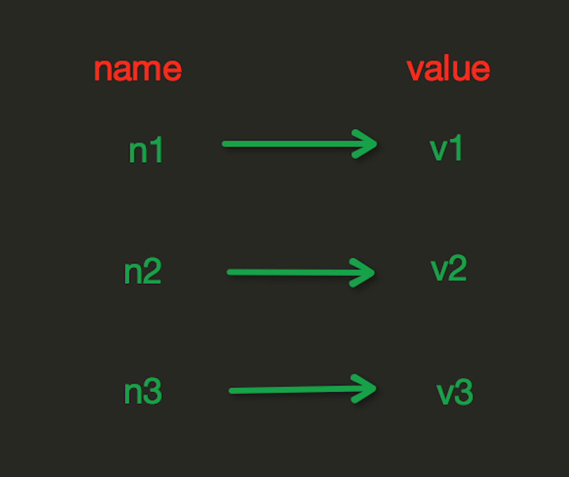

##### 设置值

###### set

> set(name, value, ex=None, px=None, nx=False, xx=False)

在Redis中设置值，默认不存在则创建，存在则修改，参数：

```shell
SET key value [expiration EX seconds|PX milliseconds] [NX|XX]

ex，过期时间（秒）
px，过期时间（毫秒）
nx，如果设置为 True，则只有 name 不存在时，当前set操作才执行
xx，如果设置为 True，则只有 name 存在时，岗前set操作才执行
```

示例：

```shell
set name1 "lin"				# 不会自动过期
set name "lin" ex 5			# 5 秒后过期
set name "lin" px 5000		# 5 秒后过期
set name1 "lin" nx			# name1 有值故无法执行
set name1 "lin1" xx			# name1 有值故可以执行(修改值)
```


###### setnx

> setnx(name, value)

设置值，只有 name 不存在时，执行设置操作（添加）


###### setex

> setex(name, value, time)

设置值，time，过期时间（数字秒 或 timedelta 对象）


######  psetex

> psetex(name, time_ms, value)

设置值，time_ms，毫秒级过期时间（数字毫秒 或 timedelta 对象）


###### mset

> mset(*args, **kwargs)

批量设置值

```shell
# 如：
mset(k1='v1', k2='v2')
# 或
mget({'k1': 'v1', 'k2': 'v2'})
```

示例：

```shell
mset name lin age 18
```


###### setbit

> setbit(name, offset, value)

对name对应值的二进制表示的位进行操作

```shell
# 参数：
name:		redis的name
offset:		位的索引（将值变换成二进制后再进行索引）
value:		值只能是 1 或 0

# 注：如果在Redis中有一个对应： n1 = "foo"，
  那么字符串foo的二进制表示为：01100110 01101111 01101111
所以，如果执行 setbit('n1', 7, 1)，则就会将第7位设置为1，
  那么最终二进制则变成 01100111 01101111 01101111，即："goo"
```

示例：

```shell
setbit name 7 1
```


##### 获取值

###### get

> get(name)

获取值


###### mget

> mget(keys, *args)

批量获取

```shell
# 如：
mget('ylr', 'wupeiqi')
# 或
r.mget(['ylr', 'wupeiqi'])
```

示例：

```shell
mget name age
```


###### getrange

> getrange(key, start, end)

获取子序列(根据字节获取，非字符)。**切片**

```shell
# 参数：
name，Redis 的 name
start，起始位置（字节）
end，结束位置（字节）
```

示例

```shell
getrange name1 0 2  
getrange name1 0 -1			# 取到最后一位数  
```

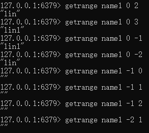


###### getbit

> getbit(name, offset)

获取name对应的值的二进制表示中的某位的值 （0或1）

```shell
getbit name 7
# 字符串 goo 的二进制表示为：01100111 01101111 01101111
# 所以，第7位为1, 第0位为0
```


###### bitcount

> bitcount(key, start=None, end=None)

获取name对应的值的二进制表示中 1 的个数

```shell
key:		Redis的name
start:		位起始位置
end:		位结束位置
```

示范：

```shell
bitcount name
bitcount name 0 0
bitcount name 0 1
```


##### 更新值

###### setrange

> setrange(name, offset, value)

```shell
# 修改字符串内容，从指定字符串索引开始向后替换（新值太长时，则向后添加）
# 参数：
offset:		字符串的索引，字节（一个汉字三个字节）
value:		要设置的值
```

示例：

```shell
setrange name1 3 2
setrange name1 3 22222222
```

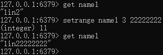


###### getset

> getset(name, value)

```shell
设置新值并获取原来的值
```

示例：

```shell
getset age 19
```

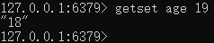


###### append

> append(key, value)

在 redis name 对应的值后面追加内容

```shell
key:		redis的name
value:		要追加的字符串
```

示例：

```shell
append name1 123
```

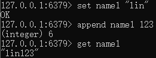


##### 特殊

###### strlen

> strlen(name)

返回name对应值的字节长度（一个汉字3个字节）

```shell
strlen name2
```

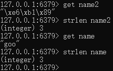


###### incr

> incr(self, name, amount=1)

自增 name对应的值，当name不存在时，则创建name＝amount，否则，则自增。

```shell
name:			Redis的name
amount:			自增数（必须是整数)		# redis 语法是没有的
# 注：同incrby
```

示例：

```shell
incr age
```

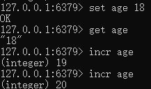


###### incrbyfloat

> incrbyfloat(self, name, amount=1.0)

自增 name 对应的值，当 name 不存在时，则创建 name＝amount，否则，则自增。

```shell
name:		Redis的name
amount:		自增数（浮点型）
```

示例：

```shell
incrbyfloat age 5
incrbyfloat age 1.1
```

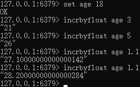


###### decr

> decr(self, name, amount=1)

自减 name对应的值，当name不存在时，则创建name＝amount，否则，则自减。

```shell
name:			Redis的name
amount:			自减数（必须是整数)			# redis 语法是没有的
```

示例：

```shell
decr age
```

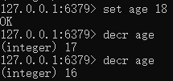


#### Hash 操作

&emsp;&emsp;hash 表现形式上有些像 pyhton 中的 dict,可以存储一组关联性较强的数据，redis 中 Hash 在内存中的存储格式如下图：　　


##### 设置值

###### hset

>  hset(name, key, value)

name 对应的 hash 中设置一个键值对（不存在，则创建；否则，修改）

```shell
# 参数：
name，redis 的name
key，name 对应的 hash 中的 key
value，name 对应的 hash 中的 value
 
# 注：
hsetnx(name, key, value),当name对应的hash中不存在当前key时则创建（相当于添加）
```

示例：

```shell
hset info name lin
hset info age 18
```


###### hmset

> hmset(name, mapping)

在 name 对应的 hash 中批量设置键值对

```shell
# 参数：
name，redis 的 name
mapping，字典，如：{'k1':'v1', 'k2': 'v2'}
 
# 如：
r.hmset('xx', {'k1':'v1', 'k2': 'v2'})
```

示例：

```shell
hmset info1 name lin age 18
```

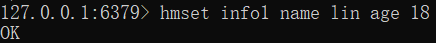


##### 获取值

###### hget

> hget(name, key)

在 name 对应的 hash 中获取根据 key 获取 value

示例：

```shell
hget info name
```

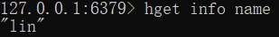


###### hmget

> hmget(name, keys, *args)

在 name 对应的 hash 中获取多个 key 的值

```shell
# 参数：
name，reids 对应的 name
keys，要获取 key 集合，如：['k1', 'k2', 'k3']
*args，要获取的 key，如：k1,k2,k3
 
# 如：
r.mget('xx', ['k1', 'k2'])
# 或
r.hmget('xx', 'k1', 'k2')
```

示例：

```shell
hmget info name age
```

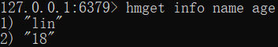


###### hgetall

> hgetall(name)

获取 name 对应 hash 的所有键值

示例：

```shell
hgetall info
```

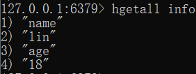


###### hkeys

> hkeys(name)

获取 name 对应的 hash 中所有的 key 的值

示例：

```shell
hkeys info
```

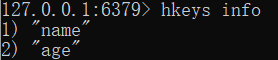


###### hvals

> hvals(name)

获取 name 对应的 hash 中所有的 value 的值

示例：

```shell
hvals info
```

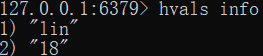


###### hscan

> hscan(name, cursor=0, match=None, count=None)

增量式迭代获取，对于数据大的数据非常有用，hscan可以实现分片的获取数据，并非一次性将数据全部获取完，从而放置内存被撑爆

```shell
# 参数：
name，redis 的 name
cursor，游标（基于游标分批取获取数据）
match，匹配指定 key，默认 None 表示所有的 key
count，每次分片最少获取个数，默认 None 表示采用 Redis 的默认分片个数
 
# 如：
第一次：cursor1, data1 = r.hscan('xx', cursor=0, match=None, count=None)
第二次：cursor2, data1 = r.hscan('xx', cursor=cursor1, match=None, count=None)
# 直到返回值cursor的值为0时，表示数据已经通过分片获取完毕
```

示例：

```shell
hscan info 0 match a*
hscan info 0 match *a*
```


> hscan_iter(name, match=None, count=None)

利用yield封装hscan创建生成器，实现分批去redis中获取数据

```shell
# 参数：
match，匹配指定 key，默认None 表示所有的 key
count，每次分片最少获取个数，默认 None 表示采用 Redis 的默认分片个数
  
# 如：
for item in r.hscan_iter('xx'):
    print item
```


##### 删除值

###### hdel

> hdel(name,*keys)

将 name 对应的 hash 中指定 key 的键值对删除

示例：

```shell
hdel info age
hkeys info
```

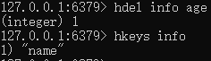


##### 特殊

###### hlen

> hlen(name)

获取 name 对应的 hash 中键值对的个数

示例：

```shell
hlen info
```

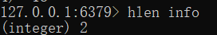


###### hexists

> hexists(name, key)

检查 name 对应的 hash 是否存在当前传入的 key

示例：

```shell
hexists info sex
hexists info name
```

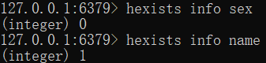


###### hincrby

> hincrby(name, key, amount=1)

自增name对应的hash中的指定key的值，不存在则创建key=amount

```shell
# 参数：
name，redis 中的 name
key， hash 对应的 key
amount，自增数（整数）
```

示例：

```shell
hincrby info age 1
```

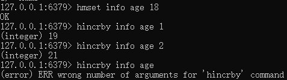


###### hincrbyfloat

> hincrbyfloat(name, key, amount=1.0)

自增 name 对应的 hash 中的指定 key 的值，不存在则创建 `key=amount`

```shell
# 参数：
name，redis 中的 name
key， hash 对应的 key
amount，自增数（浮点数）
```

示例：

```shell
hincrbyfloat info age 1.1
```

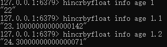


#### list 操作

List操作，redis中的List在在内存中按照一个name对应一个List来存储。如图：


##### 设置值

###### lpush

> lpush(name, values)

在 name 对应的 list 中添加元素，每个新的元素都添加到列表的最左边

```shell
# 如：
r.lpush('oo', 11,22,33)
# 保存顺序为: 33,22,11
```

 示例：

```shell
lpush list1 1 2 3 4 5 6 7 8 9
```

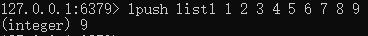


###### rpush

> rpush(name, values)

在 name 对应的 list 中添加元素，每个新的元素都添加到列表的最右边

```shell
# 如：
r.rpush('oo', 11,22,33)
# 保存顺序为: 11,22,33
```

 示例：

```shell
rpush list2 1 2 3 4 5 6 7 8 9
```

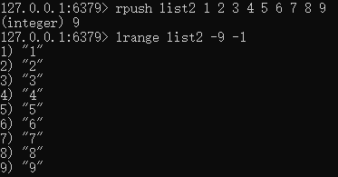


###### lpushx

> lpushx(name,value)

&emsp;&emsp;在 name 对应的 list 中添加元素，只有 name 已经存在时，值添加到列表的最左边；否则什么都不干

示例：

```shell
lpushx list2 10
```

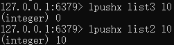


###### rpushx

> rpushx(name,value)

&emsp;&emsp;在 name 对应的 list 中添加元素，只有 name 已经存在时，值添加到列表的最右边；否则什么都不干

示例：

```shell
rpushx list2 10
```


###### linsert

> linsert(name, where, refvalue, value))

在 name 对应的列表的某一个值前或后插入一个新值

```shell
# 参数：
name，redis 的 name
where，BEFORE 或 AFTER
refvalue，标杆值，即：在它前后插入数据
value，要插入的数据
```

示例：

```shell
linsert list3 before 3 X
linsert list3 after 3 X
lrange list3 0 -1
```

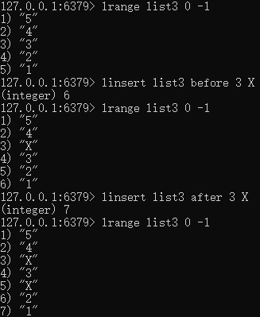


##### 更新值

###### lset

> lset(name, index, value)

对 name 对应的 list 中的某一个索引位置重新赋值

```shell
# 参数：
name，redis 的 name
index，list 的索引位置
value，要设置的值
```

示例：

```shell
lrange list3 0 -1
```

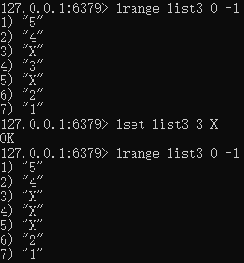


##### 删除值

###### lrem

> lrem(name, value, num)

在 name 对应的 list 中删除指定的值

```shell
# 参数：
name，redis 的 name
value，要删除的值
num，  	num=0，删除列表中所有的指定值；
		num=2,从前到后，删除2个；
		num=-2,从后向前，删除2个
```

示例：

```shell
lrem list3 2 X
```

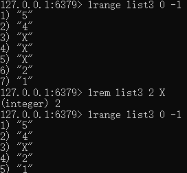


###### lpop

> lpop(name)

在 name 对应的列表的左侧获取第一个元素并在列表中移除，返回值则是第一个元素

示例：

```shell\
lpop list3
```

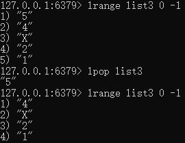


###### rpop

> rpop(name)

在 name 对应的列表的右侧侧获取第一个元素并在列表中移除，返回值则是第一个元素

示例：

```shell\
rpop list3
```


###### blpop

> blpop(keys, timeout)

将多个列表排列，按照从左到右去 pop 对应列表的元素

```shell
# 参数：
keys，redis 的 name 的集合
timeout，超时时间，当元素所有列表的元素获取完之后，阻塞等待列表内有数据的时间（秒）, 0 表示永远阻塞
```

 

###### brpop

> brpop(keys, timeout)

将多个列表排列，按照从右到左去 pop 对应列表的元素

```shell
# 参数：
keys，redis 的 name 的集合
timeout，超时时间，当元素所有列表的元素获取完之后，阻塞等待列表内有数据的时间（秒）, 0 表示永远阻塞
```

 


##### 获取值

###### lrange

> lrange(name, start, end)

在 name 对应的列表分片获取数据

```shell
# 参数：
name，redis 的name
start，索引的起始位置
end，索引结束位置
```

示例：

```shell
lrange list1 0 -1
lrange list1 -9 -1
lrange list1 -2 -1
```


###### lindex

> lindex(name, index)

在name对应的列表中根据索引获取列表元素

示例：

```shell
 lindex list3 1
```

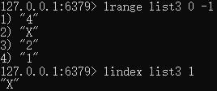


##### 特殊

###### llen

> llen(name)

name 对应的 list 元素的个数

示例：

```shell
llen list1
```

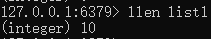


###### ltrim

> ltrim(name, start, end)

切片。在 name 对应的列表中移除没有在 `start-end` 索引之间的值

```shell
# 参数：
name，redis 的 name
start，索引的起始位置
end，索引结束位置
```

示例：

```shell
ltrim list3 1 2
```

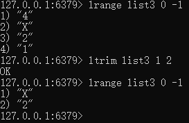


###### rpoplpush

> rpoplpush(src, dst)

从一个列表取出最右边的元素，同时将其添加至另一个列表的最左边

```shell
# 参数：
src，要取数据的列表的 name
dst，要添加数据的列表的 name
```

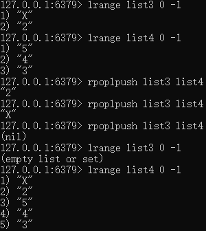


###### brpoplpush

> brpoplpush(src, dst, timeout=0)

从一个列表的右侧移除一个元素并将其添加到另一个列表的左侧

```shell
# 参数：
src，取出并要移除元素的列表对应的 name
dst，要插入元素的列表对应的 name
timeout，当 src 对应的列表中没有数据时，阻塞等待其有数据的超时时间（秒），0 表示永远阻塞
```


#### set 集合操作

set 操作，set 集合就是不允许重复的列表

##### 设置值

###### sadd

> sadd(name, values)

name 对应的集合中添加元素

示例：

```shell
sadd set1 1 2 3 4 4
```

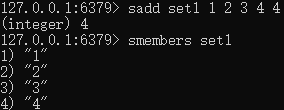


##### 获取值

###### smembers

> smembers(name)

获取 name 对应的集合的所有成员

示例：

```shell
smembers set1
```

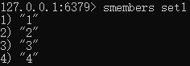


###### srandmember

> srandmember(name, numbers)

从name对应的集合中随机获取 numbers 个元素

示例：

```shell
srandmember set1 3
```

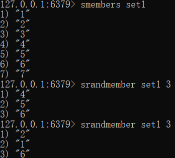


###### sscan

> sscan(name, cursor=0, match=None, count=None)
> sscan_iter(name, match=None, count=None)

同字符串的操作，用于增量迭代分批获取元素，避免内存消耗太大


##### 删除值

###### srem

> srem(name, values)

在 name 对应的集合中删除某些值

示例:

```shell
srem set3 3
```

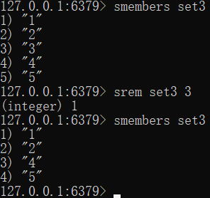


###### spop

> spop(name)

用于移除集合中的指定 key 的一个或多个随机元素，移除后会返回移除的元素。

示例：

```shell
spop set2
spop set2 2
```


##### 特殊

###### scard

> scard(name)

获取 name 对应的集合中元素个数

示例：

```shell
scard set1
```

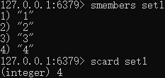


###### sismember

> sismember(name, value)

检查 value 是否是 name 对应的集合的成员

示例：

```shell
 sismember set3 1
```

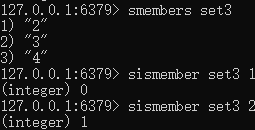


###### sdiff

> sdiff(keys, *args)

在第一个 name 对应的集合中且不在其他 name 对应的集合的元素集合

示例：

```shell
sdiff set1 set2
sdiff set2 set1
```

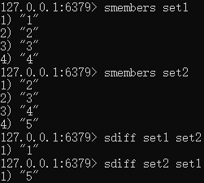


###### sdiffstore

> sdiffstore(dest, keys, *args)

 获取第一个 name 对应的集合中且不在其他 name 对应的集合，再将其新加入到 dest 对应的集合中

示例：

```shell
sdiffstore set3 set1 set2
#  获取在· set1 中且不在 set2 的集合，再将其新加入到 set3 对应的集合中
```


###### sinter

> sinter(keys, *args)

获取多一个 name 对应集合的交集

示例：

```shell
sinter set1 set2
```

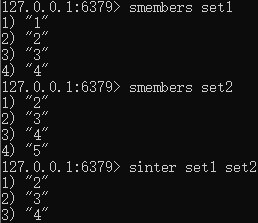


###### sinterstore

> sinterstore(dest, keys, *args)

获取多一个 name 对应集合的并集，再讲其加入到 dest 对应的集合中

示例：

```shell
sinterstore set3 set1 set2
```

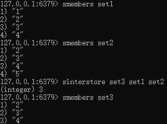


###### sunion

> sunion(keys, *args)

获取多一个 name 对应的集合的并集

示例：

```shell
sunion set1 set2
```

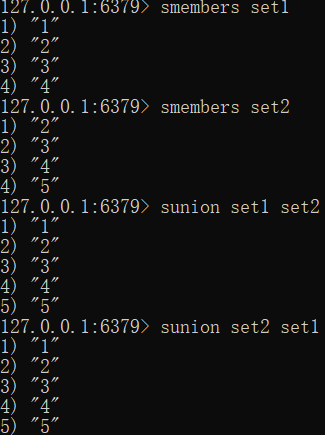


###### sunionstore

> sunionstore(dest,keys, *args)

获取多一个 name 对应的集合的并集，并将结果保存到 dest 对应的集合中

示例：

```shell
 sunionstore set3 set2 set1
# 获取set2 和 set1 的并集，并将结果保存到 set3 对应的集合中
```

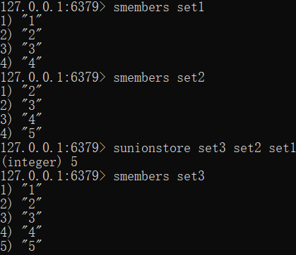


###### smove

> smove(src, dst, value)

将某个成员从一个集合中移动到另外一个集合

示例：

```shell
smove set1 set2 1
```

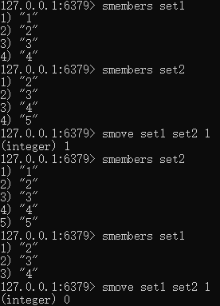


#### zset 有序集合操作

&emsp;&emsp;在集合的基础上，为每元素排序；元素的排序需要根据另外一个值来进行比较，所以，对于有序集合，每一个元素有两个值，即：值和分数，分数专门用来做排序。


##### 添加值

###### zadd

> zadd(name, *args, **kwargs)

在 name 对应的有序集合中添加元素

```python
# 如：
zadd('zz', 'n1', 1, 'n2', 2)
# 或
zadd('zz', n1=11, n2=22)
```

示例:

```shell
zadd zset1 10 A
# 添加内容 A 到 zset1， 权重为10
```


##### 获取值

###### zrange

> zrange( name, start, end, desc=False, withscores=False, score_cast_func=float)

按照索引范围获取name对应的有序集合的元素

```shell
# 参数：
name，redis的name
start，有序集合索引起始位置（非分数）
end，有序集合索引结束位置（非分数）
desc，排序规则，默认按照分数从小到大排序
withscores，是否获取元素的分数，默认只获取元素的值
score_cast_func，对分数进行数据转换的函数

# 更多：

# 从大到小排序
zrevrangebyscore(name, max, min, start=None, num=None, withscores=False, score_cast_func=float)
```

示例：

```shell
zrange zset1 0 -1
zrange zset1 0 -1 withscores
```


###### zrevrange

> zrevrange(name, start, end, withscores=False, score_cast_func=float)

从大到小排序，按照索引范围获取 name 对应的有序集合的元素

示例：

```shell
zrevrange zset1 0 -1
```


###### zrangebyscore

> zrangebyscore(name, min, max, start=None, num=None, withscores=False, score_cast_func=float)

 按照分数范围获取name对应的有序集合的元素

示例：

```shell
zrangebyscore zset1 9 11
```


###### zrevrangebyscore

> zrevrangebyscore(name, max, min, start=None, num=None, withscores=False, score_cast_func=float)

从大到小排序, 按照分数范围获取name对应的有序集合的元素

示例：

```shell
zrevrangebyscore zset1 0 -1
```


###### zrank

> zrank(name, value)

获取某个值在 name对应的有序集合中的排行（从 0 开始）

示例：

```shell
zrank zset1 S
```


###### zrevrank

> zrevrank(name, value)

从大到小排序

示例：

```shell
zrevrank zset1 S
```


###### zscore

> zscore(name, value)

获取 name 对应有序集合中 value 对应的分数

示例：

```shell

```


##### 删除值

###### zrem

> zrem(name, values)

 删除 name 对应的有序集合中值是 values 的成员


###### zremrangebyrank

> zremrangebyrank(name, min, max)

根据排行范围删除


###### zremrangebyscore

> zremrangebyscore(name, min, max)

根据分数范围删除


##### 特殊

###### zinterstore

> zinterstore(dest, keys, aggregate=None)

获取两个有序集合的交集，如果遇到相同值不同分数，则按照 `aggregate` 进行操作

```shell
# aggregate的值为: SUM MIN MAX
```


###### zunionstore

> zunionstore(dest, keys, aggregate=None)

获取两个有序集合的并集，如果遇到相同值不同分数，则按照aggregate进行操作

```shell
# aggregate的值为: SUM MIN MAX
```


###### zscan

> zscan(name, cursor=0, match=None, count=None, score_cast_func=float)
> zscan_iter(name, match=None, count=None,score_cast_func=float)

\# 同字符串相似，相较于字符串新增score_cast_func，用来对分数进行操作


# 案例

## 统计用户登录

> 登录数量，用户是否登录

````shell
set usercount "\x00"				# 初始化所有位为 0
bitcount usercount
setbit usercount 10000 1			# 第 10000 名客户登陆
setbit usercount 100 1				# 第 100 名 拥护的登录
bitcount usercount					# 统计登录人数
getbit usercount 100				# 查看第 100 用户是否登录
````


> 一亿个用户，占一亿位，约等于 10M


# 思考

- **自己写的程序数据也是存在内存，Redis 也是存在内存里，为什么我们还要用 Redis？**

    > 自己写的程序数据存在的是独立的内存，其他应用程序无法访问


