----------------------------------------------
> *Made By Herolh*
----------------------------------------------

# 目录 {#index}

[TOC]


--------------------------------------------

# 教程

- [redis 官网](https://redis.io/)
- [redis 中文网](http://redis.cn/)
- [博客园 - 金角大王 - python 之路，Day12 - redis缓存数据库](https://www.cnblogs.com/alex3714/articles/6217453.html)


# 缓存数据库介绍
## 为什么要用Nosql
### 单机 Mysql 时代


&emsp;&emsp;90年代，一个基本的网站访问量一般不会太大，单个数据库完全足够。那个时候，更多的去使用静态网页，服务器根本没有太大的压力！ 思考一下，这种情况下：整个网站的瓶颈是什么？ 

- 数据量如果太大、一个机器放不下了！
- 数据的索引 （B+ Tree），一个机器内存也放不下
- 访问量（读写混合），一个服务器承受不了

只要你开始出现以上的三种情况之一，服务就该升级了。


### Memcached（缓存） + MySQL + 垂直拆分 （读写分离）

&emsp;&emsp;网站80%的情况都是在读，每次都要去查询数据库的话就十分的麻烦！所以说我们希望减轻数据的压力，我们可以使用缓存来保证效率！ 


发展过程： 优化数据结构和索引--> 文件缓存（IO）---> Memcached（当时最热门的技术！）


### 分库分表 + 水平拆分 + MySQL集群

技术和业务在发展的同时，对人的要求也越来越高！


早些年 MyISAM 引擎： 表锁，十分影响效率！高并发下就会出现严重的锁问题。
转战Innodb 引擎：行锁，慢慢的就开始使用分库分表来解决写的压力！
MySQL 在那个年代推出了表分区！这个并没有多少公司使用！ MySQL 的集群，很好满足哪个年代的所有需求！


### 现在
2010--2020 十年之间，世界已经发生了翻天覆地的变化；（定位，也是一种数据，音乐，热榜！）

- MySQL 等关系型数据库就不够用了！数据量很多，变化很快！ 

- MySQL 有的使用它来存储一些比较大的文件，博客，图片！数据库表很大，效率就低了！

    > 如果有一种数据库来专门处理这种数据, MySQL压力就变得十分小（研究如何处理这些问题！）

- 大数据的IO压力下，表几乎没法更改！

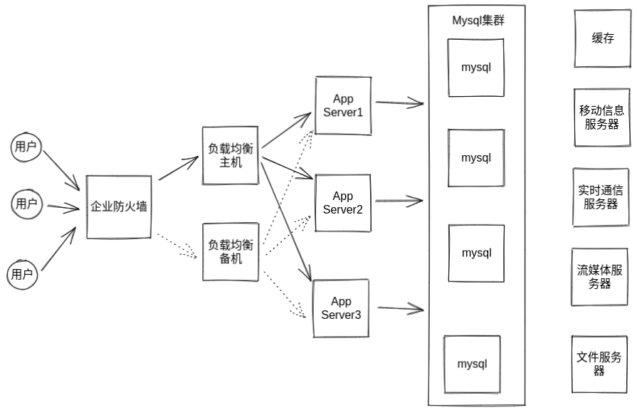


## 什么是 Nosql
&emsp;&emsp;NoSQL (NoSQL = Not Only SQL )，意即“不仅仅是SQL”，泛指非关系型的数据库。
&emsp;&emsp;随着互联网 web2.0 网站的兴起，传统的关系数据库在应付 web2.0 网站，特别是超大规模和高并发的 SNS 类型的 web2.0 纯动态网站已经显得力不从心，暴露了很多难以克服的问题，而非关系型的数据库则由于其本身的特点得到了非常迅速的发展。
&emsp;&emsp;NoSQL 数据库的产生就是为了解决大规模数据集合多重数据种类带来的挑战，尤其是大数据应用难题。


## NoSQL 特点
- 方便扩展（数据之间没有关系，很好扩展！）
- 大数据量高性能（Redis 一秒写8万次，读取11万，NoSQL的缓存记录级，是一种细粒度的缓存，性能会比较高！） 
- 数据类型是多样型的！（不需要事先设计数据库！随取随用！如果是数据量十分大的表，很多人就无法设计了！） 


### 传统 RDBMS 和 NoSQL 对比

#### 传统的 RDBMS 

- 结构化组织 
- SQL 
- 数据和关系都存在单独的表中 row col
- 数据定义语言
- 严格的一致性 - 基础的事务


#### Nosql

- 不仅仅是数据
- 没有固定的查询语言
- 键值对存储，列存储，文档存储，图形数据库（社交关系）
- 最终一致性， - CAP定理和BASE （异地多活） 
- 高性能，高可用，高可扩


## NoSQL数据库的四大分类

### 键值对存储数据库

> 这一类数据库主要会使用到一个[哈希表](http://baike.baidu.com/view/329976.htm)，这个表中有一个特定的键和一个指针指向特定的数据。Key/value模型对于IT系统来说的优势在于简单、易部署。但是如果[DBA](http://baike.baidu.com/subview/67156/5112091.htm)只对部分值进行查询或更新的时候，Key/value就显得效率低下了。[3] 举例如：Tokyo Cabinet/Tyrant, Redis, Voldemort, Oracle BDB.


### 列存储数据库

> 这部分数据库通常是用来应对分布式存储的海量数据。键仍然存在，但是它们的特点是指向了多个列。这些列是由列家族来安排的。如：Cassandra, HBase, Riak.

- HBase 
- 分布式文件系统


### 文档型数据库

> 文档型数据库的灵感是来自于Lotus Notes办公软件的，而且它同第一种键值存储相类似。该类型的数据模型是版本化的文档，半结构化的文档以特定的格式存储，比如JSON。文档型数据库可 以看作是键值数据库的升级版，允许之间嵌套键值。而且文档型数据库比键值数据库的查询效率更高。如：CouchDB, MongoDb. 国内也有文档型数据库SequoiaDB，已经开源。

- MongoDB 

    > MongoDB 是一个基于分布式文件存储的数据库，C++ 编写，主要用来处理大量的文档！ MongoDB 是一个介于关系型数据库和非关系型数据中中间的产品！
    >
    > MongoDB 是非关系型数 据库中功能最丰富，最像关系型数据库的！


### 图形(Graph)数据库

> 图形结构的数据库同其他行列以及刚性结构的 SQL 数据库不同，它是使用灵活的图形模型，并且能够扩展到多个服务器上。NoSQL 数据库没有标准的查询语言(SQL)，因此进行数据库查询需要制定数据模型。许多 NoSQL 数据库都有 REST 式的数据接口或者查询API。[2] 如：Neo4J, InfoGrid, Infinite Graph.

他不是存图形，放的是关系，比如：朋友圈社交网络，广告推荐！


&emsp;&emsp;因此，我们总结 NoSQL 数据库在以下的这几种情况下比较适用：

- 数据模型比较简单；
- 需要灵活性更强的IT系统；
- 对数据库性能要求较高；
- 不需要高度的数据一致性；
- 对于给定key，比较容易映射复杂值的环境。


## NoSQL数据库的四大分类对比

|       分类        |                   Examples 举例                    |                         典型应用场景                         |                    数据模型                     |                             优点                             |                             缺点                             |
| :---------------: | :------------------------------------------------: | :----------------------------------------------------------: | :---------------------------------------------: | :----------------------------------------------------------: | :----------------------------------------------------------: |
|   键值对数据库    | Tokyo Cabinet/Tyrant, Redis, Voldemort, Oracle BDB | 内容缓存，主要用于处理大量数据的高访问负载，也用于一些日志系统等等。 | Key 指向 Value 的键值对，通常用hash table来实现 |                          查找速度快                          |        数据无结构化，通常只被当作字符串或者二进制数据        |
|   列存储数据库    |               Cassandra, HBase, Riak               |                       分布式的文件系统                       |       以列簇式存储，将同一列数据存在一起        |         查找速度快，可扩展性强，更容易进行分布式扩展         |                         功能相对局限                         |
|   文档型数据库    |                  CouchDB, MongoDb                  | Web应用（与Key-Value类似，Value是结构化的，不同的是数据库能够了解Value的内容） |    Key-Value对应的键值对，Value为结构化数据     | 数据结构要求不严格，表结构可变，不需要像关系型数据库一样需要预先定义表结构 |            查询性能不高，而且缺乏统一的查询语法。            |
| 图形(Graph)数据库 |          Neo4J, InfoGrid, Infinite Graph           |           社交网络，推荐系统等。专注于构建关系图谱           |                     图结构                      |     利用图结构相关算法。比如最短路径寻址，N度关系查找等      | 很多时候需要对整个图做计算才能得出需要的信息，而且这种结构不太好做分布式的集群方案。 |

 


# redis 介绍
> Redis（**Re**mote **Di**ctionary **S**erver )，即远程字典服务 !

&emsp;&emsp;redis 是一个开源的使用 C 语言编写、支持网络、==可基于内存亦可持久化==的日志型、Key-Value数据库， 并提供多种语言的API。
&emsp;&emsp;和 Memcached 类似，它支持存储的 value 类型相对更多，包括 **string(字符串)、list(链表)、set(集合)、zset(sorted set 有序集合)和 hash(哈希类型)**。这些数据类型都支持 push/pop、add/remove 及取交集并集和差集及更丰富的操作，而且这些操作都是原子性的。在此基础上，redis支持各种不同方式的排序。
&emsp;&emsp;与 memcached 一样，为了保证效率，数据都是缓存在内存中。==区别的是redis 会周期性的把更新的数据写入磁盘或者把修改操作写入追加的记录文件，并且在此基础上实现了 master-slave(主从) 同步==。


### 能干嘛？

- 内存存储、持久化，内存中是断电即失、所以说持久化很重要（rdb、aof）
- 效率高，可以用于高速缓存
- 发布订阅系统
- 地图信息分析
- 计时器、计数器（浏览量！）
- …


### Redis优点

- **异常快速** : Redis 是非常快的，每秒可以执行大约110000设置操作，81000个/每秒的读取操作。

- **支持丰富的数据类型** : Redis支持最大多数开发人员已经知道如列表，集合，可排序集合，哈希等数据类型。

    这使得在应用中很容易解决的各种问题，因为我们知道哪些问题处理使用哪种数据类型更好解决。

- **操作都是原子的** : 所有 Redis 的操作都是原子，从而确保当两个客户同时访问 Redis 服务器得到的是更新后的值（最新值）。

- **MultiUtility工具**：Redis是一个多功能实用工具，可以在很多如：缓存，消息传递队列中使用（Redis原生支持发布/订阅），在应用程序中，如：Web 应用程序会话，网站页面点击数等任何短暂的数据；


### redis 安装

#### windows 下安装

**下载地址：**https://github.com/tporadowski/redis/releases。

Redis 支持 32 位和 64 位。这个需要根据你系统平台的实际情况选择，这里我们下载 [Redis-x64-5.0.9.msi](https://github.com/tporadowski/redis/releases/download/v5.0.9/Redis-x64-5.0.9.msi)直接进行安装。


#### Ubuntu 安装

```shell
sudo apt-get install redis-server
```

```shell
# 启动 Redis
redis-server
#  查看 redis 是否还在运行
redis-cli

用法：redis-cli [OPTIONS] [cmd [arg [arg ...]]]
-h <主机ip>，默认是 127.0.0.1
-p <端口>，默认是 6379
-a <密码>，如果 redis 加锁，需要传递密码
--help，显示帮助信息
```

这将打开一个 Redis 提示符，如下图所示：

```
redis 127.0.0.1:6379>
```

在上面的提示信息中：127.0.0.1 是本机的IP地址，6379是 Redis 服务器运行的端口。现在输入 PING 命令，如下图所示：

```
redis 127.0.0.1:6379> ping
PONG
```

这说明现在你已经成功地在计算机上安装了 Redis。


#### docker 安装

```shell
docker run -itd --name redis -p 6379:6379 redis
```


### redis 图形化管理界面

https://github.com/uglide/RedisDesktopManager


### redis 性能测试

#### redis-benchmark

> 官方自带的性能测试工具！

```shell
# 测试：100个并发连接 100000请求
redis-benchmark -h localhost -p 6379 -c 100 -n 100000
```


edis 性能测试工具可选参数如下所示：

| 选项                   | 描述                                       | 默认值    |
| :--------------------- | :----------------------------------------- | :-------- |
| **-h**                 | 指定服务器主机名                           | 127.0.0.1 |
| **-p**                 | 指定服务器端口                             | 6379      |
| **-s**                 | 指定服务器 socket                          |           |
| **-c**                 | 指定并发连接数                             | 50        |
| **-n**                 | 指定请求数                                 | 10000     |
| **-d**                 | 以字节的形式指定 SET/GET 值的数据大小      | 2         |
| **-k**                 | 1=keep alive 0=reconnect                   | 1         |
| **-r**                 | SET/GET/INCR 使用随机 key, SADD 使用随机值 |           |
| **-P**                 | 通过管道传输 <numreq> 请求                 | 1         |
| **-q**                 | 强制退出 redis。仅显示 query/sec 值        |           |
| **--csv**              | 以 CSV 格式输出                            |           |
| **-l（L 的小写字母）** | 生成循环，永久执行测试                     |           |
| **-t**                 | 仅运行以逗号分隔的测试命令列表。           |           |
| **-I（i 的大写字母）** | Idle 模式。仅打开 N 个 idle 连接并等待。   |           |


# 基础知识

- redis默认有16个数据库， 默认使用的是第0个。
- redis 命令不区分大小写。
- 可以使用 select 进行数据库切换。
- 清除当前数据库 `flushdb`，清除全部数据库的内容 `FLUSHALL` 。


## Redis 是单线程的
&emsp;&emsp;官方表示，Redis 是基于内存操作，CPU 不是 Redis 性能瓶颈，==Redis 的瓶颈是根据机器的内存和网络带宽==，既然可以使用单线程来实现，就使用单线程了！
&emsp;&emsp;Redis 是C 语言写的，官方提供的数据为 100000+ 的QPS，完全不比同样是使用 key-vale的 Memecache差！ 


### 为什么单线程还这么快？ 

- 误区1：高性能的服务器一定是多线程的？
- 误区2：多线程（CPU上下文会切换！）一定比单线程效率高！ 

>  先去 CPU > 内存 > 硬盘的速度要有所了解！ 


核心：

redis 是将所有的数据全部放在内存中的，所以说使用单线程去操作效率就是最高的，使用多线程时 CPU 上下文会切换：是耗时的操作！！！），**对于内存系统来说，如果没有上下文切换效率就是最高的！**多次读写都是在一个CPU上的，在使用内存情况下，这个就是最佳的方案！


## Redis 常用命令

|      命令行       |                   说明                    |        示例        |
| :---------------: | :---------------------------------------: | :----------------: |
|     redis-cli     |             打开 redis 客户端             |                    |
|      flushdb      |              清空当前数据库               |                    |
|     flushall      |       清空全部数据库，==慎用！！==        |                    |
|     help 命令     |                 获取帮助                  |     `help set`     |
|      select       |                切换数据库                 |     `select 3`     |
|      DBSIZE       |            查看当前数据库大小             |                    |
|      keys *       |            查看数据库所以的key            |      `keys *`      |
|     exists 键     |          检测数据库是否存在该键           |   `exists key1`    |
|      type 键      |            获取键对应值的类型             |    `type key1`     |
| rename 键 newname |            对redis的name重命名            | `rename key1 key2` |
|  expire 键 time   | 为某个 redis 的某个 name 设置超时时间(秒) |  `expire key1 10`  |
|      ttl 键       |           查看当前 key 剩余时间           |     `ttl key1`     |
|    move 键 db     |      将redis的某个值移动到指定的db下      |   `move name 1`    |
|      del 键       |   根据 name 删除 redis 中的任意数据类型   |     `del key1`     |

```shell
# 设置值
set key value ex 3				# 3 秒后过期
set key value px 3000			# 3 秒后过期

# 获取值, 根据模型获取redis的name
keys(pattern='*')
# KEYS * 匹配数据库中所有 key 。
# KEYS h?llo 匹配 hello ， hallo 和 hxllo 等。
# KEYS h*llo 匹配 hllo 和 heeeeello 等。
# KEYS h[ae]llo 匹配 hello 和 hallo ，但不匹配 hillo

get key
get key *						# 获取所有的键

# 随机获取一个redis的name（不删除）
randomkey()

# 同字符串操作，用于增量迭代获取key
scan(cursor=0, match=None, count=None)
scan_iter(match=None, count=None)
```


## 五大数据类型


### 字符串(String)

- [String 命令中文官网链接](https://www.redis.net.cn/order/3544.html)
- [String 命令官网链接](https://redis.io/commands/append)


#### 设置值

##### set

> 设置键来保存字符串值。如果 key 已经保存了一个值，那么不管它的类型如何，它都会被==覆盖==。

```shell
set(name, value, ex=None, px=None, nx=False, xx=False)
```


在Redis中设置值，默认不存在则创建，存在则修改，参数：

```shell
SET key value [expiration EX seconds|PX milliseconds] [NX|XX]

ex，过期时间（秒）
px，过期时间（毫秒）
nx，如果设置为 True，则只有 name 不存在时，当前set操作才执行
xx，如果设置为 True，则只有 name 存在时，岗前set操作才执行
```


###### 返回值

- OK

    > 如果 SET 正确执行，确定。

- nil

    > 如果 SET 操作没有执行。（因为用户指定了 NX 或 XX 选项，但没有满足条件。）


###### 示例：

```shell
set name1 "lin"				# 不会自动过期
set name "lin" ex 5			# 5 秒后过期
set name "lin" px 5000		# 5 秒后过期
set name1 "lin" nx			# name1 有值时无法执行
set name1 "lin1" xx			# name1 有值时可以执行(修改值)
```


##### setnx

> **SET** if **N**ot e**X**ists

```shell
setnx(name, value)
```

设置值，只有 name 不存在时，执行设置操作（添加）


##### setex
> SET mykey value **EX**PIRE mykey seconds

```shell
setex(name, value, time)
```

设置值以及值的过期时间（数字秒 或 timedelta 对象）


#####  psetex


```shell
psetex(name, time_ms, value)
```

设置值，time_ms，毫秒级过期时间（数字毫秒 或 timedelta 对象）


##### mset

> **M**ulti set


```shell
mset(*args, **kwargs)
```

- **批量设置值**。用新值替换现有值，就像常规的 SET 一样.

    ```shell
    # 如：
    mset(k1='v1', k2='v2')
    # 或
    mget({'k1': 'v1', 'k2': 'v2'})
    ```

- **MSET 是原子的**，因此所有给定的键都是同时设置的。

    > 客户机不可能看到一些密钥已经更新，而其他密钥没有更新。


###### 返回值

简总是`OK`因为 MSET 不能失败。


###### 示例：

```shell
mset name lin age 18
```


##### msetnx

> **M**ulti set value is **N**ot **E**xist

- 当所有给定 key 都不存在时，同时设置一个或多个 key-value 对。

```shell
MSETNX key1 value1 key2 value2 .. keyN valueN 
```


###### 返回值

当所有 key 都成功设置，返回 1 。 

如果所有给定 key 都设置失败(至少有一个 key 已经存在)，那么返回 0 。


###### 示例

```shell
# 对不存在的 key 进行 MSETNX
127.0.0.1:6379> msetnx key1 val1 key2 val2
(integer) 1

# 给定 key 当中有已存在的 key
127.0.0.1:6379> msetnx key2 val2 key3 val3
(integer) 0
127.0.0.1:6379> mget key1 key2 key3
1) "val1"
2) "val2"
3) (nil)
```


##### setbit

> 用于对 key 所储存的字符串值，设置或清除指定偏移量上的位(bit)。

```shell
setbit(name, offset, value)
```

```shell
# 参数：
name:		redis的name
offset:		位的索引（将值变换成二进制后再进行索引）
value:		值只能是 1 或 0

# 注：如果在Redis中有一个对应： n1 = "foo"，
  那么字符串foo的二进制表示为：01100110 01101111 01101111
所以，如果执行 setbit('n1', 7, 1)，则就会将第7位设置为1，
  那么最终二进制则变成 01100111 01101111 01101111，即："goo"
```

示例：

```shell
setbit name 7 1
```


#### 获取值

##### get

获取键的值。

```shell
GET key
```


###### 返回值

- 键的值

- nil

    > 如果键不存在，则返回特殊值 nil。

- Error

    > 如果键存储的值不是字符串，则返回错误，因为 GET 只处理字符串值。


###### 示例

```shell
get key1
```


##### getdel

> **get** the value of key and **del**ete the key.

```shell
GETDEL key
```

获取键的值并删除键。这个命令类似于 GET，只是它在成功时也会删除键(当且仅当键的值类型是字符串)。


###### 返回值

- 键的值

- nil

    > 如果键不存在，则返回特殊值 nil。

- Error

    > 如果键存储的值不是字符串，则返回错误。


###### 示例

```shell
getdel key1
```


##### mget

```shell
mget(keys, *args)
```


批量获取

```shell
# 如：
mget('ylr', 'wupeiqi')
# 或
r.mget(['ylr', 'wupeiqi'])
```

示例：

```shell
mget name age
```


##### getrange

> 获取子序列(根据字节获取，非字符)。

```shell
GETRANGE key start end

start，起始位置（字节）
end，结束位置（字节）
```

- 可以使用负偏移量来提供从字符串末尾开始的偏移量。

    > 所以-1表示最后一个字符,-2表示倒数第二个字符等等。

- 该函数通过将结果范围限制为字符串的实际长度来处理超出范围的请求。


###### 返回值

截取得到的子字符串。


示例

```shell
getrange name1 0 2  
getrange name1 0 -1			# 取到最后一位数  
```


##### getbit

```shell
GETBIT key offset

# offset：  偏移量
```

获取name对应的值的二进制表示中的某位的值 （0或1）

```shell
getbit name 7
# 字符串 goo 的二进制表示为：01100111 01101111 01101111
# 所以，第7位为1, 第0位为0
```


##### bitcount

> bitcount(key, start=None, end=None)

获取name对应的值的二进制表示中 1 的个数

```shell
key:		Redis的name
start:		位起始位置
end:		位结束位置
```

示范：

```shell
bitcount name
bitcount name 0 0
bitcount name 0 1
```


#### 更新值

##### getset

设置指定 key 的值，并返回 key 旧的值。

```shell
GETSET key val
```


###### 返回值

- 返回给定 key 的旧值。

-  nil

    > 当 key 没有旧值时，即 key 不存在时，返回 nil 。

- error

    > 当 key 存在但不是字符串类型时，返回一个错误。


###### 示例

```shell
getset age 19
```


##### getex

> **get** the value of key and optionally set its **ex**piration.

```shell
GETEX key [EX seconds|PX milliseconds|EXAT timestamp|PXAT milliseconds-timestamp|PERSIST]

# EX seconds：                设置指定的过期时间(秒)
# PX milliseconds：           设置指定的过期时间，以毫秒为单位
# EXAT timestamp-seconds      设置指定的密钥过期的 Unix 时间，以秒为单位
# PXAT timestamp-milliseconds 设置指定的密钥过期的 Unix 时间，以毫秒为单位
# PERSIST                      删除与钥匙相关的居住时间
```

获取键的值并可以选择设置其过期时间。


###### 返回值

- 鍵的值

- nil

    > key 不存在时为 nil


示例

```shell
getex key1 ex 20    # 获取 key1 的值并设置 key1 20 秒后过期
```


##### append

> 在 redis 键对应的值后面追加内容

```shell
APPEND key value
# key:			redis 的 key
# value:		要追加的字符串
```

- 如果 key 已经存在并且是一个字符串，则该命令将该值追加到字符串的末尾。

- 如果键不存在，则创建该键并将其设置为空字符串

    > 在这种特殊情况下，APPEND 类似于 SET。


###### 返回值

追加指定值之后， key 中字符串的长度。


###### 示例：

```shell
append key1 val1
```


##### setrange

> 修改字符串内容，从指定字符串索引开始向后替换（新值太长时，则向后添加）

```shell
SETRANGE key offset value 

# offset:		字符串的索引，字节（一个汉字三个字节）
# value:		要设置的值
```

- 从指定的偏移量开始，覆盖存储在键处的字符串的一部分，覆盖整个值的长度。
- 如果偏移量大于按键处字符串的当前长度，则用==零字节填充字符串==，以使偏移量适合。
- 不存在的键被认为是空字符串，所以这个命令将确保它保存的字符串足够大，可以在偏移量处设置值。
- 请注意，您可以设置的最大偏移量为229-1(536870911) ，因为 Redis string 限制为512兆字节。如果您需要增长超过这个大小，您可以使用多个键。


###### 返回值

字符串被命令修改后的长度。


###### 示例：

```shell
setrange name1 3 2
setrange name1 3 22222222
```


#### 特殊

##### strlen

```shell
STRLEN key
```

- 返回 name 对应值的字节长度（一个汉字3个字节）
- 当 key 储存的不是字符串值时，返回一个错误。


###### 返回值

字符串值的长度。 当 key 不存在时，返回 0。


###### 示例

```shell
strlen key1
```

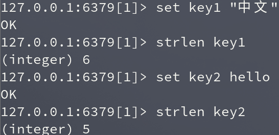


##### incr

> Increments the number stored at `key` by one.

- 将 key 中储存的数字值增一。

- 如果 key 不存在，那么 key 的值会先被初始化为 0 ，然后再执行 INCR 操作。

- 如果值包含错误的类型，或字符串类型的值不能表示为数字，那么返回一个错误。

```shell
INCR key
```


###### 返回值

- 执行命令之后 key 的值。

- ERROR

    > 值包含错误的类型， 如字符串等等


###### 示例：

```shell
incr age
```


##### incrby

> **Incr**ements the number stored at key **by** increment

- 将 key 所储存的值加上指定的增量值。

- 未设置减量值时也会报错，其余与 DECR 无差别。

```shell
INCRBY key AMOUNT
```


###### 返回值

- 执行命令之后 key 的值。

- ERROR

    > 值包含错误的类型， 如字符串等等
    >
    > 未设置增量值时也会报错


###### 示例

```shell
incrby key1 2
```

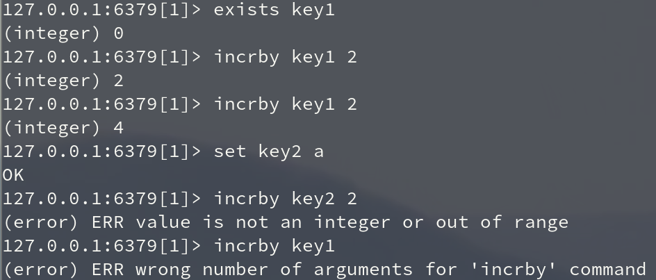


##### incrbyfloat

> **Incr**ement the string representing a **float**ing point number stored at key **by** the specified increment.

- 为 key 中所储存的值加上指定的浮点数增量值。

- 如果 key 不存在，会先将 key 的值设为 0 ，再执行加法操作。


###### 返回值

- 执行命令之后 key 的值。

- ERROR

    > 值包含错误的类型， 如字符串等等
    >
    > 未设置增量值时也会报错


###### 示例：

```shell
incrbyfloat age 5
incrbyfloat age 1.1
incrbyfloat age -2.1
incrbyfloat age 5.0e3
```


##### decr

> Decrements the number stored at `key` by one

```shell
DECR key
```

- 将 key 中储存的数字值减一。

- 如果 key 不存在，那么 key 的值会先被初始化为 0 ，然后再执行 DECR 操作。

- 如果值包含错误的类型，或字符串类型的值不能表示为数字，那么返回一个错误。

- 本操作的值限制在 64 位(bit)有符号数字表示之内。


###### 返回值

- 执行命令之后 key 的值。

- ERROR

    > 值包含错误的类型， 如字符串等等


###### 示例：

```shell
decr age
```


##### decrby

> **Decr**ements the number stored at key **by** decrement.

```shell
DECRBY key amount

# amount 减量值
```

- 将 key 所储存的值减去指定的减量值。

- 未设置减量值时也会报错，其余与 DECR 无差别。


###### 返回值

- 执行命令之后 key 的值。

- ERROR

    > 值包含错误的类型， 如字符串等等
    >
    > 未设置减量值时也会报错


###### 示例

```shell
decrby key1 2
```


##### lcs

> **L**ongest **C**ommon **S**ubsequence

- LCS 命令实现最长公共子序列算法。

    > 注意，这不同于最长的公共字符串算法，因为字符串中的匹配字符不需要是连续的。例如:
    >
    > `foo` 和 ` fao` 之间的 LCS 是 ` fo`，因为从左向右扫描两个字符串，最长的公共字符集由第一个 `f` 和第二个 `o` 组成。

- LCS 对于评估两个字符串的相似程度非常有用。字符串可以代表很多东西。

    > 例如，如果两个字符串是 DNA 序列，LCS 将提供两个 DNA 序列之间的相似性度量。如果字符串表示某个用户编辑的某个文本，那么 LCS 可以表示新文本与旧文本之间的差异，等等。


###### 时间复杂度

```shell
O(N*M)
```

其中 n 是第一个字符串的长度，m 是第二个字符串的长度。因此，要么选择另一个 Redis 实例以运行此算法，要么确保以非常小的字符串运行它。


###### 示例

==未使用成功==

```shell
> MSET key1 ohmytext key2 mynewtext
OK
> LCS key1 key2
(error) ERR unknown command `LCS`, with args beginning with: `key1`, `key2`,
```


### 列表(List)

- [List 命令中文官网链接](https://www.redis.net.cn/order/3577.html)


List操作，redis 中的 List 在内存中按照一个 name 对应一个 List 来存储。如图：


- Redis列表是简单的字符串链表，按照插入规则(before node after，left，right)进行操作。
- 如果 key 不存在，则创建新的链表， 如果 key 存在则新增内容。
- 在两边插入和改动值效率最高！
- 一个列表最多可以包含 232 - 1 个元素 (4294967295, 每个列表超过40亿个元素)。


#### 设置值

##### lpush

在 name 对应的 list 中添加元素，每个新的元素都添加到列表的最左边

```shell
LPUSH key value1 value2 ... valueN

# 保存顺序为： 第一个 value 会被先放进列表头
# valueN ... value2 value1
```

- 将一个或多个值插入到列表头部。 
- 如果 key 不存在，一个空列表会被创建并执行 LPUSH 操作。
-  当 key 存在但不是列表类型时，返回一个错误。


###### 返回值

- 执行 LPUSH 命令后，列表的长度。


######  示例：

```shell
lpush list1 1 2 3 4 5 6 7 8 9
```


##### lpushx

> Ionly if `key` already e**x**ists and holds a list. In contrary to **LPUSH**

在 name 对应的 list 中添加元素，只有 name 已经存在时，值添加到列表的最左边；否则什么都不干

```shell
LPUSHX key value1 value2 ... valueN

# 保存顺序为： 第一个 value 会被先放进列表头
# valueN ... value2 value1
```


###### 返回值

执行之后，返回列表的长度。


###### 示例

```shell
lpushx list2 10
```


##### rpush

在 name 对应的 list 中添加元素，每个新的元素都添加到列表的最右边

```shell
RPUSH key value1 value2 ... valueN

# 保存顺序为： 第一个 value 会被先放进列表尾
# value1 value2 ... valueN
```

- 将一个或多个值插入到列表的尾部(最右边)。

- 如果列表不存在，一个空列表会被创建并执行 RPUSH 操作。
-  当列表存在但不是列表类型时，返回一个错误。

**注意：**在 Redis 2.4 版本以前的 RPUSH 命令，都只接受单个 value 值。


###### 返回值

执行 RPUSH 操作后，列表的长度。


######  示例：

```shell
rpush list2 1 2 3 4 5 6 7 8 9
```


##### rpushx

> Ionly if `key` already e**x**ists and holds a list. In contrary to **RPUSH**

在 name 对应的 list 中添加元素，只有 name 已经存在时，值添加到列表的最右边；否则什么都不干

```shell
RPUSHX key value1 value2 ... valueN

# 保存顺序为： 第一个 value 会被先放进列表尾
# value1 value2 ... valueN
```


###### 返回值

执行之后，返回列表的长度。


###### 示例

```shell
> exists key1
(integer) 0
> rpushx key1 val1			# 不存在的key不会操作， 返回空列表长度 0
(integer) 0
> lrange key1 0 -1
(empty array)
> rpush key1 val1 val2
(integer) 2
> rpushx key1 val3
(integer) 3
> lrange key1 0 -1
1) "val1"
2) "val2"
3) "val3"
```


##### linsert

在 name 对应的列表的某一个值前或后插入一个新值

```shell
LINSERT key [BEFORE|AFTER] existing_value new_value

# [BEFORE|AFTER]：    在 existing_value 之前或之后插入值
# existing_value:     已存在的值(标杆值)，（会在它前面或后面插入数据）
# new_value： 		 待插入的值
```

如果列表内有多个 existing_value 值， 每次 linsert 只会在左边第一个插入


###### 返回值

- 如果命令执行成功，返回插入操作完成之后，列表的长度。
-  如果没有找到指定元素 ，返回 -1 。
- 如果 key 不存在或为空列表，返回 0 。


###### 示例

```shell
> exists key1
(integer) 0
> linsert key1 before 0 0    # key 不存在或为空列表，返回 0 
(integer) 0
> rpush key1 1 2 2 3
(integer) 4
> lrange key1 0 -1
1) "1"
2) "2"
3) "2"
4) "3"
> linsert key1 before 2 0  
(integer) 5
> linsert key1 before 2 0
(integer) 6
> lrange key1 0 -1          # 列表内有多个标杆值， 每次只会在左边第一个插入
1) "1"
2) "0"
3) "0"
4) "2"
5) "2"
6) "3"
> linsert key1 after 4 0   # 没有找到指定元素 ，返回 -1 
(integer) -1
```


#### 获取值

##### lrange

返回列表中指定区间内的元素

```shell
LRANGE key start end

# 参数：
# start:		索引的起始位置
# end:			索引结束位置
```

- 返回列表中指定区间内的元素，区间以偏移量 START 和 END 指定。 
- 其中 0 表示列表的第一个元素， 1 表示列表的第二个元素，以此类推。 
- 你也可以使用负数下标，以 -1 表示列表的最后一个元素， -2 表示列表的倒数第二个元素，以此类推。


###### 返回值

一个列表，包含指定区间内的元素。


###### 示例

```shell
lrange list1 0 -1
lrange list1 -9 -1
lrange list1 -2 -1
```


##### lindex

通过索引获取列表中的元素。

```shell
LINDEX key index

# index: 列表下标
```


###### 返回值

- 列表中下标为指定索引值的元素。 

- nil

    > 如果指定索引值不在列表的区间范围内，返回 nil 


###### 示例

```shell
 lindex list3 1
```


#### 更新值

##### lset

> list set

对 name 对应的 list 中的某一个索引位置重新赋值

```shell
LSET key index value

# 参数：
# index：		list 的索引位置
# value：		要设置的值
```

当索引参数超出范围，或对一个空列表进行 LSET 时，返回一个错误。


###### 返回值

- ok

    > 操作成功

- Error

    > 当索引参数超出范围，或对一个空列表进行 LSET 时，返回一个错误。


###### 示例

```shell
lrange list3 0 -1
```


##### rpoplpush

从一个列表取出最右边的元素，同时将其添加至另一个列表的最左边.

```shell
RPOPLPUSH src_key dst_key

# src_key:		要取数据的列表的 name
# dst_key:		要添加数据的列表的 name
```

- 当 src 为空时返回返回 nil， 不进行任何操作
- 当 src 有值而 dst 无值时会新建一个空列表赋于 dst 存值


###### 返回值

- 返回操作的值

- nil

    > 当key 为空列表时返回 nil

    


###### 示例

```shell
rpoplpush key1 key2
```


##### brpoplpush

从列表中弹出一个值，将弹出的元素插入到另外一个列表中并返回它； 如果列表没有元素会阻塞列表直到等待超时或发现可弹出元素为止。

```shell
BRPOPLPUSH src_key dst_key timeout 

# src_key:		要取数据的列表的 name
# dst_key:		要添加数据的列表的 name
# timeout:		超时时间
# 				当元素所有列表的元素获取完之后，阻塞等待列表内有数据的时间（秒）, 
# 				0 表示永远阻塞
```


###### 返回值

- [nil, timeout]

    > 假如在指定时间内没有任何元素被弹出，则返回一个 nil 和等待时长

- [key， wait_time]

    > 不未空时，返回一个含有两个元素的列表：
    >
    > 第一个元素是被弹出元素所属的值。
    >
    > 第二个元素是等待时长。


###### 示例

```shell
brpoplpush key1 key2 1
```


#### 删除值

##### lrem

> 在对应的 list 中删除指定的值

```shell
LREM key count value

# value： 	要删除的值
# count：  	
# 			count = 0，删除列表中所有与 value 相等的值；
# 			count > 0, 从前到后，移除与 value 相等的元素，数量为 count；
# 			count < 0,从后向前，移除与 value 相等的元素，数量为 count；
```


###### 返回值

- 被移除元素的数量。 
- 列表不存在时返回 0 。


示例：

```shell
lrem list1 2 val1
```


##### lpop

移除并返回列表左边的第 count个元素。

```shell
LPOP key [count]

# count： 可选参数；移除几个元素
```

- count 超出列表长度时， 按列表最长长度移除


###### 返回值

- nil

    > 当 key 不存在时为 nil。

- 移除的元素

    > 当不带 count 参数调用时：批量字符串：返回第一个元素的值。
    >
    > 当使用 count 参数调用时：数组：返回弹出元素的列表


示例

```shell\
lpop key1 1
```


##### rpop

移除并返回列表右边的第 count 个元素。

```shell
RPOP key [count]

# count： 可选参数；移除几个元素
```

- count 超出列表长度时， 按列表最长长度移除


###### 返回值

- nil

    > 当 key 不存在时为 nil。

- 移除的元素

    > 当不带 count 参数调用时：批量字符串：返回第一个元素的值。
    >
    > 当使用 count 参数调用时：数组：返回弹出元素的列表


###### 示例

```shell
lpop key1 
lpop key1 2
```


##### blpop

> It is the **B**locking version of **LPOP** 

移出并获取列表的第一个元素， 如果列表没有元素会阻塞列表直到等待超时或发现可弹出元素为止。

```shell
BLPOP key1 key2 .. keyN timeout

# timeout:		超时时间
# 				当元素所有列表的元素获取完之后，阻塞等待列表内有数据的时间（秒）, 
# 				0 表示永远阻塞
```

将多个列表排列，按照从左到右去 pop 对应列表的元素


###### 返回值

- nil

    > 如果列表为空，返回一个 nil 。 

- [key， value]

    > 不未空时，返回一个含有两个元素的列表：
    >
    > 第一个元素是被弹出元素所属的 key 。
    >
    > 第二个元素是被弹出元素的值。


###### 示例

```shell
blpop key1 key2 1
```


 

##### brpop

> It is the **B**locking version of **RPOP** 

移出并获取列表的最后一个元素， 如果列表没有元素会阻塞列表直到等待超时或发现可弹出元素为止。

```shell
BRPOP key1 key2 .. keyN timeout

# timeout:		超时时间
# 				当元素所有列表的元素获取完之后，阻塞等待列表内有数据的时间（秒）, 
# 				0 表示永远阻塞
```

将多个列表排列，按照从右到左去 pop 对应列表的元素


###### 返回值

- nil

    > 如果列表为空，返回一个 nil 。 

- [key， value]

    > 不未空时，返回一个含有两个元素的列表：
    >
    > 第一个元素是被弹出元素所属的 key 。
    >
    > 第二个元素是被弹出元素的值。


###### 示例

```shell
brpop key1 key2 1
```


#### 特殊

##### llen

返回列表的长度。 

```shell
LLEN key
```

-  如果列表 key 不存在，则 key 被解释为一个空列表，返回 0 。 
- 如果 key 不是列表类型，返回一个错误。


###### 返回值

列表的长度。


###### 示例：

```shell
llen list1
```


##### ltrim

 对一个列表进行修剪(trim)，就是说，让列表只保留指定区间内的元素，不在指定区间之内的元素都将被删除

```shell
LTRIM key start stop

# start：		索引的起始位置
# stop：			索引结束位置
```

- 切片。在 name 对应的列表中移除没有在 `start-stop` 索引之间的值
- 下标 0 表示列表的第一个元素，以 1 表示列表的第二个元素，以此类推。
-  你也可以使用负数下标，以 -1 表示列表的最后一个元素， -2 表示列表的倒数第二个元素，以此类推。


###### 返回值

命令执行成功时，返回 ok 。


###### 示例：

```shell
> exists key1
(integer) 0
> ltrim key1 0 -1				# 修建不存在的列表
OK
> rpush key1 0 1 2 3 4 5 6
(integer) 7
> ltrim key1 1 3
OK
> lrange key1 0 -1
1) "1"
2) "2"
3) "3"
> ltrim key1 0 -1
OK
> lrange key1 0 -1
1) "1"
2) "2"
3) "3"
> ltrim key1 0 10				# 修剪的长度大于列表时不操作
OK
> lrange key1 0 -1
1) "1"
2) "2"
3) "3"
> ltrim key1 -1 0				# 反序修剪
OK
> lrange key1 0 -1
```


### 集合(Set)

set 操作，set 集合就是不允许重复的列表

- [官方中文操作文档](https://www.redis.net.cn/order/3594.html)


#### 设置值

##### sadd

将一个或多个成员元素加入到集合中，已经存在于集合的成员元素将被忽略。

```shell
SADD key value1 value2 .. valueN
```

- 假如集合 key 不存在，则创建一个只包含添加的元素作成员的集合。
- 当集合 key 不是集合类型时，返回一个错误。


###### 注意：

- 在Redis2.4版本以前， SADD 只接受单个成员值。


###### 返回值

- 被添加到集合中的新元素的数量，不包括被忽略的元素。


示例：

```shell
> sadd key1 1 2 2 4
(integer) 3
```


#### 获取值

##### smembers

返回集合中的所有的成员。 不存在的集合 key 被视为空集合。

```shell
SMEMBERS key
```


###### 返回值

- 集合中的所有成员。


示例：

```shell
smembers key1
```


##### srandmember


```shell
SRANDMEMBER key [count]

# count:		返回一个包含 count 个元素的数组
```

- 如果 count 大于等于集合基数，那么返回整个集合。
- 如果 count 为正数，且小于集合基数，那么命令返回一个包含 count 个元素的数组，数组中的元素==各不相同==。
- 如果 count 为负数，那么命令返回一个数组，==数组中的元素可能会重复出现多次==，而数组的长度为 count 的绝对值。


###### 注意

从 Redis 2.6 版本开始， Srandmember 命令接受可选的 count 参数


###### 返回值

- nil

    > 如果集合为空，返回 nil 

- value

    > 只提供集合 key 参数时，返回一个元素

- [value1, value2]

    > 如果提供了 count 参数，那么返回一个数组；如果集合为空，返回空数组。


> srandmember(name, numbers)

从name对应的集合中随机获取 numbers 个元素

示例：

```shell
> exists key1
(integer) 0
> srandmember key1			# 如果集合为空，返回 nil
(nil)
> srandmember key1 1		# 如果提供了 count 参数，并且集合为空，返回空数组。
(empty array)
> sadd key1 1 2 3 4 5 6
(integer) 6
> srandmember key1 3		# count 为正数且小于集合基数，返回一个包含 count 个元素的数组，数组中的元素各不相同。
1) "1"
2) "5"
3) "3"
> srandmember key1 -4		# count 为负数，返回一个数组，数组中的元素可能会重复出现多次，而数组的长度为 count 的绝对值。
1) "1"
2) "1"
3) "4"
4) "4"
```


##### sismember

判断成员元素是否是集合的成员。

```shell
SISMEMBER key value
```


###### 返回值

- 如果成员元素是集合的成员，返回 1 。
-  如果成员元素不是集合的成员，或 key 不存在，返回 0 。


###### 示例

```shell
 sismember set3 1
```


##### sscan

用于迭代集合键中的元素。

```shell
SSCAN KEY cursor [MATCH pattern] [COUNT count]

# cursor - 游标。
# pattern - 匹配的模式。
# count - 指定从数据集里返回多少元素，默认值为 10 。
```

- 用于增量迭代，分批获取元素，避免内存消耗太大。

    > 每次调用只返回少量的元素，因此可以在生产环境中使用它们，而不会出现 KEYS 或 SMEMBERS 等命令的缺点，这些命令可能会长时间(甚至几秒钟)阻塞服务器，而这些命令是针对大量的键或元素集合调用的。


###### 注意

- 迭代过程中值会发生改变

    > 尽管像 SMEMBERS 这样的阻塞命令能够在给定的时刻提供 Set 中的所有元素，SCAN 命令家族只能提供有限的返回元素的保证，因为我们==在迭代过程中增量迭代的集合可以改变==。

- count选项后面跟的数字**并不是意味着每次返回的元素数量，而是scan命令每次遍历字典槽的数量**

    [Redis 中 scan 命令太坑了，千万别乱用！！](https://segmentfault.com/a/1190000039936716)

    

    

    ==在使用`scan`命令的时候，如果需要迭代的遍历，需要每次调用都需要使用上一次这个调用返回的游标作为该次调用的游标参数，以此来延续之前的迭代过程。==


###### 返回值

- [游标位置, [val1, val2]]

    > 返回一个数组，第一项为游标的位置，第二项是key的列表。
    >
    > 如果游标到达了末尾，第一项会返回0。


###### 示例

> TODO: 被count 整懵了

```shell
> exists key1
(integer) 0
> sscan key1 0     				# 游标为0, 空列表
1) "0"
2) (empty array)
> sadd key1 google taobao yahoo tianmao oppo
(integer) 5
> sscan key1 0	
1) "0"
2) 1) "google"
   2) "tianmao"
   3) "yahoo"
   4) "taobao"
   5) "oppo"
> sscan key1 0 count 2
1) "3"
2) 1) "google"
   2) "tianmao"
> sscan key1 3 count 2
1) "0"
2) 1) "yahoo"
   2) "taobao"
   3) "oppo"
> sscan key1 3 match *o* count 2
1) "0"
2) 1) "yahoo"
   2) "taobao"
   3) "oppo"
>
```


#### 删除值

##### srem

移除集合中的一个或多个成员元素，不存在的成员元素会被忽略。

```shell
SREM key val1 val2 .. valN
```

当 key 不是集合类型，返回一个错误。


###### 注意

- 在 Redis 2.4 版本以前， SREM 只接受单个成员值。


###### 返回值

被成功移除的元素的数量，不包括被忽略的元素。


###### 示例

```shell
srem key1 val1 val2
```


##### spop

用于移除集合中的指定 key 的一个或多个随机元素，移除后会返回移除的元素。

```shell
SPOP key [count]
```


###### 返回值

- nil

    >  当集合不存在或是空集时，返回 nil 。

- value

    > 被移除的随机元素。

- [val1, value2]

    > 当count > 0时


示例：

```shell
spop set2
spop set2 2
```


#### 特殊

##### scard

> Returns the **s**et **card**inality (number of elements) of the set stored at `key`.

```shell
SCARD key
```

返回集合中元素的数量。


###### 返回值

- 集合的数量。 

    >  当集合 key 不存在时，返回 0 。


###### 示例

```shell
scard set1
```


##### sdiff

返回给定集合之间的差集。不存在的集合 key 将视为空集。

```shell
SDIFF first_key other_key1 other_key2 .. other_keyN 
```

返回在第一个对应的集合中且不在其他 对应的集合的元素集合


###### 返回值

- 包含差集成员的列表。


###### 示例

```shell
sdiff key1 key2 key3
```


##### sdiffstore

将给定集合之间的差集存储在指定的集合中。如果指定的集合 key 已存在，则会被覆盖。

```shell
SDIFFSTORE destination_key first_key other_key1 other_key2 .. other_keyN 
```

获取第一个 name 对应的集合中且不在其他 name 对应的集合，再将其新加入到 dest 对应的集合中


###### 返回值

结果集中的元素数量。


###### 示例

```shell
> exists result key1 key2
(integer) 0
> sadd result val1 val2
(integer) 2
> sdiffstore result key1 key2      # result 的值被覆盖了
(integer) 0
> smembers result
(empty array)
> sadd key1 1 2 3 4
(integer) 4
> sadd key2 1 2 3
(integer) 3
> sdiffstore result key1 key2
(integer) 1
> smembers result
1) "4"
```


##### sinter

返回给定所有给定集合的交集。

```shell
SINTER key1 key2 .. keyN
```

- 不存在的集合 key 被视为空集。
- 当给定集合当中有一个空集时，结果也为空集(根据集合运算定律)。


###### 返回值

- 交集成员的列表。


###### 示例

```shell
sinter key1 key2
```


##### sinterstore

将给定集合之间的交集存储在指定的集合中。

```shell
SINTERSTORE dest_key key1 key2 .. keyN
```

获取多个或一个对应集合的并集，再将其加入到 dest 对应的集合中


###### 返回值

- 交集成员的数量。


###### 示例

```shell
sinterstore set3 set1 set2
```


##### sunion

返回给定集合的并集。不存在的集合 key 被视为空集。

```shell
SUNION key1 key2 .. keyN
```

不存在的集合 key 被视为空集。


###### 返回值

- 并集成员的列表。


###### 示例

```shell
sunion set1 set2
```


##### sunionstore

将给定集合的并集存储在指定的集合 destination 中。

```shell
SUNIONSTORE dest_key key1 key2 .. keyN
```

获取多个或一个对应的集合的并集，并将结果保存到 dest 对应的集合中


###### 返回值

结果集中的元素数量。


###### 示例

```shell
 sunionstore set3 set2 set1
# 获取set2 和 set1 的并集，并将结果保存到 set3 对应的集合中
```


##### smove

将某个成员从一个集合中移动到另外一个集合

```shell
SMOVE source_key dest_key value
```

- SMOVE 是原子性操作。
- 如果 source 集合不存在或不包含指定的 member 元素，则 SMOVE 命令不执行任何操作，仅返回 0 。否则， member 元素从 source 集合中被移除，并添加到 destination 集合中去。
- 当 destination 集合已经包含 member 元素时， SMOVE 命令只是简单地将 source 集合中的 member 元素删除。
- 当 source 或 destination 不是集合类型时，返回一个错误。


###### 返回值

- 如果成员元素被成功移除，返回 1 。 
- 如果成员元素不是 source 集合的成员，并且没有任何操作对 destination 集合执行，那么返回 0 。


###### 示例

```shell
smove key1 key2 value1
```


### 有序集合(Zset)

&emsp;&emsp;在集合的基础上，为元素排序；元素的排序需要根据另外一个值来进行比较，所以，对于有序集合，每一个元素有两个值，即：值和权重，权重专门用来做排序。


#### 添加值

##### zadd

将一个或多个成员元素及其权重加入到有序集当中。

```shell
ZADD key score1 value1 score2 value2 ... scoreN valueN

# score: 		分数值可以是整数值或双精度浮点数。
```

- 如果某个成员已经是有序集的成员，那么更新这个成员的分数值，并通过重新插入这个成员元素，来保证该成员在正确的位置上。
- 如果有序集合 key 不存在，则创建一个空的有序集并执行 ZADD 操作。
- 当 key 存在但不是有序集类型时，返回一个错误。
- 权重越高越靠后。


###### 注意

 在 Redis 2.4 版本以前， ZADD 每次只能添加一个元素。


###### 返回值

- 被成功添加的新成员的数量，不包括那些被更新的、已经存在的成员。


###### 示例

```shell
zadd zset1 10 A
# 添加内容 A 到 zset1， 权重为10
```


#### 获取值

##### zrange

返回有序集中指定区间内的成员， 其中成员的位置按分数值递增(从小到大)来排序。。

```shell
ZRANGE key start stop [WITHSCORES]

# start：		有序集合索引起始位置（非分数）
# end：			有序集合索引结束位置（非分数）
# withscores：	是否获取元素的分数，默认只获取元素的值
```

- 具有相同分数值的成员按字典序(lexicographical order )来排列。

- 下标参数 start 和 stop 都以 0 为底，也就是说，以 0 表示有序集第一个成员，以 1 表示有序集第二个成员，以此类推。
- 你也可以使用负数下标，以 -1 表示最后一个成员， -2 表示倒数第二个成员，以此类推。


###### 返回值

指定区间内，带有分数值(可选)的有序集成员的列表。


###### 示例

```shell
zrange zset1 0 -1
zrange zset1 0 -1 withscores
```


##### zrevrange

返回有序集中指定区间内的成员，其中成员的位置按分数值递减(从大到小)来排列。

```shell
ZREVRANGE key start stop [WITHSCORES]

# start：		有序集合索引起始位置（非分数）
# end：			有序集合索引结束位置（非分数）
# withscores：	是否获取元素的分数，默认只获取元素的值
```

- 具有相同分数值的成员按字典序的逆序(reverse lexicographical order)排列。

- 除了成员按分数值递减的次序排列这一点外， ZREVRANGE 命令的其他方面和 ZRANGE 命令一样。


###### 返回值

指定区间内，带有分数值(可选)的有序集成员的列表。


###### 示例

```shell
zrevrange zset1 0 -1
```


##### zrangebyscore

返回有序集合中指定分数区间的成员列表。有序集成员按分数值递增(从小到大)次序排列。

```shell
ZRANGEBYSCORE key min max [WITHSCORES] [LIMIT offset count]

# min： 			 最小的权重
# max:			 最小的权重
```

- 具有相同分数值的成员按字典序来排列(该属性是有序集提供的，不需要额外的计算)。

- 默认情况下，区间的取值使用闭区间 (小于等于或大于等于)，你也可以通过给参数前增加 `(` 符号来使用可选的开区间 `(` 小于或大于 `)`。


###### 返回值

指定区间内，带有分数值(可选)的有序集成员的列表。


###### 示例

```shell
zrangebyscore zset1 9 11
ZRANGEBYSCORE zset (1 5  	# 返回所有符合条件 1 < score <= 5 的成员
ZRANGEBYSCORE zset (5 (10	# 返回所有符合条件 5 < score < 10 的成员
zrangebyscore zset1 -inf +inf		# 返回所有(无穷小到无穷大)
```


##### zrevrangebyscore

返回有序集中指定分数区间内的所有的成员。有序集成员按分数值递减(从大到小)的次序排列。

```shell
ZREVRANGEBYSCORE key max min [WITHSCORES] [LIMIT offset count]

# min： 			 最小的权重
# max:			 最小的权重
```

- 具有相同分数值的成员按字典序的逆序(reverse lexicographical order )排列。

- 除了成员按分数值递减的次序排列这一点外， ZREVRANGEBYSCORE 命令的其他方面和 ZRANGEBYSCORE 命令一样。


###### 返回值

指定区间内，带有分数值(可选)的有序集成员的列表。

示例：

```shell
zrevrangebyscore zset1 9 11
zrevrangebyscore zset (4 1  # 返回所有符合条件 1 <= score < 4 的成员
zrevrangebyscore zset (5 (1 # 返回所有符合条件 1 < score < 1 的成员
zrevrangebyscore zset1 -inf +inf		# 返回所有(无穷小到无穷大)
```


##### zrangebylex

通过字典区间返回有序集合的成员

```shell
ZRANGEBYLEX key min max [LIMIT offset count]
```

###### 可用版本

\>= 2.8.9


###### 返回值

指定区间内的元素列表。


###### 示例

```shell
zrangebylex key1 - +
zrangebylex key1 [a [b
```


##### zrank

返回有序集中指定成员的排名。其中有序集成员按分数值递增(从小到大)顺序排列。

```shell
ZRANK key member
```

获取某个值在 name对应的有序集合中的排行（从 0 开始）


###### 返回值

- 如果成员是有序集 key 的成员，返回 member 的排名。

- 如果成员不是有序集 key 的成员，返回 nil 。


示例：

```shell
zrank zset1 S
```


##### zrevrank

返回有序集中成员的排名。其中有序集成员按分数值递减(从大到小)排序。

```shell
ZREVRANK key member
```


###### 返回值

- 如果成员是有序集 key 的成员，返回成员的排名。 

- 如果成员不是有序集 key 的成员，返回 nil 。


###### 示例

```shell
zrevrank zset1 S
```


##### zscore

返回有序集中成员的分数值。

```shell
ZSCORE key member
```


###### 返回值

- 成员的分数值，以字符串形式表示。

- nil

    > 不存在的 key


###### 示例

```shell
zscore key1 a
```


#### 删除值

##### zrem

移除有序集中的一个或多个成员，不存在的成员将被忽略。

```shell
ZREM key member
```


###### 返回值

- 被成功移除的成员的数量，不包括被忽略的成员。

- nil

    > 不存在的 key


###### 示例

```shell
zrem key1 a
```


##### zremrangebyrank

移除有序集中，指定排名(rank)区间内的所有成员。

```shell
ZREMRANGEBYRANK key start stop
```


###### 返回值

被移除成员的数量。


###### 示例

```shell
zremrangebyrank key1 0 -1
```


##### zremrangebyscore

移除有序集中，指定分数（score）区间内的所有成员。

```shell
ZREMRANGEBYSCORE key min max
```


###### 返回值

被移除成员的数量。


###### 示例

```shell
zremrangebyscore key1 (1 2
```


#### 更新值

##### zincrby

对有序集合中指定成员的分数加上增量 increment

```shell
ZINCRBY key increment member
```

- 可以通过传递一个负数值 increment ，让分数减去相应的值，比如 `ZINCRBY key -5 member1`，就是让 member1 的 score 值减去 5 。
- 当 key 不存在，或分数不是 key 的成员时， ZINCRBY key increment member 等同于 ZADD key increment member 。
- 当 key 不是有序集类型时，返回一个错误。
- 分数值可以是整数值或双精度浮点数。


###### 返回值

member 成员的新分数值，以字符串形式表示。


###### 示例

```shell
incrby key1 1 a
zincrby key1 -2.1 a
```


#### 特殊

##### zcard

用于计算集合中元素的数量。

```shell
ZCARD key
```


###### 返回值

当 key 存在且是有序集类型时，返回有序集的基数。 

当 key 不存在时，返回 0 。


###### 示例

```shell
zcard key1
```


##### zcount 

用于计算有序集合中指定分数区间的成员数量。

```shell
ZCOUNT key min max
```


###### 返回值

分数值在 min 和 max 之间的成员的数量。


###### 示例

```shell
zcount key1 (1 2
zcount key1 -inf +inf
```


##### zlexcount

在计算有序集合中指定字典区间内成员数量。

```shell
ZLEXCOUNT key min max
```


###### 返回值

指定区间内的成员数量。


###### 示例

```shell
zlexcount key1 - +
zlexcount key1 [a [e
zlexcount key1 (a (e
```

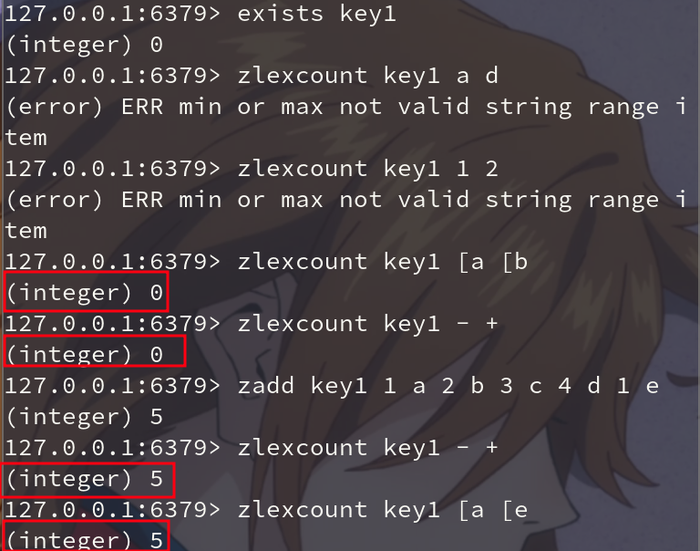


##### zinterstore

计算给定的一个或多个有序集的交集，其中给定 key 的数量必须以 numkeys 参数指定，并将该交集(结果集)储存到 destination 。

```shell
ZINTERSTORE destination N key1 key2 ... keyN [AGGREGATE SUM|MIN|MAX]

# destination: 有值的会被覆盖
```

默认情况下，结果集中某个成员的分数值是所有给定集下该成员分数值之和。


###### 返回值

保存到目标结果集的的成员数量。


###### 示例

```shell
zinterstore key0 2 key1 key2  # 默认 aggregate sum
zinterstore key0 2 key1 key2 aggregate sum
```


##### zunionstore

计算给定的一个或多个有序集的并集，其中给定 key 的数量必须以 numkeys 参数指定，并将该并集(结果集)储存到 destination 。

```shell
ZINTERSTORE destination N key1 key2 ... keyN [AGGREGATE SUM|MIN|MAX]

# destination: 有值的会被覆盖
```

默认情况下，结果集中某个成员的分数值是所有给定集下该成员分数值之和 。


###### 返回值

保存到 destination 的结果集的成员数量。


示例

```shell
zunionstore key0 2 key1 key2
```

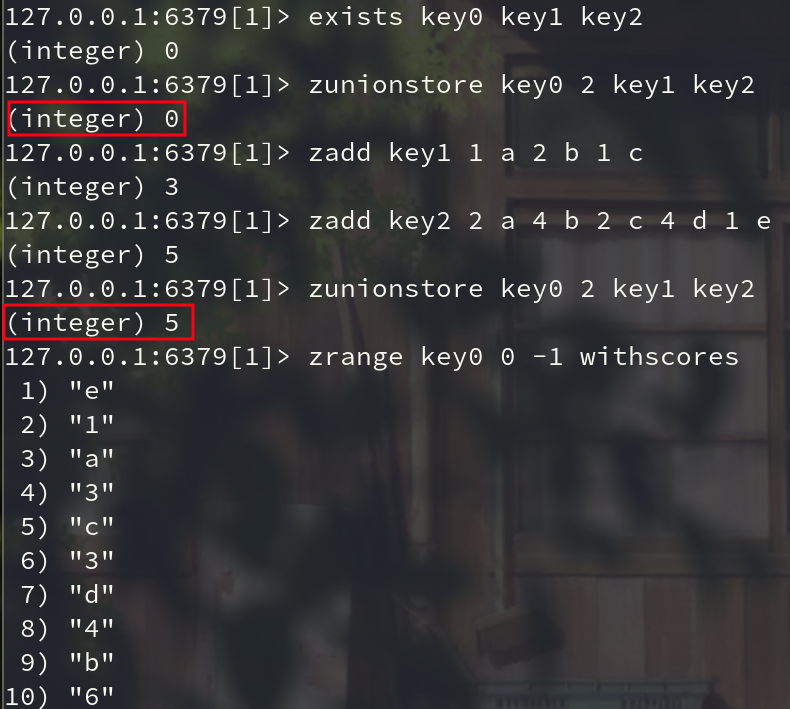


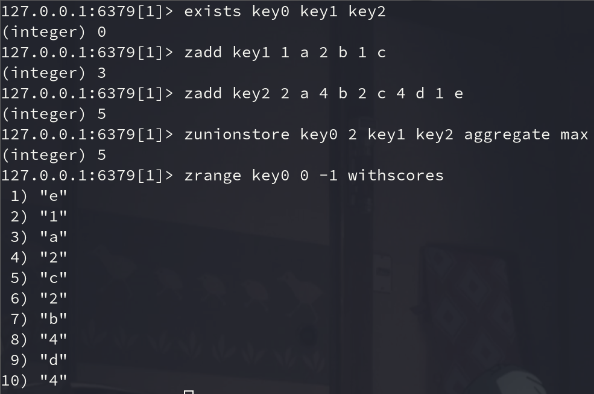


> zunionstore(dest, keys, aggregate=None)

获取两个有序集合的并集，如果遇到相同值不同分数，则按照aggregate进行操作

```shell
# aggregate的值为: SUM MIN MAX
```


##### zscan

> zscan(name, cursor=0, match=None, count=None, score_cast_func=float)
> zscan_iter(name, match=None, count=None,score_cast_func=float)

\# 同字符串相似，相较于字符串新增score_cast_func，用来对分数进行操作


### 字典(Hash)

&emsp;&emsp;hash 表现形式上有些像 pyhton 中的 dict,可以存储一组关联性较强的数据，redis 中 Hash 在内存中的存储格式如下图：　　


#### 使用场景

- 存变更数据， 如用户信息等


#### 设置值

##### hset

用于为哈希表中的字段赋值 。

```shell
HSET key field value 

# 参数：
# key:		redis 的 key
# field:	字典对应的 key
# value		字典中 field 对应的 value
```

- 如果哈希表不存在，一个新的哈希表被创建并进行 HSET 操作。

- 如果字段已经存在于哈希表中，旧值将被覆盖。


###### 返回值

- 1

    > 如果字段是哈希表中的一个新建字段，并且值设置成功，返回 1 

- 0

    > 如果哈希表中域字段已经存在且旧值已被新值覆盖，返回 0 。


示例：

```shell
hset info name lin
hset info age 18
```


##### hsetnx

> hset **N**ot **E**xist

用于为哈希表中不存在的的字段赋值 。

```shell

```

- 如果哈希表不存在，一个新的哈希表被创建并进行 HSET 操作。
- 如果字段已经存在于哈希表中，操作无效。
- 如果 key 不存在，一个新哈希表被创建并执行 HSETNX 命令。


###### 返回值

- 设置成功，返回 1 。 
- 如果给定字段已经存在且没有操作被执行，返回 0 。


###### 示例

```shell
> exists key1
(integer) 0
> hsetnx key1 k1 v1
(integer) 1
> hsetnx key1 k1 v1
(integer) 0
> hsetnx key1 k1 v2   #  # 操作无效， key-value-store 已存在
(integer) 0
> hget key1 k1
"v1"
```


##### hmset

同时将多个 (字段-值)对设置到哈希表中。

```shell
HMSET key filed1 value1 .. filedN valueN  
```


###### 返回值

如果命令执行成功，返回 OK 。


###### 示例

```shell
hmset info1 name lin age 18
```


#### 获取值

##### hget

用于返回哈希表中指定字段的值。

```shell
HGET key filed
```


###### 返回值

- 返回给定字段的值。

- nil

    > 如果给定的字段或 key 不存在时，返回 nil 。


###### 示例

```shell
hget info name
```

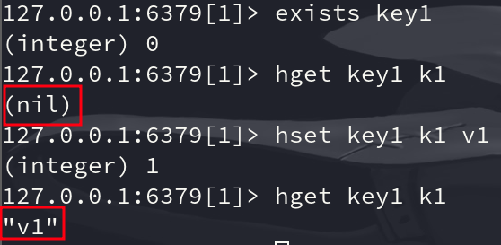


##### hmget

用于返回哈希表中，一个或多个给定字段的值。

```shell
HMGET key filed1 filed2 .. filedN
```


###### 返回值

- 一个包含多个给定字段关联值的表，表值的排列顺序和指定字段的请求顺序一样。
- 如果指定的字段不存在于哈希表，那么返回一个 nil 值。


###### 示例

```shell
hmget info name age
```


##### hgetall

用于返回哈希表中，所有的字段和值。

```shell
HGETALL key
```


###### 返回值

- 以列表形式返回哈希表的字段及字段值。

- 若 key 不存在，返回空列表。


###### 示例

```shell
hgetall info
```


##### hkeys

用于获取哈希表中的所有字段名。

```shell
HKEYS key
```


###### 返回值

- 当 key 不存在时，返回一个空列表。
- 包含哈希表中所有字段的列表。 


示例

```shell
hkeys key1
```


##### hvals

返回哈希表所有字段的值。

```shell
HVALS key
```


###### 返回值

- 当 key 不存在时，返回一个空表。
- 一个包含哈希表中所有值的表。


###### 示例

```shell
kvals key1
```


##### hscan

> hscan(name, cursor=0, match=None, count=None)

增量式迭代获取，对于数据大的数据非常有用，hscan可以实现分片的获取数据，并非一次性将数据全部获取完，从而防止内存被撑爆

```shell
# 参数：
name，redis 的 name
cursor，游标（基于游标分批取获取数据）
match，匹配指定 key，默认 None 表示所有的 key
count，每次分片最少获取个数，默认 None 表示采用 Redis 的默认分片个数
 
# 如：
第一次：cursor1, data1 = r.hscan('xx', cursor=0, match=None, count=None)
第二次：cursor2, data1 = r.hscan('xx', cursor=cursor1, match=None, count=None)
# 直到返回值cursor的值为0时，表示数据已经通过分片获取完毕
```

示例：

```shell
hscan info 0 match a*
hscan info 0 match *a*
```


> hscan_iter(name, match=None, count=None)

利用yield封装hscan创建生成器，实现分批去redis中获取数据

```shell
# 参数：
match，匹配指定 key，默认None 表示所有的 key
count，每次分片最少获取个数，默认 None 表示采用 Redis 的默认分片个数
  
# 如：
for item in r.hscan_iter('xx'):
    print item
```


#### 删除值

##### hdel

用于删除哈希表 key 中的一个或多个指定字段，不存在的字段将被忽略。

```shell
HDEL key field1 field2 .. fieldN 
```


###### 返回值

被成功删除字段的数量，不包括被忽略的字段。


###### 示例

```shell
hdel info age
hkeys info
```


#### 特殊

##### hlen

用于获取哈希表中字段的数量。

```shell
HLEN key
```


###### 返回值

- 哈希表中字段的数量。 

- 当 key 不存在时，返回 0 。


###### 示例

```shell
HLEN key1
```


##### hexists

用于查看哈希表的指定字段是否存在。

```shell
HEXISTS key1 field
```


###### 返回值

- 如果哈希表含有给定字段，返回 1 。 

- 如果哈希表不含有给定字段，或 key 不存在，返回 0 。


###### 示例

```shell
hexists info sex
hexists info name
```


##### hincrby

用于为哈希表中的字段值加上指定增量值。

```shell
HINCRBY key field amount

# amount：		自增数（整数）
```

- 增量也可以为负数，相当于对指定字段进行减法操作。
- 如果哈希表的 key 不存在，一个新的哈希表被创建并执行 HINCRBY 命令。
- 如果指定的字段不存在，那么在执行命令前，字段的值被初始化为 0 。
- 对一个储存字符串值的字段执行 HINCRBY 命令将造成一个错误。
- 本操作的值被限制在 64 位(bit)有符号数字表示之内。


###### 返回值

- 执行 HINCRBY 命令之后，哈希表中字段的值。

- error

    > 执行 HINCRBY 命令之后，哈希表中字段的值。


###### 示例

```shell
hincrby key1 k1 1
```


##### hincrbyfloat

用于为哈希表中的字段值加上指定浮点数增量值。

```shell
HINCRBYFLOAT key field amount

# amount：		自增数
```


###### 返回值

- 执行 HINCRBYFLOAT 命令之后，哈希表中字段的值。

- error

    > 执行 HINCRBYFLOAT 命令之后，哈希表中字段的值。


###### 示例

```shell
hincrbyfloat info age 1.1
```


## 三种特殊数据类型

### 地理位置(geo)

> Redis 的 Geo 在Redis3.2 版本就推出了！ 这个功能可以推算地理位置的信息，两地之间的距离，方圆几里的人！ 

可以查询一些测试数据：[城市经纬度查询](http://www.jsons.cn/lngcode/)


#### geoadd

> 将指定的地理空间位置（纬度、经度、名称）添加到指定的 `key` 中。这些数据将会存储到 `sorted set` 这样的目的是为了方便使用 [GEORADIUS](https://www.redis.net.cn/order/3689.html) 或者 [GEORADIUSBYMEMBER](https://www.redis.net.cn/order/3690.html) 命令对数据进行半径查询等操作。

geoadd 用于存储指定的地理空间位置，可以将一个或多个经度(longitude)、纬度(latitude)、位置名称(member)添加到指定的 key 中。

```shell
GEOADD key [NX|XX] [CH] x y member [x y member ...]

# 注意: XX 和 NX 选项是互斥的。
# NX：			不要更新已有的元素。总是添加新的元素
# XX：			只更新已存在的元素。不要添加元素
# CH:			将返回值从添加的新元素数目修改为更改的元素总数

# x: 			经度
# y: 			纬度
# member：		位置名称
```

该命令以采用标准格式的参数x,y,所以经度必须在纬度之前。这些坐标的限制是可以被编入索引的，区域面积可以很接近极点但是不能索引。具体的限制，由EPSG:900913 / EPSG:3785 / OSGEO:41001 规定如下：

- 有效的经度从-180度到180度。
- 有效的纬度从-85.05112878度到85.05112878度。(两级无法直接添加)
- 当坐标位置超出上述指定范围时，该命令将会返回一个错误。


##### 返回值

- 在没有可选参数的情况下使用时，添加到排序集中的元素数(不包括分数更新)
- 如果有 `CH` 参数，则更改(添加或更新)的元素数


##### 示例

```shell
geoadd china:city 116.405285 39.904989 beijing
geoadd china:city xx ch 116 39 beijing 121 31 shanghai
```


#### geopos

> Return the **pos**itions (longitude,latitude) of all the specified members of the **geo**spatial index represented by the sorted set at *key*.

geopos 用于从给定的 key 里返回所有指定名称(member)的位置（经度和纬度），不存在的返回 nil。

```shell
GEOPOS key member [member ...]
```


##### 返回值

- 数组

    > 该命令返回一个数组，其中每个元素是一个双元素数组，表示作为参数传递给命令的每个成员名的经纬度。

- nil

    > 不存在的元素被报告为数组的 NULL 元素。


##### 示例

```shell
geopos key1 k1
```

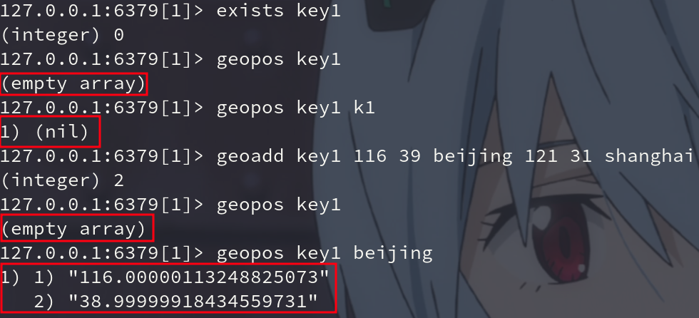


#### geodist

> Return the **dist**ance between two members in the **geo**spatial index represented by the sorted set.

返回两个给定位置之间的距离。

```shell
GEODIST key member1 member2 [m|km|ft|mi]

# member1 member2: 为两个地理位置。
# 最后一个距离单位参数说明：
# m 			：米，默认单位。
# km 			：千米。
# mi 			：英里。
# ft 			：英尺。
```

假设地球是一个完美的球体，那么距离是计算出来的，因此在边缘情况下误差可能达到0.5% 。


##### 返回值

- nil

    > 如果缺少一个或两个成员，则该命令返回 NULL。

- 大容量字符串回复


##### 示例

```shell
geodist key1 beijing shanghai
```

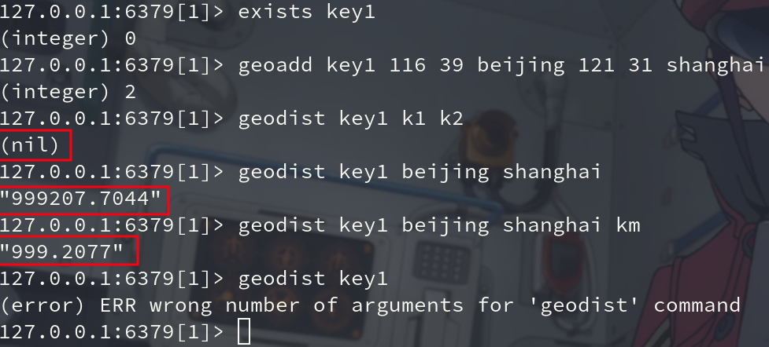


#### georadius

以给定的经纬度为中心， 返回键包含的位置元素当中， 与中心的距离不超过给定最大距离的所有位置元素。

```shell
GEORADIUS key longitude latitude radius m|km|ft|mi [WITHCOORD] [WITHDIST] [WITHHASH] [COUNT count] [ASC|DESC] [STORE key] [STOREDIST key]

# 距离单位参数说明：
# m 			：米，默认单位。
# km 			：千米。
# mi 			：英里。
# ft 			：英尺。

# WITHDIST: 	在返回位置元素的同时， 将位置元素与中心之间的距离也一并返回。
# WITHCOORD: 	将位置元素的经度和纬度也一并返回。
# COUNT 		限定返回的记录数。
# ASC: 			查找结果根据距离从近到远排序。
# DESC: 		查找结果根据从远到近排序。
```

在给定以下可选项时， 命令会返回额外的信息：

- `WITHDIST`: 在返回位置元素的同时， 将位置元素与中心之间的距离也一并返回。 距离的单位和用户给定的范围单位保持一致。
- `WITHCOORD`: 将位置元素的经度和维度也一并返回。
- `WITHHASH`: 以 52 位有符号整数的形式， 返回位置元素经过原始 geohash 编码的有序集合分值。 这个选项主要用于底层应用或者调试， 实际中的作用并不大。

命令默认返回未排序的位置元素。 通过以下两个参数， 用户可以指定被返回位置元素的排序方式：

- `ASC`: 根据中心的位置， 按照从近到远的方式返回位置元素。
- `DESC`: 根据中心的位置， 按照从远到近的方式返回位置元素。

在默认情况下， GEORADIUS 命令会返回所有匹配的位置元素。 虽然用户可以使用 **COUNT `<count>`** 选项去获取前 N 个匹配元素， 但是因为命令在内部可能会需要对所有被匹配的元素进行处理， 所以在对一个非常大的区域进行搜索时， 即使只使用 `COUNT` 选项去获取少量元素， 命令的执行速度也可能会非常慢。 但是从另一方面来说， 使用 `COUNT` 选项去减少需要返回的元素数量， 对于减少带宽来说仍然是非常有用的。


##### 返回值

- 在没有给定任何 `WITH` 选项的情况下， 命令只会返回一个线性（linear）列表。

    > [“New York”,”Milan”,”Paris”]

- 在指定了 `WITHCOORD` 、 `WITHDIST` 、 `WITHHASH` 等选项的情况下， 命令返回一个二层嵌套数组， 内层的每个子数组就表示一个元素。在返回嵌套数组时， 子数组的第一个元素总是位置元素的名字。 至于额外的信息， 则会作为子数组的后续元素， 按照以下顺序被返回：

    - 以浮点数格式返回的中心与位置元素之间的距离， 单位与用户指定范围时的单位一致。
    - geohash 整数。
    - 由两个元素组成的坐标，分别为经度和纬度。


##### 示例

```shell
# 以 110，30 这个经纬度为中心，寻找方圆1000km内的坐标
GEORADIUS key1 110 30 5000 km 

# 显示到中间距离的位置
GEORADIUS china:city 110 30 500 km withdist 

# 显示其他坐标的定位信息
GEORADIUS china:city 110 30 500 km withcoord 

# 筛选出指定的结果！
GEORADIUS china:city 110 30 500 km withdist withcoord count 2
```

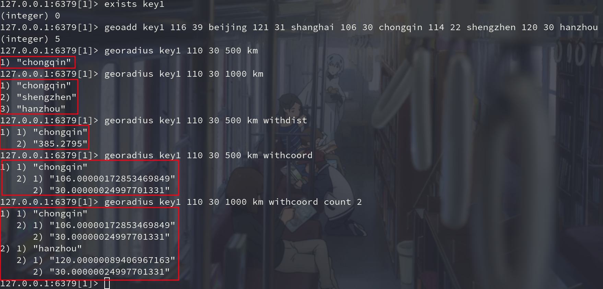


#### georadiusbymember

georadiusbymember 和 GEORADIUS 命令一样， 都可以找出位于指定范围内的元素， 但是 georadiusbymember 的中心点是由给定的位置元素决定的， 而不是使用经度和纬度来决定中心点。

```shell
GEORADIUSBYMEMBER key member radius m|km|ft|mi [WITHCOORD] [WITHDIST] [WITHHASH] [COUNT count] [ASC|DESC] [STORE key] [STOREDIST key]

# 距离单位参数说明：
# m 			：米，默认单位。
# km 			：千米。
# mi 			：英里。
# ft 			：英尺。

# WITHDIST: 	在返回位置元素的同时， 将位置元素与中心之间的距离也一并返回。
# WITHCOORD: 	将位置元素的经度和纬度也一并返回。
# COUNT 		限定返回的记录数。
# ASC: 			查找结果根据距离从近到远排序。
# DESC: 		查找结果根据从远到近排序。
```

- WITHHASH: 以 52 位有符号整数的形式， 返回位置元素经过原始 geohash 编码的有序集合分值。 这个选项主要用于底层应用或者调试， 实际中的作用并不大。


##### 示例

```shell
# 找出位于指定元素周围的其他元素！
GEORADIUSBYMEMBER china:city beijing 1000 km
```

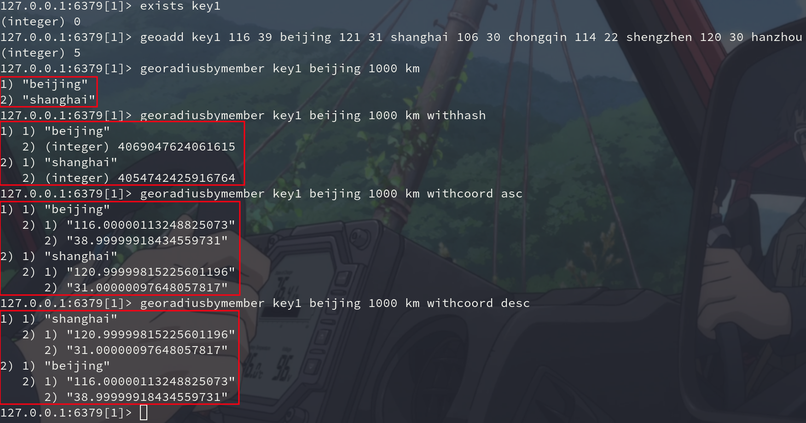


#### geohash
Redis GEO 使用 geohash 来保存地理位置的坐标。geohash 用于获取一个或多个位置元素的 geohash 值。

```shell
GEOHASH key member [member ...]
```


##### 返回值

一个数组， 数组的每个项都是一个 geohash 。 命令返回的 geohash 的位置与用户给定的位置元素的位置一一对应。


##### 示例

```shell
geohash key1 beijing shanghai
```

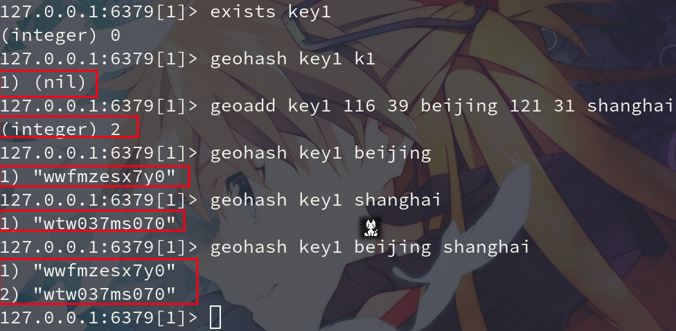


#### geosearch

该命令扩展了 GEORADIUS 命令，因此除了在圆形区域内搜索外，它还支持在矩形区域内搜索。

```shell
GEOSEARCH key 
[FROMMEMBER member] [FROMLONLAT long lat] 
[BYRADIUS radius unit] [BYBOX width height unit] 
[WITHCOORD] [WITHDIST] [WITHHASH] 
[COUNT count] [ASC|DESC]

# 搜索中心种指定方式：
# FROMMEMBER：		从已经存在的key中读取经纬度。
# FROMLONLAT：		从用户参数传递经纬度。

# 搜索条件：
# BYRADIUS：			根据给定半径长度按照圆形搜索，命令效果等同于GEORADIUS。
# BYBOX：			根据给定的width和height按照矩形搜索，矩形是轴对称矩形。
```

- 默认情况下，返回的匹配项是未排序的。

- 默认情况下返回所有匹配项。若要将结果限制为前 n 个匹配项，请使用 COUNT 选项。

    > 当使用 ANY 选项时，只要找到足够的匹配项，命令就会返回。这意味着返回的结果可能不是最接近指定点的结果，但服务器生成这些结果的工作量要少得多。如果没有提供 ANY，命令将执行与匹配指定区域的项数量成比例的操作，并对它们进行排序，因此使用非常小的 COUNT 选项查询非常大的区域可能会很慢，即使只返回少量结果。


##### 注意

- redis版本 >= 6.2

    


##### 示例

举例如下，对于一个正方形（橙色区域）以及其内接圆（蓝色区域）的搜索，可以看到，位于正方形，但是没有在内接圆中的点edge1和edge2可以通过BYBOX指定矩形搜索的方式被搜索出来：

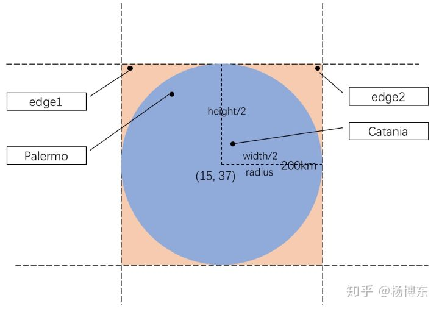

```shell
127.0.0.1:6379> GEOADD Sicily 13.361389 38.115556 "Palermo" 15.087269 37.502669 "Catania"
(integer) 2
127.0.0.1:6379> GEOADD Sicily 12.758489 38.788135 "edge1" 17.241510 38.788135 "edge2"
(integer) 2
127.0.0.1:6379> GEOSEARCH Sicily FROMLONLAT 15 37 BYRADIUS 200 km ASC
1) "Catania"
2) "Palermo"
127.0.0.1:6379> GEOSEARCH Sicily FROMLONLAT 15 37 BYBOX 400 400 km ASC
1) "Catania"
2) "Palermo"
3) "edge2"
4) "edge1"
```


#### geosearchstore

> GEOSEARCHSTORE与GEOSEARCH相似，只是将搜索结果存储在指定的key中。

```shell
```


### Hyperloglog 基数

- Redis 在 `2.8.9` 版本添加了 HyperLogLog 结构。
- Redis HyperLogLog 是用来做基数统计的算法， 并非 redis 独有，核心是基数估算算法，主要表现为计算时内存的使用和数据合并的处理。最终数值存在一定误差。
- HyperLogLog 的优点是，在输入元素的数量或者体积非常非常大时，计算基数所需的空间总是固定 的、并且是很小的。
- 在 Redis 里面，==每个 HyperLogLog 键只需要花费 12 KB 内存，就可以计算接近 $$2^{64}$$ 个不同元素的基数==。这和计算基数时，元素越多耗费内存就越多的集合形成鲜明对比。
- 但是，因为 ==HyperLogLog 只会根据输入元素来计算基数，而不会储存输入元素本身==，所以 HyperLogLog 不能像集合那样，返回输入的各个元素。


#### 什么是基数？

比如数据集 `{1, 3, 6, 7, 6, 7, 8}`， 那么这个数据集的基数集为 `{1, 3, 6 ,7, 8}`, 基数(不重复元素个数)为 `5`。 基数估计就是在误差可接受的范围内，快速计算基数。


#### 为什么使用它？

- 占用的内存是固定，$$2^{64}$$不同的元素的技术，只需要消耗 12KB内存！如果要从内存角度来比较的话 Hyperloglog 是首选！

- 如果允许容错(存在 0.81% 错误率)，那么一定可以使用 Hyperloglog ！ 如果不允许容错，就使用 set 或者自己的数据类型即可。


#### 注意事项

##### 12KB

- redis中每个 hyperloglog ke y占用了 12K 的内存用于标记基数（官方文档）
- `pfadd` 命令==并不会一次性分配 12k 内存，而是随着基数的增加而逐渐增加内存分配==；而 pfmerge 操作则会将 sourcekey 合并后存储在 12k 大小的 key 中，这由 hyperloglog 合并操作的原理（两个 hyperloglog 合并时需要单独比较每个桶的值）可以很容易理解。
- Redis 对 HyperLogLog 的存储进行了优化，在计数比较小时，它的存储空间采用稀疏矩阵存储，空间占用很小，仅仅在计数慢慢变大，稀疏矩阵占用空间渐渐==超过了阈值时才会一次性转变成稠密矩阵，才会占用 12k 的空间==。


#### 使用案例

- 基数不大，数据量不大就用不上，会有点大材小用浪费空间, 还有错误概率
- 有局限性，就是只能统计基数数量，而没办法去知道具体的内容是什么
- 和 bitmap 相比，属于两种特定统计情况，简单来说，HyperLogLog 去重比 bitmap 方便很多
- 一般可以 bitmap 和 hyperloglog 配合使用，bitmap 标识哪些用户活跃，hyperloglog 计数


##### 一般使用：

- 统计注册 IP 数
- 统计每日访问 IP 数
- 统计页面实时 UV 数
- 统计在线用户数
- 统计用户每天搜索不同词条的个数


##### 统计页面浏览量 UV(unique visitor)

> 一个人访问一个网站多次，但是还是算作一个人。

传统的方式， set 保存用户的 id，然后就可以统计 set 中的元素数量作为标准判断 ! 这个方式如果保存大量的用户id，就会比较麻烦！我们的目的是为了计数，而不是保存用户id；

0.81% 错误率！ 统计UV任务，可以忽略不计的！


#### pfadd

> 将所有元素参数添加到 HyperLogLog 数据结构中。

```shell
PFADD key element [element ...]
```

##### 可用版本

\>= 2.8.9


##### 返回值

整型，如果至少有个元素被添加返回 1， 否则返回 0。


示例

```shell
pfadd key1 1 2 3 4 5 6 7 8 9 0
```

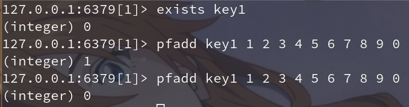


#### pfcount

> 返回给定 HyperLogLog 的基数估算值。

```shell
PFCOUNT key [key ...]
```

##### 可用版本

\>= 2.8.9


##### 返回值

- 整数，返回给定 HyperLogLog 的基数值。

- 如果多个 HyperLogLog 则返回基数估值之和。


##### 示例

```shell
pfcount key1 key2
```

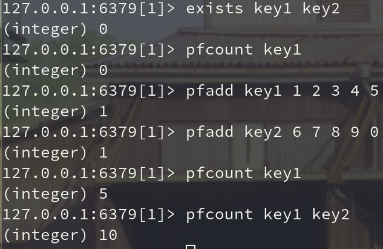


#### pfmerge

将多个 HyperLogLog 合并为一个 HyperLogLog ，合并后的 HyperLogLog 的基数估算值是通过对所有给定 HyperLogLog 进行并集计算得出的。

```shell
PFMERGE destkey sourcekey [sourcekey ...]
```


##### 可用版本

\>= 2.8.9


##### 返回值

返回 OK。


##### 示例

```shell
pfmerge key3 key1 key2
```

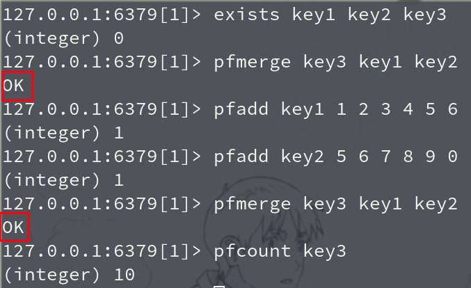


### Bitmap


# 案例

## 统计用户登录

> 登录数量，用户是否登录

````shell
set usercount "\x00"				# 初始化所有位为 0
bitcount usercount
setbit usercount 10000 1			# 第 10000 名客户登陆
setbit usercount 100 1				# 第 100 名 拥护的登录
bitcount usercount					# 统计登录人数
getbit usercount 100				# 查看第 100 用户是否登录
````


> 一亿个用户，占一亿位，约等于 10M


# 思考

- **自己写的程序数据也是存在内存，Redis 也是存在内存里，为什么我们还要用 Redis？**

    > 自己写的程序数据存在的是独立的内存，其他应用程序无法访问


 w
