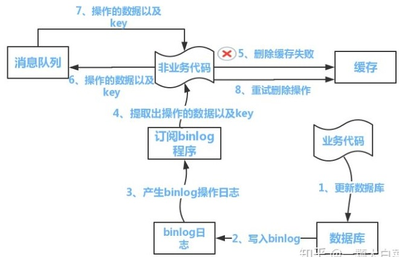

----------------------------------------------
> *Made By Herolh*
----------------------------------------------

# 数据库缓存更新一致性 {#index}

[TOC]


--------------------------------------------

## 分布式之数据库和缓存双写一致性方案解析

文章来源：

> [分布式之数据库和缓存双写一致性方案解析](https://zhuanlan.zhihu.com/p/48334686)


### 为什么写这篇文章？

&emsp;&emsp;首先，缓存由于其高并发和高性能的特性，已经在项目中被广泛使用。在读取缓存方面，大家没啥疑问，都是按照下图的流程来进行业务操作。


&emsp;&emsp;但是在更新缓存方面，对于更新完数据库，是更新缓存呢，还是删除缓存。又或者是先删除缓存，再更新数据库，其实大家存在很大的争议。目前没有一篇全面的博客，对这几种方案进行解析。于是博主战战兢兢，顶着被大家喷的风险，写了这篇文章。


### 文章结构

本文由以下三个部分组成
1、讲解缓存更新策略
2、对每种策略进行缺点分析
3、针对缺点给出改进方案

&emsp;&emsp;先做一个说明，==从理论上来说，给缓存设置过期时间，是保证最终一致性的解决方案==。这种方案下，我们可以对存入缓存的数据设置过期时间，所有的写操作以数据库为准，对缓存操作只是尽最大努力即可。也就是说如果数据库写成功，缓存更新失败，那么只要到达过期时间，则后面的读请求自然会从数据库中读取新值然后回填缓存。因此，接下来讨论的思路不依赖于给缓存设置过期时间这个方案。
&emsp;&emsp;在这里，我们讨论**三种**更新策略：

1. 先更新数据库，再更新缓存
2. 先删除缓存，再更新数据库
3. 先更新数据库，再删除缓存

应该没人问我，为什么没有先更新缓存，再更新数据库这种策略。


### 先更新数据库，再更新缓存(X)

这套方案，大家是普遍反对的。为什么呢？有如下两点原因。

- **原因一（线程安全角度）**
    同时有请求 A 和请求 B 进行更新操作，那么会出现

    - 线程 A 更新了数据库
    - 线程 B 更新了数据库
    - 线程 B 更新了缓存
    - 线程 A 更新了缓存

    这就出现请求 A 更新缓存应该比请求 B 更新缓存早才对，但是因为网络等原因，B 却比 A 更早更新了缓存。这就导致了脏数据，因此不考虑。


- **原因二（业务场景角度）**
    - 如果你是一个写数据库场景比较多，而读数据场景比较少的业务需求，采用这种方案就会导致，数据压根还没读到，缓存就被频繁的更新，浪费性能。
    - 如果你写入数据库的值，并不是直接写入缓存的，而是要经过一系列复杂的计算再写入缓存。那么，每次写入数据库后，都再次计算写入缓存的值，无疑是浪费性能的。显然，删除缓存更为适合。

接下来讨论的就是争议最大的，先删缓存，再更新数据库。还是先更新数据库，再删缓存的问题。


### 先删缓存，再更新数据库

&emsp;&emsp;该方案会导致不一致的原因是。同时有一个请求 A 进行更新操作，另一个请求 B 进行查询操作。那么会出现如下情形:

- 请求 A 进行写操作，删除缓存
- 请求 B 查询发现缓存不存在
- 请求 B 去数据库查询得到旧值
- 请求 B 将旧值写入缓存
- 请求 A 将新值写入数据库
&emsp;&emsp;上述情况就会导致不一致的情形出现。而且，如果不采用给缓存设置过期时间策略，该数据永远都是脏数据。那么，**如何解决呢？采用延时双删策略**，伪代码如下

```text
public void write(String key,Object data){
        redis.delKey(key);
        db.updateData(data);
        Thread.sleep(1000);
        redis.delKey(key);
    }
```

转化为中文描述就是

- 先淘汰缓存
- 再写数据库（这两步和原来一样）
- 休眠 1 秒，再次淘汰缓存


这么做，可以将 1 秒内所造成的缓存脏数据，再次删除。


#### 存在问题

##### 问题一：

>  那么，这个 1 秒怎么确定的，具体该休眠多久呢？

&emsp;&emsp;针对上面的情形，读者应该自行评估自己的项目的读数据业务逻辑的耗时。然后写数据的休眠时间则在读数据业务逻辑的耗时基础上，加几百 ms 即可。这么做的目的，就是确保读请求结束，写请求可以删除读请求造成的缓存脏数据。


##### 问题二：

> 如果你用了 mysql 的读写分离架构怎么办？

&emsp;&emsp;在这种情况下，造成数据不一致的原因如下，还是两个请求，一个请求 A 进行更新操作，另一个请求 B 进行查询操作。
- 请求 A 进行写操作，删除缓存
- 请求 A 将数据写入数据库了，
- 请求 B 查询缓存发现，缓存没有值
- 请求 B 去从库查询，这时，还没有完成主从同步，因此查询到的是旧值
- 请求 B 将旧值写入缓存
- 数据库完成主从同步，从库变为新值
&emsp;&emsp;上述情形，就是数据不一致的原因。还是使用双删延时策略。只是，睡眠时间修改为在主从同步的延时时间基础上，加几百 ms。


##### 问题三：

> 采用这种同步淘汰策略，吞吐量降低怎么办？

&emsp;&emsp;那就将第二次删除作为异步的。自己起一个线程，异步删除。这样，写的请求就不用沉睡一段时间后了，再返回。这么做，加大吞吐量。


##### 问题四：

> 第二次删除，如果删除失败怎么办？

这是个非常好的问题，因为第二次删除失败，就会出现如下情形。还是有两个请求，一个请求 A 进行更新操作，另一个请求 B 进行查询操作，为了方便，假设是单库：

- 请求 A 进行写操作，删除缓存
- 请求 B 查询发现缓存不存在
- 请求 B 去数据库查询得到旧值
- 请求 B 将旧值写入缓存
- 请求 A 将新值写入数据库
- 请求 A 试图去删除请求 B 写入对缓存值，结果失败了。
&emsp;&emsp;这也就是说。如果第二次删除缓存失败，会再次出现缓存和数据库不一致的问题。那如何解决呢？具体解决方案，且看博主对第 (3) 种更新策略的解析。


### 先更新数据库，再删缓存

&emsp;&emsp;首先，先说一下。老外提出了一个缓存更新套路，名为[《Cache-Aside pattern》](https://link.zhihu.com/?target=https%3A//docs.microsoft.com/en-us/azure/architecture/patterns/cache-aside)。其中就指出：

- **失效**：应用程序先从 cache 取数据，没有得到，则从数据库中取数据，成功后，放到缓存中。
- **命中**：应用程序从 cache 中取数据，取到后返回。
- **更新**：先把数据存到数据库中，成功后，再让缓存失效。

另外，知名社交网站 facebook 也在论文[《Scaling Memcache at Facebook》](https://link.zhihu.com/?target=https%3A//www.usenix.org/system/files/conference/nsdi13/nsdi13-final170_update.pdf)中提出，他们用的也是先更新数据库，再删缓存的策略。


#### 存在问题

##### 问题一：

&emsp;&emsp;这种情况不存在并发问题么？不是的。假设这会有两个请求，一个请求 A 做查询操作，一个请求 B 做更新操作，那么会有如下情形产生：

- 缓存刚好失效
- 请求 A 查询数据库，得一个旧值
- 请求 B 将新值写入数据库
- 请求 B 删除缓存
- 请求 A 将查到的旧值写入缓存

ok，如果发生上述情况，确实是会发生脏数据。


**然而，发生这种情况的概率又有多少呢？**发生上述情况有一个先天性条件，就是步骤（3）的写数据库操作比步骤（2）的读数据库操作耗时更短，才有可能使得步骤（4）先于步骤（5）。可是，大家想想，数据库的读操作的速度远快于写操作的（不然做读写分离干嘛，做读写分离的意义就是因为读操作比较快，耗资源少），因此步骤（3）耗时比步骤（2）更短，这一情形很难出现。假设，有人非要抬杠，有强迫症，一定要解决怎么办？


###### 如何解决

如何解决上述并发问题？首先，给缓存设有效时间是一种方案。其次，采用策略（2）里给出的异步延时删除策略，保证读请求完成以后，再进行删除操作。


##### 问题二：

还有其他造成不一致的原因么？有的，这也是缓存更新策略（2）和缓存更新策略（3）都存在的一个问题，如果删缓存失败了怎么办，那不是会有不一致的情况出现么。比如一个写数据请求，然后写入数据库了，删缓存失败了，这会就出现不一致的情况了。这也是缓存更新策略（2）里留下的最后一个疑问。**如何解决？**提供一个保障的重试机制即可，这里给出两套方案。


###### 解决方案一

如下图所示


流程如下所示
（1）更新数据库数据；
（2）缓存因为种种问题删除失败
（3）将需要删除的 key 发送至消息队列
（4）自己消费消息，获得需要删除的 key
（5）继续重试删除操作，直到成功
然而，该方案有一个缺点，对业务线代码造成大量的侵入。于是有了方案二，在方案二中，启动一个订阅程序去订阅数据库的 binlog，获得需要操作的数据。在应用程序中，另起一段程序，获得这个订阅程序传来的信息，进行删除缓存操作。


###### 解决方案二：



流程如下图所示：
（1）更新数据库数据
（2）数据库会将操作信息写入 binlog 日志当中
（3）订阅程序提取出所需要的数据以及 key
（4）另起一段非业务代码，获得该信息
（5）尝试删除缓存操作，发现删除失败
（6）将这些信息发送至消息队列
（7）重新从消息队列中获得该数据，重试操作。

**备注说明：**上述的订阅 binlog 程序在 mysql 中有现成的中间件叫 canal，可以完成订阅 binlog 日志的功能。至于 oracle 中，博主目前不知道有没有现成中间件可以使用。另外，重试机制，博主是采用的是消息队列的方式。如果对一致性要求不是很高，直接在程序中另起一个线程，每隔一段时间去重试即可，这些大家可以灵活自由发挥，只是提供一个思路。


### 总结

本文其实是对目前互联网中已有的一致性方案，进行了一个总结。对于先删缓存，再更新数据库的更新策略，还有方案提出维护一个内存队列的方式，博主看了一下，觉得实现异常复杂，没有必要，因此没有必要在文中给出。最后，希望大家有所收获。


## Redis 缓存更新一致性

文章来源：

> [Redis 缓存更新一致性](https://www.cnblogs.com/Finley/p/12615111.html)


&emsp;&emsp;当执行写操作后，需要保证从缓存读取到的数据与数据库中持久化的数据是一致的，因此需要对缓存进行更新。因为涉及到数据库和缓存两步操作，难以保证==更新的原子性==。所以在设计更新策略时，我们需要考虑多个方面的问题:

- **对系统吞吐量的影响**

    > 比如更新缓存策略产生的数据库负载小于删除缓存策略的负载

- **并发安全性**

    > 并发读写时某些异常操作顺序可能造成数据不一致，如缓存中长期保存过时数据

- **更新失败的影响**

    > 若某个操作失败，如何对业务影响降到最小

- **检测和修复故障的难度**

    > 操作失败导致的错误会在日志留下详细的记录容易检测和修复。并发问题导致的数据错误没有明显的痕迹难以发现，且在流量高峰期更容易产生并发错误导致业务风险较大。


更新缓存有两种方式:

- **删除失效缓存**

    > 删除旧缓存后，读取时会因为未命中缓存而从数据库中读取新的数据并更新到缓存中

- **更新缓存**

    > 直接将新的数据写入缓存覆盖过期数据


更新缓存和更新数据库有两种顺序：

- **先数据库后缓存**
- **先缓存后数据库**

&emsp;&emsp;两两组合共有四种更新策略，现在我们逐一进行分析。**并发问题通常由于后开始的线程却先完成操作导致，我们把这种现象称为“抢跑”。** 下面我们逐一分析四种策略中“抢跑”带来的错误。


### 先更新数据库，再删除缓存

&emsp;&emsp;若数据库更新成功，删除缓存操作失败，则此后读到的都是缓存中过期的数据，造成不一致问题。可能存在读写线程竞争导致的并发错误:

| 时间 |     线程A      |   线程B    | 数据库 | 缓存 |
| :--: | :------------: | :--------: | :----: | :--: |
|  1   |    缓存失效    |            |   v1   | null |
|  2   | 从数据库读取v1 |            |   v1   | null |
|  3   |                | 更新数据库 |   v2   | null |
|  4   |                |  删除缓存  |   v2   | null |
|  5   |    写入缓存    |            |   v2   |  v1  |


### 先更新数据库，再更新缓存

&emsp;&emsp;同删除缓存策略一样，若数据库更新成功缓存更新失败则会造成数据不一致问题。该策略同样存在读写线程竞争导致数据不一致的问题:

| 时间 |     线程A      |   线程B    | 数据库 | 缓存 |
| :--: | :------------: | :--------: | :----: | :--: |
|  1   |    缓存失效    |            |   v1   | null |
|  2   | 从数据库读取v1 |            |   v1   | null |
|  3   |                | 更新数据库 |   v2   | null |
|  4   |                |  写入缓存  |   v2   |  v2  |
|  5   |    写入缓存    |            |   v2   |  v1  |

也可能因为两个写线程竞争导致并发错误:

| 时间 |      线程A      |      线程B      | 数据库 | 缓存 |
| :--: | :-------------: | :-------------: | :----: | :--: |
|  0   |                 |                 |   v0   |  v0  |
|  1   | 更新数据库为 v1 |                 |   v1   |  v0  |
|  2   |                 | 更新数据库为 v2 |   v2   |  v0  |
|  3   |                 |  更新缓存为 v2  |   v2   |  v2  |
|  4   |  更新缓存为 v1  |                 |   v2   |  v1  |

我们可以在写入缓存前先比较数据的版本号或者修改时间，禁止向缓存中写入更旧的版本。

| 时间 |                            线程A                             |      线程B      | 数据库 | 缓存 |
| :--: | :----------------------------------------------------------: | :-------------: | :----: | :--: |
|  0   |                                                              |                 |   v0   |  v0  |
|  1   |                       更新数据库为 v1                        |                 |   v1   |  v0  |
|  2   |                                                              | 更新数据库为 v2 |   v2   |  v0  |
|  3   |                                                              |  更新缓存为 v2  |   v2   |  v2  |
|  4   | 尝试向缓存中写入 v1，发现版本号低于缓存中的版本(v2)，放弃写入 |                 |   v2   |  v2  |

由上图可见，更新缓存前比较版本号可以有效的避免并发错误的发生。


### 先删除缓存，再更新数据库

可能发生的并发错误:

| 时间 |     线程A      |     线程B      | 数据库 | 缓存 |
| :--: | :------------: | :------------: | :----: | :--: |
|  1   |    删除缓存    |                |   v1   | null |
|  2   |                |    缓存失效    |   v1   | null |
|  3   |                | 从数据库读取v1 |   v1   | null |
|  4   | 更新数据库为v2 |                |   v2   | null |
|  5   |                |  将v1写入缓存  |   v2   |  v1  |


### 先更新缓存，再更新数据库

&emsp;&emsp;若缓存更新成功数据库更新失败， 则此后读到的都是未持久化的数据。因为缓存中的数据是易失的，这种状态非常危险。因为数据库中存在的键约束导致数据库写入失败的可能性较高，所以发生上述错误的概率会进一步升高。该策略同样存在读写线程竞争导致的错误:

| 时间 |     线程A      |   线程B    | 数据库 | 缓存 |
| :--: | :------------: | :--------: | :----: | :--: |
|  1   |    缓存失效    |            |   v1   | null |
|  2   | 从数据库读取v1 |            |   v1   | null |
|  3   |                |  更新缓存  |   v1   |  v2  |
|  4   |                | 写入数据库 |   v2   |  v2  |
|  5   |    写入缓存    |            |   v2   |  v1  |

两个写线程竞争也会导致数据不一致:

| 时间 |      线程A      |      线程B      | 数据库 | 缓存 |
| :--: | :-------------: | :-------------: | :----: | :--: |
|  0   |                 |                 |   v0   |  v0  |
|  1   |  更新缓存为 v1  |                 |   v0   |  v1  |
|  2   |                 |  更新缓存为 v2  |   v0   |  v2  |
|  3   |                 | 更新数据库为 v2 |   v2   |  v2  |
|  4   | 更新数据库为 v1 |                 |   v1   |  v2  |


### 异步更新

&emsp;&emsp;双写更新的逻辑复杂，一致性问题较多。我们可以采用订阅数据库更新的方式来更新缓存。阿里开源了 MySQL 数据库binlog的增量订阅和消费组件 - [canal](https://github.com/alibaba/canal)。 canal 模拟从库获得主库的 binlog 更新，然后将更新数据写入 MQ 或直接进行消费。

&emsp;&emsp;我们可以让API服务器只负责写入数据库，另一个线程订阅数据库 binlog 增量进行缓存更新。因为 binlog 是有序的，因此可以避免两个写线程竞争。但我们仍然需要解决读写线程竞争的问题:

| 时间 |     读线程     |     写线程     |     异步线程      | 数据库 | 缓存 |
| :--: | :------------: | :------------: | :---------------: | :----: | :--: |
|  1   |    缓存失效    |                |                   |   v1   | null |
|  2   | 从数据库读取v1 |                |                   |   v1   | null |
|  3   |                | 更新数据库为v2 |                   |   v2   | null |
|  4   |                |                | 删除缓存/更新缓存 |   v2   | null |
|  5   |    写入缓存    |                |                   |   v2   |  v1  |

与双写策略类似，只需要在写入缓存前比较一下版本号即可:

| 时间 |                 读线程                 |     写线程     | 异步线程 | 数据库 | 缓存 |
| :--: | :------------------------------------: | :------------: | :------: | :----: | :--: |
|  1   |                缓存失效                |                |          |   v1   | null |
|  2   |             从数据库读取v1             |                |          |   v1   | null |
|  3   |                                        | 更新数据库为v2 |          |   v2   | null |
|  4   |                                        |                | 更新缓存 |   v2   |  v2  |
|  5   | 尝试更新缓存为v1，因版本号过低放弃更新 |                |          |   v2   |  v2  |


