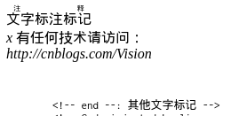
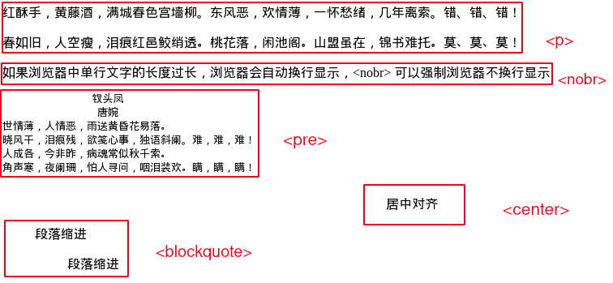
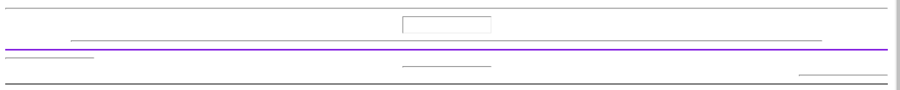
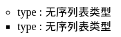
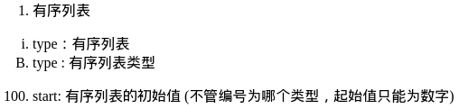
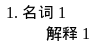

----------------------------------------------
> *Made By Herolh*
----------------------------------------------

# HTML 5 基础使用 {#index}

[TOC]


--------------------------------------------

## 什么是HTML

> 超文本标记语言（Hypertext Markup Language, HTML）

- **HTML 是一个标准,规定了大家怎么写网页**

  本质上是浏览器可识别的规则，我们按照规则写网页，浏览器根据规则渲染我们的网页。
  对于不同的浏览器，对同一个标签可能会有不同的解释。（兼容性问题）

- **HTML是一种标记语言（markup language），它不是一种编程语言。**

    `标记语言 --> 学标签 --> <标签名>`, HTML使用标签来描述网页。

​		

### HTML文件的结构

```html
<!DOCTYPE html>						# 文档声明
<html>								# html标签
<head>
	# head内常用标签
	# body内常用标签
</head>
<body>
	# body标签(用户在浏览器能看到的内容)
</body>
</html>
```


### 标签

#### 	标签分类1:

- 双标签

    ```html
    <br />
    ```

- 单标签

    ```html
    <h1></h1>
    ```

    

#### 标签分类2:

- **块儿级标签**            
		默认占浏览器宽度, 能设置长和宽, 例如 `h1~h6 div p hr `
	
- **内联标签(行内标签)** 
		根据内容决定长度, 不能设置长和宽,例如 `a img u s i b span`


#### 常用标签

```html
h1~h6
img
a
p
span
div
i
s
u
...
hr
br
特殊符号 &nbsp; &copy; &lt; &gt; &reg; ...
```


#### 标签的嵌套规则

- 行内标签不能嵌套块级标签
- p 标签不能嵌套块级标签( 层会自动跑出来 )


## 主体标签

```html
<html lang="zh-CN"> 
	<!-- 通常为 lang = "en",用于网络蜘蛛，浏览器识别 -->
</html>
```


### head 头部

#### title 标题标记

```html
<title>标题标记</title>
```


#### meta 元信息标记

&emsp;&emsp;提供有关页面的原信息（meta-information）,针对搜索引擎和更新频度的描述和关键词。提供的信息是用户不可见的。


##### name 属性

> 主要用于描述网页，便于搜索引擎机器人查找信息和分类信息用的。

###### 网页作者信息标记

| 属性      | 说明                  |
| --------- | --------------------- |
| author    | 网页作者              |
| generator | 编辑软件, 如 Hbuilder |
| reply-to  | 邮箱联系地址          |

```html
<!--begin-- 网页作者信息标记 ：-->
<meta name="author" content="网页作者"/>
<meta name="generator" content="编辑软件：Hbuilder"/>
<meta name="reply-to" content="邮箱联系地址"/>
<!-- end -- 网页作者信息标记 ：-->
```


###### 网页描述信息标记

| 属性        | 说明             |
| ----------- | ---------------- |
| build       | 网站建立日期     |
| keywords    | HTML基础，关键字 |
| description | 页面描述         |
| robots      | 限制搜索方式     |
| copyright   | 网页版权信息     |

```html
<!--begin-- 网页描述信息标记 ：-->
<meta name="build" content="网站建立日期"/>
<meta name = "keywords" content="HTML基础，关键字" />
<meta name="description" content="页面描述"/>
<meta name="robots" content="All"/>
<!-- robots标签中content值：		限制搜索方式
	All	          ：表示能搜索当前网页及其链接的网页
	Index    ：表示能搜索到当前网页
	Nofollow ：表示不能搜索与当前网页链接的网页
	Noindex  ：表示不能搜索当前网页
	None     ：表示不能搜索当前网页与其链接的网页
-->
<meta name="copyright" content="网页版权信息"/>
<!-- end -- 网页描述信息标记 ：-->
```


###### 设备自适应尺寸标记

| 属性     | 说明     |
| -------- | -------- |
| viewport | 视图界面 |

```html
<!-- 这段代码的意思是，让 viewport 的宽度等于物理设备上的真实分辨率，不允许用户缩放。一都主流的 web app 都是这么设置的，它的作用其实是故意舍弃 viewport，不缩放页面，这样 dpi 肯定和设备上的真实分辨率是一样的，不做任何缩放，网页会因此显得更高细腻。
-->
<meta name="viewport" content="width=device-width,initial-scale=1,minimum-scale=1,maximum-scale=1,user-scalable=no" />
<!-- viewport 标签中 content 值：		
	width：控制 viewport 的大小，可以指定的一个值:
		600，或者特殊的值
		device-width 为设备的宽度（单位为缩放为 100% 时的 CSS 的像素）。
	height：和 width 相对应，指定高度。
	initial-scale：初始缩放比例，也即是当页面第一次 load 的时候缩放比例。
	maximum-scale：允许用户缩放到的最大比例。
	minimum-scale：允许用户缩放到的最小比例。
	user-scalable：用户是否可以手动缩放
-->
```


##### http-equiv 属性

> 相当于 http 的文件头作用，它可以向浏览器传回一些有用的信息，以帮助正确地显示网页内容.


###### 网页动态信息标记


| 属性                          | 说明               |
| ----------------------------- | ------------------ |
| expires                       | 设置网页到期时间   |
| Content-type/Content-language | 设置网页文字及语言 |
| refresh                       | 设置定时跳转       |
| Cache-Control                 | 禁止缓存调用       |
| set-cookie                    | 删除过期 cookie    |
| windows-target                | 网页打开方式       |
| Page-Enter/page-exit          | 设置网页过渡效果   |

```html
<!--begin--： 网页动态信息标记 : -->

<!-- 设置网页到期时间： content = "星期 日 月 年 时 分 秒 GMT"-->
<meta http-equiv = "expires" content="28 february 2019 00:00:00 GMT"/>

<!--begin-- 设置网页文字及语言： -->
    <!--第一种表示方法：-->
    <!-- 字符集类型如"utf-8"等等 ，以下语句相当于开头的<meta charset="UTF-8">  -->
    <meta http-equiv =  "Content-type" content="text/html;charset =字符集类型"/>
    <!--第二种表示方法：-->
    <meta http-equiv = "Content-language" content="zh_CN"/>
<!-- end -- 设置网页文字及语言： -->

                                                                                                                           <!-- 设置定时跳转： -->
<meta http-equiv="refresh" content="3;url = http://www.baidu.com"/>          	

<!-- 禁止缓存调用：  设置缓存属性："Cache-Control " "Pragma"-->
<meta http-equiv="Cache-Control" content="no-cache"/>
<!-- <meta http-equiv="Pragma" content="no-cache"/> -->

<!-- 删除过期cookie： -->
<meta http-equiv="set-cookie" content="28 february 2019 00:00:00 GMT"/>

<!-- 强制打开新窗口：windos-target : 网页打开方式 -->
<meta http-equiv="windows-target" content="_top"/>

<!-- 设置网页过渡效果： 
	<meta http-equiv="过渡事件" content="revealtrans(duration = 持续时间,transition = 过渡方式0~23)" >
-->
<!--begin: 大部分浏览器并不支持  -->
	<meta http-equiv="Page-Enter" content="revealtrans(duration = 5,transition = 21)" >
	<meta http-equiv="page-exit" content="revealtrans(duration = 5,transition = 8)">
<!-- end : 大部分浏览器并不支持  -->

<!-- end --： 网页动态信息标记 : -->
```


##### charset 属性

```html
<meta charset="UTF-8">
```


#### base 基底网址标记

> 基底网址标记：将相对路径补成绝对路径


##### target 属性

> 新窗口打开方式

| 属性    | 说明                                     |
| ------- | ---------------------------------------- |
| _parent | 在上一级窗口打开，一般用于分帧的框架页中 |
| _blank  | 在新窗口打开                             |
| _self   | 在同一窗口打开，可以省略                 |
| _top    | 在浏览器整个窗口打开，忽略任何框架       |

```html
<base href="http://www.baidu.com" target="_blank"/>

<body>
    <a href="../123">我的博客</a>
    <!-- 相当于 http://www.baidu.com/123 -->
</body>
```


### body 主体

> 页面的主体标记


#### 字体属性

| 属性 | 说明                                                         |
| ---- | ------------------------------------------------------------ |
| text | 设置页面文字默认颜色, 改变整个页面的默认字体颜色<br />在没有对文字进行单独定义颜色是时，这个属性对页面所有文字产生作用 |

```html
<body text="#FFFFFF">
    <h1>这是一个跳转链接：</h1>
</body>
```


#### 背景属性

| 属性         | 说明                                                         |
| ------------ | ------------------------------------------------------------ |
| bgcolor      | 背景颜色                                                     |
| background   | 背景图片                                                     |
| bgproperties | 背景图片固定属性，默认情况下图片会按照水平和垂直方向不断出现，直至铺满整个画面<br />当设置为 `fixed` 时，当滚动页面，背景图片也会跟着移动，对于浏览者来说，总是停留在相同位置<br />若希望图片不重复显示，则需要借助CSS样式 |

```html
<body bgcolor ="aquamarine" background = "img/640.webp" bgproperties = "fixed"></body>
```


#### 链接属性

| 属性  | 说明           |
| ----- | -------------- |
| link  | 链接默认颜色   |
| alink | 按下链接颜色   |
| vlink | 按下链接后颜色 |

```html
<body link="#FF0000" alink="#99FF00" vlink="CCCCCC">
    <a href="http://www.baidu.com"><h1>跳转百度</h1></a>
</body>
```


#### 边距属性

> HTML页面内容与浏览器边框的距离

| 属性       | 说明                               |
| ---------- | ---------------------------------- |
| topmargin  | HTML页面顶部底部与浏览器边框的距离 |
| leftmargin | HTML页面左右与浏览器边框的距离     |

```html
<body bgcolor ="aquamarine" topmargin="100" leftmargin = "100"></body>
```


## 文本标记

### 文字设置

#### 标题文字 h

> 标题文字：从大到小 6 个等级 1~6

| 属性  | 说明                                                        |
| ----- | ----------------------------------------------------------- |
| align | `left`: 左对齐<br />`center`: 居中对齐<br />`right`: 右对齐 |

```html
<h1 align="center">level 1</h1>
<h2 >level 1</h2>
<h3>level 1</h3>
<h4>level 1</h4>
<h5>level 1</h5>
<h6>level 1</h6>
```


#### 文字格式 font

| 属性  | 说明                                                         |
| ----- | ------------------------------------------------------------ |
| face  | 设置文字字体：如：黑体，隶书，宋体...<br />face 可以有多个属性值， 默认情况下使用第一种属性值，若不存在，则使用第二种属性值 |
| size  | 设置文字字号：默认字号为3号<br />从大到小字号设置：7~1，也可以是：+1 ~ +7（-1 ~ -7） |
| color | 设置文字颜色                                                 |

```html
<!--face ：设置文字字体：如：黑体，隶书，宋体 -->
<font face = "华文彩云，黑体"><h1>2.设置文字字体</h1></font>

<!--size ： 设置文字字号 -->
<font size = "5">设置文字字号</font>
<font size="+2">在默认字号的基础上+2</font><br />

<!--color : 设置文字颜色-->
<font color="orange">设置字体颜色——color</font><br />
```


#### 文字特效

| 标签                                    | 说明         |
| --------------------------------------- | ------------ |
| `<strong></strong>`                     | 粗体         |
| `<em></em>`, `<I></I>`, `<cite></cite>` | 斜体         |
| `<u></u>`                               | 下划线       |
| `<sup></sup>`                           | 上标         |
| `<sub></sub>`                           | 下标         |
| `<strike></strike>`, `<s></s>`          | 删除线       |
| `<code></code>`, `<samp></samp>`        | 等宽文字标记 |

```html
<!--<strong></strong> ：粗体-->
文字特效：<strong>粗体</strong>

<!--begin--：<em></em>,<I></I>,<cite></cite> : 斜体-->
<em>斜体</em>
<i>斜体</i>
<cite>斜体</cite>
<!--begin--：em,I,cite : 斜体-->

<!-- <u></u> : 下划线-->
<u>下划线</u><br />

<!--<sup></sup> :上标-->
X<sup>上标</sup>	
<!--<sub></sub> :下标-->
Y<sub>下标</sub><br />

<!--删除线 -->
<strike>删除线的效果1</strike>
<s>删除线的效果2</s><br />

<!--等宽文字标记-->
<code>等宽文字标记常用于英文效果，使用标记能实现网页中字体的等宽效果，使页面更整齐</code><br />
<samp>Good night!</samp><br />
```


#### 特殊符号

> 一般情况下特殊符号由前缀 `&`、字符名称和后缀 `;`组成<br />

| 符号      | 说明                                                         |
| --------- | ------------------------------------------------------------ |
| `&nbsp;`  | 一个 `&nbsp;` 代表一个半角空格<br />在HTML中，浏览器将两个句子之间所有的半角空格仅当作一个来看待，所以打再多空格也仅当作一个空格处理<br />保留空格方法：<br />- 使用全角空格符号<br />- 通过空格码 `&nbsp;` 代替 |
| `&quot;`  | &quot; 引号                                                  |
| `&lt;`    | &lt; 左尖括号                                                |
| `&gt`     | &gt; 右尖括号                                                |
| `&times;` | &times; 乘号                                                 |
| `&sect;`  | &sect; 小节符号                                              |
| `&copy;`  | &copy; 版权所有的符号                                        |
| `&reg;`   | &reg; 已注册的符号                                           |
| `&trade;` | &trade; 商标符号                                             |


#### 其他文字标签

| 标签                              | 说明                                                         |
| --------------------------------- | ------------------------------------------------------------ |
| `<ruby >文字<rt>注释</rt></ruby>` | 文字标注标记                                                 |
| `<var></var>`                     | 声明变量标记, 该标签并非定义变量，仅仅只是辨识被其包含的内容为变量；您可以将此标签与 `<pre>` 及 `<code>` 标签配合使用 |
| `<address></address>`             | 设置地址文字标记<br />用来定义地址，签名或文档的作者身份等信息 |
| `<plaintext> or <xmp>`            | 忽视HTML标签标记, ,从此标签之后的标签标记都失去作用          |

```html
<!--<ruby></ruby> : 文字标注标记 -->
<ruby >
    文字标注标记
    <rt>注释</rt>
</ruby><br />

<!--<var></var> : 声明变量标记 -->
<!--Html属于静态语言，静态语言中是不能定义变量的，		
该标签并非定义变量，仅仅只是辨识被其包含的内容为变量；您可以将此标签与 <pre> 及 <code> 标签配合使用-->
<var>x</var>

<!--<address></address> ： 设置地址文字标记 -->
有任何技术请访问：
<address>http://www.baidu.com</address>

<!--<plaintext>: 忽视HTML标签标记,从此标签之后的标签标记都失去作用 -->
<!--<xmp>	忽视HTML标签标记,从此标签之后的标签标记都失去作用 -->
<plaintext>
    <!-- end --: 其他文字标记 -->
```




### 段落格式

#### 段落位置标记

| 标签                        | 说明                                                         |
| --------------------------- | ------------------------------------------------------------ |
| `<p></p>`                   | 段落标记                                                     |
| `<nobr></nobr>`             | 取消文字换行标记<br />如果浏览器中单行文字的长度过长，浏览器会自动换行显示, `<nobr>` 可以强制浏览器不换行显示 |
| `<br />`                    | 换行标记                                                     |
| `<pre></pre>`               | 保留原始排版方式标记                                         |
| `<center></center>`         | 居中对齐标记                                                 |
| `<blockquote></blockquote>` | 向右缩进标记                                                 |

```html
<!--<p></p> : 段落标记 -->
<p>红酥手，黄藤酒，满城春色宫墙柳。东风恶，欢情薄，一怀愁绪，几年离索。错、错、错！</p>
<p>春如旧，人空瘦，泪痕红邑鲛绡透。桃花落，闲池阁。山盟虽在，锦书难托。莫、莫、莫！</p>

<!--<nobr></nobr> ： 取消文字换行标记 -->
<nobr>如果浏览器中单行文字的长度过长，浏览器会自动换行显示，&lt;nobr&gt;可以强制浏览器不换行显示</nobr>

<!--<br /> : 换行标记 -->
<br />

<!--<pre></pre> : 保留原始排版方式标记 -->
<pre>
		 钗头凤
　　              唐婉
世情薄，人情恶，雨送黄昏花易落。
晓风干，泪痕残，欲笺心事，独语斜阑。难，难，难！
人成各，今非昨，病魂常似秋千索。
角声寒，夜阑珊，怕人寻问，咽泪装欢。瞒，瞒，瞒！
		</pre>

<!--<center></center> : 居中对齐标记-->
<center>居中对齐</center>

<!--<blockquote></blockquote> : 向右缩进标记 -->
<blockquote>段落缩进</blockquote>
<blockquote><blockquote>段落缩进</blockquote></blockquote>
```




#### 水平线标记 hr

| 属性    | 说明           |
| ------- | -------------- |
| width   | 设置水平线宽度 |
| size    | 设置水平线高度 |
| color   | 设置水平线颜色 |
| align   | 水平线对齐方式 |
| noshade | 去掉水平线阴影 |

```html
<!--默认情况下是100%的宽度，1像素的高度 -->
<hr />

<!--width，size ：设置水平线宽度和高度 （单位：像素）-->
<hr width="100" size = "20" />
<hr width = "85%" />

<!--color ：设置水平线的颜色 -->
<hr color = blueviolet />

<!--align : 水平线对齐方式，默认情况下水平线居中对齐 -->
<hr width="100" align="left" />
<hr width="100" align="center" />
<hr width="100" align="right" />

<!--noshade : 去掉水平线阴影 ：默认情况下，水平线是空心带阴影的立体效果 -->
<hr noshade="noshade" />
```




## 列表

### 无序列表 ul

| 属性 | 说明                                                         |
| ---- | ------------------------------------------------------------ |
| type | 无序列表类型<br >`disc`: 实心圆( 默认 )<br />`circle`: 空心圆<br />`square:` 实心方块 |

```html
<ul type="circle">
    <li>type :无序列表类型</li>
    <li type="square">type :无序列表类型</li>
</ul>
```




### 无序列表 ol

| 属性  | 说明                                                         |
| ----- | ------------------------------------------------------------ |
| type  | 列表类型<br >`1`: 数字( 默认 )<br />`a`: 小写字母<br />`A`: 大写字母<br />`i`: 小写罗马数字<br />`I`: 大写罗马数字 |
| strat | 有序列表的初始值(不管编号为哪个类型，起始值只能为数字)       |

```html
<ol type = i>
    <li>type：有序列表</li>
    <li type=A>type :有序列表类型</li>
</ol>
<ol start="100">
    <li>start:有序列表的初始值(不管编号为哪个类型，起始值只能为数字)</li>
</ol>
```




### 定义列表标记 dl

> 用于解释名词

```html
<dl>
    <dt>1.名词1</dt><dd>解释1</dd>
</dl>
```




### 菜单列表标记 menu

```html
<menu>
	<li>菜单列表标记</li>
</menu>
```


### 目录列表标记 dir

```html
<dir>
    <li>目录列表标记</li>
</dir>
```


