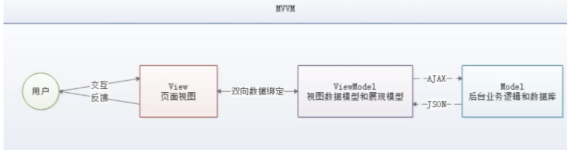
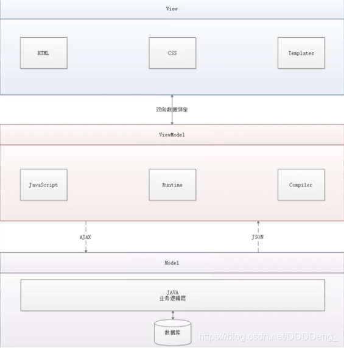
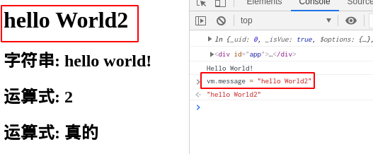
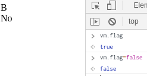
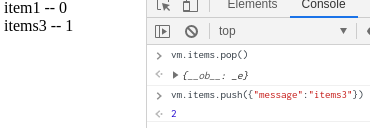

----------------------------------------------
> *Made By Herolh*
----------------------------------------------

# Vue 基本使用 {#index}

[TOC]


--------------------------------------------

## 简介
- Vue (读音 `/vjuː/`，类似于 **view**) 是一套用于构建用户界面的==渐进式框架==，发布于 2014 年 2 月。
- 与其它大型框架不同的是，Vue 被设计为可以==自底向上逐层应用==。
- Vue 的核心库只关注视图层，不仅易于上手，还便于与第三方库（如：`vue-router:跳转`，`vue-resource:通信`，`vuex:管理`) 或既有项目整合。
- 在 vue 中，一个核心的概念，就是让用户不再操作 DOM 元素，解放了用户的双手，让程序员可以更多的时间去关注业务逻辑

[Vue.js 官网](https://cn.vuejs.org/)


### 教程

- [Vue.js 官方文档](https://cn.vuejs.org/v2/guide/)
- [gitlab - 狂神说 Vue 课堂笔记](https://github.com/lzh66666/Vue/tree/master/Vue%E8%AF%BE%E5%A0%82%E7%AC%94%E8%AE%B0)


### 学习 vue 前的准备工作

- 扎实的 HTML/CSS/Javascript 基本功，这是前置条件。
- 不要用任何的构建项目工具，只用最简单的 `<script>`，把教程里的例子模仿一遍，理解用法。**不推荐上来就直接用 `vue-cli`  构建项目，尤其是如果没有 `Node/Webpack` 基础。**


### 概念了解

#### 前端框架和库的区别

- **框架**：是一套完整的解决方案；对项目的侵入性较大，项目如果需要重新更换框架，需要重新架构整个项目
- **库**： 提供某个小功能，对项目侵入性小，如果某个库无法完成某些需求，可以很容易的切换到其他库实现需求


##### 功能上的不同

- **jquery库**：包含 `DOM(操作DOM)+请求`，就是一块功能。
- **art-template库**：模板引擎渲染，高性能的渲染DOM  (我们后端的一种模板  跟python的模板类似)
- **框架**：大而全的概念，简易的 `DOM体验+请求处理+模板引擎`

==库就是一个小套餐，框架就是全家桶。==


##### 代码上的不同

> 一般使用库的代码，是调用某个函数或者直接使用抛出来的对象，我们自己处理库中的代码。 
> 一般使用框架，其框架本身提供的好的成套的工具帮我们运行我们编写好的代码。


##### 框架的使用

- 初始化自身的一些行为
- 执行你所编写的代码
- 释放一些资源


#### MVVM

> MVVM (Model-View-ViewModel) 是一种软件架构设计模式，由微软 WPF (用于替代 WinForm，以前就是用这个技术开发桌面应用程序的) 和 Silverlight (类似于 Java Applet, 简单点说就是在浏览器上运行的 WPF) 的架构师 Ken Cooper 和 Ted Peters 开发，是一种简化用户界面的事件驱动编程方式。由 John Gossman (同样也是 WPF 和 Silverlight 的架构师) 于 2005 年在他的博客上发表。

&emsp;&emsp;MVVM 是前端视图层的概念，主要关注于视图层分离，也就是说 MVVM 把前端的视图层分成了三部分：`Model`、`View`、`VM ViewModel`。MVVM 的核心是 ViewModel 层，负责转换 Model 中的数据对象来让数据变得更容易管理和使用，其作用是：==向上与视图层进行双向数据绑定，向下与 Model 层通过接口请求进行数据交互。==



- **Model**

    > 模型层， 在这里表示 JavaScript 对象。

- **View**

    > 视图层， 在这里表示 DOM (HTML 操作的元素)。

- **ViewModel**

    > 连接视图和数据的中间件， Vue.js 就是 MVVM 中的 View Model 层的实现者。


##### 为什么要使用 MVVM

MVVM 模式和 MVC 模式一样，主要目的是分离视图 (View) 和模型 (Model), 有几大好处：

- **低耦合**

    > 视图 (View) 可以独立于 Model 变化和修改，一个 ViewModel 可以绑定到不同的 View 上，当 View 变化的时候 Model 可以不变，当 Model 变化的时候 View 也可以不变。

- **可复用**

    > 你可以把一些视图逻辑放在一个 ViewModel 里面，让很多 View 重用这段视图逻辑。

- **独立开发**

    > 开发人员可以专注于业务逻辑和数据的开发 (ViewModel), 设计人员可以专注于页面设计。

- **可测试**

    > 界面素来是比较难于测试的，而现在测试可以针对 ViewModel 来写。


##### Vue 是 MVVM 模式的实现者



&emsp;&emsp;在 MVVM 架构中， 是不允许数据和视图直接通信的， 只能通过 ViewModel 来通信， 而 View Model 就是定义了一个 Observer 观察者。ViewModel 能够观察到数据的变化， 并对视图对应的内容进行更新；ViewModel 能够监听到视图的变化， 并能够通知数据发生改变。至此， 我们就明白了， Vue.js 就是一个 MV VM 的实现者， 他的核心就是实现了 DOM 监听与数据绑定


### 兼容性

&emsp;&emsp;Vue **不支持** `IE8` 及以下版本，因为 Vue 使用了 IE8 无法模拟的 `ECMAScript 5` 特性。但它支持所有兼容 `ECMAScript 5` 的浏览器。在使用 Vue 时，我们推荐在你的浏览器上安装 [Vue Devtools](https://github.com/vuejs/vue-devtools#vue-devtools)。它允许你在一个更友好的界面中审查和调试 Vue 应用。

- [开发版本](https://cn.vuejs.org/js/vue.js) : 包含完整的警告和调试模式

- [生产版本](https://cn.vuejs.org/js/vue.min.js) : 删除了警告，33.30KB min+gzip


### 下载地址

- 开发版本
    - 包含完整的警告和调试模式：https：//yuejs.org/js/vue.js
    - 删除了警告， 30.96KBmin+gzip：https：//vuejs.org/js/vue.min.js
- CDN
    - `<script src=“https://cdn.jsdelivr.net/npm/vue@2.5.21/dist/vue.js”></script>`
    - `<script src="https://cdn.jsdelivr.net/npm/vue@2.5.21/dist/vue.min.js"></script>`

#### 引包

- 对于制作原型或学习，你可以这样使用最新版本：

    ```javascript
    <script src="https://cdn.jsdelivr.net/npm/vue/dist/vue.js"></script>
    ```

- 对于生产环境，我们推荐链接到一个明确的版本号和构建文件，以避免新版本造成的不可预期的破坏：

    ```javascript
    <script src="https://cdn.jsdelivr.net/npm/vue@2.6.0"></script>
    ```

- 如果你使用原生 ES Modules，这里也有一个兼容 ES Module 的构建文件：

    ```javascript
    <script type="module">
      import Vue from 'https://cdn.jsdelivr.net/npm/vue@2.6.10/dist/vue.esm.browser.js'
    </script>
    ```

    


## vue 的基础语法
### hello world!
- 创建一个 HTML 文件
- 引入 Vue.js

    ```html
     <!--1.导入Vue.js-->
     <script src="https://cdn.jsdelivr.net/npm/vue@2.5.21/dist/vue.min.js"></script>
    ```

- 创建一个 Vue 实例
    ```javascript
    <script type="text/javascript">
         var vm = new Vue({
             el:"#app",
             /*Model：数据*/
             data:{
                 message:"hello,vue!"
             }
         });
    </script>
    
    //说明：
    //- `el: '#vue'`：绑定元素的ID
    //- `data:{message:'Hello Vue!'}`：数据对象中有一个名为message的属性，并设置了初始值 Hello Vue！
    ```

- 将数据绑定到页面元素

    ```html
    <!--view层，模板-->
     <div id="app">
         {{message}}
     </div>
    ```

    只需要在绑定的元素中使用双花括号将Vue创建的名为message属性包裹起来， 即可实现数据绑定功能， 也就实现了View Model层所需的效果， 是不是和EL表达式非常像?


#### 测试
&emsp;&emsp;为了能够更直观的体验 Vue 带来的数据绑定功能，我们需要在浏览器测试一番， 操作流程如下：
- 在浏览器上运行第一个 Vue 应用程序， 进入开发者工具
- 在控制台输入 `vm.message=‘HelloWorld’`， 然后回车， 你会发现浏览器中显示的内容会直接变成 HelloWorld
&emsp;&emsp;此时就可以在控制台直接输入 `vm.message` 来修改值， 中间是可以省略 data 的，在这个操作中，我并没有主动操作 DOM，就让页面的内容发生了变化，这就是借助了 Vue 的数据绑定功能实现的；MV VM 模式中要求 View Model 层就是==使用观察者模式来实现数据的监听与绑定==，以做到数据与视图的快速响应。


#### 完整代码：

``` html
<!-- 1. 导入 Vue.JS -->
<script src="https://cdn.jsdelivr.net/npm/vue@2.5.21/dist/vue.min.js"></script>
<body>
    <!-- 3. view 层，相当于${} -->
    <div id="app">
        <!-- 只在该 div 内生效 -->
        <h1>{{message}}</h1>
        <h2>字符串: {{'hello world!'}}</h2>
        <h2>运算式: {{1+1}}</h2>
        <h2>运算式: {{1==1?'真的':'假的'}}</h2>
    </div>
    <!-- 插值语句不生效 -->
</body>

<script>
    var vm = new Vue({
        el: "#app",                     // 绑定元素
        data: {                         // Model: 绑定数据
            message: "Hello World!"
        }
    })
    // 不建议这么去用,失去了 vue 的优势
    console.log( app );
    console.log( app.$el );					// 会自动将管理块的元素转化为 $变量
    console.log( app.msg );                 // data 内的数据都暴露为全局了
</script>
```




### 插值语法

```javascript
/*
{{}}: 模板语法插值
    {{变量}}
    {{1+1}}
    {{'hello'}}
    {{函数的调用}}
    {{1==1?'真的':'假的'}}
*/
```


### 指令系统

```html
<script src="https://cdn.jsdelivr.net/npm/vue@2.5.21/dist/vue.min.js"></script>
<body>
<div id="app">
    <a v-bind:href="url">link</a>
</div>
</body>

<script>
    var vm = new Vue({
        el: "#app",
        data: {
            "url": "http://www.baidu.com"
        }
    })
</script>
```

- 你看到的 v-bind 等被称为指令。

    > <u>指令带有前缀 v 以表示它们是 Vue 提供的特殊特性</u>。
    >
    > 可能你已经猜到了， 它们会在渲染的 DOM 上应用特殊的响应式行为在这里，该指令的意思是：“将这个元素节点的 href 特性和 Vue 实例的 url 属性保持一致”。

如果你再次打开浏览器的 JavaScript 控制台， 输入 vm.url=‘新地址’，就会再一次看到这个绑定了 title 特性的 HTML 已经进行了更新。


#### 常用

```markdown
v-text 
v-html 
v-if
v-show
v-for
v-bind
v-on
表单控件的value (看后面)
```


#### 条件渲染

##### v-if、v-else

&emsp;&emsp;`v-if` 指令用于条件性地渲染一块内容。这块内容只会在指令的表达式返回 `truthy` 值的时候被渲染。

```html
<body>
    <div id="app">
        <div v-if="type === 'A'"> A</div>
        <div v-else-if="type === 'B'"> B</div>				<!-- 2.1.0 新增 -->
        <div v-else> Not A/B</div>

        <div v-if="flag">Yes</div>
        <div v-else>No</div>
    </div>
</body>
<script>
    var vm = new Vue({
        el: "#app",
        data: {
            type: "B",
            flag: true,
        }
    })
</script>
```




##### v-show

&emsp;&emsp;另一个用于根据条件展示元素的选项是 `v-show` 指令。==不同的是带有 `v-show` 的元素始终会被渲染并保留在 DOM 中。`v-show` 只是简单地切换元素的 CSS 属性 `display`。==用法大致一样：

```html
<h1 v-show="ok">Hello!</h1>
```

```html
<div id="app">
   <div v-show="flag">show</div>
    <button v-on:click="clickHandler">切换</button>
</div>
</body>
<script>
    var vm = new Vue({
        el: "#app",
        data: {
            flag: true,
        },
        methods:{
            clickHandler:function(){
                this.flag = !this.flag;
            }
        }
    })
</script>
```

==注意，v-show 不支持 `<template> ` 元素，也不支持 v-else。==


##### v-if 和 v-show 的区别
- **`v-if` 是"真正"的条件渲染;**

  > 因为它会确保在切换过程中条件块内的事件监听器和子组件适当地被销毁和重建。

- **`v-if` 也是惰性的;**

> 如果在初始渲染时条件为假，则什么也不做——直到条件第一次变为真时，才会开始渲染条件块。

&emsp;&emsp;相比之下，`v-show` 就简单得多——不管初始条件是什么，元素总是会被渲染，并且只是简单地基于 CSS 进行切换。

```html
<div id="app">
    <div v-if="show">v-if="show"</div>
    <button v-on:click="clickHandler">切换</button>
</div>

<script>
    var app = new Vue({
        el:'#app',							// 绑定哪块区域的元素
        data:{
            show:false
        },
        methods:{
            clickHandler:function(){
                this.show = !this.show;
            }
        }
    });	
</script>
```

&emsp;&emsp;一般来说，==`v-if` 有更高的切换开销，而 `v-show` 有更高的初始渲染开销。==因此，如果需要非常频繁地切换，则使用 `v-show` 较好；如果在运行时条件很少改变，则使用 `v-if` 较好。


#### 循环语句 v-for

```html
<!--导入Vue.js-->
<script src="https://cdn.jsdelivr.net/npm/vue@2.5.21/dist/vue.min.js"></script>
<body>
<div id="app">
    <div v-for="(item, index) in items">
        {{item.message}} -- {{index}}
    </div>
</div>
</body>
<script>
    var vm = new Vue({
        el: "#app",
        data: {
            items: [
                {"message": "item1"},
                {"message": "item2"},
            ]
        }
    })
</script>
```

在控制台里，输入 `app4.todos.push({ text: '新项目' })`，你会发现列表最后添加了一个新项目。




#### 元素绑定 v-bind

> 用于响应式地更新 HTML 特性

```html
<a v-bind:href="url">...</a>
```

在这里 `href` 是参数，告知 `v-bind` 指令将该元素的 `href` 特性与表达式 `url` 的值绑定。


**v-bind 缩写**

```html
<!-- 完整语法 -->
<a v-bind:href="url">...</a>

<!-- 缩写 -->
<a :href="url">...</a>
```


#### 事件绑定 v-on

&emsp;&emsp;vue 中使用 `v-on:click` 对当前 DOM 绑定 click 事件 注意: ==所有的原 js 的事件使用 `v-on` 都可以绑定==:[浏览器事件列表](https://www.jquery123.com/category/events/)

```html
<div id="app">
    <p> The button above has been clicked {{ counter }} times. </p>
    <button v-on:click="clickHandler">切换</button>		 <!-- 绑定事件处理 -->
    <button v-on:click="say('what')">Say what</button>
    <button v-on:click="counter += 1">Add 1</button>
</div>

<script>
    var app = new Vue({
        el:'#app',	
        data:{
            counter: 0,
        },
        methods:{
            clickHandler:function(){
                alert( "绑定无参数方法!" );
            },
            say: function (message) {
                alert(message+" 绑定有参数方法!");
            }
        }
    });	
</script>
```


##### 事件修饰符

> 修饰符是以半角句号 `.` 指明的特殊后缀，用于指出一个指令应该以特殊方式绑定。

- `.stop`
- `.prevent`
- `.capture`
- `.self`
- `.once`
- `.passive`

```html
<!-- 阻止单击事件继续传播 -->
<a v-on:click.stop="doThis"></a>

<!-- 提交事件不再重载页面 -->
<form v-on:submit.prevent="onSubmit"></form>

<!-- 修饰符可以串联 -->
<a v-on:click.stop.prevent="doThat"></a>

<!-- 只有修饰符 -->
<form v-on:submit.prevent></form>

<!-- 添加事件监听器时使用事件捕获模式 -->
<!-- 即内部元素触发的事件先在此处理，然后才交由内部元素进行处理 -->
<div v-on:click.capture="doThis">...</div>

<!-- 只当在 event.target 是当前元素自身时触发处理函数 -->
<!-- 即事件不是从内部元素触发的 -->
<div v-on:click.self="doThat">...</div>


<!-- 2.1.4 新增 -->
<!-- 点击事件将只会触发一次 -->
<!-- .once 修饰符还能被用到自定义的组件事件上。 -->
<a v-on:click.once="doThis"></a>

<!-- 2.3.0 新增 -->
<!-- 滚动事件的默认行为 (即滚动行为) 将会立即触发 -->
<!-- 而不会等待 `onScroll` 完成  -->
<!-- 这其中包含 `event.preventDefault()` 的情况 -->
<div v-on:scroll.passive="onScroll">...</div>
```

&emsp;&emsp;使用修饰符时，顺序很重要；相应的代码会以同样的顺序产生。因此，用 `v-on:click.prevent.self`会阻止**所有的点击**，而 `v-on:click.self.prevent` 只会阻止对元素自身的点击。

&emsp;&emsp;不要把 `.passive` 和 `.prevent` 一起使用，因为 `.prevent` 将会被忽略，同时浏览器可能会向你展示一个警告。请记住，`.passive` 会告诉浏览器你*不*想阻止事件的默认行为。


##### v-on 缩写

```html
<!-- 完整语法 -->
<a v-on:click="doSomething">...</a>

<!-- 缩写 -->
<a @click="doSomething">...</a>
```


## Vue 常用 7 个属性

[Vue 常用 7 个属性](https://www.cnblogs.com/bgwhite/p/9297221.html)

学习 vue 我们必须之到它的 7 个属性，8 个 方法，以及 7 个指令。787 原则

- el 属性

- - 用来指示 vue 编译器从什么地方开始解析 vue 的语法，可以说是一个占位符。

- data 属性

- - 用来组织从 view 中抽象出来的属性，可以说将视图的数据抽象出来存放在 data 中。

- template 属性

- - 用来设置模板，会替换页面元素，包括占位符。

- methods 属性

- - 放置页面中的业务逻辑，js 方法一般都放置在 methods 中

- render 属性

- - 创建真正的 Virtual Dom

- computed 属性

- - 用来计算

- watch 属性

- - watch:function(new,old){}
    - 监听 data 中数据的变化
    - 两个参数，一个返回新值，一个返回旧值，


