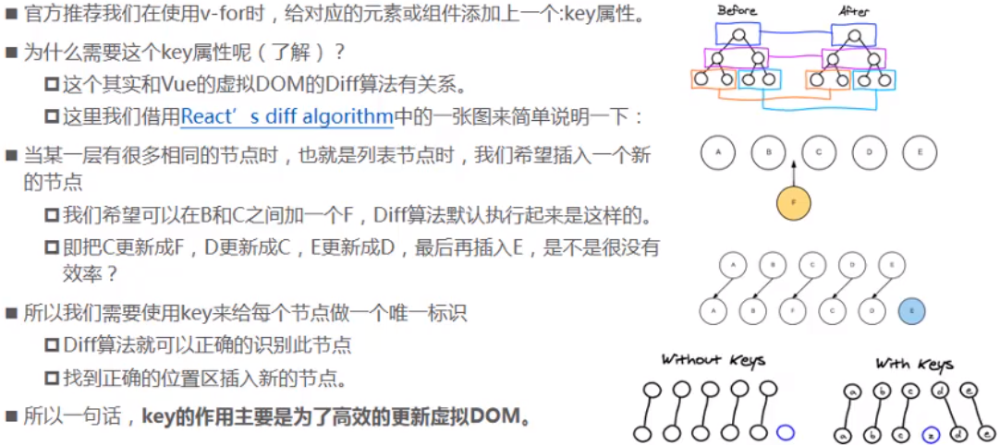
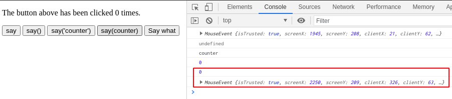
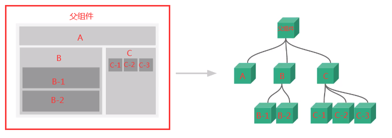
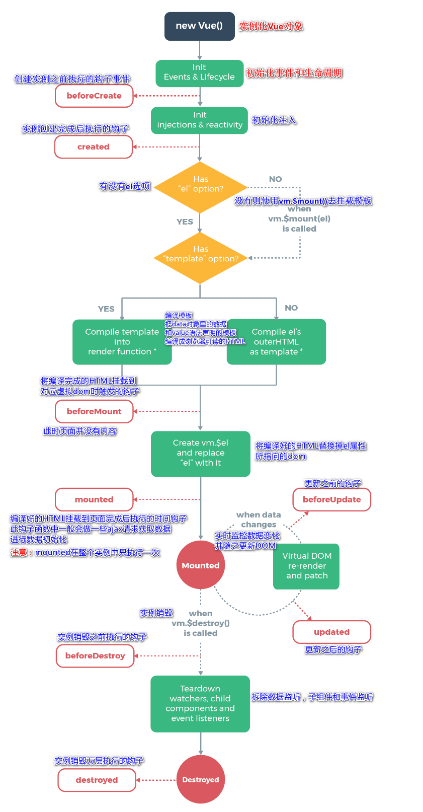
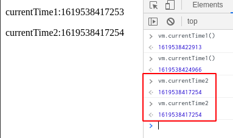

----------------------------------------------
> *Made By Herolh*
----------------------------------------------

# Vue 基本使用 {#index}

[TOC]


--------------------------------------------

## 简介
- Vue (读音 `/vjuː/`，类似于 **view**) 是一套用于构建用户界面的==渐进式框架==，发布于 2014 年 2 月。
- 与其它大型框架不同的是，Vue 被设计为可以==自底向上逐层应用==。
- Vue 的核心库只关注视图层，不仅易于上手，还便于与第三方库（如：`vue-router:跳转`，`vue-resource:通信`，`vuex:管理`) 或既有项目整合。
- 在 vue 中，一个核心的概念，就是让用户不再操作 DOM 元素，解放了用户的双手，让程序员可以更多的时间去关注业务逻辑

[Vue.js 官网](https://cn.vuejs.org/)


### 教程

- [Vue.js 官方文档](https://cn.vuejs.org/v2/guide/)
- [gitlab - 狂神说 Vue 课堂笔记](https://github.com/lzh66666/Vue/tree/master/Vue%E8%AF%BE%E5%A0%82%E7%AC%94%E8%AE%B0)


#### 学习 vue 前的准备工作

- 扎实的 HTML/CSS/Javascript 基本功，这是前置条件。
- 不要用任何的构建项目工具，只用最简单的 `<script>`，把教程里的例子模仿一遍，理解用法。**不推荐上来就直接用 `vue-cli`  构建项目，尤其是如果没有 `Node/Webpack` 基础。**


### 概念了解

#### 什么是渐进式框架？

- 渐进式意味着你可以将 Vue 作为你应用的一部分嵌入，在使用 Vue.js 时，你也可以结合其他库一起使用，比如 jQuery。也可以使用 Vue 完成更多的业务逻辑。


#### 前端框架和库的区别

- **框架**：是一套完整的解决方案；对项目的侵入性较大，项目如果需要重新更换框架，需要重新架构整个项目
- **库**： 提供某个小功能，对项目侵入性小，如果某个库无法完成某些需求，可以很容易的切换到其他库实现需求


##### 功能上的不同

- **jquery库**：包含 `DOM(操作DOM)+请求`，就是一块功能。
- **art-template库**：模板引擎渲染，高性能的渲染DOM  (我们后端的一种模板  跟python的模板类似)
- **框架**：大而全的概念，简易的 `DOM体验+请求处理+模板引擎`

==库就是一个小套餐，框架就是全家桶。==


##### 代码上的不同

> 一般使用库的代码，是调用某个函数或者直接使用抛出来的对象，我们自己处理库中的代码。 
> 一般使用框架，其框架本身提供的好的成套的工具帮我们运行我们编写好的代码。


##### 框架的使用

- 初始化自身的一些行为
- 执行你所编写的代码
- 释放一些资源


#### MVVM

> &emsp;&emsp;MVVM (Model-View-ViewModel) 是一种软件架构设计模式，由微软 WPF (用于替代 WinForm，以前就是用这个技术开发桌面应用程序的) 和 Silverlight (类似于 Java Applet, 简单点说就是在浏览器上运行的 WPF) 的架构师 Ken Cooper 和 Ted Peters 开发，是一种简化用户界面的事件驱动编程方式。由 John Gossman (同样也是 WPF 和 Silverlight 的架构师) 于 2005 年在他的博客上发表。

&emsp;&emsp;MVVM 是前端视图层的概念，主要关注于视图层分离，也就是说 MVVM 把前端的视图层分成了三部分：`Model`、`View`、`VM ViewModel`。MVVM 的核心是 ViewModel 层，负责转换 Model 中的数据对象来让数据变得更容易管理和使用，其作用是：==向上与视图层进行双向数据绑定，向下与 Model 层通过接口请求进行数据交互。==


- **Model**

    > 模型层， 在这里表示 JavaScript 对象。

- **View**

    > 视图层， 在这里表示 DOM (HTML 操作的元素)。

- **ViewModel**

    > 连接视图和数据的中间件， Vue.js 就是 MVVM 中的 View Model 层的实现者。


##### 为什么要使用 MVVM

MVVM 模式和 MVC 模式一样，主要目的是分离视图 (View) 和模型 (Model), 有几大好处：

- **低耦合**

    > 视图 (View) 可以独立于 Model 变化和修改，一个 ViewModel 可以绑定到不同的 View 上，当 View 变化的时候 Model 可以不变，当 Model 变化的时候 View 也可以不变。

- **可复用**

    > 你可以把一些视图逻辑放在一个 ViewModel 里面，让很多 View 重用这段视图逻辑。

- **独立开发**

    > 开发人员可以专注于业务逻辑和数据的开发 (ViewModel), 设计人员可以专注于页面设计。

- **可测试**

    > 界面素来是比较难于测试的，而现在测试可以针对 ViewModel 来写。


##### Vue 是 MVVM 模式的实现者


&emsp;&emsp;在 MVVM 架构中， 是不允许数据和视图直接通信的， 只能通过 ViewModel 来通信， 而 View Model 就是定义了一个 Observer 观察者。ViewModel 能够观察到数据的变化， 并对视图对应的内容进行更新；ViewModel 能够监听到视图的变化， 并能够通知数据发生改变。至此， 我们就明白了， Vue.js 就是一个 MV VM 的实现者， 他的核心就是实现了 DOM 监听与数据绑定


##### Vue 的 MVVM


&emsp;&emsp;**ViewModel 是 Vue.js 的核心，它是一个 Vue 实例**。Vue 实例是作用于某一个 HTML 元素上的，这个元素可以是 HTML 的 body 元素，也可以是指定了 id 的某个元素。


### 兼容性

&emsp;&emsp;Vue **不支持** `IE8` 及以下版本，因为 Vue 使用了 IE8 无法模拟的 `ECMAScript 5` 特性。但它支持所有兼容 `ECMAScript 5` 的浏览器。在使用 Vue 时，我们推荐在你的浏览器上安装 [Vue Devtools](https://github.com/vuejs/vue-devtools#vue-devtools)。它允许你在一个更友好的界面中审查和调试 Vue 应用。

- [开发版本](https://cn.vuejs.org/js/vue.js) : 包含完整的警告和调试模式

- [生产版本](https://cn.vuejs.org/js/vue.min.js) : 删除了警告，33.30KB min+gzip


### 下载地址

- 开发版本

    ```shell
    # 包含完整的警告和调试模式：
    https://yuejs.org/js/vue.js
    
    # 删除了警告， 30.96KBmin+gzip：
    https://vuejs.org/js/vue.min.js
    ```

- CDN
  
    ```html
    <!-- 开发环境版本，包含了有帮助的命令行警告 -->
    <script src="https://cdn.jsdelivr.net/npm/vue/dist/vue.js"></script>
    
    <!-- 生产环境版本，优化了尺寸和速度 -->
    <script src="https://cdn.jsdelivr.net/npm/vue"></script>
    ```


#### 引包

- 对于制作原型或学习，你可以这样使用最新版本：

    ```javascript
    <script src="https://cdn.jsdelivr.net/npm/vue/dist/vue.js"></script>
    ```

- 对于生产环境，我们推荐链接到一个明确的版本号和构建文件，以避免新版本造成的不可预期的破坏：

    ```javascript
    <script src="https://cdn.jsdelivr.net/npm/vue@2.6.0"></script>
    ```

- 如果你使用原生 ES Modules，这里也有一个兼容 ES Module 的构建文件：

    ```javascript
    <script type="module">
      import Vue from 'https://cdn.jsdelivr.net/npm/vue@2.6.10/dist/vue.esm.browser.js'
    </script>
    ```

    


## vue 的基础语法
### hello world!
- 创建一个 HTML 文件
- 引入 Vue.js

    ```html
     <!--1.导入Vue.js-->
     <script src="https://cdn.jsdelivr.net/npm/vue@2.5.21/dist/vue.min.js"></script>
    ```

- 创建一个 Vue 实例
    ```javascript
    <script type="text/javascript">
         var vm = new Vue({
             el:"#app",
             /*Model：数据*/
             data:{
                 message:"hello,vue!"
             }
         });
    </script>
    
    //说明：
    //- `el: '#vue'`：绑定元素的ID
    //- `data:{message:'Hello Vue!'}`：数据对象中有一个名为message的属性，并设置了初始值 Hello Vue！
    ```

- 将数据绑定到页面元素

    ```html
    <!--view层，模板-->
     <div id="app">
         {{message}}
     </div>
    ```

    只需要在绑定的元素中使用双花括号将Vue创建的名为message属性包裹起来， 即可实现数据绑定功能， 也就实现了View Model层所需的效果， 是不是和EL表达式非常像?


#### 测试
&emsp;&emsp;为了能够更直观的体验 Vue 带来的数据绑定功能，我们需要在浏览器测试一番， 操作流程如下：
- 在浏览器上运行第一个 Vue 应用程序， 进入开发者工具
- 在控制台输入 `vm.message=‘HelloWorld’`， 然后回车， 你会发现浏览器中显示的内容会直接变成 HelloWorld
&emsp;&emsp;此时就可以在控制台直接输入 `vm.message` 来修改值， 中间是可以省略 data 的，在这个操作中，我并没有主动操作 DOM，就让页面的内容发生了变化，这就是借助了 Vue 的数据绑定功能实现的；MV VM 模式中要求 View Model 层就是==使用观察者模式来实现数据的监听与绑定==，以做到数据与视图的快速响应。


#### 完整代码：

``` html
<!-- 1. 导入 Vue.JS -->
<script src="https://cdn.jsdelivr.net/npm/vue@2.5.21/dist/vue.min.js"></script>
<body>
    <!-- 3. view 层，相当于${} -->
    <div id="app">
        <!-- 只在该 div 内生效 -->
        <h1>{{message}}</h1>
        <h1 v-once>{{message}}</h1>         <!-- 只会在第一次的时候展示数据，后续不做改变 --> 
        <h2>字符串: {{'hello world!'}}</h2>
        <h2>运算式: {{1+1}}</h2>
        <h2>运算式: {{1==1?'真的':'假的'}}</h2>
    </div>
    <!-- 插值语句不生效 -->
</body>

<script>
    // 编程范式： 声明式编程
    var vm = new Vue({
        el: "#app",                     // 绑定元素
        data: {                         // Model: 绑定数据
            message: "Hello World!"
        }
    })
    // 不建议这么去用,失去了 vue 的优势
    console.log( app );
    console.log( app.$el );					// 会自动将管理块的元素转化为 $变量
    console.log( app.msg );                 // data 内的数据都暴露为全局了
    
    // 元素 js 的做法(编程范式： 命令式编程)
    // 1. 创建 div 元素， 设置 id 属性
    // 2. 定义一个变量叫 message
    // 3. 将 message 变量放在前面的 div 元素中显示
    // 4. 修改 message 的数据
    // 5. 将修改后的数据再次替换岛 div 元素中
</script>

```


### 插值语法

```javascript
/*
{{}}: 模板语法插值
    {{变量}}
    {{1+1}}
    {{'hello'}}
    {{函数的调用}}
    {{1==1?'真的':'假的'}}
*/
```


#### 文本 v-test

> 了解即可，不常用

```html
<body>
    <div id="app">
        <h1>{{url}}</h1>
        <h1 v-text="url">hello world!</h1>          <!-- 会覆盖标签内的值-->
    </div>
</body>

<script>
    var vm = new Vue({
        el: "#app",
        data: {                         // Model: 绑定数据
            url: 'http://www.baidu.com',
        }
    })
</script>
```


#### 一次性地插值 v-once

> 了解即可，不常用

通过使用 [v-once 指令](https://cn.vuejs.org/v2/api/#v-once)，你也能执行一次性地插值，当数据改变时，插值处的内容不会更新。但请留心这会影响到该节点上的其它数据绑定：

```html
<span v-once>这个将不会改变: {{ msg }}</span>
```


#### 原始 HTML v-html

> 了解即可，不常用

双大括号会将数据解释为普通文本，而非 HTML 代码。为了输出真正的 HTML，你需要使用 [`v-html` 指令](https://cn.vuejs.org/v2/api/#v-html)：

```html
<body>
    <!-- 3. view 层，相当于${} -->
    <div id="app">
        <!-- 只在该 div 内生效 -->
        <h1>{{url_a1}}</h1>
        <h1><span v-html="url_a1"></span></h1>
        <h1><span v-html="url_a2"></span></h1>
    </div>
    <!-- 插值语句不生效 -->
</body>

<script>
    // 编程范式： 声明式编程
    var vm = new Vue({
        el: "#app",                     // 绑定元素
        data: {                         // Model: 绑定数据
            url: 'http://www.baidu.com',
            url_a1: '<a href="http://www.baidu.com">link</a>',
            url_a2: '<a href="{{url}}">{{url}}</a>'
        }
    })
</script>
```

`span` 的内容将会被替换成为 property 值 `rawHtml`，直接作为 HTML—— 会忽略解析 property 值中的数据绑定。注意，你不能使用 `v-html` 来复合局部模板，因为 Vue 不是基于字符串的模板引擎。反之，对于用户界面 (UI)，组件更适合作为可重用和可组合的基本单位。


**注意：**

你的站点上动态渲染的任意 HTML 可能会非常危险，因为它很容易导致 [XSS 攻击](https://en.wikipedia.org/wiki/Cross-site_scripting)。请只对可信内容使用 HTML 插值，**绝不要**对用户提供的内容使用插值。


#### 不解析 v-pre

> 了解即可，不常用

原封不动的展示，不会去解析

```html
<h1 v-pre>{{url}}</h1>
```

不会填充，直接展示 `url`


#### 解决闪烁 v-cloak

> 了解即可，不常用

```html
<style>
    [v-cloak] {
        display: none;
    }
</style>

<body>
    <div id="app">
        <h1>{{url}}</h1>
        <h1 v-cloak>{{url}}</h1>
        <h1>{{url}}</h1>
    </div>
</body>

<script>
    setTimeout(function () {                // 停止 1 秒加载
        var vm = new Vue({
            el: "#app", 
            data: {  
                url: 'http://www.baidu.com',
            }
        })
    }, 1000)
    
</script>
```


### 指令系统

```html
<script src="https://cdn.jsdelivr.net/npm/vue@2.5.21/dist/vue.min.js"></script>
<body>
<div id="app">
    <a v-bind:href="url">link</a>
</div>
</body>

<script>
    var vm = new Vue({
        el: "#app",
        data: {
            "url": "http://www.baidu.com"
        }
    })
</script>
```

- 你看到的 v-bind 等被称为指令。

    > <u>指令带有前缀 v 以表示它们是 Vue 提供的特殊特性</u>。
    >
    > 可能你已经猜到了， 它们会在渲染的 DOM 上应用特殊的响应式行为在这里，该指令的意思是：“将这个元素节点的 href 特性和 Vue 实例的 url 属性保持一致”。

如果你再次打开浏览器的 JavaScript 控制台， 输入 vm.url=‘新地址’，就会再一次看到这个绑定了 title 特性的 HTML 已经进行了更新。


#### 常用

```markdown
v-text 
v-html 
v-if
v-show
v-for
v-bind
v-on
```


#### 条件渲染

##### v-if、v-else

&emsp;&emsp;`v-if` 指令用于条件性地渲染一块内容。这块内容只会在指令的表达式返回 `truthy` 值的时候被渲染。

```html
<body>
    <div id="app">
        <div v-if="type === 'A'"> A</div>
        <div v-else-if="type === 'B'"> B</div>				<!-- 2.1.0 新增 -->
        <div v-else> Not A/B</div>

        <div v-if="flag">Yes</div>
        <div v-else>No</div>
    </div>
</body>
<script>
    var vm = new Vue({
        el: "#app",
        data: {
            type: "B",
            flag: true,
        }
    })
</script>
```


##### v-show

&emsp;&emsp;另一个用于根据条件展示元素的选项是 `v-show` 指令。==不同的是带有 `v-show` 的元素始终会被渲染并保留在 DOM 中。`v-show` 只是简单地切换元素的 CSS 属性 `display: none`。==用法大致一样：

```html
<h1 v-show="ok">Hello!</h1>
```

```html
<div id="app">
   <div v-show="flag">show</div>
    <button v-on:click="clickHandler">切换</button>
</div>
</body>
<script>
    var vm = new Vue({
        el: "#app",
        data: {
            flag: true,
        },
        methods:{
            clickHandler:function(){
                this.flag = !this.flag;
            }
        }
    })
</script>
```

==注意，v-show 不支持 `<template> ` 元素，也不支持 v-else。==


##### v-if 和 v-show 的区别
- **`v-if` 是"真正"的条件渲染;**

  > 因为它会确保在切换过程中条件块内的事件监听器和子组件适当地被销毁和重建。

- **`v-if` 也是惰性的;**

> 如果在初始渲染时条件为假，则什么也不做——直到条件第一次变为真时，才会开始渲染条件块。

&emsp;&emsp;相比之下，`v-show` 就简单得多——不管初始条件是什么，元素总是会被渲染，并且只是简单地基于 CSS 进行切换。

```html
<div id="app">
    <div v-if="show">v-if="show"</div>
    <button v-on:click="clickHandler">切换</button>
</div>

<script>
    var app = new Vue({
        el:'#app',							// 绑定哪块区域的元素
        data:{
            show:false
        },
        methods:{
            clickHandler:function(){
                this.show = !this.show;
            }
        }
    });	
</script>
```

&emsp;&emsp;一般来说，==`v-if` 有更高的切换开销，而 `v-show` 有更高的初始渲染开销。==因此，如果需要非常频繁地切换，则使用 `v-show` 较好；如果在运行时条件很少改变，则使用 `v-if` 较好。


##### 注意事项

问题：有输入内容的时候，切换了类型，会发现文字依然显示之前的输入内容，按道理我们应该切换到另一个 input 元素中，这时候值应该清空

> 解答：
> 这是因为 Vue 在进行 DOM 渲染的时候，出于性能考虑，会尽可能复用已经存在的元素，而不是重新创建新的元素，在下面的案例中，Vue 会发现原来的 input 元素不再使用，直接作为 else 中的 input 进行使用
>
> 解决方案：
> 如果我们不希望出现类似复用的问题，可以给对应的 input 加 key，并保证 key 的不同

```html
<body>
    <div id="app">
        <span v-if="flag1">
            <label for="username">用户帐号</label>
            <input type="text" id="username" placeholder="用户账户"> 
        </span>
        <span v-else>
            <label for="email">用户邮箱</label>
            <input type="text" id="email" placeholder="用户邮箱"> 
        </span>
        <button @click="flag1 = !flag1">切换类型</button>
        <br>
        <span v-if="flag2">
            <label for="username2">用户帐号</label>
            <input type="text" id="username2" placeholder="用户账户" key="username"> 
        </span>
        <span v-else>
            <label for="email2">用户邮箱</label>
            <input type="text" id="email2" placeholder="用户邮箱" key="email2"> 
        </span>
        <button @click="flag2 = !flag2">切换类型</button>
    </div>
</body>
<script>
    var vm = new Vue({
        el: "#app",
        data: {
            flag1: true,
            flag2: true,
        }
    })
</script>
```


#### 循环语句 v-for

```html
<body>
<div id="app">
    <div v-for="item in items">
        {{item}}
    </div>
    <hr>

    <div v-for="(key, value, index) in info">
        {{key}} - {{value}} - {{index}}
    </div>
    <hr>

    <div v-for="(item, index) in items">
        {{item.message}} -- {{index}}
    </div>
</div>
</body>
<script>
    var vm = new Vue({
        el: "#app",
        data: {
            items: [
                {"message": "item1"},
                {"message": "item2"},
            ],
            info: {
                "str1": "string1",
                "str2": "string2"
            }
        }
    })
</script>
```

在控制台里，输入 `app.items.push({ text: '新项目' })`，你会发现列表最后添加了一个新项目。


##### v-for 绑定 key

> 官方推荐我们在使用 v-for 的时候，给对应的元素或组件添加上一个 `:key` 属性。

为什么需要这个 `:key` 属性？

> 和 Vue 的虚拟 DOM 的 DIff 算法有关系。 **key 的作用是为了高效的更新虚拟 DOM**



```html
<body>
<div id="app">
    <div v-for="item in letters" ::key="item">{{item}}</div>
</div>
</body>
<script>
    var vm = new Vue({
        el: "#app",
        data: {
            letters: ["A", "B", "C", "D", "E"]
        }
    })
    // vm.letters.splice(2, 0, "F")
</script>
```


##### 并不是所有的修改都是响应式的

```html
<div id="app">
    <div v-for="item in letters" ::key="item">{{item}}</div>
    <button @click="pushClick">push a value</button>
    <button @click="modifyClick">modify a value</button>
</div>
</body>
<script>
    var vm = new Vue({
        el: "#app",
        data: {
            letters: ["A", "B", "C", "D", "E"]
        },
        methods: {
            pushClick() {
                // 响应式
                this.letters.push("push a value")
                // pop()            删除最后一个元素
                // shift()          删除第一个元素
                // unshift()        在数组最前面添加一个元素
                // splice()         删除元素/插入元素/替换元素 (start_index, delete_num, value)
                // sort()           排序
                // reverse()        反序
            },
            modifyClick() {
                // 非响应式
                this.letters[0] = "modify a value"
                // vm.letters.splice(0, 1, "modify a value")            // 响应式
                // Vue.set(this.letters, 0, "modify a value")           // 响应式
            }
        },
    })
</script>
```


#### 元素绑定 v-bind

> 用于响应式地更新 HTML 特性

```html
<a v-bind:href="url">...</a>

<!-- 
	错误做法： 此处不可使用插值语法：
	<a href="{{url}}">link</a>
	<a href="url">link</a>
-->
```

在这里 `href` 是参数，告知 `v-bind` 指令将该元素的 `href` 特性与表达式 `url` 的值绑定。


**v-bind 缩写**

```html
<!-- 完整语法 -->
<a v-bind:href="url">...</a>

<!-- 缩写 -->
<a :href="url">...</a>
```


##### 动态绑定 class

###### 对象语法

```html
<style>
    .line {
        background-color: red;
    }
    .active {
        color: green;
    }
</style>

<div id="app">
    <h2 class="active">{{message}}</h2>
    <h2 :class="class_active">{{message}}</h2>
    <!-- 
        <h2 :class="{key1: value1, key2: value2}">{{message}}</h2>
        <h2 :class="{类名1： true, 类名2： boolean}">{{message}}</h2> 
    -->
    <!-- class 会进行合并 -->
    <h3 :style="{fontSize: '100px'}">{{message}}</h3>
    <h2 class="" :class="{active:is_class_active, line:is_class_line}">{{message}}</h2> 
    <h2 class="" :class="getClasses()">{{message}}</h2> 
    <button v-on:click="activeClick">font_green</button>
    <button v-on:click="lineClick">background_red</button>

</div>
</body>

<script>
    var vm = new Vue({
        el: "#app",
        data: {
            message: "hello world!",
            class_active: "active",
            class_line: "line",
            is_class_active: true,
            is_class_line: true
        },
        methods: {
            activeClick: function () {
                this.is_class_active = !this.is_class_active
            },
            lineClick: function () {
                this.is_class_line = !this.is_class_line
            },
            getClasses: function () {
                return {active: this.is_class_active, line: this.is_class_line}
            }
        }
    })
</script>
```


###### 数组语法

```html
 <div id="app">
    <!-- 
        数组语法
        <h2 :class="[类名1, 类名2]">{{message}}</h2> 
     -->
     <h2 :class="[class_active, class_line]">{{message}}</h2> 
     <h2 :class="getClassesList()">{{message}}</h2> 

</div>


<script>
    var vm = new Vue({
        el: "#app",
        data: {
            message: "hello world!",
            class_active: "active",
            class_line: "line",
        },
        methods: {
            getClassesList: function () {
                return [this.class_active, this.class_line]
            }
        }
    })
</script>
```


##### 动态绑定 style

###### 对象语法

```html
<div id="app">


    <!-- class 会进行合并 -->
    <h3 :style="{fontSize: '100px'}">{{message}}</h3>
    <h3 :style="{fontSize: finalSize + 'px', color: finalColor}">{{message}}</h3>
    <h3 :style="getStyles()">{{message}}</h3>

</div>
</body>

<script>
    var vm = new Vue({
        el: "#app",
        data: {
            message: "hello world!",
            finalSize: 100,
            finalColor: 'red',
        },
        methods: {
            getStyles: function () {
            	// font_size ==> fontSize
                return { fontSize: this.finalSize + 'px', color: this.finalColor}
            }
        }
    })
</script>
```


###### 数组语法

```html
<div id="app">
    <!-- 对象语法 -->
    <h3 :style="{fontSize: '100px'}">{{message}}</h3>
    <h3 :style="{fontSize: finalSize + 'px', color: finalColor}">{{message}}</h3>
    <h3 :style="getStyles()">{{message}}</h3>

    <!-- 数组语法 -->
    <h4 :style="[baseStyle, baseStyle2]">{{message}}</h4>
</div>
</body>

<script>
    var vm = new Vue({
        el: "#app",
        data: {
            message: "hello world!",
            finalSize: 100,
            finalColor: 'red',
            baseStyle: {fontSize: '50px'},
            baseStyle2: {color: 'red'}
        },
        methods: {
            getStyles: function () {
                // font_size ==> fontSize
                return { fontSize: this.finalSize + 'px', color: this.finalColor}
            }
        }
    })
</script>
```


#### 事件绑定 v-on

&emsp;&emsp;vue 中使用 `v-on:click` 对当前 DOM 绑定 click 事件 注意: ==所有的原 js 的事件使用 `v-on` 都可以绑定==:[浏览器事件列表](https://www.jquery123.com/category/events/)

```html
<div id="app">
    <h2>当前计数： {{counter}}</h2>
    <button v-on:click="counter++">+</button>
    <button v-on:click="counter--">-</button>
    <hr />
    
    <p> The button above has been clicked {{ counter }} times. </p>
    <!-- 在事件定义时，写函数时省略了小括号，但是方法本身是需要一个参数的 -->
    <button v-on:click="clickHandler">切换</button>		 <!-- 绑定事件处理 -->
    <button v-on:click="say('what')">Say what</button>
    <button @click="counter += 1">Add 1</button>
</div>

<script>
    var app = new Vue({
        el:'#app',	
        data:{
            counter: 0,
        },
        methods:{
            clickHandler:function(){
                alert( "绑定无参数方法!" );
            },
            say(message) {                          // 相当于 say: function(message)
                alert(message+" 绑定有参数方法!");
            }
        }
    });	
</script>
```


##### v-on 缩写

```html
<!-- 完整语法 -->
<a v-on:click="doSomething">...</a>

<!-- 缩写 -->
<a @click="doSomething">...</a>

<!-- 动态参数的缩写 (2.6.0+) -->
<a @[event]="doSomething"> ... </a>
```


##### v-on 传参

```html
<body>
<div id="app">
    <p> The button above has been clicked {{ counter }} times. </p>
    <!-- 
        在事件定义时，写函数时省略了小括号，但是方法本身是需要一个参数的 
        这个时候 Vue 会把浏览器产生的 event 事件对象作为参数传入方法
    -->
    <button v-on:click="say">say</button>              <!-- 默认传递事件对象 --> 
    <button v-on:click="say()">say()</button>            <!-- undefined -->
    <button v-on:click="say('counter')">say('counter')</button>      <!-- str -->
    <button v-on:click="say(counter)">say(counter)</button>     <!-- var -->

    <!-- 方法调用时，我们需要 event 对象， 同时又需要其他参数 
        调用方法时，手动获取到浏览器参数的 event 对象： $event
    -->
    <button v-on:click="paramsWithEvent(counter, $event)">Say what</button>
</div>

<script>
    var app = new Vue({
        el:'#app',
        data:{
            counter: 0,
        },
        methods:{
            say(message) {                          // 相当于 say: function(message)
                console.log(message)
                alert(message+" 绑定有参数方法!");
            },
            paramsWithEvent(message, event) {
                console.log(message)
                console.log(event)
            }
        }
    });

    // 如果函数需要参数，但是没有传入，那么函数的形参为 undefined
    // function abc(name) {
    //     console.log(name);
    // };
</script>
</body>
```




##### 事件修饰符

> 修饰符是以半角句号 `.` 指明的特殊后缀，用于指出一个指令应该以特殊方式绑定。

###### `.stop`

当我们使用点击按钮的时候，会遇到个别问题，比如在一个 div 区域之内绑定了点击事件而在这个区域之内绑定了一个按钮的点击事件，会发现一个问题，点击按钮的时候，同时也会触发 div 的点击事件，代码加上 stop 修饰符之后，再点击按钮的时候就不会触发 div 的点击事件。

```html
<!-- 阻止单击事件继续传播 -->
<a v-on:click.stop="doThis"></a>
```


###### `.once`

点击多次，只会触发一次

```html
<button @click.once="onceBtn">只能点击一次</button>
```


###### `.prevent`

例如 form 表单的提交，现在有个需求需要手动提交，不需要默认提交在监听点击事件后面加上 prevent 修饰符

```html
<!-- 提交事件不再重载页面 -->
<form v-on:submit.prevent="onSubmit"></form>
```


###### `.enter`

回车按键：enter 修饰符。输入之后，keyup 监听事件没有反应，当按下回车之后则会触发监听事件

```html
<!-- 当输入一些信息之后，按下回车才能触发事件 -->
<input type="text" @keyup.enter="keyUp">
```


###### `.native`

监听自定义组件。当我们自定义组件时候需要监听自定义组件之时，`@click` 则不会起到监听作用。

```html
//当监听不是原生的组件时候，而是自定义组件的时候则需要native修饰
<cpn @click.native="cpn">自定义组件</cpn>
```


- `.capture`
- `.self`
- `.passive`

```html
<!-- 修饰符可以串联 -->
<a v-on:click.stop.prevent="doThat"></a>

<!-- 只有修饰符 -->
<form v-on:submit.prevent></form>

<!-- 添加事件监听器时使用事件捕获模式 -->
<!-- 即内部元素触发的事件先在此处理，然后才交由内部元素进行处理 -->
<div v-on:click.capture="doThis">...</div>

<!-- 只当在 event.target 是当前元素自身时触发处理函数 -->
<!-- 即事件不是从内部元素触发的 -->
<div v-on:click.self="doThat">...</div>


<!-- 2.1.4 新增 -->
<!-- 点击事件将只会触发一次 -->
<!-- .once 修饰符还能被用到自定义的组件事件上。 -->
<a v-on:click.once="doThis"></a>

<!-- 2.3.0 新增 -->
<!-- 滚动事件的默认行为 (即滚动行为) 将会立即触发 -->
<!-- 而不会等待 `onScroll` 完成  -->
<!-- 这其中包含 `event.preventDefault()` 的情况 -->
<div v-on:scroll.passive="onScroll">...</div>
```

&emsp;&emsp;使用修饰符时，顺序很重要；相应的代码会以同样的顺序产生。因此，用 `v-on:click.prevent.self`会阻止**所有的点击**，而 `v-on:click.self.prevent` 只会阻止对元素自身的点击。

&emsp;&emsp;不要把 `.passive` 和 `.prevent` 一起使用，因为 `.prevent` 将会被忽略，同时浏览器可能会向你展示一个警告。请记住，`.passive` 会告诉浏览器你*不*想阻止事件的默认行为。


###### demo

```html
<div id="app">
    <div @click="divClick">
        <button @click="btnClick">无修饰符按钮</button>
    </div>

    <div @click="divClick">
        <!-- 阻止单击事件继续传播 -->
        <button @click.stop="btnClick">stop 修饰符按钮</button>
    </div>
    <hr>

    <form action="http://www.baidu.com" method="get">
        <input type="submit" value="无修饰符提交" @click="submitClick">会跳转
    </form>

    <form action="http://www.baidu.com" method="get">
        <!-- 提交事件不再重载页面 -->
        <input type="submit" value="prevent 修饰符提交" @click.prevent="submitClick">不会跳转
    </form>
    <hr>

    <input type="text" @keyup="keyUp" @keydown="keyDown">
    <input type="text" @keyup.enter="keyUp">
    <hr>

    <button @click="btnClick">无修饰符按钮</button>
    <button @click.once="btnClick">once 修饰符按钮</button>
</div>

<script>
    var app = new Vue({
        el:'#app',
        data:{
            counter: 0,
        },
        methods:{
            divClick() {
                console.log("divClick")
            },
            btnClick() {
                console.log("btnClick")
            },
            submitClick() {
                console.log("submitClick")
            },
            keyDown() {
                console.log("键盘按下")
            },
            keyUp() {
                // 用的更多
                console.log("键盘按起")
            }
        }
    });
</script>
</body>
```


#### 双向数据绑定 v-model

&emsp;&emsp;Vue.js 是一个 MV VM 框架，即数据双向绑定，即当数据发生变化的时候，视图也就发生变化，当视图发生变化的时候，数据也会跟着同步变化。这也算是 Vue.js 的精髓之处了。值得注意的是，我们所说的数据双向绑定，一定是对于 UI 控件来说的非 UI 控件不会涉及到数据双向绑定。
&emsp;&emsp;单向数据绑定是使用状态管理工具的前提。如果我们使用 vue x 那么数据流也是单项的，这时就会和双向数据绑定有冲突。


##### 在表单中使用双向数据绑定
&emsp;&emsp;你可以用 `v-model` 指令在表单、及元素上创建双向数据绑定。它会根据控件类型自动选取正确的方法来更新元素。尽管有些神奇， 但 `v-model` 本质上不过是语法糖。它负责监听用户的输入事件以更新数据，并对一些极端场景进行一些特殊处理。   
&emsp;&emsp;注意：==`v-model` 会忽略所有表单元素的 `value`、`checked`、`selected` 特性的初始值而总是将 `Vue` 实例的数据作为数据来源。==你应该通过 `JavaScript` 在组件的 `data` 选项中声明初始值！

```html
<body>
    <div id="app">
        文本:
        <input type="text" value="hello" v-model="message"> {{message}}
        <textarea cols="30" rows="10" v-model="message"></textarea>{{message}}
        <hr />

        单复选框:
        <input id="test_check_1" type="checkbox" v-model="checked">
        <label for="test_check_1">{{checked}}</label>
        <hr />
        多复选框:
        <input type="checkbox" value="张三" v-model="checkedName">
        <input type="checkbox" value="李四" v-model="checkedName">
        <input type="checkbox" value="王五" v-model="checkedName">
        <span>选中的值为: {{checkedName}}</span>
        <hr />

        <input type="radio" value="One" v-model="picked">
        <input type="radio" value="Two" v-model="picked">
        {{picked}}
        <hr />

        下拉框
        <select v-model="pan">
            <option value="" disabled>---请选择---</option>
            <!--
            注意：v-model 表达式的初始值未能匹配任何选项，元系将被渲染为 “未选中” 状态。
            在 iOS 中， 这会使用户无法选择第一个选项，因为这样的情况下，iOS 不会触发 change 事件。
            因此，更推荐像上面这样提供一个值为空的禁用选项。
            -->
            <option>A</option>
            <option>B</option>
            <option>C</option>
            <option>D</option>
        </select>
        <span>value:{{pan}}</span>
    </div>
</body>
<script>
    var vm = new Vue({
        el: "#app",
        data: {
            message: "",
            checked: false,
            checkedName: [],
            picked: "Two",
            pan: "A"
        }
    })
</script>
```


##### v-model 原理

v-model 其实是一个语法糖，他的背后本质是包含两个操作的：

- v-bind 绑定一个 value 属性
- v-on 指令给当前的元素绑定 input 事件

```html
<body>
    <div id="app">
        <!-- <input type="text" :value="message" @input="valueChange"> -->
        <input type="text" :value="message" @input="message = $event.target.value">
        <h3>{{message}}</h3>
    </div>
</body>
<script>
    var vm = new Vue({
        el: "#app",
        data: {
            message: ""
        },
        // methods: {
        //     valueChange(event) {
        //         this.message = event.target.value;
        //     }
        // },
    })
</script>
```


#####  修饰符

###### `.lazy`

> v-model 是每次修改都会绑定值，添加了 lazy 就只会在回车后或者失去焦点后绑定

```html
<input type="text" :value="message" v-model.lazy="message" id="v-model.lazy">{{message}}
```


##### `.number`

> 默认以 string 类型保存在 data 中，通过 number 修饰符可以以 number 类型存入 data 中

```html
<input :value="numberAge" v-model.number="numberAge" id=v-model.number>{{numberAge}}: {{typeof numberAge}}
```


##### `.trim`

> 去除字符串两边的空字符

```html
<input type="text" :value="message" v-model.trim="message" id="v-model.trim">
```

**注：**一般浏览器显示的时候不会显示字符串的空格，但在 data 中存在


##### demo

```html
<body>
    <div id="app">
        <!-- 修饰符： .lazy -->
        <label for="v-model">原始 v-model</label>
        <input type="text" :value="message" v-model="message" id="v-model">{{message}}
        <br>

        <label for="v-model.lazy">v-model.lazy</label>
        <input type="text" :value="message" v-model.lazy="message" id="v-model.lazy">{{message}}
        <br>
        
        <!-- 修饰符： .number -->
        <label for="v-model.number">v-model.number1</label>
        <input :value="stringAge" v-model.number="stringAge" id=v-model.number>{{stringAge}}: {{typeof stringAge}}
        <br>

        <label for="v-model.number">v-model.number2</label>
        <input :value="numberAge" v-model.number="numberAge" id=v-model.number>{{numberAge}}: {{typeof numberAge}}
        <br>

        <!-- 修饰符: .trim -->
        <label for="v-model.trim">v-model.trim</label>
        <input type="text" :value="message" v-model.trim="message" id="v-model.trim">
        <pre>{{message}}</pre>
    </div>
</body>
<script>
    var vm = new Vue({
        el: "#app",
        data: {
            message: "",
            stringAge: "",
            numberAge: 0,
        }
    })
</script>
```


### Vue 组件

> 组件是可复用的 `Vue` 实例， 说白了就是一组==可以重复使用的模板==， 跟 `JSTL` 的自定义标签、`Thymeleal` 的 `th:fragment` 等框架有着异曲同工之妙，通常一个应用会以一棵嵌套的组件树的形式来组织：



例如，你可能会有页头、侧边栏、内容区等组件，每个组件又包含了其它的像导航链接、博文之类的组件。


#### 第一个 Vue 组件
&emsp;&emsp;注意：在实际开发中，我们并不会用以下方式开发组件，而是采用 `vue-cli` 创建，`vue` 模板文件的方式开发，以下方法只是为了让大家理解什么是组件。使用 `Vue.component()` 方法注册组件，格式如下：

```html
<body>
    <div id="app">
        <!--组件，传递给组件中的值：props-->
        <temp_span v-for="item in items" v-bind:for_item="item"></temp_span>
        <!--
            v-for="item in items"：
                遍历 Vue 实例中定义的名为 items 的数组，并创建同等数量的组件
            v-bind:for_item="item"：
                将遍历的 item 项绑定到组件中 props 定义名为 item 属性上；
                = 号左边的 for_item 为 props 定义的属性名，右边的为 item in items 中遍历的 item 项的值
               -->
    </div>
</body>
<script>
    //先注册组件
    Vue.component("temp_span", {                // 自定义组件的名字
        props: ["for_item"],                    // 注意：默认规则下 props 属性里的值不能为大写
        template: "<li>{{for_item}}</li>"       // 组件的模板
    })

    //再实例化 Vue
    var vm = new Vue({
        el: "#app",
        data: {
            items: ["item1", "item2", "item3"]
        }
    })
</script>
```


#### 使用组件的基本步骤

- 创建组件构造器

    > 调用 `Vue.extend()` 方法创建一个组件构造器

- 注册组件

    > 调用 `Vue.component() `方法注册组件

- 使用组件

    > 在 Vue 实例的作用范围内使用组件

```html
<body>
    <div id="app">
        <!-- 4. 使用组件 -->
        <my_cpn></my_cpn>
</body>
<script>
    // 1.创建组件构造器对象
    const cpnC = Vue.extend({
        template: `<div>
            <h2>title</h2>
            <p>context</p>
        </div>`
    })

    // 2. 注册组件（全局组件）
    // Vue.comment('组件的标签名'， 组件构造器)   组件的标签名必须全小写
    // Vue.component('my-cpn', cpnC)

    // 3. 再实例化 Vue
    var vm = new Vue({
        el: "#app",
        components: {
            // 局部组件
            my_cpn: cpnC,
        }
    })
</script>
```


#### 父组件与子组件

```html
<body>
    <div id="app">
        <my_cpn2></my_cpn2>
    </div>
</body>
<script>
    // 创建一个组件构造器(子组件)
    const cpnC1 = Vue.extend({
        template: `<div>
            <h2>title</h2>
            <p>context</p>
        </div>`
    })

    // 创建一个组件构造器(父组件)
    const cpnC2 = Vue.extend({
        template: `<div>
            <h2>title</h2>
            <p>context</p>
            <my_cpn></my_cpn>               <!-- 不能写在根组件 div 外 -->
        </div>
        `,
        components: {
            my_cpn: cpnC1,
        }
    })

    var vm = new Vue({
        el: "#app",
        components: {
            // 局部组件
            my_cpn2: cpnC2,
        }
    })
</script>

```


#### 组件模板抽离

- 第一种： script 标签，注意： 类型必须是 text/templates
- 第二种： template 标签

```html
<body>
    <div id="app">
        <my_cpn1></my_cpn1>
        <my_cpn1></my_cpn1>
    </div>
</body>
<!-- 第一种： script 标签，注意： 类型必须是 text/templates -->
<script type="text/x-template" id="cpn1">
    <div>
        <h2>title</h2>
        <p>context</p>
    </div>
</script>

<!-- 第二种： template 标签 -->
<template id="cpn2">
    <div>
        <h2>title</h2>
        <p>context</p>
    </div>
</template>

<script>
    var vm = new Vue({
        el: "#app",
        components: {
            // 局部组件
            my_cpn1: {
                template: "#cpn1"
            },
            my_cpn2: {
                template: "#cpn2"
            }
        }
    })
</script>
```


#### 组件访问数据

- 组件是一个单独功能模块的封装

    > 这个模块有属于自己的 HTML 模板，也应该有自己的数据 data

- 组件不能直接访问Vue实例中的 data

    > 即使可以访问，如果把所有的数据都放在 Vue 实例中，Vue 实例就会变得非常臃肿。所以，Vue 组件也应该有自己保存数据的地方。

- 组件的数据存放在哪？

    > 组件对象也有一个 data 属性，只能是function，不能为对象，而且这个 function 返回一个对象，对象内部保存数据


#### 父子组件的通信

##### 父向子传递数据

通过 props(properties) 向子组件传递数据

```html
<body>
    <div id="app">
        <!-- 如果不用 v-bind 会直接把 movies 这个字符串直接赋值过去 -->
        <my_cpn :cmovies="movies" :cmessage="message" :array-test="[1,2,3]"></my_cpn>
    </div>
</body>

<template id="f_cpn">
    <div>
        {{cmessage}}
        <h2>{{cmovies}}</h2>
        {{cmessage2}}
        {{arrayTest}}
    </div>
</template>

<script> 
    var vm = new Vue({
        el: "#app",
        data: {
            message: "Hello World!",
            movies: ["钢铁侠", "美国队长", "蜘蛛侠"]
        },
        components: {
            my_cpn: {
                template: "#f_cpn",
                // props: ["cmovies", "cmessage"]
                props: {
                    cmovies:Array,
                    cmessage: String,
                    cmessage2: {
                        type: String,
                        default: "test",
                        required: true,                 // 必填字段
                    },
                    // 对象或默认值必须从一个工厂函数获取
                    arrayTest: {                        // 驼峰要改为中斜杆 array-test
                        type: Array,
                        default() {
                            return []
                        }
                    },
                    // varTest: [string, Number]        // 多种可能类型
                    // 自定义校验函数
                    vartest2: {
                        validator: function(value) {
                            // value 必须匹配下列字符串中的一个
                            return ["success", "warning", "danger"].indexOf(value) !== -1
                        }
                    }
                }
            },

        }
    })
</script>
```


##### 子向父传递数据

通过事件向父组件发送消息:

- 在子组件通过 `$emit()` 来触发事件
- 在父组件中，通过 `v-on` 监听子组件事件

```html
<body>
    <div id="app">
        <my_cpn @categories-item-click="cpnEvent"></my_cpn>
    </div>
</body>

<template id="c_cpn">
    <div>
        <div v-for="item in categories">
            <button @click="btnClick(item)">{{item.name}}</button>
        </div>
    </div>
</template>

<script> 
    var vm = new Vue({
        el: "#app",
        data: {
            message: "Hello World!",
            movies: ["钢铁侠", "美国队长", "蜘蛛侠"]
        },
        methods: {
            cpnEvent(clickItem) {
                console.log('cpnEvent', clickItem)
            }
        },
        components: {
            my_cpn: {
                template: "#c_cpn",
                // props: ["cmovies", "cmessage"]
                data() {
                    return {
                        categories: [
                            {id: 1, name: "热门推荐"},
                            {id: 2, name: "手机数码"},
                            {id: 3, name: "电脑办公"},
                        ]
                    }
                },
                methods: {
                    btnClick(item) {
                        // 发送事件
                        this.$emit("categories-item-click", item)         // 不要驼峰！
                    }
                },
            },

        }
    })
</script>
```


#### 父子组件的访问方式

##### 父组件访问子组件

使用 `$children` 或 `$refs`

```html
<body>
    <div id="app">
        <my_cpn></my_cpn>
        <my_cpn ref="test2"></my_cpn>                   <!-- ref 必须注册 -->
        <button @click="btnClick">按钮</button>
    </div>
</body>

<template id="cpn">
    <div>
        <h3>我是子组件</h3>
    </div>
</template>

<script>
    var vm = new Vue({
        el: "#app",
        methods: {
            btnClick() {
                // 1. $children
                // console.log(this.$children);                     // 是个数组
                // console.log(this.$children[0].showChildCPN());

                // 2. $refs, 对象类型，默认是个空的对象，必须要在组件使用时注册 ref="a_id"
                // console.log(this.$refs.test2);
                console.log(this.$refs.test2.showChildCPN());
            }
        },
        components: {
            my_cpn: {
                template: "#cpn",
                methods: {
                    showChildCPN() {
                        console.log("show child message")
                    }
                },
            },
        }
    })
</script>
```


##### 子组件访问父组件

使用 `$parent `，如果要直接访问根组件则使用 `$root`

```html
<body>
    <div id="app">
        <my_cpn></my_cpn>  
    </div>
</body>

<template id="cpn">
    <div>
        <h3>我是子组件</h3>
        <button @click="btnClickc">按钮</button>
        <my_ccpn></my_ccpn>
    </div>
</template>

<template id="ccpn">
    <div>
        <h3>我是子子组件</h3>
        <button @click="btnClickcc">按钮</button>
    </div>
</template>

<script>
    var vm = new Vue({
        el: "#app",
        components: {
            my_cpn: {
                template: "#cpn",
                methods: {
                    btnClickc() {
                        // 1. 访问父组件 $parent
                        console.log(this.$parent);              // 只会找到父组件，不会找到爷组件
                        console.log(this.$root)
                    }
                },
                components: {
                    my_ccpn: {
                        template: "#ccpn",
                        methods: {
                            btnClickcc() {
                                // 1. 访问父组件 $parent
                                console.log(this.$parent);      // 只会找到父组件，不会找到爷组件

                                // 2. 访问根组件 $parent
                                console.log(this.$root)
                            }
                        },
                    }
                }
            },
        }
    })
</script>
```


### 内容分发 `<slot>`

&emsp;&emsp;在 `Vue.js` 中我们使用 `<slot>` 元素作为承载分发内容的出口，作者称其为插槽，可以应用在组合组件的场景中；组件的插槽也是让我们封装的组件更加具有扩展性，让使用者可以决定组件内部的一些内容到底展示什么。

```html
<div id="app">
    <cpn><button>按钮</button></cpn>
    <cpn><a href="http://www.baidu.com">按钮</a></cpn>
    <cpn>
        <!-- 全部替换 -->
        <span>按钮</span>
        <span>按钮</span>
        <span>按钮</span>
    </cpn>
    <cpn></cpn>
</div>

<template id="cpn">
    <div>
        <h2>组件</h2>
        <slot><!-- 默认值 --></slot>
    </div>
</template>

<script type="text/javascript">
    var vm = new Vue({
        el:"#app",
        components: {
            cpn: {
                template: "#cpn",
            }
        }
    });
</script>
```


#### 具名插槽

```html
<body>
<!--view层，模板-->
<div id="app">
    <cpn>
        <!-- <button>按钮</button>              会复制给全部无名的插槽 -->
        <button slot="center">按钮</button>     <!-- 只会替换 center slot -->
    </cpn>
</div>

<template id="cpn">
    <div>
        <slot name="left"><span>左边</span></slot>
        <slot name="center"><span>中间</span></slot>
        <slot name="right"><span>右边</span></slot>
        <slot><!-- 没有名字的附加 --></slot>
    </div>
</template>

<script type="text/javascript">
    var vm = new Vue({
        el:"#app",
        components: {
            cpn: {
                template: "#cpn",
            }
        }
    });
</script>
</body>
```


#### 作用域

父组件模板的所有东西都会在父级作用域内编译；子组件模板的所有东西都会在子级作用域内编译

父组件替换插槽的标签, 但是内容由子组件提供


## Vue 通信

### Axios

&emsp;&emsp;由于 `Vue.js` 是一个视图层框架并且作者( 尤雨溪 )严格准守SoC( 关注度分离原则 )，所以 `Vue.js` 并不包含AJAX的通信功能， 为了解决通信问题， 作者单独开发了一个名为 `vue-resource` 的插件， 不过在进入 2.0 版本以后停止了对该插件的维护并推荐了 `Axios` 框架。==少用 jQuery， 因为它操作Dom太频繁!==

```html
<!DOCTYPE html>
<html lang="en">
<head>
    <meta charset="UTF-8">
    <title>Title</title>
    <style>
        <!-- v-cloak解决页面闪烁问题（不会出现{{message}}这样的信息） -->
        [v-cloak]{
            display: none;
        }
    </style>
</head>
    <!--导入Vue.js-->
  <script src="https://cdn.jsdelivr.net/npm/vue@2.5.21/dist/vue.min.js"></script>

    <script src="https://unpkg.com/axios/dist/axios.min.js"></script>
<body>
<div id="app"  v-cloak>
    <div>地名：{{info.name}}</div>
    <div>地址：{{info.address.country}}--{{info.address.city}}--{{info.address.street}}</div>
    <div>链接：<a v-bind:href="info.url" target="_blank">{{info.url}}</a> </div>
</div>
</body>
<script>
    var vm = new Vue({
        el: "#app",
        // data: 是全局的，容易在项目中污染数据，将data封装成一个函数，我们在实例化组件2的时候只是调用了这个函数生成的数据副本，避免污染数据
        data(){
            return{
                info:{
                    name:null,                  // 上面有调用，所以留着占位
                    address:{
                        country:null,
                        city:null,
                        street:null
                    },
                    url:null
                }
            }
        },
        mounted(){
            axios.get('../data.json').then(response=>(this.info=response.data))
        }
    })
</script>
</html>
```


#### 第一个Axios应用程序

&emsp;&emsp;咱们开发的接口大部分都是采用 JSON 格式， 可以先在项目里模拟一段 JSON 数据， 数据内容如下：创建一个名为 `data.json` 的文件并填入上面的内容， 放在项目的根目录下：


## Vue 的生命周期

官方文档：[生命周期图示](https://cn.vuejs.org/v2/guide/instance.html#生命周期图示)  
&emsp;&emsp;Vue 实例有一个完整的生命周期，也就是从开始创建初始化数据、编译模板、挂载 DOM、渲染一更新一渲染、卸载等一系列过程，我们称这是 Vue 的生命周期。通俗说就是 Vue 实例从创建到销毁的过程，就是生命周期。在 Vue 的整个生命周期中，它提供了一系列的事件，可以让我们在事件触发时注册 JS 方法，可以让我们用自己注册的 JS 方法控制整个大局，在这些事件响应方法中的 `this` 直接指向的是 Vue 的实例。




## Vue 常用属性 options

[Vue 常用 7 个属性](https://www.cnblogs.com/bgwhite/p/9297221.html)

学习 vue 我们必须之到它的 7 个属性，8 个 方法，以及 7 个指令。787 原则

### el 属性

类型： `string|htmlElement`

>  用来指示 vue 编译器从什么地方开始解析 vue 的语法，可以说是一个占位符。决定之后的 Vue 实例会管理哪一个 DOM。


### data 属性

类型： `Object|Function`

>  用来组织从 view 中抽象出来的数据对象，可以说将视图的数据抽象出来存放在 data 中。


### methods 属性

类型： `{[ket: string]: function}`

> 放置页面中的业务逻辑，js 方法一般都放置在 methods 中


### components 属性

```html
<body>
    <div id="app">
        <my_cpn></my_cpn>
</body>
<script>
    const cpnC = Vue.extend({
        template: `<div>
            <h2>title</h2>
            <p>context</p>
        </div>`
    })

    var vm = new Vue({
        el: "#app",
        components: {
            my_cpn: cpnC,
        }
    })
</script>
```


### computed 计算属性

&emsp;&emsp;计算属性的重点突出在 **属性** 两个字上(属性是名词)，首先它是个属性，其次这个属性有 **计算** 的能力(计算是动词)，这里的计算就是个函数：简单点说，它就是一个==能够将计算结果缓存起来的属性==( 将行为转化成了静态的属性 )，仅此而已；可以想象为缓存!

```html
<body>
<!--view层，模板-->
<div id="app">
    <p>currentTime1:{{currentTime1()}}</p>
    <p>currentTime2:{{currentTime2}}</p>
    <p>fullDefinition:{{fullDefinition}}</p>
    <p>fullDefinition2:{{fullDefinition2}}</p>
</div>

<!--1.导入Vue.js-->
<script src="https://cdn.jsdelivr.net/npm/vue@2.5.21/dist/vue.min.js"></script>
<script type="text/javascript">
    var vm = new Vue({
        el:"#app",
        data:{
            message:"hello world!",
            firstName: "Doctor",
            lastName: "who"
        },
        methods:{                       // 定义方法， 调用方法使用currentTime1()， 需要带括号
            currentTime1:function(){
                return Date.now();
            }
        },
        computed:{                      // 定义计算属性， 调用属性使用currentTime2， 不需要带括号
            currentTime2:function(){    // 计算属性：methods，computed方法名不能重名，重名之后，只会调用methods的方法
                this.message;           // this.message 是为了能够让 currentTime2 观察到数据变化而变化
                return Date.now();
            },
            // 完整的计算属性
            fullDefinition: {
                set: function (newValue) {
                    //  一般情况下我们不希望计算属性有人去修改他的值，所以就省略了，就只有只读属性
                }, 
                get: function () {
                    return this.message
                }
            },
            // 简化如下
            // fullDefinition: function () {
            //     return this.message
            // }
            fullDefinition2: {
                set: function (newValue) {
                    const names = newValue.split(" ");
                    this.firstName = names[0];
                    this.lastName = names[1];
                }, 
                get: function () {
                    return this.firstName + " " + this.lastName
                }
            },
        }
    });
</script>
</body>
```



调用方法时，每次都需要讲行计算，既然有计算过程则必定产生系统开销，那如果这个结果是不经常变化的呢?此时就可以考虑将这个结果缓存起来，采用计算属性可以很方便的做到这点，**计算属性的主要特性就是为了将不经常变化的计算结果进行缓存，以节约我们的系统开销；**


### watch 监听属性

```html
<div id="app">
    <input type="text" v-model:value="message">{{message}}
</div>

<script src="https://cdn.jsdelivr.net/npm/vue@2.5.21/dist/vue.min.js"></script>
<script type="text/javascript">
    var vm = new Vue({
        el:"#app",
        data:{
            message:"hello world!",
        },
        watch: {
            message(newValue, oldvalue) {
                console.log(newValue, oldvalue);
            }
        },
    });
</script>
```


###  fiters 过滤属性

```html
<body>
    <div id="app">
        {{price}}
        <!-- 保留小数点后两位 -->
        {{"￥" + price.toFixed(2)}}
        {{getFinalPrice(price)}}
        {{price | showFinalPrice}}
        </table>
    </div>
</body>
<script>
    const app = new Vue({
        el: "#app",
        data: {
            price: 58.00,
        },
        methods: {
            getFinalPrice(price) {
                return "￥" + price.toFixed(2)
            }
        },
        filters: {
            showFinalPrice(price) {
                return "￥" + price.toFixed(2)
            }
        }
    })
</script>
```


### template 属性

- - 用来设置模板，会替换页面元素，包括占位符。
- 
- render 属性
- - 创建真正的 Virtual Dom
- computed 属性
- - 用来计算
- watch 属性
- - watch:function(new,old){}
    - 监听 data 中数据的变化
    - 两个参数，一个返回新值，一个返回旧值，


## vue-router 路由


