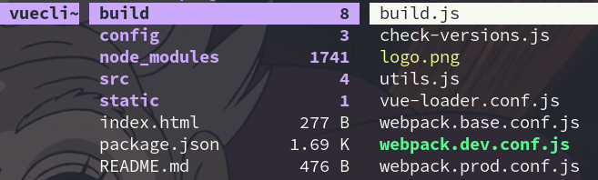

----------------------------------------------
> *Made By Herolh*
----------------------------------------------

#  Vue CLI 的基本使用{#index}

[TOC]


--------------------------------------------

## 文档版本

|    时间    | 修改人 | 说明     |
| :--------: | :----: | -------- |
| 2021-05-05 | Herolh | 创建文档 |
|            |        |          |


## 简介

> vue-cli 官方提供的一个脚手架，用于快速生成一个 vue 的项目模板

&emsp;&emsp;预先定义好的目录结构及基础代码，就好比咱们在创建 Maven 项目时可以选择创建一个骨架项目，这个估计项目就是脚手架，我们的开发更加的快速；使用 vue-cli 可以块书搭建 Vue 开发环境以及对应的 webpack 配置。

**主要的功能**

- 统一的目录结构
- 本地调试
- 热部署
- 单元测试
- 集成打包上线

[官网](https://cli.vuejs.org/zh/guide/)


### 安装

```shell
cnpm install @vue/cli -g

#测试是否安装成功
vue --version

#查看可以基于哪些模板创建 vue 应用程序，通常我们选择 webpack
vue list
```


### 升级

如需升级全局的 Vue CLI 包，请运行：

```bash
npm update -g @vue/cli

# 或者
yarn global upgrade --latest @vue/cli
```


#### 项目依赖

上面列出来的命令是用于升级全局的 Vue CLI。如需升级项目中的 Vue CLI 相关模块（以 `@vue/cli-plugin-` 或 `vue-cli-plugin-` 开头），请在项目目录下运行 `vue upgrade`：

```text
用法： upgrade [options] [plugin-name]

（试用）升级 Vue CLI 服务及插件

选项：
  -t, --to <version>    升级 <plugin-name> 到指定的版本
  -f, --from <version>  跳过本地版本检测，默认插件是从此处指定的版本升级上来
  -r, --registry <url>  使用指定的 registry 地址安装依赖
  --all                 升级所有的插件
  --next                检查插件新版本时，包括 alpha/beta/rc 版本在内
  -h, --help            输出帮助内容
```


##  2.x 的模板( 旧模板 )

Vue CLI 3 和旧版使用了同样的 `vue` 命令，所以 Vue CLI 2(`vue-cli`) 被覆盖了， 如果你仍要使用旧版本的 `vue init` 功能，可以全局安装一个桥接工具：

```shell
npm install -g @vue/cli-init

# 初始化项目
vue init webpack my-project
```


一路都选择no即可； **说明：**

- **Project name**

    > 项目名称，默认回车即可

- **Project description**

    > 项目描述，默认回车即可

- **Author**

    > 项目作者，默认回车即可（默认是从 git 中读取的信息）

- **Vue Build**

    - Runtime + Compiler
    - Runtime-only

- **Install vue-router**

    > 是否安装vue-router，选择n不安装（后期需要再手动添加）

- **Use ESLint to lint your code**

    > 是否使用ESLint做代码检查，选择n不安装（后期需要再手动添加)

- **Set up unit tests**

    > 单元测试相关，选择n不安装（后期需要再手动添加）

- **Setup e2e tests with Nightwatch**

    > 单元测试相关，端到端测试，选择n不安装（后期需要再手动添加）

- **Should we run npm install for you after the,project has been created**

    >  创建完成后直接初始化，选择n，我们手动执行；运行结果！


```shell
cd my-project
npm install (or if using yarn: yarn)
npm run dev
```




##  3.X 的模板

- vue-cli 3 是基于 webpack 4 打造的，vue-cli 2 还是 webpack 3

- vue-cli 3 的设计原则是 “0 配置”， 移除配置文件根目录下的 `build` 和 `config` 等目录
- vue-cli 3 提供了 `vue ui` 命令，提供了可视化配置
- 移除了 static 文件夹，新增 public 文件夹， 并且 index.html 移动到 public 中

```shell
vue create my-project
```

- **Please pick a preset**

    > 选择配置，Manually select features( 手动选择特性 ) 

- **Where do you prefer placing config for Babel, ESLint, etc.?**

    > 配置文件放在哪里？In dedicated config files(单独的配置文件)

- **Save this as a preset for future projects?**

    > 是否将刚才的配置保存为一个默认的配置


