----------------------------------------------
> *Made By {Author}*
----------------------------------------------

# 基础使用 {#index}

[TOC]


--------------------------------------------

## 介绍

> [Godot 官方网站](https://godotengine.org/)
> [Godot 官方中文文档](https://docs.godotengine.org/zh_CN/latest/index.html)
> [Godot 下载地址](https://godotengine.org/download)

&emsp;&emsp;Godot 引擎是一款功能丰富的跨平台游戏引擎，可通过统一界面创建 2D 和 3D 游戏。 它提供了一套全面的通用工具。 游戏可以一键导出到多个平台，包括主要的桌面平台 (Linux、macOS、Windows) 以及移动平台 (Android、iOS) 和基于 Web 的 (HTML5) 平台。

Godot 开源并永久免费。通俗点说就是：

- 没有个税，也没有所谓的年度、季度收入上限要求
- 不强求使用它们的启动画面、他们的附加服务或者使用它们的云服务托管你的项目


## hello world
&emsp;&emsp;安装好Godot，点击启动，启动速度和另一款很棒的三维软件 Blender 很接近，都很快，首页是项目管理界面，点击上图右上角地球图标边的语言栏，选择 “zh_CN”，便可切换成中文界面：

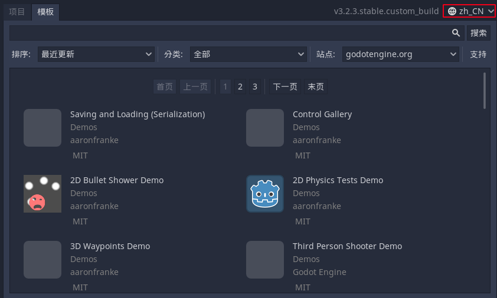

&emsp;&emsp;一切游戏项目都从这里开始，在顶端选择【模板】选项卡，则会通过网络载入官方的 Sample 示例游戏项目，可供下载下来学习。
&emsp;&emsp;在【项目列表】选项卡下，为已有的游戏项目。可以选择右侧【扫描】来对特定目录下的已有项目进行挖掘，或者选择【导入】来添加已有的项目，如果选择【新建】，则出现如下界面：

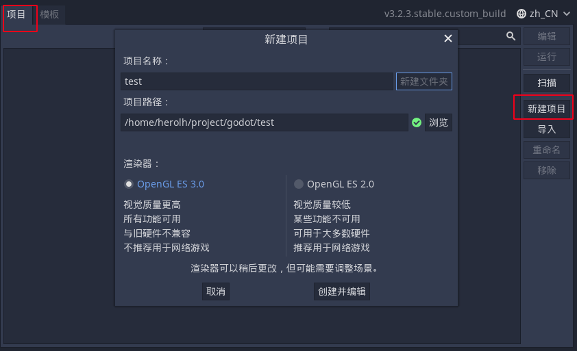&emsp;&emsp;在上图【项目名称】中给你的游戏取个名，【项目路径】必须选择一个空白文件夹，而【渲染器】一栏，由于目前电脑、手机等性能过剩，基本保持 OpenGL ES 3.0 就可以了，这样能获得更好的图形质量和效果，而如果未来需要制作网页端游戏，那选择 OpenGL ES 2.0 是个稳妥的选项，不过经过我的测试，现代浏览器（Firefox、Chrome 等）使用 3.0 渲染器语言也完全没有问题。
最后，点击【创建并编辑】便可进入 Godot 的编辑器界面。

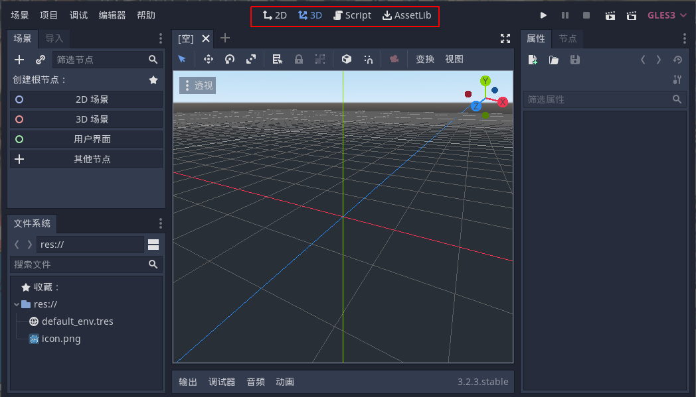

&emsp;&emsp;进入编辑器后，便如上图所示，默认界面中间是【3D】视图工作区，点击顶端中部菜单可在 2D 视图、3D 视图、Script（脚本）、AssertLib（资产库）界面切换，还可以分别按下 F1、F2、F3、F4 来切换以上四个工作区。
&emsp;&emsp;2D/3D 工作区主要进行图形方面的相关设计和材质预览等工作，脚本工作区主要负责游戏的背后运行逻辑，资产库除可以访问模板外，还可以下载扩展功能及插件。

- 左上角为场景树，里面为当前场景包含的节点嵌套关系，相当于场景的大纲

- 左下角为文件系统，是当前游戏项目文件夹内所有图形、音效、字体、场景等等的资源，由于 Godot 强大的跨平台能力，Godot 采用相对引用方式，必须保证游戏使用的全部资源均位于当前项目文件内，才能保证可正常使用。

- 右上角有两个选项卡，分别为当前选中场景中的节点的属性信息（如位置、大小等等）及节点的方法（如被点击、被碰撞等等）。

- 下方为日志输出、调试器（用于报错、调试等）、类似 Adobe Audition 的简易的音轨混响编辑器、类似 Flash 的动画编辑器（真不敢想象 Godot 塞进这么多功能还能保持一首无损歌曲的体积）。


### godot 的处事哲学 —— 一切皆为场景和节点
&emsp;&emsp;运行一个游戏意味着运行一个场景，一个项目可以有多个场景，一个场景是由一组节点构成，而节点是创建游戏的基本单元，一个节点可以执行各种特定的功能，如显示图像、生成按钮、播放声音、进行物理碰撞模拟、显示 3D 模型等等。

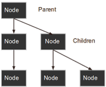

&emsp;&emsp;节点能够让其他节点作为自己的子节点，类似于面向对象编程里的【继承】方法，可以极大的简化工作量，用多个简单功能来实现复杂功能。以这种方式编排时，这些节点就会变成一棵树，而一个场景便包含这棵树。


## Flappy Bird 小游戏

[用 Godot 做 Flappy Bird（一）—— 制作小鸟](https://zhuanlan.zhihu.com/p/109294019)

[Play Flappy Bird](https://link.zhihu.com/?target=http%3A//flappybird.io)


### 分析游戏

&emsp;&emsp;我们首先来分析一下 FlappyBird 这款游戏，按照 Godot 介绍的场景、节点的思路自顶而下分解任务：

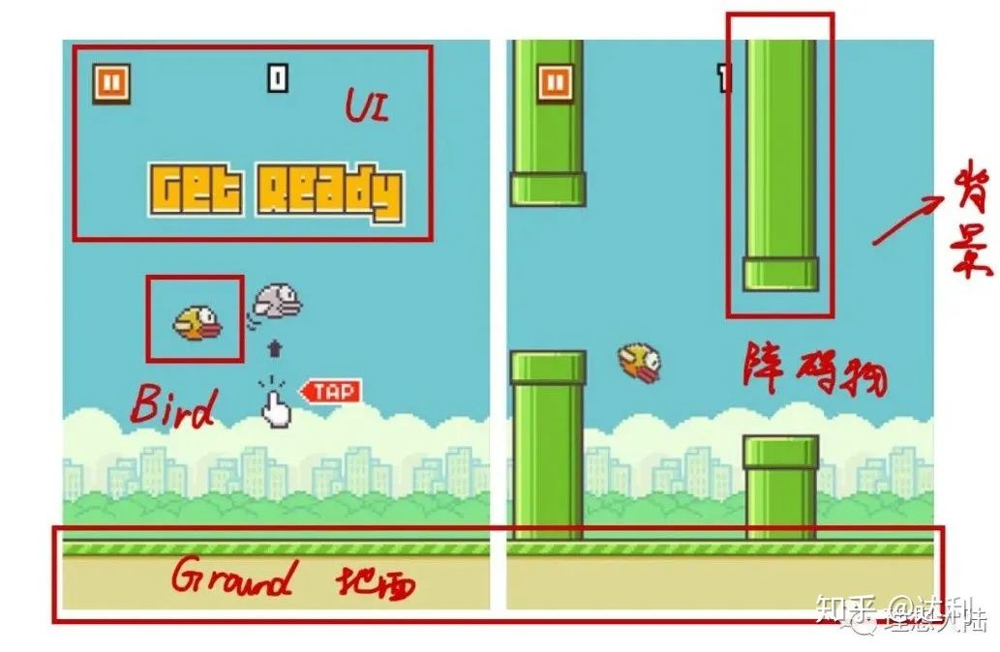

&emsp;&emsp;从上图看，FlappyBird 可以分解为以上 5 个部分：Bird（鸟）、Ground（地面）、Obstacle（障碍物）、UI（比分、按钮等界面）、Background（背景）。五个部分便可作为 Godot 的五个场景来逐一实现，最后再组合在一起。

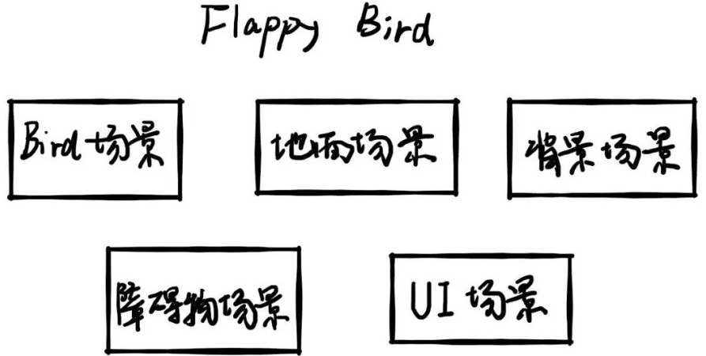

&emsp;&emsp;本文将对第一个 Bird 场景进行实现，后续将基本按照上图的场景顺序来各个击破。首先我们需要下载 FlappyBird 游戏的各种素材文件（如小鸟、地面、背景等图片纹理），为节约时间我已提前找好游戏素材并上传至百度云，在【理想大陆】公众号中回复关键字：**FlappyBird** 获取素材链接或参考置顶评论获取。


### 开始造物，为小鸟赋予肉身
#### 设置窗口尺寸
&emsp;&emsp;新建一个名为 FlappyBird 的游戏项目。进入主界面后点击顶部菜单栏【项目】->【项目设置】，选择左侧【Display】->【Window】项，在右侧修改游戏窗口的 Size 尺寸如下图，同时为了更好适应当下的高分屏趋势，勾选启用【Allow Hdpi】功能：

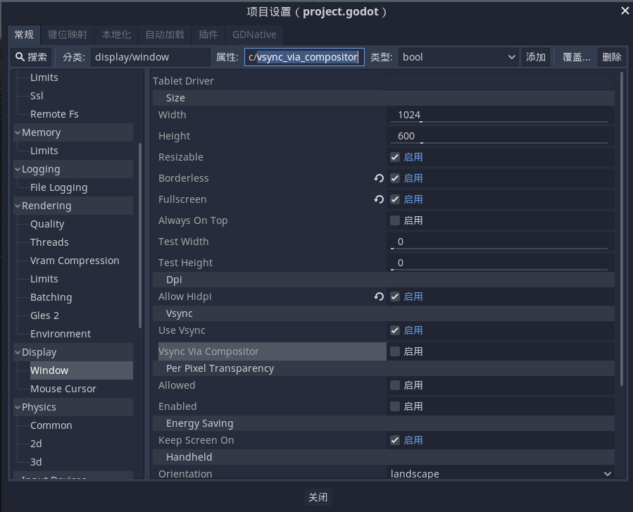


#### 导入资源

&emsp;&emsp;接下来在项目文件夹内新建一个 “assert” 文件夹，再将下载的素材压缩包内的 flappybird 文件夹里所有的文件拷贝到该文件夹下来导入游戏资源，导入成功后左下角【文件系统】面板如图所示，可看到各种图片素材：

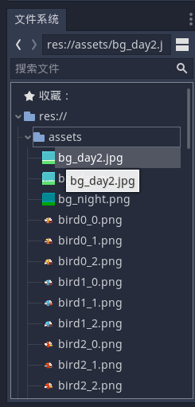


#### 构建场景

点击顶部【场景】->【新建场景】，再在左上方场景面板选择第四项【自定义节点】：

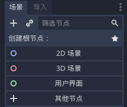

接下来着手构建 Bird 场景，可以想到，游戏里的这个小鸟应该要有以下的属性：

- 外观（飞行的动画）
- 物理特性（只受重力的自由落体运动、向上飞行的抛物线运动、碰撞障碍物等检测）

&emsp;&emsp;针对以上的属性需求，便可以在 Godot 武器库里寻找相应的武器来解决。首先，Bird 小鸟是一个二维的、有重力、可运动的实体，那么与之对应的便是以上的 Rigidbody2D（二维刚体节点），Rigidbody2D 节点具有质量、速度、受重力影响等物理属性，符合我们的要求，这里选择它作为 Bird 场景的根节点。（Rigidbody 节点的其他信息可访问文末的官方文档链接了解）

在弹出的节点界面中，搜索 Rigidbody2D 节点，可以看出白色的【Node】为一切节点的根节点，下有负责 3D 的【Spatial】子节点、负责 2D 的【CanvasItem】子节点，而 Rigidbody2D 节点就隶属于 CanvasItem->Node2D->CollisionObject2D->PhysicsBody2D 下的子节点，选择那个蓝色小球图标项，点击创建：

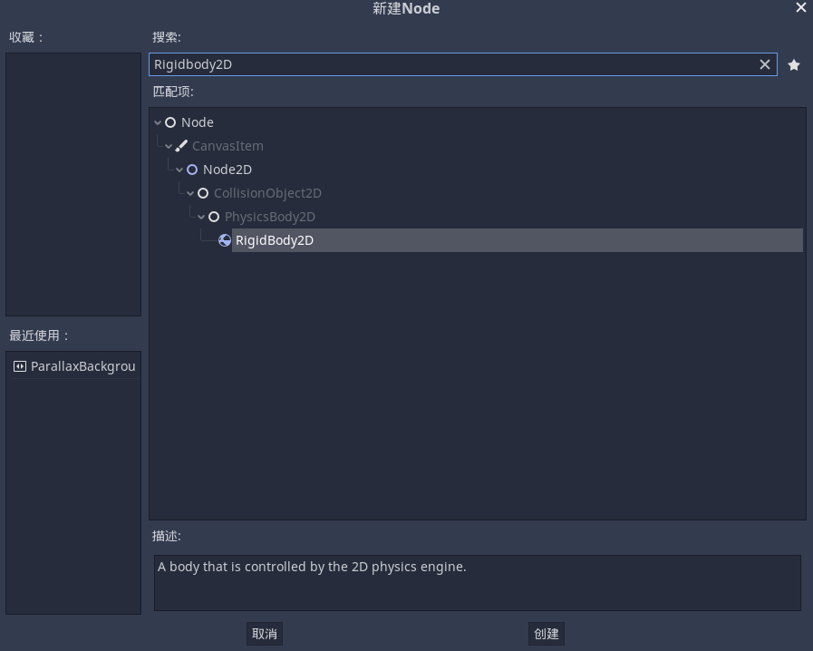

&emsp;&emsp;创建完后，会发现场景面板已添加 Rigidbody2D 节点，右侧有黄色叹号警告，因为刚体必须要有碰撞子节点来描述其形状，才能完成它的碰撞、交互等属性，先按下不表，稍后再说。这里双击节点名称重命名为 “Bird”：

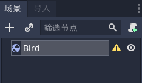

&emsp;&emsp;点选 “Bird” 节点，右侧属性面板便可看到作为刚体的节点属性，有位置、速度、质量等等。

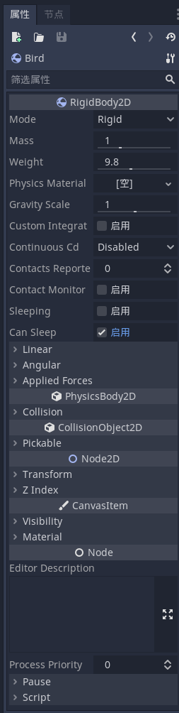

&emsp;&emsp;接下来我们来为其添加两个子节点，点击场景面板左上角的 “＋” 或者快捷键 “Ctrl+A”，搜索添加【AnimatedSprite】动画节点、【CollisionShape2D】碰撞节点。（注意添加节点时要保证这俩是 Bird 的儿子节点，而不是 “爷爹孙” 关系，参照下图所示）

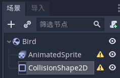

选中【AnimatedSprite】节点，在右侧属性面板中点击 Frames->“新建 SpriteFrames”：

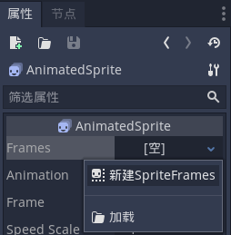

再点击已新建的 Frames，窗口底部将弹出【动画帧】工作区，重命名左侧初始动画序列为 “fly”，多选文件系统内 assert 文件夹下分别代表飞行动画的三个帧图片：“bird0_0.png"、“bird0_1.png"、“bird0_2.png"，拖至右侧动画帧窗口：

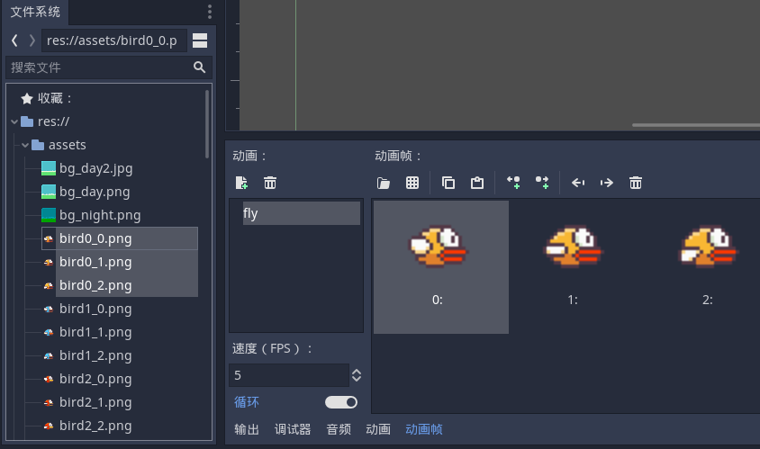

然后在右侧节点属性窗口下 Resource 属性，勾选【Playing】，中间预览界面便可以看到一只飞行的小鸟，至此小鸟的外观便解决了。

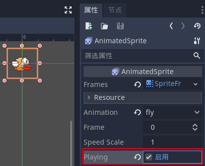


接下来设置刚体碰撞的节点，点选左侧【CollisionShape2D】节点，这个小鸟的轮廓可以近似为一个椭圆形，所以在右侧属性面板 “Shape” 一项中选择【新建 CapsuleShape2D】来为小鸟创建所需的碰撞边界，这样 Godot 才能知道这个物体的形状：

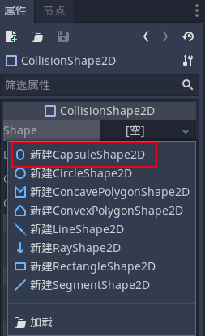

之后在中间预览窗口便会发现小鸟上盖了一层胶囊状的半透明蓝色区域，这个便是碰撞边界，我们需要调整边界，使它刚好覆盖小鸟的外形。首先在右侧调整【Transform】属性下的【Rotation Degrees】，将 “0” 改为 “90”，使胶囊横过来，再拖动胶囊外侧的两个粉红色调整圆点，使蓝色恰好覆盖住小鸟外轮廓：

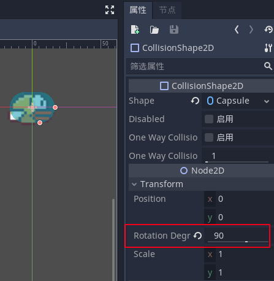

到目前为止，Bird 的肉体已完成，不过现在的小鸟是没有灵魂的（没有飞行能力，你可以点击右上角第四个图标或者快捷键 F6 来【运行当前场景】，同意保存，然后将弹出游戏窗口预览当前场景，你会发现一个只能自由落体的小鸟。。。


### 继续造物，为小鸟赋予

要使小鸟有灵魂（只要我们点击空格键，它就会向上飞），要实现这个功能，便需要编写逻辑脚本了，不要被编程吓跑，Godot 使用的是名叫 “GDScript” 的脚本语言，简单如 Python 和 JavaScript。点击 Bird 节点右边的绿色加号脚本图标，弹出窗口保持默认，点 “创建”：

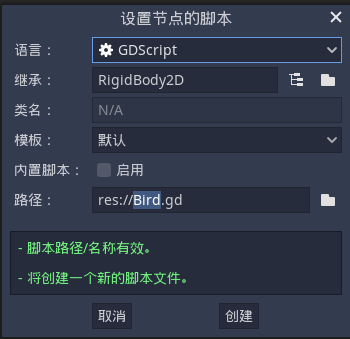

此时便会自动切换到 “Script” 窗口，可以看出 Godot 已自动帮我们写好了框架，我们接下来便在其中对小鸟进行编程：

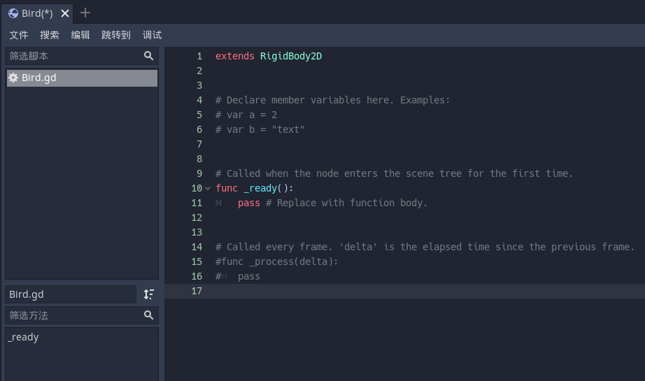

在 Script 窗口中添加以下代码：

```shell
# 代表 Bird 节点是由 Rigidbody2D 类扩展得到的；
extends RigidBody2D

# 定义了变量，其中使用关键字 export 代表允许在属性面板中设置其值，对于希望能够像节点的内置属性一样进行调整的值，这可能很方便。
var screen_size
export var speed = 20

# 内部函数，当节点进入场景树时，该函数被调用，这里通过
func _ready():
	# et_viewport_rect() 方法得到游戏窗口尺寸
	screen_size = get_viewport_rect().size
	# 改变 position 属性使 Bird 出现在窗口中心；
	self.position=Vector2(screen_size.x/2,screen_size.y/2)
	
	# 类似于 JavaScript 中 JQuery，通过快捷访问符 $ 来得到 Bird 节点下的 AnimatedSprite 节点，时其 play 播放飞行动画；
	$AnimatedSprite.play()

# 内部函数，该函数在游戏的每一帧都被调用，因此我们将使用它，来更新我们希望会经常变化的游戏元素。
func _process(delta):
	# 首先通过设置 gravity_scale 确保重力环境正确以使小鸟在未受力情况下保持自由落体运动；
	self.gravity_scale = 9.8

	# 接下来使用 if 条件语句来判断玩家是否点击空格键（Godot 中称作 “ui_select” 键）
	if Input.is_action_just_pressed("ui_select"):
		self.apply_impulse(Vector2(0,0),Vector2(0,-500))
		# 若点击则激活方法 apply_impulse 为小鸟施加一个竖直向上的冲量，函数内参数为冲量矢量的起点和终点

# 游戏的世界中，x 轴正向向右，y 轴正向向下，所以这里为 - 500
# 在游戏里，相机镜头（窗口）一直是跟拍小鸟，所以小鸟的水平移动为零，我们通过后期移动背景来模拟向前飞行的感觉。

```

