----------------------------------------------
> *Made By {Author}*
----------------------------------------------

# 目录 {#index}

[TOC]


--------------------------------------------

## 准备

游戏引擎： https://godotengine.org 

图片素材： https://www.kenney.nl/assets/simplified-platformer-pack


## 初始场景创建

> 参考视频教程：[bilibili - 花 10 分钟开发平台跳跃游戏【Godot 教程】](https://www.bilibili.com/video/BV1Xi4y1M7Eq?t=132)

### 创建平台地图

- 首先创建一个2D场景，双击重命名为 “World”；添加一个子节点 “TileMap”；在右侧的属性面板中找到 “Tile Set”,右键新建 Tile Set，然后选中；

    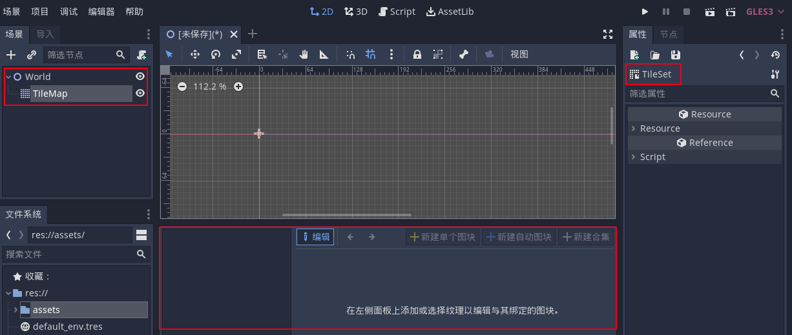

- 将文件系统中图片拖入右下方左侧的图块集中，点击 “新建单个图块”，点击网格，并框出图块内容。点击碰撞，选择新建矩形，为每个图块添加碰撞区域：

    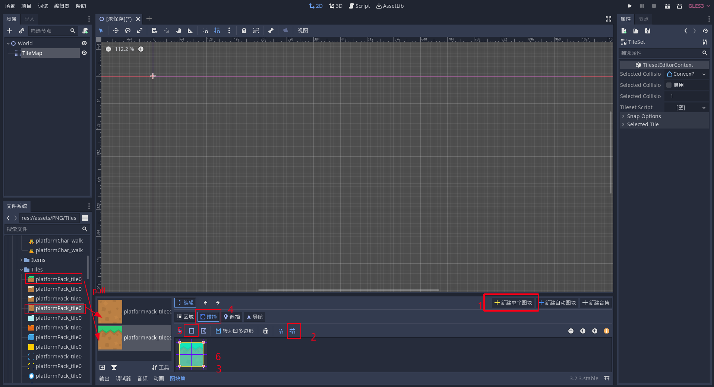

- 然后点击 TileMap 返回主界面，就可以绘制地图了，左键绘制，右键删除，按住shift 可以绘制一条直线。Ctrl+S 保存为 `World.tscn` 。

    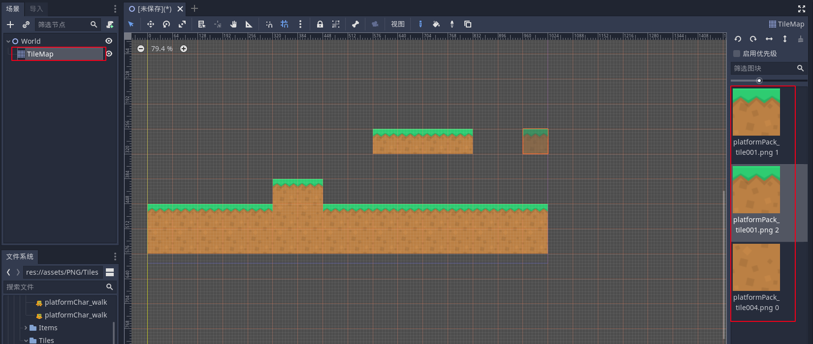


### 创建玩家精灵

- 并点击左上角新建一个场景，点击其他节点，搜索 KinematicBody2D, 点击创建，算计节点重命名为 ”Player“，Ctrl+S 保存为 `Player.tscn` 。

    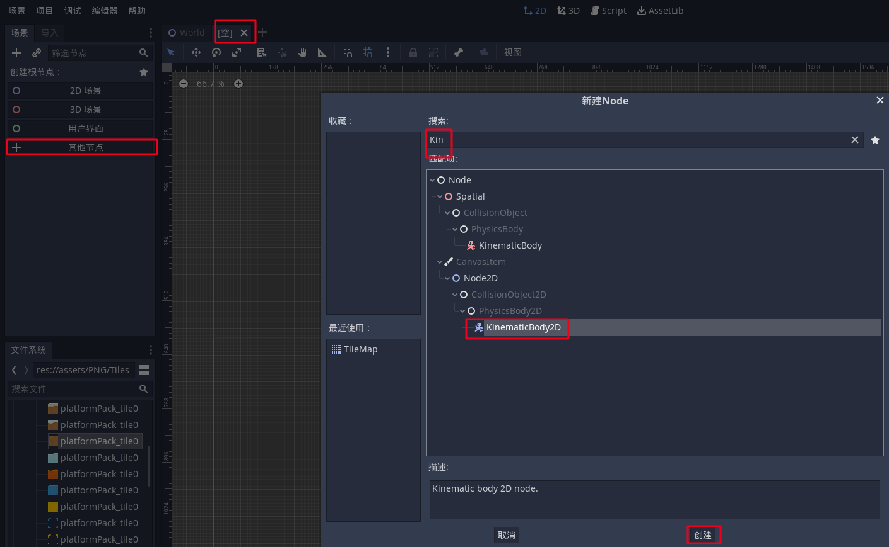


#### 创建图节点

- 右键添加一个子节点 Sprite 添加图像，在右侧属性面板右键 Tetxture 点击加载添加玩家精灵图

    

- 这张图片一共有八帧的图像，第一行是站立跳跃，以及两帧的行走动画，在右侧属性面板的 Anination 中 修改 `Vframes=2, Hframe=4 `，这样我们就能通过下面的 frame 控制显示哪一帧。为了好看一点，我们让它站在X轴上。

    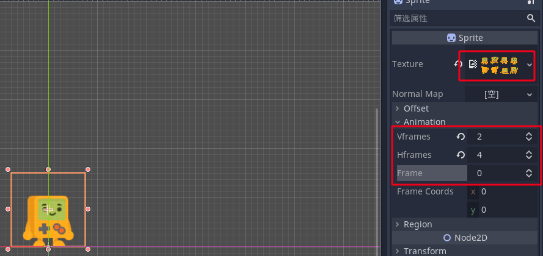


#### 创建碰撞节点

- 右键根节点 ”Player“ 新建一个子节点 ”CollisionShape2D“，在右侧的属性面板右键 Shape 新建一个 RectangleShape2D( 矩形碰撞区域 )，覆盖整个身体就可以了。

    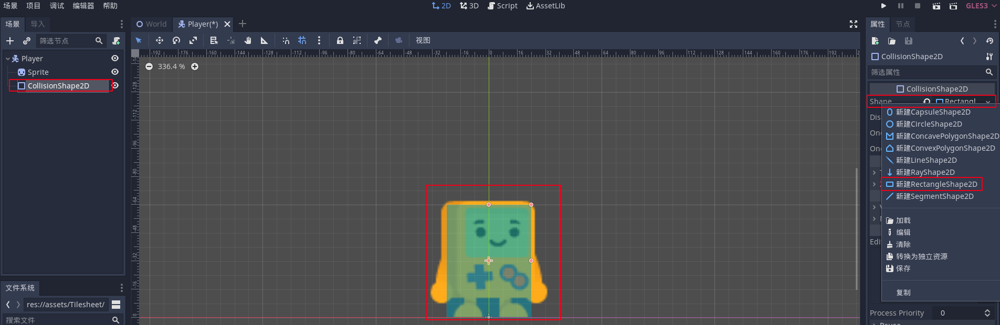


#### 创建动画节点

- 右键根节点 ”Player“ 新建一个子节点 ”AnimationPlayer“，单击动画选择新建：

    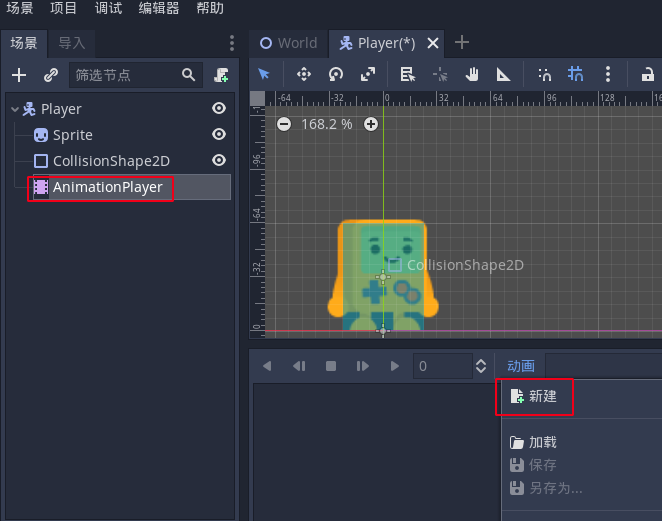

- 新建一个 ”idle“ (站立) 动画，单击 Sprite ，在右侧属性面板 Frame 选择固定关键帧 0

    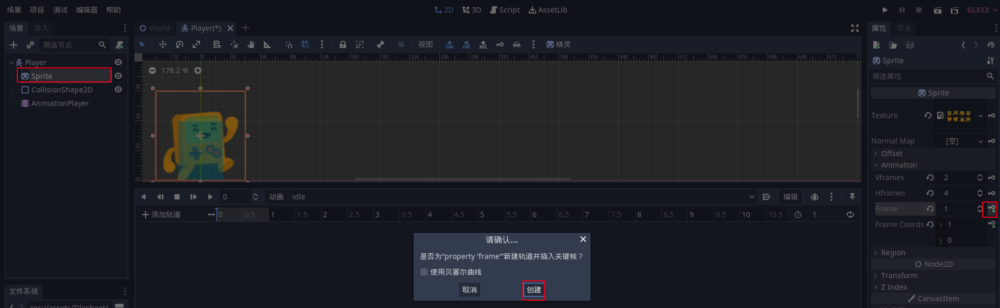

- 新建一个 ”jump“(跳跃) 动画， 单击 Sprite ，在右侧属性面板 Frame 选择固定关键帧 1

- 新建一个 ”walk“(行走) 动画， 单击 Sprite ，在右侧属性面板 Frame 选择固定关键帧 2,调整时间为 0.2，再设置关键帧 3，总时长调为 0.4 打开循环。

    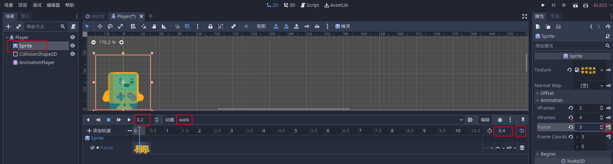


### 创建角色控制脚本

- 单击 Player 节点再点击右上方的创建脚本即可创建脚本：

    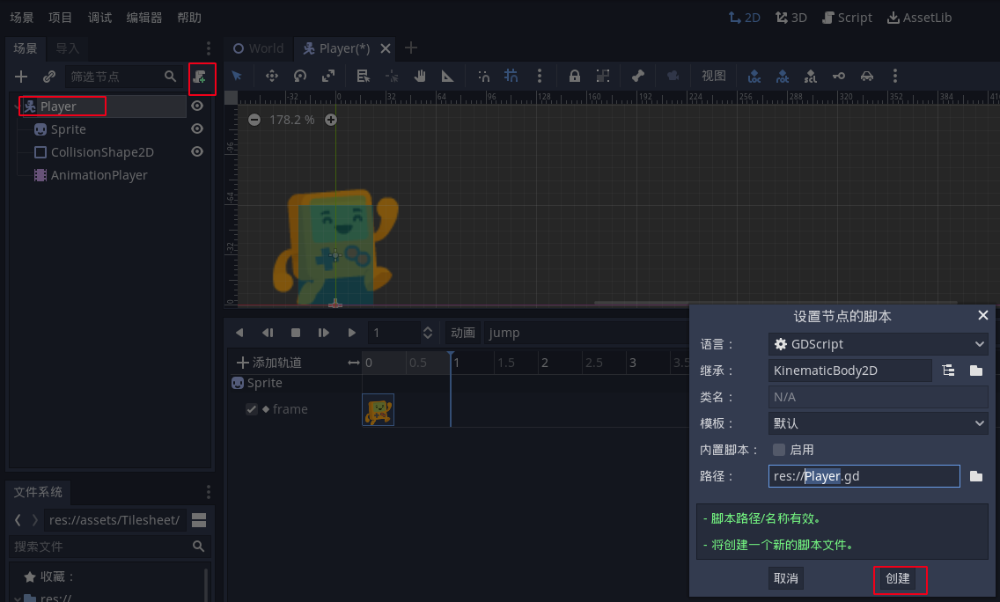

- 编写脚本

    ```Shell
    extends KinematicBody2D
    
    # 重力常量
    const gravity = 2000
    
    # Declare member variables here. Examples:
    # 设置初始速度为 0 
    var velocity = Vector2.ZERO
    
    
    
    # Called when the node enters the scene tree for the first time.
    func _ready():
    	pass # Replace with function body.
    
    
    # Called every frame. 'delta' is the elapsed time since the previous frame.
    func _process(delta):
    	velocity.y += gravity * delta
    
    # 物理处理函数
    func _physics_process(delta):
    	# 移动和滑动
    	velocity = move_and_slide(velocity)
    	
    
    ```

- 关联场景和玩家角色

    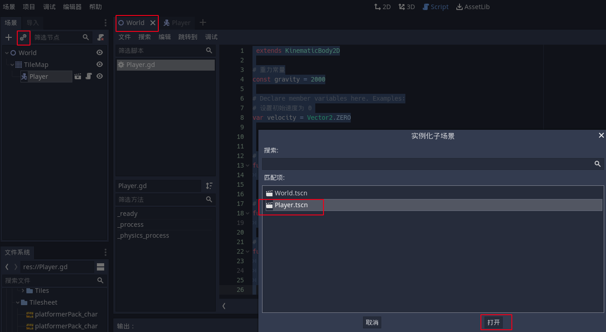

- 按 F6 可运行测试有戏，我们可以看到玩家落下被地板接住

    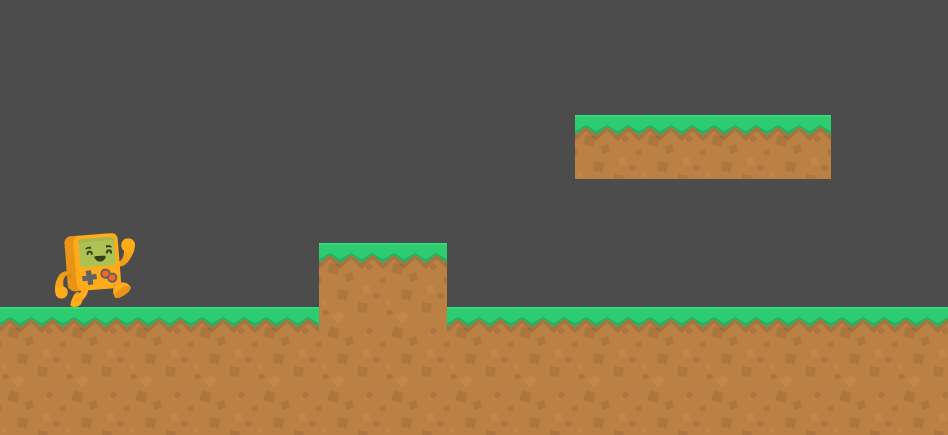


### 按键绑定

- 点击左上角项目 => 项目设置 => 键位映射，在动作输入栏输入按键名并回车，在下方找到按键名，点击右边的加号会该按键添加键位。

    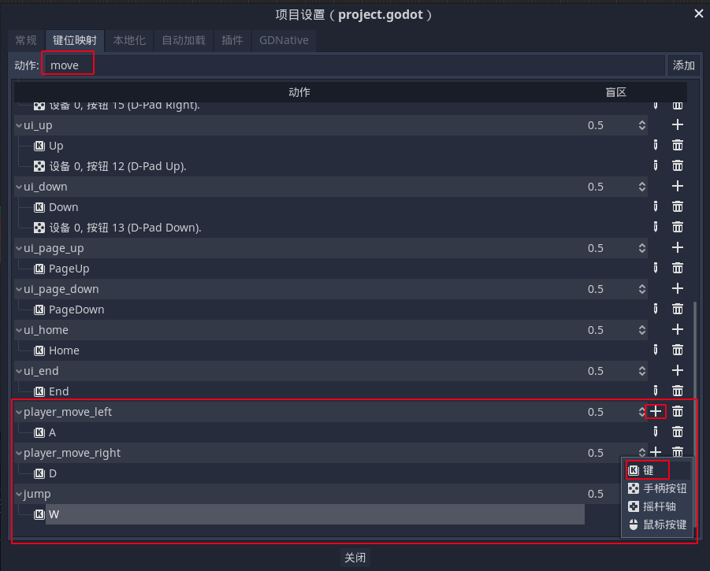

- 修改脚本：

    ```shell
     extends KinematicBody2D
    
    # 重力常量
    const gravity = 2000
    const player_speed = 350
    const player_jump_force = 800
    
    # Declare member variables here. Examples:
    # 设置初始速度为 0 
    var velocity = Vector2.ZERO
    var is_player_jumping = false
    
    
    
    # Called when the node enters the scene tree for the first time.
    func _ready():
    	pass # Replace with function body.
    
    
    # Called every frame. 'delta' is the elapsed time since the previous frame.
    func _process(delta):
    	# get_action_strength: 返回一个 0～1 之间的值，对于键盘来说，没有按下返回0, 按下就是返回1
    	# 所以按下右的时候 direction = 1, 按下左的时候 direction = -1, 两个不按或两个都按则为0
    	var direction = Input.get_action_strength("player_move_right") - Input.get_action_strength("player_move_left")
    	velocity.x = direction * player_speed										# direction 提供方向符号
    	velocity.y += gravity * delta
    
    # 物理处理函数
    func _physics_process(delta):
    	# 移动和滑动
    	# Vector2.UP 告诉物理引擎哪里是上，因为在有些俯视角的游戏，它们的上是朝屏幕外面的
    	velocity = move_and_slide(velocity, Vector2.UP)
    	# 玩家是否站在地板上
    	if is_on_floor():
    		is_player_jumping = false
    
    # 发生输入事件时触发
    func _input(event):
    	# 是否按下了跳跃键
    	if event.is_action_pressed("jump") and not is_player_jumping:
    		velocity.y = -player_jump_force											# y 轴向下为正
    		is_player_jumping = true
    
    ```

    

### 动画绑定

```shell
 extends KinematicBody2D

# 重力常量
const gravity = 2000
const player_speed = 350
const player_jump_force = 800

# onready： 场景树就绪后才能拿到节点信息
onready var animation_player = $AnimationPlayer									# 获取玩家动画
onready var sprite_player = $Sprite												# 获取玩家图层


# Declare member variables here. Examples:
# 设置初始速度为 0 
var velocity = Vector2.ZERO
var is_player_jumping = false


# Called when the node enters the scene tree for the first time.
func _ready():
	pass # Replace with function body.


# Called every frame. 'delta' is the elapsed time since the previous frame.
func _process(delta):
	# get_action_strength: 返回一个 0～1 之间的值，对于键盘来说，没有按下返回0, 按下就是返回1
	# 所以按下右的时候 direction = 1, 按下左的时候 direction = -1, 两个不按或两个都按则为0
	var direction = Input.get_action_strength("player_move_right") - Input.get_action_strength("player_move_left")
	velocity.x = direction * player_speed										# direction 提供方向符号
	velocity.y += gravity * delta
	
	# 如果在跳跃就播放跳跃动画
	if is_player_jumping:
		animation_player.play("jump")
	elif direction == 0:
		animation_player.play("idle")
	else:
		animation_player.play("walk")
		# 图层反转
		sprite_player.flip_h = direction < 0

# 物理处理函数
func _physics_process(delta):
	# 移动和滑动
	# Vector2.UP 告诉物理引擎哪里是上，因为在有些俯视角的游戏，它们的上是朝屏幕外面的
	velocity = move_and_slide(velocity, Vector2.UP)
	# 玩家是否站在地板上
	if is_on_floor():
		is_player_jumping = false

# 发生输入事件时触发
func _input(event):
	# 是否按下了跳跃键
	if event.is_action_pressed("jump") and not is_player_jumping:
		velocity.y = -player_jump_force											# y 轴向下为正
		is_player_jumping = true

```

