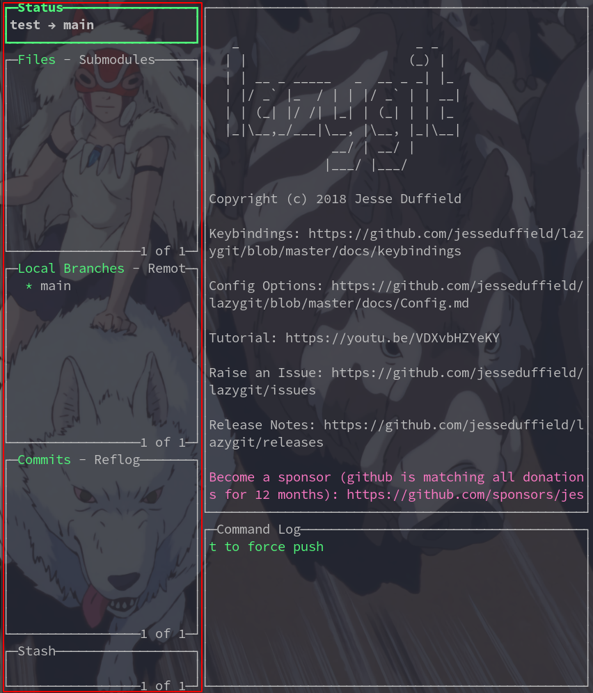
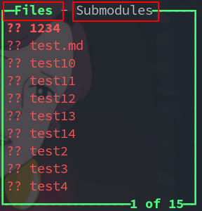
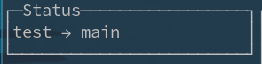
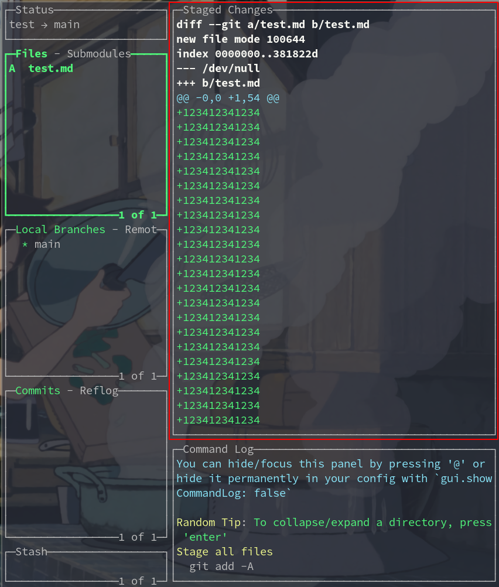

----------------------------------------------
> *Made By {Author}*
----------------------------------------------

# lazygit 基础使用指南 {#index}

[TOC]

--------------------------------------------

## 简介

> [安装和使用lazygit：一个简单的git命令终端UI工具](https://ywnz.com/linuxrj/4239.html)
> [官网 ReadMe](https://github.com/jesseduffield/lazygit/blob/master/README.md)
> [官网 按键映射](https://github.com/jesseduffield/lazygit/blob/v0.24.2/docs/keybindings/Keybindings_en.md)

## 快捷键

### 全局

|       按键        |           代表           | 说明 |
| :---------------: | :----------------------: | ---- |
| PgUp/ `Ctrl + u`  |    主面板内容向上滚动    |      |
| pGdN / `Ctrl + d` |    主面板内容向下滚动    |      |
|         e         |         编辑文件         |      |
|         i         | 将该文件添加到 .gitigore |      |
|         5         |          Stash           |      |

### 移动

#### 面板切换

|        按键         | 说明               |
| :-----------------: | ------------------ |
| &larr;&rarr; 或 h l | 按顺序切换面板     |
|         1~5         | 跳到对应的面板     |
|  PgUp/ `Ctrl + u`   | 主面板内容向上滚动 |
|  pGdN / `Ctrl + d`  | 主面板内容向下滚动 |

#### 列表面板

| 按键 |         代表          | 说明 |
| :--: | :-------------------: | ---- |
|  1   |        Status         |      |
|  2   |   Files/Submodules    |      |
|  3   | Local Branches/Remote |      |
|  4   |     commit/Reflog     |      |
|  5   |         Stash         |      |

#### 列表面板标签

| 按键 |    代表    | 说明                                                         |
| :--: | :--------: | ------------------------------------------------------------ |
| `[`  | 上一个标签 | Files -> submodules                                          |
| `]`  | 下一个标签 | submodules -> Files                                          |
| `,`  |   上一页   | 列表框放不下会分页,  File 会翻到上一页文件                   |
| `.`  |   下一页   | 列表框放不下会分页,  File 会翻到下一页文件                   |
| `<`  | 滚动到顶部 | 第一页第一行                                                 |
| `>`  | 滚动到底部 | 最后一页最后一个                                             |
| `/`  |  开始搜索  | `n` 为下一个搜索结果 `N` 为上一个搜索结果 `esc` 退出搜索 |

### 面板

#### 状态面板

> lazygit 的状态面板

|  按键   |              代表               | 说明 |
| :-----: | :-----------------------------: | ---- |
|   `e`   |      编辑 lazygit 配置文件      |      |
|   `o`   |      打开 lazygit 配置文件      |      |
|   `u`   |        检查 lazygit 更新        |      |
| `enter` | 切换到 lazygit 最近打开过的仓库 |      |

#### 主面板

|       按键        |           代表           | 说明 |
| :---------------: | :----------------------: | ---- |
| PgUp/ `Ctrl + u`  |    主面板内容向上滚动    |      |
| pGdN / `Ctrl + d` |    主面板内容向下滚动    |      |
|         e         |         编辑文件         |      |
|         i         | 将该文件添加到 .gitigore |      |
|         s         |          Stash           |      |

