----------------------------------------------
> *Made By Herolh*
----------------------------------------------

# 基本使用 {#index}

[TOC]


# 常见版本管理工具介绍
- **VSS-- Visual Source Safe**

  > &emsp;&emsp;此工具是 Microsoft 提供的，可以与 VS.net 进行无缝集成，成为了独立开发人员和小型开发团队所适合的工具，基本上使用者都是 Window 平台上开发的中小型企业，当规模较大后，其性能通常是无法忍受的，对分支与并行开发支持的比较有限。

- **CVS--Concurrent Versions System** 
  > &emsp;&emsp;个开源工具，与后面提到的 SVN 是同一个厂家：Collab.Net 提供的。CVS 是源于 unix 的版本控制工具，对于 CVS 的安装和使用最好对 unix 的系统有所了解能更容易学习，CVS 的服务器管理需要进行各种命令行操作。
  > &emsp;&emsp;目前，CVS 的客户端有 winCVS 的图形化界面，服务器端也有 CVSNT 的版本，易用性正在提高。此工具是相当著名，使用得相当广泛的版本控制工具之一，使用成熟的 **Copy-Modify-Merge** 开发模型，可以大大的提高开发效率，适合于项目比较大，产品发布频繁，分支活动频繁的中大型项目。

- **SVN --CollabNet Subversion**  
  > &emsp;&emsp;此工具是在CVS 的基础上，由 CollabNet 提供开发的，也是开源工具,应用比较广泛。
  >
  > 修正了 cvs 的一些局限性，适用范围同 cvs，目前有一些基于SVN 的第三方工具，如TortoiseSVN,是其客户端程序，使用的也相当广泛。在权限管理，分支合并等方面做的很出色，他可以与Apache集成在一起进行用户认证。
  > 不过在权限管理方面目前还没有个很好用的界面化工具，SVNManger对于已经使用SVN进行配置的项目来说，基本上是无法应用的，但对于从头开始的项目是可以的，功能比较强大，但是搭建svnManger比较麻烦。一个开源的版本控制系统，Subversion 管理着随时间改变的数据。 这些数据放置在一个中央资料档案库中。 这个档案库很像一个普通的文件服务器, 不过它会记住每一次文件的变动。 这样你就可以把档案恢复到旧的版本, 或是浏览文件的变动历史。Subversion 是一个通用的系统, 可用来管理任何类型的文件, 其中包括了程序源码。

- **GIT** 

  > 因为最初是从 Linux 起家的，非常依赖文件系统的一些特性，这些在 Linux 下表现的很好，而 Windows 下特别糟糕

  - Git是一个开源的分布式版本控制系统，用以有效、高速的处理从很小到非常大的项目版本管理.
  - Git 是 Linus Torvalds 为了帮助管理 Linux 内核开发而开发的一个开放源码的版本控制软件。
      Torvalds 开始着手开发 Git 是为了作为一种过渡方案来替代 BitKeeper，后者之前一直是 Linux 内核开发人员在全球使用的主要源代码工具。开放源码社区中的有些人觉得 BitKeeper 的许可证并不适合开放源码社区的工作，因此 Torvalds 决定着手研究许可证更为灵活的版本控制系统。尽管最初 Git 的开发是为了辅助 Linux 内核开发的过程，但是我们已经发现在很多其他自由软件项目中也使用了 Git。例如 最近就迁移到 Git 上来了，很多 Freedesktop 的项目也迁移到了 Git 上。

- **BitKeeper**  
  > 是由BitMover公司提供的，BitKeeper自称是“分布式”可扩缩SCM系统。
  不是采用C/S结构，而是采用P2P结构来实现的，同样支持变更任务，所有变更集的操作都是原子的，与svn,cvs一致。


# Git 介绍


> git 是一个开源的**分布式版本控制软件**，用以有效、高速的处理从很小到非常大的项目版本管理。最初是由 *Linus Torvalds* 设计开发的，用于管理Linux内核开发。Git 是根据GNU通用公共许可证版本2的条款分发的自由/免费软件，安装参见：http://git-scm.com/


&emsp;&emsp;Git 本身完全可以做到版本控制，但其所有内容以及版本记录只能保存在本机，如果想要将文件内容以及版本记录同时保存在远程，则需要结合 GitHub 来使用。使用场景：
> **无GitHub**：在本地 .git 文件夹内维护历时文件
> **有GitHub**：在本地 .git 文件夹内维护历时文件，同时也将历时文件托管在远程仓库

其他：
> **集中式**：远程服务器保存所有版本，用户客户端有某个版本
> **分布式**：远程服务器保存所有版本，用户客户端也有所有版本


# git 常用命令：

|                      命令行                      |                     说明                     |
| :----------------------------------------------: | :------------------------------------------: |
|                  git --version                   |               查看 git 的版本                |
|                     git init                     |        初始化, 使用 git 管理该文件夹         |
|                    git status                    |            查看当前文件夹的状态。            |
|                  git add 文件名                  |     对指定文件进行版本控制,添加到暂存库      |
|                    git add .                     | 对指定文件夹下的所有文件及子目录进行版本控制 |
|                      git rm                      |       在暂存库中将该文件的版本信息删除       |
|    git config --global user.name "your name"     |              告诉git源码的作者               |
| git config --global user.email "you@example.com" |          告诉git源码的作者联系方式           |
|        git commit -m '**详细**的描述信息'        |  创建提交记录(版本)，把代码从暂存区存到仓库  |
|                     git log                      |           显示现版本之前的提交记录           |
|                    git reflog                    |              显示所有的提交记录              |
|             git reset --hard 版本号              |                回滚到某个版本                |
|                   git checkout                   |     撤销修改, 把代码从修改区回滚到原内容     |
|                     git diff                     |        查看暂存库中具体修改了什么内容        |

> 每个公司的 **详细描述信息** 都不一样, 如果公司事先没有培训, 一定要仔细查看别人是怎么写的

```shell
# 回滚到上一个版本
git reset --hard HEAD^

# 删除操作
# 在Git中，删除也是一个修改操作
rm test.txt					# 本地删除
git add/rm file				# 提交到暂存区
git reset HEAD file			# 从暂存区回滚到工作区
git checkout -- file		# 从工作区里操作撤销

# 分支
git checkout -b 分支名			# 创建并切换分支
git checkout 分支名			# 切换分支
git pull					  # 从远程更新代码到本地
git push					  # 把本地代码推到远程
git merge 分支名				# 合并分支
```


# git 区域状态

## 文件状态的变化:

**红色:** 新增文件/修改了原来的老文件，修改区

**绿色:** 检测当前目录下的文件状态，暂存区

**透明色:** 查询不到,生成版本，稳定区或是仓库


## 两个区域四个状态
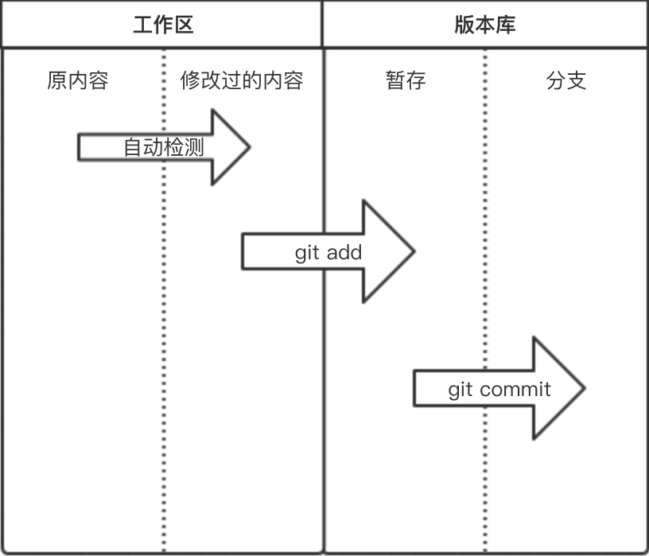

### 工作区（work directory）:
&emsp;&emsp;当前开发程序所在目录称为工作区，一般就是我们项目的根目录。
&emsp;&emsp;工作开发都是在该目录，该区域的文件会有状态的变化且状态由 git 自动检测，如果程序中文件做任何操作(增、删、改)，文件状态均会被检测到，可以使用 `git status` 命令查看。


### 暂存区（stage）：

&emsp;&emsp;版本库中设立一个暂存区（Stage or Index），作为用来直接跟工作区的文件进行交互，工作区文件的提交或者回滚首选都是通过暂存区，而版本库中除了暂存区之外，文件的提交的最终存储位置是分支（Branch），在创建版本库的时候默认都会有一个主分支（Master）。


### 版本库（repository）：

&emsp;&emsp;工作区检测到有文件发生变化，那么意味着较上一个版本之后对程序进行了修改，修改完成之后，可以当做下一版本进行提交，那么就是执行 `git add .` 将所有文件提交到暂存区，然后再执行`git commit -m '版本信息'` 提交到版本库的分支即可，之后可以使用 `git log` 命令查看版本记录。


## 各状态的提交和回滚图
> 版本的提交只能一级一级来，版本的回退除了版本库以外其他的也只能一级一级来
> 版本库可以直接回退到任意级

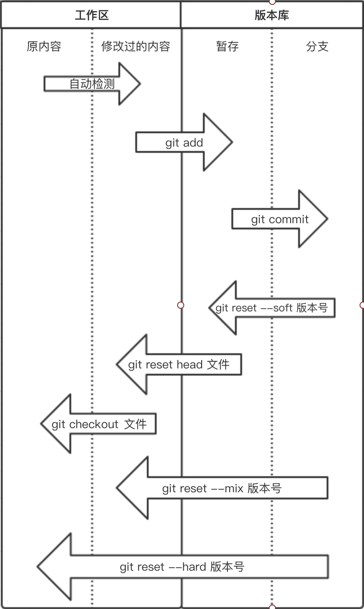

**!attention!**
> 除了版本库可以直接回滚到各个阶段，其他阶段只能一步一步的迁跃
> 只有版本库可以直接回退到稳定区、修改区、暂存区，其他区域只能按部就班的一级一级迁移


### 修改区回退到稳定区

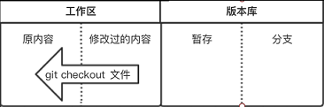

> 还没提交暂存区之前的修改   --> 最初未修改的样子
> 红色 --> 无色
```shell
git checkout 文件名				# 只恢复某个文件
git checkout .					  # 恢复该文件夹下所有文件
```

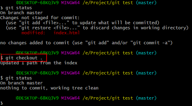


### 暂存区回退到修改区

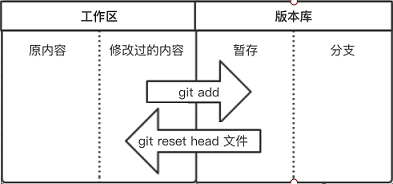

> 绿色  --> 红色
```shell
git reset head 文件名 				# 只恢复某个文件
git reset head .				  # 恢复该文件夹下所有文件
" 部分情况下 head 必须写作 HEAD 才能生效
```

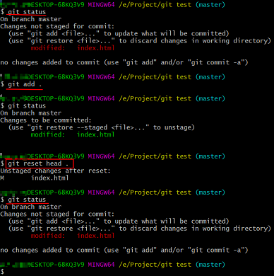


### 版本区回退到暂存区

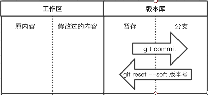

> 绿色 --> 无色
> git log 不会记录该变化，git reflog 会将该操作记录
```shell
git reset --soft 版本号
```

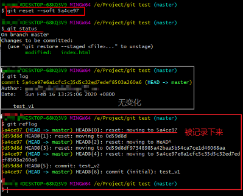


### 版本区回退到修改区

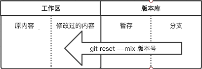

> 无色 --> 红色
> 两个版本有区别才会显示出来红色，否则不变

```shell
git reset --mix 版本号
```

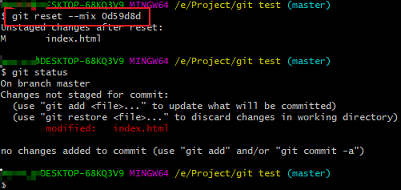


### 版本区到稳定区

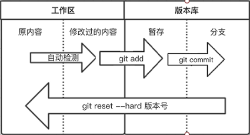

> 无色 --> 红色 --> 绿色  -->无色
```shell
git reset --hard 版本号
```


## 命令总结
### 提交命令：

|     状态转换      |           命令           |
| :---------------: | :----------------------: |
| 稳定区 --> 修改区 |       git 自动检测       |
| 修改区 --> 暂存区 |       git add 文件       |
| 暂存区 --> 版本区 | git commit -m “详细信息” |
> 提交只能一级一级的提交，不能越级提交


### 回退命令：
|     状态转换      |             命令              |
| :---------------: | :---------------------------: |
| 版本区 --> 暂存区 | git reset reset --soft 版本号 |
| 版本区 --> 修改区 |    git reset --mix 版本号     |
| 版本区 --> 稳定区 |    git reset --hard 版本号    |
| 暂存区 --> 修改区 |      git reset head 文件      |
| 修改区 --> 稳定区 |       git checkout 文件       |
> 所有从版本库出来的回退都用 **reset**
> 所有工作区的回退用 **checkout**


## !attention！

- **可以把所有分支的修改区和暂存区理解成同一个修改区和暂存区**

    > 修改区或暂存区有内容时，没有提交版本就回滚，则修改区和暂存区的内容会丢失


# git 的使用
## 1、初始化版本管理

- **进入要管理的文件夹**

- **执行初始化命令**

    ```shell
    git init
    
    # 在管理文件夹下回生成一个隐藏文件夹 .git 用来保存版本信息
    # 如果删除该隐藏文件，则之前的版本信息全部丢失
    ```

- **检测当前文件夹下的文件状态**

    ```shell
    git status
    
    # 新增加的文件和修改过的文件都是红色的
    # 存放进暂存区的文件都是绿色的
    ```

- **管理指定文件**
    ```shell
    git add 文件名					# 管理某个指定文件
    git add .					  # 管理该文件夹下所有文件
    
    # 执行命令后，执行 git status 发现管理文件已变绿
    ```

- **个人信息配置:用户名邮箱【第一次使用git时需要配置，否则提交版本时会报错】 ** 

    ```shell
    git config --global user.email "you@example.com"
    git config --global user.name "your name"
    ```

- **生成版本**  

    ```shell
    git commit -m '详细的版本信息'
    
    # 每个公司的详细描述信息都不一样, 如果公司事先没有培训, 一定要仔细查看别人是怎么写的
    ```


## 2、查看版本记录
- **查看部分版本记录**  

    ```shell
    git log
    # 只能查看该版本之前的版本信息，不能查看该版本之后的
    
    # 查看图形化版本分支流程
    git log --graph	
    # 美化图形化版本分支流程， %h 表示 hash 值， %s 表示版本信息
    git log --graph --pretty=format:"%h %s"
    ```

- **查看全部版本记录**
    ```shell
    git reflog
    ```


[Git代码行统计命令集](http://www.360doc.com/content/14/0929/11/10058718_413198911.shtml)

### git log 参数说明

|     表达式      | 描述                                                         |
| :-------------: | ------------------------------------------------------------ |
|    --author     | 指定作者                                                     |
|     --stat      | 显示每次更新的文件修改统计信息，会列出具体文件列表           |
|   --shortstat   | 统计每个 commit 的文件修改行数，包括增加，删除，但不列出文件列表 |
|    --numstat    | 统计每个 commit 的文件修改行数，包括增加，删除，并列出文件列表 |
|       -p        | 选项展开显示每次提交的内容差异，用 -2 则仅显示最近的两次更新 |
|   --name-only   | 仅在提交信息后显示已修改的文件清单                           |
|  --name-status  | 显示新增、修改、删除的文件清单                               |
| --abbrev-commit | 仅显示 SHA-1 的前几个字符，而非所有的 40 个字符              |
| --relative-date | 使用较短的相对时间显示（比如，“2 weeks ago”）                |
|     --graph     | 显示 ASCII 图形表示的分支合并历史                            |
|    --pretty     | 使用其他格式显示历史提交信息。可用的选项包括: <br />oneline，short，full，fuller 和 format（后跟指定格式） |
|     --since     | 限制显示输出的范围                                           |
|      blame      | 看看某一个文件的相关历史记录                                 |
|                 |                                                              |


####   `-p`

> 展开显示每次提交的内容差异，用 -2 则仅显示最近的两次更新

```shell
git log -p -2
```


#### `--pretty` 

>  使用其他格式显示历史提交信息。可用的选项包括 oneline，short，full，fuller 和 format（后跟指定格式）

​    例如：

```shell
git log --pretty=oneline ; 
git log --pretty=short ; 
git log --pretty=full ; 
git log --pretty=fuller
```


##### --pretty=tformat:  

> 可以定制要显示的记录格式，这样的输出便于后期编程提取分析

```shell
git log --pretty=format:"%h - %an, %ar : %s"
```

下面列出了常用的格式占位符写法及其代表的意义。

| 选项 | 说明                                       |
| :--: | ------------------------------------------ |
|  %H  | 提交对象（commit）的完整哈希字串           |
|  %h  | 提交对象的简短哈希字串                     |
|  %T  | 树对象（tree）的完整哈希字串               |
|  %t  | 树对象的简短哈希字串                       |
|  %P  | 父对象（parent）的完整哈希字串             |
|  %p  | 父对象的简短哈希字串                       |
| %an  | 作者（author）的名字                       |
| %ae  | 作者的电子邮件地址                         |
| %ad  | 作者修订日期（可以用 -date= 选项定制格式） |
| %ar  | 作者修订日期，按多久以前的方式显示         |
| %cn  | 提交者(committer)的名字                    |
| %cd  | 提交日期                                   |
| %cr  | 提交日期，按多久以前的方式显示             |
|  %s  | 提交说明                                   |

 

`--since`

> 限制显示输出的范围


|       选项        | 说明                       |
| :---------------: | -------------------------- |
|        -n         | 仅显示最近的 n 条提交      |
| --since, --after  | 仅显示指定时间之后的提交   |
| --until, --before | 仅显示指定时间之前的提交   |
|     --author      | 仅显示指定作者相关的提交   |
|    --committer    | 仅显示指定提交者相关的提交 |

例如： 

```shell
# 一分钟之前的所有 log
git log --until=1.minute.ago

# 一个小时之内的 log
git log --since=1.hour.ago 

# 一天之内的log
git log --since=1.day.ago r

# 显示最近两周的提交
git log --since=2.weeks  

# 一个月之前到半个月之前的log
git log --since=1.month.ago --until=2.weeks.ago 

# 某个时间段的 log
git log --since ==2013-08.01 --until=2013-09-07
```

 

git log --since=`.month.ago --until=2.weeks.ago //

git log --since ==2013-08.01 --until=2013-09-07 //某个时间段的 log

 

`blame` 

>  看看某一个文件的相关历史记录

​    例如：

```shell
git blame index.html --date short
```


## 3、新版本的增加
```shell
git add .
git commit -m "新版本的详细版本信息"
```

> 每个公司的 **详细描述信息** 都不一样，如果公司事先没有培训，一定要仔细查看别人是怎么写的


## 4、版本回退

> 其余区域回退请参考 git区域状态

- **回退到之前的版本**

    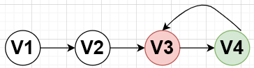

    ```shell
    git log							# 查看该版本之前的版本信息
    git reset --hard 版本号			
    ```

- **回退到之后的版本信息**

    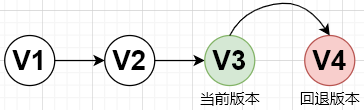

    ```shell
    git reflog						# 查看所有的版本信息
    git reset --hard 版本号	
    ```

**!Attention Please！**

> &emsp;&emsp;因为 `git log` 只能查看该版本之前的版本信息号(长的)，所以我们只能通过 `git reflog` 获取之后的版本信息号(短的)，再去回退之后的版本
> &emsp;&emsp;但是若你还记得之后的版本信息号(长的)，可以直接通过 `git reset --hard 长的版本号` 进行回退


## 5、git 分支与合并

> branch 称为分支，默认仅有一个名为 master 的分支。
> 一般开发新功能流程为：开发新功能时会在分支 dev 上进行，开发完毕后再合并到 master 分支。

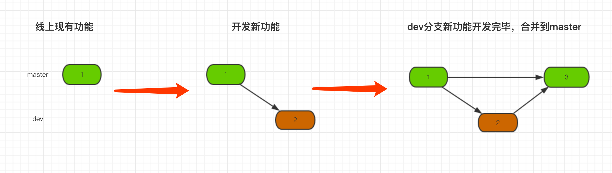

- **查看分支**

    ```shell
    git branch
    ```

- **创建新分支**

    ```shell
    git branch 分支名称
    ```

- **切换分支**

    ```shell
    git checkout 分支名称  
    
    # 创建新分支并切换分支
    git checkout -b 分支名称  
    ```

- **删除分支**

    ```shell
    git branch -d 分支名称  
    ```

- **版本合并**

    ```shell
    git merge 分支名称 
    ```

    > 一定要切换分支再合并，明确谁合并谁
    > 合并时可能会产生冲突，这时候需要手动进行修改即可
    >
    > ```shell
    > Auto-merging 123123.txt
    > CONFLICT (content): Merge conflict in 123123.txt
    > Automatic merge failed; fix conflicts and then commit the result.
    > ```


## 6、rebase (变基)

> 使 git 记录更简洁
>
> 合并记录不要合并已经提交的

### 合并多次提交纪录

- 现有环境如下：

    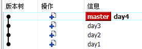

- 合并分支记录，从现有记录点开始合并

    ```shell
    git rebase -i 版本x			   # 从版本x 开始到现在的版本记录进行合并
    git rebase -i HEAD~3			# 找最近的三条版本记录进行合并
    ```

- 提示合并记录操作信息

    ```shell
    pick b7c0993 day2
    pick 4a7068d day3
    pick 45aeaa0 day4
    
    # Rebase a00092e..45aeaa0 onto a00092e (3 commands)
    #
    # Commands:
    # p, pick <commit> = use commit
    # r, reword <commit> = use commit, but edit the commit message
    # e, edit <commit> = use commit, but stop for amending
    # s, squash <commit> = use commit, but meld into previous commit
    # f, fixup <commit> = like "squash", but discard this commit's log message
    # x, exec <command> = run command (the rest of the line) using shell
    # b, break = stop here (continue rebase later with 'git rebase --continue')
    # d, drop <commit> = remove commit
    # l, label <label> = label current HEAD with a name
    # t, reset <label> = reset HEAD to a label
    # m, merge [-C <commit> | -c <commit>] <label> [# <oneline>]
    # .       create a merge commit using the original merge commit's
    # .       message (or the oneline, if no original merge commit was
    # .       specified). Use -c <commit> to reword the commit message.
    #
    ```

    修改信息并 `:wq!` 退出。

    ```shell
    pick b7c0993 day2
    s 4a7068d day3
    s 45aeaa0 day4
    
    # ...
    # 表示将 day4 合并到 day3，day3 合并到 day2
    ```

    > 注意，第一行的 day2 不要修改，因为 day2 分支是最后的基础分支

- 合并完要给他一个提交信息：

    ```shell
    # This is a combination of 3 commits.
    # This is the 1st commit message:
    
    day2
    
    # This is the commit message #2:
    
    day3
    
    # This is the commit message #3:
    
    day4
    
    # Please enter the commit message for your changes. Lines starting
    # with '#' will be ignored, and an empty message aborts the commit.
    #
    # Date:      Wed Apr 8 23:13:09 2020 +0800
    #
    # interactive rebase in progress; onto a00092e
    # Last commands done (3 commands done):
    #    squash 4a7068d day3
    #    squash 45aeaa0 day4
    # No commands remaining.
    # You are currently rebasing branch 'master' on 'a00092e'.
    #
    # Changes to be committed:
    #       new file:   2.py
    #       new file:   3.py
    #       new file:   4.py
    ```

    在这边可以修改合并后的提交信息:

    ```shell
    # This is a combination of 3 commits.
    # This is the 1st commit message:
    
    day2 & day3 & day4
    
    # Please enter the commit message for your changes. Lines starting
    ...
    ```

- 最终结果

    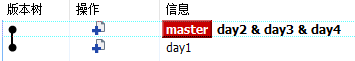

    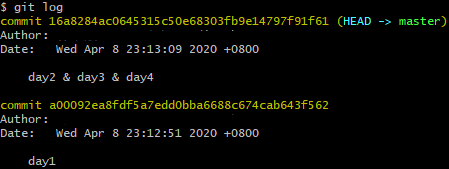


### 分支合并

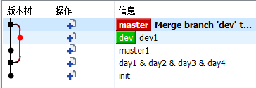

```shell
git rebase master						# (变基)将 dev 变成基本的一个树干
git checkout master						# 切换回 master
git merge dev							# 合并 dev 
```

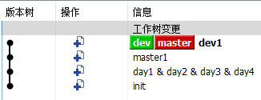

### 命令总结

```shell
# wait TODO
```


### !attention!:

&emsp;&emsp;在任何时候，我们都可以用 `--abort `参数来终止 rebase 的行动，并且分支会回到 rebase 开始前的状态。

```shell
git rebase —abort
```


## 7、查看内容修改

- **工作区与暂存区比较：**

    ```shell
    git diff
    ```

- **工作区与提交区比较:**
    ```shell
    git diff 提交hash码或者HEAD
    ```

- **暂存区与提交区比较：**
    ```shell
    git diff --cached
    ```

- **两个不同提交区比较:**
    ```shell
    git diff 提交区hash码A  提交区hash码B
    ```

- **两个不同分支间比较:**
  
    ```shell
    git diff 分支A的某个hash码  分支B的某个hash码
    
    # 若比较两个分支最新提交之间的区别，则直接将hash码换成分支名称即可
    ```


## 8、 打 tag 标签

```shell
# 打上 tag
git tag -a v0.0.1-rc.1 -m "第一版验收"

# 推送 tag 上库
git push origin --tags

# 删除tag( 原则上不允许删除 tag )
git tag -d [tag名]
```


## 9、stash 暂存

> &emsp;&emsp;将目前还不想提交的但是已经修改的内容进行保存至堆栈中，后续可以在某个分支上恢复出堆栈中的内容。这也就是说，stash 中的内容不仅仅可以恢复到原先开发的分支，也可以恢复到其他任意指定的分支上。

- 能够将所有未提交的修改（工作区和暂存区）保存至堆栈中，用于后续恢复当前工作目录。

    ```shell
    git stash
    
    # 作用等同于 git stash，区别是可以加一些注释
    git stash save 备注
    ```

- 显示保存的工作进度列表，编号越小代表保存进度的时间越近。

    ```shell
    git stash list
    ```

- 将当前stash中的内容弹出，并应用到当前分支对应的工作目录上。

    > 注：该命令将堆栈中最近保存的内容删除（栈是先进后出）
    > 如果从stash中恢复的内容和当前目录中的内容发生了冲突，也就是说，恢复的内容和当前目录修改了同一行的数据，那么会提示报错，需要解决冲突，可以通过创建新的分支来解决冲突。

    ```shell
    git stash pop stash@{num}
    ```

- 将堆栈中的内容应用到当前目录

    > 将堆栈中的内容应用到当前目录，不同于git stash pop，该命令不会将内容从堆栈中删除，也就说该命令能够将堆栈的内容多次应用到工作目录中，适应于多个分支的情况。
    > 堆栈中的内容并没有删除。
    > 可以使用git stash apply + stash名字（如stash@{1}）指定恢复哪个stash到当前的工作目录。

    ```shell
    git stash apply
    ```

- 清除堆栈中的所有内容

    ```shell
    git stash clear
    ```

- 查看堆栈中最新保存的stash和当前目录的差异。

    ```shell
    git stash show
    ```


## 10、配置文件

### 配置文件存放的位置

- **本地项目配置文件**

    &emsp;&emsp;仓库级别的配置保存在当前仓库（指定创建Git仓库的文件夹）下面的 `.git\config` 文件内，通常 `.git ` 文件夹是隐藏的，所以要在文件管理器的文件夹选项中打开显示隐藏文件夹才可以看到。

    > 项目配置文件在当前项目目录下 `vi .git/config`
    > **这里的配置仅对当前仓库有效，但是级别最高，如果用户级别或系统级别的配置里出现了同一配置项，则以这里的配置内容为准。**

    ```shell
    # 修改当前项目配置文件
    git config --local 配置
    ```

- **全局配置文件**

    用户级别的配置默认保存在当前系统用户的主目录下的 `.gitconfig` 文件内

    > windows 下:  `vi C:\Users\Administrator\.gitconfig`
    > linux 下:  `vi ~/.gitconfig`

    ```shell
    # 修改全局项目配置文件
    git config --global 配置
    ```

- **系统配置文件**

    系统级别的配置保存在Git安装目录下 `\etc\gitconfig` 文件内

    > windows 下:  `vi D:\ServerTool\Git\etc\gitconfig`
    > linux 下:  `vi /etc/.gitconfig`

    ```SHELL
     git config --system 配置
    ```

    

### 查看 Git 当前配置

&emsp;&emsp;实际上想查看配置，是可以用编辑器直接代开相应的配置文件直接查看的。也可以在控制台通过指令查看。在控制台中先用 cd 命令进入仓库文件夹

- 查看仓库级别的配置，在控制台直接输入：

    ```shell
    git config --local -l
    ```

- 查看用户级别的配置，在控制台直接输入:

    ```shell
    git config --global -l
    ```

- 查看系统级别的配置，在控制台直接输入：

    ```shell
    git config --system -l
    ```

    

### 编辑配置文件

&emsp;&emsp;除了在电脑资源管理器上直接找到文件然后鼠标右键使用编辑器打开之外，还可以在控制台里使用命令调起默认编辑器来编辑具体配置文件：

```shell
git config --local -e     			# 编辑仓库级别配置文件
git config --global -e    			# 编辑用户级别配置文件
git config --system -e    			# 编辑系统级别配置文件
```


# git 模拟场景

## 1、初步版本管理
> **需求：**
> &emsp;&emsp;初始化第一个版本，使用 git 进行管理


- **进入要管理的文件夹**
    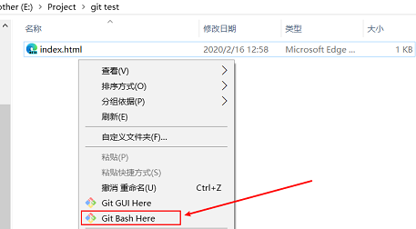

- **执行初始化命令**
    ```shell
    git init
    ```
    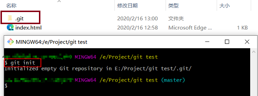

- **检测当前文件夹下的文件状态**

    ```shell
    git status
    ```

    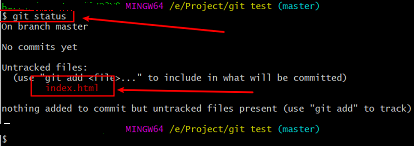

- **管理指定文件**
    ```shell
    git add 文件名
    git add .
    ```

    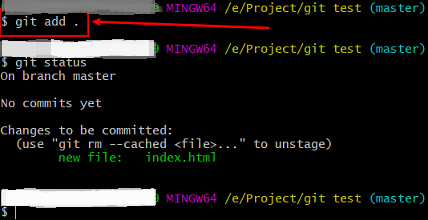

- **个人信息配置:用户名邮箱【第一次使用git时需要配置】**
    ```shell
    git config --global user.email "you@example.com"
    git config --global user.name "your name"
    ```

    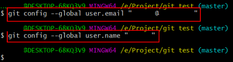

    如果未执行以上命令，强行提交版本会报以下错误：

    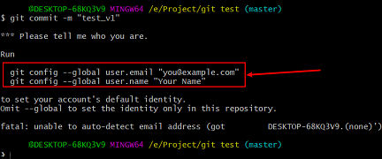


- **生成版本**
    ```shell
    git commit -m '详细的版本信息'
    ```

    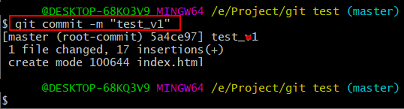


## 2、扩展新功能(版本的增加)
```shell
git add .
git commit -m "新版本的详细版本信息"
```

> 每个公司的 **详细描述信息** 都不一样，如果公司事先没有培训，一定要仔细查看别人是怎么写的


## 3、功能的下线与恢复(版本的回退)
- 回退到之前的版本

    
    ```shell
    git log							# 查看该版本之前的版本信息
    git reset --hard 版本号			
    ```

    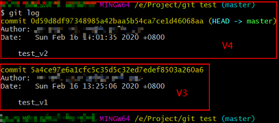

    

    > 当然，此时若你还记得之前 V4 的版本号，也可以回滚回 V4 的 

    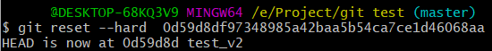

- **回退到之后的版本信息**

    

    ```shell
    git reflog						# 查看所有的版本信息
    git reset --hard 版本号	
    ```

    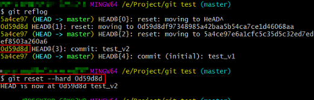


## 4、线上版本、开发版本、bug修复 (分支与合并)

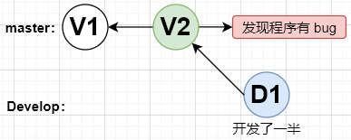
> **线上版本出现 bug，开发版本开发一半，此时如何解决？**
> ```shell
> # 答案：
> 	原来的master分支专门用来存放稳定的线上版本，创建一条专门用来存放开发版本的分支 dev，这样两条分支就完全隔开了，互不影响
> 
> # 分析：
> 	如果不重新分支，相当于开发了一半的 D1 要废弃掉或重新进行修改，回退到 V2 进行 debug，当 bug 解决后再对其进行开发。这样劳动力利用低，不适合协同开发
> ```
>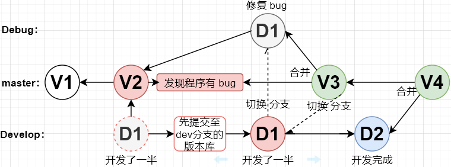


### 1 创建 dev 分支并切换

```shell
git branch 					# 查看当前所在分支
git branch dev				# 创建一条专门用来存放开发版本的分支 dev
git checkout dev			# 切换到 dev 分支
```


### 2 dev 分支进行开发
> 在该环境下进行开发不影响 master 分支
```shell
git commit -m "test_dev_50%"		# 把开发到一半的代码先保存到 dev分支的版本库
git checkout master					# 切换回 master 分支
```


### 3 创建 Debug 分支改bug
```shell
git branch Debug					# 创建 Debug 分支
git checkout Debug					# 切换到 Debug 模式并进行 bug 调试
git add .
git commit -m "Debug_test_V2"
```

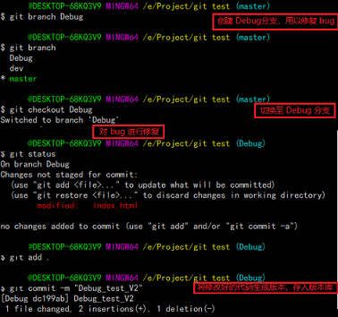


### 4 master 合并 Debug
> 修复好 bug 的版本现在只在 Debug 分支上，我们要将其同步回 master 稳定线上版本上
> 同步完成后，Debug 分支就没用了，我们就可以将其删除了
```shell
git checkout master					# 切换回 master 分支
git merge Debug						# master 合并 Debug
git branch -d Debug					# 删除 Debug 分支
```

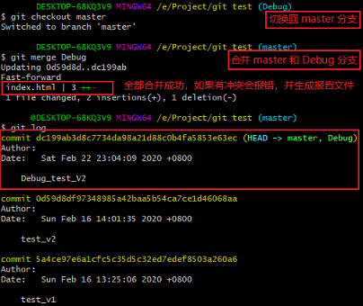


### 5 切回 dev 继续开发
```shell
git checkout dev					# 切换回 dev 分支
git add .
git commit -m "test_dev_V1"
```


### 6 切回 master 合并 dev
```shell
git checkout master					# 切换回 master 分支
git merge dev						# master 合并 dev
# 可能会产生冲突，需要手动修复
```

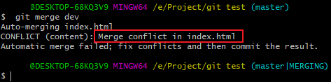

```shell
# 报错信息
Auto-merging index.html
CONFLICT (content): Merge conflict in index.html
Automatic merge failed; fix conflicts and then commit the result.

# 自动合并index.html
# 冲突（内容）：在index.html中合并冲突
# 自动合并失败； 解决冲突，然后提交结果。
```

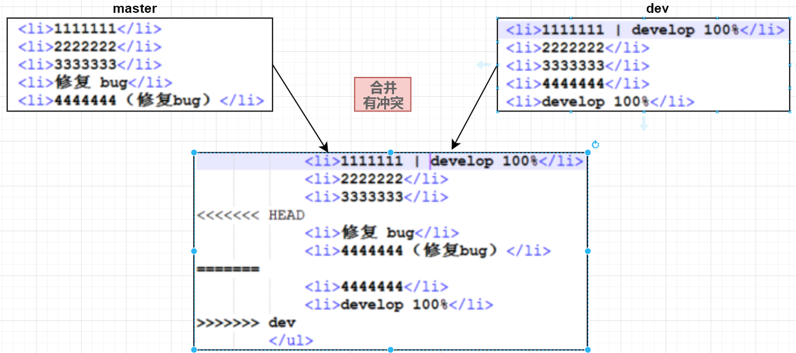

**为什么会产生冲突？**
> 因为 master 和 dev 的版本库已经不平行了，有增加有删改，这时候 git 就不知道怎么去做选择了
> 这时候 git 会将 master 和 dev 有改动的部分都放到一个文件中去，让开发者手动修改


## 5、查看修改了哪些部分

```shell
git diff
```

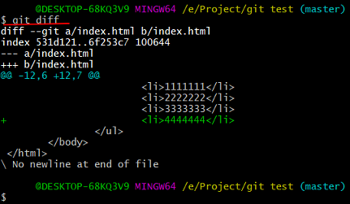

> 绿色带 ‘+’ 号的是比之前多的，即添加部分
> 红色带 ‘-’ 号的是比之前少的，即被删减部分


## 6、版本的分支与合并

- 查看目前所在分支
    ```shell
    git branch
    ```

- 创建新分支
    ```shell
    git branch 分支名称
    ```

- 切换分支
    ```shell
    git checkout 分支名称  
    ```

- 删除分支
    ```shell
    git branch -d 分支名称  
    ```

- 版本合并
    ```shell
    git merge 分支名称 
    ```

    > 一定要切换分支再合并,明确谁合并谁
    > 合并时可能会产生冲突，这时候需要手动进行修改即可
    >
    > ```shell
    > Auto-merging 123123.txt
    > CONFLICT (content): Merge conflict in 123123.txt
    > Automatic merge failed; fix conflicts and then commit the result.
    > ```


#### 代码未提交版本库切换分支
> 本质上是对修改区和暂存区的理解

**分支的代码若未提交到仓库，在切换分支时会同步到其他分支**

> 分支的隔离只是版本仓库的隔离，修改区和缓存区是会同步的


##### 两个分支是同一版本的情况

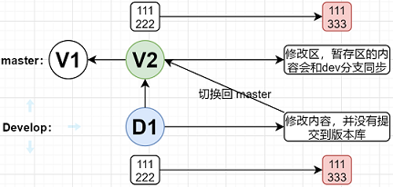

```shell
git branch dev
git checkout dev
# 修改文件内容
```

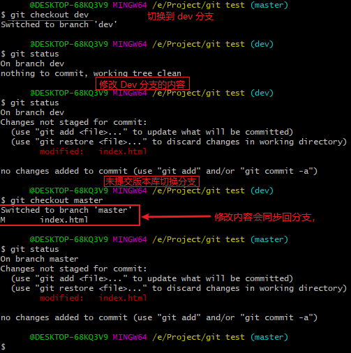


##### 两个分支不在同一个版本
> 修改后不提交版本区是无法切换分支的，会报错

**两分支所处位置如下：**
> 如果 master 修改区或暂存区有内容，并且没有保存版本区的情况下切换分支
> 并且在分支情况下切换版本，修改区和暂存区的内容会丢失

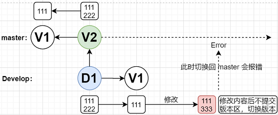


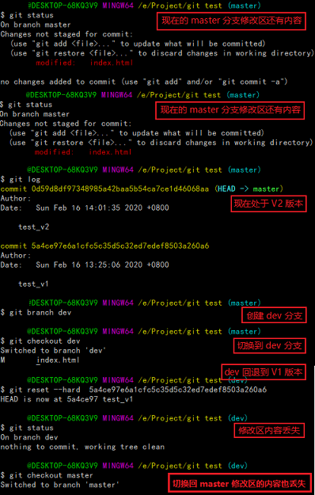

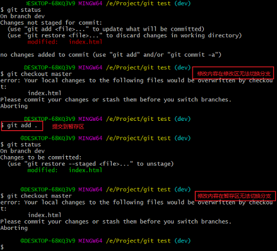

```shell
error: Your local changes to the following files would be overwritten by checkout:
        index.html
Please commit your changes or stash them before you switch branches.
Aborting

# 错误：您对以下文件的本地更改将被签出覆盖：
#          index.html
# 在切换分支之前，请提交更改或存储更改。
# 退出舍弃
```


## 7、异地开发

oldman 15 集


## 8、简化 git 记录(合并多次记录)

> **需求：**
> &emsp;&emsp;花了四天完成一个功能，但是最终提交的版本并不想看到是如何通过 day1~4完成的，只需要最终的功能版本。为了拥有更简洁的 git 版本记录信息，也以后更好的 code review，故有以下需求：
>
> 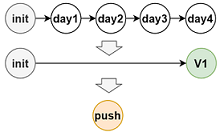

```python
git rebase -i 版本x			   # 从版本x 开始到现在的版本记录进行合并
git rebase -i HEAD~3			# 找最近的三条版本记录进行合并
```

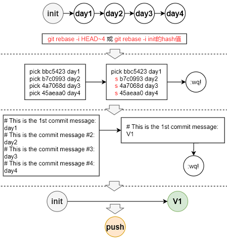

**!attention!:**

```shell
# 如果你异常退出了 vi 窗口，不要紧张：
git rebase --edit-todo

# 这时候会一直处在这个编辑的模式里，我们可以回去继续编辑，修改完保存一下：
git rebase --continue
```


## 9、获取所有分支、推送所有分支

> 从远程仓库获取所有的分支代码和 tag 推送到另一个远程仓库

### 将远端分支全部变成本地分支

> &emsp;&emsp;首先随便建立一个文件夹 `some_repo`，然后在里面只将 `xxx` 的 `.git` 文件夹拷贝下来！此时，`some_repo` 里面还是没有任何repo的文件，只有一个隐藏文件夹`.git`。然后解除`core.bare`模式，然后再恢复所有的 repo 文件。此时，所有的 `xxx` 的所有的分支都是本地分支了！

```shell
mkdir some_repo
cd some_repo
git clone --bare https://xxx.git .git
git config --unset core.bare
git reset --hard
```


### 将本地分支及 tag 全部推到远端

> 因为当前的默认 remote 的 origin 是 gitlab 的那个 xxx，那么肯定要放弃那个，直接随便改个名字就行，比如这里改成`old_origin`。然后，再添加新的remote origin。然后，我们将所有的 branch 推到 github 上去，这里是用`--all`，不是`master`。

```shell
git remote rename origin old_origin
git remote add origin https://github.com/your_name/yyy.git

# 法一：
git push --mirror https://xxx/new_group_name/new_proj.git

# 法二:
git push -u origin --all
git push -u origin --tags
```


## 10、跨分支临时保存修改

> **需求：**
>
> 1.当正在dev分支上开发某个项目，这时项目中出现一个bug，需要紧急修复，但是正在开发的内容只是完成一半，还不想提交
>
> **2**.由于疏忽，本应该在 dev 分支开发的内容，却在 master 上进行了开发，需要重新切回到 dev 分支上进行开发
>
> ```shell
> 解答：
> 1: 用git stash命令将修改的内容保存至堆栈区，然后顺利切换到 hotfix 分支进行 bug 修复，修复完成后，再次切回到 dev 分支，从堆栈中恢复刚刚保存的内容。
> 
> 2: 可以用 git stash 将内容保存至堆栈中，切回到 dev 分支后，再次恢复内容即可。
> ```


# git 常见问题

## 中文乱码问题

- `git status` 下的乱码

    ```shell
    git config --global core.quotepath false
    ```

- `git commit` 下的乱码

    ```shell
    git config --global i18n.commitencoding utf-8
    ```

    


- Git提交时提示 'The file will have its original line endings in your working directory'

    > 原因：Linux平台下的换行符是 LF，而Windows下则是 CRLF，所以当你再 Windows 保存文件时候，换行符会被保存为 CRLF

    解决方法：

    ```shell
    git config --global core.autocrlf false
    ```

    


# git 使用规范
## 开发分支规范

wait


## 多人协同开发(gitflow工作流)

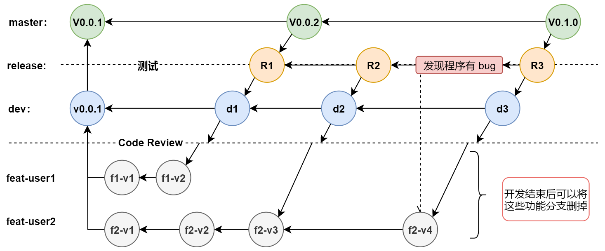


# 远程仓库

&emsp;&emsp;到目前为止，我们已经掌握了如何在 Git 仓库里对一个文件进行时光穿梭，你再也不用担心文件备份或者丢失的问题了。可是有用过集中式版本控制系统SVN的童鞋会站出来说，这些功能在 SVN 里早就有了，没看出 Git 有什么特别的地方。没错，如果只是在一个仓库里管理文件历史，Git 和 SVN 真没啥区别。

&emsp;&emsp;Git 是分布式版本控制系统，同一个 Git 仓库，可以分布到不同的机器上。怎么分布呢？最早，肯定只有一台机器有一个原始版本库，此后，别的机器可以“克隆”这个原始版本库，而且每台机器的版本库其实都是一样的，并没有主次之分。
&emsp;&emsp;你肯定会想，分布式至少需要两台机器才能玩远程库不是？但是我只有一台电脑，怎么玩？
&emsp;&emsp;其实一台电脑上也是可以克隆多个版本库的，只要不在同一个目录下。不过，现实生活中是不会有人这么傻的在一台电脑上搞几个远程库玩，因为一台电脑上搞几个远程库完全没有意义，而且硬盘挂了会导致所有库都挂掉。实际情况往往是这样，找一台电脑充当服务器的角色，每天24小时开机，其他每个人都从这个“服务器”仓库克隆一份到自己的电脑上，并且各自把各自的提交推送到服务器仓库里，也从服务器仓库中拉取别人的提交。
&emsp;&emsp;当然, 完全可以自己搭建一台运行Git的服务器，不过现阶段，为了学 Git 先搭个服务器绝对是小题大作。好在这个世界上有个叫 [GitHub](https://github.com/) 的神奇的网站，从名字就可以看出，这个网站就是提供 Git 仓库托管服务的，所以，只要注册一个 GitHub 账号，就可以免费获得 Git 远程仓库。

&emsp;&emsp;在继续阅读后续内容前，请自行注册 GitHub 账号。由于你的本地 Git 仓库和 GitHub 仓库之间的传输是通过SSH加密的，所以，需要一点设置：

- **第1步：创建SSH Key。**在用户主目录下，看看有没有 .ssh 目录，如果有，再看看这个目录下有没有`id_rsa`和`id_rsa.pub`这两个文件，如果已经有了，可直接跳到下一步。如果没有，打开Shell（Windows下打开Git Bash），创建SSH Key：

    ```shell
    ssh-keygen -t rsa -C "youremail@example.com"
    ```

    你需要把邮件地址换成你自己的邮件地址，然后一路回车，使用默认值即可，由于这个Key也不是用于军事目的，所以也无需设置密码。如果一切顺利的话，可以在用户主目录里找到`.ssh`目录，里面有`id_rsa`和`id_rsa.pub`两个文件，这两个就是SSH Key的秘钥对，`id_rsa`是私钥，不能泄露出去，`id_rsa.pub`是公钥，可以放心地告诉任何人。


- **第2步：登陆GitHub，打开“Account settings”，“SSH Keys”页面：**

    然后，点“Add SSH Key”，填上任意Title，在Key文本框里粘贴`id_rsa.pub`文件的内容：

    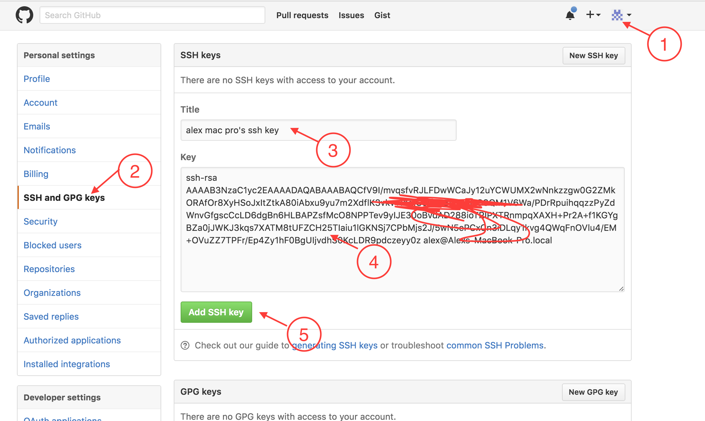

    &emsp;&emsp;为什么 GitHub 需要SSH Key呢？因为 GitHub 需要识别出你推送的提交确实是你推送的，而不是别人冒充的，而 Git 支持 SSH 协议，所以，GitHub 只要知道了你的公钥，就可以确认只有你自己才能推送。当然，GitHub 允许你添加多个 Key。假定你有若干电脑，你一会儿在公司提交，一会儿在家里提交，只要把每台电脑的 Key 都添加到 GitHub，就可以在每台电脑上往 GitHub 推送了。

    &emsp;&emsp;最后友情提示，在GitHub上免费托管的Git仓库，任何人都可以看到喔（但只有你自己才能改）。所以，不要把敏感信息放进去。
    &emsp;&emsp;如果你不想让别人看到Git库，有两个办法，一个是交点保护费，让GitHub把公开的仓库变成私有的，这样别人就看不见了（不可读更不可写）。另一个办法是自己动手，搭一个Git服务器，因为是你自己的Git服务器，所以别人也是看不见的。这个方法我们后面会讲到的，相当简单，公司内部开发必备。
    确保你拥有一个GitHub账号后，我们就即将开始远程仓库的学习。


## github

> GitHub 是一个基于 Git 的远程文件托管平台（ 同 GitCafe、BitBucket 和 GitLab 等 ）。

### 注册账号

### 创建仓库


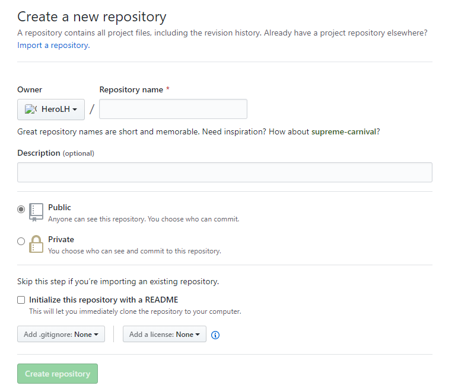

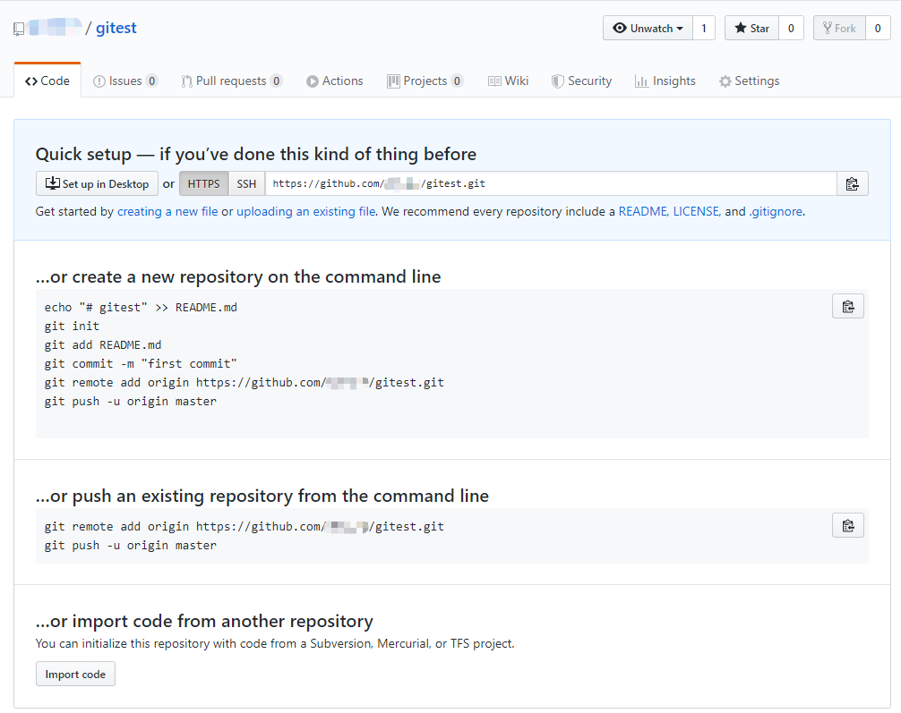

#### 帮助信息

-  …or create a new repository on the command line

    ```shell
    echo "# gitest" >> README.md
    git init
    git add README.md
    git commit -m "first commit"
    git remote add origin https://github.com/HeroLH/gitest.git
    # 给远程仓库 https://github.com/HeroLH/gitest.git 起个别名 origin
    git push -u origin master			# 像远端推送代码
    ```

- …or push an existing repository from the command line

    ```shell
    git remote add origin https://github.com/HeroLH/gitest.git
    git push -u origin master
    ```

-  …or import code from another repository

    > You can initialize this repository with code from a Subversion, Mercurial, or TFS project.


### 命令总结

#### 本地仓库推送

```shell
# 1. 添加远程仓库连接(别名)
git remote add origin 远程仓库地址

# 2. 克隆远程仓库代码
git clone 远程仓库地址 (内部已实现 git remote add origin 远程仓库地址)

# 拉取指定分支：使用branch参数，后面加上tag标签，最后是git仓库的地址
git clone --branch [tags标签] [git地址] [本地文件夹名]
# git clone -b dev git://...git project_1


# 3. 向远程推送代码， -u 表示以后默认 push 到分支1
git push -u origin 分支1

# 4. 切换分支
git checkout 分支

# 5. 拉取代码
git pull origin dev
# 相当于以下两句
# git fetch origin dev
# git merge origin/dev

# 6. 删除远端分支
git push origin --delete 分支名
```


### 给开源项目贡献代码

- **fork 源代码**

    > 将别人的源代码拷贝到我自己的远程仓库

- **在自己仓库进行修改代码**

- **给源代码的作者提交修复 bug 的申请 ( pull request )**


### github 无法访问的解决方法

> 问题描述：能联网但不能访问github.com

在 host 文件中添加两行记录：

```shell
140.82.114.4 		github.com 
151.101.185.194 	github.global.ssl.fastly.net
```

注意，不同机器的IP可能各不相同。具体的IP可通过以下网址查

```shell
http://github.com.ipaddress.com
http://github.global.ssl.fastly.net.ipaddress.com
```

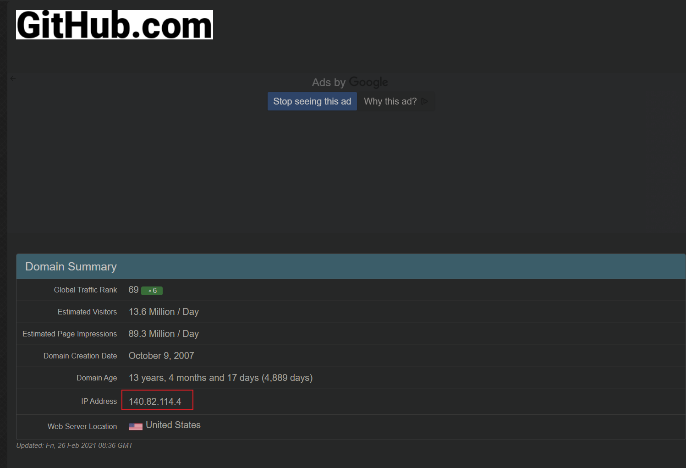


## 免密登录

- **URL 中体现**

    ```shell
    # 原来的地址
    https://github.com/user/project.git
    # 修改的地址
    https://用户名:密码@github.com/user/project.git
    local
    git remote add origin https://用户名:密码@github.com/user/project.git
    ```

- **SSH 实现**

    ```shell
    # 1. 本地生成公钥和私钥( 默认存放在用户目录的 ~/.ssh目录下， id_rsa.pub公钥、id_rsa私钥 )
    ssh-keygen -t rsa -C “youremail@example.com”
    # 注意，上述 youremail@example.com 是指 GitHub 的账户的注册邮箱
    ssh -v git@github.com
    # 2. 拷贝公钥的内容, 并拷贝设置到 github 中
    # 3. 在 git 本地中配置项目 ssh 地址
    git remote add origin git@github.com:user/project.git
    ```

- **git 自动管理凭证**

 


## .gitignore ( 忽略文件 )

让 git 不再管理当前目录下的某些文件

```shell
# vi .gitignore 
*.py
!test.py					# test.py 除外(不忽略)
files/						# 忽略该文件夹下所有文件
.gitignore 					# 忽略 .gitignore 本身
```

更多参考: [各类语言项目推荐的 ignore 文件](https://github.com/github/gitignore)

如果只需要提交目录中的某一个文件，只需要在前加一行星号，表示忽略所有文件，感叹号把需要的留下来。

```shell
*
!file
```


# GIT GUI

## Beyond Compare

### 快速解决冲突

- 第一步安装 Beyond Compare

    > 这里使用的是 Beyond Compare 4，安装步骤略

- 第二步，配置 git

    ```shell
    # --local 是本项目起效
    git config --local merge.tool bc
    git config --local mergetool.bc.path "D:/Software/Beyond Compare 4/BComp.exe"
    git config --local mergetool.keepBackup false			# 发生冲突的时候，不用保留备份
    git config --local mergetool.bc.trustExitCode true
    ```

- 应用

    ```shell
    git mergetool
    # 解决完冲突，保存，关闭  Beyond Compare 4
    git commit
    ```

    

### 快速查看区别

```shell
git config --local diff.tool bc
git config --local difftool.prompt false
git config --local difftool.bc.path "D:/Software/Beyond Compare 4/BComp.exe"
```

- 应用

    ```shell
    git difftool
    ```

    


## TortoiseGit

> 参考 [小乌龟git](https://www.cnblogs.com/dslx/p/10462378.html)

### 安装和汉化

[传送门](<https://download.tortoisegit.org/tgit/2.10.0.0/>) 这是2.10稳定版本，可以自己找需要的版本，然后根据自己电脑配置下载。也可以下载个语言包

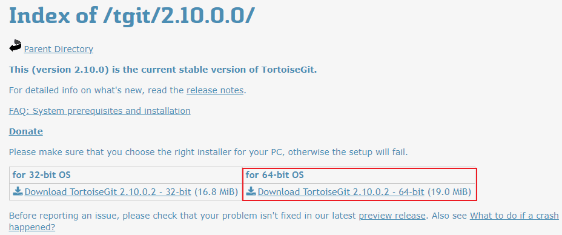

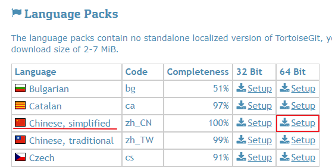

- **下载完成后，先安装小乌龟，在汉化。**

    

    

    

- **完成后，打开下载的语言包进行汉化（针对英语不好的同学）**

    

    把 √ 打上，语言包就应用上了。

    

- 查看一下是否都安装完成，很简单。我们在桌面上，右键。

    


### 基本操作

- 在代码拖管平台上，注册和创建项目。如 github，开源中国。创建完后，复制项目地址
- 本地创建一个空文件夹，作为本地仓库。在文件夹内，右键->git克隆。url我们刚才复制的地址

- 确认后，还得添加一个git的基本信息配置，右键能看到小乌龟，鼠标停放，然后进入设置

- 拉取时要求输入用户名和密码，就是在代码托管平台上时注册的，之后就开始克隆项目镜像。
- 已经克隆完毕。这是我们的工作区，我们可以任意在这边修改和添加。


