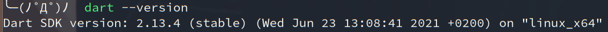

----------------------------------------------
> *Made By Herolh*
----------------------------------------------

# Dart 的安装 {#index}

[TOC]


 


--------------------------------------------

## 文档版本

|    时间    | 修改人 | 内容     |
| :--------: | :----: | :------- |
| 2021-08-16 | Herolh | 文档创建 |
|            |        |          |


## 简介

[官方文档](https://flutter.dev/docs/get-started/install)


## 安装

### Linux 下

#### Arch 

```shell
sudo pacman -S dart
```




### Windows 下


### Mac 下

如果 mac 电脑没有安装 brew 这个工具首先第一步需要安装它：  https://brew.sh/

```shell
brew tap dart-lang/dart
brew install dart
```


## 编辑器

### vscode

