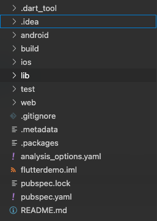
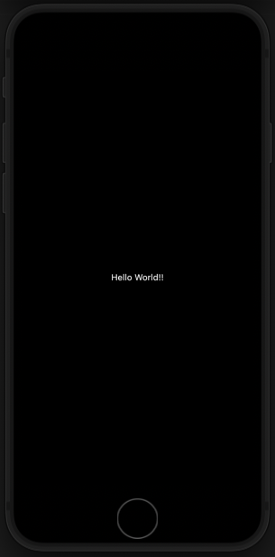
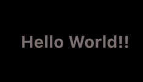
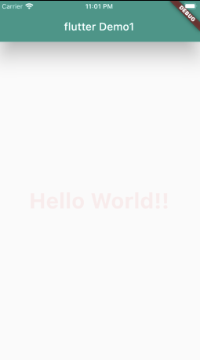

----------------------------------------------
> *Made By Herolh*
----------------------------------------------

# Flutter 基本使用 {#index}

[TOC]


 


--------------------------------------------

## 文档版本

|    时间    | 修改人 | 内容     |
| :--------: | :----: | :------- |
| 2021-09-13 | Herolh | 文档创建 |
|            |        |          |


## 简介


## 目录结构



|     文件夹      | 作用                                               |
| :-------------: | :------------------------------------------------- |
|     android     | android 平台相关代码                               |
|       ios       | ios 平台相关代码                                   |
|       lib       | flutter 相关代码，我们主要编写的代码就在这个文件夹 |
|      test       | 用于存放测试代码                                   |
| `pubspec.yaml ` | 配置文件，一般存放一些第三方库的依赖。             |


### **Flutter** 入口文件

&emsp;&emsp;每一个 flutter 项目的 lib 目录里面都有一个 `main.dart` 这个文件就是 flutter 的入口文件:

```dart
// main 方法是 dart 的入口方法
void main() {
  // runApp 方法是 flutter 的入口方法
  runApp(const MyApp());
  // MyApp 是自定义的一个组件
}

// 也可以简写
void main()=>runApp(MyApp());
```


## Hello World



```dart
import 'package:flutter/material.dart';

void main() {
  runApp(const Center(
      child: Text(
    "Hello World!",
    textDirection: TextDirection.ltr,
  )));
}
```


### 自定义组件

> 在 Flutter 中，大多数东西都是 widget，包括对齐(alignment)、填充(padding)和布局(layout)

&emsp;&emsp;在 Flutter 中自定义组件其实就是一个类，这个类需要继承 `StatelessWidget` 或 `StatefulWidget` 。
- **StatelessWidget** 是无状态组件，状态不可变的 widget.
- **StatefulWidget** 是有状态组件，持有的状态可能在 widget 生命周期改变.

```dart
import 'package:flutter/material.dart';

void main() {
  runApp(MyApp());
}

// 该应用程序继承了 StatelessWidget，这将会使应用本身也成为一个widget。 
class MyApp extends StatelessWidget { 
  // widget的主要工作是提供一个 build() 方法来描述如何根据其他较低级别的 widget 来显示自己。
  @override
  Widget build(BuildContext context) {
    var data = "Hello World!!";
    return Center(
        child: Text(
      data,
      textDirection: TextDirection.ltr,
    ));
  }
}
```


### **Text** 组件增加一些装饰

```dart
void main() {
  runApp(MyApp());
}

class MyApp extends StatelessWidget {
  @override
  Widget build(BuildContext context) {
    var data = "Hello World!!";
    return Center(
        child: Text(
      data,
      textDirection: TextDirection.ltr,
      style: const TextStyle(
          fontSize: 40.0,
          fontWeight: FontWeight.bold,
					// color: Colors.yellow
          color: Color.fromRGBO(255, 222, 222, 0.5)),
    ));
  }
}
```




### 用 MaterialApp 和 Scaffold 组件装饰 App

#### MaterialApp

> [Material](https://material.io/guidelines/) 是一种标准的移动端和 web 端的视觉设计语言。 Flutter提供了一套丰富的 Material widgets。

&emsp;&emsp;MaterialApp 是一个方便的 Widget，它封装了应用程序实现 Material Design 所需要的一些 Widget。==一般作为顶层 widget 使用==。


**常用的属性:**
home(主页) 
title(标题) 
color(颜色) 
theme(主题) 
routes(路由) ...


#### Scaffold

> - Scaffold 是 Material library 中提供的一个 widget, 它提供了默认的导航栏、标题和包含主屏幕widget树的body属性。widget树可以很复杂。

&emsp;&emsp;Scaffold 是 Material Design 布局结构的基本实现。此类提供了用于显示 drawer、snackbar 和底部 sheet 的 API。


**Scaffold 有下面几个主要属性:**

- appBar - 显示在界面顶部的一个 AppBar。

- body - 当前界面所显示的主要内容 Widget。 
- drawer - 抽屉菜单控件。


```dart
import 'package:flutter/material.dart';

void main() {
  runApp(MyApp());
}

class MyApp extends StatelessWidget {
  @override
  Widget build(BuildContext context) {
    return MaterialApp(
      home: Scaffold(
        appBar: AppBar(
          title: const Text("flutter Demo1"),
          elevation: 30.0, // //设置标题阴影, 不需要的话值设置成 0.0
        ),
        body: HomeContent(),
      ),
      theme: ThemeData(
        primarySwatch: Colors.teal,
      ),
    );
  }
}

class HomeContent extends StatelessWidget {
  @override
  Widget build(BuildContext context) {
    var data = "Hello World!!";
    return Center(
        child: Text(
      data,
      textDirection: TextDirection.ltr,
      style: const TextStyle(
          fontSize: 40.0,
          fontWeight: FontWeight.bold,
          // color: Colors.yellow
          color: Color.fromRGBO(255, 222, 222, 0.5)),
    ));
  }
}
```


