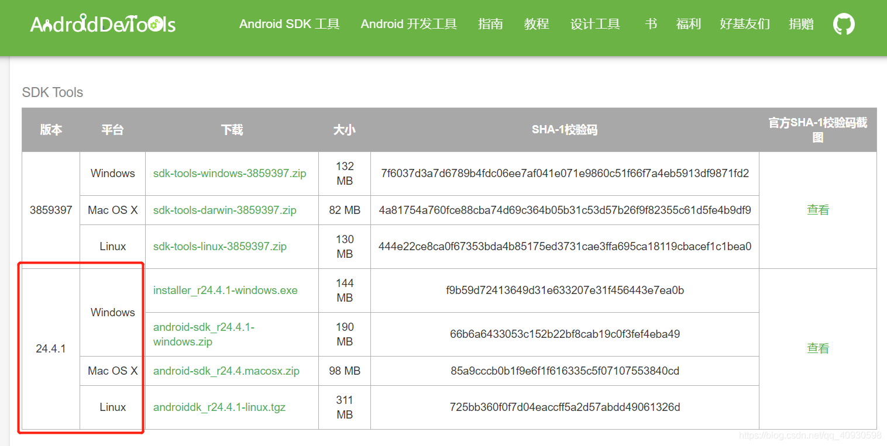

----------------------------------------------
> *Made By Herolh*
----------------------------------------------

# Flutter 的安装 {#index}

[TOC]


 


--------------------------------------------

## 文档版本

|    时间    | 修改人 | 内容     |
| :--------: | :----: | :------- |
| 2021-08-19 | Herolh | 文档创建 |
|            |        |          |


## 简介

[flutter 国内官网](https://flutter-io.cn/)


### 依赖项

- JDK
- android-sdk
- android studio
- flutter SDK


## 安装

### Linux 下

#### Arch 

```shell
# 安装 android-sdk
sudo pacman -S android-sdk

# 安装 android-studio
sudo pacman -S android-studio

# 安装 flutter SDK
sudo pacman -S flutter
# Flutter 安装在 /opt/flutter
# 如果您打算将其用作普通用户，请将您的用户添加到 flutterusers 组中：
gpasswd -a <用户> flutterusers

# 您需要获取 /etc/profile 或重新登录才能将 flutter 添加到您的路径中。
# 将您的终端重新登录到 flutterusers 组： 
newgrp flutterusers

# 验证
flutter -v

# 检测环境是否配置成功
flutter doctor
```


设置国内镜像

```shell
export FLUTTER_STORAGE_BASE_URL="https://storage.flutter-io.cn"
export PUB_HOSTED_URL="https://pub.flutter-io.cn"

# 清华源
# export FLUTTER_STORAGE_BASE_URL="https://mirrors.tuna.tsinghua.edu.cn/flutter"
# export PUB_HOSTED_URL="https://mirrors.tuna.tsinghua.edu.cn/dart-pub"
```


### Mac 下

- 安装最新的 Xcode
- 安装 brew


#### 下载SDK

[官方下载地址](https://flutter.dev/docs/get-started/install/macos)


#### 配置环境变量

```shell
vim /etc/profile

# flutter
export PATH="$PATH:/Users/herolh/Develop/flutter/bin"
export FLUTTER_STORAGE_BASE_URL="https://mirrors.tuna.tsinghua.edu.cn/flutter"
export PUB_HOSTED_URL="https://mirrors.tuna.tsinghua.edu.cn/dart-pub"

source /etc/profile
```


#### 环境检查

```shell
flutter doctor
```

第一次运行会报错


```shell
sudo xcodebuild -runFirstLaunch
sudo xcode-select --switch /Applications/Xcode.app/Contents/Developer

# 解决 cocoaPads not installad
brew install cocoapods
pod setup
```


#### 命令行创建 Flutter 项目

```shell
sudo flutter create flutterdemo

# 修改项目权限
sudo chmod -R 777 ..pwd/flutter
sudo chmod -R 777 ..pwd/flutterdemo

```


#### Xcode 导入项目


#### 编译运行


### window 下

#### 安装 java JDK

下载地址: https://www.oracle.com/cn/java/technologies/javase/javase-jdk8-downloads.html


#### 安装 android studio

下载地址: https://developer.android.google.cn/studio/#downloads


#### 安装Android SDK（如果有此环境请忽略）

1. 去安卓工具网上面下载Android SDK安装包，[点我跳转](https://www.androiddevtools.cn/)。
2. 选择 [Android SDK 工具] 菜单 -> [SDK Tools]菜单，选择适合自己的版本进行下载。




#### 安装 Flutter SDK

[官网下载地址](https://flutter.dev/docs/development/tools/sdk/releases#windows)


把 Flutter 安装目录的 bin 目录配置到环境变量。 `E:\flutter_windows\flutter\bin` 目录配置到 path 环境变量里面


#### 配置 Flutter 国内镜像

拉到 Flutter 中文网最下面有配置方式，把下面两句配置到环境变量里面

```shell
FLUTTER_STORAGE_BASE_URL: https://storage.flutter-io.cn
PUB_HOSTED_URL: https://pub.flutter-io.cn
```


#### 检测环境是否配置成功

```shell
flutter doctor
```

