----------------------------------------------
> *Made By Herolh*
----------------------------------------------

# git 服务器  {#index}

[TOC]


# gitLab

## gitLab 简介

&emsp;&emsp;[GitLab](https://about.gitlab.com/) 是利用 Ruby on Rails 一个开源的版本管理系统，实现一个自托管的Git项目仓库，可通过Web界面进行访问公开的或者私人项目。它拥有与Github类似的功能，能够浏览源代码，管理缺陷和注释。可以管理团队对仓库的访问，它非常易于浏览提交过的版本并提供一个文件历史库。团队成员可以利用内置的简单聊天程序(Wall)进行交流。它还提供一个代码片段收集功能可以轻松实现代码复用，便于日后有需要的时候进行查找。


## gitLab 安装

```shell
# 系统要求
系统：centos7 64位
内存：2G+						# 2G 可以安装，但是我 4G 都很卡
版本：gitlab-ce-10.5.7
依赖：sshd ，postfix(用于邮件通知)
```


### centos 环境安装

#### 配置必要的依赖

&emsp;&emsp;首先要在 CentOS 系统上面安装所需的依赖：`ssh`、防火墙、`postfix`(用于邮件通知)、`wegt`，以下这些命令也会打开系统防火墙中的` HTTP `和 `SSH` 端口访问。

```shell
# 1、安装SSH协议
sudo yum install -y curl policycoreutils-python openssh-server
# 2、设置SSH服务开机自启动
sudo systemctl enable sshd
# 3、启动SSH服务
sudo systemctl start sshd
# 4、安装防火墙
yum install firewalld systemd -y
# 5、开启防火墙
service firewalld  start
# 6、添加HTTP服务到firewalld
firewall-cmd --permanent --add-service=http
# 7、重启防火墙
systemctl reload firewalld

# 8、安装Postfix以发送邮件
sudo yum install postfix -y
# 9、将postfix服务设置成开机自启动
sudo systemctl enable postfix
# 10、启动postfix
sudo systemctl start postfix

# 11、安装wget，用于从外网上下载插件
安装命令：  yum -y install wget
```


####  安装 gitlab 服务器

```shell
# 1、添加gitlab镜像
wget https://mirrors.tuna.tsinghua.edu.cn/gitlab-ce/yum/el7/gitlab-ce-10.5.7-ce.0.el7.x86_64.rpm

# 2、安装Gitlab
命令：rpm -i gitlab-ce-10.5.7-ce.0.el7.x86_64.rpm
```


#### 修改gitlab配置文件

 修改配置文件  `vim  /etc/gitlab/gitlab.rb`

```shell
external_url 'http://192.168.109.129'			# 不加端口默认在 占用 nginx 80 端口
# external_url 'http://106.2.20.152:9090'

# 配置时区
gitlab_rails['time_zone'] = 'Asia/Shanghai'
```

若有添加端口再执行以下内容，如果没添加则不需要执行：

```python
# 将9090端口添加到防火墙中
firewall-cmd --zone=public --add-port=9090/tcp --permanent 

# 重启防火墙
systemctl reload firewalld
```


#### 重置 gitlab

每次修改完配置文件都需要执行下面命令：

```python
# 重置gitlab
gitlab-ctl reconfigure

# 启动gitlab
gitlab-ctl restart
```

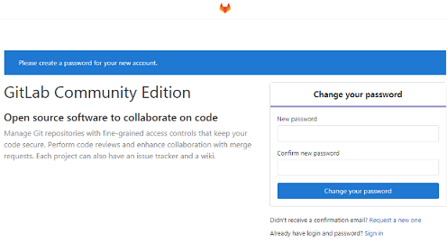

显示以上内容表示成功搭建！该界面是提醒你配置管理员密码！


### 汉化 gitlab

- **安装 git**

    ```shell
    yum install -y git
    ```

- **查看 gitlab 版本信息**

    > 说明：版本号的概念非常重要，这是产生补丁文件的关键。用于 `git diff` 比较的是原始 GitLab 版本与汉化仓库中的 `git tag` 版本。

    ```python
    # 查看原版版本号
    cat /opt/gitlab/embedded/service/gitlab-rails/VERSION 
    10.5.7
    
    # 查看汉化版本号
    cat VERSION
    10.5.7
    
    # 查看汉化包支持的GitLab版本
    git tag
    v0.9.4
    v0.9.5
    ...
    v8.8.5
    v8.8.5.zh1
    ...
    v8.9.0-rc8
    ```

- **下载汉化包**

    > 其中 v10.5.7-zh 是版本，我的下载目录是 root

    ```python
    git clone https://gitlab.com/xhang/gitlab.git -b v10.5.7-zh
    ```

    如果下载太慢可以考到码云再进行下载，或者用我 [码云快速通道](https://gitee.com/lin_river/gitlab/tree/v10.5.7-zh/) 已经迁移好的。点击复制，然后选定目录执行:

    ```shell
    git clone https://gitee.com/lin_river/gitlab.git
    ```

    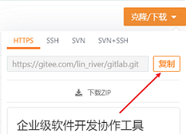

- **停止 gitlab 服务**

    ```shell
    gitlab-ctl stop
    ```

- **安装 patch**

    ```shell
    yum install patch -y
    ```

- **产生补丁文件**

    >  切换到 gitlab 汉化包所在的目录，比较汉化标签和原标签，导出 `patch` 用的 `diff `文件到 `/opt` 下 

    ```shell
    git diff v10.5.7 v10.5.7-zh > /opt/zh.diff
    # 可以打开 zh.diff 文件，如果有东西说明成功，没有则失败
    ```

- **将 `zh.diff` 作为补丁更新到 gitlab 中**

    ```shell
    patch -d /opt/gitlab/embedded/service/gitlab-rails -p1 < 10.5.7-zh.diff
    ```

- **启动 gitlab**

    ```shell
    # 重新配置gitlab
    gitlab-ctl reconfigure
    
    gitlab-ctl start
    ```

    


## gitlab 使用

### gitlab 提速

> 带不动带不动，虚拟机 4G 还很卡顿，所以我们做一些配置可以提高访问数据，增强体验

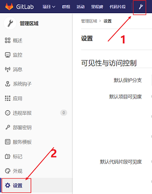

- **关闭 Gravatar 头像**

    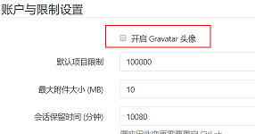

- **关闭注册**

    

- **关闭 gitlab 更新**

    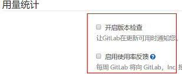

- **点击保存**

    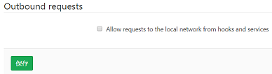


### 初次使用

#### 创建gitlab群组


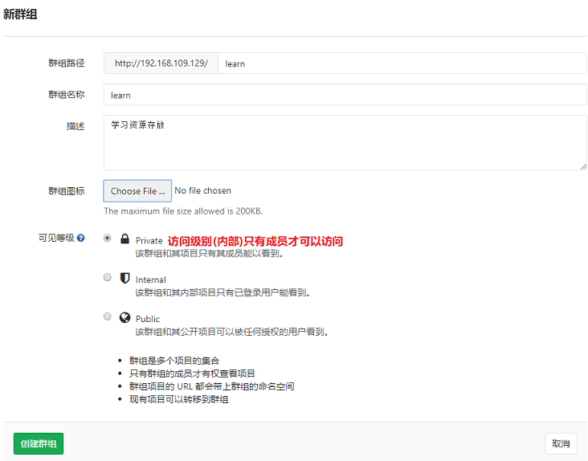


####  给群组创建项目

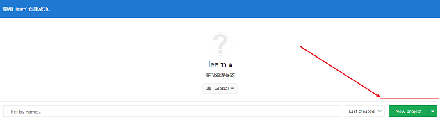

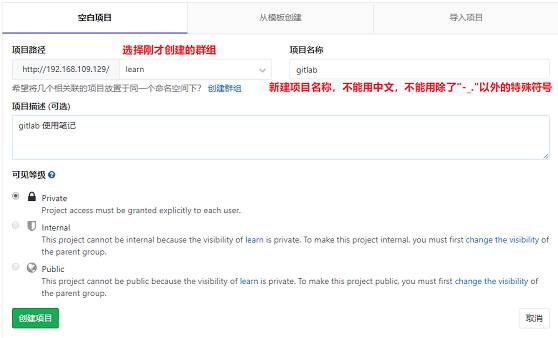


创建完成之后它提示我们可以创建一个 key 对它进行管理，我们点击上面的`README`然后我们随便在里面写点东西

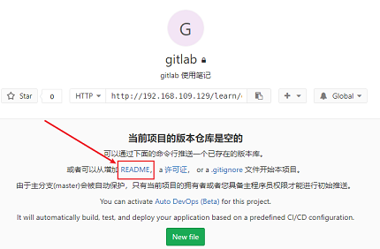

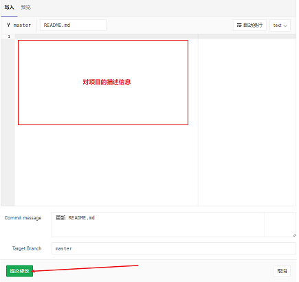


#### 项目初始化

注意！！！任何时候都不要轻易把代码提交到 master 上，要养成良好的习惯，

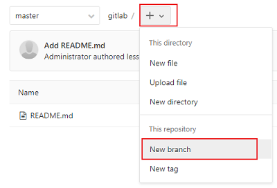

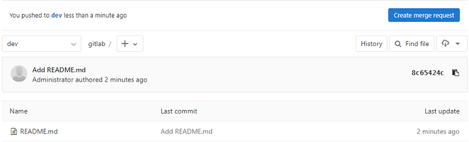


#### 本地代码提交

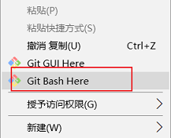

```shell
# 1. 使用 git 管理该文件夹
git init

# 拉取 gitlab 到本地文件夹
git remote add origin http://192.168.109.129/learn/gitlab.git

# 写完代码，修改完成后，把修改提交到缓存区
 git add .

# 提交到本地版本信息库
git commit -m "gitlab 安装汉化以及初次使用"

# 检查本地和 gitlab 文件冲突，详情请看下面
git pull --rebase origin master

# 创建dev 分支，开发都要在 dev 分支中进行，谨慎提交到 master 分支
git branch dev

# 切换到 dev 分支
git checkout dev

# 提交到 gitlab 的 dev 分支
git push -u origin dev
```

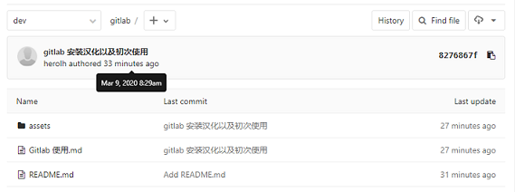

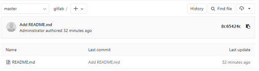


#### 可能存在问题

在使用git 对源代码进行push到gitHub时可能会出错，信息如:

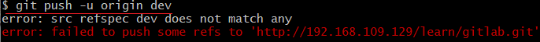

此时很多人会尝试下面的命令把当前分支代码上传到 master 分支上。

```shell
git push -u origin master
# 依然没能解决问题
```

出现错误的主要原因是 github 中的 `README.md` 文件不在本地代码目录中

可以通过如下命令进行代码合并[注：`pull=fetch+merge`]

```shell
git pull --rebase origin master
```

执行上面代码后可以看到本地代码库中多了`README.md` 文件,此时再执行语句 `git push -u origin dev` 即可完成代码上传到 gitlab

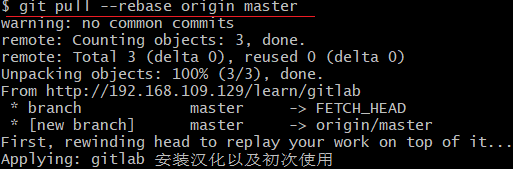


## gitlab 命令行指令

```shell
# 拉取数据
git clone https://gitlab.XXXXXXXXX
git push origin dev			# 提交代码到gitLab服务器，显示这样的信息说明提交完成

git pull origin develop		# 拉取数据
```

```shell
Git 全局设置
git config --global user.name "Administrator"
git config --global user.email "admin@example.com"

创建新版本库
git clone http://192.168.109.129/learn/gitlab.git
cd gitlab
touch README.md
git add README.md
git commit -m "add README"
git push -u origin master

已存在的文件夹
cd existing_folder
git init
git remote add origin http://192.168.109.129/learn/gitlab.git
git add .
git commit -m "Initial commit"
git push -u origin master

已存在的 Git 版本库
cd existing_repo
git remote rename origin old-origin
git remote add origin http://192.168.109.129/learn/gitlab.git
git push -u origin --all
git push -u origin --tags
```


# gogs

[官方文档](https://gogs.io/docs/installation/install_from_binary)

## gogs安装

### Centos 安装

>  参考: [centos7 安装 Gogs](https://my.oschina.net/lwenhao/blog/3114991)

- 使用 yum 安装 Git：

    ```shell
    sudo yum install git
    ```

- 添加 git 用户：

    ```shell
    sudo useradd git
    ```

- 查看 CentOS 内核版本，确定架构（x64、x86 还是 arm）

    ```shell
    uname -a　
    ```

- 下载与其对应的二进制安装包：

    官网： [下载地址](https://dl.gogs.io/)

    ```shell
    wget https://dl.gogs.io/0.11.91/gogs_0.11.91_linux_amd64.tar.gz 
    ```

- 将安装包解压至 git 用户目录下 `/home/git` 并修改其权限和所有者：

    ```shell
    sudo tar -xf gogs_0.11.91_linux_amd64.tar.gz -C /home/git
    sudo chmod -R 700 /home/git/gogs
    sudo chown -R git:git /home/git/gogs
    ```

- 使用 git 用户运行 gogs：

    ```shell
    sudo su - git -c "cd /home/git/gogs && ./gogs web &"
    ```

- 使用浏览器访问 `http://IP:3000`，完成配置安装，建议使用 SQLite：

    > 按需求自行配置（此处略）
    >
    > 

    ```shell
    # 开放 3000 端口
    firewall-cmd --zone=public --add-port=3000/tcp --permanent  
    firewall-cmd --reload 
    ```

    

- 添加启动项和守护进程：

    ```shell
    sudo ln -sf /home/git/gogs/scripts/systemd/gogs.service /usr/lib/systemd/
    sudo chmod u+x /home/git/gogs/scripts/systemd/gogs.service
    sudo ln -sf /home/git/gogs/scripts/init/centos/gogs /etc/init.d/
    sudo chmod u+x /home/git/gogs/scripts/init/centos/gogs
    sudo /sbin/chkconfig gogs on
    sudo service gogs restart
    ```


### 树莓派安装

> 参考：https://www.lxx1.com/4779

#### 在树莓派上准备 Gogs

- 更新树莓派( 非必要 )

    >  我们的首要任务是更新 Raspberry Pi 上的软件包。更新有助于为安装和设置 Gogs。在 Raspberry Pi 上运行以下两个命令以更新软件包列表和软件包。

    ```shell
    sudo apt update
    sudo apt upgrade				# 更新太慢可以考虑换源，不在该教程范围
    ```

- **安装 gogs 依赖包**

    > 树莓派系统更新后，我们继续安装 Gogs 软件所依赖的所有软件包。git 是必须要安装的，其他酌情考虑是否安装。

    ```shell
    sudo apt install mariadb-server git unzip
    ```

- 设置数据库( 也可以跳过直接用 sqlite )

    > 现在安装了 MySQL 服务器后，我们需要对其进行设置以用于Gogs。首先，我们需要确保安装安全，我们可以通过运行以下命令来完成安装。

    ```shell
    sudo mysql_secure_installation
    ```

    按照提示为“ **root** 用户设置密码并保护MySQL安装。确保记住为  **root**  用户定义的密码，因为以后将需要使用该密码。现在，我们需要通过运行以下命令登录到MySQL命令行界面。

    ```shell
    sudo mysql -u root -p
    ```

    输入密码登录后通过运行以下命令在此MySQL界面中创建数据库。

    ```shell
    CREATE DATABASE gogs;
    ```

    创建一个具有与 gogs 数据库进行交互的所有特权的用户。我们将这个用户称为 gogsuser ，并为其分配密码；创建新用户并分配特权后，我们还需要刷新特权表：

    ```shell
    GRANT ALL PRIVILEGES ON gogs.* TO 'gogsuser'@'localhost' IDENTIFIED BY 'gogs123';
    FLUSH PRIVILEGES;
    ```

- **创建系统用户**

    > 为Gogs做准备，我们需要做的最后一件事是创建一个用户以使其运行。我们将命名该用户 git，并使用 `-disabled-login`，以便没有人可以使用该用户登录。

    ```shell
    sudo adduser --disabled-login git
    ```

    


#### 在树莓派上安装Gogs

- **下载并运行Gogs软件**

    > 现在我们已经为 Gogs 建立了 MySQL 数据库，现在我们可以继续下载并运行 Gogs 软件了。通过运行以下命令，将 Gogs 软件下载到 `/home/git` 目录中。

    ```shell
    cd /home/git
    sudo wget https://dl.gogs.io/0.11.91/gogs_0.11.91_raspi_armv7.zip -O gogs.zip
    sudo unzip gogs.zip
    sudo rm gogs.zip
    ```

    使用 `chown` 命令来确保 git 用户对我们刚创建的所有文件都具有权限:

    ```shell
    sudo chown -R git:git /home/git
    ```

    启用 Gogs 安装随附的 Gogs 服务文件。通过运行以下命令，systemctl 将在系统启动时运行服务文件：

    ```shell
    sudo systemctl enable /home/git/gogs/scripts/systemd/gogs.service
    ```

    最后，让我们启动我们刚刚启用的服务。此命令将启动 Gogs Web 服务，并且将立即变得可访问。

    ```shell
    sudo systemctl start gogs.service
    ```

    为确保 Gogs 服务已正确启动，我们需要继续并运行以下命令。此命令将从 `systemctl` 服务管理器检索服务状态。若状态命令显示 `Active：active(runing)`，则说明一切正常。若报错请检查3000端口是否被占用：

    ```shell
    sudo systemctl status gogs.service
    ```


#### 在树莓派上配置Gogs

- 在您的浏览器中输入以下地址。确保将 `IPADDRESS` 替换成树莓派 Gogs 安装的 IP 地址。这将带您进入Gogs Web界面。

    ```shell
    http://<IPADDRESS>:3000
    ```

    


# gitea

> 参考： https://www.cnblogs.com/u0mo5/p/12381850.html

- 使用 yum 安装 Git：

    ```shell
    sudo yum install git
    ```

- 添加 git 用户：

    ```shell
    groupadd git
    useradd git -g git -s /bin/false
    ```

- 下载与其对应的二进制安装包：

    [最新版本下载地址](https://dl.gitea.io/gitea)

    ```shell
    # 创建目录
    mkdir /home/git/gitea /var/log/gitea
    wget   https://dl.gitea.io/gitea/1.6.0-rc1/gitea-1.6.0-rc1-linux-amd64  -O /home/git/gitea/gitea
    ```

- 将安装包解压至 git 用户目录下 `/home/git` 并修改其权限和所有者：

    ```shell
    # 添加执行权限
    chmod +x /home/git/gitea/gitea
    # 修改所有人
    chown -R git:git /home/git/gitea /var/log/gitea
    ```

- 运行项目：

    ```shell
    ./gitea web
    ```

- 使用浏览器访问 `http://IP:3000`，完成配置安装，建议使用 SQLite：

    ```shell
    # 开放 3000 端口
    firewall-cmd --zone=public --add-port=3000/tcp --permanent  
    firewall-cmd --reload 
    ```

    

- 添加启动项和守护进程：

    ```shell
    sudo ln -sf /home/git/gogs/scripts/systemd/gogs.service /usr/lib/systemd/
    sudo chmod u+x /home/git/gogs/scripts/systemd/gogs.service
    sudo ln -sf /home/git/gogs/scripts/init/centos/gogs /etc/init.d/
    sudo chmod u+x /home/git/gogs/scripts/init/centos/gogs
    sudo /sbin/chkconfig gogs on
    sudo service gogs restart
    ```


