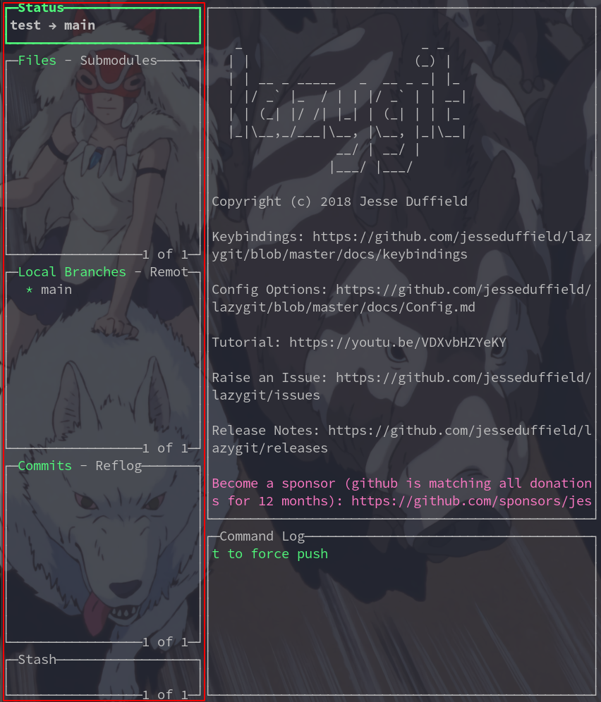
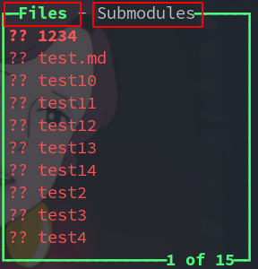
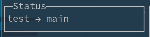
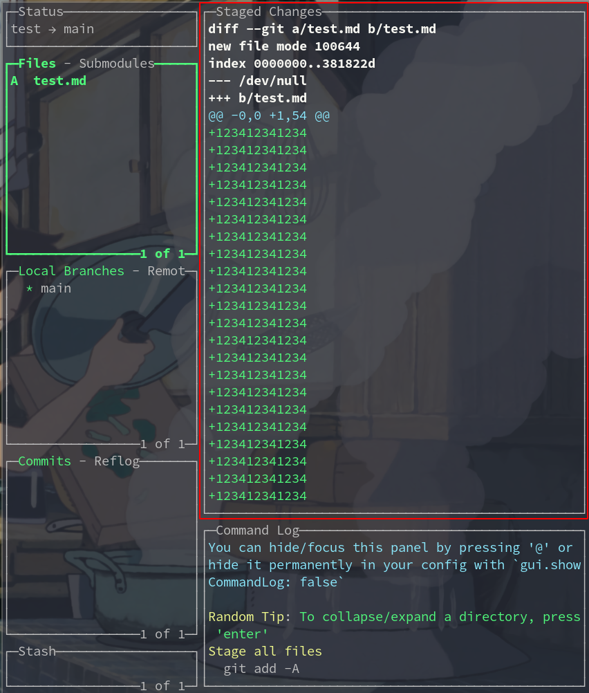

----------------------------------------------
> *Made By Herolh*
----------------------------------------------

# lazygit 基础使用指南 {#index}

[TOC]


--------------------------------------------

## 简介

> [安装和使用lazygit：一个简单的git命令终端UI工具](https://ywnz.com/linuxrj/4239.html)
> [官网 ReadMe](https://github.com/jesseduffield/lazygit/blob/master/README.md)
> [官网 按键映射](https://github.com/jesseduffield/lazygit/blob/v0.24.2/docs/keybindings/Keybindings_en.md)


## 快捷键

### 全局

|       按键        |        代表        | 说明     |
| :---------------: | :----------------: | -------- |
| PgUp/ `Ctrl + u`  | 主面板内容向上滚动 |          |
| pGdN / `Ctrl + d` | 主面板内容向下滚动 |          |
|         p         |        pull        | 拉取代码 |
|         P         |        push        | 推送代码 |
|         c         |     git commit     | 提交代码 |


### 移动

#### 面板切换

|        按键         | 说明               |
| :-----------------: | ------------------ |
| &larr;&rarr; 或 h l | 按顺序切换面板     |
|         1~5         | 跳到对应的面板     |
|  PgUp/ `Ctrl + u`   | 主面板内容向上滚动 |
|  pGdN / `Ctrl + d`  | 主面板内容向下滚动 |

#### 列表面板



| 按键 |         代表          | 说明 |
| :--: | :-------------------: | ---- |
|  1   |        Status         |      |
|  2   |   Files/Submodules    |      |
|  3   | Local Branches/Remote |      |
|  4   |     commit/Reflog     |      |
|  5   |         Stash         |      |


#### 列表面板标签



| 按键 |    代表    | 说明                                                         |
| :--: | :--------: | ------------------------------------------------------------ |
| `[`  | 上一个标签 | Files -> submodules                                          |
| `]`  | 下一个标签 | submodules -> Files                                          |
| `,`  |   上一页   | 列表框放不下会分页,  File 会翻到上一页文件                   |
| `.`  |   下一页   | 列表框放不下会分页,  File 会翻到下一页文件                   |
| `<`  | 滚动到顶部 | 第一页第一行                                                 |
| `>`  | 滚动到底部 | 最后一页最后一个                                             |
| `/`  |  开始搜索  | `n` 为下一个搜索结果<br />`N` 为上一个搜索结果<br />`esc` 退出搜索 |


### 面板

#### 状态面板

> lazygit 的状态面板



|  按键   |              代表               | 说明 |
| :-----: | :-----------------------------: | ---- |
|   `e`   |      编辑 lazygit 配置文件      |      |
|   `o`   |      打开 lazygit 配置文件      |      |
|   `u`   |        检查 lazygit 更新        |      |
| `enter` | 切换到 lazygit 最近打开过的仓库 |      |


#### 主面板



|       按键        |           代表           | 说明 |
| :---------------: | :----------------------: | ---- |
| PgUp/ `Ctrl + u`  |    主面板内容向上滚动    |      |
| pGdN / `Ctrl + d` |    主面板内容向下滚动    |      |
|         e         |         编辑文件         |      |
|         i         | 将该文件添加到 .gitigore |      |
|         s         |          Stash           |      |


#### 文件面板

##### Files 列表框

| 按键  |                  代表                   | 说明                           |
| :---: | :-------------------------------------: | ------------------------------ |
| space |     git add/ git rm —cached –force      | 切换传中文件暂存状态           |
| enter |         暂存选中文件 部分行或块         |                                |
|   a   |               git add -A                | 暂存或取消暂存所有文件         |
|   A   | git commit –amend –no-edit –allow-empty | 将修改内容提交进上次提交版本中 |
|   c   |               git commit                | 使用 lazygit 提交更改          |
|   C   |               git commit                | 使用 git 编辑器提交更改        |
|   d   |            git checkout file            | 放弃选中文件的更改             |
|   D   |              查看重置选项               |                                |
|   s   |                git stash                | 暂存                           |
|   S   |              查看暂存选项               |                                |
|   i   |            添加到 .gitignore            |                                |
|   r   |                刷新文件                 |                                |
|   e   |             bash -c vi file             | 编辑文件                       |
|   o   |                打开文件                 | 根据文件类型调用相应文件打开   |
|   f   |                git fetch                | 获取                           |
|   g   |            查看上游重置选项             |                                |

```shell
# 收到粘贴版类型的限制，并不是说有机器都能用
Ctrl + o ： 将文件名复制到剪贴板
```


#### 分支面板

##### Local Branches

| 按键 | 代表 | 说明 |
| :--: | :--: | ---- |
|      |      |      |


#### 提交面板

##### Commits

| 按键 |    代表    | 说明     |
| :--: | :--------: | -------- |
|  d   |            | 删除提交 |
|  s   | git rebase | 向下变基 |
|  S   | git rebase | 向上变基 |


## 结合其他应用

### 终端 zsh

```shell
# 法1: alias
alias lg='lazygit'

# 法2: 软链接
ln -s /usr/bin/lazygit /usr/bin/lg
```


### range

```shell
vim ~/.config/ranger/rc.conf

# 添加以下内容, 即可在 ranger 中通过 CTRL + g 的方式快速打开 lazygit
map <c-g> shell lazygit
```

