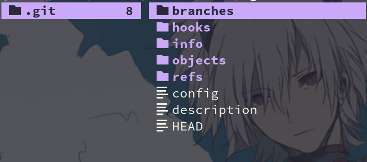
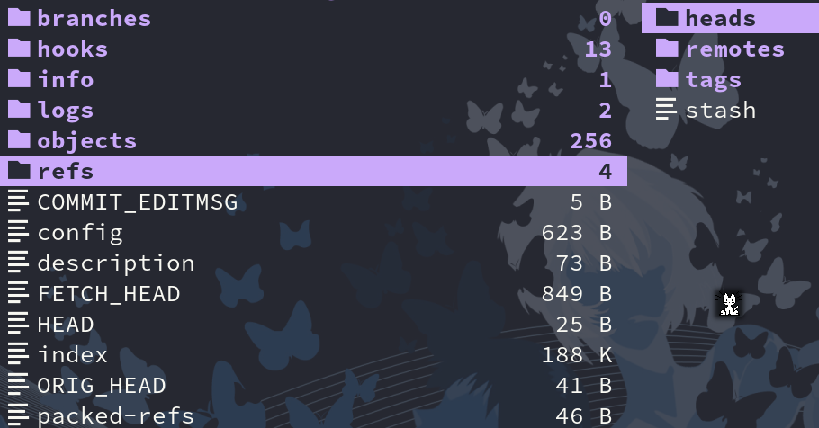
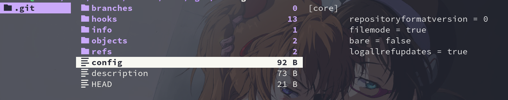
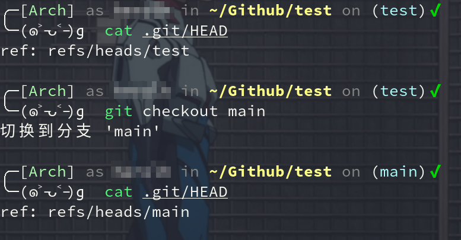
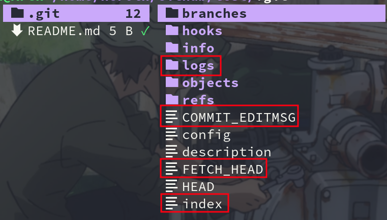
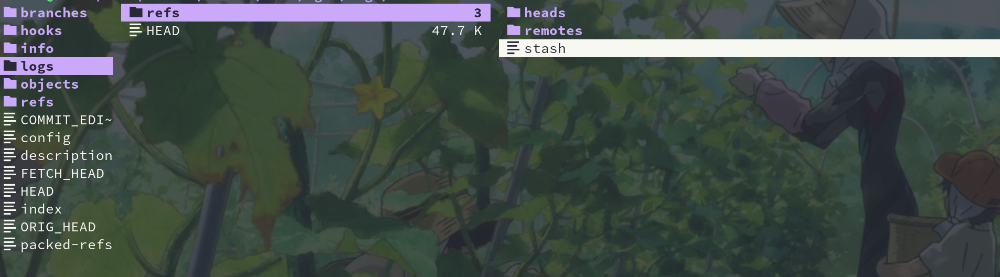
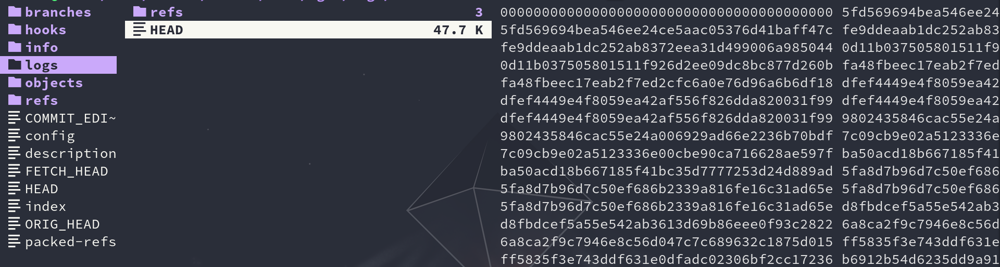
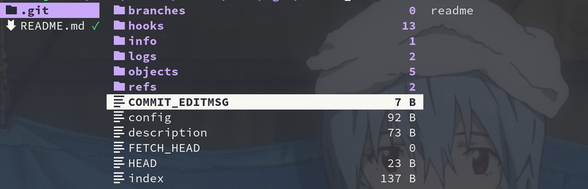

----------------------------------------------
> *Made By Herolh*
----------------------------------------------

# git 中级应用 {#index}

[TOC]


 


--------------------------------------------

# 文档版本

|    时间    | 修改人 | 内容                      |
| :--------: | :----: | :------------------------ |
| 2021-5-19  | Herolh | 文档创建                  |
| 2021-06-28 | Herolh | 补充 git 代码统计相关内容 |


# 简介


# 子树

> 参考资料：
>
> [git subtree教程](https://segmentfault.com/a/1190000012002151)
>
> [使用子模块和子树来管理 Git 项目](https://linux.cn/article-12244-1.html)


# 代码统计

> [segmentfault - Pines_Cheng - git代码统计](https://segmentfault.com/a/1190000008542123)


## 命令行

### 查看git上的个人代码量

```shell
# 记得修改 username 为想统计的 git 账户名
git log --author="username" --pretty=tformat: --numstat | awk '{ add += $1; subs += $2; loc += $1 - $2 } END { printf "added lines: %s, removed lines: %s, total lines: %s\n", add, subs, loc }' -

# --author   	指定作者
# --stat   		显示每次更新的文件修改统计信息，会列出具体文件列表
# --shortstat   统计每个commit 的文件修改行数，包括增加，删除，但不列出文件列表：
# --numstat   	统计每个commit 的文件修改行数，包括增加，删除，并列出文件列表：
```

结果示例：

```shell
added lines: 120745, removed lines: 71738, total lines: 49007
```


### 统计每个人增删行数

```shell
git log --format='%aN' | sort -u | while read name; do echo -en "$name\t"; git log --author="$name" --pretty=tformat: --numstat | awk '{ add += $1; subs += $2; loc += $1 - $2 } END { printf "added lines: %s, removed lines: %s, total lines: %s\n", add, subs, loc }' -; done
```

结果示例：

```shell
Max-laptop    added lines: 1192, removed lines: 748, total lines: 444
chengshuai    added lines: 120745, removed lines: 71738, total lines: 49007
cisen    added lines: 3248, removed lines: 1719, total lines: 1529
max-h    added lines: 1002, removed lines: 473, total lines: 529
max-l    added lines: 2440, removed lines: 617, total lines: 1823
mw    added lines: 148721, removed lines: 6709, total lines: 142012
spider    added lines: 2799, removed lines: 1053, total lines: 1746
thy    added lines: 34616, removed lines: 13368, total lines: 21248
wmao    added lines: 12, removed lines: 8, total lines: 4
xrl    added lines: 10292, removed lines: 6024, total lines: 4268
yunfei.huang    added lines: 427, removed lines: 10, total lines: 417
³Ÿö    added lines: 5, removed lines: 3, total lines: 2
```


### 查看仓库提交者排名前 5

```shell
git log --pretty='%aN' | sort | uniq -c | sort -k1 -n -r | head -n 5
```


### 贡献值统计

```shell
git log --pretty='%aN' | sort -u | wc -l
```


### 提交数统计

```shell
git log --oneline | wc -l
```


### 添加或修改的代码行数：

```shell
git log --stat|perl -ne 'END { print $c } $c += $1 if /(\d+) insertions/'
```


# .git 目录

## cat-file

在这之前我，我们要先知道一个命令，通过这个命令，我们可以具体的知道每个最终的内容是什么

```shell
git cat-file 命令 显示版本库对象的内容、类型及大小信息。
git cat-file -t b44dd71d62a5a8ed3 显示版本库对象的类型
git cat-file -s b44dd71d62a5a8ed3 显示版本库对象的大小
git cat-file -p b44dd71d62a5a8ed3 显示版本库对象的内容
```


## git 仓储初始化

```shell
go init
```




### hooks 文件夹

> 这个目录存放一些 shell 脚本。

Git 提供了一套脚本，可以在每个有意义的 Git 阶段自动运行。这些被称为钩子的脚本可以在提交 (commit)、变基 (rebase)、拉取 ( pull ) 操作的前后运行。脚本命预示着它的执行时机。如我们可以编写 pre-push 的作为钩子，进行推送代码前的检查。但是默认情况下它们都被禁用。如果要启用，需要删除文件.sample后缀。


### info 文件夹

> 存储库的其他信息将记录在此目录中。

**info/exclude :** 忽略指定模式的文件，和 .gitignore 类似，但是 .gitignore 是针对每个目录的。


### objects 文件夹

> 存放所有的 git 对象，哈希值一共40位，前 2 位作为文件夹名称，后 38 位作为对象文件名。

> Git 是一个内容寻址文件系统，Git 的核心部分是一个简单的键值对数据库（key-value data store）。 你可以向 Git 仓库中插入任意类型的内容，它会返回一个唯一的键，通过该键可以在任意时刻再次取回该内容。

简单理解就是：objects 目录是 Git 的数据库（键值对数据库，可以想象为 map[key] = value 的形式），根据 key 来存取内容，key 即为 SHA1计算后的值。该目录下存储有三种对象（最多）：数据对象（blob object）、树对象（tree object）、提交对象（commit object）。


#### info 和 pack 目录

> 当存储的文件很大时，git 会进行压缩，会存储到 info 和 pack 下；


#### 2个字符命令的目录

> 首先，这两个字母是计算的SHA1值（总共40个字符）的前两个字符，剩余的38个是该目录下的文件名。


### refs 文件夹

> 引用




#### heads 文件夹

> 包含所有的本地分支，每个分支都是文件,文件中存储了分支当前指向的commit


#### remotes 文件夹

> 远程仓库信息

其中 `\refs\remotes\origin\HEAD` 指向远程仓库当前分支。`\refs\remotes\origin\master` 远程分支当前指向的 commit。


### config 文件

> 保存当前仓库的配置信息。




### description 文件

> 仓库的描述信息。

用于在 GitWeb 中展示项目的描述信息。默认内容如下：

```shell
Unnamed repository; edit this file 'description' to name the repository.
```


### HEAD 文件

> 这就是我们常说的HEAD指针，它指向了当前分支。，即：记录当前活动分支，打开后如下：


切换分支后， 内容会进行改变：

```shell
git checkout main
cat .git/HEAD
```




## 第一次提交后




### logs 文件夹

保存所有更新的引用记录。


#### refs 文件夹




##### heads 文件夹

> heads 文件夹里面存储的是本地分支的对象，每个对象的文件名就是本地的一个分支名。

我们使用git branch查看本地所有分支时，查询出的分支就是heads文件夹下所有文件的名称，这些分支文件中存储的是对应分支下的操作记录。


##### remotes 文件夹

> 存储的是远程的所有分支对象，每个对象的文件名称就是远程的一个分支名称

这些分支文件中保存了远程仓库对应分支所有操作


#### HEAD 文件

> 保存的是所有的操作记录，包括切换分支，使用 `git reflog` 查询的结果就是从这个文件来的。




### index 文件

> 暂存区（stage），二进制文件。


### COMMIT_EDITMSG 文件

> 保存着最近一次的提交信息,Git系统不会用到这个文件，只是给用户一个参考。




