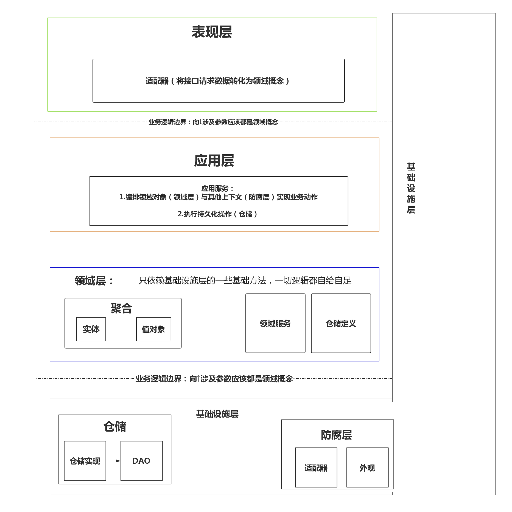
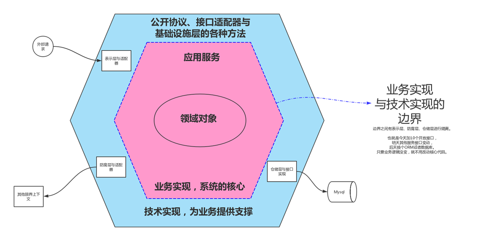
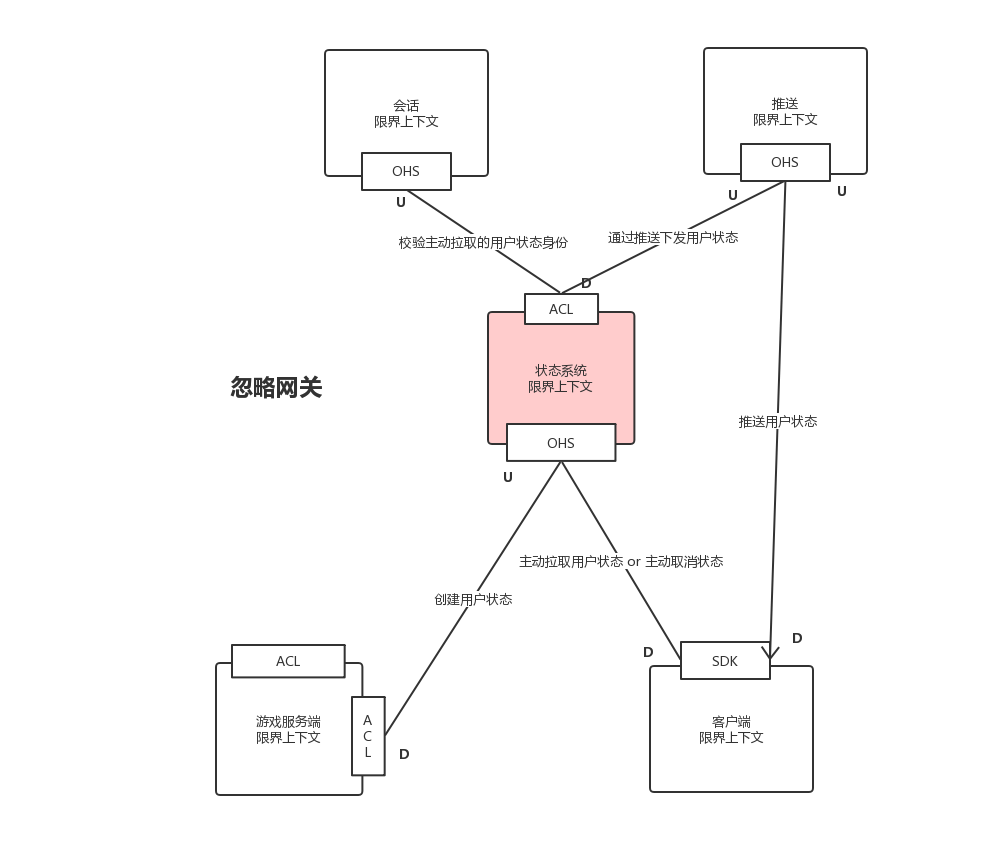

# Dianchu Domain Driven Design Demo

Demo地址：[https://gitlab.dianchu.cc/Taotie/ddddd](https://gitlab.dianchu.cc/Taotie/ddddd)<br />项目Demo：[https://gitlab.dianchu.cc/go_chaos/chaos_beacon](https://gitlab.dianchu.cc/go_chaos/chaos_beacon)

```
领域未分需求乱
缝缝补补大泥球
领域驱动破鸿蒙
开辟从兹程序稳
覆载需求仰至层
对接服务皆成善
预知造化会元功
须看D D D D D
```

欢迎来到DDD的超能世界.

本项目的是帮助你学习与了解DDD如何在Go中的实践。

DDD是一种思想,不是一个框架。所以该程序中定义的`部分`规则，不一定适用也不一定要在你的程序中严格遵守。


<a name="119f52ac"></a>
## 领域开辟需求出 层次划分模型生

```
感领域开辟
边界治理 需求定伦
程序之中遂分为四大层次
曰表现层
曰应用层
曰领域层
曰基础设施层
层中有一模型 唤为领域模型
```

在《探索领域驱动设计》中已经提到过，当我们划分出问题领域时就需要有限界上下文来解决它，而限界上下文都要满足**最小完备** **自我履行** **稳定空间** **独立进化**四个要素。一定程度上也表达了你的程序要做什么，不做什么，核心在哪，灵魂在哪。



目录结构:

```
├─presentation // 表现层
│  ├─doc //Moat生成
│  ├─proto /Moat生成
│  ├─sdk /Moat生成
│  │  └─v1gameserversdk /Moat生成
│  └─transition  
│      ├─common
│      ├─v1gameserver
│      └─v1userclient
├─application // 应用层
│  └─v1 //V1版本号的业务用例
├─domain // 领域层
│  ├─model // 领域模型
│  │  ├─aggregate // 聚合模型
│  │  ├─entity // 实体模型
│  │  ├─repo // 储存接口
│  │  └─value //值对象
│  │ 
│  ├─factory // 领域工厂
│  │  ├─aggfactory
│  │  ├─entityfactory
│  │  └─valuefactory
```

```
│  │ 
│  ├─aggregateimpl // 聚合实现
│  │  ├─group
│  │  └─role
│  │ 
│  ├─entityimpl // 实体实现
│  │  ├─groupimpl
│  │  ├─roleimpl
│  │  └─stateimpl
│  │ 
│  ├─event // 领域事件
│  │ 
│  └─service // 领域服务
│ 
├─infrastructure //基础设施层
│  ├─anticorruption // 防腐层
│  │  ├─acl
│  │  ├─push
│  │  └─session
│  ├─config
│  ├─repository // 仓储层
│  │  └─dao // 数据服务对象（数据访问层）
│  │      └─model  // 数据库模型
│  ├─syslog
│  └─utils
│
└─vendor
```

```
混沌初开 乾坤始奠 

气之轻清 上浮者为天 

气之重浊 下凝者为地
```


上古程序员告诉我们：“程序初开，需求与层次都规划好了。这时候 高并发 低延迟 多缓存等高大上的 技术实现 应该扔到天上，它们很重要 但是我们暂时不接触它。我们应该先脚踏实地的去完成 业务实现 ，否则在高大上的技术概念都是虚无缥缈的。”（手动狗头

所谓 业务实现 就是`应用层`、`领域层`

所谓 技术实现 就是`基础设施层`、`表现层`



所谓代表业务的领域模型就在`domain/model`中，它们是业务的基本元素，只是单纯的一个个interface接口。

	为什么定义interface接口的好处是什么，为什么不直接实现对应的对象出来?
	
	1.它们是业务的基本元素，只要这些模型在。通过看interface接口就可以大概了解程序的大体概念（有哪些实体、值对象、聚合，它们分别是做什么的）
	
	2.只要定义完接口就可以直接写应用层与领域层的逻辑流程，这个过程可以加深理解业务实现过程，同时去完善你的领域模型。等应用层与领域层的关于业务的逻辑流程写完了，就可以去实现模型中的接口。
	
	所以你可以很快的实现一个程序（限界上下文）的所有业务流程，最后在交流讨论，去修改你的模型。整个过程不会因为提前实现了这些对象而疲于修改大量逻辑，模型让你在程序的开始只关注业务流程！

我们再看领域模型中有什么：

```
├─aggregate // 聚合
│      group.go // 群组聚合
│      role.go // 角色与状态聚合
│
├─entity
│      group.go //群组实体
│      role.go //角色实体
│      state.go //状态实体
│
├─repo
│      groupRepo.go  //群组仓储
│      roleRepo.go //角色仓储
│
└─value // 值对象
        error.go 
        error_test.go
        group.go
        group_test.go
        role.go
        role_test.go
        state.go
        state_test.go
```

这里我们需要遵守的原则：

1.==仓储的最小操作对象是聚合==

2.所有实体都要被属于某个聚合（只有一个），如果没有说明它自己是一个聚合

3.<u>值对象的所有方法不可以有修改自身的逻辑</u>，它们的方法应该是无副作用的（不会修改任何对象）

4.==值对象方法return的结果不可以是指针==

5.==实体return的值对象也不可以是指针，一个值对象一旦被抛出，那么它应该与原来的对象完全没有关系==。它只是代表某一时刻的状态或值。

6.不管从哪个地方获得的值对象，该值对象在逻辑流程中不可以去修改它。除非这个值对象在对应的实体中，如在entity.Role中该实体可以去修改value.Role


## 悟彻模型真妙理 应用编排合用例

### 领域层的构建

到这里，假设我们已经为需求建立了一个初步模型，在`domain/model`中。那么现在开始编写我们的业务逻辑流程。

在回头看下领域层的结构:

```
├─domain // 领域层
│  ├─model // 领域模型
│  │  ├─aggregate // 聚合模型
│  │  ├─entity // 实体模型
│  │  ├─repo // 储存接口
│  │  └─value //值对象
│  │ 
│  ├─factory // 领域工厂
│  │  ├─aggfactory
│  │  ├─entityfactory
│  │  └─valuefactory
│  │ 
│  ├─aggregateimpl // 聚合实现
│  │  ├─group
│  │  └─role
│  │ 
│  ├─entityimpl // 实体实现
│  │  ├─groupimpl
│  │  ├─roleimpl
│  │  └─stateimpl
│  │ 
│  ├─event // 领域事件
│  │ 
│  └─service // 领域服务
```

<a name="3e250cdb"></a>
### Service 领域服务

领域服务具体是做什么的，我在《探索领域驱动设计》有讲过。

> **当某些领域逻辑或者概念**
> **不适合封装在一个具体的实体里时**
> **使用领域服务来完成它们**


现在我们举个栗子：用户聚合 需要同步群组聚合下的状态信息 到用户聚合中，即 用户聚合 从群组聚合获取 状态值对象 ，然后转为 状态实体 保存到用户聚合中。

此时有一个操作`用户聚合 从 群组聚合中获取状态值对象`这个操作在俩个聚合中都不适合做。

所有我们有了第一个领域服务：为用户创建群组状态

```
func CreateRoleGroupState(groupAggs []aggregate.IGroupAggregate, roleAggs []aggregate.IRoleAggregate) error {
	for _, groupAgg := range groupAggs {
		for _, roleAgg := range roleAggs {
			// 确认群组是否有用户对应的特征
			if !roleAgg.GetValueObject().CheckFeature(groupAgg.GetValueObject().Feature) {
				continue
			}
			// 如果有为该用户添加状态信息
			for _, stateInfo := range groupAgg.GetGroupStateInfo() {
				stateInfo.Source = value.GroupSource
				_ = roleAgg.AddState(stateInfo)
			}
		}
	}
	return nil
}
```


### Factory 工厂

工厂在《探索领域驱动设计》中并未讲过，首先并不是所有领域对象的创建都需要工厂。我使用工厂的最核心目的为：

### 隐藏复杂繁琐的领域对象创建过程

在工厂中我们可以提供一下快速方法来构建领域对象如：

创建一个空的聚合对象，并且自动构建好ID。

构建角色特征创建一个聚合对象。

等


### 隐藏涉及业务规则的领域对象创建过程

如 `domain\factory\aggfactory` 中的 `NewFeatureRoleAggregateRoot` 方法

某个接口需要获取一个聚合如果这个聚合对象不存在，则创建一个新的。如果这个操作在应用层做，那么代表业务规则已经被泄露出去了。所以我们把这一操作放到了领域层的工厂中，通过注入仓储的方式实现该操作。


### 应用层的编排

至此，我们已经初步构建出一个有趣的灵魂（领域层），我们了解了程序会做什么，能做什么。

那么现在我们通过应用层 对 领域对象的编排调用，让我们的程序做些什么（就是业务用例的实现，对领域对象的应用）。

看下应用层的目录结构：

```
application //应用层
├─global // 全局通用
│      event.go
│
└─v1  // 不同版本的业务用例集合 可以命名为:版本号方式 v1 v2 OR  不同渠道方式 wsy 、daqing，看个人喜好 
        event.go 
        gameServer.go 
        gameServer_test.go 
        userClient.go
```

在应用层要注意的原则：

1.应用层通过仓储或工厂方法获取聚合对象，再通过不同的聚合对象与领域服务、防腐层方法的编排实现一个业务用例。所以*应用层不可以有任何业务逻辑的代码，所有业务逻辑代码都应该在领域层中。


### Event 事件

实现事件是为了解耦。

如角色状态信息被主动拉取后需要 ：1.同步全部群组状态到指定角色2.推送指定角色的状态

虽然这个流程可以在指定的应用服务（应用服务就是应用层中的一个个业务用例方法）中按照顺序写出来，但是这样做的话每个应用服务要关注的点都太多了，而且这些操作都是异步的。

所有应用服务一个只关注自己要完成的特定操作就行，至于这个操作之后要执行的其他操作，应该由一个第三方来执行。

所以在`领域层`中实现了一个事件订阅与发布的对象，当一个应用服务完成了某个操作就发布一个事件，触发订阅该事件的其他应用服务执行它们的业务流程。


### 总结

我们在通过编写应用服务的过程中，同时也会不断的完善我的领域模型，最后在实现相关的实体、聚合。完成基本的业务需求逻辑，现在开始探索高大上的技术实现，来武装我们的程序。


## 双型万库皆可用  千言万服尽可接

### 仓储的概念

仓储的存在是为了隐藏持久化技术实现，我们要清楚一个概念**数据库模型≠领域模型**，所以不论持久化实现具体使用了NoSQL类型的MangoDB...还是SQL的Mysql...都不会限制或者改变业务的实现，我们看下目录结构：

```
├─repository // 仓储层（属于基础设施层概念，独立出来用于防止循环引用）
│  └─dao // 数据服务对象（数据访问层）
│      └─model // 数据库模型
│  └─xxxrepo.go
```

`dao`目录中实现了访问数据库的基本方法，基本就是[要塞Fort](https://gitlab.dianchu.cc/go_chaos/fort)或者其他ORM的调用方法。

`dao/model`中存放的是数据库模型，这个目录中New的方法负责转换领域模型为数据库模型。

`dao/xxxrepo.go`因为仓储的最小操作单位是聚合，使用xxxrepo.go一般使用聚合名称为开头。

仓储的创建应该有一个参数负责接收UoW(工作单元)对象，如果有传入UoW对象这代表该仓储的操作为一个事务。所有业务过程中的持久化操作，都会整合为一个事务，最后由UoW负责Commit要么全部成功，要么全部失败。


### 防腐层的应用

防腐层是为了隔离外部限界上下文对当前限界上下的影响，无论上游服务使用什么样的接口语言（协议）或者上游服务更换成另一个服务，都不会让领域模型代码变动。具体介绍在《探索领域驱动设计》有讲过。

该项目的限界上下文映射图



依旧看下目录结构:

```
anticorruption // 防腐层（属于基础设施层概念，独立出来用于防止循环引用）
├─acl
│      push.go
│      session.go
│
├─push
│      adapter.go
│      factory.go
│      sdk.go
│
└─session
        adapter.go
        factory.go
```

`acl`目录存放的是各个外部限界上下文调用接口的interface，实现这个interface是为了注入到应用层中。

在往下就是各个其他限界上下文防腐层实现：

`adapter.go`中存放的是`acl`目录中的接口实现，实现的接口逻辑大概是：接收领域对象->转换为请求参数->调用现有的SDK或者自己封装的方法请求外部服务->将响应转换为领域对象->返回领域对象

`factory.go`中的方法负责快速创建该限界上下文的防腐层接口实现对象。

<a name="c37145d0"></a>
## 三千六百协议法 七十二家接口技

```
我们通过防腐层与仓储层完成了技术实现隔离，实现了限界上下文的稳定空间。
在避免了`外部依赖`对`内部实现`的影响之外，我们也要保证`内部实现`不影响`对我们依赖的外部服务`,甚至说不被`对我们依赖的外部服务`影响。就是：
1.维持一套良好的对外公开接口，在版本上考虑了兼容与演化。避免频繁的修改接口，而影响对我们依赖的外部服务。
2.解除对外公开接口实现与业务实现的直接耦合，可以实现对不同的服务提供多套定制的接口协议（领域模型是不变的）。避免为了满足某个服务都某个接口的特殊要求，而影响到其他使用该接口的服务或者修改领域模型。
```

<a name="9447d195"></a>
### 表现层的实现

表现层的职责：

1.将外部请求参数转换为应用服务可以理解的领域对象（一个接口对应一个业务用例，一个业务用例对应一个应用服务）

2.根据外部请求参数，创建仓储对象与防腐层对象(比如根据不同的ServerID，创建不同数据库的仓储对象，因为它们的业务都是一致的，只是最终存储数据库不同而已)。使用依赖注入的方式，提供给应用服务

【表现层】调用单个应用服务  -> 【应用层】调用多个聚合与领域服务，编排业务 -> 【领域层】聚合调用多个实体、值对象完成特定职责的业务

该项目的表现层规则：

1.表现层只负责仓储对象的创建，UoW的Commit步骤应该在应用服务中完成。（应用服务应该体现出完整的持久化流程，UoW Commit成功才算这个业务用例真正成功，不适合在表现层完成这个步骤）

目前表现层有两种方式实现，手动遍写、用[Moat](https://gitlab.dianchu.cc/Taotie/moat)自动生成。

<a name="a4753e4c"></a>
### 手动编写的目录结构

来自其他项目：

```
├─presentation //表现层
│  │  type.go //通用的类型定义
│  │
│  ├─fortapi // 提供给要塞的API
│  │  │  grpc_service.go // grpc服务启动方法
│  │  │  http_service.go // http服务启动方法
│  │  │
│  │  └─protocol //协议实现
│  │          basic.go //协议解析的基本方法
│  │          codec.go //协议编解码规则
│  │          fort.pb.go //grpc
│  │          fort.proto //grpc
│  │          grpc.go //grpc路由方法实现
│  │          http.go //http路由方法实现
│  │          protoc-gen-go.bat // grpc
│  │
│  └─wsyapi // 提供给万岁爷的API
│      │  http_service.go // http服务启动方法
│      │
│      ├─protocol
│      │      basic.go // 协议解析的基本方法
│      │      http.go // http路由方法实现
│      │
│      └─router // 因为万岁爷的特殊接口，所有需要修改路由包的部分实现
│              .travis.yml
│              LICENSE
│              params_go17.go
│              params_legacy.go
│              path.go
│              README.md
│              router.go
│              tree.go
```

<a name="103dbdad"></a>
### 自动生成的目录结构

目前[要塞Fort](https://gitlab.dianchu.cc/go_chaos/fort)的目标是 让业务人员使用相同的方法来操作不同类型的数据库，实现快速接入仓储层。

那么[护城河Moat](https://gitlab.dianchu.cc/Taotie/moat)的目标就是 自动为你生成表现层完整代码、接口文档、SDK等。实现快速编写表现层，以及快速接入防腐层。

按照约定，如果使用护城河，用户应该自己实现一个“过渡层”：

```
├─presentation // 表现层
│  ├─doc //Moat生成
│  ├─proto /Moat生成
│  ├─sdk /Moat生成
│  │  └─v1gameserversdk /Moat生成
│  └─transition  // 过渡层
│      ├─common
│      ├─v1gameserver
│      └─v1userclient
```

过渡层如何编写的，具体请看护城河文档。

<a name="355b58c4"></a>
## 一二十块电子表  千百十万劳力士

正如开头所讲的那样，DDD是一种思想,不是一个框架。所以该项目中定义的`部分`规则，不一定适用也不一定要在你的程序中严格遵守。

- 领域驱动设计只有应用在大型项目上才能产生最大的收益，而这也确实需要高超的技巧。不是所有的项目都是大型项目，也不是所有的项目团队都能掌握这些技巧。
- 如果一个架构能够把那些与领域相关的代码隔离出来，得到一个内聚的领域设计，同时又使领域与系统其它部分保持松散耦合，那么这种架构也许可以支持领域驱动设计
- 将领域实现独立出来是领域驱动设计的前提

正如《领域驱动设计：软件核心复杂性应对之道》中所讲，领域驱动设计设计不是银弹。

对于一二十块电子表 ，或许你觉得DDD过度设计了

对于千百十万劳力士，或许你觉得文章中的部分规则可以改进或者根本就是错误的

**没关系，规则可以被打破，但是需要理由。**

