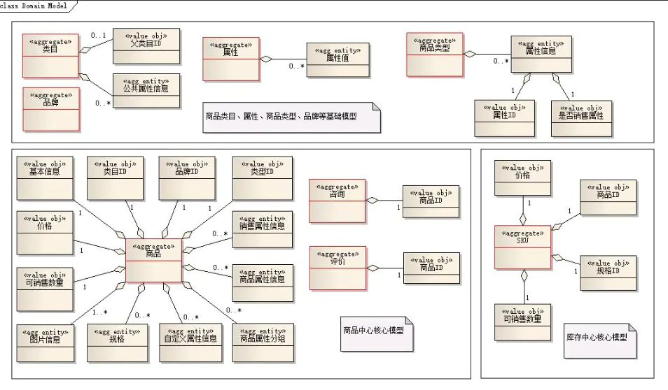
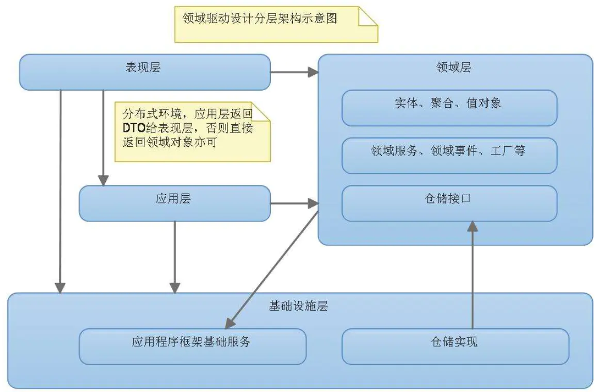
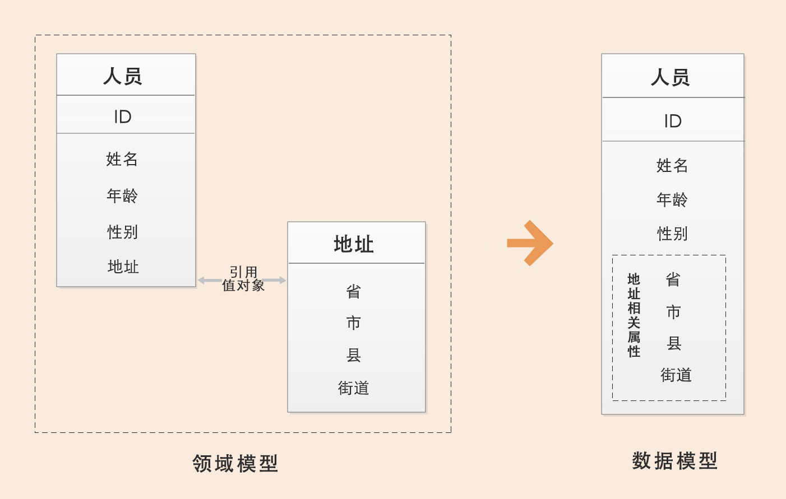
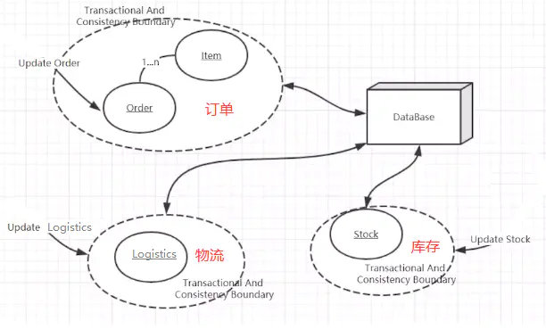

> *Made By {Author}*

----------------------------------------------

# DDD 理解 {#index}

[TOC]


--------------------------------------------

## D3模式设计初探

https://www.cnblogs.com/laozhang-is-phi/p/9806335.html#autoid-1-0-0

[领域驱动设计在互联网业务开发中的实践](https://tech.meituan.com/2017/12/22/ddd-in-practice.html)

[简书 - SAYLINING - 从壹开始微服务 [ DDD ] 之一 ║ D3模式设计初探 与 我的计划书](https://www.jianshu.com/p/0e743861cef6)


### DDD领域驱动设计知多少

> DDD 是一种开发理念，核心是维护一个反应领域概念的模型（领域模型是软件最核心的部分，反应了软件的业务本质），然后通过大量模式来指导模型设计与开发。DDD 的一般过程是：
> ```shell
> 首先通过软件需求规格说明书或原型生成一个领域模型（类、类的属性、类与类之间的关系）；
> 然后根据模式（应该如何分层？、领域逻辑写在哪？与持久化如何交互？如何协调多对象领域逻辑？如何实现逻辑与数据存储解耦等）指导来实现代码模型。
> ```
>
> DDD 中最核心的是 Domain Model（领域模型），和领域模型相对的是事务脚本。
> 领域模型和事务脚本说到底就是面向对象和面向过程的区别。

如果感觉上边的理解有点儿苦涩，这里举个栗子：

我认为任何一个系统都会属于某个特定的领域，比如论坛是一个领域，只要你想做一个论坛，那这个论坛的核心业务是确定的，比如都有用户发帖、回帖等核心基本功能。比如电商平台、普通电商系统，这种都属于网上电商领域，只要是这个领域的系统，那都有商品浏览、购物车、下单、减库存、付款交易等核心环节。所以，同一个领域的系统都具有相同的核心业务，因为他们要解决的问题的本质是类似的。

因此，我们可以推断出，一个领域本质上可以理解为就是一个问题域，只要是同一个领域，那问题域就相同。所以，只要我们确定了系统所属的领域，那这个系统的核心业务，即要解决的关键问题、问题的范围边界就基本确定了。关于电商系统大家肯定都很了解了，什么商品模块，用户模板，订单模板，等等等等，这个就是领域模型的一个体现，网上看到一个很好的文章，他对普通电商的订单中心进行建模，如图：




### 领域驱动设计整体架构

&emsp;&emsp;那从整体架构上来说，主要分成以下四个部分，具体的在下一讲的项目整体搭建中会详细说明：

- **Presentation Layer**：表现层，负责显示和接受输入；

- **Application Layer(Service)**：应用层，很薄的一层，只包含工作流控制逻辑，不包含业务逻辑；

- **Domain Layer(Domain)**：领域层，包含整个应用的所有业务逻辑；

- **Infrastructure Layer**：基础层，提供整个应用的基础服务；




#### DDD领域驱动设计的优点

- 从技术维度实现分层：能够在每层关注自己的事情，比如领域层关注业务逻辑的事情，仓储关注持久化数据的事情，应用服务层关注用例的事情，接口层关注暴露给前端的事情。

- 业务维度：通过将大系统划分层多个上下文，可以让不同团队和不同人只关注当前上下文的开发。

- 时间维度：通过敏捷式迭代快速验证，快速修正。


## 聚合：实体与值对象

> [简书 - SAYLINING - 从壹开始微服务 [ DDD ] 之五 ║聚合：实体与值对象 （上）](https://www.jianshu.com/p/b67c02616f31)

```shell
# 问题：
    大学的后台系统中，每个学生都有自己的家庭住址，肯定会有这样或那样的原因，会变化，那我们是如何设计 Student 模型 和 Address 模型的呢，这里只是说代码实现上，数据库其实是对应的。
```




### 实体 —— 唯一标识

&emsp;&emsp;实体对应的英语单词为Entity。提到实体，你可能立马就想到了代码中定义的实体类。在使用一些 ORM 框架时，比如 Entity Framework，实体作为直接反映数据库表结构的对象，就更尤为重要。但DDD中的实体和我们以往开发中定义的实体是同一个概念吗？
&emsp;&emsp;不完全是。在以往未实施DDD的项目中，我们习惯于将关注点放在数据上，而非领域上。这也就说明了为什么我们在软件开发过程中会首先做数据库的设计，进而根据数据库表结构设计相应的实体对象，这样的实体对象是数据模型转换的结果。
在DDD中，实体作为一个领域概念，在设计实体时，我们将从领域出发。


#### DDD 中的实体是什么

> &emsp;&emsp;许多对象不是由它们的属性来定义，而是通过一系列的连续性（continuity）和标识（identity）来从根本上定义的。只要一个对象在生命周期中能够保持连续性，并且独立于它的属性（即使这些属性对系统用户非常重要），那它就是一个实体。

&emsp;&emsp;对于实体 Entity，实体核心是用**唯一的标识符**来定义，而不是通过属性来定义。即即使属性完全相同也可能是两个不同的对象。同时实体本身有状态的，实体又演进的生命周期，实体本身会体现出相关的业务行为，业务行为会实体属性或状态造成影响和改变。
&emsp;&emsp;如果从值对象本身无状态，不可变，并且不分配具体的标识层面来看。那么值对象可以仅仅理解为实际的 Entity 对象的一个属性结合而已。该值对象附属在一个实际的实体对象上面。<u>值对象本身不存在一个独立的生命周期，也一般不会产生独立的行为</u>。


#### 为什么要使用实体

&emsp;&emsp;当我们需要考虑一个对象的个性特征，或者要区分不同对象的时候，我们就需要一个实体这个领域概念，一个实体是一个唯一的东西，并且可以长时间相当长的一段时间内持续的变化，但是无论我们做了多少变化，这个的实体对象可能也已经变化的很多了，但是因为他们都一个相同的身份标识，所有还是同一个实体。<u>很简单，就好像一个学生，无论手机号，姓名，年龄，邮箱，是否毕业等等，全部变化了，因为唯一标识的原因，我们就可以认为，变化前后的所有对象，都是同一个实体。</u>随着对象的改变，我们可能会一直跟踪变化过程，什么时候，什么人，发生了什么变化：就比如学生因为学习太好，学校研究通过，提前毕业，更新状态为已毕业等。这个时候我们发现了，实体的两大特性：

- **有唯一的标识，不受状态属性的影响。**
- **可变性特征，状态信息一直可以变化。**


#### 定义一个实体

在我们之前的代码中，我们定义了 Student 模型，我们是在当前模型中，添加了唯一标识：

```java
public class Student
{
    protected Student() { }
    public Student(Guid id, string name, string email, DateTime birthDate)
    {
        Id = id;
        Name = name;
        Email = email;
        BirthDate = birthDate;
    }

    public Guid Id { get; private set; }			//模型的唯一标识
    public string Name { get; private set; }
    public string Email { get; private set; }
    public string Phone { get; private set; }
    public DateTime BirthDate { get; private set; }
}
```

我们平时用到的标识都是 Int 类型，优点是占位少，内存小等，当然有时候受到长度的影响，我们就用 long


### 值对象 —— 不变性

&emsp;&emsp;前面介绍了 DDD 分层架构的实体，并完成了实体层超类型的开发（ 就是Entity ），本篇将介绍另一个重要的构造块——值对象，它是聚合中的主要成分。在我们之前的开发中，因为是基于数据库数据的，所以我们基本都是通过数据表来建立模型，这就是数据建模，然后依赖的是数据库范式设计，这样我们就把每一个数据库表就对应一个实体模型，每一个表字段就对应应该实体属性。再看我们文章开头的那个问题，我们就常常用第一种方法：

```java
public class Student : Entity
{ protected Student() { } public Student(Guid id, string name, string email, DateTime birthDate)
{
    Id = id;
    Name = name;
    Email = email;
    BirthDate = birthDate;
} //public Guid Id { get; private set; }
 /// <summary>
 /// 姓名 /// </summary>
 public string Name { get; private set; } /// <summary>
 /// 邮箱 /// </summary>
 public string Email { get; private set; } /// <summary>
 /// 手机 /// </summary>
 public string Phone { get; private set; } /// <summary>
 /// 生日 /// </summary>
 public DateTime BirthDate { get; private set; } /// <summary>
 /// 省份 /// </summary>
 public string Province { get; private set; } /// <summary>
 /// 城市 /// </summary>
 public string City { get; private set; } /// <summary>
 /// 区县 /// </summary>
 public string County { get; private set; } /// <summary>
 /// 街道 /// </summary>
 public string Street { get; private set; }

}
```

&emsp;&emsp;但是，为了考虑不该有的属性，比如家庭地址信息，不应该出现在学生 student 的业务模型中，我们就拆开，用两个实体进行表示，然后引入外键，就是我们第二种方法。

```java
    public class Student : Entity
    { //.....其他属性

        /// <summary>
        /// 地址外键 /// </summary>
        public Address Address { get; private set; }

    } /// <summary>
    /// 地址 /// </summary>
    public class Address ：Entity {/// <summary>
        /// 省份 /// </summary>
        public string Province { get; private set; } /// <summary>
        /// 城市 /// </summary>
        public string City { get; private set; }

    }
}
```

&emsp;&emsp;可以看到，对于这样的简单场景，一般有两个选择，要么把属性放到外部的实体中，只创建一张表，要么建立两个实体，并相应的创建两张表。第一种方法的缺点是，全部属性值放到一切，没有了整体业务概念，不仅无法表达业务语义，而且使用起来非常困难，同时将很多不必要的业务知识泄露到调用端。第二种方法的问题是导致了不必要的复杂性。

&emsp;&emsp;更好的方法很简单，就是把以上两种方法结合起来。我们通过把地址建模成值对象，而不是实体，然后把值对象的属性值嵌入外部员工实体的表中，这种映射方式被称为**嵌入值**模式。换句话说，你现在的数据库表采用上面的第一种方式定义，而你在c#代码中通过第二种方式使用，只是把实体改成值对象。这样做的好处是显而易见的，既将业务概念表达得清楚，而且数据库也没有变得复杂。


#### 值对象的概念

&emsp;&emsp;值对象虽然有时候和实体特别想象，看上边的学校家庭信息就可得知，但是它却有着自己独有的好处，值对象很常见：比如数字，字符串，日期时间，甚至一个人的信息，邮寄地址等等，当然还有更复杂的值对象，这些都是反映 通用语言 概念的值对象。
&emsp;&emsp;我们应该尽量使用值对象来建模，而不是实体对象，你可能很想不通，即使上边的学生的家庭地址信息，你一定要单放一个数据库表，构建实体模型，在设计的时候我们应该也要更偏向作为一个值对象容器，而不是子实体容器，因为这样我们可以对值对象很好的创建，测试，使用，优化和维护。
&emsp;&emsp;当你决定一个领域概念是否是一个值对象的时候，你需要考虑它是否有以下特性：

- 它描述了领域中的一个东西
- 可以作为一个不变量。
- 当它被改变时，可以用另一个值对象替换。
- 可以和别的值对象进行相等性比较。

&emsp;&emsp;在值对象中，我们不关心标识，只要我们能确定该值对象的属性值都一样，我们就可以说这两个值对象是相同的，比如我们说两个学生的家庭地址（省市县街道门排）是一样的，我们就可以认为是同一个地址，这就是相等性比较。如果学生在修改地址的时候，我们不是仅仅的修改省，或者市，或者县，而且将整个值对象给覆盖，这个就是值对象的不变性和可替换性。


### 实体与值对象的区别

1. 实体拥有标识，而值对象没有。
2. 相等性测试方式不同。实体根据标识判等，而值对象根据内部所有属性值判等。
3. 实体允许变化，值对象不允许变化。
4. 持久化的映射方式不同。实体采用单表继承、类表继承和具体表继承来映射类层次结构，而值对象使用嵌入值或序列化大对象方式映射。


## 聚合 与 聚合根

### 聚合的概念 —— 领域的核心

#### 聚合的概念

在 DDD 领域驱动设计第一次被提出的时候，聚合的概念就随之而来了，在之前的文章中，我们说到了领域和子领域的划分，也说了限界上下文的定义，这些都是和我们平时以数据模型为中心所不同的概念，可能理解起来不是很容易，但是至少我们有了这个影子，想象着一个大的领域项目，根据业务来拆分成了多个子领域与上下文，可能不同的上下文中甚至有相似的概念，举个栗子就是，订单上下文有商品，物流上下文有货物，库存上下文有存货等等等等，这时候你会发现，其实他们都是指的同一个东西，只不过在不同的上下文中被人为的赋予了不同的概念，有的是实体（库存），有的是值对象（订单），但是它们又不是一个概念，因为他们属于不同的子领域。

