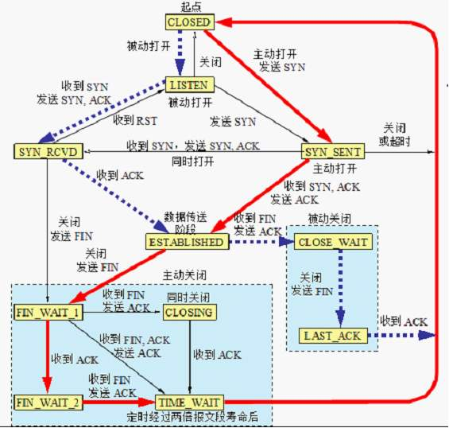
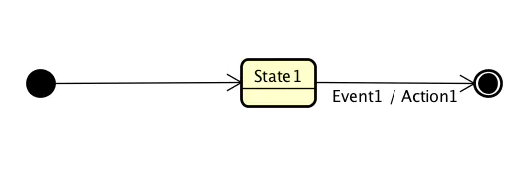
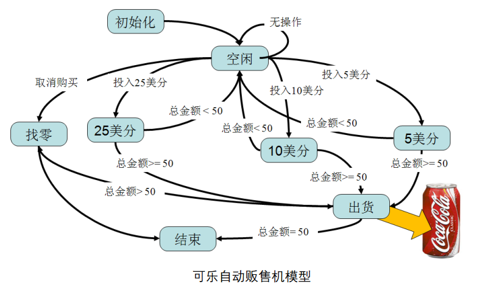
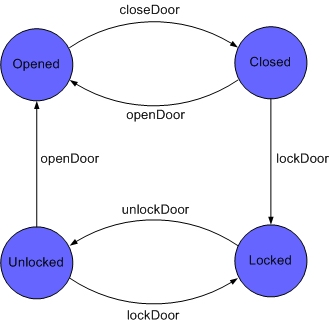
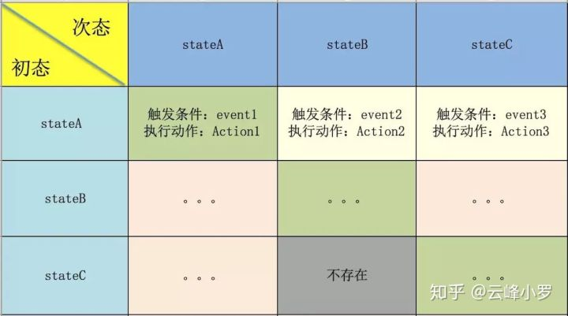
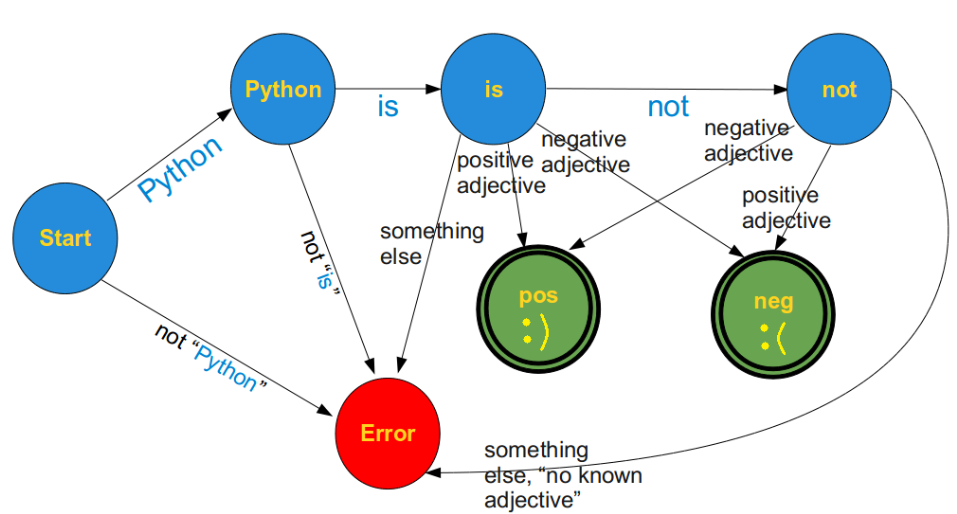
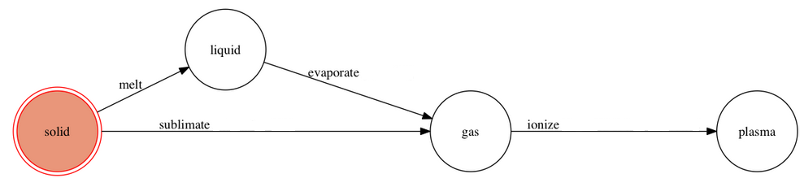

----------------------------------------------

> *Made By Herolh*

----------------------------------------------

# 目录 {#index}

[TOC]


--------------------------------------------

# 有限状态机

> 参考：
> [CSDN - xgbing - 状态机](https://blog.csdn.net/xgbing/article/details/2784127)
> [知乎 - 云峰小罗 - 深入浅出理解有限状态机](https://zhuanlan.zhihu.com/p/46347732)
> [简书 - iPolaris - 有限状态机实现-状态机介绍](https://www.jianshu.com/p/d48e0d565618)


## 什么是有限状态机？

&emsp;&emsp;有限状态机，( 英语：Finite-state machine, FSM )，又称有限状态自动机，因为一般的状态机的状态都是离散和可举的，即为有限，所以后面的介绍都不加有限二字，简称状态机，是表示有限个状态以及在这些状态之间的转移和动作等行为的数学模型。其作用主要是描述对象在它的生命周期内所经历的状态序列，以及如何响应来自外界的各种事件，比如下图非常有名的TCP协议状态机：



&emsp;&emsp;其实我们在编程时实现相关业务逻辑时经常需要处理各种事件和状态切换，写各种 `switch/case` 和 `if/else` ，所以我们其实可能一直都在跟有限状态机打交道，只是可能没有意识到。在处理一些业务逻辑比较复杂的需求时，可以先看看是否适合用一个有限状态机来描述，如果可以把业务模型抽象成一个有限状态机，那么代码就会逻辑特别清晰，结构特别规整。


## 状态机的要素
状态机可归纳为4个要素，即现态、条件、动作、次态。“现态”和“条件”是因，“动作”和“次态”是果。详解如下：
- **State**：状态。一个标准的状态机最少包含两个状态：初始和终态(吃态)。
  
    > 初态是状态机初始化后所处的状态，而终态顾名思义就是状态机结束时所处的状态。其他的状态都是一些流转中停留的状态。
> &emsp;&emsp;标准的状态机还会涉及到一些中间态，存在中间态的状态机流程就会比较复杂（用处也不是特别大，而且可以通过其他方式实现），所以在目标实现的状态机里不会引入这个概念。

- **Event**：事件。又称为“条件”，还有中描述叫 Trigger，表达的意思都一样，就是要执行某个操作的触发器或口令。

    > 当一个条件被满足，将会触发一个动作，或者执行一次状态的迁移。
    >
    > 当状态机处于某个状态时，只有外界告诉状态机要干什么事情的时候，状态机才会去执行具体的行为，来完成外界想要它完成的操作。比如出去吃饭，说“点菜”，服务员才会拿着小本过来记录你要吃的菜，说的那句“点菜”，就相当于 Event。

- **Action**：行为。状态变更索要执行的具体行为。

    > 还是拿上面点菜的例子，服务员拿小本记录你定的菜的过程就是 Action。

- **Transition**：变更，或动作。一个状态接收一个事件执行了某些行为到达了另外一个状态的过程就是一个 Transition。

    > 定义 Transition 就是在定义状态机的运转流程。
    >
    > 条件满足后执行的动作。动作执行完毕后，可以迁移到新的状态，也可以仍旧保持原状态。动作不是必需的，当条件满足后，也可以不执行任何动作，直接迁移到新状态。

&emsp;&emsp;下图就是一个最简单的状态机，一个初态，一个流转状态，一个终态，初态到流状态是不需要任何操作的，State1当发生了 Event1 事件时，执行 Action1 到达了终态。（我们最终实现的状态机，会把初态和终态都当做一个流状态来对待）。



一般可以用状态图来对一个状态机进行精确地描述。大家请看这个可乐机的状态图 ：



&emsp;&emsp;从图中就可以清楚地看到可乐机的运行过程，图中直观地表现了可乐机投入不同金额硬币时的情况以及几个处理步骤的各个状态和它们之间的转换关系，根据投入硬币的不同面值，对总金额进行计算，并对各种操作进行响应以完成一次购买。 状态机的动态结构使得其在通讯系统，数字协议处理系统，控制系统，用户界面等领域得到了广泛地应用。


## 有限状态机的实现
### `switch-case` 或 `if-else`
&emsp;&emsp;这无意是最直观的方式，使用一堆条件判断，会编程的人都可以做到，对简单小巧的状态机来说最合适，但是毫无疑问，这样的方式比较原始，对庞大的状态机难以维护。
&emsp;&emsp;游戏引擎是有限状态机最为成功的应用领域之一，由于设计良好的状态机能够被用来取代部分的人工智能算法，因此游戏中的每个角色或者器件都有可能内嵌一个状态机。考虑 RPG 游戏中城门这样一个简单的对象，它具有打开（Opened）、关闭（Closed）、上锁（Locked）、解锁（Unlocked）四种状态。当玩家到达一个处于状态 Locked 的门时，如果此时他已经找到了用来开门的钥匙，那么他就可以利用它将门的当前状态转变为 Unlocked，进一步还可以通过旋转门上的把手将其状态转变为 Opened，从而成功地进入城内。



&emsp;&emsp;当状态量少并且各个状态之间变化的逻辑比较简单时，使用 switch 语句实现的有限状态机的确能够很好地工作，但代码的可读性并不十分理想。在很长一段时期内，使用switch语句一直是实现有限状态机的唯一方法，甚至像编译器这样复杂的软件系统，大部分也都直接采用这种实现方式。但之后随着状态机应用的逐渐深入，构造出来的状态机越来越复杂，这种方法也开始面临各种严峻的考验，其中最令人头痛的是如果状态机中的状态非常多，或者状态之间的转换关系异常复杂，那么**简单地使用 switch 语句构造出来的状态机将难以扩展和维护**。

```java
switch (state)  {
  case (Opened): {					// 处理状态Opened的分支
    open();							// 执行动作Open
    if (closeDoor()) { 				// 检查是否有CloseDoor事件
      changeState(Closed)			// 当前状态转换为Closed
    }
    break;
  } 

  case (Closed): {					// 处理状态Closed的分支
    close();						// 执行动作Close
    if (openDoor()) {				// 检查是否有OpenDoor事件
      changeState(Opened);			// 当前状态转换为Opened
    }
    if (lockDoor()) {				// 检查是否有LockDoor事件
      changeState(Locked);			// 当前状态转换为Locked
    }
    break;
  }
 
  case (Locked): {					// 处理状态Locked的分支
    lock();							// 执行动作Lock
    if (unlockDoor()) {				// 检查是否有UnlockDoor事件
      changeState(Unlocked);		// 当前状态转换为Unlocked
    }
    break;
  }
 
  case (Unlocked): {				// 处理状态Unlocked的分支
    unlock();						// 执行动作Unlock
    if (lockDoor()) {				// 检查是否有LockDoor事件  
      changeState(Locked)			// 当前状态转换为Locked 
    }
    if (openDoor()) {				// 检查是否有OpenDoor事件   
      changeSate(Opened);			// 当前状态转换为Opened
    }
    break;
  } 
}
```


### 状态表

&emsp;&emsp;维护一个二维状态表，横坐标表示当前状态，纵坐标表示输入，表中一个元素存储下一个状态和对应的操作。这一招易于维护，但是运行时间和存储空间的代价较大。




### 宏定义

&emsp;&emsp;这里没有啥特殊的，主要是借助宏定义，比较巧妙的实现枚举值到字符串的转换，比如枚举值 stateA，能自动生成字符串@“stateA”,用于后面的状态函数名拼接。这是一个通用的枚举值自动转字符串的解决方案，参考的链接（ [http://stackoverflow.com/a/202511](https://link.zhihu.com/?target=http%3A//stackoverflow.com/a/202511)）


### 面向对象的设计模式

一个简单的例子：我们想识别一句只包含有限个词语的话表达的语气。句子以 "Python is" 开头，后面接着一个形容词或是加 not 限定的形容词。例如：

> "Python is great"   → positive meaning
> "Python is stupid"   → negative meaning
> "Python is not ugly" → positive meaning



```python
# 首先定义一个 StateMachine 类
class InitializationError(Exception):
    pass


class StateMachine:
    def __init__(self):
        self.handlers = {}  # 状态转移函数字典
        self.startState = None  # 初始状态
        self.endStates = []  # 最终状态集合

    def add_state(self, name, handler, end_state=0):
        """
        添加状态与状态转移函数的对应关系
        :param name:        状态名
        :param handler:     状态转移函数
        :param end_state:   是否为最终状态
        :return:
        """
        name = name.upper()  # 转换为大写
        self.handlers[name] = handler  # 添加状态与状态转移函数的对应关系
        if end_state:
            self.endStates.append(name)

    def set_start(self, name):
        self.startState = name.upper()

    def run(self, cargo):
        try:
            handler = self.handlers[self.startState]
        except:
            raise InitializationError("must call .set_start() before .run()")
        if not self.endStates:
            # 至少一个状态必须为 end_state
            raise InitializationError("at least one state must be an end_state")

        # 从Start状态开始进行处理
        while True:
            (newState, cargo) = handler(cargo)  # 经过状态转移函数变换到新状态
            if newState.upper() in self.endStates:  # 如果跳到终止状态,则打印状态并结束循环
                print("reached ", newState)
                break
            else:  # 否则将转移函数切换为新状态下的转移函数
                handler = self.handlers[newState.upper()]
```

然后自定义有限状态和状态转移函数，并在main函数中开始进行处理：

```python
from statemachine import StateMachine

# 有限状态集合
positive_adjectives = ["great", "super", "fun", "entertaining", "easy"]
negative_adjectives = ["boring", "difficult", "ugly", "bad"]


# 自定义状态转变函数
def start_transitions(txt: str, num: int = 1):
    """
    过指定分隔符对字符串进行切片,默认为空格分割,参数 num 指定分割次数
    将"Python is XXX"语句分割为"Python"和之后的"is XXX"
    :param txt:
    :param num:
    :return:
    """
    splitted_txt = txt.split(None, num)
    word, txt = splitted_txt if len(splitted_txt) > 1 else (txt, "")
    if word == "Python":
        newState = "Python_state"  # 如果第一个词是Python则可转换到"Python状态"
    else:
        newState = "error_state"  # 如果第一个词不是Python则进入终止状态
    return (newState, txt)  # 返回新状态和余下的语句txt


def python_state_transitions(txt: str, num: int = 1):
    """
    指定分隔符对字符串进行切片,默认为空格分割,参数 num 指定分割次数
    :param txt:
    :param num:
    :return:
    """
    splitted_txt = txt.split(None, num)
    word, txt = splitted_txt if len(splitted_txt) > 1 else (txt, "")
    if word == "is":
        newState = "is_state"
    else:
        newState = "error_state"
    return (newState, txt)


def is_state_transitions(txt: str, num: int = 1):
    """
    指定分隔符对字符串进行切片,默认为空格分割,参数 num 指定分割次数
    :param txt:
    :param num:
    :return:
    """
    splitted_txt = txt.split(None, 1)
    word, txt = splitted_txt if len(splitted_txt) > 1 else (txt, "")
    if word == "not":
        newState = "not_state"
    elif word in positive_adjectives:
        newState = "pos_state"
    elif word in negative_adjectives:
        newState = "neg_state"
    else:
        newState = "error_state"
    return (newState, txt)


def not_state_transitions(txt):
    splitted_txt = txt.split(None, 1)
    word, txt = splitted_txt if len(splitted_txt) > 1 else (txt, "")
    if word in positive_adjectives:
        newState = "neg_state"
    elif word in negative_adjectives:
        newState = "pos_state"
    else:
        newState = "error_state"
    return (newState, txt)


if __name__ == "__main__":
    m = StateMachine()
    # 添加初始状态
    m.add_state("Start", start_transitions)
    # 添加中间态
    m.add_state("Python_state", python_state_transitions)
    m.add_state("is_state", is_state_transitions)
    m.add_state("not_state", not_state_transitions)
    # 添加最终状态
    m.add_state("neg_state", None, end_state=1)
    m.add_state("pos_state", None, end_state=1)
    m.add_state("error_state", None, end_state=1)

    # 设置开始状态
    m.set_start("Start")
    m.run("Python is great")
    m.run("Python is not fun")
    m.run("Perl is ugly")
    m.run("Pythoniseasy")
```

运行结果如下：

> reached  pos_state
> reached  neg_state
> reached  error_state
> reached  error_state

可以看到，这种有限状态机的写法，逻辑清晰，表达力强，有利于封装事件。一个对象的状态越多、发生的事件越多，就越适合采用有限状态机的写法。


#### transitions开源库

&emsp;&emsp;[transitions](https://github.com/tyarkoni/transitions) 是一个由 Python 实现的轻量级的、面向对象的有限状态机框架。transitions 最基本的用法如下，先自定义一个类，然后定义一系列状态和状态转移（定义状态和状态转移有多种方式，下面只写了最简明的一种，具体要参考文档说明），最后初始化状态机。



```python
from transitions import Machine

# 定义一个自己的类
class Matter(object):
    pass
model = Matter()


# 状态定义
states=['solid', 'liquid', 'gas', 'plasma']


# 定义状态转移
# The trigger argument defines the name of the new triggering method
transitions = [
    {'trigger': 'melt', 'source': 'solid', 'dest': 'liquid' },
    {'trigger': 'evaporate', 'source': 'liquid', 'dest': 'gas'},
    {'trigger': 'sublimate', 'source': 'solid', 'dest': 'gas'},
    {'trigger': 'ionize', 'source': 'gas', 'dest': 'plasma'}]


# 初始化
machine = Machine(model=model, states=states, transitions=transitions, initial='solid')


# Test 
model.state    # solid

# 状体转变
model.melt()

model.state   # liquid
```


# 分层有限状态机

&emsp;&emsp;简单来说，就是FSM当状态太多的时候，不好维护，于是将状态分类，抽离出来，将同类型的状态做为一个状态机，然后再做一个大的状态机，来维护这些子状态机。


