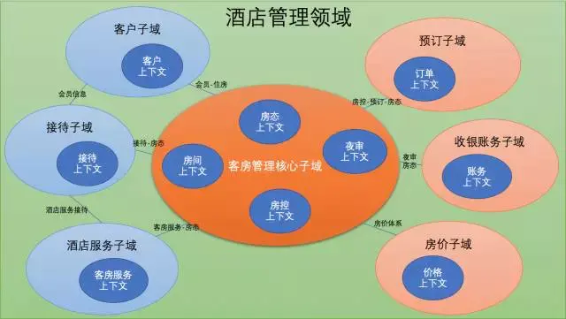
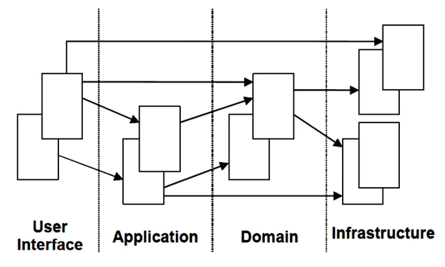
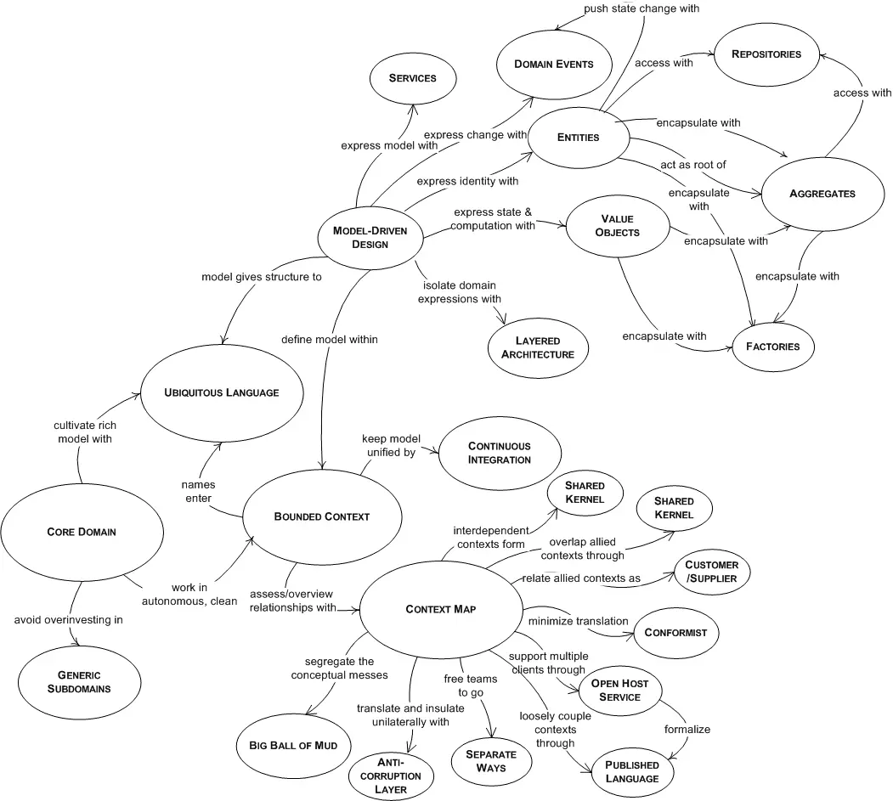

----------------------------------------------
> *Made By Herolh*
----------------------------------------------

# **业务领域建模** {#index}

[TOC]

--------------------------------------------

## 领域驱动设计的基础知识总结

### 什么是领域（Domain）

&emsp;&emsp;我们所做的软件系统的目的都是来解决一系列问题，例如做一个电商系统来在线销售自己企业的产品；做一个灰度发布平台来提升服务的质量和稳定性。任何一个系统都会属于某个特定的领域，例如：

- 论坛是一个领域

    > 要做一个论坛，那这个论坛的核心业务是确定的：比如用户发帖、回帖等核心基本功能；

- 电商系统是一个领域

    > 只要是电商领域的系统，那核心业务就是：商品浏览、购物车、下单、减库存、付款交易等核心环节；

&emsp;&emsp;**同一个领域的系统都具有相同的核心业务，因为他们要解决的问题的本质是类似的**。因此可以推断：一个领域本质上可以理解为一个==问题域== 。只要确定了系统所属的领域，那么这个系统的核心业务，即要解决的关键问题就基本确定了。通常我们说，要成为一个领域的专家，必须要在这个领域深入研究很多年才行，只有这样才会遇到非常多的该领域的问题，积累了丰富的经验。

### 界限上下文（Bounded Context）

&emsp;&emsp;通常来说，一个领域有且只有一个核心问题，我们称之为该领域的『核心子域』。在核心子域、通用子域、支撑子域梳理的同时，会定义出子域中的『限界上下文』及其关系，用它来==阐述子域之间的关系== 。界限上下文可以简单理解成一个子系统或组件模块。例如：下图是对酒店管理的子域和界限上下文的梳理：

### 领域模型（Domain Model）

领域驱动设计（Domain-Driven Design）分为两个阶段：

- 以一种领域专家、设计人员、开发人员都能理解的通用语言作为相互交流的工具，在交流的过程中发现领域概念，然后将这些概念设计成一个领域模型；
- 由领域模型驱动软件设计，用代码来实现该领域模型；

由此可见，==领域驱动设计的核心是建立正确的领域模型==。领域模型具有以下特点：

- **对具有某个边界的领域的一个抽象，反映了领域内==用户业务需求的本质== 。**

    > 它属于『解决问题空间』。领域模型是有边界的，只反应了我们在领域内所关注的部分，包括 **实体概念**（如：货物，书本，应聘记录，地址等），以及 **过程概念**（如：资金转账等）；

- **提高软件的可维护性，业务可理解性以及可重用性。**

    > 领域模型确保了我们的软件的业务逻辑都在一个模型中，帮助开发人员相对平滑地将领域知识转化为软件构造；

- **贯穿软件 分析、设计、开发 的整个过程。**

    > 领域专家、设计人员、开发人员面向同一个模型进行交流，彼此共享知识与信息，所以可以防止需求走样，让软件开发人员做出来的软件真正满足需求；要建立正确的领域模型并不简单，需要领域专家、设计、开发人员积极沟通共同努力，然后才能使大家对领域的认识不断深入，从而不断细化和完善领域模型；

- **为了让领域模型看的见，使用的常用表达领域模型的方式：图、代码或文字；**

- **重要性**

    > 领域模型是整个软件的核心，是软件中最有价值和最具竞争力的部分；设计足够精良且符合业务需求的领域模型能够更快速的响应需求变化；

### 领域通用语言

&emsp;&emsp;由软件专家和领域专家合作开发一个领域的模型是有必要的。开发过程中， 开发人员以类、算法、设计模式、架构等进行思考与交流。但领域专家对此一无所知，他们对技术上的术语没有太多概念，只了解特有的领域专业技能，例如：在空中交通监控样例中，领域专家知道飞机、路线、海拔、经度、纬度，他们有自己的术语来讨论这些事情。软件专家和领域专家交流过程中，需要做翻译才能让对方理解这些概念。
&emsp;&emsp;领域驱动设计的一个核心原则是使用一种基于模型的语言。使用模型作为语言的核心骨架，要求团队在进行所有的交流是都使用一致的语言，在代码中也是这样，这种语言被称为『**通用语言**』。

### 建模思考的问题：用户需求

&emsp;&emsp;『用户需求』不能等同于『用户』，捕捉『用户心中的模型』也不能等同于『以用户为核心设计领域模型』。设计领域模型时不能以用户为出发点去思考问题，不能老想着用户会对系统做什么；而应该从一个客观的角度，根据用户需求挖掘出领域内的相关事物，思考这些事物的本质关联及其变化规律作为出发点去思考问题。
&emsp;&emsp;==领域模型是排除了人之外的客观世界模型== ，包含了人所扮演的参与者角色。但是一般情况下不要让参与者角色在领域模型中占据主要位置，否则各个系统的领域模型将变得没有差别，因为软件系统就是一个人机交互的系统，都是以人为主的活动记录或跟踪。例如：

- 论坛中如果以人为主导，那么领域模型就是：人发帖，人回帖，人结贴，等等；
- 货物托运系统中如果以人为主导，就变成了：托运人托运货物，收货人收货物，付款人付款，等等；

以一个货物运输系统为例子简单说明一下。在用户需求相对明朗之后，这样描述领域模型：

- 一个Cargo（货物）涉及多个Customer（客户，如托运人、收货人、付款人），每个Customer承担不同的角色；
- Cargo的运送目标已指定，即Cargo有一个运送目标；
- 由一系列满足Specification（规格）的Carrier Movement（运输动作）来完成运输目标；

&emsp;&emsp;以上描述没有从用户的角度去描述领域模型，而是以领域内的相关事物为出发点，考虑这些事物的本质关联及其变化规律的：

- 以货物为中心，把客户看成是货物在某个场景中可能会涉及到的关联角色，如货物会涉及到托运人、收货人、付款人；
- 货物有一个确定的目标，货物会经过一系列的运输动作到达目的地。

&emsp;&emsp;以用户为中心来思考领域模型的思维只是停留在需求的表面，而没有挖掘出真正的需求的本质。领域建模时需要努力挖掘用户需求的本质，这样才能真正实现用户需求。

### 经典分层架构

- **用户界面/展示层**
    > 1）请求应用层获取用户所需的展示数据；
    >
    > 2）发送命令给应用层执行用户的命令

- **应用层**
  
> 薄薄的一层，定义软件要完成的任务。对外为展示层提供各种应用功能，对内调用领域层（领域对象或领域服务）完成各种业务逻辑。应用层不包含业务逻辑

- **领域层**
  
>  表达业务概念、业务状态信息及业务规则，是业务软件的核心

- **基础设施层**
  
    > 为其他层提供通用的技术能力，提供了层间通信；为领域层提供持久化机制。

### 使用的模式

#### 关联的设计

关联在领域建模的过程中非常重要，关联的设计可以遵循如下的一些原则：

- **关联尽量==少==**。

    > 对象之间复杂的关联容易形成对象的关系网，对于理解和维护单个对象很不利，同时也很难划分对象与对象之间的边界；另外，减少关联有助于简化对象之间的遍历；

- **关联尽量保持 ==单向== 的关联**；

- **在建立关联时，需要挖掘是否存在关联的==限制条件==。**

    > 如果存在，那么最好把限制条件加到关联上，往往这样的限制条件能将关联化繁为简，即将多对多简化为1对多，或将1对多简化为1对1；

#### 实体（Entity）

&emsp;&emsp;实体就是领域中需要 **唯一标识** 的领域概念。因为我们有时需要区分是哪个实体：有两个实体，如果唯一标识不一样，那么即便实体的其他所有属性都一样，也认为他们是两个不同的实体。

&emsp;&emsp;不应该给实体定义太多的属性或行为，而应该寻找关联，将属性或行为转移到其他关联的实体或值对象上。比如：Customer 实体，有一些地址信息，由于地址信息是一个完整的有业务含义的概念，所以我们可以定义一个 Address 对象，然后把 Customer 的地址相关的信息转移到 Address 对象上。如果没有 Address 对象，而把这些地址信息直接放在 Customer 对象上，然后对于一些其他的类似Address的信息也都直接放在Customer 上，会导致 Customer 对象很混乱，结构不清晰，最终导致它难以维护和理解。

#### 值对象（Value Object）

&emsp;&emsp;并不是每一个事物都必须有一个唯一标识。就以上面的地址对象 Address 为例，如果两个 Customer 的地址信息是一样的，我们就会认为这两个 Customer 的地址是同一个。用程序的方式来表达就是：如果两个对象所有属性的值都相同，我们会认为它们是同一个对象，那么就可以把这种对象设计为值对象。值对象的特征：

- 值对象 **没有唯一标识** ，这是它和实体的最大不同。

    > 值对象在判断是否是同一个对象时是通过它们的所有属性是否相同，如果相同则认为是同一个值对象。在区分是否是同一个实体时，只看实体的唯一标识是否相同，而不管实体的属性是否相同。

- 值对象是 **不可变** 的，即所有属性都是只读的，所以可以被安全的共享。

&emsp;&emsp;应该给值对象设计的尽量简单，不要让它引用很多其他的对象。值对象只是一个值，类似（int a = 3）中的『3』，只不过是用对象来表示。值对象虽然是只读的，是一个完整的不可分割的整体，但是可以被整个替换掉：类似（a = 4）把a的值由『3』替换为为『4』，当修改 Customer 的 Address 对象引用时，不是通过 `Customer.Address.Street` 这样的方式来修改属性，可以这样做：`Customer.Address = new Address(…)`

#### 领域服务

&emsp;&emsp;领域中的一些概念不太适合建模为对象（实体对象或值对象），因为它们本质上就是一些操作、动作，而不是事物。这些操作往往需要 **协调多个领域对象**。如果强行将这些操作职责分配给任何一个对象，则被分配的对象就是承担一些不该承担的职责，从而会导致对象的职责不明确很混乱。DDD认为领域服务模式是一个很自然的范式用来对应这种跨多个对象的操作。一般的领域对象都是有状态和行为的，而领域服务没有状态只有行为。
&emsp;&emsp;领域服务还有一个很重要的功能就是可以避免领域逻辑泄露到应用层。因为如果没有领域服务，那么应用层会直接调用领域对象完成本该是属于领域服务该做的操作，需要了解每个领域对象的业务功能，以及它可能会与哪些其他领域对象交互等一系列领域知识。这样一来，领域层可能会把一部分领域知识泄露到应用层。对于应用层来说，通过调用领域服务提供的简单易懂且意义明确的接口肯定也要比直接操纵领域对象容易的多。
&emsp;&emsp;说到领域服务，还需要提一下软件中一般有三种服务：应用层服务、领域服务、基础服务。从以下的例子中可以清晰的看出每种服务的职责：

##### 应用层服务

1. 获取输入（如一个XML请求）
2. 发送消息给领域层服务，要求其实现转帐的业务逻辑
3. 领域层服务处理成功，则调用基础层服务发送Email通知

##### 领域层服务

1. 获取源帐号和目标帐号，分别通知源帐号和目标帐号进行扣除金额和增加金额的操作
2. 提供返回结果给应用层

##### 基础层服务

1. 按照应用层的请求，发送Email通知

#### 聚合及聚合根（Aggregate, Aggregate Root）

&emsp;&emsp;聚合定义了一组具有 **内聚关系** 的相关对象的集合，以及对象之间清晰的所属关系和边界，避免了错综复杂的难以维护的对象关系网的形成。我们把聚合看作是一个修改数据的单元。

**聚合有以下特点：**

1. 每个聚合有一个根和一个边界：根是聚合内的某个实体；边界定义了一个聚合内部有哪些实体或值对象；
2. 聚合根是外部可以保持对聚合引用的唯一元素，负责与外部其他对象打交道并维护自己内部的业务规则。聚合内部的对象之间可以相互引用，但是聚合外部如果要访问聚合内部的对象时，必须通过聚合根开始导航，绝对不能绕过聚合根直接访问聚合内的对象；
3. 聚合内除根以外的其他实体的唯一标识都是本地标识，也就是只要在聚合内部保持唯一即可，因为它们总是从属于这个聚合的；
4. 聚合内部的对象可以保持对其他聚合根的引用；
5. 删除一个聚合根时必须同时删除该聚合内的所有相关对象，因为他们都同属于一个聚合，是一个完整的概念；
6. 基于聚合的以上概念，我们可以推论出从数据库查询时的单元也是以聚合为一个单元，不能直接查询聚合内部的某个非根的对象；

**如何识别聚合：**

&emsp;&emsp;可以从业务的角度分析哪些对象它们的关系是内聚的，可看成一个整体来考虑的，然后这些对象可以放在一个聚合内。关系内聚是指这些对象之间必须保持一个固定规则，固定规则是指在数据变化时必须保持不变的一致性规则。当修改一个聚合时，必须在 `事务级别` 确保整个聚合内的所有对象满足这个固定规则。聚合尽量不要太大，否则可能带来一定的性能问题。通常在大部分领域模型中，有70%的聚合通常只有一个实体，即聚合根，该实体内部没有包含其他实体，只包含一些值对象；另外30%的聚合中，基本上也只包含两到三个实体。

**如何识别聚合根：**

如果一个聚合只有一个实体，那么这个实体就是聚合根；如果有多个实体，那么我们可以思考聚合内哪个对象有独立存在的意义并且可以和外部直接进行交互。

#### 工厂（factory）

&emsp;&emsp;DDD 中的工厂也是一种体现 **封装思想** 的模式。DDD 中引入工厂模式的原因是：有时创建一个领域对象是一件比较复杂的事情，不仅仅是简单的new操作。工厂是用来封装创建一个复杂对象尤其是聚合时所需的知识，将创建对象的细节（如何实例化对象，然后做哪些初始化操作）隐藏起来。

&emsp;&emsp;客户传递给工厂一些简单的参数，如果参数符合业务规则，则工厂可以在内部创建出一个相应的领域对象返回给客户；但是如果参数无效，应该抛出异常，以确保不会创建出一个错误的对象。当然也并不总是需要通过工厂来创建对象，事实上大部分情况下领域对象的创建都不会太复杂，只需要简单的使用构造函数就可以了。隐藏创建对象的好处：可以不让领域层的业务逻辑泄露到应用层，同时也减轻了应用层的负担，它只需要简单的调用领域工厂创建出期望的对象即可。

#### 仓储（Repository）

&emsp;&emsp;仓储被设计出来的原因：领域模型中的对象自从创建后不会一直留在内存活动，当它不活动时会被持久化到DB中，当需要的时候会重建该对象。所以，重建对象是一个和DB打交道的过程，需要提供一种机制，提供类似集合的接口来帮助我们 **管理对象**。

&emsp;&emsp;仓储里存放的对象一定是聚合，因为之前提到的领域模型是以聚合的概念来划分边界的。我们 **只对聚合设计仓储** ，把整个聚合看成一个整体，要么一起取出来，要么一起被删除，不会单独对某个聚合内的子对象进行单独查询和更新。仓储还有一个重要的特征就是分为仓储定义部分和仓储实现部分，在领域模型中定义仓储的接口，而在基础设施层实现具体的仓储。

### 设计领域模型时一般步骤

1. 根据需求建立初步的领域模型，识别明显的领域概念和之间的关联（1:1, 1:n的关系），用文字精确没有歧义的描述出每个领域概念的含义；
2. 分析主要的软件功能，识别主要的应用层的类，这样有助于及早发现哪些是应用层的职责，哪些是领域层的职责；
3. 进一步分析领域模型，识别出实体、值对象、领域服务；
4. 分析关联，通过对业务的深入分析和软件设计原则及性能方面的权衡，明确关联的方向，去掉一些不需要的关联；
5. 找出聚合边界及聚合根，在分析过程中会出现难以清洗判断的选择问题，这就依赖平时分析经验的积累了；
6. 为聚合根配置仓储，一般情况下为一个聚合分配一个仓储，此时设计好仓储的接口即可；
7. 遍历所有场景，确定设计的领域模型能有效解决业务需求；
8. 考虑如何创建实体和值对象，是通过工厂还是构造函数；
9. 重构模型，寻找模型中有疑问或蹩脚的地方，比如思考：聚合的设计是否正确，模型的性能等等；

&emsp;&emsp;领域建模是一个不断重构，持续完善的过程，大家会在讨论中将变化的部分反映到模型中，从而模型不断细化并朝正确的方向走。

## 领域建模的思想和方法

**问题域：**现实世界中系统所要解决问题的领域为“问题域”。如“银行业务”属于“银行的问题域”。

**领域建模：**
我们设计一个系统，总是希望它能解决一些问题，这些问题总是会映射到现实问题和概念。
**对这些问题进行归纳、分析的过程就是领域建模**（这个域，指的就是问题域）。

**建立领域模型的好处：**

- 通过建立领域模型能够从现实的问题域中找到最有代表性的概念对象
- 并发现出其中的类和类之间的关系，因为所捕捉出的类是反馈问题域本质内容的信息。

经典的面向对象的分析或调研的步骤，是把一个相关的领域，分解为单个领域类或者对象（是一个我们能够理解的概念）。

领域模型是领域类或者是我们感兴趣的现实对象的可视化表示。

它们也被称之为：概念模型、领域对象模型、分析对象模型等。

在UML中，领域模型是不定义操作（方法）的一组类图来说明，它主要表达：

1，   领域对象或者领域类

2，   领域类之间的关联

3，   领域类的属性

属性用以表达对象的状态。

**三种领域类**

 

**1，边界对象：**参与者使用该对象与系统进行交流，也即边界对象代表系统的内部工作和它所处环境之间的交互。

边界对象将系统的其它部分和外部的相关事物隔离和保护起来。其主要的责任是：输入、输出和过滤。

**2，实体对象：**代表要保存到持续存储体中的信息。实体类通常用业务域中的术语命名。

通过它可以表达和管理系统中的信息。在模型中，系统中的关键概念以实体对象来表现。其主要的责任是：业务行为的主要承载体

**3，控制对象：**它协调其他类的工作，每个用例通常有一个控制类，控制用例中的时间顺序。

它可能是与其它对象协作以实现用例的行为，控制类也称管理类。其主要的责任：控制事件流，负责为实体类分配责任

有四个规则对应上面的三种分析类对象间的交互

1，用例的参与者只能与边界对象交互（这相当于结构化分析里面的自动化边界）

 

2，边界对象只能与控制对象和动作者交互（即不能直接访问实体对象）

3，实体对象只能与控制对象交互

4，控制对象可以和边界对象交互，也可以和实体交互，但是不能和动作者交互

三种领域类的UML的图示如下：

**
**

**领域类的识别**

**
**

我们的目标是在相关领域中创建有意义的领域类。比如说创建“处理销售”用例中的相关领域类。一般来说，用大量细粒度的领域类来充分描述领域模型，比粗略描述要好。

**识别领域类的一些指导原则：**

- 不要认为领域模型中领域类越少越好，情况往往恰恰相反。
- 在初始识别阶段往往会漏掉一些领域类，在后面考虑属性和关联的时候才会发现它，这是应该把它加上。
- 不要仅仅因为需求中没有要求保留一些领域类的信息，或者因为领域类没有属性，就排除掉这个领域类。
- 无属性的领域类，或者在问题域里面仅仅担当行为的角色，而非信息的角色的领域类，都可以是有效的领域类。

**1）识别领域类的策略**

两种识别领域类的技巧

- 使用领域类分类列表。
- 识别名词短语。

**2）使用领域类分类列表**

**
**

通过建立一个候选的领域类的列表，来开始建立模型。下面是一个从商店和航空订票领域中抽取出来的概念列表（注意，排列不考虑重要性）。

| **领域类分类**                                     |
| -------------------------------------------------- |
| 物理或具体对象                                     |
| 事物的设计、描述、或规范                           |
| 位置                                               |
| 交易                                               |
| 交易项目                                           |
| 人的角色                                           |
| 其它事物的容器                                     |
| 容器包含的元素                                     |
| 在该计算机之外的其它计算机或电子机械系统           |
| 抽象名词的概念                                     |
| 组织                                               |
| 过程（通常不表示一个概念，但可以被表示成一个概念） |
| 规则和政策                                         |
| 分类                                               |
| 有关工作、契约和法律事务的记录                     |
| 财务设施及服务                                     |
| 手册、文档、引用论文、书籍                         |

 

**3）****根据名词短语识别找出领域类**

**
**

曾经有人提出了用名词短语分析找出领域类的方法，然后把它们作为候选的领域类或者属性。使用这种方法必须十分小心，从名词机械的映射肯定是不行的，而且自然语言中的单词本来就是模棱两可的。

不过，这仍然是灵感的另一种来源，比如，我们来看一看原来写出来的“处理销售”的用例：

 

**基本流程：**1．顾客携带购买的商品到达POS机收费口2．收银员开始一次新的销售3．收银员输入商品标识4．…..重复 3 – 4 步，直到结束。5．…………….10．顾客携带商品和收据离开 

 

仔细研究其中的名词，可以看到很多有用的领域类（“记账”、“提成”），也可能有些是属性，请研究我们后面要讨论的关于区分属性的和类的讨论。

这种方法的缺点就是不精确，但对我们研究问题会非常有用。

推荐：**把领域类分类，和词语分析一起使用。**

