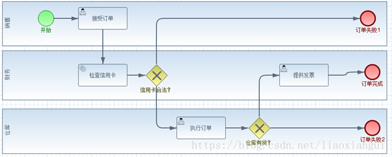

----------------------------------------------
> *Made By Herolh*
----------------------------------------------

# BPMN 基本使用 {#index}

[TOC]

 

--------------------------------------------

## 文档版本

|    时间    | 修改人 | 内容     |
| :--------: | :----: | :------- |
| 2021-05-08 | Herolh | 文档创建 |
|            |        |          |

## 参考文章

[BPMN2.0 十分钟就够了](https://blog.51cto.com/u_2702712/2350148)

[BPMN2.0协议解析](https://blog.csdn.net/liaoxiangui/article/details/80577721)

## 简介

&emsp;&emsp;**BPMN**（Business Process Modeling Notation，业务流程建模和标注）是一种流程建模的通用和标准语言，用来绘制业务流程图，以便更好地让各部门之间理解业务流程和相互关系，旨在促进业务流程的沟通和理解。BPMN 2.0 只要了解以下三个基本建模元素，就能掌握 BPMN2.0 的核心。

### 历史背景

&emsp;&emsp;BPMN 是由 OMG 组织维护的一个公开的标准，与任何特定商业组织或工具是没有关系，无需为此付费。BPMN 和传统的流程图的区别如下：

- BPMN是一个正式的规范，各种图标、元件是有准确的含义和使用规范；
- BPMN可以描述基于事件触发的行为，比如响应超时、外部系统无法提供服务等；

BPMN 标准发展版本历史如下。BPMN2.0 在 1.x 基础上新增了元模型、存储、交互、执行。

| 版本号 | 发布时间  |
| ------ | --------- |
| 1.0    | 2007年3月 |
| 1.1    | 2008年1月 |
| 1.2    | 2009年1月 |
| 2.0    | 2011年1月 |

BPMN1.x 被大多数的建模工具和 BPMS 厂商所支持。但是， BPMN1.x 只是一些建模符号，不支持元模型，不支持存储和交换，也不支持执行。那么围绕着 BPMN1.x 的存储、交换和执行，必然会产生新的竞争，这次的主角换成了 XPDL、BPEL 和 BPDM。

XPDL作为WfMC(工作流管理联盟)提出的流程定义语言规范，本身就是一个元模型，可以存储，并且具备执行语义。如今有超过80个的不同公司的产品使用XPDL来交换流程定义，同时也有一些厂商在自己提供的BPMN工具中使用了XPDL作为交换和存储格式。

为了抗衡XPDL，OASIS组织(包括几个大的平台公司，Microsoft、 BEA、 IBM、 SAP 、Sun、Oracle)开发了BPEL规范。但BPMN到BPEL的转换存在着先天上的缺陷，原因是BPMN是基于图的，而BPEL是基于块的。这个缺陷导致有些BPMN建模的流程无法映射到BPEL，两者的双向工程更是存在问题。这个缺陷成为人们反复诟病的对象。许多支持BPEL的产品为了解决这一问题，不得不在用户建模时做出种种限制，让用户绘制不出无法转换的模型。

而BPDM（业务流程定义元模型）则是OMG组织自己提出来解决BPMN存储和交换问题的规范。于2007年7月形成初稿，2008年7月被OMG最终采用。BPDM是一个标准的概念定义，用来表达业务流程模型。元模型定义了用来交换的概念，关系和场景，可以使得不同的建模工具所建模出来的流程模型进行交换。BPDM超越了BPMN和BPEL所定义的业务流程建模的要素，它定义了编排和编制。

三者的竞争关系似乎还将继续，但，BPMN2.0出现了。BPMN2.0相比BPMN1.x，最重要的变化在于其定义了流程的元模型和执行语义，即它自己解决了存储、交换和执行的问题，BPMN由单纯的业务建模重新回归了它的本源，即作为一个对业务人员友好的标准流程执行语言的图形化前端。BPMN2.0一出手，竞争就结束了，XPDL、BPEL和BPDM各自准备回家钓鱼。看起来胜利者似乎是BPMN，但看看BPMN2.0的领导者，就会发现最后的胜利者还是IBM，Oracle和SAP这些大厂商们，他们提交的草案明确要赋予BPMN2.0以执行语义，这迫使BPDM团队撤回了其提交，并将他们的提议与BPDM团队想法合并，这就是BPMN2.0最后内容的由来。

### 基本例子

#### 一个简单的订单流程

&emsp;&emsp;企业收到订单后，检查购买者的信用卡，执行订单，提供发票。如下图所示，圆形表示事件，第一个元件表示开始事件，最后一个元件表示结束事件，圆角矩形表示一个任务(task/activity)，带箭头的实现表示顺序流(sequenceFlow)

#### 异常和结束状态

&emsp;&emsp;上图只描述了正常的情况。信用卡过期，仓库无库存如何处理？所以业务流程图中应该新增其它异常分支。在BPMN中，使用菱形表示网关(gateway)，用来控制流程中的流向。注意图中包含了三个结束事件，每个结束事件表示不同的结束状态。

#### 泳道(swimlane)和执行者(performer)

&emsp;&emsp;泳道用来指明任务的执行者。如下图所示，销售人员接受订单，仓库执行执行订单，财务处理发票。注意不是所有的任务都会有执行者（更精确的说，只有user task才有执行者）。

#### 子流程

&emsp;&emsp;执行订单是一个子流程，子流程必须有开始事件和结束事件，子流程内部的元件禁止和外部的元件直连，只能作为一个整体与父流程的元件相连接。

## 基本概念介绍

### 事件( Event )

三种主要类型的事件：

- **开始**

    > 表示一个流程的开始。

- **中间**

    > 发生的开始和结束事件之间，影响处理的流程。

- **结束**

    > 表示该过程结束。

&emsp;&emsp;注意：如果您添加一个信封的图标给上述任何某个事件，那你将触发一个消息事件。即可以是由一个消息的到达而启动一个进程，也可以是在中间的某个位置与中间事件中发送一个消息（或捕获消息），或者可以在一个过程结束时发送的消息。

### 活动( Activity )

> 一个activity表示一份待完成的任务或工作，用圆角矩形表示。分为任务(task)和子流程(subprocess)。

&emsp;&emsp;活动是工作或任务的一个通用术语。
&emsp;&emsp;首先，一个活动可以是一个任务，或者它可以是一个当前流程的子处理流程； 
&emsp;&emsp;其次，你还可以指定不同类型的活动。例如，任务可以是需要人工完成的任务，也可以自动完成的任务，比如由脚本完成的任务，或服务任务（交由web服务器处理的指令）。

#### 任务

&emsp;&emsp;一个任务表示工作需要被外部实体完成，比如人工或自动服务。 任务的类型显示在矩形的左上角，用小图标区别。根据任务的类型，引擎会执行不同的功能。

##### 人工任务(User Task)

人工任务表示需要人来执行的任务，有一个输入和一个输出。

##### 服务任务(Service Task)

Service Task是一个自动活动，它会调用一些服务， 比如web service，java service等等，必须有一个输入和一个输出。

#### 子流程(subprocess)

子流程表示多个activity的组合。子流程内部的元件禁止和外部的元件直连，只能作为一个整体与父流程的元件相连接。如下图所示。

### 网关( Gateway )

网关用来处理决策，有两种常用网关需要了解：

#### 排他网关 (x) 

> 只有一条路径会被选择。

流程执行到该网关时，按照输出流的顺序逐个计算，当条件的计算结果为true时，继续执行当前网关的输出流；如果多条线路计算结果都是 true，则会执行第一个值为 true 的线路。如果所有网关计算结果没有true，则引擎会抛出异常。 排他网关需要和条件顺序流结合使用，default 属性指定默认顺序流，当所有的条件不满足时会执行默认顺序流。

#### 并行网关 (+)

> 所有路径会被同时选择。

拆分 —— 并行执行所有输出顺序流，为每一条顺序流创建一个并行执行线路。

合并 —— 所有从并行网关拆分并执行完成的线路均在此等候，直到所有的线路都执行完成才继续向下执行。

####  包容网关 (+) 

> 可以同时执行多条线路，也可以在网关上设置条件

  拆分 —— 计算每条线路上的表达式，当表达式计算结果为true时，创建一个并行线路并继续执行

  合并 —— 所有从并行网关拆分并执行完成的线路均在此等候，直到所有的线路都执行完成才继续向下执行。

#### 事件网关 (+) 

> 专门为中间捕获事件设置的，允许设置多个输出流指向多个不同的中间捕获事件。当流程执行到事件网关后，流程处于等待状态，需要等待抛出事件才能将等待状态转换为活动状态。

### **子流程和调用活动** 

子流程是嵌入在主流程中，可以被主流程或其他流程通过ID调用，即不用重复画出子流程的细节；

子流程的限制：
- 只能且仅能包含一个空启动事件
- 至少要有一个结束事件
- 子流程中顺序流不能直接设置输出流到子流程之外的活动上，如果需要可以通过边界事件代替。

### 描述性建模符号

泳道（Pool)：代表流程中的参与者，用来对活动进行组织和分类；

泳池 (Lane)：泳道里的一个子划分；

信息流（message flow）：虚线表示；

数据对象和仓库；

文本注释；

