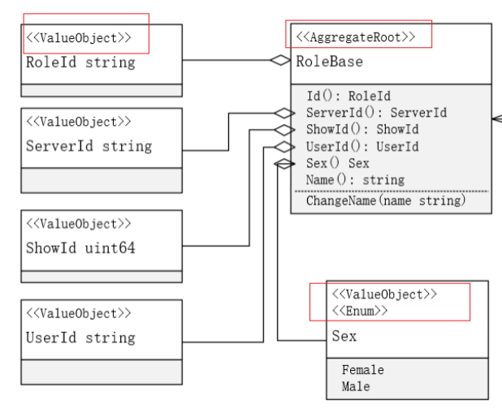
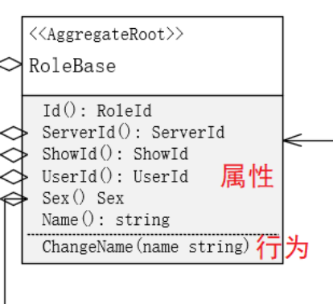
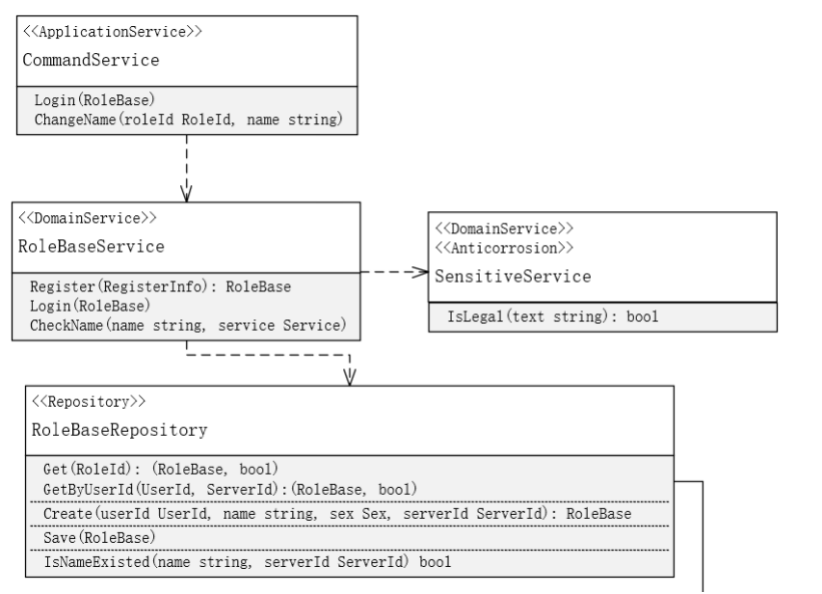
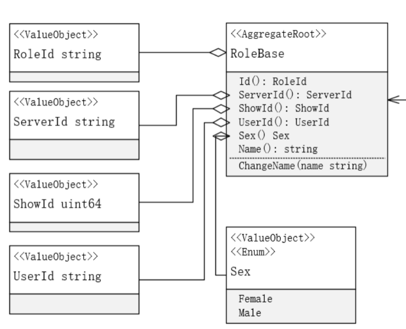
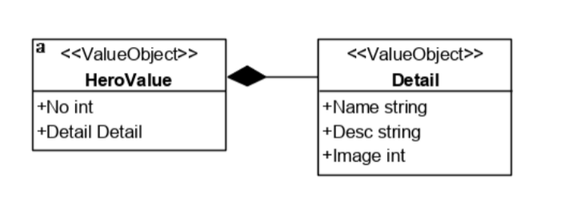
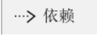
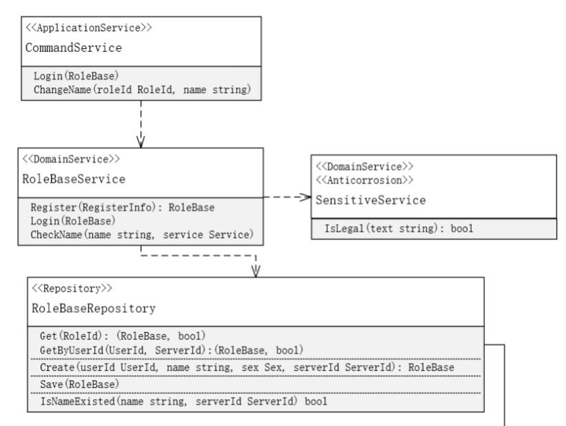
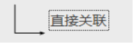
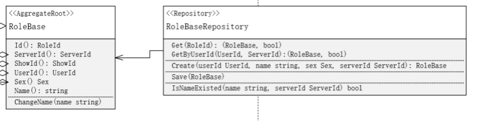
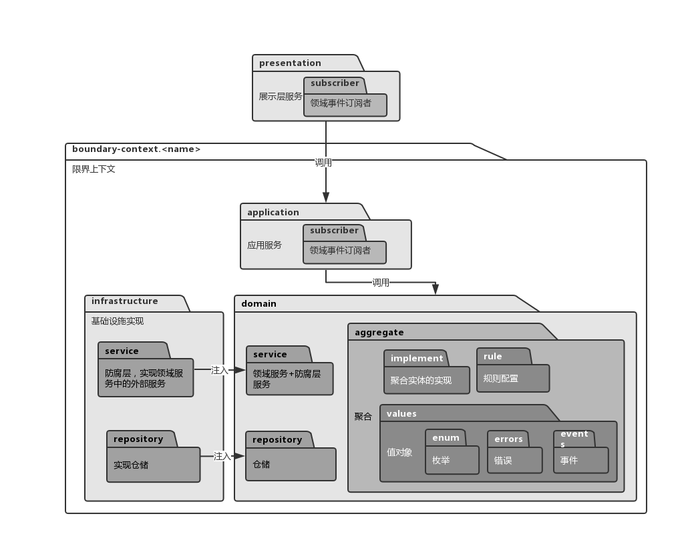

# 业务设计UML绘制指南

## 业务用例UML活动图

&emsp;&emsp;UML 活动图类似于流程图，拥有更加丰富的设计语言。绘制活动图的时候，不一定要完全参考 DDD 的对象来绘图，可以按照自己方便的方式描述流程。[参考资料](https://www.cnblogs.com/wolf-sun/p/3432135.html)

## 领域模型UML类图

### 模型元素

#### 1. 构造型

上图红框部分均为构造型。

每个模型上都应该有自己的构造型，一个模型可以有多个构造型，以下为限界上下文绘制的过程中可能会使用的构造型：

- AggregateRoot: 聚合根
- Entity: 实体
- ValueObject: 值对象
- Enum: 枚举
- Repository: 仓储
- DomainService：领域服务
- Anticorrosion：防腐层，与领域服务一起使用，表示该领域服务调用了外部服务
- ApplicationService：应用服务

以上构造型也基本上覆盖了限界上下文的建模范围，由于展示层灵活多变，因此不需要对展示层建模。

#### 2. 实体

如上图，实体在绘制的时候，需要区分属性和行为，在go代码中，实体本质上是个interface，所以属性是以方法的形式展示。但是在本UML图中，可以不用方法表示。字段前面的加号表示公有还是私有，由于本阶段绘制的是设计模型，因此字段均是公有的。 

#### 3. 值对象

值对象可以是枚举、单一类型或者是只有属性的类。

#### 4. 仓储/领域服务/应用服务

仓储和服务都只有行为。上图中的SensitiveService既是领域服务，又是防腐层，因为该服务调用了远程的敏感词微服务。   

### 模型关系

我们用连接线来表示模型间的关系，以下将列出可能用到的连接线，**连接时要注意连接箭头的方向**。

#### 1. 聚合

聚合符号用来关联聚合关系，通常我们用它来把值对象和实体“聚合”到聚合根上。箭头指向聚合根。 箭头上需要标明数量关联情况（一对一还是一对多） 

#### 2. 复合（组合）

复合表示个体与组合部分的关系，通常可以用来表示多个值对象之间的关系。箭头指向被组合者。 

#### 3. 依赖

通常用来表达服务、仓储之间的依赖关系，比如说领域服务依赖了仓储，应用服务也依赖了领域服务。箭头指向被依赖者。

 

#### 4. 关联

关联的关系比依赖更强，通常用来表示聚合根和仓储的关系、聚合根和领域服务的关系。

箭头指向被依赖的元素，如果互相关联，则不用箭头

  

## 限界上下文包结构

