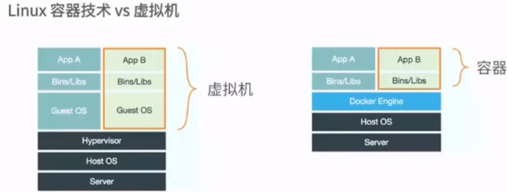

----------------------------------------------
> *Made By Herolh*
----------------------------------------------

# Docker 从小白到入门 {#index}

[TOC]

--------------------------------------------

## 一、Docker 介绍
### 1 什么是容器

### 2 容器的前世

> &emsp;&emsp;容器技术最早出现在 FreeBSD 上叫 jali(监狱)，将一个进程放入 jali 中运行，不管这个进程在其中发生怎样的错误都不会影响到系统上其他进程的运行
>
> &emsp;&emsp;
>
> FreeBASE jail    ---->    Linux Vserver

### 3 主机虚拟化与容器的区别

###　４容器的今生

Namespaces  命名空间

- PID( Process ID ) 进程隔离
- NET( Networtk ) 管理网络接口
- IPC( interProcess Communication ) 管理跨进程通信的访问
- MNT( Mount ) 管理挂载点
- UTS( Unix Timesharing System ) 隔离内核和版本标识

