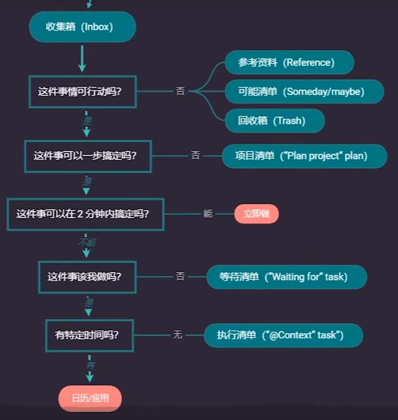

# 目标

# 收集箱(Inbox)

自己平常生活、工作或者作息时间等为基础，把所有我们需要的、需要处理的事情都列在收集箱中。

> 在某个时刻。我们不可能列举完所有需要做的事情，如果可以，说明你的大脑可以快速调取信息，也就不需要 GTD 了。我们只能暂时列出此时此刻能想到的内容。

# 执行清单(Context task)

- 你不可能完成所有的事情

    > 为什么不能完成所有的事情？

- 尽可能做离你目标更近的事情

    > 你的目标是什么，目标该如何确定？

先确定自己的目标，才能更好的为清单排序

不能根据难易程度进行排序，通常可能因为琐事太多，让我们迟迟做不了重要的事，也就离目标越远。

## 注意事项

- 能被你放进清单的，都是可以被一步搞定的事情。
- 做计划、做方案是每个人的必修课
    - 怎么做?
    - 为什么?
    - 怎么来的?
- 做好时间预估
- 为特别的事件预留时间

# 等待清单(“wait for” task)

等待清单 ! = 确认别人完成与否

而是==确保任务顺利进行==

# 项目清单(Plan project task)

不可能一步完成的，需要专门为他做计划，做方案。(设置子任务，依据情况将子任务再放进各个清单中)

# 可能清单(Someday/ maybe)

# 参考资料(Reference)

# 回收箱(Trash)