----------------------------------------------
> *Made By Herolh*
----------------------------------------------

# Docker 从小白到入门 {#index}

[TOC]


> [docker 入门 ](https://blog.csdn.net/xiaozecheng/article/details/106145593)

--------------------------------------------

## Docker 介绍

> &emsp;&emsp;Docker 是 [PaaS](https://baike.baidu.com/item/PaaS) 提供商 dotCloud 开源的一个基于 [LXC](https://baike.baidu.com/item/LXC) 的高级容器引擎，源代码托管在 Github 上，基于 go 语言并遵从 Apache2.0 协议开源。2013年开源。2014年4月9号， Docker 1.0 发布。


官网：https://www.docker.com/

文档地址：https://docs.docker.com/ 很详细！

仓库地址：https://hub.docker.com/


### 什么是容器


### 容器的前世

> &emsp;&emsp;容器技术最早出现在 FreeBSD 上叫 jali(监狱)，将一个进程放入 jali 中运行，不管这个进程在其中发生怎样的错误都不会影响到系统上其他进程的运行
>
> 
>
> FreeBASE jail    ---->    Linux Vserver


###　容器的今生

Namespaces  命名空间

- PID( Process ID ) 进程隔离
- NET( Networtk ) 管理网络接口
- IPC( interProcess Communication ) 管理跨进程通信的访问
- MNT( Mount ) 管理挂载点
- UTS( Unix Timesharing System ) 隔离内核和版本标识


### 主机虚拟化与容器的区别


**虚拟机技术缺点**：

资源占用十分多、冗余步骤多、启动很慢！

**容器化技术**

容器化技术不是模拟一个完整的操作系统


#### 比较Docker和虚拟机技术的不同：

- 传统虚拟机，虚拟出一条硬件，运行一个完整的操作系统，然后在这个系统上安装和运行软件
- 容器内的应用直接运行在宿主机的内容，容器是没有自己的内核的，也没有虚拟我们的硬件，所以就轻便了
- 每个容器间是互相隔离，每个容器内都有一个属于自己的文件系统，互不影响


#### 为什么 Docker 比 VM 快

- **docker 有着比虚拟机更少的抽象层。**

    >  &emsp;&emsp;由于 docker 不需要 Hypervisor 实现硬件资源虚拟化，运行在 docker 容器上的程序直接使用的都是实际物理机的硬件资源。因此在 CPU、内存利用率上 docker 将会在效率上有明显优势。

- **docker 利用的是宿主机的内核,而不需要 Guest OS。**

    > &emsp;&emsp;因此,当新建一个 容器时，docker 不需要和虚拟机一样重新加载一个操作系统内核。仍而避免引导、加载操作系统内核返个比较费时费资源的过程，当新建一个虚拟机时,虚拟机软件需要加载 GuestOS,返个新建过程是分钟级别的。而docker 由于直接利用宿主机的操作系统，则省略了这个复杂的过程，因此新建一个 docker 容器只需要**几秒钟**。


### Docker 的基本组成
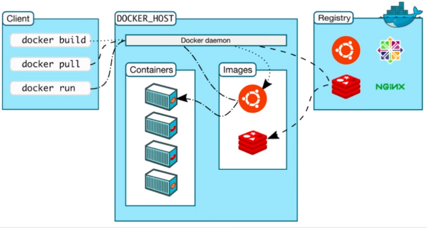

#### 镜像(image)

&emsp;&emsp;docker 镜像就好比是一个模板，可以通过这个模板来创建容器服务，`tomcat镜像 ==> run ==>容器（提供服务器）`，通过这个镜像可以创建多个容器（最终服务运行或者项目运行就是在容器中的）。

#### 容器(container)：

Docker利用容器技术，独立运行一个或者一组应用，通过镜像来创建的。
容器的基本操作：启动，停止，删除，基本命令。可以把这个容器理解为就是一个简易的 Linux系统。

#### 仓库(repository)：
仓库就是存放镜像的地方！仓库分为公有仓库和私有仓库。(很类似git)
Docker Hub是国外的。
阿里云…都有容器服务器(配置镜像加速!)


### hello world

```shell
$ docker run hello-world

# 本地找不到镜像
Unable to find image 'hello-world:latest' locally
latest: Pulling from library/hello-world
0e03bdcc26d7: Pulling fs layer						#分层下载： docker image 的核心 联合文件系统
latest: Pulling from library/hello-world
0e03bdcc26d7: Pull complete
Digest: sha256:1a523af650137b8accdaed439c17d684df61ee4d74feac151b5b337bd29e7eec		# 签名 防伪
Status: Downloaded newer image for hello-world:latest

Hello from Docker!
This message shows that your installation appears to be working correctly.

To generate this message, Docker took the following steps:
 1. The Docker client contacted the Docker daemon.
 2. The Docker daemon pulled the "hello-world" image from the Docker Hub.
    (amd64)
 3. The Docker daemon created a new container from that image which runs the
    executable that produces the output you are currently reading.
 4. The Docker daemon streamed that output to the Docker client, which sent it
    to your terminal.

To try something more ambitious, you can run an Ubuntu container with:
 $ docker run -it ubuntu bash

Share images, automate workflows, an
```

```shell
" 查看一下下载的镜像
$ docker images    

REPOSITORY            TAG                 IMAGE ID            CREATED             SIZE
hello-world           latest              bf756fb1ae65        4 months ago        13.3kB
```


### 简单的底层原理


## Docker 安装

> 帮助文档：https://docs.docker.com/engine/install/

单独文章介绍


### 修改Docker数据目录位置，包含镜像位置

[修改Docker数据目录位置，包含镜像位置](https://www.cnblogs.com/hellxz/p/docker-change-data-root.html)


#### 为啥要改？

Docker 安装后默认下载的位置在 `/var/lib/docker` ，如果 `/var` 分区没有独立分出来，Linux下默认是与 `/` 根分区在一起。一般我们装 Linux 系统的时候，除了做邮件服务器外，都不会把 /var分区独立分出来，而且 `/` 分区一般不会太大，比如我现在用的这台根分区30G的，在拉镜像的时候提示硬盘空间不足的问题，而其它分区还有很大空间。基于此情此景，我们都要把这个目录改一下。


#### 查看当前Docker目录位置

```shell
#展示当前docker的配置信息
docker info
-------------------------------------------------------------------
#在信息找到Docker Root Dir，对应的就是了，默认为：
Docker Root Dir: /var/lib/docker
```


#### 修改 `/etc/docker/daemon.json`

```shell
{
  "registry-mirrors": ["http://hub-mirror.c.163.com"],
  "data-root": "/home/hellxz/docker-home"
}
```

保存退出，重启 docker 服务

```shell
sudo systemctl restart docker
```


#### 验证

查看 `docker info`

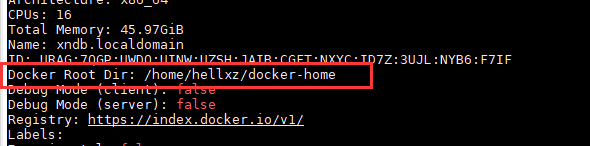


## Docker 的常用命令

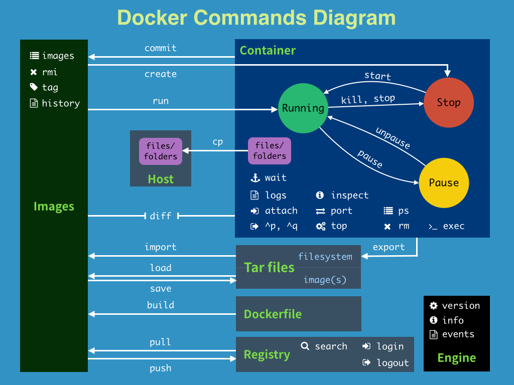


### 帮助命令

|        命令        |                     说明                     |
| :----------------: | :------------------------------------------: |
|   docker version   |            显示 docker 的版本信息            |
|    docker info     | 显示 docker 的系统信息，包括镜像和容器的数量 |
| docker 命令 --help |                   帮助命令                   |

[官方命令帮助文档](https://docs.docker.com/reference/)


### 镜像命令

|         命令         |                           说明                           |
| :------------------: | :------------------------------------------------------: |
|    docker images     | 查看所有本地主机上的镜像 可以使用 `docker image ls` 代替 |
| docker search 镜像名 |                         搜索镜像                         |
|     docker pull      |                         下载镜像                         |
|      docker rmi      |                         删除镜像                         |


#### docker images

> 查看所有本地主机上的镜像

```shell
" 参数可选项
-a, --all      # 列出所有的镜像
-q, --quiet    # 只显示镜像的id, 删除时候会用到

" 镜像的仓库源    镜像标签    镜像ID         镜像创建时间      镜像大小
" REPOSITORY    TAG       IMAGE ID       CREATED         SIZE
" hello-world   latest    bf756fb1ae65   13 months ago   13.3kB
```


#### docker search

> 搜索镜像

```shell
docker search mysql

" NAME  DESCRIPTION                                    STARS  OFFICIAL  AUTOMATED
" mysql MySQL is a widely used, open-source relation…  9911   [OK]

" 可选项
--filter , -f		Filter output based on conditions provided

"  只显示 stars 在 5000 以上的
docker search mysql -f=stars=5000
```


#### docker pull 

> 下载镜像 docker pull 镜像名[:tag]

```shell
" docker pull mysql
Using default tag: latest 			# 如果不写tag,默认就是latest
latest: Pulling from library/mysql 
bf5952930446: Pull complete 		# 分层下载，docker image的核心 联合文件系统
8254623a9871: Pull complete 
938e3e06dac4: Pull complete 
ea28ebf28884: Pull complete 
f3cef38785c2: Pull complete 
894f9792565a: Pull complete 
1d8a57523420: Pull complete 
6c676912929f: Pull complete 
ff39fdb566b4: Pull complete 
fff872988aba: Pull complete 
4d34e365ae68: Pull complete 
7886ee20621e: Pull complete 
Digest: sha256:c358e72e100ab493a0304bda35e6f239db2ec8c9bb836d8a427ac34307d074ed 								# 签名
Status: Downloaded newer image for mysql:latest
docker.io/library/mysql:latest 		   # 真实地址

# 两条命令等价
" docker pull mysql
docker.io/library/mysql:latest

# 指定版本下载
" docker pull mysql:5.7
5.7: Pulling from library/mysql
# 联合文件系统：
bf5952930446: Already exists 			# 上面已经下载过了，不会再进行下载了
8254623a9871: Already exists 
938e3e06dac4: Already exists 
ea28ebf28884: Already exists 
f3cef38785c2: Already exists 
894f9792565a: Already exists 
1d8a57523420: Already exists 
5f09bf1d31c1: Pull complete 
1b6ff254abe7: Pull complete 
74310a0bf42d: Pull complete 
d398726627fd: Pull complete 
Digest: sha256:da58f943b94721d46e87d5de208dc07302a8b13e638cd1d24285d222376d6d84
Status: Downloaded newer image for mysql:5.7
docker.io/library/mysql:5.7
```


#### docker rmi 

> 删除镜像

```shell
# docker rmi -f 容器id                # 删除指定的容器
docker rmi -f  容器id 容器id 容器id    # 删除多个容器, 空格隔开
docker rmi -f $(docker images -aq)   # 删除全部容器
```


### 容器命令

> 说明：我们有了镜像才可以创建容器

|         命令          |                       说明                       |
| :-------------------: | :----------------------------------------------: |
|   docker run 镜像id   |                  新建容器并启动                  |
|       docker ps       |                列出所有运行的容器                |
|   docker rm 容器id    |                     删除镜像                     |
|  docker start 容器id  |                     启动容器                     |
| docker restart 容器id |                     重启容器                     |
|  docker stop 容器id   |              停止当前正在运行的容器              |
|  docker kill 容器id   |                 强制停止当前容器                 |
|      docker exec      | 进入容器后开启一个新的终端，可以在里面操作(常用) |
|     docker attach     |     进入容器正在执行的终端，不会启动新的进程     |
|      docker logs      |                     查看日志                     |
|     docker stats      |            查看各容器的内存CPU等信息             |
|      docker top       |             查看容器中的进程信息 ps              |
|    docker inspect     |                  查看镜像源数据                  |
|       docker cp       |               从容器内拷贝到主机上               |


#### docker run

> 新建容器并启动

```shell
docker run [可选参数] image

" 参数说明
--name = "Name"    		# 容器名字  tomcat01，tomcat02,用来区分容器
-d                 		# 后台方式运行
-it                		# 使用交互方式运行，进入容器查看区分
-p                 		# 指定容器的端口 -p 8080：8080
    -p ip:主机端口：容器端口
    -p 主机端口：容器端口(常用)
    -p 容器端口
    容器端口
-P                 		# 随机指定端口
```

```shell
" 测试，启动并进入容器, /bin/bash 可忽略
docker run -it centos /bin/bash

" 查看容器内的centos，基础版本，很多命令都是不完善的！
ls 

# 从容器中退回主机
exit            			# 直接容器停止并退出
Ctrl + P + Q    			# 容器不停止退出
```


#### docker ps

> 列出所有运行的容器

```shell
docker ps 

" 参数说明
-a   		# 列出当前正在运行的容器+带出历史运行过的容器
-n=num 		# 显示最近创建的容器 num 个
-q   		# 只显示容器的编号
```


#### docker rm

> 删除指定容器

```shell
docker rm 容器id                  # 删除指定容器，不能删除正在运行的容器，如果要强制删除 rm -f
docker rm -f $(docker ps -aq)    # 删除所有的容器
docker ps -aq|xargs docker rm    # 删除所有的容器
```


#### docker logs

```shell
# 参数说明
-t				   # 动态显示
-f                 # 时间戳
--tail number      # 初始要显示的日志条数


docker logs -f -t --tail num 容器id 		# 查看最近的 10 条日志
" 没有日志

" 自己编写一段shell脚本一直打印日志
docker run -d centos /bin/sh -c "while true;do echo hello world!;sleep 1;done"


```


#### docker stats

> 查看各容器的内存CPU等信息

```shell
 docker status
```


#### docker top

> 查看容器中的进程信息 ps

```shell
docker top 容器id
```


#### docker inspect

> 查看镜像源数据

```shell
docker inspect 容器ID
```


#### docker cp

> 从容器内拷贝到主机上

```shell
docker cp [r] 容器id :容器内路径 目的地主机路径

" 参数r : 递归拷贝

docker cp 容器id:/home/test.md /home
```


#### 后台启动容器

```shell
docker run -d 镜像名

" 问题： docker ps, 发现 centos 停止了
" 常见的坑, docker容器使用后台运行，就必须要有一个前台进程，docker发现没有应用，就会自动停止
" nginx,容器启动后，发现自己没有提供服务，就会立刻停止，就是没有程序了
```


#### 启动和停止容器的操作

```shell
docker start 容器id 				# 启动容器
docker restart 容器id 			# 重启容器
docker stop 容器id 				# 停止当前正在运行的容器
docker kill 容器id 				# 强制停止当前容器
```


#### 进入当前正在运行的容器

##### docker exec

> 进入容器后开启一个新的终端，可以在里面操作(常用)

```shell
docker exec -it 容器id /bin/bash

# 测试
ps -ef

```


##### docker attach

> 进入容器正在执行的终端，不会启动新的进程

```shell
docker attach 容器id
```


#### 退出容器

```shell
# 从容器中退回主机
exit            				# 直接容器停止并退出
Ctrl + P + Q    				# 容器不停止退出
```


## 实际操作

### Docker 部署 Nginx

```shell
# 1. 搜索镜像 search 建议大家去docker搜索，可以看到帮助文档
# 2. 下载镜像 pull
# 3. 运行测试

docker run -d --name nginx01 -p 8080:80 nginx

curl localhost:8080
```


端口暴露的概念：

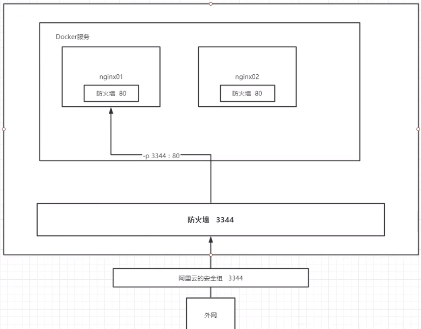

&emsp;&emsp;我们每次改动 nginx 配置文件，都需要进入容器内部，十分的麻烦。我们可以在容器外部提供一个映射路径，达到在容器外修改文件，容器内部都可以修改。


### 部署 ES + Kibana

```shell
# es 暴露的端口很多
# es 十分的耗内存
# es 的数据一般需要放置到安全目录！ 挂载
# --net somework ? 网络配置

# 启动 elasticsearch
docker run -d --name elasticsearch -p 9200:9300 -e "discovery.type=single-node" elasticsearch:7.6.2

# 启动了 linux就卡住了

# 赶紧关闭，增加内存的限制，修改配置文件 -e 环境配置修改
docker run -d --name elasticsearch02 -p 9200:9300 -e "discovery.type=single-node" -e ES_JAVA_OPTS="-Xms64m -Xmx512m" elasticsearch:7.6.2

# 查看 docker stats
```


## docker 可视化

### portainer

#### 什么是 portainer ?

Docker 图形化管理工具，提供一个后台面板供我们操作！

```shell
docker run -d -p 8088:9000 --restart=always -v /var/run/docker.sock:/var/run/docker.sock --privileged=true portainer/portainer
```

- 刚开始要创建初始管理员用户

    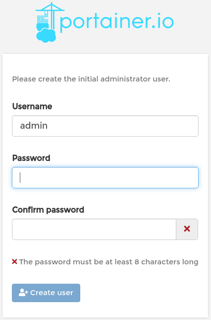

- 选择要管理的 docker 环境

    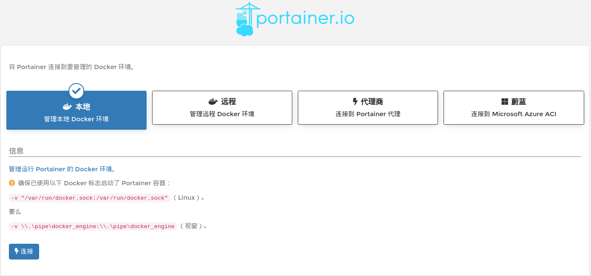

- 进入管理界面

    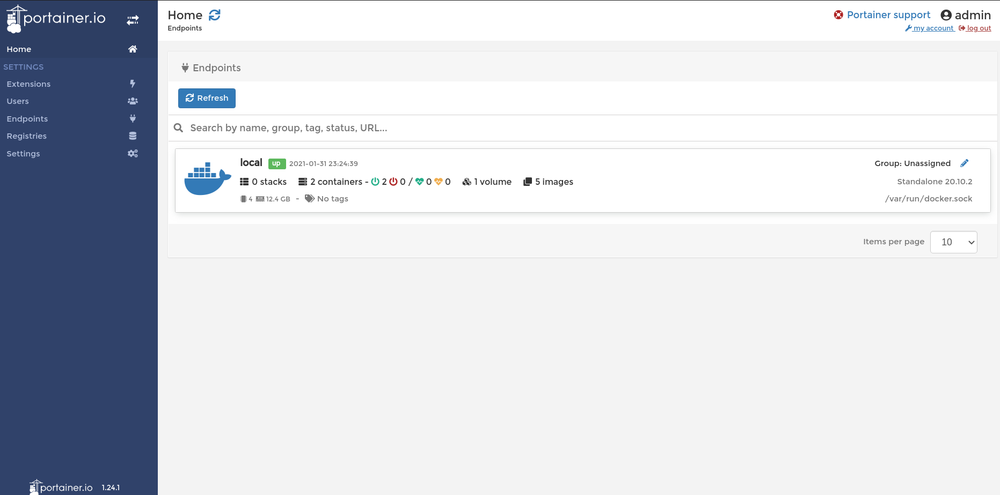


### Rancher


## Docker 简单底层原理

### docker run 流程图

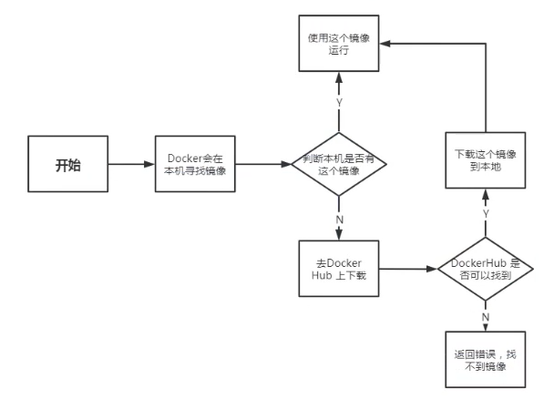


### Docker 是怎么工作的？

>  Docker 是一个 Client-Server 结构的系统，Docker 的守护进程运行在主机上。通过Socket从客户端访问！Docker-Server 接收到Docker-Client 的指令，就会执行这个命令！

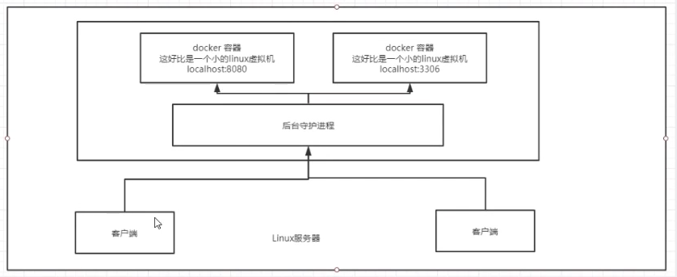


### Docker 镜像讲解
#### 镜像是什么？
&emsp;&emsp;镜像是一种轻量级、可执行的独立软件包，用来打包软件运行环境和基于运行环境开发的软件，他包含运行某个软件所需的所有内容，包括代码、运行时库、环境变量和配置文件。所有的应用，直接打包 docker 镜像，就可以直接跑起来！

**如何得到镜像：**
- 从远程仓库下载
- 拷贝
- 自己制作一个镜像 DockerFile


#### Docker 镜像加载原理

##### UnionFs （联合文件系统)

> UnionFs（联合文件系统）：Union 文件系统（UnionFs）是一种分层、轻量级并且高性能的文件系统，他支持对文件系统的修改作为一次提交来一层层的叠加，同时可以将不同目录挂载到同一个虚拟文件系统下（ unite several directories into a single virtual filesystem)。Union 文件系统是 Docker 镜像的基础。镜像可以通过分层来进行继承，基于基础镜像（没有父镜像），可以制作各种具体的应用镜像
> 特性：一次同时加载多个文件系统，但从外面看起来，只能看到一个文件系统，联合加载会把各层文件系统叠加起来，这样最终的文件系统会包含所有底层的文件和目录


docker 的镜像实际上由一层一层的文件系统组成，这种层级的文件系统 UnionFS。
boots (boot file system）主要包含 bootloader 和 Kernel, bootloader 主要是引导加 kernel, Linux 刚启动时会加载 bootfs 文件系统，在 Docker 镜像的最底层是 bootfs。这一层与我们典型的 Linux/Unix 系统是一样的，包含 boot 加载器和内核。当 boot 加载完成之后整个内核就都在内存中了，此时**内存的使用权**已由 bootfs 转交给内核，此时系统也会卸载 bootfs。
rootfs（root file system), 在 bootfs 之上。包含的就是典型 Linux 系统中的 /dev,/proc,/bin,/etc 等标准目录和文件。 rootfs 就是各种不同的操作系统发行版，比如 Ubuntu, Centos 等等。

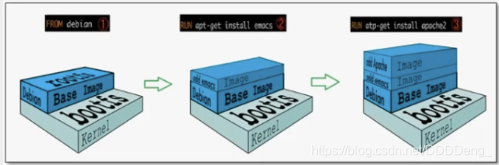

平时我们安装进虚拟机的 CentOS 都是好几个 G，为什么 Docker 这里才 200M？

对于一个精简的 OS,rootfs 可以很小，只需要包合最基本的命令，工具和程序库就可以了，因为底层直接用 Host 的 kernel，自己只需要提供 rootfs 就可以了。

**由此可见对于不同的 Linux 发行版， boots 基本是一致的， rootfs 会有差別，因此不同的发行版可以公用 bootfs.**

虚拟机是分钟级别，容器是秒级！


### 分层理解

所有的 Docker 镜像都起始于一个基础镜像层，当进行修改或培加新的内容时，就会在当前镜像层之上，创建新的镜像层。

举一个简单的例子，假如基于 Ubuntu Linux16.04 创建一个新的镜像，这就是新镜像的第一层；如果在该镜像中添加 Python 包，
就会在基础镜像层之上创建第二个镜像层；如果继续添加一个安全补丁，就会创健第三个镜像层该像当前已经包含 3 个镜像层，如下图所示（这只是一个用于演示的很简单的例子）。

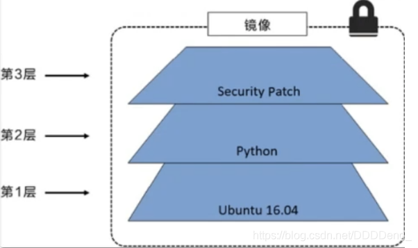

 在添加额外的镜像层的同时，镜像始终保持是当前所有镜像的组合，理解这一点非常重要。下图中举了一个简单的例子，每个镜像层包含 3 个文件，而镜像包含了来自两个镜像层的 6 个文件。

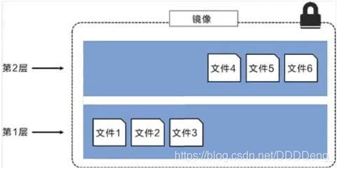

 上图中的镜像层跟之前图中的略有区別，主要目的是便于展示文件
下图中展示了一个稍微复杂的三层镜像，在外部看来整个镜像只有 6 个文件，这是因为最上层中的文件 7 是文件 5 的一个更新版

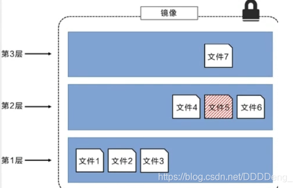

 这种情況下，上层镜像层中的文件覆盖了底层镜像层中的文件。这样就使得文件的更新版本作为一个新镜像层添加到镜像当中

Docker 通过存储引擎（新版本采用快照机制）的方式来实现镜像层堆栈，并保证多镜像层对外展示为统一的文件系统

Linux 上可用的存储引撃有 AUFS、 Overlay2、 Device Mapper、Btrfs 以及 ZFS。顾名思义，每种存储引擎都基于 Linux 中对应的件系统或者块设备技术，井且每种存储引擎都有其独有的性能特点。

Docker 在 Windows 上仅支持 windowsfilter 一种存储引擎，该引擎基于 NTFS 文件系统之上实现了分层和 CoW [1]。

下图展示了与系统显示相同的三层镜像。所有镜像层堆并合井，对外提供统一的视图

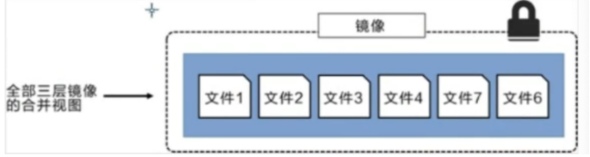

特点

**Docker 镜像都是只读的**，当容器启动时，一个新的可写层加载到镜像的顶部！

这一层就是我们通常说的容器层，容器之下的都叫镜像层！

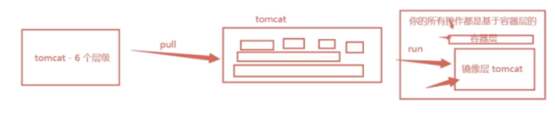