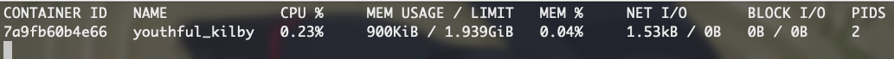
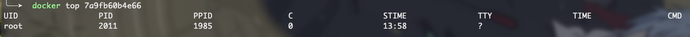
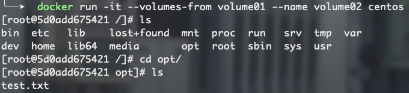

----------------------------------------------
> *Made By Herolh*
----------------------------------------------

# Docker 从小白到入门 {#index}

[TOC]


--------------------------------------------

## 教程材料

- [CSDN - docker 入门 - 狂神说Java](https://blog.csdn.net/xiaozecheng/article/details/106145593)
- [专为新手准备的 Docker 教程 - 英文版](https://docker-curriculum.com/)


## 前置内容

### 什么是容器


### 容器的前世

> &emsp;&emsp;容器技术最早出现在 FreeBSD 上叫 jali(监狱)，将一个进程放入 jali 中运行，不管这个进程在其中发生怎样的错误都不会影响到系统上其他进程的运行
>
> FreeBASE jail    ---->    Linux Vserver


###　容器的今生

Namespaces  命名空间

- PID( Process ID ) 进程隔离
- NET( Networtk ) 管理网络接口
- IPC( interProcess Communication ) 管理跨进程通信的访问
- MNT( Mount ) 管理挂载点
- UTS( Unix Timesharing System ) 隔离内核和版本标识


### 主机虚拟化与容器的区别


**虚拟机技术缺点**：

- 资源占用十分多
- 冗余步骤多
- 启动很慢

**容器化技术**

- 容器化技术不是模拟一个完整的操作系统


> 注：现 GuestOS 已全部适用


## Docker 介绍

> &emsp;&emsp;Docker 是 [PaaS](https://baike.baidu.com/item/PaaS) 提供商 dotCloud 开源的一个基于 [LXC](https://baike.baidu.com/item/LXC) 的高级容器引擎，源代码托管在 Github 上，基于 go 语言并遵从 Apache2.0 协议开源。2013年开源。2014年4月9号， Docker 1.0 发布。


- [官网首页](https://www.docker.com/)
- [官方文档地址](https://docs.docker.com/)： 很详细！
- [官方镜像仓库地址](https://hub.docker.com/)


### 为什么使用 Docker


#### Docker和虚拟机技术的不同：

- 传统虚拟机，虚拟出一条硬件，运行一个完整的操作系统，然后在这个系统上安装和运行软件。
- 容器内的应用直接运行在宿主机的内容，容器是没有自己的内核的，也没有虚拟我们的硬件，所以就轻便了。
- 每个容器间是互相隔离，每个容器内都有一个属于自己的文件系统，互不影响。


#### 为什么 Docker 比 VM 快：

- **docker 有着比虚拟机更少的抽象层。**

    >  &emsp;&emsp;由于 docker 不需要 Hypervisor 实现硬件资源虚拟化，运行在 docker 容器上的程序直接使用的都是实际物理机的硬件资源。因此在 CPU、内存利用率上 docker 将会在效率上有明显优势。

- **docker 利用的是宿主机的内核,而不需要 Guest OS。**

    > &emsp;&emsp;因此,当新建一个 容器时，docker 不需要和虚拟机一样重新加载一个操作系统内核。仍而避免引导、加载操作系统内核返个比较费时费资源的过程，当新建一个虚拟机时,虚拟机软件需要加载 GuestOS,返个新建过程是分钟级别的。而docker 由于直接利用宿主机的操作系统，则省略了这个复杂的过程，因此新建一个 docker 容器只需要**几秒钟**。


#### 在开发与运维效率上
- **应用更快速的交付和部署**

  > 避免出现开发环境和运维环境不一致的情况
  >
  > 传统：一堆帮助文档，安装程序, 可能会出像“我在我的电脑上可以运行， 在其他机器上报错”
  > Docker：打包镜像、发布测试、一键运行；开发打包部署上线，一套流程做完

- **更便捷的升级和扩缩容**

    > 使用了 Docker 之后，我们部署应用就和搭积木一样！（SpringBoot 1.5 Redis 5 tomcat8）打包成一个镜像，扩展 服务器 A！服务器 B

- **更简单的系统运维**

    > 在容器化之后，我们的开发，测试环境都是高度一致的。

- **更高效的计算资源利用**

    >  Docker 是 内核级别的虚拟化，可以在一个物理机上可以运行很多的容器实例！服务器的性能可以被压榨到极致！


### Docker 的历史

- **2010 年**

    > 几个搞 IT 的年轻人在美国成立了一家公司 dotCloud， 做一些 pass 的云计算服务！LXC 有关的容器技术！他们将自己的技术（容器化技术）命名 就是 Docker！

- **2013 年**

    > 开源–开发源代码！

- **2014 年 4 月 9 日**

    - Docker1.0 发布！


## 基本使用


### Docker 的基本组成


#### 镜像(image)

> docker 镜像就好比是一个==模板==，可以通过这个模板来创建相同的容器服务。

`tomcat镜像 ==> run ==>容器（提供服务器）`，通过这个镜像可以创建多个容器（最终服务运行或者项目运行就是在容器中的）。


#### 容器(container)：

> 通过模板创建出来的应用。

Docker利用容器技术，独立运行一个或者一组应用，通过镜像来创建的。
容器的基本操作：启动，停止，删除，基本命令。可以把这个容器理解为就是一个简易的 Linux 系统。


#### 仓库(repository)：
> 仓库就是存放镜像的地方！仓库分为公有仓库和私有仓库。(很类似git)

Docker Hub是国外的。阿里云…都有容器服务器(配置镜像加速!)


### 运行第一个 docker 容器

```shell
$ docker run hello-world

# 本地找不到镜像
Unable to find image 'hello-world:latest' locally
latest: Pulling from library/hello-world
0e03bdcc26d7: Pulling fs layer						#分层下载： docker image 的核心 联合文件系统
latest: Pulling from library/hello-world
0e03bdcc26d7: Pull complete
Digest: sha256:1a523af650137b8accdaed439c17d684df61ee4d74feac151b5b337bd29e7eec		# 签名 防伪
Status: Downloaded newer image for hello-world:latest

Hello from Docker!
This message shows that your installation appears to be working correctly.

To generate this message, Docker took the following steps:
 1. The Docker client contacted the Docker daemon.
 2. The Docker daemon pulled the "hello-world" image from the Docker Hub.
    (amd64)
 3. The Docker daemon created a new container from that image which runs the
    executable that produces the output you are currently reading.
 4. The Docker daemon streamed that output to the Docker client, which sent it
    to your terminal.

To try something more ambitious, you can run an Ubuntu container with:
 $ docker run -it ubuntu bash

Share images, automate workflows, an
```

```shell
" 查看一下下载的镜像
$ docker images    

REPOSITORY            TAG                 IMAGE ID            CREATED             SIZE
hello-world           latest              bf756fb1ae65        4 months ago        13.3kB
```

启动一个容器，Docker 的运行流程如下图：


&emsp;&emsp;Docker 是一个 Client-Server 结构的系统，Docker 的守护进程运行在主机上，通过 Socker 从客户端访问！Docker Server 接收到 Docker-Client 的指令，就会执行这个指令！


## Docker 的常用命令

[命令的官方帮助文档地址](https://docs.docker.com/engine/reference/commandline/docker/)


### 帮助命令

|        命令        |                     说明                     |
| :----------------: | :------------------------------------------: |
|   docker version   |            显示 docker 的版本信息            |
|    docker info     | 显示 docker 的系统信息，包括镜像和容器的数量 |
| docker 命令 --help |                   帮助命令                   |


### 镜像命令

|         命令         |                           说明                           |
| :------------------: | :------------------------------------------------------: |
|    docker images     | 查看所有本地主机上的镜像 可以使用 `docker image ls` 代替 |
| docker search 镜像名 |                         搜索镜像                         |
|     docker pull      |                         下载镜像                         |
|      docker rmi      |                         删除镜像                         |


#### docker images

> 查看所有本地主机上的镜像

```shell
" 参数可选项
-a, --all      # 列出所有的镜像
-q, --quiet    # 只显示镜像的 id, 删除时候会用到

" 镜像的仓库源    镜像标签    镜像ID         镜像创建时间      镜像大小
" REPOSITORY    TAG       IMAGE ID       CREATED         SIZE
" hello-world   latest    bf756fb1ae65   13 months ago   13.3kB
```


#### docker search

> 搜索镜像

```shell
docker search mysql

" NAME  DESCRIPTION                                    STARS  OFFICIAL  AUTOMATED
" mysql MySQL is a widely used, open-source relation…  9911   [OK]

" 可选项
--filter , -f		Filter output based on conditions provided

"  只显示 stars 在 5000 以上的
docker search mysql -f=stars=5000
```


#### docker pull 

> 下载镜像 docker pull 镜像名[:tag]

```shell
" docker pull mysql
Using default tag: latest 			# 如果不写tag,默认就是latest
latest: Pulling from library/mysql 
bf5952930446: Pull complete 		# 分层下载，docker image 的核心 联合文件系统
8254623a9871: Pull complete 
938e3e06dac4: Pull complete 
ea28ebf28884: Pull complete 
f3cef38785c2: Pull complete 
894f9792565a: Pull complete 
1d8a57523420: Pull complete 
6c676912929f: Pull complete 
ff39fdb566b4: Pull complete 
fff872988aba: Pull complete 
4d34e365ae68: Pull complete 
7886ee20621e: Pull complete 
Digest: sha256:c358e72e100ab493a0304bda35e6f239db2ec8c9bb836d8a427ac34307d074ed 								# 签名
Status: Downloaded newer image for mysql:latest
docker.io/library/mysql:latest 		   # 真实地址

# 两条命令等价
" docker pull mysql
docker.io/library/mysql:latest

# 指定版本下载
" docker pull mysql:5.7
5.7: Pulling from library/mysql
# 联合文件系统：
bf5952930446: Already exists 			# 上面已经下载过了，不会再进行下载了
8254623a9871: Already exists 
938e3e06dac4: Already exists 
ea28ebf28884: Already exists 
f3cef38785c2: Already exists 
894f9792565a: Already exists 
1d8a57523420: Already exists 
5f09bf1d31c1: Pull complete 
1b6ff254abe7: Pull complete 
74310a0bf42d: Pull complete 
d398726627fd: Pull complete 
Digest: sha256:da58f943b94721d46e87d5de208dc07302a8b13e638cd1d24285d222376d6d84
Status: Downloaded newer image for mysql:5.7
docker.io/library/mysql:5.7
```


#### docker rmi 

> 删除镜像， i 为 image

```shell
# docker rmi -f 容器id                # 删除指定的容器
docker rmi -f  容器id 容器id 容器id    # 删除多个容器, 空格隔开
docker rmi -f $(docker images -aq)   # 删除全部容器
```


#### docker commit

> 建议熟悉了 Unionfs 再来看这个。
>
> 使用docker commit 命令提交容器成为一个新的版本

```shell
docker commit -m=“提交的描述信息” -a=“作者” 容器id 目标镜像名:[TAG]
```


##### 示例：
由于默认的 Tomcat 镜像的 webapps 文件夹中没有任何内容，需要从 webapps.dist 中拷贝文件到 webapps 文件夹。下面自行制作镜像：
> 就是从 webapps.dis t中拷贝文件到 webapps 文件夹下，并提交该镜像作为一个新的镜像。使得该镜像默认的 webapps 文件夹下就有文件。具体命令如下：

```shell
# 启动一个 tomcat
docker run -d -p 8080:8080 --name tomcat01 tomcat

# 进入容器
docker exec -it tomcat01 /bin/bash

# webapps 为空, 将内容拷贝进去即可展示
cd webapps
cp -r ../webapps.dist/* ./
```


 

如果想保存当前容器的状态， 就可以通过 commit 来获得一个当前容器的镜像。


#### docker save

导出镜像

```shell
docker save centos:0.0.1-alpha.1 -o ./mycentos.tar
```


#### docker load

导入镜像

```shell
docker load -i mycentos.tar
```


### 容器命令

> 说明：我们有了镜像后才可以创建容器

|         命令          |                       说明                       |
| :-------------------: | :----------------------------------------------: |
|  docker run 镜像 id   |                  新建容器并启动                  |
|       docker ps       |                列出所有运行的容器                |
|   docker rm 容器id    |                     删除镜像                     |
|  docker start 容器id  |                     启动容器                     |
| docker restart 容器id |                     重启容器                     |
|  docker stop 容器id   |              停止当前正在运行的容器              |
|  docker kill 容器id   |                 强制停止当前容器                 |
|      docker exec      | 进入容器后开启一个新的终端，可以在里面操作(常用) |
|     docker attach     |     进入容器正在执行的终端，不会启动新的进程     |
|      docker logs      |                     查看日志                     |
|     docker stats      |            查看各容器的内存CPU等信息             |
|      docker top       |             查看容器中的进程信息 ps              |
|    docker inspect     |                  查看镜像源数据                  |
|       docker cp       |               从容器内拷贝到主机上               |


#### docker run

> 新建容器并启动

```shell
docker run [可选参数] image

" 参数说明
--name = "Name"    		# 容器名字  tomcat01，tomcat02,用来区分容器
-d                 		# 后台方式运行
-it                		# 使用交互方式运行，进入容器查看区分
-p                 		# 指定容器的端口 -p 8080:8080
    -p ip:主机端口:容器端口
    -p 主机端口:容器端口(常用)
    -p 容器端口
-P                 		# 随机指定端口
--rm 									# 用完即删除，镜像都会删掉，一般用来测试; ps -a 都找不到
-v 										# 卷挂载
-e 										# 环境配置
```

```shell
" 测试，启动并进入容器, /bin/bash 可忽略
docker run -it centos /bin/bash

" 查看容器内的centos，基础版本，很多命令都是不完善的！
ls 

# 从容器中退回主机
exit            			# 直接容器停止并退出
Ctrl + P + Q    			# 容器不停止退出,  p 就是 pause,q 是 quit。
```


#### docker ps

> 列出所有运行的容器

```shell
docker ps 

" 参数说明
-a   		# 列出当前正在运行的容器 + 带出历史运行过的容器
-n=num 		# 显示最近创建的容器 num 个
-q   		# 只显示容器的编号
```


#### docker rm

> 删除指定容器

```shell
docker rm 容器id                  # 删除指定容器，不能删除正在运行的容器，如果要强制删除 rm -f
docker rm -f $(docker ps -aq)    # 删除所有的容器
docker ps -aq|xargs docker rm    # 删除所有的容器
```


#### docker logs

```shell
# 参数说明
-t	--timestamps   		# 时间戳
-f                 		# 动态显示
-n --tail number      # 初始要显示的日志条数


docker logs -f -t --tail num 容器id 		# 查看最近的 10 条日志
" 没有日志

" 自己编写一段shell脚本一直打印日志
docker run -d centos /bin/sh -c "while true;do echo hello world!;sleep 1;done"
```


#### docker stats

> 查看各容器的内存CPU等信息

```shell
 docker stats
```




#### docker top

> 查看容器中的进程信息 ps

```shell
docker top 容器id
```




#### docker inspect

> 查看镜像源数据, 容器的所有信息

```shell
docker inspect 容器ID
```


```json
[
    {
        "Id": "7a9fb60b4e664e8d8f5da7dae17743fc87f83c555bce02fd960d3f4a8a30ccc5",
        "Created": "2021-11-29T13:58:42.976879326Z",
        "Path": "/bin/sh",
        "Args": [
            "-c",
            "while true;do echo hello world!;sleep 1;done"
        ],
        "State": {
            "Status": "running",
            "Running": true,
            "Paused": false,
            "Restarting": false,
            "OOMKilled": false,
            "Dead": false,
            "Pid": 2011,
            "ExitCode": 0,
            "Error": "",
            "StartedAt": "2021-11-29T13:58:43.427108351Z",
            "FinishedAt": "0001-01-01T00:00:00Z"
        },
        "Image": "sha256:5d0da3dc976460b72c77d94c8a1ad043720b0416bfc16c52c45d4847e53fadb6",
        "ResolvConfPath": "/var/lib/docker/containers/7a9fb60b4e664e8d8f5da7dae17743fc87f83c555bce02fd960d3f4a8a30ccc5/resolv.conf",
        "HostnamePath": "/var/lib/docker/containers/7a9fb60b4e664e8d8f5da7dae17743fc87f83c555bce02fd960d3f4a8a30ccc5/hostname",
        "HostsPath": "/var/lib/docker/containers/7a9fb60b4e664e8d8f5da7dae17743fc87f83c555bce02fd960d3f4a8a30ccc5/hosts",
        "LogPath": "/var/lib/docker/containers/7a9fb60b4e664e8d8f5da7dae17743fc87f83c555bce02fd960d3f4a8a30ccc5/7a9fb60b4e664e8d8f5da7dae17743fc87f83c555bce02fd960d3f4a8a30ccc5-json.log",
        "Name": "/youthful_kilby",
        "RestartCount": 0,
        "Driver": "overlay2",
        "Platform": "linux",
        "MountLabel": "",
        "ProcessLabel": "",
        "AppArmorProfile": "",
        "ExecIDs": null,
        "HostConfig": {
            "Binds": null,
            "ContainerIDFile": "",
            "LogConfig": {
                "Type": "json-file",
                "Config": {}
            },
            "NetworkMode": "default",
            "PortBindings": {},
            "RestartPolicy": {
                "Name": "no",
                "MaximumRetryCount": 0
            },
            "AutoRemove": false,
            "VolumeDriver": "",
            "VolumesFrom": null,
            "CapAdd": null,
            "CapDrop": null,
            "CgroupnsMode": "host",
            "Dns": [],
            "DnsOptions": [],
            "DnsSearch": [],
            "ExtraHosts": null,
            "GroupAdd": null,
            "IpcMode": "private",
            "Cgroup": "",
            "Links": null,
            "OomScoreAdj": 0,
            "PidMode": "",
            "Privileged": false,
            "PublishAllPorts": false,
            "ReadonlyRootfs": false,
            "SecurityOpt": null,
            "UTSMode": "",
            "UsernsMode": "",
            "ShmSize": 67108864,
            "Runtime": "runc",
            "ConsoleSize": [
                0,
                0
            ],
            "Isolation": "",
            "CpuShares": 0,
            "Memory": 0,
            "NanoCpus": 0,
            "CgroupParent": "",
            "BlkioWeight": 0,
            "BlkioWeightDevice": [],
            "BlkioDeviceReadBps": null,
            "BlkioDeviceWriteBps": null,
            "BlkioDeviceReadIOps": null,
            "BlkioDeviceWriteIOps": null,
            "CpuPeriod": 0,
            "CpuQuota": 0,
            "CpuRealtimePeriod": 0,
            "CpuRealtimeRuntime": 0,
            "CpusetCpus": "",
            "CpusetMems": "",
            "Devices": [],
            "DeviceCgroupRules": null,
            "DeviceRequests": null,
            "KernelMemory": 0,
            "KernelMemoryTCP": 0,
            "MemoryReservation": 0,
            "MemorySwap": 0,
            "MemorySwappiness": null,
            "OomKillDisable": false,
            "PidsLimit": null,
            "Ulimits": null,
            "CpuCount": 0,
            "CpuPercent": 0,
            "IOMaximumIOps": 0,
            "IOMaximumBandwidth": 0,
            "MaskedPaths": [
                "/proc/asound",
                "/proc/acpi",
                "/proc/kcore",
                "/proc/keys",
                "/proc/latency_stats",
                "/proc/timer_list",
                "/proc/timer_stats",
                "/proc/sched_debug",
                "/proc/scsi",
                "/sys/firmware"
            ],
            "ReadonlyPaths": [
                "/proc/bus",
                "/proc/fs",
                "/proc/irq",
                "/proc/sys",
                "/proc/sysrq-trigger"
            ]
        },
        "GraphDriver": {
            "Data": {
                "LowerDir": "/var/lib/docker/overlay2/a6c0e593ba98bb964573b3fb6a1c993bba71579aa74bb3993e7fccab953a02c8-init/diff:/var/lib/docker/overlay2/732f181605fb6742d22b2a0b2c71739f6ec8b1ae07be2e7f033d047e400085bb/diff",
                "MergedDir": "/var/lib/docker/overlay2/a6c0e593ba98bb964573b3fb6a1c993bba71579aa74bb3993e7fccab953a02c8/merged",
                "UpperDir": "/var/lib/docker/overlay2/a6c0e593ba98bb964573b3fb6a1c993bba71579aa74bb3993e7fccab953a02c8/diff",
                "WorkDir": "/var/lib/docker/overlay2/a6c0e593ba98bb964573b3fb6a1c993bba71579aa74bb3993e7fccab953a02c8/work"
            },
            "Name": "overlay2"
        },
        "SizeRw": 0,
        "SizeRootFs": 231268856,
        "Mounts": [],
        "Config": {
            "Hostname": "7a9fb60b4e66",
            "Domainname": "",
            "User": "",
            "AttachStdin": false,
            "AttachStdout": false,
            "AttachStderr": false,
            "Tty": false,
            "OpenStdin": false,
            "StdinOnce": false,
            "Env": [
                "PATH=/usr/local/sbin:/usr/local/bin:/usr/sbin:/usr/bin:/sbin:/bin"
            ],
            "Cmd": [
                "/bin/sh",
                "-c",
                "while true;do echo hello world!;sleep 1;done"
            ],
            "Image": "centos",
            "Volumes": null,
            "WorkingDir": "",
            "Entrypoint": null,
            "OnBuild": null,
            "Labels": {
                "org.label-schema.build-date": "20210915",
                "org.label-schema.license": "GPLv2",
                "org.label-schema.name": "CentOS Base Image",
                "org.label-schema.schema-version": "1.0",
                "org.label-schema.vendor": "CentOS"
            }
        },
        "NetworkSettings": {
            "Bridge": "",
            "SandboxID": "4fa356f11ba7d5bd98198d277b1aa1848d9669ea4dda4947ea86adb74c17cf1d",
            "HairpinMode": false,
            "LinkLocalIPv6Address": "",
            "LinkLocalIPv6PrefixLen": 0,
            "Ports": {},
            "SandboxKey": "/var/run/docker/netns/4fa356f11ba7",
            "SecondaryIPAddresses": null,
            "SecondaryIPv6Addresses": null,
            "EndpointID": "6fd7238a2572db5e82bc6d411af097b529af69d6abb4e02264238fa1fe22e891",
            "Gateway": "172.17.0.1",
            "GlobalIPv6Address": "",
            "GlobalIPv6PrefixLen": 0,
            "IPAddress": "172.17.0.2",
            "IPPrefixLen": 16,
            "IPv6Gateway": "",
            "MacAddress": "02:42:ac:11:00:02",
            "Networks": {
                "bridge": {
                    "IPAMConfig": null,
                    "Links": null,
                    "Aliases": null,
                    "NetworkID": "bec46ed463ffa063368a2a7baf81959e780483b2327bd52cbfab844eea04378c",
                    "EndpointID": "6fd7238a2572db5e82bc6d411af097b529af69d6abb4e02264238fa1fe22e891",
                    "Gateway": "172.17.0.1",
                    "IPAddress": "172.17.0.2",
                    "IPPrefixLen": 16,
                    "IPv6Gateway": "",
                    "GlobalIPv6Address": "",
                    "GlobalIPv6PrefixLen": 0,
                    "MacAddress": "02:42:ac:11:00:02",
                    "DriverOpts": null
                }
            }
        }
    }
]
```


#### docker cp

> 从容器内拷贝到主机上

```shell
docker cp [r] 容器id:容器内路径 目的地主机路径

" 参数r : 递归拷贝

docker cp 容器id:/home/test.md /home
```


#### 启动和停止容器的操作

```shell
docker start 容器id 				# 启动容器
docker restart 容器id 			# 重启容器
docker stop 容器id 					# 停止当前正在运行的容器
docker kill 容器id 					# 强制停止当前容器
```

>  拷贝是一个手动过程，后面我们会使用 -v 卷的技术，可以实现，自动同步


#### 后台启动容器

==docker容器使用后台运行，必须要有一个前台进程==

```shell
docker run -d 镜像名

" 问题： docker ps, 发现 centos 停止了
" 常见的坑, docker容器使用后台运行，就必须要有一个前台进程，docker发现没有应用，就会自动停止
" nginx 容器启动后，发现自己没有提供服务，就会立刻停止，就是没有程序了
```


#### 进入当前正在运行的容器

##### docker exec

> 进入容器后开启一个新的终端，可以在里面操作(常用)

```shell
docker exec -it 容器id /bin/bash

# 测试
ps -ef
```


##### docker attach

> 进入容器正在执行的终端，不会启动新的进程

```shell
docker attach 容器id
```


#### 退出容器

```shell
# 从容器中退回主机
exit            				# 直接容器停止并退出
Ctrl + P + Q    				# 容器不停止退出
```


## docker 图形化

### portainer

Docker 图形化管理工具，提供一个后台面板供我们操作！

```shell
docker run -d -p 9000:9000 --restart=always -v /var/run/docker.sock:/var/run/docker.sock --privileged=true portainer/portainer

# docker 重启策略：   --restart=always										(docker 重启后，容器自启动)
# 本地卷挂载： 				-v /var/run/docker.sock:/var/run/docker.sock 
# 设置权限：   			--privileged=true 
```

- 登陆 `http://127.0.0.1:9000`，设置管理员账号和密码。

    > 单机版在新页面选择本地即可完成安装，选择远程然后输入 SWARM 的 IP 地址，单击连接完成安装。浏览器访问 http://127.0.0.1:9000，设置一个密码即可，点击创建用户:


- 选择要管理的 docker 环境

    > 我们建造的是单机版，直接选择 Local，点击连接

    

- 进入管理界面, 仪表盘主页面:

    


### Rancher

wait…


## 数据卷

### What is This？

&emsp;&emsp;卷就是目录或文件，存在于一个或多个容器中，由 Docker 挂载到容器，但卷不属于联合文件系统（Union FileSystem），因此能够绕过联合文件系统提供一些用于持续存储或共享数据的特性。卷的设计目的就是数据的持久化，完全独立于容器的生存周期，因此 Docke r不会在容器删除时删除其挂载的数据卷。


### Why We Need It?

- 如果数据都在容器中，那么我们删除容器，数据就会丢失！**需求： 数据可以持久化**
- Mysql， 容器删了， 数据也就没了！**需求： 数据可以存在另一个可持久化的地方**

&emsp;&emsp;Docker 将运用与运行的环境打包形成容器运行， Docker 容器产生的数据，如果不通过 `docker commit` 生成新的镜像，使得数据做为镜像的一部分保存下来， 那么当容器删除后，数据自然也就没有了。 为了能保存数据在 Docker 中我们使用卷。


### 特点

> 容器的持久化和同步操作！容器间也是可以数据共享的！

- 数据卷可在容器之间共享或重用数据
- 卷中的更改可以直接生效
- 数据卷中的更改不会包含在镜像的更新中
- 数据卷的生命周期一直持续到没有容器使用它为止


### 简单使用

> 即使容器停止运行或者容器删除，仍然可以实现数据同步，本地的数据卷不会丢失。

运行容器，指定挂载数据卷命令：

```shell
docker run -it -v 主机目录:容器目录
```

```shell
docker run -it -v /Users/admin/docker/test:/home --name v_test centos /bin/sh

# 将主机目录 /Users/admin/docker/test 和容器 /home 建立数据卷，首先在容器目录下创建test.py 文件，再去主机目录下查看是否有该文件。
# 这个不能理解为同步或者双向绑定，就是挂载或说是硬链接，数据就一份
```


查看容器对应元数据 `docker inspect 容器id`，可以在 `Mounts` 节点查看建立的数据卷信息。


好用， 但是也要慎重使用:

- 如果容器目录有数据， 本地目录也有数据， 那么容器目录内数据会被本地目录数据覆盖。
- 如果容器目录有数据， 本地目录没有数据， 那么容器目录内数据也会被本地目录数据覆盖， 即清空。


### 常用命令

&emsp;&emsp;数据卷是被设计用来持久化数据的，它的生命周期独立于容器，Docker 不会在容器被删除后自动删除数据卷，并且也不存在垃圾回收这样的机制来处理没有任何容器引用的数据卷 。如果需要在删除容器的同时移除数据卷。可以在删除容器的时候使用 `docker rm -v` 这个命令。


#### 创建数据卷

```shell
docker volume create my-vol 
```


##### 使用 `--mount` 创建数据卷

挂载一个主机目录作为数据卷。使用 --mount 标记可以指定挂载一个本地主机的目录到容器中去。

```shell
docker run -d -P \
--name web \
# -v /src/webapp:/opt/webapp \
--mount type=bind,source=/src/webapp,target=/opt/webapp \
training/webapp 
python app.py

# 上面的命令挂载主机的 /src/webapp 目录到容器的 /opt/webapp 目录
# 用户可以放置一些程序到本地目录中，来查看容器是否正常工作。本地目录的路径必须是绝对路径，如果目录不存在 Docker 会自动为你创建它。
```


##### 卷权限

==Docker 挂载主机目录的默认权限是读写 ，用户也可以通过添加 readonly 参数指定为只读 。==

```shell
docker run -d -P \
--name web \
# -v /src/webapp:/opt/webapp:ro \
--mount type=bind,source=/src/webapp,target=/opt/webapp,readonly \
training/webapp \
python app.py

# 加了readonly之后，就挂载为只读了。如果你在容器内/src/webapp目录新建文件，会显示如下错误
/src/webapp # touch new.txt
touch: new.txt: Read-only file system
```

- ro —— readonly 只读。

    >  设置了只读则该路径只能从宿主机操作，不能操作容器内部中对应的路径。

- rw ----- readwrite 可读可写。

```shell
docker run -d -P --name nginx02 -v juming-nginx:/etc/nginx:ro nginx
docker run -d -P --name nginx02 -v juming-nginx:/etc/nginx:rw nginx
```


#### 查看所有的数据卷

```shell
docker volume ls 
```


#### 查看指定数据卷的信息

```shell
docker volume inspect my-vol
```


#### 删除数据卷

```shell
docker volume rm my-vol
```

无主的数据卷可能会占据很多空间，要清理请使用以下命令：

```shell
docker volume prune
```


### 具名挂载和匿名挂载

Docker所有的数据卷默认在 `/var/lib/docker/volumes/` 目录下。


#### 匿名挂载

&emsp;&emsp;匿名挂载就是在指定数据卷的时候，不指定容器路径对应的主机路径，这样对应映射的主机路径就是默认的路径 `/var/lib/docker/volumes/` 中自动生成一个随机命名的文件夹。如下运行并匿名挂载Nginx容器：

```shell
docker run -d -P --name nginx01 -v /etc/nginx nginx               
# 3d7cea96607f7ae29c95e723216913ca56a156efe570d6f3dcf572bc14c0e3eb
```

查看所有的数据卷 volume 的情况, VOLUME NAME 这里的值是真实存在的目录。

```shell
docker volume ls
```


#### 具名挂载

&emsp;&emsp;具名挂载，就是指定文件夹名称，区别于指定路径挂载，这里的指定文件夹名称是在 Docker 指定的默认数据卷路径下的。通过 `docker volume ls` 命令可以查看当前数据卷的目录情况。

```shell
docker run -d -P --name nginx02 -v aTestName:/etc/nginx nginx
```


#### 总结

```shell
# 匿名挂载
-v 容器内路径 

# 具名挂载
-v 卷名:容器内路径 

# 指定路径挂载
-v /宿主机路径:容器内路径 
```


### 容器数据卷

容器数据卷是指建立数据卷，来同步多个容器间的数据，实现容器间的数据同步。


```shell
# 首先启动容器1，volume01、volume02为挂载目录。
docker run -it --name volume01 zecan/centos:1.0

# 然后启动容器2，通过参数 –volumes-from，设置容器2和容器1建立数据卷挂载关系。
docker run -it --name docker02 --volumes-from docker01 zecan/centos:1.0

# 首先在容器2中的 volume01 中添加文件
cd volume01
touch 456.txt

# 然后就可以看到容器1的文件也会添加上了。
```





实际上第三个容器加进来也一样，因为他们用的是同一个数据卷。


下面同步两个MySQL的数据库和配置文件，与上面的操作相同，首先建立数据卷，然后给另一个MySQL容器建立容器数据卷挂载，示例：

```shell
docker run -d -p 6603:3306 -v /home/mysql/conf:/etc/mysql/conf.d -v /home/mysql/data:/var/lib/mysql -e MYSQL_ROOT_PASSWORD=123456 --name mysql01 mysql:5.7

docker run -d -p 6604:3306 -e MYSQL_ROOT_PASSWORD=123456 --name mysql02 --volumes-from mysql01 mysql:5.7
```

容器之间配置信息的传递，数据卷容器的生命周期一直持续到没有容器使用为止。但是一旦你持久化到了本地，这个时候，本地的数据是不会删除的。


 


## 场景操作

### 部署 Nginx

```shell
# 1. 搜索镜像 search 建议大家去 dockerhub 搜索，可以看到帮助文档
docker search nginx

# 2. 下载镜像 pull
docker pull nginx

# 3. 运行测试
docker run -d --name nginx01 -p 8080:80 nginx
# 本机测试
curl localhost:8080


# -d 后台运行
# --name 给容器命名
# -p 8080:80 将宿主机的端口 8080 映射到该容器的 80 端口 
```


端口暴露的概念：


&emsp;&emsp;我们每次改动 nginx 配置文件，都需要进入容器内部，十分的麻烦。我们可以在容器外部提供一个映射路径，达到在容器外修改文件，容器内部都可以修改。(\- v 数据卷技术！)


### 部署 Tomcat

```shell
# 官网的使用  用完即删
docker run -it  --rm  tomcat:9.0

# 下载并运行
docker pull tomcat
docker run -d -p 3355:8080 --name tomcat01 tomcat
```

访问测试没有问题， 但是报 404

> 因为官方镜像是个阉割版本， 默认下载的是最小的镜像，保证最小的运行环境。


```shell
# 进入容器
docker exec -it tomcat01 /bin/bash

# webapps 为空, 将内容拷贝进去即可展示
cd webapps
cp -r ../webapps.dist/* ./
```


### 部署 ES + Kibana

```shell
# es 暴露的端口很多
# es 十分的耗内存
# es 的数据一般需要放置到安全目录！ 挂载
# --net somework ? 网络配置

# 启动 elasticsearch
docker run -d --name elasticsearch -p 9200:9200 -p 9300:9300 -e "discovery.type=single-node" elasticsearch:7.6.2

# 启动了 性能不够的 linux 就卡住了，1.xG 1核2G 卡了
# 测试一下es是否成功
```


```shell
# 赶紧关闭，增加内存的限制，修改配置文件 -e 环境配置修改
docker stop 容器 ID
docker run -d --name elasticsearch02 -p 9200:9200 -p 9300:9300 -e "discovery.type=single-node" -e ES_JAVA_OPTS="-Xms128m -Xmx512m" elasticsearch:7.6.2

# 添加 ’-e ES_JAVA_OPTS="-Xms128m -Xmx512m" 
# 配置 ElasticSearch 的虚拟机占用的内存大小。
```


#### 如何使用 kibana 连接 es？

> 网络如何才能来连接过去。


### 部署 Mysql

&emsp;&emsp;在 Linux 下的 MySQL 默认的数据文档存储目录为 `/var/lib/mysql`，默认的配置文件的位置 `/etc/mysql/conf.d`，为了确保 MySQL 镜像或容器删除后，造成的数据丢失，下面建立数据卷保存 MySQL 的数据和文件。

```shell
docker run -d -p 3310:3306 -v /home/mysql/conf:/etc/mysql/cinf.d -v /home/mysql/data:/var/lib/mysql -e MYSQL_ROOT_PASSWORD=123456 --name mysql01 mysql:5.7
```


## Dockerfile

&emsp;&emsp;Dockerfile 是用来构建 Docker 镜像的文本文件，也可以说是命令参数脚本。
&emsp;&emsp;`docker build` 命令用于从 Dockerfile 构建镜像。可以在 `docker build` 命令中使用 `-f` 标志指向文件系统中任何位置的 Dockerfile。

Docker镜像发布的步骤：
- 编写一个dockerfile 文件
- docker build 构建成为一个镜像
- docker run 镜像
- docker push 镜像（发布镜像到DockerHub、阿里云镜像仓库）

 先从 [DockerHub](https://registry.hub.docker.com) 官网进来 [CentOS](https://registry.hub.docker.com/_/centos) 里面看看：


很多官方镜像都是基础包，很多功能都没有，我们通常会主机搭建自己的镜像！官方既然可以制作镜像，那我们也可以！示例一个镜像的结构图：


Dockerfile 是面向开发的，以后发布项目，做镜像，就要编写 dockerfile 文件，这个文件非常简单！Docker 镜像逐渐成为企业交付的标准，必须要掌握！


### Dockerfile 指令说明

Dockerfile指令介绍的 [官方文档](https://docs.docker.com/engine/reference/builder/) 

|    指令    | 说明                                                         |
| :--------: | ------------------------------------------------------------ |
|    FROM    | 指定基础镜像, 一切从这里开始构建， 一般用 `scratch  `        |
| MAINTAINER | 镜像是谁写的，姓名+邮箱                                      |
|    RUN     | 镜像构建的时候需要运行的命令                                 |
|    ADD     | 将本地文件添加到容器中，tar 类型文件会自动解压(网络压缩资源不会被解压)，可以访问网络资源，类似 wget |
|  WORKDIR   | 镜像的工作目录                                               |
|   VOLUME   | 挂载的目录                                                   |
|   EXPOSE   | 保留端口配置                                                 |
|    CMD     | 指定这个容器启动的时候要运行的命令（一行只有最后一个会生效），可被替代 |
| EMTRYPOINT | 指定这个容器启动的时候要运行的命令，可以追加命令             |
|  ONBUILD   | 当构建一个被继承DockerFile，这个时候就会运行ONBUILD的指令，触发指令 |
|    COPY    | 功能类似ADD，但是是不会自动解压文件，也不能访问网络资源      |
|    ENV     | 构建的时候设置环境变量                                       |

一个形象的解释各个指令作用的图：


#### 注意事项

- 每个保留关键字（指令）都必须是大写字母
- 文件中的指令从上到下顺序执行，第一个指令必须是 `FROM`
- `#` 号表示注释
- 每一个指令都会创建提交一个新的镜像层，并提交！


#### RUN，CMD 和 ENTRYPOINT 的区别  
##### RUN 与 CMD 的区别在哪里？  
>  简单说，RUN 命令在  image 文件的构建阶段执行，执行结果都会打包进入 image 文件。
> CMD 命令则是在容器启动后执行。
> 另外，一个 Dockerfile 可以包含多个 RUN 命令，但是只能有一个 CMD 命令。


#####  CMD 和 ENTRYPOINT 的区别在哪里？
> CMD ：指定容器启动的时候要运行的命令，只有最后一个会生效
> ENTRYPOINT ：指定容器启动的时候要运行的命令,命令可以追加

- CMD 测试

    ```dockerfile
    FROM centos
    CMD ["ls" "-a"]
    
    # build...
    # docker run -it ...
    # 	--> 执行 ls -a
    
    # docker run -it -l ...
    #   --> 报错， 因为使用的是 CMD 指令，命令无追加，-l 取代了原本的 ls -a，而 -l 命令不存在所以报错。
    #   --> 如果需要用，只能加完整命令: docker run -it ls -al ...
    ```

- ENTRYPOINT 测试

    ```dockerfile
    FROM centos
    ENTRYPOINT ["ls" "-a"]
    
    # build...
    # docker run -it ...
    # 	--> 执行 ls -a
    
    # docker run -it -l ...
    # 	--> 执行 ls -a -l
    # 可以追加命令 
    ```

    


### 示例： 制作自己的 Centos 镜像

Docker Hub 中 99% 镜像都是从这个基础镜像过来的 `FROM scratch`

- 编写 dockerfile 

    ```dockerfile
    # 文件名：my-centos-dockerfile
    
    # 该 image 文件继承官方的 centos，后面加冒号如 centos:7，用于指定镜像的版本
    FROM centos
    MAINTAINER editor<wait@qq.com>
    
    # 设置环境变量MYPATH
    ENV MYPATH /usr/local
    # 指定工作目录
    WORKDIR $MYPATH
    
    # 在 /usr/local 目录下，运行命令，注意安装后的所有依赖和工具都会打包到 image 文件中
    RUN yum -y install vim
    RUN yum -y install net-tools 
    
    # 将容器80端口暴露出来，允许外部连接这个端口
    EXPOSE 80
    
    # 指定容器启动的时候运行命令， 其他的被覆盖， 只有最后一个执行
    CMD echo $MYPATH
    CMD echo "---- Enjoy Youself ----"
    CMD /bin/bash
    ```

- 构建 dockerfile

    ```shell
    # docker build -f dockerfile文件 -t 镜像名:[tag] PATH
    # -->`PATH`参数既用于查找Dockerfile，又用于指定构建上下文。如果在PATH参数中没有找到Dockerfile(注意大小写)，就必须使用 -f 选项来具体给出Dockerfile文件
    docker build -f my-centos-dockerfile -t my-centos:0.0.1-alpha.1 .
    ```

    

- 可以通过 `history` 查看构历史

    ```shell
    docker history my-centos:0.0.1-alpha.1
    ```

    


### 示例： 制作 Tomcat 镜像

#### 制作Tomcat镜像

- 准备镜像文件 tomcat、jdk 压缩包

- 编写 dockerfile 文件，文件名使用官方命名：`Dockerfile` ，build 的时候会默认寻找当前目录下的文件，不需要使用 -f 参数指定

    ```dockerfile
    FROM centos
    MAINTAINER zecan<861328011@qq.com>
    
    COPY README.md /usr/local/README.md
    
    ADD jdk-8u211-linux-x64.tar.gz /usr/local/
    ADD apache-tomcat-9.0.56.tar.gz /usr/local/
    
    RUN yum -y install vim
    
    ENV MYPATH /usr/local
    WORKDIR $MYPATH
    
    ENV JAVA_HOME /usr/local/jdk1.8.0_211
    ENV CLASSPATH $JAVA_HOME/lib/dt.jar:$JAVA_HOME/lib/tools.jar
    ENV CATALINA_HOME /usr/local/apache-tomcat-9.0.56
    ENV CATALINA_BASH /usr/local/apache-tomcat-9.0.56
    ENV PATH $PATH:$JAVA_HOME/bin:$CATALINA_HOME/lib:$CATALINA_BASH/bin
    
    EXPOSE 8080
    
    CMD /usr/local/apache-tomcat-9.0.56/bin/startup.sh && tail -F /usr/local/apache-tomcat-9.0.56/logs/catalina.out
    ```

    ```shell
    docker build -t java-tomcat .
    ```
    
    

```shell
docker run -it -d -p 8080:8080 --name java-tomcat -v /Users/herolh/docker/test/:/usr/local/apache-tomcat-9.0.56/webapps/test -v /Users/herolh/docker/test/tomcatlogs/:/usr/local/apache-tomcat-9.0.56/logs java-tomcat
```


### 发布镜像

#### 发布到 DockerHub

- 登录 [DockerHub](https://hub.docker.com/) 官网进行注册

- 本地进行登录

    ```shell
    docker login -u 用户名
    ```

- 使用 `docker push` 命令推送镜像到 DockerHub 上的仓库

    ```shell
    docker push centos
    
    # 失败，输出结果：
    # The push refers to repository [docker.io/library/centos]
    # 5f70bf18a086: Preparing
    # ...
    # 74ddd0ec08fa: Waiting
    # denied: requested access to the resource is denied
    ```
    
    因为 push 的时候，镜像名前面需要加上用户名（如果用户名不是当前登录用户则会拒绝 push 请求），所以需要使用命令 `docker tag 镜像名 新的镜像名` 复制出一份镜像重新打个Tag。
    
    ```shell
    docker tag centos 用户名/centos:0.0.1
    docker push 用户名/centos:0.0.1
    ```
    
    


#### 发布到阿里云容器服务

- 登录阿里云，找到容器镜像服务

    

- 创建命名空间

    > 登录[容器镜像服务控制台](https://cr.console.aliyun.com/)，在左侧导航栏选择**实例列表**，在**实例列表**页面单击个人版，在个人版管理页面左侧导航栏中选择**仓库管理 > 命名空间**。在**命名空间**页面左上角单击**创建命名空间**，输入命名空间名称，然后单击**确定**。目前一个账号可以创建3个命名空间。

    

    

- 与 DockerHub 的操作类似，按官方提供的操作指南操作即可。

    ```shell
    docker login --username=username registry.cn-xxxx.aliyuncs.com
    
    docker push namespace/centos:0.0.1
    ```

    


### 镜像优化

wait


## Docker 网络


- **lo**

    > 本地回环地址 `127.0.0.1`

- **eth0**

    > 主机 ip 地址

- **docker0**

    > docker0地址: `172.17.0.1`


### docker0

 我们每启动一个 docker 容器， docker 就会给 docker 容器分配一个 ip， 我们只要安装了 docker，就会有一个网卡 docker0 桥接模式，使用的技术是**veth-pair技术**, <u>每起一个容器， 就会多==一对==网卡</u>：


veth-pair 就是一对的虚拟设备接口，他们都是成对出现的，一端连着协议，一端彼此相连，只要容器删除，对应的网桥一对就没有了。正因为有这个特性，veth-pair 充当一个桥梁， 连接各种虚拟网络设备，OpenStack， Docker 容器之间的链接，OVS 的链接， 都是使用 veth-pair 技术。


 

- Docker 使用的是 Linux 的桥接，宿主机中是一个 Docker 容器的网桥 docker0.
- `172.17.0.1/16` 最多配 66535 个。
- Docker 中的所有的网络接口都是虚拟的，虚拟的转发效率高！（内网传递文件！）


#### 注意事项

- Docker For Mac 没有 docker0 网桥

    > 在使用Docker时，要注意平台之间实现的差异性，如 Docker For Mac 的实现和标准 Docker 规范有区别，Docker For Mac 的Docker Daemon是 运行于虚拟机(xhyve)中的, 而不是像 Linux 上那样作为进程运行于宿主机，因此 ==Docker For Mac 没有 docker0 网桥，不能实现 host 网络模式==，host 模式会使 Container 复用 Daemon 的网络栈(在xhyve虚拟机中)，而不是与 Host 主机网络栈，这样虽然其它容器仍然可通过 xhyve 网络栈进行交互，但却不是用的 Host 上的端口(在Host上无法访问)。==bridge 网络模式 -p 参数不受此影响，它能正常打开 Host 上的端口并映射到 Container 的对应 Port==。文档在这一点上并没有充分说明，容易踩坑。


## Docker 简单底层原理

### docker run 流程图


### Docker 是怎么工作的？

>  Docker 是一个 Client-Server 结构的系统，Docker 的守护进程运行在主机上。通过Socket从客户端访问！Docker-Server 接收到Docker-Client 的指令，就会执行这个命令！


### Docker 镜像讲解
#### 镜像是什么？
&emsp;&emsp;镜像是一种轻量级、可执行的==独立软件包==，用来打包软件运行环境和基于运行环境开发的软件，他包含运行某个软件所需的所有内容，包括代码、运行时库、环境变量和配置文件。所有的应用，直接打包 docker 镜像，就可以直接跑起来！

 

**如何得到镜像：**
- 从远程仓库下载
- 拷贝
- 自己制作一个镜像 DockerFile


#### Docker 镜像加载原理

##### UnionFs （联合文件系统)
> &emsp;&emsp;Union 文件系统（UnionFs）是一种分层、轻量级并且高性能的文件系统，他支持对文件系统的修改作为一次提交来一层层的叠加，同时可以将不同目录挂载到同一个虚拟文件系统下（ unite several directories into a single virtual filesystem)。
> ==Union 文件系统是 Docker 镜像的基础==。镜像可以通过分层来进行继承，基于基础镜像（没有父镜像），可以制作各种具体的应用镜像
> 
> **特性**：一次同时加载多个文件系统，但从外面看起来，只能看到一个文件系统，联合加载会把各层文件系统叠加起来，这样最终的文件系统会包含所有底层的文件和目录

&emsp;&emsp;docker 的镜像实际上由一层一层的文件系统组成，这种层级的文件系统 UnionFS。
boots (boot file system）主要包含 `bootloader` 和 `Kernel`,  `bootloader` 主要是引导加载 `kernel`。
&emsp;&emsp;Linux 刚启动时会加载 bootfs 文件系统，==在 Docker 镜像的最底层是 bootfs==。这一层与我们典型的 Linux/Unix 系统是一样的，包含 boot 加载器和内核。当 boot 加载完成之后整个内核就都在内存中了，此时**内存的使用权**已由 bootfs 转交给内核，此时系统也会卸载 bootfs。
&emsp;&emsp;rootfs（root file system), 在 bootfs 之上。 包含的就是典型 Linux 系统中的 `/dev,/proc,/bin,/etc` 等标准目录和文件。 rootfs 就是各种不同的操作系统发行版，比如 Ubuntu, Centos 等等。


- 平时我们安装进虚拟机的 CentOS 都是好几个 G，为什么 Docker 这里才 200M？

    > 对于一个精简的 OS, rootfs 可以很小，只需要包合最基本的命令，工具和程序库就可以了，因为==底层直接用 Host 的 kernel==，自己只需要提供 rootfs 就可以了。

**由此可见对于不同的 Linux 发行版， boots 基本是一致的， rootfs 会有差別，因此不同的发行版可以公用 bootfs.**

虚拟机是分钟级别，容器是秒级！


#### 分层理解
&emsp;&emsp;所有的 Docker 镜像都起始于一个基础镜像层，当进行修改或培加新的内容时，就会在当前镜像层之上，创建新的镜像层。
&emsp;&emsp;举一个简单的例子，假如基于 Ubuntu Linux16.04 创建一个新的镜像，这就是新镜像的第一层；如果在该镜像中添加 Python 包，就会在基础镜像层之上创建第二个镜像层；如果继续添加一个安全补丁，就会创健第三个镜像层该像当前已经包含 3 个镜像层，如下图所示（这只是一个用于演示的很简单的例子）。


&emsp;&emsp;在添加额外的镜像层的同时，镜像始终保持是当前所有镜像的组合，理解这一点非常重要。下图中举了一个简单的例子，每个镜像层包含 3 个文件，而镜像包含了来自两个镜像层的 6 个文件。


&emsp;&emsp;上图中的镜像层跟之前图中的略有区別，主要目的是便于展示文件。下图中展示了一个稍微复杂的三层镜像，在外部看来整个镜像只有 6 个文件，这是因为最上层中的文件 7 是文件 5 的一个更新版


&emsp;&emsp;这种情況下，上层镜像层中的文件覆盖了底层镜像层中的文件。这样就使得文件的更新版本作为一个新镜像层添加到镜像当中。==Docker 通过存储引擎（新版本采用快照机制）的方式来实现镜像层堆栈，并保证多镜像层对外展示为统一的文件系统==
&emsp;&emsp;Linux 上可用的存储引撃有 AUFS、 Overlay2、 Device Mapper、Btrfs 以及 ZFS。顾名思义，每种存储引擎都基于 Linux 中对应的件系统或者块设备技术，井且每种存储引擎都有其独有的性能特点。Docker 在 Windows 上仅支持 windowsfilter 一种存储引擎，该引擎基于 NTFS 文件系统之上实现了分层和 CoW [1]。下图展示了与系统显示相同的三层镜像。所有镜像层堆并合井，对外提供统一的视图：


#### 特点

- **Docker 镜像都是只读的**

    当容器启动时，一个新的可写层加载到镜像的顶部！这一层就是我们通常说的容器层，容器之下的都叫镜像层！

    