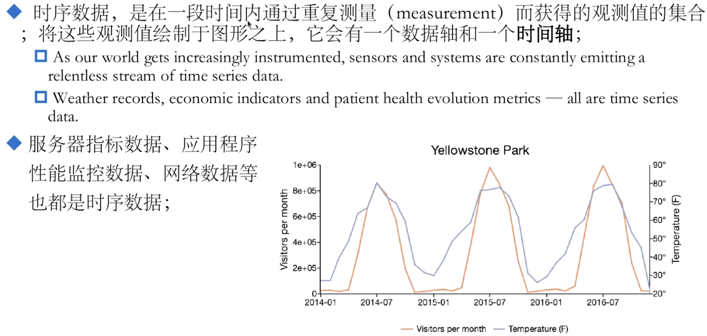
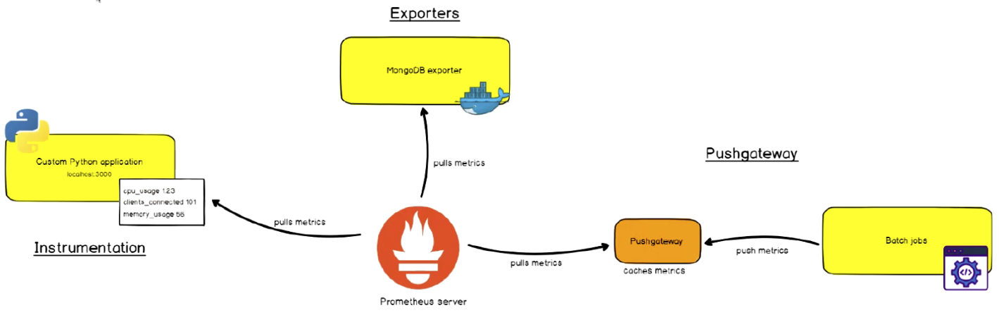
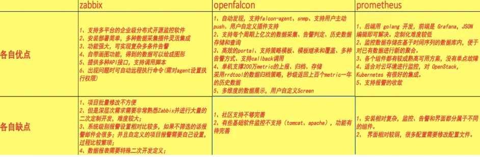
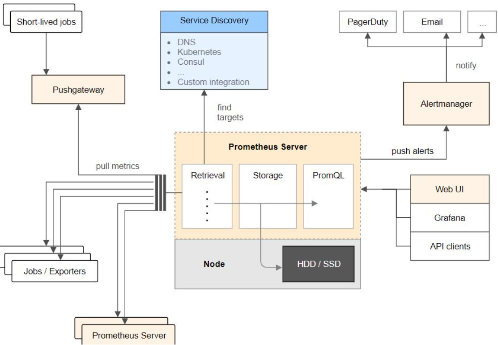

----------------------------------------------
> *Made By Herolh*
----------------------------------------------

# prometheus 基本使用 {#index}

[TOC]


 


--------------------------------------------

## 文档版本

|    时间    | 修改人 | 内容     |
| :--------: | :----: | :------- |
| 2021-09-24 | Herolh | 文档创建 |
|            |        |          |

教程参拷：

- [我在B站学运维之 Prometheus 监控入门基础介绍(1)](https://www.bilibili.com/read/cv13298406)
- [我在B站学运维之Prometheus监控基础环境安装配置与实践(2)](https://www.bilibili.com/read/cv13299364?from=articleDetail)


## 通用信息




## 什么是监控系统

### 监控系统发展史

- SNMP 监控时代

- 当今的监控系统

- 未来的监控系统

    ```shell
    DataOps
    AIOps
    ```


### 监控系统组件

监控系统功能组件

- 指标数据采集(抓取)
- 指标数据存储
- 指标数据趋势分析及可视化
- 告警 


### 监控体系(自底向上)

#### 系统层监控

- 系统监控

    > CPU、Load(系统负载)、Memory、Swap、Disk IO、Process、Kernel Parameters(内核参数的调整)…

- 网络监控

    > 网络设备、工作负载、网络延迟、丢包率…


#### 中间件及基础设施类监控

- 消息中间件

    > Kafka、RocketMQ、RabbitMQ 等

- Web 服务容器

    > Tomcat、Jetty…

- 数据库及缓存系统

    > MySQL、PostgreSQL、 mogoDB、 ElasticSearch、Redis…

- 数据库连接池

    > ShardingSpere…

- 存储系统

    > Ceph…


#### 应用层监控

> 用于衡量应用程序代码的状态和性能


#### 业务层监控

- 用于衡量应用程序的价值， 例如电子商务网站上的销量。
- QPS、DAU日活、转化率等；
- 业务接口： 登陆数、注册数、订单量、搜索量和支付量等。


### 云原生时代的可观测性

#### 可观察性系统

- 指标监控( metrics ): 随时间推移产生的一些与监控相关的可聚合数据点；
- 日志监控( logging ): 离散式的日志或事件;
- 链路监控( tracing ): 分布式应用调用链跟踪; 


CNCF 将可观测性和数据分析归类一个单独的类别，且划分为4个子类：

- 监控系统

    > 以 Prometheus 为代表

- 日志系统

    > 以 ElasticStack 和 PLG Stack 等为代表

- 分布式调用链跟踪系统

    > 以 ZipKin、Jaeger、 SkyWalking、Pinpoint 等为代表

- 混沌工程系统

    > 以 ChaosMonkey 和 ChaosBlade 等为代表


### 著名的监控方法论

#### Google 的四个黄金指标

> ==常用于在服务级别帮助衡量终端用户体验、服务中断、业务影响层面的问题==；适用于应用及服务监控

- **延迟( Latency )**

    - 服务勤秋所需要的时长，例如 HTTP 请求平均延时；
    - 需要区分失败请求和成功请求；

- **流量( Traffic )**

    > 衡量服务的容量需求，例如每秒处理的 HTTP 请求数或数据库系统的事务数量；

- **错误( Errors )**

    > 请求失败的速率，用于衡量错误发生的情况：
    >
    > 例如： HTTP 500 储物数等显式失败， 返回错误内容或无效内容等隐式失败， 以及由策略原因导致的失败(如强制要求响应时间超过 30 毫秒的请求示为错误)

- **饱和度( Saturation )**

    > 衡量资源的使用情况， 用于表达应用程序有多满， 例如内存、CPU、I/O、磁盘等资源的使用量。


#### NetFlix 的 USE 方法

> 全称为 “Utilization Saturation and Errors Method”， ==主要用于分析系统性能问题， 帮助用户快速识别资源瓶颈以及错误的方法==；应用于主机指标监控

- **使用率( Utilization )**

    - 关注系统资源的使用情况。这里的资源主要包括但不限于： CPU、内存、网络、磁盘等。
    - 100% 的使用率通常是系统性能瓶颈的标志

- **饱和度( Saturation )**

    例如 CPU 的平均排队长度， 这里主要是针对资源的饱和度(不同与4大黄金信号)

    任何资源在某种程度上的饱和都可能导致系统性能的下降

- **错误( Errors )**

    > 错误计数。例如： 网卡在数据包传输过程中检测到的以太网网络冲突了14次。


#### Weave Cloud 的 RED 方法

> Weave Cloud 基于 Google 的四个黄金指标的原则下结合 Prometheus 以及 K8s 容器实践， 细化和总结的方法论， 特别适合于云原生应用以及微服务架构应用的监控和度量。==RED 方法可以有效地帮助用户衡量云原生以及微服务应用下的用户体验问题。==

- (Request)Rate: 每秒接收的请求数；
- (Request)Errors: 每秒失败的请求数
- (Request)Duration: 每个请求所花费的时长；


## 简介
&emsp;&emsp;[Prometheus](https://prometheus.io/) 是一个由前 google 员工 2015 年正式发布开源的云原生基于指标的监控系统以及告警系统，泛义上包括监控，告警，时序数据库(TSDB)，各种指标收集器(Exporter)组成。现在最常见的 Kubernetes 容器管理系统中，通常会搭配 Prometheus 进行监控, 所以它主要用于容器监控和 k8s 集群监控以及云环境的监控(OpenStack)。
&emsp;&emsp;2016年 Prometheus 加入了云原生计算基金会( Cloud Native Computing Foundation, CNCF )，成为 kubernetes 之后的第二个托管项目 google SRE 的书内也曾提到跟他们 BorgMon 监控系统相似的实现是 Prometheus。
&emsp;&emsp;官网介绍: 从度量到洞察使用领先的开源监控解决方案。 

- 首先 Prometheus 是一款时序(time series) 数据库；但它的功能不止步于 TSDB， 而是一款设计用于进行目标( Target ) 监控的关键组件


### Prometheus 是如何工作

> prometheus 支持通过三种类型的途径从目标抓取( Scrape )指标数据

- Exporters
- Instrumentation
- Pushgateway




### prometheus 优缺点
#### 优点说明:
- 定制化难度低，后端采用Go语言开发、前端可用Grafana直接进行Json编辑
- 开箱即用的各种服务发现机制，可以自动发现监控端点
- 专为监控指标数据设计的高性能时序数据库TSDB，单机单实例支持数十万监控项/每秒
- 强大易用的查询语言PromQL以及丰富的聚合函数便于对已有数据进行新的聚合
- 生态完善有各种现成的开源Exporter实现，自定义的监控指标也非常简单
- 配置灵活的告警规则，支持告警分组、抑制、静默、路由等等高级功能
- 高可用的架构核心组件都有高可用解决方案
- 强大的功能除了云平台之外还支持主机、各种db资源、web网站、dns、网络延时、端口连通性、各种语言写的程序监控等等
- 成熟的社区和健全的生态


#### 缺点说明:
- 安装相对复杂、监控、告警和界面都分属于不同的组件。
- 没有任何监控告警之外的功能(用户/角色/权限控制等等),需要多配置必须在配置文件中修改。
- 通过 HTTP 拉取监控数据效率不够高


#### 补充

Tips: 保有量最多的三种监控系统(Zabbix、Openfalcon、Promethes)方式对比：




## Prometheus 架构

&emsp;&emsp;Prometheus 架构由客户端在被监控系统上利用导出器采集指标数据，在服务端配置静态目标或者动态的服务发现，此时 Prometheus 根据抓取频率进行数据的拉取(exporter)和推送(pushgateway), 然后将抓取的数据存储到时序数据库(TSDB)之中，再利用 Grafana 的仪表盘展示 Prometheus 服务中的数据，同时设定记录规则(PromQL 表达式)和告警规则(频率)并发送给 alertmanager 进行发送报警事件到运维人员手中，最终可能还需要进行数据的持久化默认的是本地存储但可以通过远程读写的 API 让其他系统也可接入采集存储数据。




### 组件说明

#### Prometheus server 

> 主要负责数据采集和存储，提供PromQL查询语言的支持 (默认端口: 9090)


#### exporters 
> 监控指标采集器，支持数据库、硬件、消息中间件、http 服务器、jmx 等 (默认端口:)
> prometheus官方提供了很多不同类型的exporter，[列表地址]( https://prometheus.io/docs/instrumenting/exporters/)


##### node-exporter
> node_exporter 在被监控节点安装，抓取主机监控信息，并对外提供 http 服务，供prometheus 抓取监控信息。[项目及文档地址](https://github.com/prometheus/node_exporter)

```shell
node-exporter --help 		# 查看开启了哪些监控指标
```


###### CPU 使用率
> 每台主机 CPU 在5 分钟之内的平均使用率

```shell
(1- avg (irate(node_cpu_seconds_total{mode='idle'}[5m])) by (instance)) * 100

# 备注
node_cpu_seconds_total{mode='idle'}         		# 当前主机的空闲CPU
node_cpu_seconds_total{mode='idle'}[5m]					# 5分钟内主机的空闲 CPU
rate(node_cpu_seconds_total{mode='idle'}[5m])		# 速率计算
avg by (instance) rate(node_cpu_seconds_total{mode='idle'}[5m]) # 平均值
# 使用率
(1 - avg by (instance) rate(node_cpu_seconds_total{mode='idle'}[5m])) *100 
```


###### CPU 饱和度

> 跟踪 CPU 的平均负载就能获取到相关主机的 CPU 的饱和度， 实际上， 他是将主机上的 CPU 数量考虑在内的一段时间内的平均运行队列长度

平均负载少于 CPU 的数量是正常情况， 而长时间内超过 CPU 的数量则表示CPU 已饱和


###### 内存使用率

> node_exporter 暴露了多个以 node_memory 为前缀的指标， 我们重点关注如下几个：

-  node_memery_MemTotal_bytes( 总空间 )
-  node_memery_MemFree_bytes( 空闲空间 )
-  node_memery_Buffers_bytes
-  node_memery_Cached_bytes

计算使用率：

- 可用空间： 上面后三个指标之和

    ```shell
    node_memory_MemFree_bytes + node_memory_Buffers_bytes + node_memory_Cached_bytes
    ```

- 已用空间：总空间减去可用空间

    ```shell
    node_memory_MemTotal_bytes - (node_memory_MemFree_bytes + node_memory_Buffers_bytes + node_memory_Cached_bytes)
    ```

- 使用率： 已用空间除以总空间

    ```shell
    (node_memory_MemTotal_bytes - (node_memory_MemFree_bytes + node_memory_Buffers_bytes + node_memory_Cached_bytes)) / node_memory_MemTotal_bytes * 100
    ```


##### mysql-exporter


 


#### alertmanager 

> 用来进行报警


#### prometheus_cli

> 命令行工具 (默认端口: 9093)


#### Web UI 

> 原生UI功能较为单一，常常采用Grafana这个跨平台的开源的分析和可视化工具 (默认端口: 3000)


#### PushGateWay 

> 跨网段被监控主机指标采集数据转发到网关代理等待Server的Pull。


#### Time Series DataBase :

> 时序数据库(TSDB)用于保存时间序列（按时间顺序变化）的数据,每条记录都有完整的时间戳，基于时间的操作都比较方便


采用时序数据库(TSDB)的优点?

1.时间作为他的主轴，数据按顺序到达。

2.大多数操作是插入新数据，偶尔伴随查询，更新数据比较少。

3.时间序列数据累计速度非常快，更高的容纳率、更快的大规模查询以及更好的数据压缩。

4.TSDB 通常还包括一些共通的对时间序列数据分析的功能和操作:数据保留策略、连续查询、灵活的时间聚合等。 