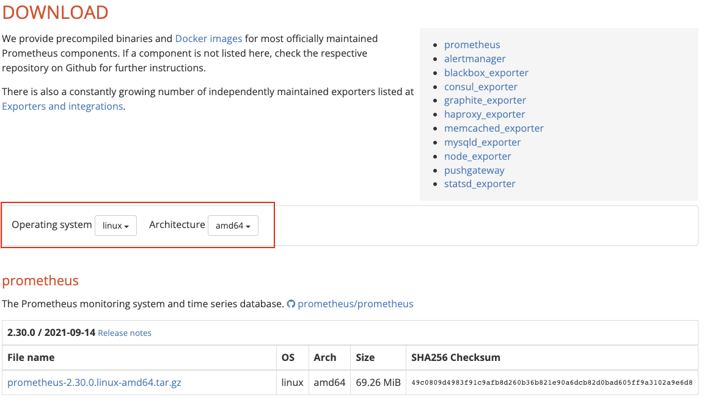

----------------------------------------------
> *Made By Herolh*
----------------------------------------------

# Prometheus 的部署 {#index}

[TOC]


 


--------------------------------------------

## 文档版本

|    时间    | 修改人 | 内容     |
| :--------: | :----: | :------- |
| 2021-09-25 | Herolh | 文档创建 |
|            |        |          |


## 简介

## 安装

### Linux

#### 下载可执行文件

[官方下载地址](https://prometheus.io/download/)



```shell
sudo tar xf prometheus-2.30.0.linux-amd64.tar.gz -C /usr/local/
cd /usr/local/
ln -sv prometheus-2.30.0.linux-amd64.tar.gz prometheus
cd prometheus
./prometheus
```

打开浏览器访问：

```shell
http://127.0.0.1:9090/metrics				# prometheus 程序自身的指标数据
http://127.0.0.1:9090/targets
http://127.0.0.1:9090/gragh
```


## 默认配置文件

```shell
# my global config
global:
  scrape_interval: 15s      # 将抓取间隔设置为每 15 秒一次。 默认为每 1 分钟一次。
  evaluation_interval: 15s  # 每 15 秒评估一次规则。 默认为每 1 分钟一次。
  # scrape_timeout is set to the global default (10s).

# 警报管理器配置
alerting:
  alertmanagers:
    - static_configs:
        - targets:
          # - alertmanager:9093

# 一次加载规则并根据全局 “evaluation_interval” 定期评估它们。
rule_files:
  # - "first_rules.yml"
  # - "second_rules.yml"

# 一个只包含一个要抓取的端点的抓取配置:
# Here it's Prometheus itself.
scrape_configs:
  # 作业名称作为标签“job=<job_name>” 添加到从此配置中抓取的任何时间序列中。
  - job_name: "prometheus"

    # metrics_path defaults to '/metrics'
    # scheme defaults to 'http'.

    static_configs:
      - targets: ["localhost:9090"]
```

