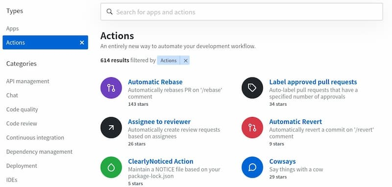
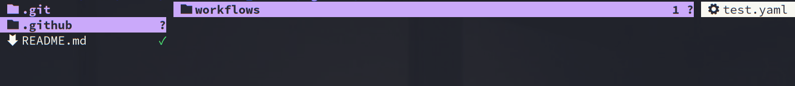
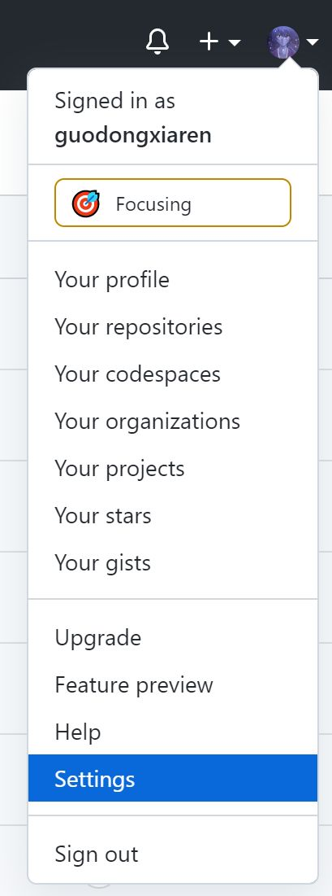
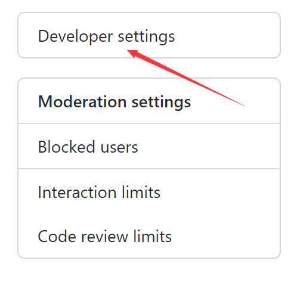
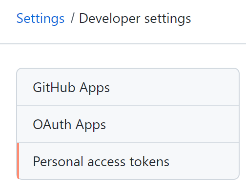
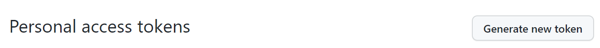
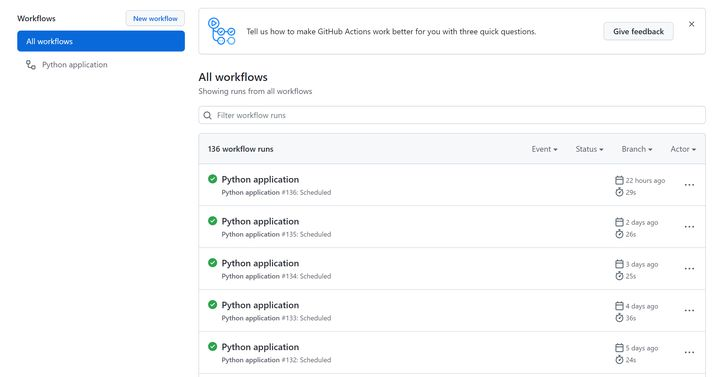
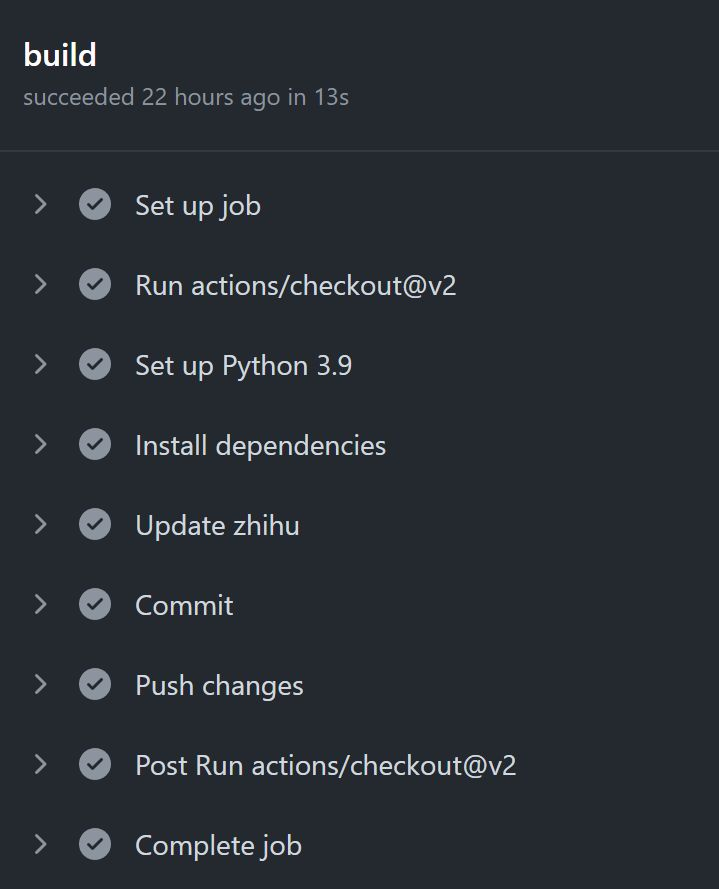

----------------------------------------------
> *Made By Herolh*
----------------------------------------------

# Github Action {#index}

[TOC]


 


--------------------------------------------

## 文档版本

|    时间    | 修改人 | 内容     |
| :--------: | :----: | :------- |
| 2021-11-23 | Herolh | 文档创建 |
|            |        |          |


## 简介

> [github action 官方文档](https://docs.github.com/en/actions)
> [知乎- 果冻虾仁 - 白嫖github的Action做定时任务](https://zhuanlan.zhihu.com/p/395044367)
> [阮一峰的网络日志 - GitHub Actions 入门教程](https://www.ruanyifeng.com/blog/2019/09/getting-started-with-github-actions.html)


&emsp;&emsp;[GitHub Actions](https://github.com/features/actions) 是 GitHub 的[持续集成服务](https://www.ruanyifeng.com/blog/2015/09/continuous-integration.html)，于2018年10月[推出](https://github.blog/changelog/2018-10-16-github-actions-limited-beta/)。，可以用于给项目做 CI/CD。原先你如果有这个需求，可能要借助 Travis 等三方网站。


### GitHub Actions 是什么

&emsp;&emsp;大家知道，持续集成由很多操作组成，比如抓取代码、运行测试、登录远程服务器，发布到第三方服务等等。GitHub 把这些操作就称为 actions。很多操作在不同项目里面是类似的，完全可以共享。GitHub 注意到了这一点，想出了一个很妙的点子，允许开发者把每个操作写成独立的脚本文件，存放到代码仓库，使得其他开发者可以引用。
&emsp;&emsp;如果你需要某个 action，不必自己写复杂的脚本，直接引用他人写好的 action 即可，整个持续集成过程，就变成了一个 actions 的组合。这就是 GitHub Actions 最特别的地方。GitHub 做了一个[官方市场](https://github.com/marketplace?type=actions)，可以搜索到他人提交的 actions。另外，还有一个 [awesome actions](https://github.com/sdras/awesome-actions) 的仓库，也可以找到不少 action。



&emsp;&emsp;上面说了，每个 action 就是一个独立脚本，因此可以做成代码仓库，使用`userName/repoName` 的语法引用 action。比如，`actions/setup-node` 就表示 `github.com/actions/setup-node` 这个[仓库](https://github.com/actions/setup-node)，它代表一个 action，作用是安装 Node.js。事实上，GitHub 官方的 actions 都放在 [github.com/actions](https://github.com/actions) 里面。
&emsp;&emsp;既然 actions 是代码仓库，当然就有版本的概念，用户可以引用某个具体版本的 action。下面都是合法的 action 引用，用的就是 Git 的指针概念，详见[官方文档](https://help.github.com/en/articles/about-actions#versioning-your-action)。

```shell
actions/setup-node@74bc508 # 指向一个 commit
actions/setup-node@v1.0    # 指向一个标签
actions/setup-node@master  # 指向一个分支
```


### 基本概念

GitHub Actions 有一些自己的术语。

- **workflow** （工作流程）：持续集成一次运行的过程，就是一个 workflow。
- **job** （任务）：一个 workflow 由一个或多个 jobs 构成，含义是一次持续集成的运行，可以完成多个任务。
- **step**（步骤）：每个 job 由多个 step 构成，一步步完成。
- **action** （动作）：每个 step 可以依次执行一个或多个命令（action）。


### 使用限制

- 每个仓库只能同时支持 20 个 workflow 并行。
- 每小时可以调用 1000 次 GitHub API 。
- 每个 job 最多可以执行 6 个小时。
- 免费版的用户最大支持 20 个 job 并发执行，macOS 最大只支持 5 个。
- 私有仓库每月累计使用时间为 2000 分钟，超过后$ 0.008/分钟，公共仓库则无限制。
- 操作系统方面可选择 Win­dows server、Linux、ma­cOS，并预装了大量软件包和工具。


## 基本使用

### workflow 文件

&emsp;&emsp;GitHub Actions 的配置文件叫做 workflow 文件，存放在代码仓库的 `.github/workflows` 目录。workflow 文件采用 [YAML 格式](https://www.ruanyifeng.com/blog/2016/07/yaml.html)，文件名可以任意取，但是后缀名统一为 `.yml`，比如 `foo.yml`。一个库可以有多个 workflow 文件。GitHub 只要发现 `.github/workflows` 目录里面有 `.yml` 文件，就会自动运行该文件。workflow 文件的配置字段非常多，详见[官方文档](https://help.github.com/en/articles/workflow-syntax-for-github-actions)。下面是一些基本字段。


#### name

> `name`字段是 workflow 的名称。如果省略该字段，默认为当前 workflow 的文件名。

```yaml
name: GitHub Actions Demo
```


#### on

> `on` 字段指定触发 workflow 的条件，通常是某些事件。完整的事件列表，请查看[官方文档](https://help.github.com/en/articles/events-that-trigger-workflows)。除了代码库事件，GitHub Actions 也支持外部事件触发，或者定时运行。

```yaml
on: push
# 上面代码指定，`push` 事件触发 workflow。
```

`on` 字段也可以是事件的数组。

```yaml
on: [push, pull_request]
# 上面代码指定，push 事件或 pull_request 事件都可以触发 workflow。
```

指定触发事件时，可以限定分支或标签。

```yaml
on:
  push:
    branches:    
      - master

# 上面代码指定，只有`master`分支发生`push`事件时，才会触发 workflow。
```


#### jobs

> workflow 文件的主体是`jobs`字段，表示要执行的一项或多项任务。

`jobs` 字段里面，需要写出每一项任务的 `job_id`，具体名称自定义。`job_id` 里面的 `name` 字段是任务的说明。

```yaml
jobs:
  my_first_job:
    name: My first job
  my_second_job:
    name: My second job
# 上面代码的 jobs 字段包含两项任务，job_id 分别是 my_first_job 和 my_second_job
```


##### needs

> `needs` 字段指定当前任务的依赖关系，即运行顺序。

```yaml
jobs:
  job1:
  job2:
    needs: job1
  job3:
    needs: [job1, job2]
# 上面代码中，job1必须先于job2完成，而job3等待job1和job2的完成才能运行。因此，这个 workflow 的运行顺序依次为：job1、job2、job3。
```


##### runs-on

> `runs-on`字段指定运行所需要的虚拟机环境。它是必填字段。目前可用的虚拟机如下:
>
> ```shell
> ubuntu-latest，ubuntu-18.04 或 ubuntu-16.04
> windows-latest，windows-2019 或 windows-2016
> macOS-latest或macOS-10.14
> ```


下面代码指定虚拟机环境为 ubuntu-18.04。

```yaml
runs-on: ubuntu-18.04
```


##### steps

> `steps` 字段指定每个 Job 的运行步骤，可以包含一个或多个步骤。每个步骤都可以指定以下三个字段。

```yaml
jobs.<job_id>.steps.name：步骤名称。
jobs.<job_id>.steps.run：该步骤运行的命令或者 action。
jobs.<job_id>.steps.env：该步骤所需的环境变量。
```


#### 范例

> 下面代码中，`steps`字段只包括一个步骤。该步骤先注入四个环境变量，然后执行一条 Bash 命令。

```yaml
name: Greeting from Mona
on: push

jobs:
  my-job:
    name: My Job
    runs-on: ubuntu-latest
    steps:
    - name: Print a greeting
      env:
        MY_VAR: Hi there! My name is
        FIRST_NAME: Mona
        MIDDLE_NAME: The
        LAST_NAME: Octocat
      run: |
        echo $MY_VAR $FIRST_NAME $MIDDLE_NAME $LAST_NAME.
```


### 新建目录和配置文件

&emsp;&emsp;Github Action 使用 yaml 格式做配置。首先你要在你的 Github 仓库中建立一下目录：`.github/workflows/` 在workflows 目录中新增 yaml 配置文件，文件名任意。通过目录名可以看出 Github 将此类任务称为“工作流”。




### 指定工作流名称

编辑该yaml，先指定一下工作流的名称：

```shell
name: xxxx
```


### 配置触发的事件

&emsp;&emsp;配置的内容首先需要绑定一个事件（比如git push、merge、或者提交pull request），然后指定一系列动作（脚本命令）。当对应事件触发的时候，就会自动执行你预设的动作了。比如：

```yaml
on:
  push:
    branches: [ master ]
  pull_request:
    branches: [ master ]
```

这个配置就是指定当向 master 分支 push 代码或提交 pull request 的时候触发。当然你也可以不指定分支，比如：

```shell
on: [push]
```

表示只要有push事件的时候就触发该工作流。

当然了，不止是 push 的时候才触发，也可以进行定时任务，所以Github Action其实也支持直接配置定时任务！

```shell
on:
  schedule:
    - cron: "0 2 * * *"
```

schedule 下面可以配置多个定时的时间，语法和我们常用的 crontab 相同。上面这个任务表示每天 2:00 执行。

> 不过这里有个要注意点地方就是，Github 毕竟是国外的产品，**这里的定时任务指定的时间和我们中国的时区是有时差的**。北京时间比 Github 所使用时区快 8 个小时。比如 7 月 1 号 23 点，github时间是7月1号 15 点。所以我们可以配置成 15 点或 16 点执行（对应北京时间的夜里 11 点、12 点）。


### 配置任务执行的系统环境

任务以 jobs 开始，你可以指定一下任务运行的系统环境。

```shell
jobs:
  build:
    runs-on: ubuntu-latest
```

**当前（2021年）**支持的系统环境有：

- `ubuntu-latest`, `ubuntu-18.04` 或 `ubuntu-16.04`
- `windows-latest` 或 `windows-2019`
- `macos-latest` 或 `macos-10.15`


### 配置具体的任务步骤

在 jobs -> build -> steps下面可以新增步骤。steps 可以有多个，比如：

```shell
jobs:
  build:
    runs-on: ubuntu-latest    
  steps:
    - uses: actions/checkout@v2
    - name: Set up Python 3.9
      uses: actions/setup-python@v2
      with:
        python-version: 3.9

    - name: Install dependencies
      run: |
        python -m pip install --upgrade pip
        pip install requests
```

这是两个步骤（或者说动作）分别表示 checkout 代码，配置 python 环境，以及安装依赖库。我的脚本依赖requests，所以我在这里用 pip 命令安装了一下。

每个步骤也都有一个 name: 表示该步骤的名称。

run: 后面添加你自己要执行的命令，如果有多条命令，用| 换行。

如果只有一行命令，可以直接写作run: 后面

接下来是：

```shell
    - name: Update zhihu
      run: |
        cd zhihu
        sh run.sh
```

进入我项目的目录，去执行 run.sh 脚本，脚本内容这里就不介绍了。大概就是获取我的知乎粉丝数和点赞数，然后更新到一个 data.csv 文件中。继续：

```yaml
    - name: Commit
      run: |
        git config --global user.email guodongxiaren@163.com
        git config --global user.name guodongxiaren
        git add .
        git commit -m"action:`date`"
        git pull --rebase
```

这一步显而易见，就是初始化git账号，并且对项目中的文件做一次 add 和 commit。因为我上一步的脚步执行后，修改了 data.csv 文件。

```shell
    - name: Push changes
      uses: ad-m/github-push-action@master
      with:
        github_token: ${{ secrets.GITHUB_TOKEN }}
```

这一步就是将该 commit，push 到 Github 的云端仓库了。这样我就能通过查看 Github 上该仓库中 data.csv，观察我的数据变化情况了。当然你可能会疑问这里的 github_token 是干嘛的？

这是因为一般我们 push 修改到 Github，要么是通过密码，要么是通过提前配置好的 SSH 公钥免密提交。但是作为公开的工作流配置文件，我们显然不想公开自己的密码，而且也无法做到给工作流机器生成公钥，然后自动化的配置到自己的 Github 账号中。为此，Github 贴心的设计了 token 机制，其实在 Github Action 出现之前就有 token 机制，用于给你调用一些 Github 的开放 API 使用。如果你没有 token 要生成一个，步骤如下：

- 进入你账号的设置页面(即Settings）

    

- 选择`Developer settings`

    

- 选择 `Personal access tokens`

    

- 点击 `Generate new token`

    

- 设置名字为`GITHUB_TOKEN`，接着要勾选权限，勾选 `repo`,`admin:repo_hook`,`workflow` 即可，最后点击`Generate token`。

    这时通过 token 就可以提交了，而且还不需要把明文token写到配置中，只需要使用变量 `${{ secrets.GITHUB_TOKEN }}`。 `${{ }}` 这种形式的都是变量。


### 运行效果

配置好后，就可以等待运行了。第一次使用 Action 功能，你可能编辑的 yaml 有问题，最后就不要设置成一天跑一次了，可以设置成其他触发器，方便测试验证。每个工作流的执行都可以在这里查看：



可以看到我最近运行成功的任务，随便点一个之前成功运行的工作流（绿色✓的）进去给大家看一下。




