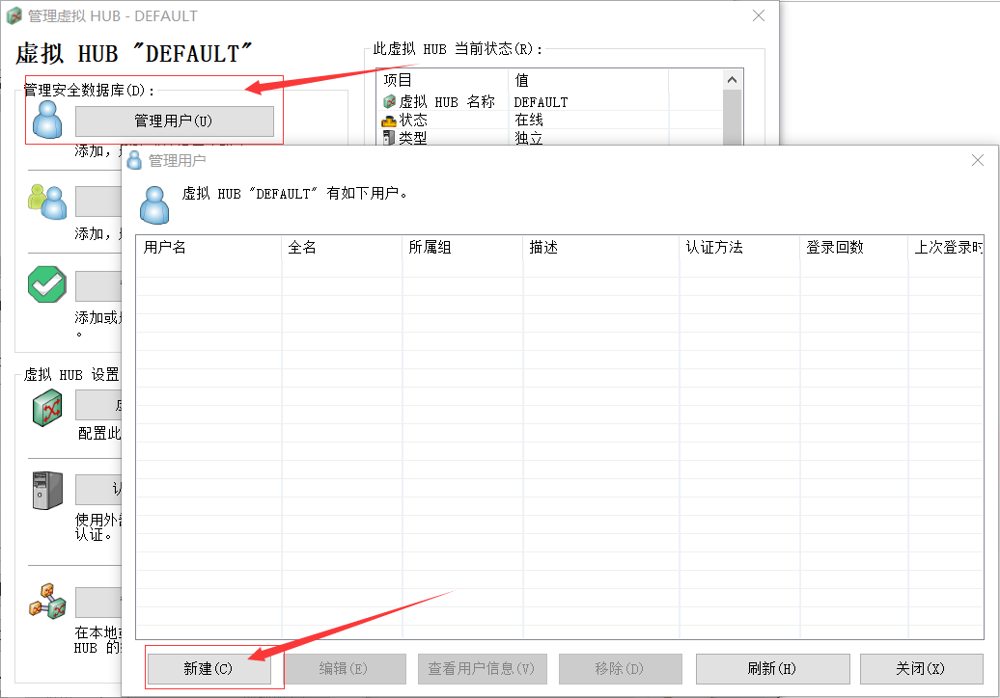

----------------------------------------------
> *Made By Herolh*
----------------------------------------------

# 目录 {#index}
[TOC]


--------------------------------------------

## 支撑的设备与器材

###  硬件环境支持

- 一台可以连外网的lniux服务器,这里采用内网Centos7.4( 也可以使用云服务器如阿里云等,但是外网服务器的网速会比较慢 )

- 可以连接校园网的 个人电脑 和 手机

    

### 软件环境支持

#### linux 服务器端

- GCC环境
- Softenter server


#### 个人电脑端

- Xshell 或者 secureCRT同类软件
- Softenter server
- openVPN GUI


#### 个人手机端

- openVPN


## 软体安装

### 个人电脑端

#### Xshell

- https://xshell.en.softonic.com/download
- 傻瓜式安装,安装步骤略.


#### OpenVPN

- https://swupdate.openvpn.org/community/releases/openvpn-install-2.4.5-I601.exe

- 傻瓜式安装,安装步骤略.


#### Softenter server

- 下载:http://softether-download.com/files/softether/v4.27-9668-beta-2018.05.29-tree/Windows/SoftEther_VPN_Server_and_VPN_Bridge/softether-vpnserver_vpnbridge-v4.27-9668-beta-2018.05.29-windows-x86_x64-intel.exe 

    

- 安装步骤

    

    下一步选第三个,只要管理工具就可以:

    

    其余傻瓜式安装即可,安装过程略


### linux服务器端

-  先通过 Xshell 或者 secureCRT同类软件连接上linux服务器

#### GCC环境

```
yum install gcc gcc-c++ make tar -y
```


#### Softenter server

##### 安装

- **软件下载**

    ```
    wget http://www.softether-download.com/files/softether/v4.25-9656-rtm-2018.01.15-tree/Linux/SoftEther_VPN_Server/64bit_-_Intel_x64_or_AMD64/softether-vpnserver-v4.25-9656-rtm-2018.01.15-linux-x64-64bit.tar.gz
    ```

    > 这里解析失败,我在个人电脑端下好,然后用 Xftp 上传上去


- **软件解压安装**

    ```
    tar zxvf softether-vpnserver-v4.25-9656-rtm-2018.01.15-linux-x64-64bit.tar.gz -C /usr/local/
    
    cd /usr/local/vpnserver/
    make
    ```


- **安装步骤**

    > --------------------------------------------------------------------
    >
    > SoftEther VPN Server (Ver 4.25, Build 9656, Intel x64 / AMD64) for Linux Install Utility
    > Copyright (c) SoftEther Project at University of Tsukuba, Japan. All Rights Reserved.
    >
    > --------------------------------------------------------------------
    >
    >
    > Do you want to read the License Agreement for this software ?
    >
    >   1. Yes
    >   2. No
    >
    > Please choose one of above number:

    以上是提示是否阅读license许可，那是必须读了，所以输入：1，回车。

    

    > ...
    >
    > -------------------
    >
    > NOTES
    >
    > SoftEther provides source codes of some GPL/LGPL/other libraries listed above on its web server. Anyone can download, use and re-distribute them under individual licenses which are contained on each archive file, available from the following URL:
    > http://uploader.softether.co.jp/src/
    >
    >
    > Did you read and understand the License Agreement ?
    > (If you couldn't read above text, Please read 'ReadMeFirst_License.txt'
    >  file with any text editor.)
    >
    >   1. Yes
    >   2. No
    >
    > Please choose one of above number: 

    继续输入：1，回车。

    

    > Did you agree the License Agreement ?
    >
    > 1. Agree
    > 2. Do Not Agree
    >
    > Please choose one of above number: 

    是否同意，输入：1，同意，回车。

    之后会执行编译安装过程，结束之后可以始用echo $?，如果返回0，说明安装成功。


##### 软件配置:

###### Softenter server 服务开启与关闭

```
./vpnserver start    #开启服务
./vpnserver stop     #关闭服务
```


###### 设置远程管理密码

启动成功后需要设置远程管理密码以便远程管理VPN服务器。运行`./vpncmd` 进入VPN的命令行：

```markdown
vpncmd command - SoftEther VPN Command Line Management Utility
SoftEther VPN Command Line Management Utility (vpncmd command)
Version 4.25 Build 9656   (English)
Compiled 2018/01/15 10:17:04 by yagi at pc33
Copyright (c) SoftEther VPN Project. All Rights Reserved.

By using vpncmd program, the following can be achieved.

1. Management of VPN Server or VPN Bridge
2. Management of VPN Client
3. Use of VPN Tools (certificate creation and Network Traffic Speed Test Tool)

Select 1, 2 or 3:
1

# 选择1，然后出现：
Specify the host name or IP address of the computer that the destination VPN Server or VPN Bridge is operating on.
By specifying according to the format 'host name:port number', you can also specify the port number.
(When the port number is unspecified, 443 is used.)
If nothing is input and the Enter key is pressed, the connection will be made to the port number 8888 of localhost (this computer).
Hostname of IP Address of Destination: 
# 输入 localhost:5555
# 这里需要选择地址和端口，我的云主机用了SSL占用了443端口，所以默认的443端口不能用，所以改用了5555端口，所以在这里输入localhost:5555，

# 然后出现：
If connecting to the server by Virtual Hub Admin Mode, please input the Virtual Hub name.
If connecting by server admin mode, please press Enter without inputting anything.
Specify Virtual Hub Name:
# [这里就是指定一个虚拟HUB名字，用默认的直接回车就行。]

Connection has been established with VPN Server "localhost" (port 5555).

You have administrator privileges for the entire VPN Server.

VPN Server>
```


这时需要输入 `ServerPasswordSet` 命令设置远程管理密码，确认密码后就可以通过Windows版的SoftEther VPN Server Manager远程管理了。

```markdown
VPN Server>ServerPasswordSet
ServerPasswordSet command - Set VPN Server Administrator Password
Please enter the password. To cancel press the Ctrl+D key.

Password: ****************
Confirm input: ****************

# wlzx@123
The command completed successfully.
```


##### 防火墙放行端口

最后需要在服务器防火墙上开启相关的端口，如果是云主机，还需要在控制台安全组放行对应的端口。这里配置的是firewall,放心443监听端口( 还可以设为5555,8888等端口 )：

```
添加
firewall-cmd --zone=public --add-port=443/tcp --permanent    （--permanent永久生效，没有此参数重启后失效）

重新载入
firewall-cmd --reload

查看
firewall-cmd --zone=public --query-port=443/tcp
```


## VPN Server Manager 远程管理配置

- 打开软件,点击新设置:


- 主机名填服务器的地址或域名，端口选择之前设置的5555，密码设置之前设置的管理密码：


- 确定后返回管理界面,点击连接,连接不成功的原因可能是你linux服务器的防火墙没放行相应端口 :


- 选择 **VPN的其他高级设置,点击关闭:

    

- 单击管理虚拟HUB(A)

    

- 1单击管理用户(U),新建一个用户:

    


- 创建虚拟NAT服务器


- 设置OpenVPN 客户端连接端口,并生成令牌

    

    

- 生成的令牌文件:

    


- 我们需要将以 `l3.ovpn` 结尾的文件提取出来,然后放在我们之前安装的 **OpenVPN GUI** 的 `config` 目录下


