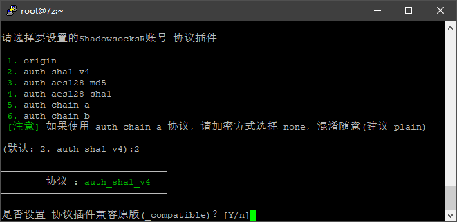

----------------------------------------------
> *Made By {Herolh}*
----------------------------------------------

# 基础安装 {#index}

[TOC]


--------------------------------------------

## CentOS6+/Debian6+/Ubuntu14 一键部署管理脚本

> [从零开始搭建一个ssr](https://www.7z7z7z.cn/index.php/2020/01/28/%E4%BB%8E%E9%9B%B6%E5%BC%80%E5%A7%8B%E6%90%AD%E5%BB%BA%E4%B8%80%E4%B8%AAssr/)

```shell
wget -N –no-check-certificate https://raw.githubusercontent.com/ToyoDAdoubi/doubi/master/ssr.sh && chmod +x ssr.sh && bash ssr.sh
```

输入管理命令:

```shell
bash ssr.sh
```


选择1，安装ssr：

设置端口和密码，端口任意，但不要0开头：


加密方式，选择加密方式，这里我选10


协议插件，选择协议插件，这里我选择2；

选择是否兼容原版，原版指的是ss客户端，这里我选择y



**注意：如果协议是origin，那么混淆也必须是plain；如果协议不是origin，那么混淆可以是任意的。有的地区需要把混淆设置成plain才好用。因为混淆不总是有效果，要看各地区的策略，有时候不混淆（plain）或者（origin和plain一起使用），让其看起来像随机数据更好。（特别注意：tls 1.2_ticket_auth容易受到干扰！请选择除tls开头以外的其它混淆！！！）**

混淆插件

进行混淆插件的设置后，会依次提示你对设备数、单线程限速和端口总限速进行设置，默认值是不进行限制，个人使用的话，选择默认即可，即直接敲回车键。


这里按照自己需要进行更改，图中所有为默认


部署，按y进行自动部署

