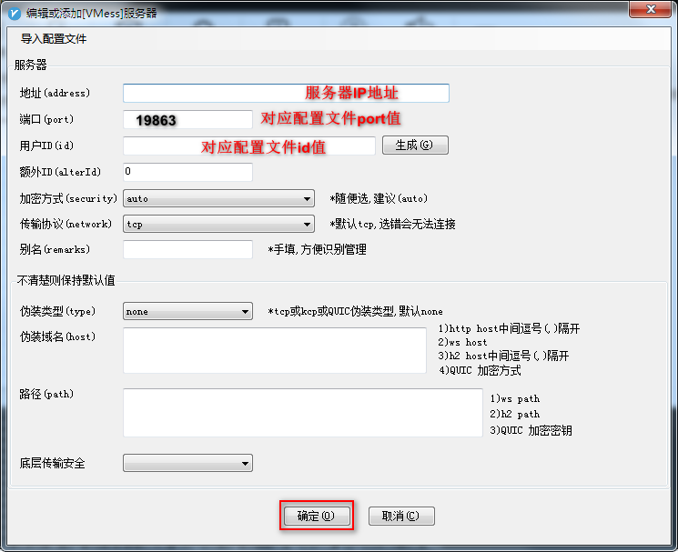
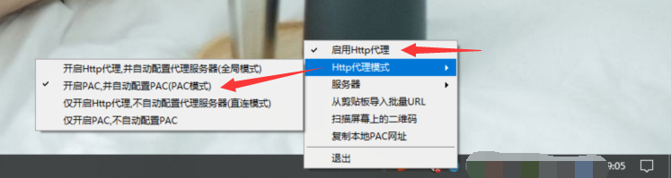

----------------------------------------------
> *Made By Herolh*
----------------------------------------------

# {Title} {#index}

[TOC]


 


--------------------------------------------

## 文档版本

|    时间    | 修改人 | 内容     |
| :--------: | :----: | :------- |
| 2021-12-13 | Herolh | 文档创建 |
|            |        |          |


## 简介

> 采集自 [【新手教程】2021最新V2Ray搭建图文教程，V2Ray一键搭建脚本！](https://www.itblogcn.com/article/1501.html)


## V2Ray 服务搭建

一键安装脚本：

```shell
bash <(curl -s -L https://git.io/v2ray-setup.sh)
```

显示以下信息代表安装成功（可直接用以下配置进行连接）(以下配置在链接时使用)：

```shell
---------- V2Ray 配置信息 -------------

 地址 (IP Address) = 141.*.*.*

 端口 (Port) = 8888

 用户ID (User ID / UUID) = 38b272ba-8a91-*-*-*

 额外ID (Alter Id) = 0

 传输协议 (Network) = tcp

 伪装类型 (header type) = none

---------- END -------------

V2Ray 客户端使用教程: https://git.io/v2ray-client

提示: 输入 v2ray url 可生成 vmess URL 链接 / 输入 v2ray qr 可生成二维码链接

---------- V2Ray vmess URL / V2RayNG v0.4.1+ / V2RayN v2.1+ / 仅适合部分客户端 -------------

vmess://ewoidiI6I*****g==
```


相关命令：

```shell
# 查看 V2Ray 配置信息
v2ray info   
# 修改 V2Ray 配置
v2ray config
# 生成 V2Ray 配置文件链接
v2ray link 
# 生成 V2Ray 配置信息链接
v2ray infolink
# 生成 V2Ray 配置二维码链接
v2ray qr 
# 修改 Shadowsocks 配置
v2ray ss 
# 查看 Shadowsocks 配置信息
v2ray ssinfo
# 生成 Shadowsocks 配置二维码链接
v2ray ssqr 
# 查看 V2Ray 运行状态
v2ray status
# 启动 V2Ray
v2ray start
# 停止 V2Ray
v2ray stop 
# 重启 V2Ray
v2ray restart
# 查看 V2Ray 运行日志
v2ray log 
# 更新 V2Ray
v2ray update 
# 更新 V2Ray 管理脚本
v2ray update.sh 
# 卸载 V2Ray
v2ray uninstall 
```


vmess 协议配置

查看配置文件(**该配置在后面链接时使用**)：

```shell
vim /etc/v2ray/config.json
```


## 客户端链接 V2Ray

**各平台的v2ray客户端地址：**

(✪ω✪)

### Windows v2ray 客户端：

**下载方式一：网盘(直接解压可用)**

【v2rayN】：https://cloud.degoo.com/share/f-Vljc2ZjhmcPyHbi5Pw0A 或 https://github.com/xyz690/cloudimg/blob/main/data/v2rayN-3.29.zip

解压【【【点击v2rayN.exe启动】】】

**下载方式二：GitHub**

客户端：下载[v2rayN.zip](https://github.com/2dust/v2rayN/releases/download/3.29/v2rayN.zip)

【[v2rayN.exe Github Releases](https://github.com/2dust/v2rayN/releases)】 https://github.com/2dust/v2rayN/releases/download/3.29/v2rayN.zip

内核：下载`v2ray-windows-64.zip`文件

【[v2ray-windows-64.zip Github Releases](https://github.com/v2ray/v2ray-core/releases)】 https://github.com/v2fly/v2ray-core/releases/download/v4.31.0/v2ray-windows-64.zip

对`v2ray-windows-64.zip` 和 `v2rayN`进行解压，然后将 `v2rayN` 目录下所有文件复制到`v2ray-windows-64`解压后的目录，即两个下载好的文件需要在同一目录。

【【【点击**v2rayN.exe**启动】】】

注意电脑右下角 V 图标，双击图标，点右上角 **服务器** ，添加[VMess]服务器。

(*^▽^*)(*^▽^*)(*^▽^*)(*^▽^*)(*^▽^*)(*^▽^*)

**进行配置:**

客户端的配置需要根据你的服务端进行相应的配置，因为你的服务端协议可能是vmess等。

如果你的服务端配置是协议vmess，则配置如下：



保存后，右键电脑右下角 V 图标



**(✪ω✪)**

### Android v2ray客户端：

**下载方式一：网盘(APK直接安装)**

【APK】：https://cloud.degoo.com/share/msgcYbsWQVoz2EIbSXr5bw 或 https://github.com/xyz690/cloudimg/blob/main/data/v2rayNG_1.4.13_arm64-v8a.apk

**下载方式二：GitHub**
一般手机是arm架构，我就直接给出对应客户端了，其他架构需要你去网上找设备相应的CPU架构并进行选择下载：
【[v2rayNG Github Releases](https://github.com/2dust/v2rayNG/releases)】https://github.com/2dust/v2rayNG/releases/download/1.4.13/v2rayNG_1.4.13_arm64-v8a.apk

**使用方法:**

```javascript
(1）打开 v2rayNG APP
(2）点击右上角 + 号
(3）选择 手动输入[Vmess]
(4）别名随意，地址(填服务器外网IP地址)，端口(你设置的V2Ray端口)，用户ID，额外ID:0，加密方式:auto，其他设置默认
(5）右上角 √ 保存
(6）右下角 V图标 点击启动.
(7）打开浏览器试试吧COPY
```

**(✪ω✪)**

### MacOS v2ray客户端:

https://github.com/Cenmrev/V2RayX/releases

**(✪ω✪)**

### Linux内核 v2ray客户端：

Debian、Ubantu、CentOS等电脑桌面发行版（不能完全通用，可以尝试一下）
https://github.com/jiangxufeng/v2rayL/releases
**(✪ω✪)**

### IOS v2ray客户端：

需要国外账号，推荐shadow（小火箭）rocket，quantumult（圈），kitsunebi

------

## 测试

打开浏览器，访问`www.google.com`，如下：


v2ray搭建教程到此结束，祝大家春风得意！