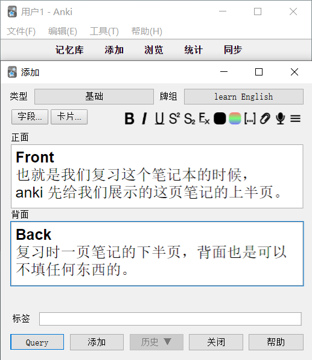
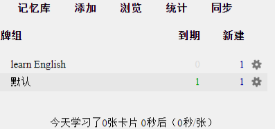
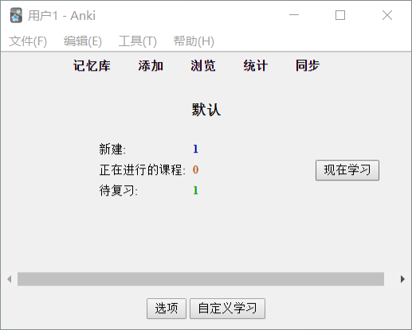
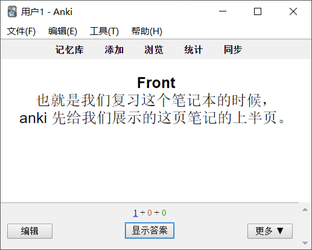
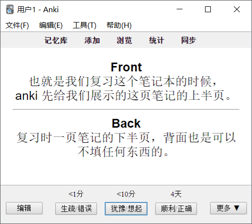
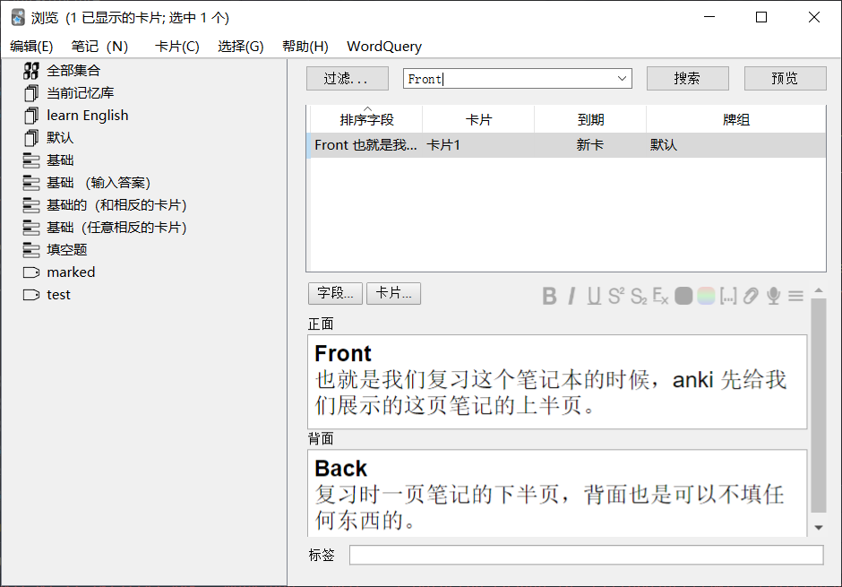

----------------------------------------------
> *Made By Herolh*
----------------------------------------------

# 基础使用 {#index}

[TOC]

[知乎 - Anki 怎么用？](https://www.zhihu.com/question/28335314/answer/428970652)

--------------------------------------------

## 记忆库

### 创建笔记

点击页面最上方，中间的“**添加**”，出现如下页面：

- **选择记忆库**

    > 这一页面的右上方，记得点击"牌组"，然后可以选择，你在哪个记忆库中记笔记；

- **编辑笔记**

    > 在上图中的 "正面" 和 "背面" 的空白之中，都可以做笔记，可以是打字、复制粘贴文字或者复制粘贴图片：

- **添加笔记**

    > 点击 "添加"，我们就完成了一页笔记，然后页面回复到之前的空白，可以继续做下一页笔记。如此重复即可。

### 复习笔记

- "到期" 是提醒你，有几张卡片（就是一页笔记）到复习时间了;
- "新建" 是指，我们在这个记忆库中，新添加了几张卡片（笔记）。

点击这个记忆库的名称，点击 "现在学习" 即可开始复习：

&emsp;&emsp;它只显示，我们在正面做的上半页笔记，点击页面最下方，中间的 "显示答案"，于是出现下半页笔记：

&emsp;&emsp;看到页面最下方中间的文字了嘛？如果你对这个知识点非常陌生，就选择1min/10min之后再复习一遍，如果非常熟悉，那就选择4天之后再复习。而"到期"会在4天后提醒你，该复习这页笔记了。

&emsp;&emsp;当你下一次复习时，它给你安排的时间间隔，会有所变化，总之还是很科学很灵活的，你有自己选择的余地。是不是很类似背单词软件？背错了就很快重来，对的话，就隔上几天再出现。

&emsp;&emsp;页面左下方的 "编辑"，可以用来随时修改、增删这页笔记的错漏之处，非常人性化。

### 检索笔记

&emsp;&emsp;Anki 还有别的用处，可以快速检索笔记，前提是你的笔记是文字版的。页面上方，中间右侧的“浏览”，点击之后：

就可以凭借某个关键词记忆，搜索到我们想要查询的某个知识点了～