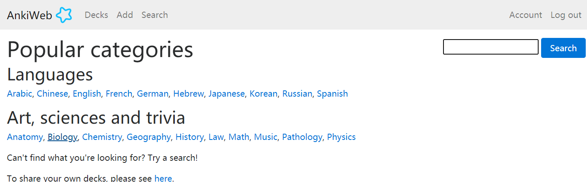

----------------------------------------------
> *Made By Herolh*
----------------------------------------------

# anki 安装 {#index}

[TOC]


--------------------------------------------

## 介绍

[官网](https://apps.ankiweb.net/)


需要注意：电脑版，使用这一流程即可下载；手机版，安卓机可搜索Ankidroid，苹果机在App Store搜索Anki(收费)，即可下载


## 注册

[ankiweb](https://ankiweb.net/)


## 同步


&emsp;&emsp;页面最下方，最左侧的 “获取牌组” 点击之后，会跳转到网页，我们可以根据自己需要，下载别人共享的记忆库。这么说大概能让你更好地理解：类似于，我们下载了一个电子书阅读器，可以去网上找别人共享的某种格式的电子书，进行阅读。



&emsp;&emsp;而页面最下方，中间的 **创建记忆库**，点击之后，就相当于自己去创建一本书/笔记，我们给这本书/笔记命名为：


## 安装

### windows


### arch

```shell
sudo pacman -S anki
```

